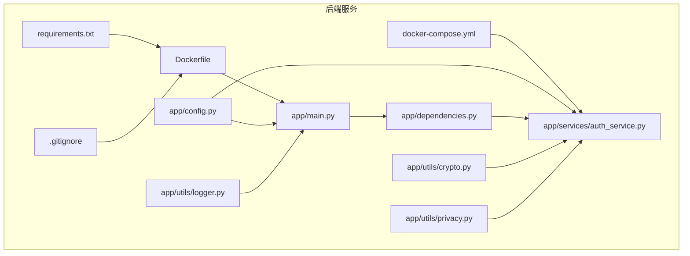
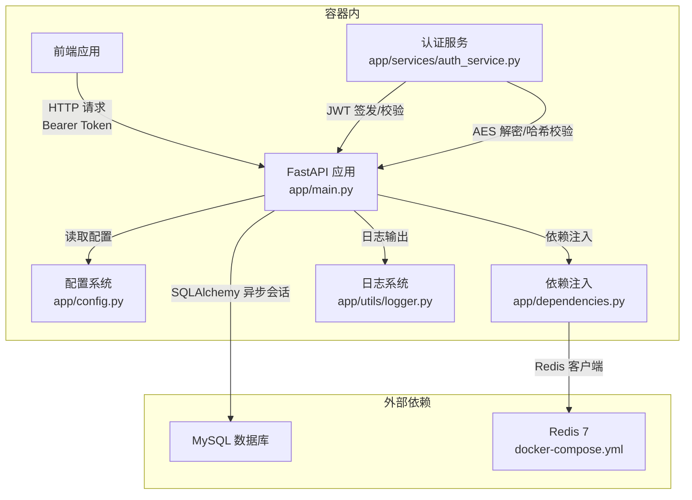
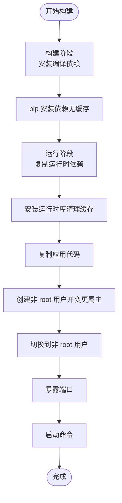
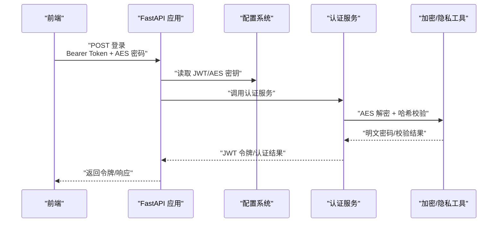
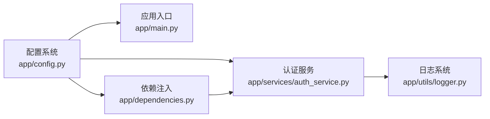

# 容器安全

<cite>
**本文引用的文件**
- [Dockerfile](file://service/ai_assistant/Dockerfile)
- [docker-compose.yml](file://service/ai_assistant/docker-compose.yml)
- [requirements.txt](file://service/ai_assistant/requirements.txt)
- [config.py](file://service/ai_assistant/app/config.py)
- [main.py](file://service/ai_assistant/app/main.py)
- [dependencies.py](file://service/ai_assistant/app/dependencies.py)
- [auth_service.py](file://service/ai_assistant/app/services/auth_service.py)
- [.gitignore](file://service/ai_assistant/.gitignore)
- [crypto.py](file://service/ai_assistant/app/utils/crypto.py)
- [privacy.py](file://service/ai_assistant/app/utils/privacy.py)
- [logger.py](file://service/ai_assistant/app/utils/logger.py)
</cite>

## 目录
1. [简介](#简介)
2. [项目结构](#项目结构)
3. [核心组件](#核心组件)
4. [架构总览](#架构总览)
5. [详细组件分析](#详细组件分析)
6. [依赖分析](#依赖分析)
7. [性能考虑](#性能考虑)
8. [故障排查指南](#故障排查指南)
9. [结论](#结论)
10. [附录](#附录)

## 简介
本文件面向“AI校园助手”项目的容器安全，围绕以下目标展开：Docker镜像安全配置（基础镜像、最小化原则、安全扫描）、容器运行时安全（用户权限、资源限制、只读文件系统）、敏感信息保护（环境变量加密、密钥管理、配置文件安全）、容器漏洞扫描与修复建议（静态分析与动态检测）、以及容器间通信安全配置与最佳实践。文档同时结合仓库现有代码与配置，给出可操作的加固建议。

## 项目结构
后端服务位于 service/ai_assistant，包含：
- Dockerfile：构建阶段与运行阶段分离的多阶段镜像
- docker-compose.yml：Redis缓存服务的编排与健康检查
- requirements.txt：Python依赖清单
- app/config.py：基于 pydantic-settings 的运行时配置模型
- app/main.py：FastAPI应用入口，含不安全默认值检测
- app/dependencies.py：依赖注入与认证中间件
- app/services/auth_service.py：JWT签发与校验、密码处理
- app/utils/*：加密、隐私、日志等工具模块
- .gitignore：敏感文件排除策略

**图表来源**
- [Dockerfile:1-49](file://service/ai_assistant/Dockerfile#L1-L49)
- [docker-compose.yml:1-31](file://service/ai_assistant/docker-compose.yml#L1-L31)
- [requirements.txt:1-22](file://service/ai_assistant/requirements.txt#L1-L22)
- [config.py:1-113](file://service/ai_assistant/app/config.py#L1-L113)
- [main.py:1-86](file://service/ai_assistant/app/main.py#L1-L86)
- [dependencies.py:1-109](file://service/ai_assistant/app/dependencies.py#L1-L109)
- [auth_service.py:1-253](file://service/ai_assistant/app/services/auth_service.py#L1-L253)
- [crypto.py:1-73](file://service/ai_assistant/app/utils/crypto.py#L1-L73)
- [privacy.py:1-23](file://service/ai_assistant/app/utils/privacy.py#L1-L23)
- [logger.py:1-53](file://service/ai_assistant/app/utils/logger.py#L1-L53)
- [.gitignore:1-36](file://service/ai_assistant/.gitignore#L1-L36)

**章节来源**
- [Dockerfile:1-49](file://service/ai_assistant/Dockerfile#L1-L49)
- [docker-compose.yml:1-31](file://service/ai_assistant/docker-compose.yml#L1-L31)
- [requirements.txt:1-22](file://service/ai_assistant/requirements.txt#L1-L22)
- [config.py:1-113](file://service/ai_assistant/app/config.py#L1-L113)
- [main.py:1-86](file://service/ai_assistant/app/main.py#L1-L86)
- [dependencies.py:1-109](file://service/ai_assistant/app/dependencies.py#L1-L109)
- [auth_service.py:1-253](file://service/ai_assistant/app/services/auth_service.py#L1-L253)
- [crypto.py:1-73](file://service/ai_assistant/app/utils/crypto.py#L1-L73)
- [privacy.py:1-23](file://service/ai_assistant/app/utils/privacy.py#L1-L23)
- [logger.py:1-53](file://service/ai_assistant/app/utils/logger.py#L1-L53)
- [.gitignore:1-36](file://service/ai_assistant/.gitignore#L1-L36)

## 核心组件
- 配置体系：通过 pydantic-settings 从 .env 文件加载敏感参数（数据库、Redis、JWT、AES、阿里云密钥等），并在运行时生成连接串。
- 认证与授权：基于 JWT 的 Bearer Token，区分学生与管理员角色；密码采用前端 AES-CBC 加密后传输，后端使用共享密钥解密并校验哈希。
- 缓存与会话：Redis 作为缓存与会话存储，支持密码保护与内存限制。
- 日志与审计：统一使用 Loguru 输出到控制台与文件，便于审计与问题定位。
- 构建与运行：多阶段 Dockerfile，运行阶段仅包含运行时依赖与应用代码，非 root 用户执行。

**章节来源**
- [config.py:1-113](file://service/ai_assistant/app/config.py#L1-L113)
- [main.py:18-34](file://service/ai_assistant/app/main.py#L18-L34)
- [dependencies.py:56-72](file://service/ai_assistant/app/dependencies.py#L56-L72)
- [auth_service.py:16-18](file://service/ai_assistant/app/services/auth_service.py#L16-L18)
- [docker-compose.yml:5-24](file://service/ai_assistant/docker-compose.yml#L5-L24)
- [logger.py:17-46](file://service/ai_assistant/app/utils/logger.py#L17-L46)
- [Dockerfile:22-48](file://service/ai_assistant/Dockerfile#L22-L48)

## 架构总览
下图展示容器内应用与外部依赖（数据库、Redis）的交互路径，以及认证流程与敏感数据处理链路。

**图表来源**
- [main.py:52-86](file://service/ai_assistant/app/main.py#L52-L86)
- [config.py:85-110](file://service/ai_assistant/app/config.py#L85-L110)
- [dependencies.py:36-50](file://service/ai_assistant/app/dependencies.py#L36-L50)
- [auth_service.py:125-169](file://service/ai_assistant/app/services/auth_service.py#L125-L169)
- [docker-compose.yml:5-24](file://service/ai_assistant/docker-compose.yml#L5-L24)
- [logger.py:17-46](file://service/ai_assistant/app/utils/logger.py#L17-L46)

## 详细组件分析

### Docker 镜像安全配置
- 基础镜像与分层
  - 使用 python:3.11-slim 作为构建与运行基础，减少攻击面。
  - 多阶段构建：构建阶段安装编译依赖，运行阶段仅复制运行时所需包，避免携带构建工具。
- 最小化原则
  - 仅安装运行所需的 libmariadb3 与 ffmpeg，清理 apt 缓存，缩小镜像体积。
  - pip 安装时禁用缓存，降低镜像层数与潜在污染风险。
- 镜像加速与可信性
  - 更换 APT 源与 pip 源为国内镜像，提升下载速度但需关注镜像可信性；建议在 CI 中启用镜像签名与校验。
- 运行用户与权限
  - 创建非 root 用户 appuser 并切换，降低特权攻击成本。
- 只读根文件系统与能力控制
  - 当前未启用只读根文件系统与 Linux 能力裁剪；建议在生产编排中开启，并按需授予网络/设备访问能力。
- 安全扫描实践
  - 建议在 CI 中集成镜像扫描（如 Trivy/Snyk），对基础镜像与依赖进行漏洞扫描；对构建产物进行 SBOM 生成与签名。

**图表来源**
- [Dockerfile:1-49](file://service/ai_assistant/Dockerfile#L1-L49)

**章节来源**
- [Dockerfile:2-19](file://service/ai_assistant/Dockerfile#L2-L19)
- [Dockerfile:22-48](file://service/ai_assistant/Dockerfile#L22-L48)

### 容器运行时安全设置
- 用户权限控制
  - 已创建非 root 用户并切换，建议在编排中固定用户 ID 与组 ID，避免容器逃逸后的权限扩大。
- 资源限制
  - 当前未设置 CPU/内存限制；建议在 docker-compose 或 Kubernetes 中添加 limits/requests，防止资源滥用。
- 只读文件系统
  - 当前未启用只读根文件系统；建议在生产中启用，并仅挂载必要的卷（如日志目录）。
- 健康检查与重启策略
  - Redis 提供健康检查与 unless-stopped 重启策略，建议为应用服务也增加健康检查端点。

**章节来源**
- [Dockerfile:42-44](file://service/ai_assistant/Dockerfile#L42-L44)
- [docker-compose.yml:18-22](file://service/ai_assistant/docker-compose.yml#L18-L22)

### 敏感信息保护
- 环境变量与密钥管理
  - 配置项覆盖 JWT_SECRET_KEY、AES_SECRET_KEY、DID_SALT、数据库/Redis/阿里云密钥等，均来自 .env。
  - 应用启动时检测不安全默认值并发出告警，提示在生产环境替换为强密钥。
- 密钥与密码处理
  - 前端使用 AES-CBC 加密密码，后端使用共享密钥解密后再做哈希校验，避免明文在网络中传输。
  - DID 生成使用盐值对真实 ID 进行单向哈希，用于脱敏与日志关联。
- 配置文件安全
  - .gitignore 排除了 .env，避免误提交敏感信息；建议在 CI 中禁止推送 .env 到仓库。
- 日志与审计
  - 统一日志落盘，便于审计；注意不要在日志中输出敏感字段。

**图表来源**
- [main.py:18-34](file://service/ai_assistant/app/main.py#L18-L34)
- [config.py:32-51](file://service/ai_assistant/app/config.py#L32-L51)
- [auth_service.py:125-169](file://service/ai_assistant/app/services/auth_service.py#L125-L169)
- [crypto.py:39-72](file://service/ai_assistant/app/utils/crypto.py#L39-L72)
- [privacy.py:9-22](file://service/ai_assistant/app/utils/privacy.py#L9-L22)

**章节来源**
- [main.py:18-34](file://service/ai_assistant/app/main.py#L18-L34)
- [config.py:32-51](file://service/ai_assistant/app/config.py#L32-L51)
- [crypto.py:17-22](file://service/ai_assistant/app/utils/crypto.py#L17-L22)
- [privacy.py:9-22](file://service/ai_assistant/app/utils/privacy.py#L9-L22)
- [.gitignore:17-18](file://service/ai_assistant/.gitignore#L17-L18)

### 容器间通信安全配置
- Redis 通信
  - 通过密码保护（requirepass）与受限内存策略（maxmemory、maxmemory-policy）降低未授权访问与资源耗尽风险。
  - 建议仅在内部网络暴露端口，必要时使用 TLS 与网络隔离。
- CORS 与前端信任域
  - CORS 允许来源可通过配置项控制；生产环境应限制为受信域名，避免跨站风险。
- 网络隔离
  - 通过自定义网络 backend 将服务隔离，建议进一步限制出站流量与入站白名单。

**章节来源**
- [docker-compose.yml:5-24](file://service/ai_assistant/docker-compose.yml#L5-L24)
- [config.py](file://service/ai_assistant/app/config.py#L17)

### 容器漏洞扫描与修复建议
- 静态分析
  - 依赖清单扫描：对 requirements.txt 中的版本进行安全评估，锁定已知高危版本。
  - 配置扫描：检查 .env 是否存在弱口令、默认密钥等。
- 动态检测
  - 运行时渗透测试：对鉴权接口、敏感路由进行自动化测试。
  - 日志与告警：启用异常登录、解密失败、哈希校验失败等告警。
- 修复建议
  - 升级依赖至安全版本；替换不安全默认密钥；启用只读根文件系统与最小权限能力；为 Redis 启用 TLS；限制 CORS 与网络暴露范围。

**章节来源**
- [requirements.txt:1-22](file://service/ai_assistant/requirements.txt#L1-L22)
- [main.py:18-34](file://service/ai_assistant/app/main.py#L18-L34)
- [docker-compose.yml:11-15](file://service/ai_assistant/docker-compose.yml#L11-L15)

## 依赖分析
- 配置依赖：应用通过 settings 读取数据库、Redis、JWT、AES、阿里云等配置，形成集中式配置入口。
- 认证依赖：认证服务依赖配置中的密钥与算法，依赖加密工具进行密码解密，依赖数据库进行用户校验。
- 运行时依赖：FastAPI 应用依赖依赖注入模块提供的 Redis 客户端与数据库会话。

**图表来源**
- [config.py:1-113](file://service/ai_assistant/app/config.py#L1-L113)
- [main.py:12-14](file://service/ai_assistant/app/main.py#L12-L14)
- [dependencies.py:13-16](file://service/ai_assistant/app/dependencies.py#L13-L16)
- [auth_service.py:11-14](file://service/ai_assistant/app/services/auth_service.py#L11-L14)
- [logger.py:11-11](file://service/ai_assistant/app/utils/logger.py#L11-L11)

**章节来源**
- [config.py:1-113](file://service/ai_assistant/app/config.py#L1-L113)
- [dependencies.py:13-16](file://service/ai_assistant/app/dependencies.py#L13-L16)
- [auth_service.py:11-14](file://service/ai_assistant/app/services/auth_service.py#L11-L14)
- [main.py:12-14](file://service/ai_assistant/app/main.py#L12-L14)

## 性能考虑
- 运行时库与二进制
  - 运行阶段仅安装 libmariadb3 与 ffmpeg，满足数据库连接与媒体处理需求，避免冗余组件。
- 连接池与缓存
  - Redis 连接池复用与内存限制有助于降低延迟与资源占用。
- 日志级别与轮转
  - INFO 输出到控制台，DEBUG 落盘并按大小轮转，兼顾可观测性与磁盘占用。

**章节来源**
- [Dockerfile:28-32](file://service/ai_assistant/Dockerfile#L28-L32)
- [dependencies.py:36-45](file://service/ai_assistant/app/dependencies.py#L36-L45)
- [logger.py:28-43](file://service/ai_assistant/app/utils/logger.py#L28-L43)

## 故障排查指南
- 不安全默认值告警
  - 应用启动时检测 JWT_SECRET_KEY、AES_SECRET_KEY、DID_SALT 是否为不安全默认值，需在 .env 中替换。
- 认证失败
  - 检查 Bearer Token 是否正确传递与签名算法是否匹配；确认密钥与算法一致。
  - 密码解密失败：确认前端加密格式与后端解密逻辑一致，密钥长度符合要求。
- Redis 连接问题
  - 检查密码、主机、端口与 maxmemory 策略；确认健康检查可用。
- 日志定位
  - 查看 logs 目录下的运行日志，定位认证、解密、哈希校验等关键环节的错误信息。

**章节来源**
- [main.py:25-34](file://service/ai_assistant/app/main.py#L25-L34)
- [auth_service.py:125-169](file://service/ai_assistant/app/services/auth_service.py#L125-L169)
- [crypto.py:52-72](file://service/ai_assistant/app/utils/crypto.py#L52-L72)
- [docker-compose.yml:18-22](file://service/ai_assistant/docker-compose.yml#L18-L22)
- [logger.py:17-46](file://service/ai_assistant/app/utils/logger.py#L17-L46)

## 结论
本项目在容器安全方面已具备良好基础：多阶段镜像、非 root 运行、敏感配置集中化、密码前端加密传输与后端哈希校验、Redis 密码保护与健康检查。建议在生产环境中进一步强化：启用只读根文件系统与最小权限能力、设置资源限制、为 Redis 启用 TLS、严格限制 CORS 与网络暴露、在 CI 中集成镜像与依赖扫描、完善密钥轮换与审计日志策略。

## 附录
- 建议的 .env 关键项（示例名称，实际值需在部署时配置）
  - 数据库：MYSQL_HOST、MYSQL_PORT、MYSQL_USER、MYSQL_PASSWORD、MYSQL_DATABASE
  - Redis：REDIS_HOST、REDIS_PORT、REDIS_PASSWORD、REDIS_DB
  - 认证：JWT_SECRET_KEY、JWT_ALGORITHM、JWT_EXPIRE_MINUTES
  - 加密：AES_SECRET_KEY
  - 隐私：DID_SALT
  - 阿里云：ALI_API_KEY、ALIBABA_CLOUD_ACCESS_KEY_ID、ALIBABA_CLOUD_ACCESS_KEY_SECRET、BAILIAN_* 相关
- 建议的 docker-compose 扩展
  - 为应用服务添加资源限制、只读根文件系统、健康检查与网络隔离
  - 为 Redis 启用 TLS 与更严格的持久化策略