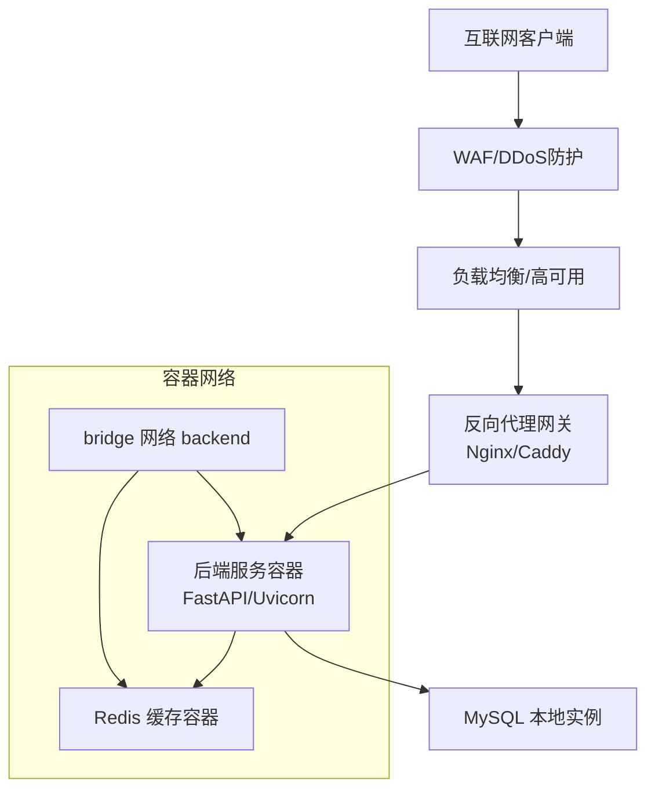
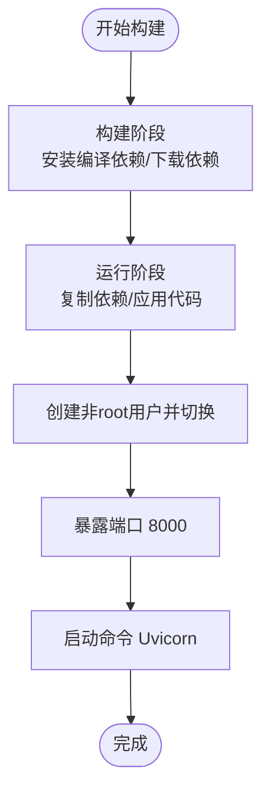
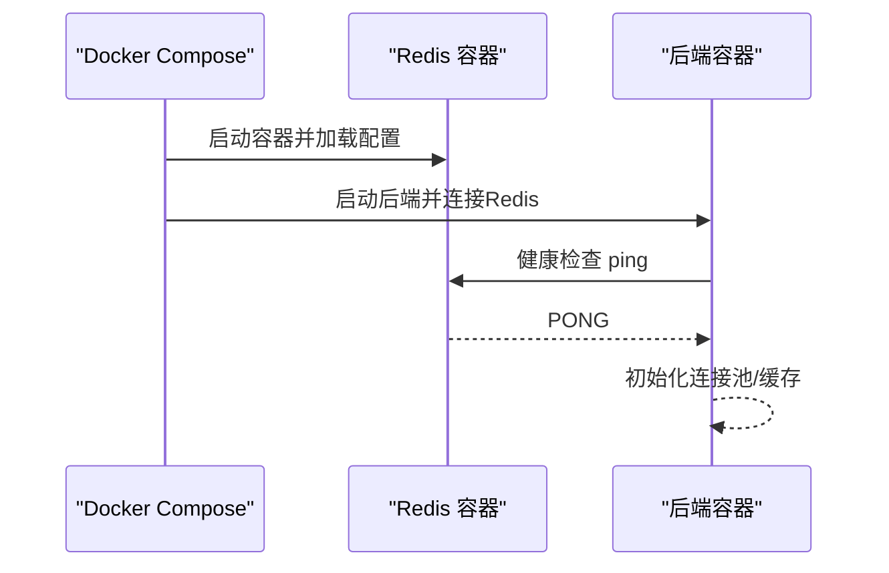
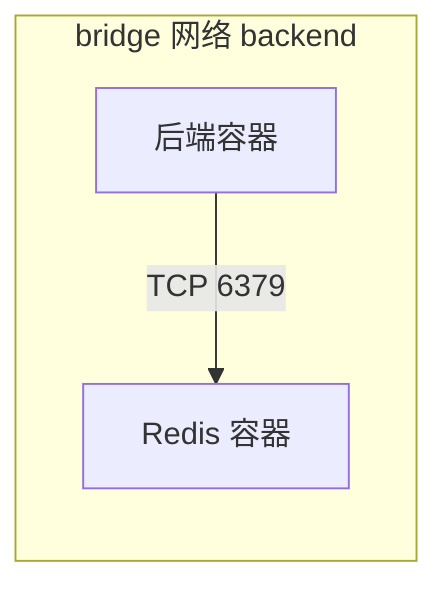
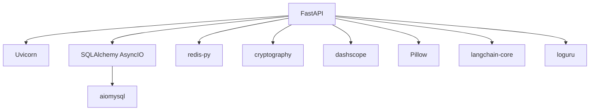

# 网络安全

<cite>
**本文引用的文件**   
- [Dockerfile](file://service/ai_assistant/Dockerfile)
- [docker-compose.yml](file://service/ai_assistant/docker-compose.yml)
- [main.py](file://service/ai_assistant/app/main.py)
- [config.py](file://service/ai_assistant/app/config.py)
- [logger.py](file://service/ai_assistant/app/utils/logger.py)
- [safety_service.py](file://service/ai_assistant/app/services/safety_service.py)
- [auth.py](file://service/ai_assistant/app/routers/auth.py)
- [requirements.txt](file://service/ai_assistant/requirements.txt)
- [README.md](file://service/ai_assistant/README.md)
- [README.md](file://README.md)
</cite>

## 目录
1. [引言](#引言)
2. [项目结构](#项目结构)
3. [核心组件](#核心组件)
4. [架构总览](#架构总览)
5. [详细组件分析](#详细组件分析)
6. [依赖分析](#依赖分析)
7. [性能考虑](#性能考虑)
8. [故障排查指南](#故障排查指南)
9. [结论](#结论)
10. [附录](#附录)

## 引言
本文件面向AI校园助手的网络安全，围绕容器化部署、网络隔离、防火墙与流量治理、DDoS防护、负载均衡安全、监控与入侵检测及响应流程展开。结合项目现有代码与文档，给出可落地的配置建议与最佳实践，帮助在生产环境中实现安全、稳定、合规的运行。

## 项目结构
后端服务采用FastAPI + Uvicorn，容器化通过Dockerfile与docker-compose实现，当前compose文件仅包含Redis服务，MySQL在本地运行。应用通过CORS中间件控制跨域来源，日志统一由Loguru落盘，安全服务通过阿里云DashScope进行内容安全检测，并在认证路由中实施访问控制。

```mermaid
graph TB
subgraph "容器层"
A["后端服务容器<br/>Uvicorn + FastAPI"]
B["Redis 缓存容器<br/>Redis 7"]
end
subgraph "网络层"
C["反向代理网关<br/>Nginx/Caddy"]
D["外网客户端"]
end
subgraph "基础设施"
E["MySQL 本地实例"]
end
D --> C --> A
A <- --> B
A --> E
```

图表来源
- [docker-compose.yml:1-31](file://service/ai_assistant/docker-compose.yml#L1-L31)
- [Dockerfile:1-49](file://service/ai_assistant/Dockerfile#L1-L49)
- [README.md:47-104](file://service/ai_assistant/README.md#L47-L104)

章节来源
- [docker-compose.yml:1-31](file://service/ai_assistant/docker-compose.yml#L1-L31)
- [Dockerfile:1-49](file://service/ai_assistant/Dockerfile#L1-L49)
- [README.md:47-104](file://service/ai_assistant/README.md#L47-L104)

## 核心组件
- 容器与镜像安全
  - 镜像分层构建，使用官方精简基础镜像，减少攻击面；非root用户运行；暴露端口集中管理。
- 网络隔离
  - compose定义专用bridge网络backend，后端与Redis在同一网络内通信，避免将Redis映射到宿主机端口。
- 认证与授权
  - JWT令牌发放与校验，路由层权限控制，禁止越权修改他人密码。
- 内容安全
  - 基于DashScope的LLM安全检测，结合正则兜底，识别潜在危险内容与隐私违规。
- 日志与审计
  - Loguru统一日志，控制台与文件双通道，便于审计与问题定位。
- 反向代理与HTTPS
  - 文档提供Nginx/Caddy反向代理与SSE适配配置，建议生产环境强制HTTPS。

章节来源
- [Dockerfile:22-49](file://service/ai_assistant/Dockerfile#L22-L49)
- [docker-compose.yml:29-31](file://service/ai_assistant/docker-compose.yml#L29-L31)
- [auth.py:24-102](file://service/ai_assistant/app/routers/auth.py#L24-L102)
- [safety_service.py:84-163](file://service/ai_assistant/app/services/safety_service.py#L84-L163)
- [logger.py:17-53](file://service/ai_assistant/app/utils/logger.py#L17-L53)
- [README.md:67-104](file://service/ai_assistant/README.md#L67-L104)

## 架构总览
下图展示了生产环境建议的网络拓扑与安全边界：外网通过HTTPS进入反向代理，代理将API请求转发至后端容器；后端容器访问本地MySQL与Redis；Redis通过compose网络与后端容器通信，不暴露至宿主机。



图表来源
- [docker-compose.yml:29-31](file://service/ai_assistant/docker-compose.yml#L29-L31)
- [README.md:67-104](file://service/ai_assistant/README.md#L67-L104)

## 详细组件分析

### 容器化与镜像安全
- 基础镜像与分层
  - 使用官方精简Python镜像，减少不必要的包与二进制，降低漏洞面。
  - 构建阶段与运行阶段分离，仅拷贝必要依赖，缩小镜像体积。
- 镜像源优化
  - APT与pip源切换为国内镜像，提升构建速度并降低外部依赖风险。
- 运行时安全
  - 创建非root用户并切换，限制容器内进程权限。
  - 明确暴露端口，避免将内部服务映射到宿主机端口。
- 安全扫描建议
  - CI流水线集成镜像扫描工具（如Clair、Trivy、Anchore），在推送镜像前阻断高危漏洞。
  - 结合SBOM与漏洞基线策略，定期审计镜像与依赖。



图表来源
- [Dockerfile:1-49](file://service/ai_assistant/Dockerfile#L1-L49)

章节来源
- [Dockerfile:1-49](file://service/ai_assistant/Dockerfile#L1-L49)

### 容器运行时安全设置
- 网络隔离
  - compose定义bridge网络backend，后端与Redis在同一网络内通信，避免将Redis端口映射到宿主机。
- 健康检查
  - Redis容器配置健康检查，定期探测ping，异常时自动重启，提升可用性。
- 存储与持久化
  - Redis数据卷挂载，确保重启后数据不丢失。
- 安全加固建议
  - 限制容器能力（drop capabilities），只保留必要权限。
  - 使用只读根文件系统，仅对必要路径挂载读写卷。
  - 配置资源限制（CPU/内存），防止资源滥用。



图表来源
- [docker-compose.yml:5-25](file://service/ai_assistant/docker-compose.yml#L5-L25)

章节来源
- [docker-compose.yml:5-25](file://service/ai_assistant/docker-compose.yml#L5-L25)

### 网络隔离与容器间通信安全
- Docker网络
  - 使用自定义bridge网络backend，后端与Redis在同一网络，避免端口暴露。
- 通信路径
  - 后端通过环境变量配置的Redis地址与密码连接，不依赖宿主机端口映射。
- 建议
  - 将MySQL也迁移至容器内，统一通过bridge网络访问，减少对外部网络的依赖。
  - 对Redis开启密码认证与最大内存策略，限制内存占用。



图表来源
- [docker-compose.yml:23-24](file://service/ai_assistant/docker-compose.yml#L23-L24)
- [config.py:26-30](file://service/ai_assistant/app/config.py#L26-L30)

章节来源
- [docker-compose.yml:23-24](file://service/ai_assistant/docker-compose.yml#L23-L24)
- [config.py:26-30](file://service/ai_assistant/app/config.py#L26-L30)

### 防火墙规则与端口访问控制
- 当前暴露
  - Redis容器映射宿主机6379端口，存在直接暴露风险。
- 建议
  - 移除宿主机端口映射，仅通过容器网络访问Redis。
  - 如需远程运维，使用SSH隧道或VPN访问容器网络。
  - 仅开放反向代理网关的443端口至公网，后端服务仅监听127.0.0.1或容器内网络。
  - 配置主机防火墙仅允许必要的入站/出站规则（如DNS、NTP、Let’s Encrypt挑战）。

章节来源
- [docker-compose.yml:9-10](file://service/ai_assistant/docker-compose.yml#L9-L10)

### DDoS防护与流量清洗
- 边界防护
  - 在反向代理前部署WAF/DDoS清洗设备（硬件或云厂商托管），清洗异常流量后再转发至LB。
- 反向代理配置要点
  - 禁用代理缓冲，适配SSE流式输出，避免缓冲导致的延迟与丢包。
  - 设置合理的超时与连接数限制，防止慢连接与资源耗尽。
- 应急处置
  - 配置自动告警阈值（QPS、连接数、错误率），触发临时限速或熔断。
  - 与CDN/云厂商联动，启用黑洞路由与弹性带宽扩容。

章节来源
- [README.md:75-102](file://service/ai_assistant/README.md#L75-L102)

### 负载均衡安全配置
- 健康检查
  - 后端提供健康检查接口，LB定期探测，剔除不健康节点。
- 会话保持与故障转移
  - 根据业务特性决定是否启用会话保持（如需维持聊天上下文）。
  - 多副本部署，故障自动切换，确保SLA。
- 安全加固
  - 仅允许来自LB的内网访问后端服务端口。
  - 配置TLS终止于LB，后端容器间通信可使用内网明文或mTLS。

章节来源
- [README.md:215-223](file://service/ai_assistant/README.md#L215-L223)

### 网络安全监控与入侵检测
- 日志采集
  - 后端日志落盘，结合Syslog/Fluent Bit/Logstash收集，统一存储于SIEM。
- 告警策略
  - 关键指标：异常登录、频繁4xx/5xx、Redis连接失败、LLM调用异常、SSE连接异常。
- 入侵检测
  - 基于签名与行为异常的IDS/IPS联动，结合WAF规则库。
  - 对外网访问进行深度包检测，识别异常协议与载荷特征。

章节来源
- [logger.py:17-53](file://service/ai_assistant/app/utils/logger.py#L17-L53)

### 安全事件响应流程
- 分级与上报
  - 事件分级（低/中/高/严重），触发对应响应团队。
- 处置步骤
  - 隔离受影响服务，封禁恶意IP，回滚可疑变更，修复漏洞并验证。
- 复盘与改进
  - 输出事件报告，完善规则与预案，组织演练。

## 依赖分析
后端依赖包括Web框架、异步数据库访问、Redis客户端、加密库、模型SDK与日志库。这些依赖直接影响运行时安全与性能。



图表来源
- [requirements.txt:1-22](file://service/ai_assistant/requirements.txt#L1-L22)

章节来源
- [requirements.txt:1-22](file://service/ai_assistant/requirements.txt#L1-L22)

## 性能考虑
- SSE流式输出
  - 反向代理需禁用缓冲，保证实时性与用户体验。
- 缓存策略
  - Redis用于会话与热点数据缓存，合理设置TTL与淘汰策略，避免内存膨胀。
- 并发与资源
  - Uvicorn工作进程数与线程数结合CPU核数与业务特征调优，避免过载。

## 故障排查指南
- CORS跨域问题
  - 检查配置中允许的来源列表，确保与前端域名一致。
- 认证失败
  - 核对JWT密钥、算法与过期时间，确认前端加密流程与后端一致。
- 内容安全检测异常
  - 观察LLM调用日志与回退正则结果，定位格式异常或API Key问题。
- 日志定位
  - 查看后端日志文件，结合时间戳与函数行号快速定位问题。

章节来源
- [config.py:103-109](file://service/ai_assistant/app/config.py#L103-L109)
- [auth.py:24-102](file://service/ai_assistant/app/routers/auth.py#L24-L102)
- [safety_service.py:106-144](file://service/ai_assistant/app/services/safety_service.py#L106-L144)
- [logger.py:17-53](file://service/ai_assistant/app/utils/logger.py#L17-L53)

## 结论
通过容器化与网络隔离、严格的防火墙与DDoS防护、完善的负载均衡与监控告警，以及规范的安全事件响应流程，AI校园助手可在生产环境中实现高安全性与高可用性。建议尽快移除Redis端口映射、启用HTTPS与WAF、完善镜像扫描与依赖审计，并持续优化日志与告警策略。

## 附录
- 生产部署建议清单
  - 容器镜像：启用扫描与SBOM；最小化权限与能力。
  - 网络：仅暴露必要端口；使用自定义bridge网络；限制出站访问。
  - 反向代理：禁用缓冲、适配SSE；强制HTTPS与HSTS。
  - 安全：WAF/DDoS、mTLS、会话安全、输入校验与速率限制。
  - 监控：日志采集、指标监控、告警阈值与自动化处置。
  - 备份与恢复：数据库与缓存快照策略，演练恢复流程。