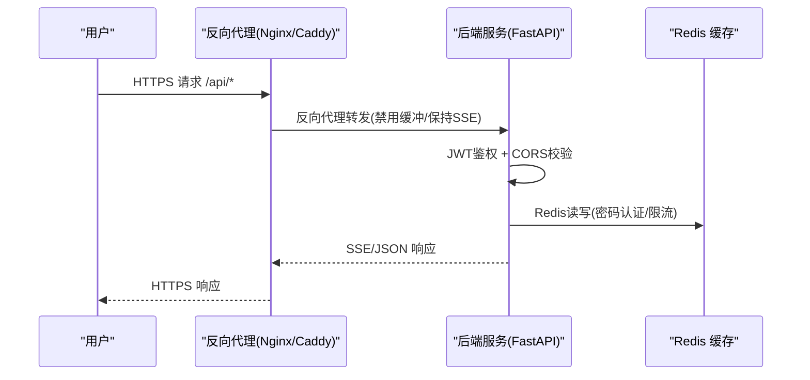
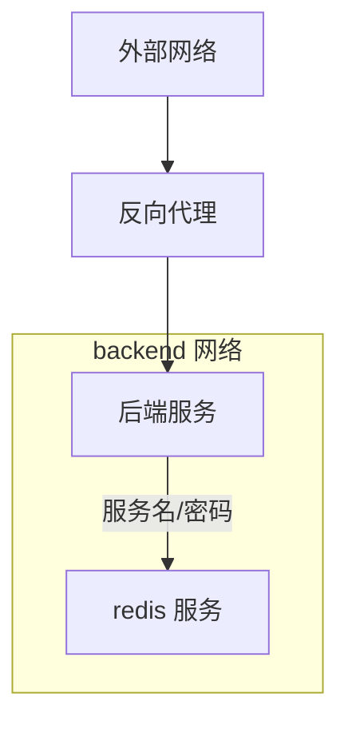
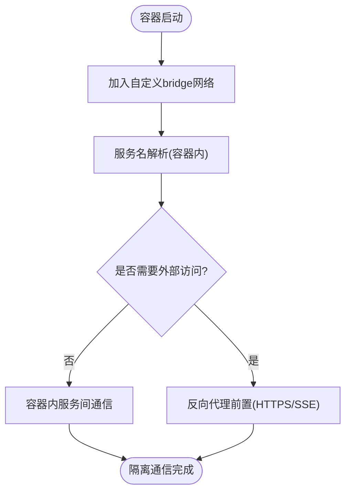
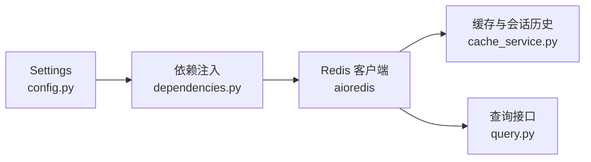

# 网络隔离

<cite>
**本文引用的文件**
- [docker-compose.yml](file://service/ai_assistant/docker-compose.yml)
- [Dockerfile](file://service/ai_assistant/Dockerfile)
- [main.py](file://service/ai_assistant/app/main.py)
- [config.py](file://service/ai_assistant/app/config.py)
- [dependencies.py](file://service/ai_assistant/app/dependencies.py)
- [cache_service.py](file://service/ai_assistant/app/services/cache_service.py)
- [auth.py](file://service/ai_assistant/app/routers/auth.py)
- [query.py](file://service/ai_assistant/app/routers/query.py)
- [logger.py](file://service/ai_assistant/app/utils/logger.py)
- [requirements.txt](file://service/ai_assistant/requirements.txt)
- [README.md（项目根）](file://README.md)
- [README.md（服务端）](file://service/ai_assistant/README.md)
</cite>

## 目录
1. [引言](#引言)
2. [项目结构](#项目结构)
3. [核心组件](#核心组件)
4. [架构总览](#架构总览)
5. [详细组件分析](#详细组件分析)
6. [依赖分析](#依赖分析)
7. [性能考虑](#性能考虑)
8. [故障排查指南](#故障排查指南)
9. [结论](#结论)
10. [附录](#附录)

## 引言
本文件面向“AI校园助手”的网络隔离与安全通信需求，围绕Docker网络配置、容器间通信安全、网络策略与iptables、微服务间通信的安全架构（服务网格概念与实现）、以及网络监控与审计方案展开。文档在现有代码库基础上，结合部署与运行时行为，给出可操作的设计与实施建议，帮助在生产环境中实现强隔离、可控通信与可观测性。

## 项目结构
后端服务采用FastAPI + Python，容器化通过Docker Compose编排，当前仓库提供了Redis服务的容器编排示例与后端服务的Dockerfile。整体网络边界与隔离点主要体现在：
- Docker Compose自定义桥接网络backend，用于服务间通信隔离
- 后端服务监听0.0.0.0:8000，通过反向代理对外提供HTTPS访问
- CORS策略由后端配置，限制来源
- Redis通过密码与内存限制提升缓存层安全

```mermaid
graph TB
subgraph "Docker Compose 编排"
A["后端服务<br/>FastAPI(Uvicorn)"]
B["Redis 缓存"]
C["自定义网络 backend<br/>bridge 驱动"]
end
subgraph "外部访问"
D["Nginx/Caddy 反向代理"]
E["客户端浏览器/移动端"]
end
E --> D
D --> A
A <- --> |"JWT/CORS/内部通信"| A
A --> |"密码认证/限流/缓存"| B
A -.->|"容器内通信"| C
B -.->|"容器内通信"| C
```

图表来源
- [docker-compose.yml:1-31](file://service/ai_assistant/docker-compose.yml#L1-L31)
- [Dockerfile:46-49](file://service/ai_assistant/Dockerfile#L46-L49)
- [README.md（项目根）:67-104](file://README.md#L67-L104)

章节来源
- [docker-compose.yml:1-31](file://service/ai_assistant/docker-compose.yml#L1-L31)
- [Dockerfile:46-49](file://service/ai_assistant/Dockerfile#L46-L49)
- [README.md（项目根）:67-104](file://README.md#L67-L104)

## 核心组件
- Docker编排与网络
  - 自定义bridge网络backend，将Redis置于该网络，实现服务间隔离与命名解析
  - Redis容器暴露6379端口，配合密码与内存策略
- 后端服务
  - 监听0.0.0.0:8000，通过CORS限制来源，JWT鉴权
  - 依赖注入获取Redis客户端，统一缓存与会话历史管理
- 反向代理与TLS
  - 生产建议使用Nginx/Caddy提供HTTPS与SSE适配
- 日志与监控
  - 使用Loguru统一落盘日志，便于审计与问题定位

章节来源
- [docker-compose.yml:5-31](file://service/ai_assistant/docker-compose.yml#L5-L31)
- [main.py:70-76](file://service/ai_assistant/app/main.py#L70-L76)
- [config.py:17-17](file://service/ai_assistant/app/config.py#L17-L17)
- [dependencies.py:36-50](file://service/ai_assistant/app/dependencies.py#L36-L50)
- [logger.py:17-46](file://service/ai_assistant/app/utils/logger.py#L17-L46)
- [README.md（项目根）:67-104](file://README.md#L67-L104)

## 架构总览
下图展示了容器化部署下的网络隔离与访问路径，强调“反向代理前置、容器内服务间隔离、外部TLS终止”的原则。



图表来源
- [README.md（项目根）:67-104](file://README.md#L67-L104)
- [query.py:115-125](file://service/ai_assistant/app/routers/query.py#L115-L125)
- [dependencies.py:36-50](file://service/ai_assistant/app/dependencies.py#L36-L50)

## 详细组件分析

### Docker网络与自定义网络
- 自定义网络backend采用bridge驱动，容器通过服务名或IP在该网络内互通
- Redis加入backend网络，后端通过服务名与密码连接
- 端口映射仅暴露Redis的6379，减少攻击面



图表来源
- [docker-compose.yml:23-24](file://service/ai_assistant/docker-compose.yml#L23-L24)
- [docker-compose.yml:9-10](file://service/ai_assistant/docker-compose.yml#L9-L10)
- [config.py:27-29](file://service/ai_assistant/app/config.py#L27-L29)

章节来源
- [docker-compose.yml:5-31](file://service/ai_assistant/docker-compose.yml#L5-L31)
- [config.py:27-29](file://service/ai_assistant/app/config.py#L27-L29)

### 容器间通信安全与命名空间隔离
- 命名空间隔离：容器进程与主机隔离，网络栈独立
- 服务发现：通过Docker Compose服务名进行内部解析
- 端口映射控制：仅暴露必要端口（Redis 6379），后端服务通过反向代理暴露
- CORS与JWT：后端限制允许来源，强制Bearer令牌



图表来源
- [docker-compose.yml:23-24](file://service/ai_assistant/docker-compose.yml#L23-L24)
- [main.py:70-76](file://service/ai_assistant/app/main.py#L70-L76)
- [README.md（项目根）:67-104](file://README.md#L67-L104)

章节来源
- [docker-compose.yml:5-31](file://service/ai_assistant/docker-compose.yml#L5-L31)
- [main.py:70-76](file://service/ai_assistant/app/main.py#L70-L76)

### 网络策略与iptables/防火墙
- 建议在宿主机层面使用iptables/ufw限制外网对容器端口的直接访问，仅允许反向代理所在主机的回环或内网网段
- 对Redis端口仅放行后端服务所在容器的访问
- 对后端服务端口仅放行反向代理所在主机的访问
- 定期审计规则，确保最小权限开放

说明：本节为通用实践建议，未直接对应具体源文件。

### 微服务间通信的安全架构（服务网格概念与实现）
- 概念引入：服务网格通过Sidecar代理实现细粒度的流量治理、安全策略与可观测性
- 当前实现：后端服务与Redis之间为简单直连，无专用Sidecar
- 建议演进：
  - 引入Envoy或Linkerd作为Sidecar，统一mTLS、限流、熔断与审计
  - 通过策略引擎（如OPA）在Sidecar层实施细粒度访问控制
  - 将Redis迁移为受控服务网格内的服务，统一凭据与访问策略

说明：本节为概念性与演进建议，未直接对应具体源文件。

### 网络监控与审计
- 日志落盘：后端使用Loguru将运行日志落盘，便于审计
- 建议增强：
  - 结合系统日志（如journald/rsyslog）与容器日志（Docker日志驱动）统一采集
  - 部署Prometheus+Grafana或ELK，采集SSE/JSON接口指标与错误
  - 对反向代理访问日志进行结构化，结合WAF/IDS进行威胁检测

章节来源
- [logger.py:17-46](file://service/ai_assistant/app/utils/logger.py#L17-L46)

## 依赖分析
后端服务对Redis的依赖通过依赖注入统一管理，配置来源于Settings，支持密码认证与URL拼装。



图表来源
- [config.py:94-100](file://service/ai_assistant/app/config.py#L94-L100)
- [dependencies.py:36-50](file://service/ai_assistant/app/dependencies.py#L36-L50)
- [cache_service.py:1-162](file://service/ai_assistant/app/services/cache_service.py#L1-L162)
- [query.py:207-212](file://service/ai_assistant/app/routers/query.py#L207-L212)

章节来源
- [config.py:27-29](file://service/ai_assistant/app/config.py#L27-L29)
- [config.py:94-100](file://service/ai_assistant/app/config.py#L94-L100)
- [dependencies.py:36-50](file://service/ai_assistant/app/dependencies.py#L36-L50)
- [cache_service.py:1-162](file://service/ai_assistant/app/services/cache_service.py#L1-L162)
- [query.py:207-212](file://service/ai_assistant/app/routers/query.py#L207-L212)

## 性能考虑
- SSE与反向代理：反向代理需禁用缓冲以保证流式输出连续性
- Redis：通过密码与内存策略限制资源占用，避免成为性能瓶颈
- CORS与JWT：合理配置允许来源与令牌有效期，减少鉴权失败开销

章节来源
- [README.md（项目根）:75-101](file://README.md#L75-L101)
- [docker-compose.yml:13-15](file://service/ai_assistant/docker-compose.yml#L13-L15)
- [main.py:70-76](file://service/ai_assistant/app/main.py#L70-L76)

## 故障排查指南
- Redis连接失败
  - 检查容器网络是否加入backend，服务名解析是否正常
  - 校验REDIS_HOST/REDIS_PORT/REDIS_PASSWORD配置
- SSE输出中断
  - 检查反向代理是否禁用缓冲、关闭缓存、设置正确的HTTP版本与分块编码
- CORS/鉴权错误
  - 校验CORS允许来源配置，确认前端携带有效Bearer令牌
- 日志定位
  - 查看后端日志文件，定位异常堆栈与关键告警

章节来源
- [docker-compose.yml:23-24](file://service/ai_assistant/docker-compose.yml#L23-L24)
- [config.py:27-29](file://service/ai_assistant/app/config.py#L27-L29)
- [README.md（项目根）:75-101](file://README.md#L75-L101)
- [main.py:70-76](file://service/ai_assistant/app/main.py#L70-L76)
- [logger.py:17-46](file://service/ai_assistant/app/utils/logger.py#L17-L46)

## 结论
当前项目在网络隔离方面已具备基础能力：通过Docker自定义桥接网络实现容器间隔离，后端服务通过反向代理与TLS对外提供服务，并在应用层实施JWT与CORS控制。为进一步强化安全与可观测性，建议在宿主机层面完善防火墙策略、在服务层引入服务网格与Sidecar、并建立完善的日志与监控体系。这些措施将显著提升系统的整体安全性与运维效率。

## 附录
- 反向代理与SSE配置要点
  - 禁用缓冲、关闭缓存、设置Connection为空、HTTP/1.1与分块传输
- 端口与访问控制
  - Redis仅暴露必要端口，后端服务仅允许反向代理访问
- 审计与合规
  - 统一日志落盘、结构化访问日志、定期审计与基线核查

章节来源
- [README.md（项目根）:67-104](file://README.md#L67-L104)
- [docker-compose.yml:9-10](file://service/ai_assistant/docker-compose.yml#L9-L10)