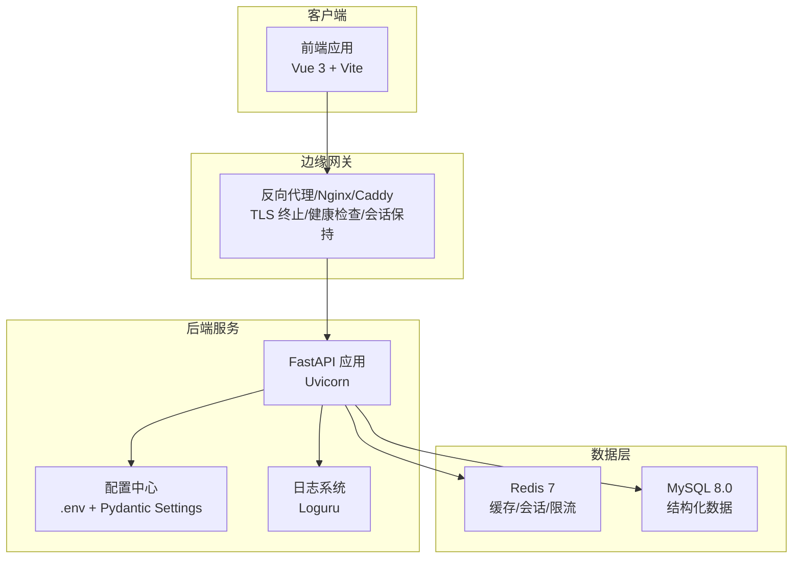
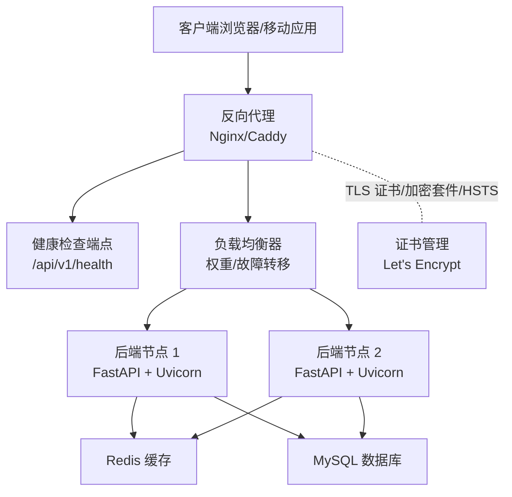
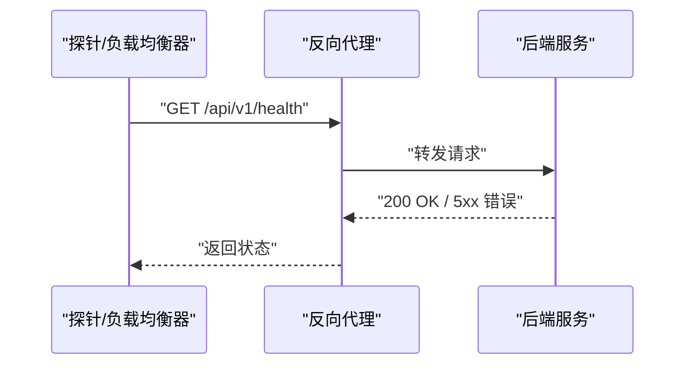
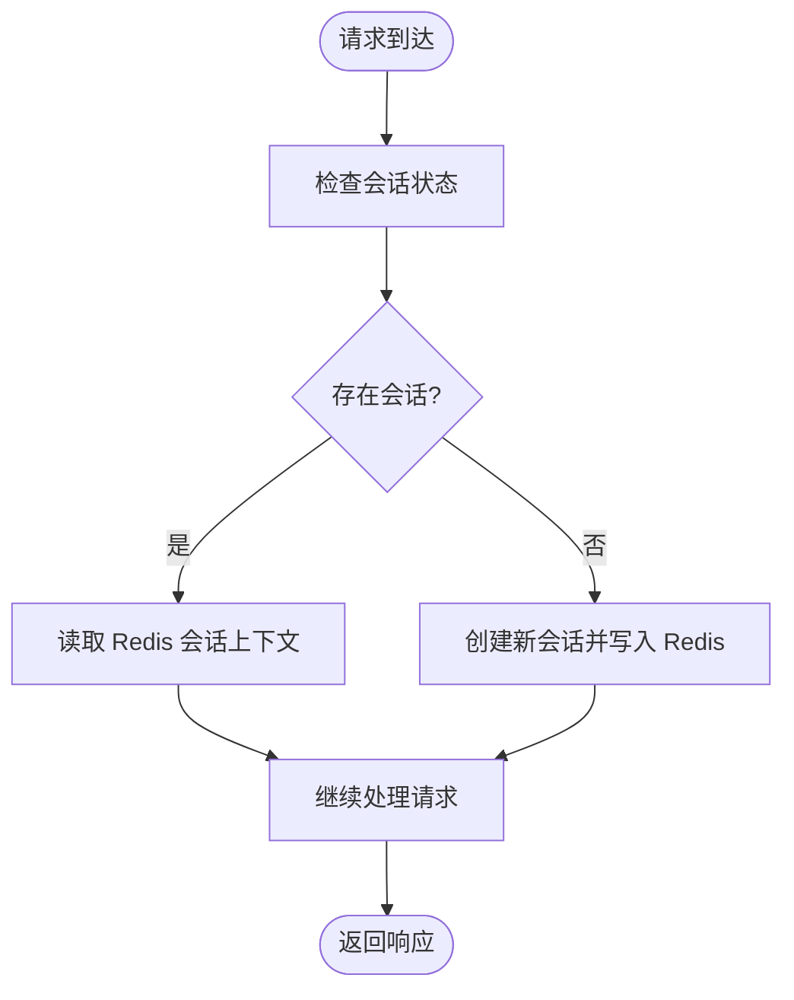
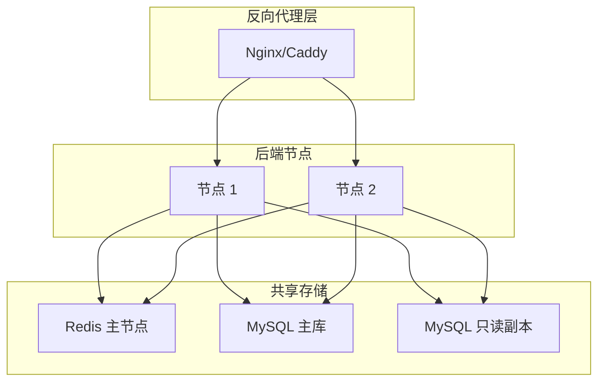
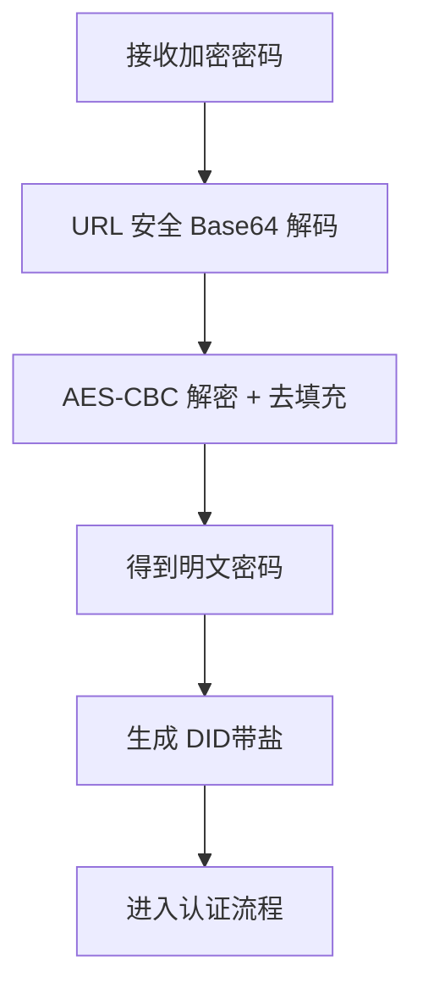
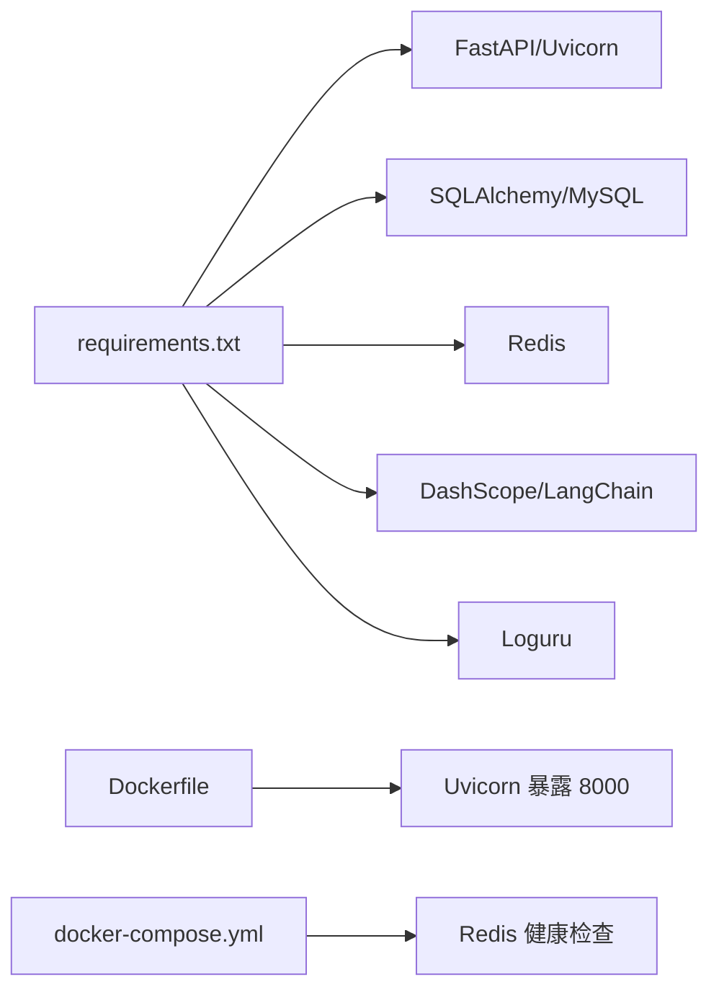

# 负载均衡安全

<cite>
**本文引用的文件**
- [service/ai_assistant/app/main.py](file://service/ai_assistant/app/main.py)
- [service/ai_assistant/app/config.py](file://service/ai_assistant/app/config.py)
- [service/ai_assistant/app/utils/logger.py](file://service/ai_assistant/app/utils/logger.py)
- [service/ai_assistant/app/routers/auth.py](file://service/ai_assistant/app/routers/auth.py)
- [service/ai_assistant/app/utils/crypto.py](file://service/ai_assistant/app/utils/crypto.py)
- [service/ai_assistant/app/utils/privacy.py](file://service/ai_assistant/app/utils/privacy.py)
- [service/ai_assistant/app/services/safety_service.py](file://service/ai_assistant/app/services/safety_service.py)
- [service/ai_assistant/Dockerfile](file://service/ai_assistant/Dockerfile)
- [service/ai_assistant/docker-compose.yml](file://service/ai_assistant/docker-compose.yml)
- [service/ai_assistant/requirements.txt](file://service/ai_assistant/requirements.txt)
- [service/ai_assistant/README.md](file://service/ai_assistant/README.md)
- [README.md](file://README.md)
</cite>

## 目录
1. [简介](#简介)
2. [项目结构](#项目结构)
3. [核心组件](#核心组件)
4. [架构总览](#架构总览)
5. [详细组件分析](#详细组件分析)
6. [依赖分析](#依赖分析)
7. [性能考虑](#性能考虑)
8. [故障排查指南](#故障排查指南)
9. [结论](#结论)
10. [附录](#附录)

## 简介
本文件聚焦于“AI校园助手”的负载均衡安全设计与实现，围绕以下主题展开：健康检查机制、会话保持策略、故障转移、SSL/TLS终止与证书管理、流量分发安全（权重、节点健康监控、熔断）、高可用安全架构（多节点部署、数据同步与一致性）、以及性能监控与安全审计。  
项目当前以单节点服务为主，生产部署建议通过反向代理（如 Nginx/Caddy）实现 TLS 终止、健康检查、会话保持与故障转移，并结合 Redis 缓存与数据库连接池实现高可用与一致性保障。

## 项目结构
后端服务采用 FastAPI + Uvicorn，容器化运行，Redis 作为缓存与会话上下文存储，MySQL 作为持久化存储。生产部署建议通过反向代理承载 HTTPS、健康检查与流量转发。

图表来源
- [service/ai_assistant/README.md:67-104](file://service/ai_assistant/README.md#L67-L104)
- [service/ai_assistant/Dockerfile:46-48](file://service/ai_assistant/Dockerfile#L46-L48)
- [service/ai_assistant/docker-compose.yml:5-24](file://service/ai_assistant/docker-compose.yml#L5-L24)
- [service/ai_assistant/app/config.py:13-110](file://service/ai_assistant/app/config.py#L13-L110)

章节来源
- [service/ai_assistant/README.md:1-230](file://service/ai_assistant/README.md#L1-L230)
- [service/ai_assistant/Dockerfile:1-49](file://service/ai_assistant/Dockerfile#L1-L49)
- [service/ai_assistant/docker-compose.yml:1-31](file://service/ai_assistant/docker-compose.yml#L1-L31)
- [service/ai_assistant/app/config.py:1-113](file://service/ai_assistant/app/config.py#L1-L113)

## 核心组件
- 应用入口与生命周期：负责应用启动/关闭、CORS 配置、路由注册与安全默认检查。
- 配置系统：集中管理数据库、Redis、JWT、AES、隐私盐、模型参数等。
- 日志系统：统一控制台与文件日志，便于审计与问题定位。
- 安全与隐私：密码传输加密（AES-CBC）、DID 隐私标识、安全检测（LLM + 正则回退）。
- 反向代理与容器编排：通过 Nginx/Caddy 实现 TLS 终止、健康检查、SSE 流式支持与会话保持；Redis 通过 compose 健康检查保障可用性。

章节来源
- [service/ai_assistant/app/main.py:1-86](file://service/ai_assistant/app/main.py#L1-L86)
- [service/ai_assistant/app/config.py:1-113](file://service/ai_assistant/app/config.py#L1-L113)
- [service/ai_assistant/app/utils/logger.py:1-53](file://service/ai_assistant/app/utils/logger.py#L1-L53)
- [service/ai_assistant/app/utils/crypto.py:1-73](file://service/ai_assistant/app/utils/crypto.py#L1-L73)
- [service/ai_assistant/app/utils/privacy.py:1-23](file://service/ai_assistant/app/utils/privacy.py#L1-L23)
- [service/ai_assistant/app/services/safety_service.py:1-163](file://service/ai_assistant/app/services/safety_service.py#L1-L163)
- [service/ai_assistant/README.md:67-104](file://service/ai_assistant/README.md#L67-L104)
- [service/ai_assistant/docker-compose.yml:18-22](file://service/ai_assistant/docker-compose.yml#L18-L22)

## 架构总览
下图展示了生产级部署下的负载均衡与安全架构：反向代理承担 TLS 终止、健康检查、SSE 适配与会话保持；后端服务通过 FastAPI 提供认证与查询接口；Redis 作为缓存与会话上下文存储，MySQL 作为结构化数据源。

图表来源
- [service/ai_assistant/README.md:67-104](file://service/ai_assistant/README.md#L67-L104)
- [service/ai_assistant/app/main.py:70-86](file://service/ai_assistant/app/main.py#L70-L86)
- [service/ai_assistant/docker-compose.yml:18-22](file://service/ai_assistant/docker-compose.yml#L18-L22)

## 详细组件分析

### 健康检查机制
- 应用内健康检查端点：提供 /api/v1/health 用于外部探测。
- Redis 健康检查：通过 docker-compose 的 healthcheck 对 Redis 进行周期性探活，确保缓存可用。
- 建议：在反向代理层配置健康检查探针，指向 /api/v1/health，结合超时与重试策略实现快速故障发现。

图表来源
- [service/ai_assistant/README.md:176-177](file://service/ai_assistant/README.md#L176-L177)
- [service/ai_assistant/docker-compose.yml:18-22](file://service/ai_assistant/docker-compose.yml#L18-L22)

章节来源
- [service/ai_assistant/README.md:176-177](file://service/ai_assistant/README.md#L176-L177)
- [service/ai_assistant/docker-compose.yml:18-22](file://service/ai_assistant/docker-compose.yml#L18-L22)

### 会话保持策略
- 会话上下文与缓存：后端使用 Redis 存储会话上下文、限流与高频查询缓存，保障多节点间会话一致性。
- 建议：在反向代理层启用基于 Cookie 的会话亲缘性（sticky session），或通过 Redis 共享会话状态，避免跨节点会话丢失。

图表来源
- [service/ai_assistant/app/config.py:26-31](file://service/ai_assistant/app/config.py#L26-L31)
- [service/ai_assistant/app/config.py:94-100](file://service/ai_assistant/app/config.py#L94-L100)

章节来源
- [service/ai_assistant/app/config.py:26-31](file://service/ai_assistant/app/config.py#L26-L31)
- [service/ai_assistant/app/config.py:94-100](file://service/ai_assistant/app/config.py#L94-L100)

### 故障转移实现
- 多节点部署：建议至少部署两个后端节点，结合反向代理实现故障转移。
- 健康检查与权重：反向代理根据健康检查结果动态调整节点权重或摘除故障节点。
- 建议：在反向代理层配置超时、重试与熔断策略，提升整体可用性。

章节来源
- [service/ai_assistant/README.md:67-104](file://service/ai_assistant/README.md#L67-L104)

### SSL/TLS 终止与证书管理
- TLS 终止：建议在反向代理层终止 TLS，使用 Let's Encrypt 获取免费证书。
- 加密套件：建议使用现代加密套件（如 TLS 1.3），禁用过时算法。
- HSTS：在反向代理层启用 Strict-Transport-Security，提升抗降级攻击能力。
- 证书轮换：自动化续期与滚动替换，确保服务不中断。

章节来源
- [service/ai_assistant/README.md:73-102](file://service/ai_assistant/README.md#L73-L102)

### 流量分发安全
- 权重分配：根据节点资源与健康状态动态分配权重，优先调度健康节点。
- 节点健康监控：结合应用内健康检查端点与外部探针，持续监控节点状态。
- 熔断机制：在反向代理层实现熔断（如连续错误阈值触发），保护后端免受雪崩效应影响。

章节来源
- [service/ai_assistant/README.md:67-104](file://service/ai_assistant/README.md#L67-L104)

### 高可用性安全架构
- 多节点部署：至少两台后端节点，配合反向代理实现冗余。
- 数据同步与一致性：Redis 作为共享缓存，MySQL 通过主从复制与只读副本提升可用性；应用侧通过连接池与超时控制降低单点压力。
- 会话与缓存一致性：通过 Redis 共享会话上下文，避免跨节点会话丢失。

图表来源
- [service/ai_assistant/README.md:67-104](file://service/ai_assistant/README.md#L67-L104)
- [service/ai_assistant/app/config.py:19-31](file://service/ai_assistant/app/config.py#L19-L31)

章节来源
- [service/ai_assistant/README.md:67-104](file://service/ai_assistant/README.md#L67-L104)
- [service/ai_assistant/app/config.py:19-31](file://service/ai_assistant/app/config.py#L19-L31)

### 安全与隐私（与负载均衡安全协同）
- 密码传输加密：前端使用 AES-CBC 加密密码，后端通过配置密钥解密，避免明文在网络传输。
- DID 隐私标识：使用 SHA-256 与盐值生成稳定 DID，替代真实学号，保护隐私。
- 安全检测：LLM 判断危险意图，正则回退与异常降级，确保安全边界。

图表来源
- [service/ai_assistant/app/utils/crypto.py:39-73](file://service/ai_assistant/app/utils/crypto.py#L39-L73)
- [service/ai_assistant/app/utils/privacy.py:9-23](file://service/ai_assistant/app/utils/privacy.py#L9-L23)
- [service/ai_assistant/app/services/safety_service.py:84-144](file://service/ai_assistant/app/services/safety_service.py#L84-L144)

章节来源
- [service/ai_assistant/app/utils/crypto.py:1-73](file://service/ai_assistant/app/utils/crypto.py#L1-L73)
- [service/ai_assistant/app/utils/privacy.py:1-23](file://service/ai_assistant/app/utils/privacy.py#L1-L23)
- [service/ai_assistant/app/services/safety_service.py:1-163](file://service/ai_assistant/app/services/safety_service.py#L1-L163)

### CORS 与安全默认检查
- CORS：生产环境建议限制允许来源，避免跨域风险。
- 安全默认检查：应用启动时检测不安全默认密钥，提醒在 .env 中设置强密钥。

章节来源
- [service/ai_assistant/app/main.py:66-86](file://service/ai_assistant/app/main.py#L66-L86)
- [service/ai_assistant/app/main.py:18-34](file://service/ai_assistant/app/main.py#L18-L34)

## 依赖分析
- 应用依赖：FastAPI、Uvicorn、SQLAlchemy AsyncIO、Redis、DashScope、Loguru 等。
- 容器与编排：Dockerfile 暴露 8000 端口，docker-compose 提供 Redis 健康检查。
- 生产建议：在反向代理层引入健康检查、会话保持、SSE 适配与 TLS 终止。

图表来源
- [service/ai_assistant/requirements.txt:1-22](file://service/ai_assistant/requirements.txt#L1-L22)
- [service/ai_assistant/Dockerfile:46-48](file://service/ai_assistant/Dockerfile#L46-L48)
- [service/ai_assistant/docker-compose.yml:18-22](file://service/ai_assistant/docker-compose.yml#L18-L22)

章节来源
- [service/ai_assistant/requirements.txt:1-22](file://service/ai_assistant/requirements.txt#L1-L22)
- [service/ai_assistant/Dockerfile:1-49](file://service/ai_assistant/Dockerfile#L1-L49)
- [service/ai_assistant/docker-compose.yml:1-31](file://service/ai_assistant/docker-compose.yml#L1-L31)

## 性能考虑
- SSE 流式输出：反向代理需禁用缓冲、开启分块传输，确保前端实时渲染。
- 缓存策略：Redis TTL 区分敏感与普通缓存，降低数据库压力。
- 连接池与超时：合理设置数据库与外部 API 调用超时，避免阻塞。
- 并发与限流：结合 Redis 限流与反向代理限速，防止突发流量冲击。

章节来源
- [service/ai_assistant/README.md:75-102](file://service/ai_assistant/README.md#L75-L102)
- [service/ai_assistant/app/config.py:81-84](file://service/ai_assistant/app/config.py#L81-L84)

## 故障排查指南
- 健康检查失败：确认 /api/v1/health 可达，检查反向代理与后端日志。
- Redis 不可用：查看 docker-compose 健康检查日志，确认密码与网络连通。
- SSE 输出异常：检查反向代理是否禁用缓冲、开启分块传输。
- 安全日志：利用 Loguru 文件日志定位安全检测与隐私处理异常。

章节来源
- [service/ai_assistant/README.md:176-177](file://service/ai_assistant/README.md#L176-L177)
- [service/ai_assistant/docker-compose.yml:18-22](file://service/ai_assistant/docker-compose.yml#L18-L22)
- [service/ai_assistant/app/utils/logger.py:17-47](file://service/ai_assistant/app/utils/logger.py#L17-L47)

## 结论
本项目在单节点环境下提供了清晰的安全与隐私实践（密码加密、DID 隐私、安全检测）。生产部署建议通过反向代理实现 TLS 终止、健康检查、SSE 适配与会话保持，并结合多节点部署、Redis 共享缓存与 MySQL 主从架构，构建高可用、可扩展且安全的负载均衡体系。同时，完善性能监控与安全审计，确保系统在高并发与复杂业务场景下的稳定性与安全性。

## 附录
- 反向代理配置要点（Nginx/Caddy）：监听 443，TLS 证书与密钥，禁用缓冲与缓存，开启分块传输，适配 /api/ 路由。
- 健康检查端点：/api/v1/health。
- 端口与进程：后端服务监听 8000，容器内通过 Uvicorn 运行。

章节来源
- [service/ai_assistant/README.md:67-104](file://service/ai_assistant/README.md#L67-L104)
- [service/ai_assistant/Dockerfile:46-48](file://service/ai_assistant/Dockerfile#L46-L48)
- [service/ai_assistant/README.md:176-177](file://service/ai_assistant/README.md#L176-L177)