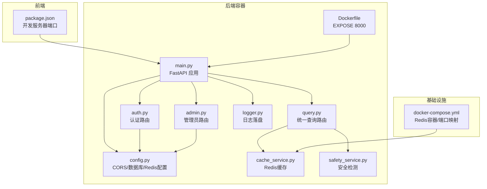
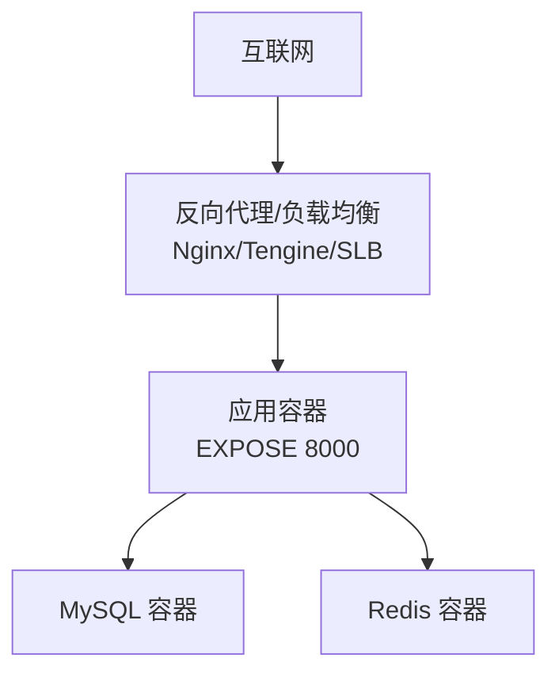
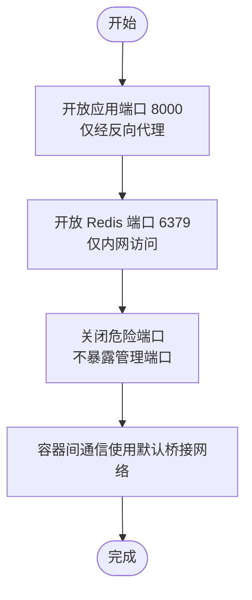
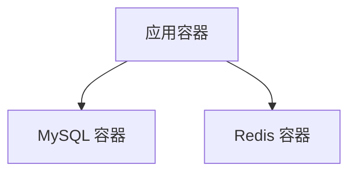

# 防火墙配置

<cite>
**本文引用的文件**
- [Dockerfile](file://service/ai_assistant/Dockerfile)
- [docker-compose.yml](file://service/ai_assistant/docker-compose.yml)
- [main.py](file://service/ai_assistant/app/main.py)
- [config.py](file://service/ai_assistant/app/config.py)
- [auth.py](file://service/ai_assistant/app/routers/auth.py)
- [query.py](file://service/ai_assistant/app/routers/query.py)
- [admin.py](file://service/ai_assistant/app/routers/admin.py)
- [cache_service.py](file://service/ai_assistant/app/services/cache_service.py)
- [safety_service.py](file://service/ai_assistant/app/services/safety_service.py)
- [logger.py](file://service/ai_assistant/app/utils/logger.py)
- [package.json](file://frontend/ai_assistant/package.json)
</cite>

## 目录
1. [简介](#简介)
2. [项目结构](#项目结构)
3. [核心组件](#核心组件)
4. [架构总览](#架构总览)
5. [详细组件分析](#详细组件分析)
6. [依赖分析](#依赖分析)
7. [性能考虑](#性能考虑)
8. [故障排查指南](#故障排查指南)
9. [结论](#结论)
10. [附录](#附录)

## 简介
本文件面向AI校园助手项目的防火墙配置，围绕端口访问控制、入站/出站流量管理、安全组与本地防火墙、DDoS防护、日志与监控告警等方面，给出可落地的策略与实施方案。文档同时结合项目现有容器化部署与后端服务暴露端口，提供与代码实现相契合的配置建议。

## 项目结构
后端服务采用容器化部署，应用监听固定端口并通过反向代理对外提供HTTP服务；前端Vue应用通过Vite开发服务器提供本地调试能力。数据库与缓存服务通过独立容器运行，应用通过内网网络访问。

**图表来源**
- [Dockerfile:46](file://service/ai_assistant/Dockerfile#L46)
- [docker-compose.yml:5-24](file://service/ai_assistant/docker-compose.yml#L5-L24)
- [main.py:52-86](file://service/ai_assistant/app/main.py#L52-L86)
- [config.py:13-112](file://service/ai_assistant/app/config.py#L13-L112)
- [auth.py:21-52](file://service/ai_assistant/app/routers/auth.py#L21-L52)
- [query.py:46-212](file://service/ai_assistant/app/routers/query.py#L46-L212)
- [admin.py:48-82](file://service/ai_assistant/app/routers/admin.py#L48-L82)
- [cache_service.py:1-177](file://service/ai_assistant/app/services/cache_service.py#L1-L177)
- [safety_service.py:1-163](file://service/ai_assistant/app/services/safety_service.py#L1-L163)
- [logger.py:17-53](file://service/ai_assistant/app/utils/logger.py#L17-L53)

**章节来源**
- [Dockerfile:46](file://service/ai_assistant/Dockerfile#L46)
- [docker-compose.yml:5-24](file://service/ai_assistant/docker-compose.yml#L5-L24)
- [main.py:52-86](file://service/ai_assistant/app/main.py#L52-L86)
- [config.py:13-112](file://service/ai_assistant/app/config.py#L13-L112)

## 核心组件
- 应用容器与端口暴露
  - 应用容器通过固定端口对外提供服务，便于在反向代理层统一接入与限流。
- CORS与跨域
  - CORS允许列表由配置项控制，生产环境建议限定为前端域名。
- 数据库与缓存
  - MySQL与Redis通过独立容器运行，应用通过内网网络访问，减少外网暴露面。
- 日志与审计
  - 统一日志落盘，便于后续接入集中化日志与告警系统。

**章节来源**
- [Dockerfile:46](file://service/ai_assistant/Dockerfile#L46)
- [main.py:70-76](file://service/ai_assistant/app/main.py#L70-L76)
- [config.py:13-112](file://service/ai_assistant/app/config.py#L13-L112)
- [docker-compose.yml:5-24](file://service/ai_assistant/docker-compose.yml#L5-L24)
- [logger.py:17-53](file://service/ai_assistant/app/utils/logger.py#L17-L53)

## 架构总览
下图展示应用容器、数据库/缓存容器与外部访问的关系，以及反向代理层在防火墙策略中的位置。

**图表来源**
- [Dockerfile:46](file://service/ai_assistant/Dockerfile#L46)
- [docker-compose.yml:5-24](file://service/ai_assistant/docker-compose.yml#L5-L24)

## 详细组件分析

### 端口访问控制策略
- 必需端口开放
  - 应用容器监听8000端口，仅通过反向代理对外暴露。
  - Redis容器监听6379端口，仅在内部网络访问，避免外网直连。
- 危险端口关闭
  - 不在宿主机暴露数据库与缓存的管理端口；通过容器内命令与健康检查保障可用性。
- 动态端口管理
  - 容器间通信使用默认桥接网络，无需额外动态端口映射。

**图表来源**
- [Dockerfile:46](file://service/ai_assistant/Dockerfile#L46)
- [docker-compose.yml:9-10](file://service/ai_assistant/docker-compose.yml#L9-L10)

**章节来源**
- [Dockerfile:46](file://service/ai_assistant/Dockerfile#L46)
- [docker-compose.yml:9-10](file://service/ai_assistant/docker-compose.yml#L9-L10)

### 入站/出站流量管理
- 入站连接限制
  - 仅允许反向代理访问应用容器的8000端口；其他端口一律拒绝。
- 出站连接限制
  - 应用容器仅允许访问内网的MySQL与Redis；禁止访问公网其他地址。
- 速率控制与协议过滤
  - 在反向代理层实施每IP/每路径的速率限制与连接数限制；启用HTTP/2与TLS终止，过滤异常协议特征。

**章节来源**
- [main.py:70-76](file://service/ai_assistant/app/main.py#L70-L76)
- [docker-compose.yml:23-24](file://service/ai_assistant/docker-compose.yml#L23-L24)

### 安全组配置
- 云平台安全组
  - 入站规则：仅允许反向代理/负载均衡的源IP段访问应用容器8000端口；拒绝其他入站。
  - 出站规则：允许访问内网MySQL/Redis端口；拒绝访问公网其他地址。
- 本地防火墙
  - 宿主机仅开放反向代理所需端口；应用容器所在子网允许访问Redis端口。

**章节来源**
- [docker-compose.yml:23-24](file://service/ai_assistant/docker-compose.yml#L23-L24)

### DDoS防护实施方案
- 流量清洗
  - 在反向代理层启用WAF与DDoS清洗，清洗后流量转发至应用容器。
- 异常检测
  - 基于访问日志与指标（QPS、错误率、响应时间）建立阈值告警；对异常IP与路径进行临时封禁。
- 自动阻断
  - 与WAF联动，对触发规则的IP自动拉黑；支持灰名单与白名单机制。

**章节来源**
- [logger.py:17-53](file://service/ai_assistant/app/utils/logger.py#L17-L53)

### 防火墙日志分析与监控告警
- 日志落盘
  - 应用日志统一落盘，便于集中化采集与分析。
- 监控指标
  - QPS、错误率、响应时间、连接数、Redis命中率等。
- 告警策略
  - 基于阈值与趋势的告警；结合日志关键字（如安全检测触发）触发专项告警。

**章节来源**
- [logger.py:17-53](file://service/ai_assistant/app/utils/logger.py#L17-L53)

## 依赖分析
应用容器与数据库/缓存容器之间的依赖关系如下：

**图表来源**
- [docker-compose.yml:5-24](file://service/ai_assistant/docker-compose.yml#L5-L24)

**章节来源**
- [docker-compose.yml:5-24](file://service/ai_assistant/docker-compose.yml#L5-L24)

## 性能考虑
- 端口与网络
  - 通过反向代理统一接入，有利于在边缘层实施限速与连接复用。
- 缓存与延迟
  - Redis缓存命中可显著降低后端压力；敏感查询的TTL与版本控制避免脏数据。
- 日志与可观测性
  - 统一日志落盘与关键指标上报，有助于快速定位性能瓶颈。

**章节来源**
- [cache_service.py:85-90](file://service/ai_assistant/app/services/cache_service.py#L85-L90)
- [logger.py:17-53](file://service/ai_assistant/app/utils/logger.py#L17-L53)

## 故障排查指南
- CORS跨域问题
  - 检查CORS允许列表配置，确保生产环境仅允许受信域名。
- Redis连接异常
  - 确认容器网络与密码配置；检查健康检查与端口映射。
- 日志定位
  - 查看应用日志文件，结合请求ID与时间戳定位问题。

**章节来源**
- [main.py:70-76](file://service/ai_assistant/app/main.py#L70-L76)
- [docker-compose.yml:18-22](file://service/ai_assistant/docker-compose.yml#L18-L22)
- [logger.py:17-53](file://service/ai_assistant/app/utils/logger.py#L17-L53)

## 结论
通过在反向代理层实施严格的入站访问控制、在容器网络层限制出站访问、结合DDoS清洗与日志监控，可有效提升AI校园助手系统的安全性与稳定性。建议在生产环境中严格遵循最小暴露原则，并持续优化速率控制与异常检测策略。

## 附录
- 前端开发服务器端口
  - 开发服务器端口由前端包配置决定，用于本地调试，不参与线上防火墙策略。

**章节来源**
- [package.json:6-9](file://frontend/ai_assistant/package.json#L6-L9)