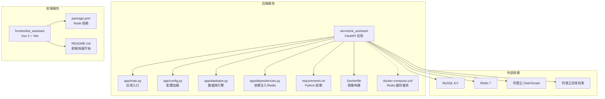
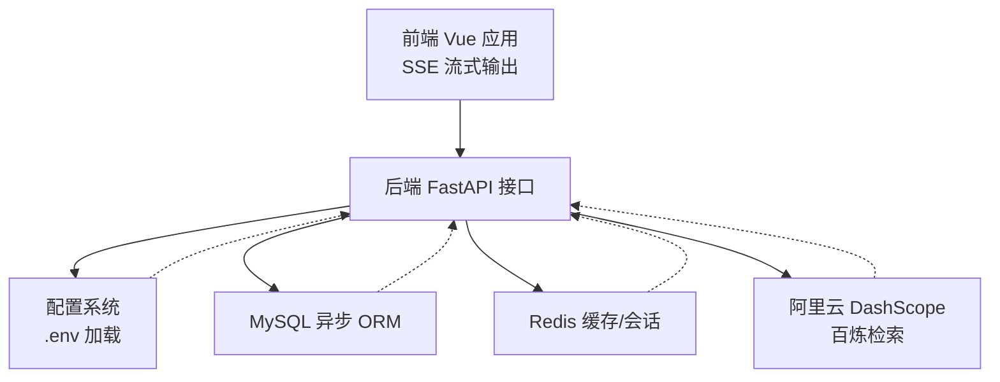
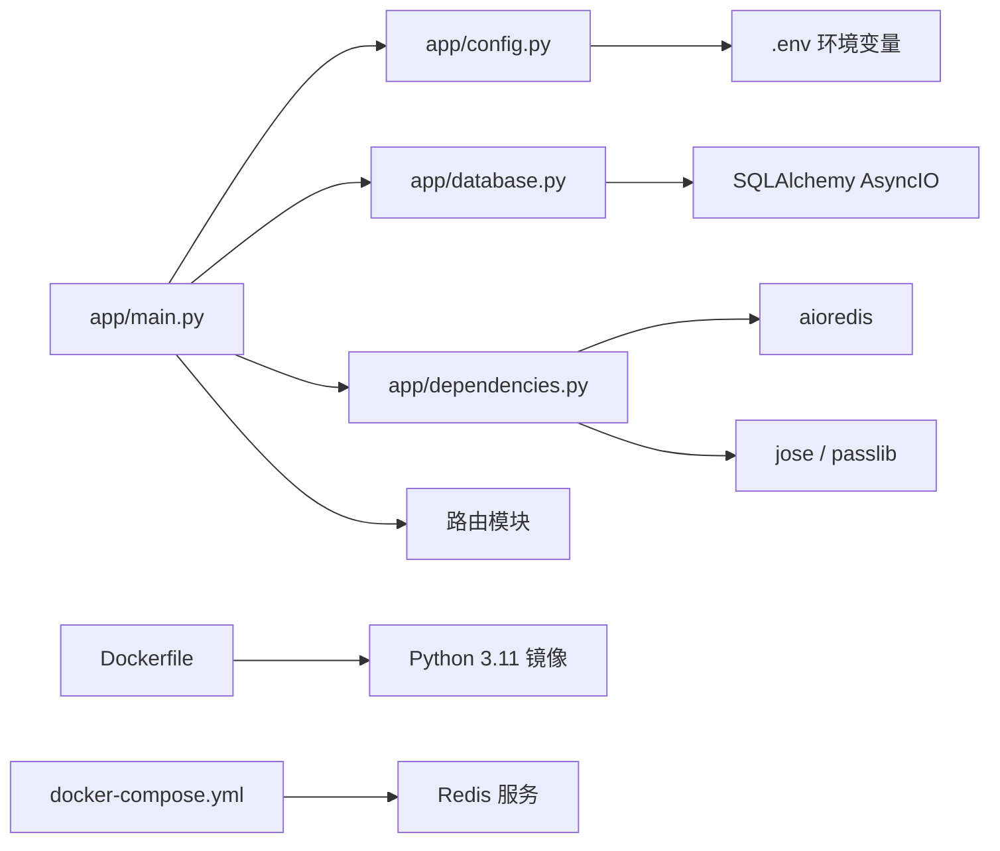

# 开发环境搭建

<cite>
**本文引用的文件**
- [service/ai_assistant/Dockerfile](file://service/ai_assistant/Dockerfile)
- [service/ai_assistant/docker-compose.yml](file://service/ai_assistant/docker-compose.yml)
- [service/ai_assistant/requirements.txt](file://service/ai_assistant/requirements.txt)
- [service/ai_assistant/app/config.py](file://service/ai_assistant/app/config.py)
- [service/ai_assistant/app/main.py](file://service/ai_assistant/app/main.py)
- [service/ai_assistant/app/database.py](file://service/ai_assistant/app/database.py)
- [service/ai_assistant/app/dependencies.py](file://service/ai_assistant/app/dependencies.py)
- [service/ai_assistant/README.md](file://service/ai_assistant/README.md)
- [frontend/ai_assistant/package.json](file://frontend/ai_assistant/package.json)
- [frontend/ai_assistant/README.md](file://frontend/ai_assistant/README.md)
- [README.md](file://README.md)
</cite>

## 目录
1. [简介](#简介)
2. [项目结构](#项目结构)
3. [核心组件](#核心组件)
4. [架构总览](#架构总览)
5. [详细组件分析](#详细组件分析)
6. [依赖分析](#依赖分析)
7. [性能考虑](#性能考虑)
8. [故障排查指南](#故障排查指南)
9. [结论](#结论)
10. [附录](#附录)

## 简介
本指南面向需要在本地搭建“AI校园助手”开发环境的工程师与学生，覆盖从系统必备软件（Python 3.8+、Node.js、Docker）到后端与前端依赖安装、环境变量配置、Docker容器编排与服务启动/停止、常见问题排查以及开发调试与IDE建议。目标是帮助你在最短时间内完成从零到可运行的开发环境准备。

## 项目结构
该项目采用前后端分离架构：
- 后端服务位于 service/ai_assistant，基于 Python 3.11（容器镜像）与 FastAPI，使用 SQLAlchemy AsyncIO 访问 MySQL，Redis 作为缓存与会话上下文存储，集成阿里云 DashScope 与百炼检索 API。
- 前端位于 frontend/ai_assistant，基于 Vue 3 + Vite，采用 Axios 发起请求，Pinia 管理状态，SSE 实现流式输出。
- 顶层 README 提供整体架构与部署说明；后端 README 提供本地开发与 Docker 启动流程；前端 README 提供快速开始与 API 变更说明。

图表来源
- [service/ai_assistant/app/main.py:1-86](file://service/ai_assistant/app/main.py#L1-L86)
- [service/ai_assistant/app/config.py:1-113](file://service/ai_assistant/app/config.py#L1-L113)
- [service/ai_assistant/app/database.py:1-35](file://service/ai_assistant/app/database.py#L1-L35)
- [service/ai_assistant/app/dependencies.py:1-109](file://service/ai_assistant/app/dependencies.py#L1-L109)
- [service/ai_assistant/requirements.txt:1-22](file://service/ai_assistant/requirements.txt#L1-L22)
- [service/ai_assistant/Dockerfile:1-49](file://service/ai_assistant/Dockerfile#L1-L49)
- [service/ai_assistant/docker-compose.yml:1-31](file://service/ai_assistant/docker-compose.yml#L1-L31)
- [frontend/ai_assistant/package.json:1-24](file://frontend/ai_assistant/package.json#L1-L24)

章节来源
- [README.md:1-104](file://README.md#L1-L104)
- [service/ai_assistant/README.md:1-230](file://service/ai_assistant/README.md#L1-L230)
- [frontend/ai_assistant/README.md:1-35](file://frontend/ai_assistant/README.md#L1-L35)

## 核心组件
- 后端应用入口与生命周期：应用初始化、CORS 中间件注册、路由挂载、启动/关闭日志与 Redis 连接池清理。
- 配置系统：通过 Pydantic Settings 从 .env 文件加载，支持数据库、Redis、JWT、AES、隐私盐、DashScope、百炼检索、缓存 TTL 等配置项。
- 数据库层：异步 SQLAlchemy 引擎与会话工厂，支持池化与回滚策略。
- 依赖注入：数据库会话、Redis 客户端单例、JWT 校验、管理员鉴权。
- 前端依赖：Vue 3、Vue Router、Pinia、Axios、CryptoJS、UUID、Marked、Vite 插件与构建工具。

章节来源
- [service/ai_assistant/app/main.py:1-86](file://service/ai_assistant/app/main.py#L1-L86)
- [service/ai_assistant/app/config.py:1-113](file://service/ai_assistant/app/config.py#L1-L113)
- [service/ai_assistant/app/database.py:1-35](file://service/ai_assistant/app/database.py#L1-L35)
- [service/ai_assistant/app/dependencies.py:1-109](file://service/ai_assistant/app/dependencies.py#L1-L109)
- [frontend/ai_assistant/package.json:1-24](file://frontend/ai_assistant/package.json#L1-L24)

## 架构总览
后端通过 FastAPI 提供 REST 接口，前端通过 Axios 调用后端 API 并使用 SSE 流式接收回答。Redis 用于缓存与会话上下文，MySQL 存储结构化数据，阿里云 DashScope 与百炼检索提供 LLM 能力。

图表来源
- [service/ai_assistant/app/main.py:1-86](file://service/ai_assistant/app/main.py#L1-L86)
- [service/ai_assistant/app/config.py:1-113](file://service/ai_assistant/app/config.py#L1-L113)
- [service/ai_assistant/app/database.py:1-35](file://service/ai_assistant/app/database.py#L1-L35)
- [service/ai_assistant/app/dependencies.py:1-109](file://service/ai_assistant/app/dependencies.py#L1-L109)

## 详细组件分析

### 后端环境准备与依赖安装
- Python 版本与虚拟环境
  - 容器镜像使用 Python 3.11，本地开发建议使用 Python 3.8+。
  - 推荐创建并激活虚拟环境，避免全局污染。
- 安装后端依赖
  - 使用 requirements.txt 安装 Python 包，包含 FastAPI、Uvicorn、SQLAlchemy AsyncIO、aiomysql、Redis、Pydantic Settings、DashScope、百炼 SDK、LangChain Core、Loguru 等。
- Docker 与 Redis 缓存
  - 使用 docker-compose 启动 Redis 7 容器，默认端口 6379，带密码与内存限制。
  - 如需仅启动 Redis，可使用 compose 文件中的服务定义。

章节来源
- [service/ai_assistant/Dockerfile:1-49](file://service/ai_assistant/Dockerfile#L1-L49)
- [service/ai_assistant/docker-compose.yml:1-31](file://service/ai_assistant/docker-compose.yml#L1-L31)
- [service/ai_assistant/requirements.txt:1-22](file://service/ai_assistant/requirements.txt#L1-L22)
- [service/ai_assistant/README.md:106-205](file://service/ai_assistant/README.md#L106-L205)

### 前端环境准备与依赖安装
- Node.js 与 npm
  - 前端使用 Vite 与 Vue 3，安装依赖后即可启动开发服务器。
- 启动与构建
  - 开发：npm run dev，访问 http://localhost:5173。
  - 构建：npm run build，产物输出至 dist/。
- 环境变量
  - 前端需要与后端 AES_SECRET_KEY 保持一致，确保传输加密一致。

章节来源
- [frontend/ai_assistant/package.json:1-24](file://frontend/ai_assistant/package.json#L1-L24)
- [frontend/ai_assistant/README.md:1-35](file://frontend/ai_assistant/README.md#L1-L35)

### 环境变量配置详解
后端配置项（通过 .env 文件加载）：
- 应用与调试
  - APP_NAME、APP_VERSION、DEBUG、CORS_ALLOW_ORIGINS
- MySQL 数据库
  - MYSQL_HOST、MYSQL_PORT、MYSQL_USER、MYSQL_PASSWORD、MYSQL_DATABASE
- Redis 缓存
  - REDIS_HOST、REDIS_PORT、REDIS_PASSWORD、REDIS_DB
- JWT 与传输加密
  - JWT_SECRET_KEY、JWT_ALGORITHM、JWT_EXPIRE_MINUTES、AES_SECRET_KEY
- 隐私与上下文
  - DID_SALT、MAX_HISTORY_COUNT
- 阿里云 DashScope
  - ALI_API_KEY、DASHSCOPE_TRUST_ENV_PROXY、DASHSCOPE_MAX_INPUT_CHARS、BAILIAN_APP_ID
- LLM 模型配置
  - LLM_MODEL_INTENT_CLASSIFY、LLM_MODEL_QUERY_REWRITE、LLM_MODEL_FINAL_ANSWER、LLM_MODEL_TOOL_PLANNER、LLM_MODEL_VECTOR_DECOMPOSE、LLM_MODEL_HYBRID_RERANK、LLM_MODEL_SAFETY_CHECK、LLM_MODEL_IMAGE_UNDERSTANDING、LLM_MODEL_SPEECH_RECOGNITION
- 百炼检索
  - ALIBABA_CLOUD_ACCESS_KEY_ID、ALIBABA_CLOUD_ACCESS_KEY_SECRET、BAILIAN_WORKSPACE_ID、BAILIAN_INDEX_ID、BAILIAN_ENDPOINT
- 缓存 TTL
  - CACHE_TTL_SENSITIVE、CACHE_TTL_NORMAL

章节来源
- [service/ai_assistant/app/config.py:1-113](file://service/ai_assistant/app/config.py#L1-L113)

### Docker 容器启动与停止
- 启动 Redis 缓存服务
  - 使用 docker-compose 启动 redis 服务，默认映射 6379 端口，设置密码与内存策略。
- 停止与清理
  - 可通过 docker-compose 停止指定服务或整个栈。
- 注意事项
  - MySQL 当前为本地实例，compose 文件中仅定义了 Redis；如需完整本地容器化，可在同一 compose 中添加 MySQL 服务（参考顶层 README 的完整部署说明）。

章节来源
- [service/ai_assistant/docker-compose.yml:1-31](file://service/ai_assistant/docker-compose.yml#L1-L31)
- [README.md:47-66](file://README.md#L47-L66)

### 后端服务启动与调试
- 启动命令
  - 在后端目录创建并激活虚拟环境后，安装依赖，使用 Uvicorn 启动应用，监听 0.0.0.0:8000，开启热更新。
- 访问接口
  - 文档：http://localhost:8000/docs
  - 健康检查：http://localhost:8000/api/v1/health
- 生命周期与安全提示
  - 应用启动时会检查部分默认配置是否被覆盖，若仍使用示例默认值会发出安全警告。

章节来源
- [service/ai_assistant/README.md:106-177](file://service/ai_assistant/README.md#L106-L177)
- [service/ai_assistant/app/main.py:18-50](file://service/ai_assistant/app/main.py#L18-L50)

### 前后端联调与流式输出
- 前端通过 Axios 调用后端 /api/v1/query 接口，使用 fetch 与 TextDecoder 读取 SSE 流式数据，实现逐字打印效果。
- Pinia 管理聊天状态，消息渲染与响应式更新。

章节来源
- [frontend/ai_assistant/README.md:29-35](file://frontend/ai_assistant/README.md#L29-L35)

## 依赖分析
后端依赖关系：
- 应用入口依赖配置系统、数据库引擎、依赖注入模块与路由模块。
- 配置系统依赖 Pydantic Settings，从 .env 文件读取键值。
- 数据库层依赖 SQLAlchemy AsyncIO 与 aiomysql。
- 依赖注入模块提供 Redis 客户端单例与 JWT 校验。
- Dockerfile 定义了构建与运行阶段的镜像、依赖安装与运行命令。
- docker-compose 定义了 Redis 服务及其健康检查。

图表来源
- [service/ai_assistant/app/main.py:1-86](file://service/ai_assistant/app/main.py#L1-L86)
- [service/ai_assistant/app/config.py:1-113](file://service/ai_assistant/app/config.py#L1-L113)
- [service/ai_assistant/app/database.py:1-35](file://service/ai_assistant/app/database.py#L1-L35)
- [service/ai_assistant/app/dependencies.py:1-109](file://service/ai_assistant/app/dependencies.py#L1-L109)
- [service/ai_assistant/Dockerfile:1-49](file://service/ai_assistant/Dockerfile#L1-L49)
- [service/ai_assistant/docker-compose.yml:1-31](file://service/ai_assistant/docker-compose.yml#L1-L31)

章节来源
- [service/ai_assistant/app/main.py:1-86](file://service/ai_assistant/app/main.py#L1-L86)
- [service/ai_assistant/app/config.py:1-113](file://service/ai_assistant/app/config.py#L1-L113)
- [service/ai_assistant/app/database.py:1-35](file://service/ai_assistant/app/database.py#L1-L35)
- [service/ai_assistant/app/dependencies.py:1-109](file://service/ai_assistant/app/dependencies.py#L1-L109)
- [service/ai_assistant/Dockerfile:1-49](file://service/ai_assistant/Dockerfile#L1-L49)
- [service/ai_assistant/docker-compose.yml:1-31](file://service/ai_assistant/docker-compose.yml#L1-L31)

## 性能考虑
- 数据库连接池
  - 异步引擎启用 pre_ping 与 recycle，有助于维持长连接稳定性。
- 缓存策略
  - Redis 用于会话上下文与高频查询缓存，敏感与普通缓存 TTL 不同，减少重复计算与网络开销。
- SSE 流式输出
  - 后端使用 StreamingResponse，前端按块渲染，降低首字节延迟与用户体验阻塞感。
- Docker 镜像优化
  - 构建阶段与运行阶段分离，使用国内镜像源加速，减少安装时间。

章节来源
- [service/ai_assistant/app/database.py:7-20](file://service/ai_assistant/app/database.py#L7-L20)
- [service/ai_assistant/app/config.py:81-84](file://service/ai_assistant/app/config.py#L81-L84)
- [service/ai_assistant/Dockerfile:6-32](file://service/ai_assistant/Dockerfile#L6-L32)
- [service/ai_assistant/README.md:43-45](file://service/ai_assistant/README.md#L43-L45)

## 故障排查指南
- 端口冲突
  - 后端默认监听 8000，前端默认 5173；若被占用，请调整启动参数或释放端口。
- CORS 限制
  - 生产环境应限制允许来源；开发环境可使用默认允许列表。
- Redis 连接失败
  - 确认 Redis 容器已启动、密码正确、网络可达；compose 中已配置健康检查。
- 数据库连接失败
  - 检查 MySQL 地址、端口、账号、密码与字符集；确保数据库存在且可访问。
- JWT/AES 默认值警告
  - 启动时若出现不安全默认值警告，请在 .env 中替换为强密钥。
- SSE 流式输出异常
  - 若使用反向代理（如 Nginx），需禁用缓冲并启用分块传输，确保前端可逐字渲染。
- 依赖安装失败
  - 使用国内镜像源与较高超时/重试配置；必要时在容器内构建以规避本地环境差异。

章节来源
- [service/ai_assistant/app/main.py:18-50](file://service/ai_assistant/app/main.py#L18-L50)
- [service/ai_assistant/app/config.py:103-109](file://service/ai_assistant/app/config.py#L103-L109)
- [service/ai_assistant/docker-compose.yml:18-22](file://service/ai_assistant/docker-compose.yml#L18-L22)
- [service/ai_assistant/README.md:67-104](file://service/ai_assistant/README.md#L67-L104)

## 结论
通过本指南，你可以完成从系统软件到项目依赖、从环境变量到容器编排的全流程开发环境搭建。建议优先使用 Docker 启动 Redis 缓存，本地启动后端服务并通过前端访问接口进行联调。遇到问题时，依据端口、CORS、Redis/数据库连接、JWT/AES 安全默认值与 SSE 代理配置逐一排查，通常可快速定位并解决。

## 附录

### 开发调试与 IDE 设置建议
- Python
  - 使用虚拟环境并在 IDE 中选择解释器指向 .venv。
  - 启用格式化与类型检查插件（如 black、flake8、mypy）。
  - 启动参数建议包含 --reload 以便热更新。
- Node.js/Vite
  - 在 IDE 中配置 Vite 开发服务器，设置端口与代理规则（如有需要）。
  - 前端 .env 中的 AES 密钥需与后端一致，否则传输加密不匹配。
- Docker
  - 使用 docker-compose 管理 Redis；如需本地 MySQL，可在同一 compose 中添加服务（参考顶层 README 的完整部署说明）。
- 日志与监控
  - 后端使用 loguru 初始化日志；开发期可提高日志级别辅助定位问题。

章节来源
- [service/ai_assistant/README.md:106-177](file://service/ai_assistant/README.md#L106-L177)
- [frontend/ai_assistant/README.md:1-35](file://frontend/ai_assistant/README.md#L1-L35)
- [README.md:47-66](file://README.md#L47-L66)