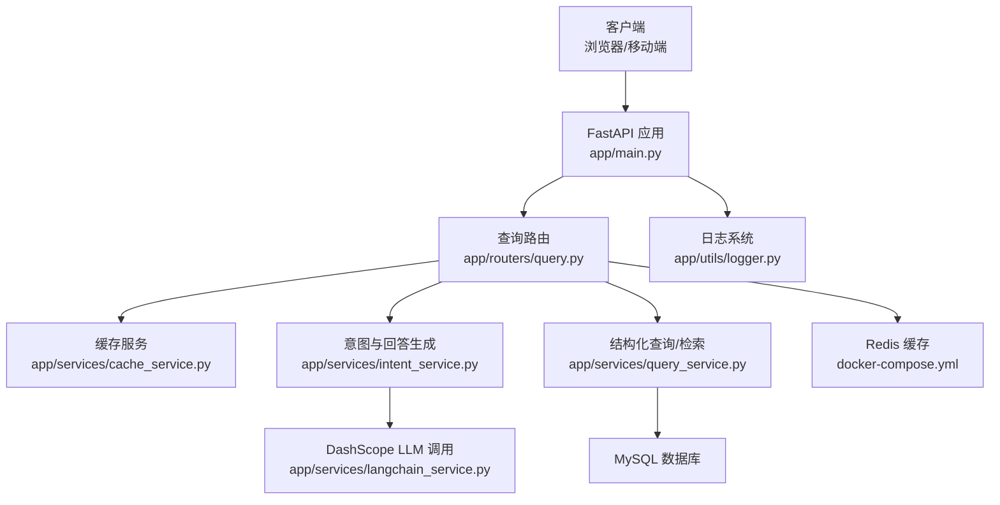
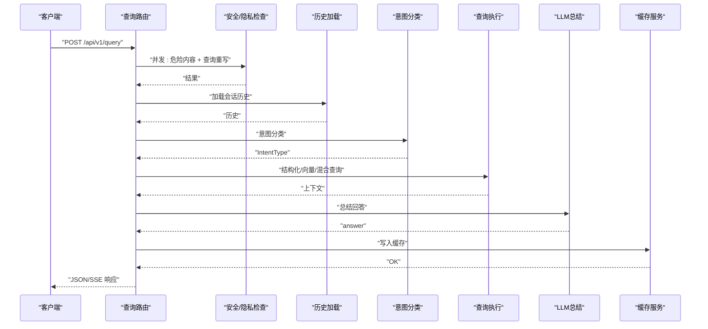
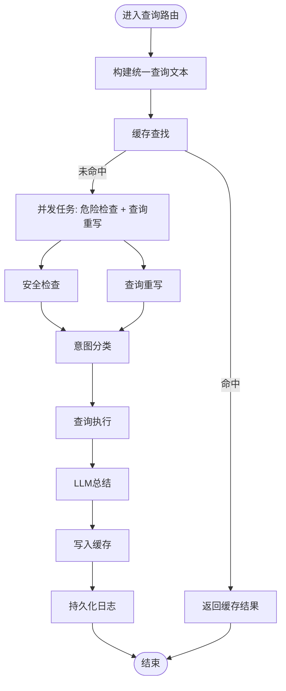
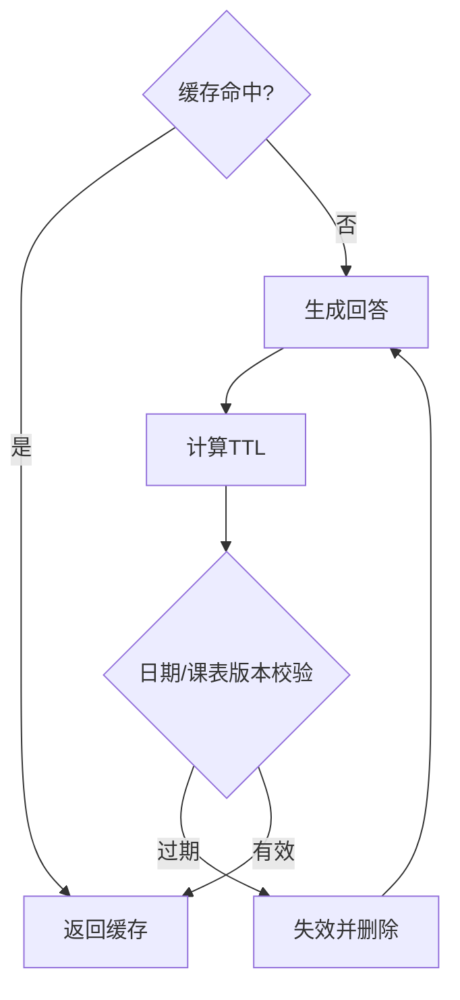
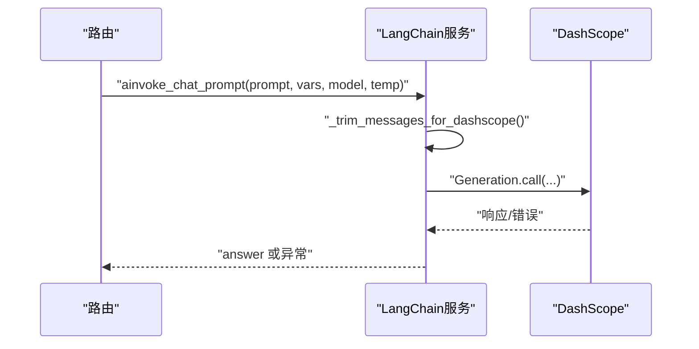
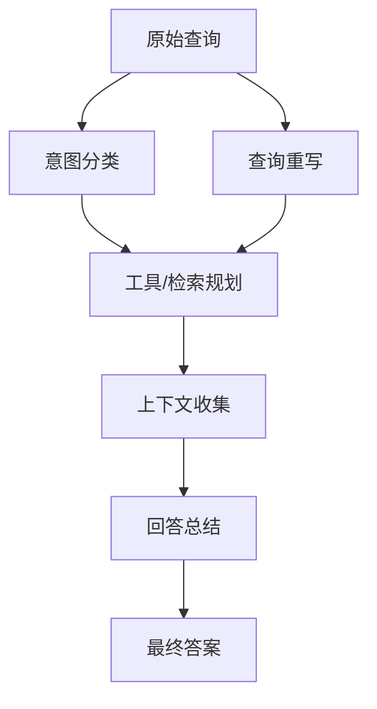
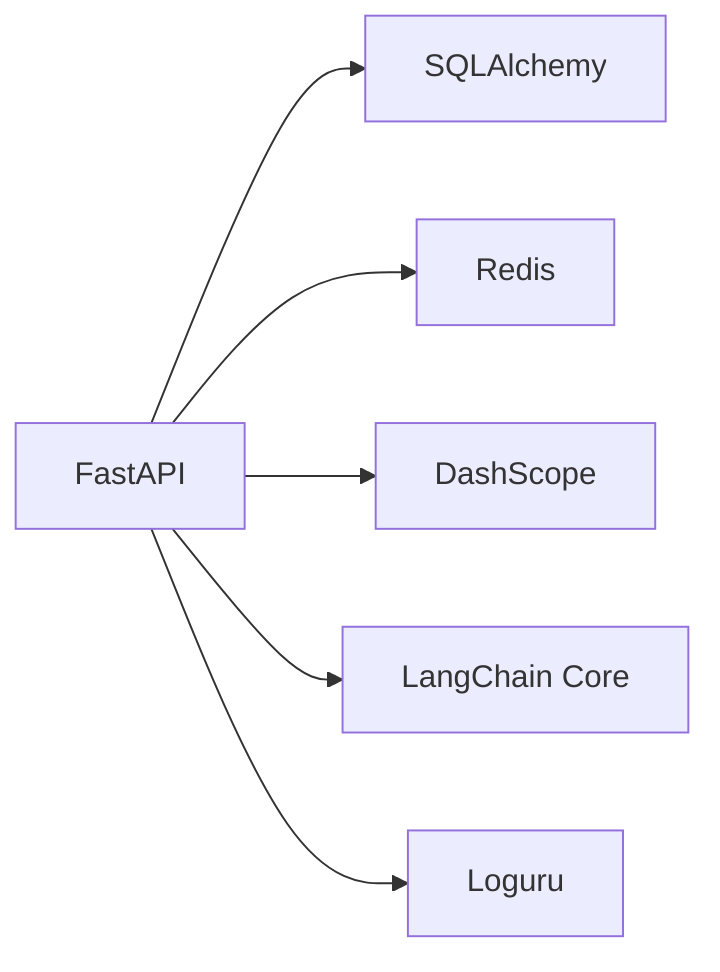

# AI服务优化

<cite>
**本文档引用的文件**
- [main.py](file://service/ai_assistant/app/main.py)
- [config.py](file://service/ai_assistant/app/config.py)
- [dependencies.py](file://service/ai_assistant/app/dependencies.py)
- [logger.py](file://service/ai_assistant/app/utils/logger.py)
- [query.py](file://service/ai_assistant/app/routers/query.py)
- [langchain_service.py](file://service/ai_assistant/app/services/langchain_service.py)
- [cache_service.py](file://service/ai_assistant/app/services/cache_service.py)
- [intent_service.py](file://service/ai_assistant/app/services/intent_service.py)
- [query_service.py](file://service/ai_assistant/app/services/query_service.py)
- [query.py](file://service/ai_assistant/app/schemas/query.py)
- [requirements.txt](file://service/ai_assistant/requirements.txt)
- [Dockerfile](file://service/ai_assistant/Dockerfile)
- [docker-compose.yml](file://service/ai_assistant/docker-compose.yml)
</cite>

## 目录
1. [简介](#简介)
2. [项目结构](#项目结构)
3. [核心组件](#核心组件)
4. [架构总览](#架构总览)
5. [详细组件分析](#详细组件分析)
6. [依赖分析](#依赖分析)
7. [性能考虑](#性能考虑)
8. [故障排查指南](#故障排查指南)
9. [结论](#结论)
10. [附录](#附录)

## 简介
本指南面向AI校园助手的AI服务集成，聚焦大语言模型调用的性能优化与稳定性保障。内容涵盖并发控制、请求批处理、响应缓存、超时与重试、服务降级、监控与分析、资源管理、弹性伸缩与成本优化，以及多AI模型的负载均衡与故障转移策略。文档基于现有代码库进行深入分析，提供可操作的优化建议与最佳实践。

## 项目结构
后端采用FastAPI + Async SQLAlchemy + Redis + DashScope（阿里云百炼）的架构。核心路径如下：
- 应用入口与生命周期：app/main.py
- 配置中心：app/config.py
- 依赖注入与Redis连接池：app/dependencies.py
- 日志：app/utils/logger.py
- 查询路由与主流程：app/routers/query.py
- LLM调用适配层：app/services/langchain_service.py
- 缓存服务：app/services/cache_service.py
- 意图与回答生成：app/services/intent_service.py
- 结构化查询与检索：app/services/query_service.py
- 请求/响应模型：app/schemas/query.py
- 依赖与运行时：requirements.txt、Dockerfile、docker-compose.yml

图表来源
- [main.py:52-86](file://service/ai_assistant/app/main.py#L52-L86)
- [query.py:198-746](file://service/ai_assistant/app/routers/query.py#L198-L746)
- [cache_service.py:92-177](file://service/ai_assistant/app/services/cache_service.py#L92-L177)
- [intent_service.py:218-346](file://service/ai_assistant/app/services/intent_service.py#L218-L346)
- [query_service.py:1-800](file://service/ai_assistant/app/services/query_service.py#L1-L800)
- [langchain_service.py:139-278](file://service/ai_assistant/app/services/langchain_service.py#L139-L278)
- [docker-compose.yml:5-24](file://service/ai_assistant/docker-compose.yml#L5-L24)

章节来源
- [main.py:1-86](file://service/ai_assistant/app/main.py#L1-L86)
- [docker-compose.yml:1-31](file://service/ai_assistant/docker-compose.yml#L1-L31)

## 核心组件
- 应用入口与CORS/路由注册：负责应用初始化、生命周期钩子、CORS配置与路由注册。
- 配置中心：集中管理数据库、Redis、JWT、DashScope、缓存TTL、模型名称等配置。
- 依赖注入：提供数据库会话、Redis连接池、鉴权依赖。
- 查询路由：统一入口，串联媒体解码、安全检查、缓存、意图分类、查询执行、LLM总结、缓存写回、日志持久化。
- LLM适配层：封装DashScope调用，支持同步与流式输出，内置消息裁剪与会话构建。
- 缓存服务：基于Redis的键空间隔离、敏感度TTL、日期/课表版本失效策略。
- 意图与回答生成：LangChain链式调用，包含意图分类、查询重写、回答总结与流式输出。
- 结构化查询与检索：SQL查询、向量检索、混合检索、工具规划与重排。
- 日志系统：统一Loguru日志，控制台与文件双通道。

章节来源
- [main.py:36-86](file://service/ai_assistant/app/main.py#L36-L86)
- [config.py:6-113](file://service/ai_assistant/app/config.py#L6-L113)
- [dependencies.py:27-51](file://service/ai_assistant/app/dependencies.py#L27-L51)
- [query.py:198-746](file://service/ai_assistant/app/routers/query.py#L198-L746)
- [langchain_service.py:139-278](file://service/ai_assistant/app/services/langchain_service.py#L139-L278)
- [cache_service.py:92-177](file://service/ai_assistant/app/services/cache_service.py#L92-L177)
- [intent_service.py:218-346](file://service/ai_assistant/app/services/intent_service.py#L218-L346)
- [query_service.py:1-800](file://service/ai_assistant/app/services/query_service.py#L1-L800)
- [logger.py:17-53](file://service/ai_assistant/app/utils/logger.py#L17-L53)

## 架构总览
AI服务整体流程从客户端请求进入，经路由层完成多模态预处理、安全与隐私检查、缓存命中判断，随后并发执行危险内容检测与查询重写，再根据意图选择结构化查询、向量检索或混合检索，最后通过LLM进行总结并写回缓存与日志。

图表来源
- [query.py:207-746](file://service/ai_assistant/app/routers/query.py#L207-L746)
- [intent_service.py:218-346](file://service/ai_assistant/app/services/intent_service.py#L218-L346)
- [query_service.py:1-800](file://service/ai_assistant/app/services/query_service.py#L1-L800)
- [cache_service.py:149-177](file://service/ai_assistant/app/services/cache_service.py#L149-L177)

## 详细组件分析

### 并发控制与请求批处理
- 路由层并发：在安全检查与查询重写阶段使用异步任务并发执行，缩短端到端延迟。
- 流式输出：使用SSE与线程池包装生成器，避免长时间持有数据库连接。
- 批量删除：会话清理接口支持批量扫描与删除，降低Redis压力。

图表来源
- [query.py:347-470](file://service/ai_assistant/app/routers/query.py#L347-L470)
- [query.py:659-744](file://service/ai_assistant/app/routers/query.py#L659-L744)

章节来源
- [query.py:347-470](file://service/ai_assistant/app/routers/query.py#L347-L470)
- [query.py:659-744](file://service/ai_assistant/app/routers/query.py#L659-L744)

### 响应缓存策略
- 键空间隔离：基于DID与查询哈希生成缓存键，避免跨用户污染。
- 敏感度TTL：区分敏感/普通查询，分别设置30分钟与1天TTL。
- 时效性控制：日期敏感查询按“当日桶”失效，课表敏感查询通过版本号失效。
- 写回时机：JSON输出与流式输出分别在不同阶段写回缓存，保证一致性。

图表来源
- [cache_service.py:92-177](file://service/ai_assistant/app/services/cache_service.py#L92-L177)
- [query.py:281-312](file://service/ai_assistant/app/routers/query.py#L281-L312)
- [query.py:708-738](file://service/ai_assistant/app/routers/query.py#L708-L738)

章节来源
- [cache_service.py:92-177](file://service/ai_assistant/app/services/cache_service.py#L92-L177)
- [query.py:281-312](file://service/ai_assistant/app/routers/query.py#L281-L312)
- [query.py:708-738](file://service/ai_assistant/app/routers/query.py#L708-L738)

### LLM调用与超时/重试
- 调用封装：提供同步与流式两种调用方式，统一消息格式与会话构建。
- 输入裁剪：按最大字符限制裁剪历史与消息，避免超出模型输入上限。
- 会话控制：可禁用环境代理，避免意外转发；必要时传入自定义Session。
- 错误处理：对非200状态抛出异常并记录日志，路由层统一转换为友好错误。

图表来源
- [langchain_service.py:139-204](file://service/ai_assistant/app/services/langchain_service.py#L139-L204)
- [langchain_service.py:206-278](file://service/ai_assistant/app/services/langchain_service.py#L206-L278)

章节来源
- [langchain_service.py:139-204](file://service/ai_assistant/app/services/langchain_service.py#L139-L204)
- [langchain_service.py:206-278](file://service/ai_assistant/app/services/langchain_service.py#L206-L278)

### 意图分类与查询重写
- 意图分类：基于系统提示词对查询进行structured/vector/hybrid/smalltalk分类。
- 查询重写：结合最近历史，补齐缺失信息，限制最大长度并截断。
- 回答总结：构建自然语言回答提示，限制历史与上下文长度，避免溢出。

图表来源
- [intent_service.py:218-346](file://service/ai_assistant/app/services/intent_service.py#L218-L346)
- [query_service.py:150-800](file://service/ai_assistant/app/services/query_service.py#L150-L800)

章节来源
- [intent_service.py:218-346](file://service/ai_assistant/app/services/intent_service.py#L218-L346)
- [query_service.py:150-800](file://service/ai_assistant/app/services/query_service.py#L150-L800)

### 结构化查询与检索
- SQL查询：围绕学生隐私限定，提供成绩、课表、选课、个人信息、学术概览等查询。
- 向量检索：基于百炼检索器封装，支持异步检索与文档对象转换。
- 混合检索：结合向量与应用侧数据，执行去重与重排，输出高质量上下文。

章节来源
- [query_service.py:575-800](file://service/ai_assistant/app/services/query_service.py#L575-L800)
- [query_service.py:212-238](file://service/ai_assistant/app/services/query_service.py#L212-L238)

### 会话历史与上下文管理
- 会话隔离：按DID+session_id隔离历史，避免并发会话串话。
- 历史截断：限制最大历史数量，避免上下文膨胀。
- Fallback：Redis异常时降级至数据库历史，保证可用性。

章节来源
- [query.py:153-196](file://service/ai_assistant/app/routers/query.py#L153-L196)
- [query.py:317-342](file://service/ai_assistant/app/routers/query.py#L317-L342)

## 依赖分析
- Web框架与ASGI：FastAPI + Uvicorn
- 数据库：SQLAlchemy异步 + aiomysql
- 缓存：Redis（aioredis）
- LLM：DashScope + 百炼SDK
- 工具链：LangChain Core、Pydantic Settings、Loguru

图表来源
- [requirements.txt:1-22](file://service/ai_assistant/requirements.txt#L1-L22)

章节来源
- [requirements.txt:1-22](file://service/ai_assistant/requirements.txt#L1-L22)

## 性能考虑

### 并发控制与请求批处理
- 路由层并发：在安全检查与查询重写阶段使用异步任务并发执行，缩短端到端延迟。
- 流式输出：使用SSE与线程池包装生成器，避免长时间持有数据库连接。
- 批量删除：会话清理接口支持批量扫描与删除，降低Redis压力。

章节来源
- [query.py:347-470](file://service/ai_assistant/app/routers/query.py#L347-L470)
- [query.py:659-744](file://service/ai_assistant/app/routers/query.py#L659-L744)
- [query.py:763-786](file://service/ai_assistant/app/routers/query.py#L763-L786)

### 响应缓存
- 键空间隔离：基于DID与查询哈希生成缓存键，避免跨用户污染。
- 敏感度TTL：区分敏感/普通查询，分别设置30分钟与1天TTL。
- 时效性控制：日期敏感查询按“当日桶”失效，课表敏感查询通过版本号失效。
- 写回时机：JSON输出与流式输出分别在不同阶段写回缓存，保证一致性。

章节来源
- [cache_service.py:92-177](file://service/ai_assistant/app/services/cache_service.py#L92-L177)
- [query.py:281-312](file://service/ai_assistant/app/routers/query.py#L281-L312)
- [query.py:708-738](file://service/ai_assistant/app/routers/query.py#L708-L738)

### LLM调用优化
- 输入裁剪：按最大字符限制裁剪历史与消息，避免超出模型输入上限。
- 会话控制：可禁用环境代理，避免意外转发；必要时传入自定义Session。
- 温度与Token：针对不同阶段设置温度与最大Token，平衡质量与速度。
- 流式输出：支持增量输出，提升感知延迟。

章节来源
- [langchain_service.py:139-204](file://service/ai_assistant/app/services/langchain_service.py#L139-L204)
- [langchain_service.py:206-278](file://service/ai_assistant/app/services/langchain_service.py#L206-L278)
- [intent_service.py:218-346](file://service/ai_assistant/app/services/intent_service.py#L218-L346)

### 超时设置与重试机制
- 路由层错误转换：将底层异常转换为用户可见的友好提示，避免泄露内部错误。
- 服务降级：Redis异常时降级至数据库历史；意图分类失败时回退为向量模式。
- 网络超时：DashScope调用通过Session与API Key配置，建议在生产环境增加超时与重试策略。

章节来源
- [query.py:142-151](file://service/ai_assistant/app/routers/query.py#L142-L151)
- [query.py:497-500](file://service/ai_assistant/app/routers/query.py#L497-L500)
- [langchain_service.py:169-200](file://service/ai_assistant/app/services/langchain_service.py#L169-L200)

### 监控与性能分析
- 日志埋点：路由层记录请求耗时、缓存命中、LLM调用次数与错误，便于统计分析。
- SSE头部：设置防缓冲与保持连接，降低反向代理干扰。
- 指标建议：可扩展埋点统计响应时间分布、错误率、吞吐量、缓存命中率、LLM调用成功率。

章节来源
- [query.py:213-746](file://service/ai_assistant/app/routers/query.py#L213-L746)
- [logger.py:17-53](file://service/ai_assistant/app/utils/logger.py#L17-L53)

### 资源管理
- 模型加载：通过配置中心集中管理模型名称，便于切换与成本控制。
- 内存使用：限制历史与上下文长度，避免内存峰值过高。
- GPU/CPU：DashScope为云端推理，无需本地资源分配；可通过模型选择与Token限制间接控制成本。

章节来源
- [config.py:54-73](file://service/ai_assistant/app/config.py#L54-L73)
- [intent_service.py:163-210](file://service/ai_assistant/app/services/intent_service.py#L163-L210)

### 弹性伸缩与成本优化
- 水平扩展：Docker Compose可扩展Uvicorn worker数量，配合Nginx/Ingress实现负载均衡。
- 缓存优化：合理设置TTL与失效策略，降低重复LLM调用。
- 模型选择：根据场景选择更轻量模型（如turbo）以降低成本。
- 限流与熔断：建议引入速率限制与熔断器，防止突发流量压垮上游服务。

章节来源
- [docker-compose.yml:1-31](file://service/ai_assistant/docker-compose.yml#L1-L31)
- [Dockerfile:42-49](file://service/ai_assistant/Dockerfile#L42-L49)
- [config.py:54-73](file://service/ai_assistant/app/config.py#L54-L73)

### 多AI模型的负载均衡与故障转移
- 负载均衡：通过反向代理或Kubernetes Service实现多实例分发。
- 故障转移：LLM调用失败时回退至缓存或降级回答；Redis异常时降级数据库历史。
- 多模型策略：根据任务复杂度动态选择模型，平衡质量与成本。

章节来源
- [query.py:497-500](file://service/ai_assistant/app/routers/query.py#L497-L500)
- [langchain_service.py:169-200](file://service/ai_assistant/app/services/langchain_service.py#L169-L200)

## 故障排查指南
- 认证失败：检查JWT令牌有效性与后端解码逻辑。
- Redis异常：查看连接池初始化与异常降级逻辑，确认TTL与键空间。
- LLM调用错误：检查API Key、模型名称与输入裁剪；关注非200状态与异常日志。
- 缓存未命中：确认DID与查询哈希生成规则，检查敏感度与版本失效。
- SSE流中断：检查SSE头部设置与线程池阻塞，避免长时间持有数据库连接。

章节来源
- [dependencies.py:56-73](file://service/ai_assistant/app/dependencies.py#L56-L73)
- [dependencies.py:36-51](file://service/ai_assistant/app/dependencies.py#L36-L51)
- [query.py:237-261](file://service/ai_assistant/app/routers/query.py#L237-L261)
- [langchain_service.py:183-200](file://service/ai_assistant/app/services/langchain_service.py#L183-L200)
- [cache_service.py:114-143](file://service/ai_assistant/app/services/cache_service.py#L114-L143)

## 结论
通过并发控制、缓存策略、输入裁剪、服务降级与日志埋点，AI校园助手在保证用户体验的同时实现了较好的性能与稳定性。建议进一步引入超时与重试、限流熔断、指标监控与弹性伸缩机制，持续优化多模型负载与成本控制。

## 附录
- 配置项速览：数据库、Redis、JWT、DashScope、缓存TTL、模型名称。
- 运行时环境：Dockerfile与docker-compose配置，包含Redis健康检查与内存策略。

章节来源
- [config.py:13-113](file://service/ai_assistant/app/config.py#L13-L113)
- [docker-compose.yml:5-24](file://service/ai_assistant/docker-compose.yml#L5-L24)
- [Dockerfile:1-49](file://service/ai_assistant/Dockerfile#L1-L49)