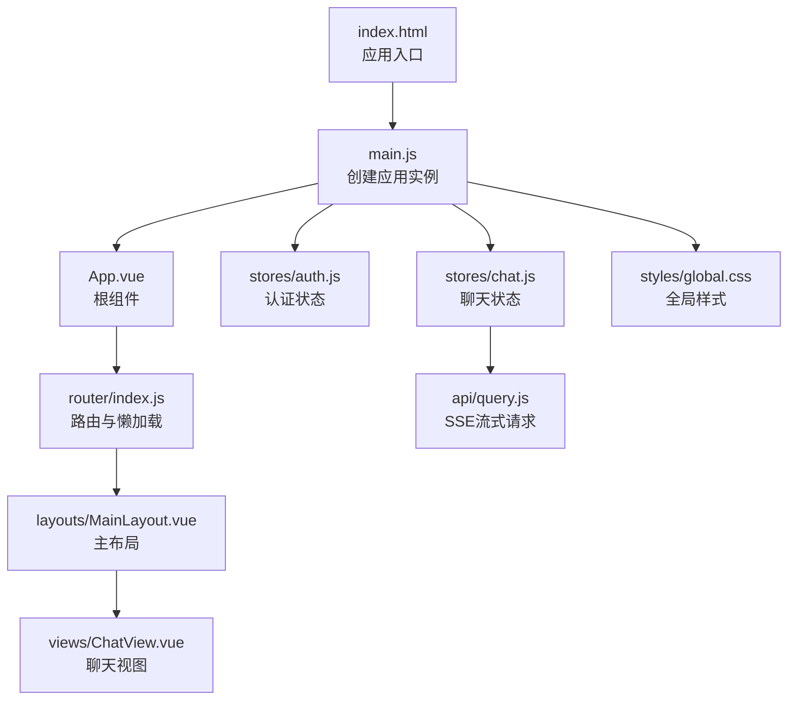
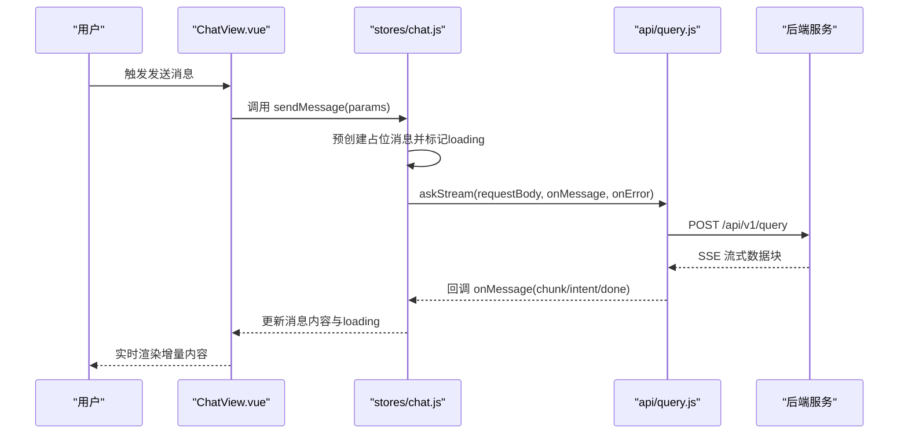
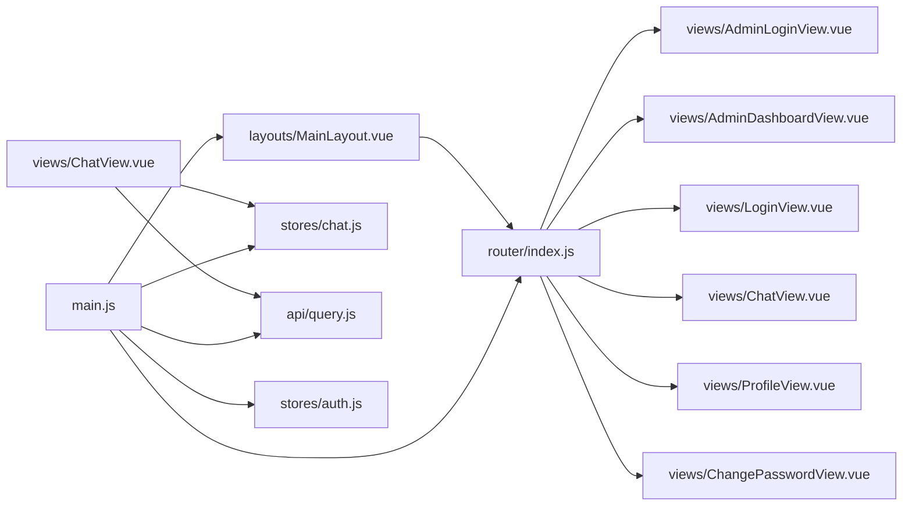

# 前端性能优化

<cite>
**本文引用的文件**
- [package.json](file://frontend/ai_assistant/package.json)
- [vite.config.js](file://frontend/ai_assistant/vite.config.js)
- [main.js](file://frontend/ai_assistant/src/main.js)
- [index.html](file://frontend/ai_assistant/index.html)
- [router/index.js](file://frontend/ai_assistant/src/router/index.js)
- [App.vue](file://frontend/ai_assistant/src/App.vue)
- [layouts/MainLayout.vue](file://frontend/ai_assistant/src/layouts/MainLayout.vue)
- [views/ChatView.vue](file://frontend/ai_assistant/src/views/ChatView.vue)
- [stores/chat.js](file://frontend/ai_assistant/src/stores/chat.js)
- [stores/auth.js](file://frontend/ai_assistant/src/stores/auth.js)
- [api/query.js](file://frontend/ai_assistant/src/api/query.js)
- [utils/format.js](file://frontend/ai_assistant/src/utils/format.js)
- [utils/session.js](file://frontend/ai_assistant/src/utils/session.js)
- [styles/global.css](file://frontend/ai_assistant/src/styles/global.css)
</cite>

## 目录
1. [引言](#引言)
2. [项目结构](#项目结构)
3. [核心组件](#核心组件)
4. [架构总览](#架构总览)
5. [详细组件分析](#详细组件分析)
6. [依赖分析](#依赖分析)
7. [性能考量](#性能考量)
8. [故障排查指南](#故障排查指南)
9. [结论](#结论)
10. [附录](#附录)

## 引言
本指南面向AI校园助手前端应用，聚焦于Vue 3 + Vite工程的性能优化策略。内容覆盖组件懒加载与代码分割、资源压缩、缓存策略（浏览器缓存、Service Worker、CDN）、性能监控与分析、用户体验优化（首屏、骨架屏、渐进式加载），以及移动端专项优化建议。文档基于仓库现有实现进行分析，并提出可落地的优化方案。

## 项目结构
前端采用Vite构建，使用Vue 3单文件组件、Pinia状态管理、Vue Router路由与懒加载、Axios网络请求封装。项目入口位于index.html，根组件App.vue承载路由视图；主布局MainLayout.vue负责侧边栏、移动端适配与导航；聊天视图ChatView.vue承载多模态输入与流式渲染；Pinia stores负责认证与聊天状态；API模块封装SSE流式接口；全局样式集中定义主题变量与通用样式。

**图表来源**
- [index.html:1-13](file://frontend/ai_assistant/index.html#L1-L13)
- [main.js:1-10](file://frontend/ai_assistant/src/main.js#L1-L10)
- [App.vue:1-7](file://frontend/ai_assistant/src/App.vue#L1-L7)
- [router/index.js:1-75](file://frontend/ai_assistant/src/router/index.js#L1-L75)
- [layouts/MainLayout.vue:1-487](file://frontend/ai_assistant/src/layouts/MainLayout.vue#L1-L487)
- [views/ChatView.vue:1-1168](file://frontend/ai_assistant/src/views/ChatView.vue#L1-L1168)
- [stores/auth.js:1-77](file://frontend/ai_assistant/src/stores/auth.js#L1-L77)
- [stores/chat.js:1-278](file://frontend/ai_assistant/src/stores/chat.js#L1-L278)
- [api/query.js:1-141](file://frontend/ai_assistant/src/api/query.js#L1-L141)
- [styles/global.css:1-113](file://frontend/ai_assistant/src/styles/global.css#L1-L113)

**章节来源**
- [index.html:1-13](file://frontend/ai_assistant/index.html#L1-L13)
- [main.js:1-10](file://frontend/ai_assistant/src/main.js#L1-L10)
- [router/index.js:1-75](file://frontend/ai_assistant/src/router/index.js#L1-L75)

## 核心组件
- 路由与懒加载：路由配置中对各视图采用动态导入实现按需加载，减少初始包体。
- 主布局：侧边栏、移动端遮罩、会话列表与导航，承担大量DOM与事件交互。
- 聊天视图：多模态输入（文本、图片、语音）、Markdown渲染、滚动与流式渲染。
- Pinia状态：认证与聊天状态持久化至localStorage，提升二次进入体验。
- API层：封装SSE流式接口，兼容JSON回退，保证加载状态可控。

**章节来源**
- [router/index.js:5-49](file://frontend/ai_assistant/src/router/index.js#L5-L49)
- [layouts/MainLayout.vue:1-487](file://frontend/ai_assistant/src/layouts/MainLayout.vue#L1-L487)
- [views/ChatView.vue:1-1168](file://frontend/ai_assistant/src/views/ChatView.vue#L1-L1168)
- [stores/chat.js:1-278](file://frontend/ai_assistant/src/stores/chat.js#L1-L278)
- [stores/auth.js:1-77](file://frontend/ai_assistant/src/stores/auth.js#L1-L77)
- [api/query.js:1-141](file://frontend/ai_assistant/src/api/query.js#L1-L141)

## 架构总览
下图展示从用户交互到后端流式响应的关键路径，体现懒加载、状态管理与流式渲染的协同。

**图表来源**
- [views/ChatView.vue:312-333](file://frontend/ai_assistant/src/views/ChatView.vue#L312-L333)
- [stores/chat.js:133-230](file://frontend/ai_assistant/src/stores/chat.js#L133-L230)
- [api/query.js:28-140](file://frontend/ai_assistant/src/api/query.js#L28-L140)

## 详细组件分析

### 组件懒加载与代码分割
- 路由级懒加载：通过动态导入实现视图组件的按需加载，降低首屏JS体积。
- 优势：首屏仅加载必要模块，后续导航按需下载对应chunk。
- 建议：保持现有按路由拆分策略；对大型第三方库（如Markdown渲染）可进一步拆分异步引入。

**章节来源**
- [router/index.js:9-32](file://frontend/ai_assistant/src/router/index.js#L9-L32)

### 资源压缩与打包优化
- 构建工具：Vite默认启用ESBuild压缩JS、Rollup合并与最小化CSS/HTML。
- 生产构建：使用Vite的build命令生成dist目录，具备默认的代码压缩与静态资源内联/外链策略。
- 建议：结合Vite插件生态（如压缩CSS/JS、SVG雪碧图、图片优化）进一步优化体积与传输效率。

**章节来源**
- [package.json:6-10](file://frontend/ai_assistant/package.json#L6-L10)
- [vite.config.js:1-23](file://frontend/ai_assistant/vite.config.js#L1-L23)

### 图片优化
- 前端压缩：图片上传时根据文件大小与尺寸进行前端压缩，控制体积以满足后端网关限制。
- 建议：优先使用现代格式（如WebP）；对缩略图采用Canvas压缩；对首屏关键图片采用webp或avif；对非关键图片使用懒加载与低质量占位图。

**章节来源**
- [views/ChatView.vue:335-390](file://frontend/ai_assistant/src/views/ChatView.vue#L335-L390)

### 字体与CSS优化
- 字体：通过Google Fonts引入Inter，建议在生产环境配置字体子集与缓存头，或内联关键字体子集。
- CSS：集中定义CSS变量与通用样式，减少重复计算；对动画与阴影使用硬件加速友好属性。
- 建议：开启CSS压缩与Tree-Shaking；对关键CSS内联，非关键CSS分离；使用媒体查询避免不必要的样式加载。

**章节来源**
- [styles/global.css:1-113](file://frontend/ai_assistant/src/styles/global.css#L1-L113)

### JavaScript压缩与模块化
- 依赖：Vue 3、Vue Router、Pinia、Axios、UUID、Marked等，均参与运行时与构建优化。
- 建议：确保生产构建开启压缩；对第三方库使用CDN或外部化策略以复用缓存；对大库按需引入（如Marked仅在需要时加载）。

**章节来源**
- [package.json:11-22](file://frontend/ai_assistant/package.json#L11-L22)

### 缓存策略
- 浏览器缓存：静态资源通过Vite构建生成带哈希的文件名，配合服务端Cache-Control实现长效缓存。
- Service Worker：可选实现离线缓存与后台同步，适合消息历史与静态资源缓存。
- CDN：静态资源走CDN，结合边缘缓存与压缩，显著降低首屏加载时间。
- 建议：为不同资源类型设置差异化缓存策略（HTML短缓存、JS/CSS长缓存、图片按版本缓存）。

**章节来源**
- [vite.config.js:1-23](file://frontend/ai_assistant/vite.config.js#L1-L23)

### 性能监控与分析
- 页面加载时间：使用Navigation Timing与Resource Timing统计FCP/LCP/INP/CLS等指标。
- 交互延迟：监控路由切换、消息发送、滚动等关键交互的延迟。
- 内存使用：定期检查组件实例数量与事件监听器，避免泄漏。
- 建议：集成Web Vitals或自定义埋点；在开发阶段使用性能面板定位瓶颈。

**章节来源**
- [stores/chat.js:133-230](file://frontend/ai_assistant/src/stores/chat.js#L133-L230)

### 用户体验优化
- 骨架屏：在消息列表与会话列表渲染前显示占位骨架，提升感知速度。
- 渐进式加载：对长列表采用虚拟滚动；对图片采用低质量占位图与渐进式增强。
- 首屏优化：将关键路径CSS内联；延迟加载非关键脚本；利用路由懒加载与预取策略。
- 建议：在ChatView与MainLayout中增加骨架屏组件；对Markdown渲染进行防抖与节流。

**章节来源**
- [views/ChatView.vue:44-146](file://frontend/ai_assistant/src/views/ChatView.vue#L44-L146)
- [layouts/MainLayout.vue:36-67](file://frontend/ai_assistant/src/layouts/MainLayout.vue#L36-L67)

### 移动端性能优化
- 响应式布局：侧边栏在小屏自动折叠，移动端顶栏与遮罩提升可用性。
- 事件与滚动：避免在滚动中执行重计算；使用防抖/节流；合理使用will-change。
- 媒体输入：录音与图片上传需注意权限与内存占用；及时释放媒体流与Canvas资源。
- 建议：对触摸事件使用passive监听；对图片与音频进行压缩与缓存；在低端设备降级动画效果。

**章节来源**
- [layouts/MainLayout.vue:472-486](file://frontend/ai_assistant/src/layouts/MainLayout.vue#L472-L486)
- [views/ChatView.vue:397-481](file://frontend/ai_assistant/src/views/ChatView.vue#L397-L481)

## 依赖分析
- 组件耦合：ChatView依赖Pinia stores与API模块；MainLayout依赖路由与认证store；router通过动态导入解耦视图。
- 外部依赖：Axios用于HTTP请求；UUID用于标识生成；Marked用于Markdown渲染；Pinia提供状态管理。
- 优化点：对大依赖进行按需加载；对第三方库进行外部化与CDN复用；对API层统一拦截与缓存策略。

**图表来源**
- [router/index.js:1-75](file://frontend/ai_assistant/src/router/index.js#L1-L75)
- [layouts/MainLayout.vue:1-487](file://frontend/ai_assistant/src/layouts/MainLayout.vue#L1-L487)
- [views/ChatView.vue:1-1168](file://frontend/ai_assistant/src/views/ChatView.vue#L1-L1168)
- [stores/chat.js:1-278](file://frontend/ai_assistant/src/stores/chat.js#L1-L278)
- [stores/auth.js:1-77](file://frontend/ai_assistant/src/stores/auth.js#L1-L77)
- [api/query.js:1-141](file://frontend/ai_assistant/src/api/query.js#L1-L141)
- [main.js:1-10](file://frontend/ai_assistant/src/main.js#L1-L10)

**章节来源**
- [router/index.js:1-75](file://frontend/ai_assistant/src/router/index.js#L1-L75)
- [main.js:1-10](file://frontend/ai_assistant/src/main.js#L1-L10)

## 性能考量
- 首屏加载：结合路由懒加载与关键CSS内联；对非关键脚本延迟加载；预取下一页面资源。
- 交互性能：避免在渲染循环中执行昂贵计算；对滚动与输入事件使用防抖/节流；合理拆分任务。
- 网络性能：SSE流式渲染减少等待；对重复请求进行去重与缓存；对图片与音频进行压缩与缓存。
- 内存与GC：及时清理事件监听器与定时器；避免在store中存储超大数据；对大数组采用分页或虚拟化。
- 移动端：降低动画复杂度；减少主线程阻塞；优化触摸反馈与滚动性能。

## 故障排查指南
- 路由懒加载失败：检查动态导入语法与路径；确认Vite别名配置正确。
- SSE流中断：检查后端响应头与Content-Type；确保fetch读取流式响应体；对异常进行兜底处理。
- 图片上传过大：前端压缩逻辑需覆盖Canvas输出；对文件大小与尺寸进行严格限制。
- 语音播放异常：检查浏览器权限与音频格式；对播放失败进行降级提示。
- 认证失效：检查Token过期与刷新机制；确保localStorage写入与读取一致。

**章节来源**
- [router/index.js:58-73](file://frontend/ai_assistant/src/router/index.js#L58-L73)
- [api/query.js:28-140](file://frontend/ai_assistant/src/api/query.js#L28-L140)
- [views/ChatView.vue:335-390](file://frontend/ai_assistant/src/views/ChatView.vue#L335-L390)
- [stores/auth.js:28-43](file://frontend/ai_assistant/src/stores/auth.js#L28-L43)

## 结论
本项目已具备良好的基础：路由懒加载、Pinia状态管理、SSE流式渲染与本地持久化。建议在现有基础上进一步完善资源优化（图片、字体、CSS/JS压缩）、缓存策略（浏览器缓存、Service Worker、CDN）、性能监控与用户体验优化（骨架屏、渐进式加载、移动端专项）。通过系统性的优化，可显著提升首屏速度、交互流畅度与整体稳定性。

## 附录
- 开发与构建命令：dev、build、preview。
- 代理配置：本地开发将/api前缀转发至后端服务。
- 入口与根组件：index.html与App.vue承载应用生命周期。

**章节来源**
- [package.json:6-10](file://frontend/ai_assistant/package.json#L6-L10)
- [vite.config.js:12-22](file://frontend/ai_assistant/vite.config.js#L12-L22)
- [index.html:1-13](file://frontend/ai_assistant/index.html#L1-L13)
- [App.vue:1-7](file://frontend/ai_assistant/src/App.vue#L1-L7)