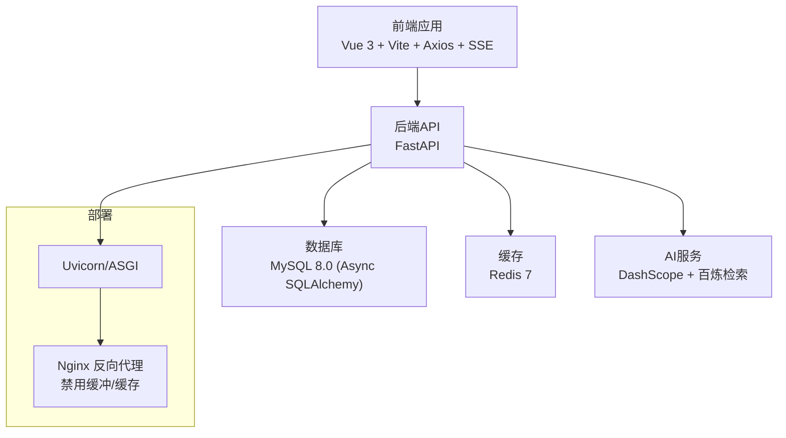
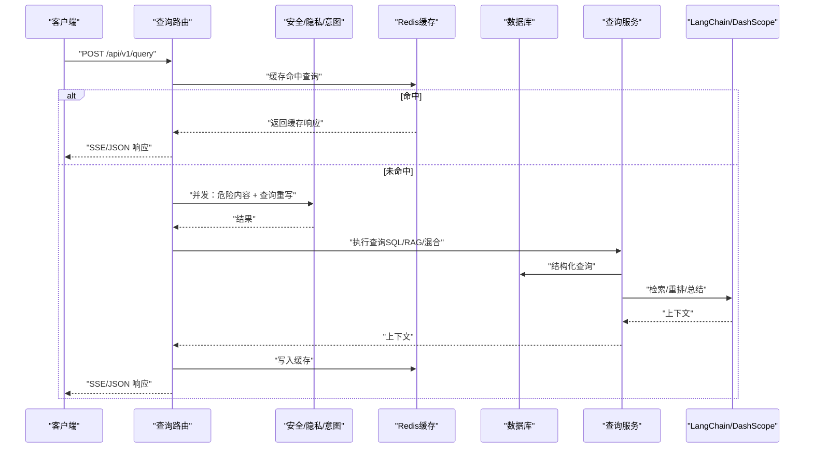
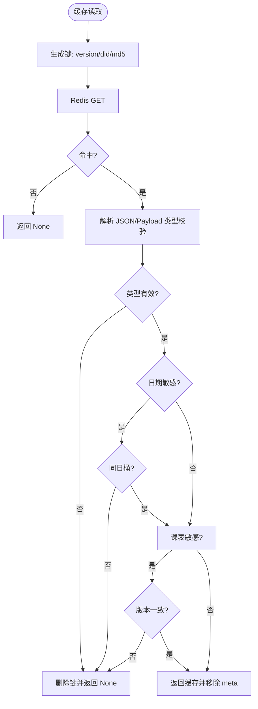
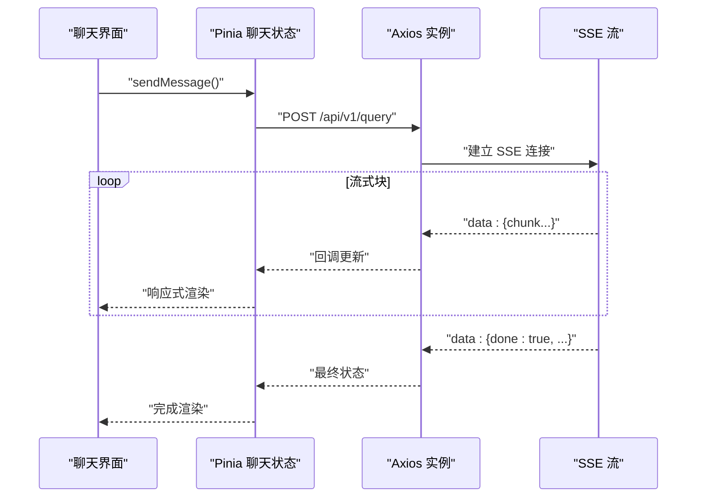
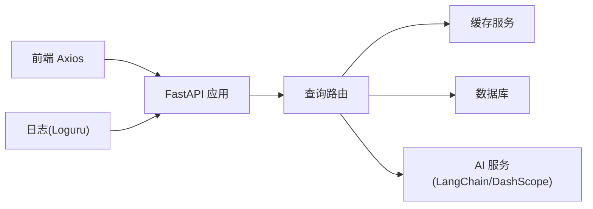

# 性能优化

<cite>
**本文引用的文件**
- [service/ai_assistant/app/main.py](file://service/ai_assistant/app/main.py)
- [service/ai_assistant/app/config.py](file://service/ai_assistant/app/config.py)
- [service/ai_assistant/app/database.py](file://service/ai_assistant/app/database.py)
- [service/ai_assistant/app/dependencies.py](file://service/ai_assistant/app/dependencies.py)
- [service/ai_assistant/app/routers/query.py](file://service/ai_assistant/app/routers/query.py)
- [service/ai_assistant/app/services/cache_service.py](file://service/ai_assistant/app/services/cache_service.py)
- [service/ai_assistant/app/services/query_service.py](file://service/ai_assistant/app/services/query_service.py)
- [service/ai_assistant/app/utils/logger.py](file://service/ai_assistant/app/utils/logger.py)
- [service/ai_assistant/requirements.txt](file://service/ai_assistant/requirements.txt)
- [frontend/ai_assistant/src/api/http.js](file://frontend/ai_assistant/src/api/http.js)
- [frontend/ai_assistant/src/stores/chat.js](file://frontend/ai_assistant/src/stores/chat.js)
- [frontend/ai_assistant/vite.config.js](file://frontend/ai_assistant/vite.config.js)
- [README.md](file://README.md)
</cite>

## 目录
1. [简介](#简介)
2. [项目结构](#项目结构)
3. [核心组件](#核心组件)
4. [架构总览](#架构总览)
5. [详细组件分析](#详细组件分析)
6. [依赖分析](#依赖分析)
7. [性能考虑](#性能考虑)
8. [故障排查指南](#故障排查指南)
9. [结论](#结论)
10. [附录](#附录)

## 简介
本指南面向“AI校园助手”项目，聚焦系统性能优化，覆盖数据库查询优化、缓存策略优化、内存使用优化、Redis缓存最佳实践、数据库连接池配置、AI服务调用性能优化、前端性能优化、性能与基准测试方法，以及容量规划与扩缩容指导。文档以代码为依据，提供可视化图示与实操建议，帮助在保障隐私与安全的前提下，显著提升系统吞吐与响应质量。

## 项目结构
后端采用 FastAPI + SQLAlchemy AsyncIO + Redis + LangChain + DashScope 的异步架构；前端采用 Vue 3 + Vite + Axios + SSE 流式渲染。整体通过 Docker Compose 编排，生产环境建议配合反向代理与 HTTPS。

**图表来源**
- [service/ai_assistant/app/main.py:52-86](file://service/ai_assistant/app/main.py#L52-L86)
- [service/ai_assistant/app/database.py:7-20](file://service/ai_assistant/app/database.py#L7-L20)
- [service/ai_assistant/app/dependencies.py:36-50](file://service/ai_assistant/app/dependencies.py#L36-L50)
- [README.md:9-14](file://README.md#L9-L14)

**章节来源**
- [README.md:1-104](file://README.md#L1-L104)

## 核心组件
- 应用入口与生命周期：FastAPI 应用初始化、CORS、路由注册、生命周期钩子（关闭时关闭 Redis 连接池）。
- 配置中心：数据库、Redis、JWT、AES、LLM 模型、缓存 TTL、CORS 等集中管理。
- 数据库层：异步引擎与会话工厂，连接池参数（pre_ping、recycle）。
- 依赖注入：Redis 单例客户端、数据库会话、鉴权依赖。
- 查询路由：统一入口，多模态输入解码、安全检查、并发任务、缓存命中、意图分类、查询执行、流式输出、日志与缓存持久化。
- 缓存服务：缓存键设计、敏感度判定、TTL、日期/课表版本失效、跨天与管理员改课失效策略。
- 查询服务：结构化查询（SQL）、知识库检索（RAG）、混合重排、字段翻译与可读化。
- 日志：统一 Loguru 配置，控制台与文件双通道，便于性能观测与定位。

**章节来源**
- [service/ai_assistant/app/main.py:1-86](file://service/ai_assistant/app/main.py#L1-L86)
- [service/ai_assistant/app/config.py:1-113](file://service/ai_assistant/app/config.py#L1-L113)
- [service/ai_assistant/app/database.py:1-35](file://service/ai_assistant/app/database.py#L1-L35)
- [service/ai_assistant/app/dependencies.py:1-109](file://service/ai_assistant/app/dependencies.py#L1-L109)
- [service/ai_assistant/app/routers/query.py:1-788](file://service/ai_assistant/app/routers/query.py#L1-L788)
- [service/ai_assistant/app/services/cache_service.py:1-177](file://service/ai_assistant/app/services/cache_service.py#L1-L177)
- [service/ai_assistant/app/services/query_service.py:1-800](file://service/ai_assistant/app/services/query_service.py#L1-L800)
- [service/ai_assistant/app/utils/logger.py:1-53](file://service/ai_assistant/app/utils/logger.py#L1-L53)

## 架构总览
系统围绕“查询路由”展开，核心路径包含：多模态输入解码、安全与隐私检查、并发任务（危险内容与查询重写）、缓存命中、意图分类、查询执行（SQL/RAG/混合）、总结与流式输出、日志与缓存持久化。Redis 用于会话历史与缓存，数据库负责结构化数据，LangChain + DashScope 提供检索与生成能力。

**图表来源**
- [service/ai_assistant/app/routers/query.py:207-745](file://service/ai_assistant/app/routers/query.py#L207-L745)
- [service/ai_assistant/app/services/cache_service.py:92-177](file://service/ai_assistant/app/services/cache_service.py#L92-L177)
- [service/ai_assistant/app/services/query_service.py:1-800](file://service/ai_assistant/app/services/query_service.py#L1-L800)

## 详细组件分析

### 数据库查询优化
- 连接池配置
  - pre_ping：保持连接健康，减少断连重试成本。
  - recycle：定期回收连接，避免长时间连接导致的异常。
  - echo：调试开关，生产建议关闭。
- 会话管理
  - 使用异步会话工厂，按请求作用域创建与释放，避免长事务占用连接。
  - 在流式输出阶段提前回滚请求会话，尽快归还连接到连接池。
- 查询优化要点
  - 隐私约束：所有结构化查询均以当前学生ID作为过滤条件，避免越权扫描。
  - 字段翻译与可读化：对英文字段名与学期ID进行本地化，减少前端二次处理开销。
  - 学期解析与周次计算：在服务层完成，避免重复计算与跨层传递复杂状态。
  - 混合查询重排：先去重与相关性重排，再拼接上下文，降低生成侧负担。

**章节来源**
- [service/ai_assistant/app/database.py:7-35](file://service/ai_assistant/app/database.py#L7-L35)
- [service/ai_assistant/app/routers/query.py:652-658](file://service/ai_assistant/app/routers/query.py#L652-L658)
- [service/ai_assistant/app/services/query_service.py:575-800](file://service/ai_assistant/app/services/query_service.py#L575-L800)

### 缓存策略优化
- 键设计
  - 形如 chat_cache:{version}:{did}:{query_md5}，版本号隔离升级，DID绑定用户，MD5哈希避免键过长。
- TTL 策略
  - 敏感/隐私查询：30分钟；普通查询：1天；可按业务调整。
- 失效策略
  - 日期敏感：按“当日日期桶”校验，跨天自动失效，避免“今天/明天”等相对时间语义陈旧。
  - 课表敏感：维护课表缓存版本号，管理员改课后递增版本，命中旧版本自动失效。
- 写入与读取
  - 读取时携带 _cache_meta，包含 date_sensitive/date_bucket/schedule_sensitive/schedule_cache_version，用于细粒度校验。
  - 写入时附带 meta，便于后续一致性校验与运维追踪。

**图表来源**
- [service/ai_assistant/app/services/cache_service.py:49-177](file://service/ai_assistant/app/services/cache_service.py#L49-L177)

**章节来源**
- [service/ai_assistant/app/services/cache_service.py:1-177](file://service/ai_assistant/app/services/cache_service.py#L1-L177)
- [service/ai_assistant/app/config.py:81-84](file://service/ai_assistant/app/config.py#L81-L84)

### Redis 缓存配置最佳实践
- 连接与单例
  - 通过依赖注入获取 Redis 单例，避免多实例造成连接浪费与一致性问题。
- 键空间管理
  - 使用命名空间 chat_cache:* 与 chat:session_history:*，便于批量清理与版本升级。
  - 批量删除采用 scan_iter + 批量 delete，避免阻塞。
- TTL 与内存
  - 按敏感度设定不同 TTL，平衡命中率与内存占用。
  - 对短期会话历史设置较短 TTL，避免长期驻留。
- 版本化与失效
  - 通过版本号与日期桶实现精准失效，避免脏数据影响用户体验。

**章节来源**
- [service/ai_assistant/app/dependencies.py:36-50](file://service/ai_assistant/app/dependencies.py#L36-L50)
- [service/ai_assistant/app/routers/query.py:752-787](file://service/ai_assistant/app/routers/query.py#L752-L787)
- [service/ai_assistant/app/services/cache_service.py:70-83](file://service/ai_assistant/app/services/cache_service.py#L70-L83)

### 数据库连接池配置与优化
- 参数建议
  - pool_pre_ping：开启，确保连接可用性。
  - pool_recycle：设置为小时级，避免长时间连接失效。
  - echo：开发调试使用，生产关闭。
- 会话生命周期
  - 在流式输出前回滚请求会话，尽快释放连接。
  - 使用独立短生命周期会话写入最终日志，避免与长连接争用。
- 并发与锁
  - 避免在事务内执行耗时操作（如生成回答），缩短事务持有时间。

**章节来源**
- [service/ai_assistant/app/database.py:7-20](file://service/ai_assistant/app/database.py#L7-L20)
- [service/ai_assistant/app/routers/query.py:652-658](file://service/ai_assistant/app/routers/query.py#L652-L658)

### AI 服务调用性能优化
- 并发控制
  - 安全检查与查询重写并发执行，缩短端到端延迟。
- 超时与重试
  - 建议在调用 LangChain/DashScope 时设置合理超时与指数退避重试，避免级联阻塞。
- 输入裁剪
  - 对超长输入进行截断或摘要，避免超出模型输入上限。
- 流式输出
  - 使用 SSE 流式输出，边生成边渲染，降低首字节延迟与感知延迟。
- 意图路由
  - 通过意图分类分流到结构化查询或检索链路，避免不必要的生成开销。

**章节来源**
- [service/ai_assistant/app/routers/query.py:347-352](file://service/ai_assistant/app/routers/query.py#L347-L352)
- [service/ai_assistant/app/routers/query.py:659-745](file://service/ai_assistant/app/routers/query.py#L659-L745)
- [README.md:34-46](file://README.md#L34-L46)

### 前端性能优化
- 资源与构建
  - 生产构建产物输出至 dist/，结合 CDN 与缓存头优化静态资源加载。
- 懒加载与按需
  - 路由与组件按需加载，减少首屏体积。
- SSE 与流式渲染
  - 使用 fetch + TextDecoder 读取 SSE，逐块渲染，避免一次性接收导致的卡顿。
- 状态与持久化
  - Pinia 状态与 localStorage 持久化，减少重复请求与刷新抖动。
- Axios 配置
  - 设置合理超时与统一拦截器，自动附加 Bearer Token，401 自动登出。

**图表来源**
- [frontend/ai_assistant/src/stores/chat.js:133-230](file://frontend/ai_assistant/src/stores/chat.js#L133-L230)
- [frontend/ai_assistant/src/api/http.js:10-16](file://frontend/ai_assistant/src/api/http.js#L10-L16)

**章节来源**
- [frontend/ai_assistant/src/stores/chat.js:1-278](file://frontend/ai_assistant/src/stores/chat.js#L1-L278)
- [frontend/ai_assistant/src/api/http.js:1-49](file://frontend/ai_assistant/src/api/http.js#L1-L49)
- [frontend/ai_assistant/vite.config.js:1-23](file://frontend/ai_assistant/vite.config.js#L1-L23)

## 依赖分析
- 后端依赖
  - FastAPI、Uvicorn、SQLAlchemy AsyncIO、aiomysql、redis、dashscope、langchain-core、loguru。
- 前端依赖
  - Vue 3、Vue Router、Pinia、Axios、CryptoJS、UUID、Marked。
- 关键耦合点
  - 查询路由依赖 Redis 缓存、数据库、AI 服务；缓存服务依赖 Redis；日志服务统一输出。

**图表来源**
- [service/ai_assistant/app/main.py:52-86](file://service/ai_assistant/app/main.py#L52-L86)
- [service/ai_assistant/app/routers/query.py:35-42](file://service/ai_assistant/app/routers/query.py#L35-L42)
- [service/ai_assistant/requirements.txt:1-22](file://service/ai_assistant/requirements.txt#L1-L22)

**章节来源**
- [service/ai_assistant/requirements.txt:1-22](file://service/ai_assistant/requirements.txt#L1-L22)

## 性能考虑
- 端到端延迟优化
  - 缓存优先：对常见查询命中缓存，避免数据库与 AI 服务开销。
  - 并发执行：安全检查与查询重写并行，缩短关键路径。
  - 流式输出：SSE 边生成边渲染，降低感知延迟。
- 内存与 CPU
  - 会话历史与缓存采用 Redis，避免在进程内存中堆积。
  - 生成阶段尽量使用流式迭代器，避免一次性拼接大字符串。
- 稳定性
  - Redis 失败降级：缓存失败时继续走数据库与 AI 服务，保证可用性。
  - 数据库失败降级：历史加载失败时回退到旧的 DID 历史，保证上下文连续性。
- 可观测性
  - 统一日志输出，包含时间戳、模块、函数、行号与消息体，便于性能分析与问题定位。

**章节来源**
- [service/ai_assistant/app/routers/query.py:281-342](file://service/ai_assistant/app/routers/query.py#L281-L342)
- [service/ai_assistant/app/utils/logger.py:17-46](file://service/ai_assistant/app/utils/logger.py#L17-L46)

## 故障排查指南
- Redis 连接问题
  - 确认 Redis 单例初始化与生命周期关闭逻辑，避免连接泄漏。
  - 检查键空间命名与版本号，确认批量清理是否生效。
- 数据库连接问题
  - 检查 pool_pre_ping 与 pool_recycle 设置，确认连接回收策略。
  - 确认在流式阶段已回滚请求会话，避免连接长时间占用。
- AI 服务异常
  - 检查超时与重试策略，避免上游不稳定导致下游排队。
  - 关注输入长度限制，必要时进行截断或摘要。
- 前端流式渲染
  - 确认反向代理未启用缓冲，SSE 才能稳定推送。
  - 检查 Axios 超时与错误处理，确保 401 自动登出。

**章节来源**
- [service/ai_assistant/app/main.py:36-49](file://service/ai_assistant/app/main.py#L36-L49)
- [service/ai_assistant/app/dependencies.py:36-50](file://service/ai_assistant/app/dependencies.py#L36-L50)
- [service/ai_assistant/app/routers/query.py:652-745](file://service/ai_assistant/app/routers/query.py#L652-L745)
- [README.md:67-104](file://README.md#L67-L104)

## 结论
通过“缓存优先、并发执行、流式输出、连接池优化、版本化失效、可观测性落地”的综合策略，可在保障隐私与安全的前提下，显著提升“AI校园助手”的性能与稳定性。建议在生产环境配合反向代理禁用缓冲、HTTPS 保护与容量规划，持续监控关键指标并迭代优化。

## 附录
- 容量规划与扩缩容
  - 评估峰值 QPS 与并发连接数，按数据库与 Redis 的连接池上限进行容量规划。
  - 使用水平扩展：多副本 + 负载均衡，结合 Redis 主从或集群提升缓存可用性。
  - 监控关键指标：P95/P99 延迟、缓存命中率、数据库连接池使用率、Redis 内存与命中率。
- 性能与基准测试
  - 基准场景：缓存命中、缓存未命中、纯图片问答、混合查询、长会话历史。
  - 工具建议：locust/jmeter（后端）、Chrome DevTools（前端）、Redis Memory 分析。
  - 回归基线：每次发布前对比关键指标，确保无回归。