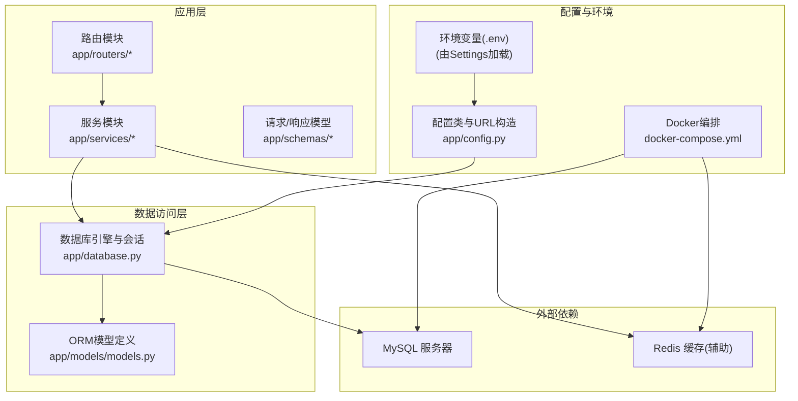
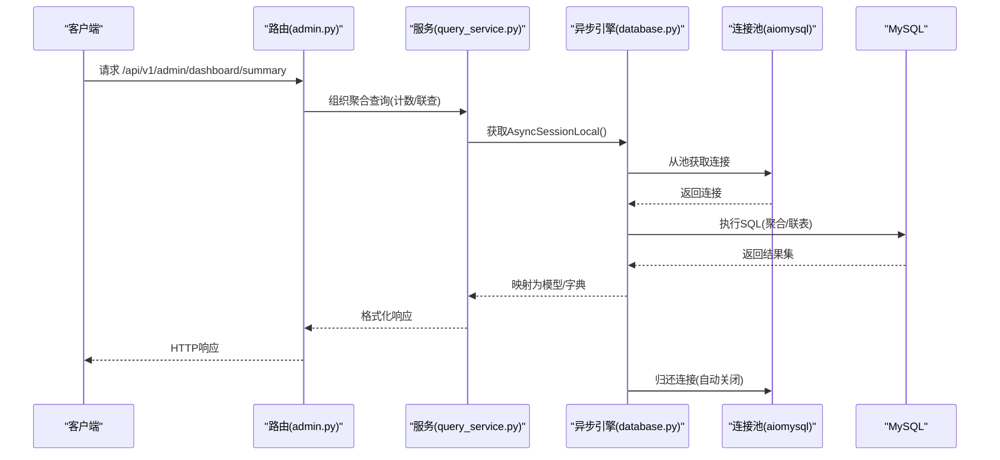
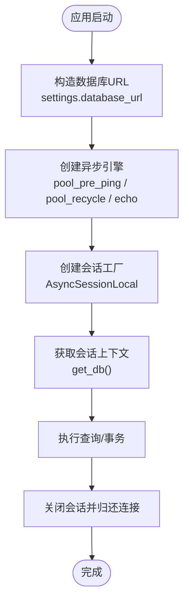
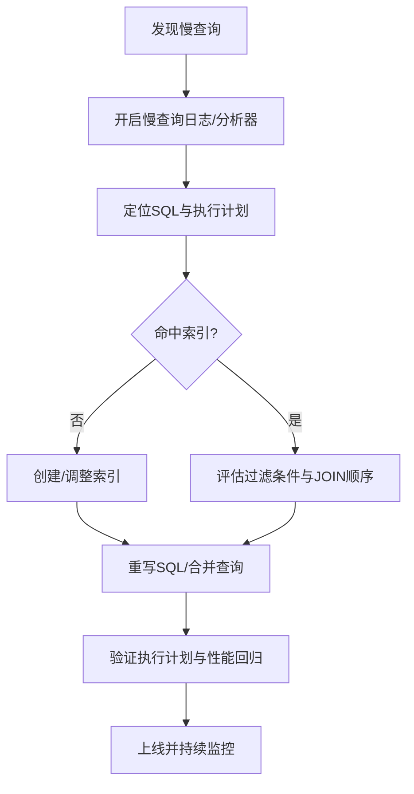
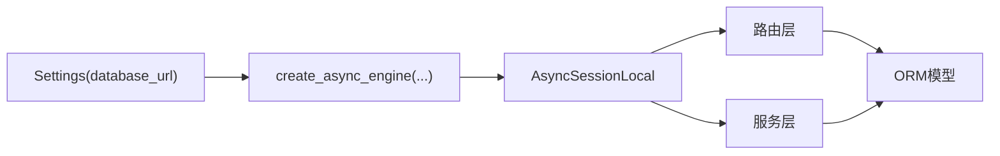

# 数据库优化

<cite>
**本文引用的文件**
- [service/ai_assistant/app/database.py](file://service/ai_assistant/app/database.py)
- [service/ai_assistant/app/config.py](file://service/ai_assistant/app/config.py)
- [service/ai_assistant/app/models/models.py](file://service/ai_assistant/app/models/models.py)
- [service/ai_assistant/app/routers/admin.py](file://service/ai_assistant/app/routers/admin.py)
- [service/ai_assistant/app/services/query_service.py](file://service/ai_assistant/app/services/query_service.py)
- [service/ai_assistant/docker-compose.yml](file://service/ai_assistant/docker-compose.yml)
- [service/ai_assistant/requirements.txt](file://service/ai_assistant/requirements.txt)
</cite>

## 目录
1. [简介](#简介)
2. [项目结构](#项目结构)
3. [核心组件](#核心组件)
4. [架构总览](#架构总览)
5. [详细组件分析](#详细组件分析)
6. [依赖分析](#依赖分析)
7. [性能考量](#性能考量)
8. [故障排查指南](#故障排查指南)
9. [结论](#结论)
10. [附录](#附录)

## 简介
本指南面向“AI校园助手”项目的数据库层，聚焦MySQL查询优化策略、连接池配置与管理、SQL最佳实践、监控与分析方法，以及备份恢复、读写分离与分库分表的实施建议。文档基于现有代码与配置进行分析，结合实际文件路径给出可操作的优化建议。

## 项目结构
后端采用FastAPI + SQLAlchemy 2.x异步引擎，使用aiomysql驱动连接MySQL；数据库连接池通过异步引擎参数控制；模型定义集中在ORM层，查询逻辑分布在服务层与路由层。



图表来源
- [service/ai_assistant/app/database.py:1-35](file://service/ai_assistant/app/database.py#L1-L35)
- [service/ai_assistant/app/config.py:85-91](file://service/ai_assistant/app/config.py#L85-L91)
- [service/ai_assistant/docker-compose.yml:1-31](file://service/ai_assistant/docker-compose.yml#L1-L31)

章节来源
- [service/ai_assistant/app/database.py:1-35](file://service/ai_assistant/app/database.py#L1-L35)
- [service/ai_assistant/app/config.py:19-91](file://service/ai_assistant/app/config.py#L19-L91)
- [service/ai_assistant/docker-compose.yml:1-31](file://service/ai_assistant/docker-compose.yml#L1-L31)

## 核心组件
- 异步引擎与会话工厂：通过异步引擎创建连接池，配置pre_ping与回收时间，提供异步会话上下文管理。
- 配置中心：集中管理数据库URL、主机、端口、用户、密码、数据库名等，统一构造连接串。
- ORM模型：定义实体、唯一约束、复合索引，覆盖管理员、院系、专业、班级、教师、课程、教室、学生、选课、成绩、课表、调课、对话日志等业务表。
- 路由与服务：路由层发起聚合统计与多表联查，服务层组织复杂查询与上下文格式化。

章节来源
- [service/ai_assistant/app/database.py:7-20](file://service/ai_assistant/app/database.py#L7-L20)
- [service/ai_assistant/app/config.py:85-91](file://service/ai_assistant/app/config.py#L85-L91)
- [service/ai_assistant/app/models/models.py:41-660](file://service/ai_assistant/app/models/models.py#L41-L660)
- [service/ai_assistant/app/routers/admin.py:107-144](file://service/ai_assistant/app/routers/admin.py#L107-L144)
- [service/ai_assistant/app/services/query_service.py:1-200](file://service/ai_assistant/app/services/query_service.py#L1-L200)

## 架构总览
下图展示从路由到数据库的典型调用链路，体现异步会话、ORM模型与SQL构建的关系。



图表来源
- [service/ai_assistant/app/routers/admin.py:107-144](file://service/ai_assistant/app/routers/admin.py#L107-L144)
- [service/ai_assistant/app/services/query_service.py:1-200](file://service/ai_assistant/app/services/query_service.py#L1-L200)
- [service/ai_assistant/app/database.py:27-35](file://service/ai_assistant/app/database.py#L27-L35)

## 详细组件分析

### 引擎与连接池配置
- 连接串构造：通过配置类拼接mysql+aiomysql协议、主机、端口、用户、密码、数据库与字符集。
- 连接池参数：
  - pre_ping：启用连接有效性检查，降低连接失效导致的异常。
  - recycle：设定连接生命周期，定期回收旧连接，避免长时间占用。
  - echo：调试开关，开启后打印SQL与执行信息。
- 会话工厂：AsyncSessionLocal提供非过期提交、非自动flush、非自动commit的会话，配合上下文管理器确保会话正确关闭。



图表来源
- [service/ai_assistant/app/config.py:85-91](file://service/ai_assistant/app/config.py#L85-L91)
- [service/ai_assistant/app/database.py:7-20](file://service/ai_assistant/app/database.py#L7-L20)
- [service/ai_assistant/app/database.py:27-35](file://service/ai_assistant/app/database.py#L27-L35)

章节来源
- [service/ai_assistant/app/config.py:85-91](file://service/ai_assistant/app/config.py#L85-L91)
- [service/ai_assistant/app/database.py:7-20](file://service/ai_assistant/app/database.py#L7-L20)
- [service/ai_assistant/app/database.py:27-35](file://service/ai_assistant/app/database.py#L27-L35)

### 索引设计与查询计划
- 唯一约束与复合索引：
  - 管理员：admin_code、username唯一约束；role+status复合索引。
  - 院系/专业/班级：name唯一约束；dept_id复合索引；major+grade+name唯一约束。
  - 教师：dept_id复合索引。
  - 课程：course_name复合索引；credit校验。
  - 教室：location复合索引；capacity校验。
  - 学生：class_id、enroll_year复合索引。
  - 选课：student_id+course_id+term_id唯一约束；course_id+term_id复合索引。
  - 成绩：student_id+course_id+term_id唯一约束；course_id+term_id复合索引；score范围校验。
  - 课表：term_id+course_id复合索引；term_id+teacher_id+time多列索引；term_id+room_id+time多列索引；term_id+status+time多列索引；周次/节次/日校验。
  - 调课：term_id+status+requested_at复合索引；schedule_id+requested_at复合索引；requester_id+requested_at复合索引。
  - 对话日志：did+timestamp复合索引；system_action、student_id复合索引。
- 查询计划分析建议：
  - 使用EXPLAIN/ANALYZE查看执行计划，关注是否命中索引、回表次数、扫描行数。
  - 避免在索引列上使用函数或隐式转换，防止索引失效。
  - 将过滤性强的条件前置，减少中间结果集大小。

```mermaid
erDiagram
ADMIN_USER ||--o{ ADMIN_ACTION_LOG : "产生"
ADMIN_USER ||--o{ SCHEDULE : "更新"
ADMIN_USER ||--o{ SCHEDULE_CLASS_MAP : "创建"
ADMIN_USER ||--o{ SCHEDULE_ADJUSTMENT : "申请/审批"
DEPARTMENT ||--o{ MAJOR : "包含"
MAJOR ||--o{ CLASS : "包含"
CLASS ||--o{ STUDENT : "包含"
CLASS ||--o{ SCHEDULE_CLASS_MAP : "关联"
COURSE ||--o{ ENROLLMENT : "被选"
COURSE ||--o{ SCORE : "评分"
COURSE ||--o{ SCHEDULE : "安排"
TEACHER ||--o{ SCHEDULE : "授课"
DEPARTMENT ||--o{ TEACHER : "所属"
TERM ||--o{ ENROLLMENT : "覆盖"
TERM ||--o{ SCORE : "覆盖"
TERM ||--o{ SCHEDULE : "覆盖"
TERM ||--o{ SCHEDULE_ADJUSTMENT : "覆盖"
CLASSROOM ||--o{ SCHEDULE : "使用"
```

图表来源
- [service/ai_assistant/app/models/models.py:41-660](file://service/ai_assistant/app/models/models.py#L41-L660)

章节来源
- [service/ai_assistant/app/models/models.py:41-660](file://service/ai_assistant/app/models/models.py#L41-L660)

### SQL查询优化最佳实践
- 避免N+1查询：
  - 使用selectinload/join加载关联，一次性抓取所需数据，减少多次往返。
  - 在服务层预先聚合必要字段，避免在循环中逐条查询。
- 合理使用JOIN：
  - 明确ON条件，避免笛卡尔积；优先使用内连接表达业务“必须存在”的关系。
  - 控制JOIN层级，避免过度嵌套导致结果集爆炸。
- 优化WHERE条件：
  - 将高选择性条件放在前面；对常用于过滤的列建立合适索引。
  - 使用范围查询时，尽量限定边界，避免全表扫描。
- 分页与排序：
  - 使用LIMIT/OFFSET时，结合覆盖索引；对大偏移量场景考虑游标分页或基于主键的键集分页。
- 聚合与去重：
  - 使用GROUP BY前明确聚合键；避免SELECT *，仅取必要列。
  - 对重复数据先去重再聚合，减少中间结果集。

章节来源
- [service/ai_assistant/app/routers/admin.py:107-144](file://service/ai_assistant/app/routers/admin.py#L107-L144)
- [service/ai_assistant/app/services/query_service.py:1-200](file://service/ai_assistant/app/services/query_service.py#L1-L200)

### 慢查询优化流程


图表来源
- [service/ai_assistant/app/database.py:9-11](file://service/ai_assistant/app/database.py#L9-L11)
- [service/ai_assistant/app/models/models.py:443-465](file://service/ai_assistant/app/models/models.py#L443-L465)

章节来源
- [service/ai_assistant/app/database.py:9-11](file://service/ai_assistant/app/database.py#L9-L11)
- [service/ai_assistant/app/models/models.py:443-465](file://service/ai_assistant/app/models/models.py#L443-L465)

### 数据库监控与性能分析
- 慢查询日志：
  - 在MySQL端启用slow_query_log，设置long_query_time阈值，记录耗时SQL与锁等待。
  - 结合EXPLAIN/ANALYZE分析执行计划，识别回表、临时表、排序等瓶颈。
- 连接池监控：
  - 关注活跃连接数、等待时间、超时次数；根据QPS与并发峰值动态调整池大小。
  - 利用pre_ping降低连接失效带来的重试开销。
- 指标采集：
  - 采集关键指标：QPS、TPS、连接数、缓存命中率、磁盘IO、网络延迟。
  - 建立告警阈值，异常波动时快速定位热点SQL与阻塞事务。

章节来源
- [service/ai_assistant/app/database.py:9-11](file://service/ai_assistant/app/database.py#L9-L11)
- [service/ai_assistant/docker-compose.yml:13-15](file://service/ai_assistant/docker-compose.yml#L13-L15)

### 备份与恢复的性能考虑
- 全量备份：
  - 使用物理备份工具进行离线备份，减少在线影响；或使用逻辑备份工具指定压缩与并发度。
- 增量备份：
  - 基于binlog的增量备份，缩短RPO；定期做全备+增量组合策略。
- 恢复演练：
  - 定期进行恢复演练，验证备份完整性与恢复速度；针对大表制定分批恢复策略。
- 读写分离与分库分表：
  - 读写分离：主库写入，从库读取；热点表可按业务维度拆分至不同库，降低单库压力。
  - 分库分表：以时间、用户ID或业务域作为分片键；注意跨分片JOIN与全局序列号的设计。

[本节为概念性指导，不直接分析具体文件]

### 实际查询示例与优化要点
- 管理员仪表盘统计：
  - 使用COUNT聚合与WHERE过滤，结合索引覆盖，避免全表扫描。
  - 参考路径：[service/ai_assistant/app/routers/admin.py:107-144](file://service/ai_assistant/app/routers/admin.py#L107-L144)
- 多表联查与排序：
  - JOIN链路较长时，先过滤再联结，减少中间结果集；对排序字段建立合适索引。
  - 参考路径：[service/ai_assistant/app/routers/admin.py:178-196](file://service/ai_assistant/app/routers/admin.py#L178-L196)
- 结构化查询与上下文格式化：
  - 在服务层组织查询，避免在路由层做复杂拼接；统一字段翻译与格式化。
  - 参考路径：[service/ai_assistant/app/services/query_service.py:1-200](file://service/ai_assistant/app/services/query_service.py#L1-L200)

章节来源
- [service/ai_assistant/app/routers/admin.py:107-144](file://service/ai_assistant/app/routers/admin.py#L107-L144)
- [service/ai_assistant/app/routers/admin.py:178-196](file://service/ai_assistant/app/routers/admin.py#L178-L196)
- [service/ai_assistant/app/services/query_service.py:1-200](file://service/ai_assistant/app/services/query_service.py#L1-L200)

## 依赖分析
- 引擎与驱动：SQLAlchemy 2.x异步引擎 + aiomysql驱动。
- 连接池：aiomysql内置连接池，受SQLAlchemy引擎参数控制。
- 配置来源：pydantic-settings从.env加载环境变量，统一构造数据库URL。



图表来源
- [service/ai_assistant/app/config.py:85-91](file://service/ai_assistant/app/config.py#L85-L91)
- [service/ai_assistant/app/database.py:7-20](file://service/ai_assistant/app/database.py#L7-L20)

章节来源
- [service/ai_assistant/app/config.py:85-91](file://service/ai_assistant/app/config.py#L85-L91)
- [service/ai_assistant/app/database.py:7-20](file://service/ai_assistant/app/database.py#L7-L20)
- [service/ai_assistant/requirements.txt:1-22](file://service/ai_assistant/requirements.txt#L1-L22)

## 性能考量
- 连接池参数建议：
  - 初始连接数(minsize)：根据最小并发请求估算。
  - 最大连接数(maxsize)：根据峰值并发与数据库最大连接限制设定。
  - 超时设置：连接获取超时、执行超时、回收时间(recycle)应与业务SLA匹配。
  - 预检连接(pre_ping)：建议开启，提升连接稳定性。
- 查询层面：
  - 优先使用覆盖索引；避免SELECT *；合理分页与排序。
  - 减少不必要的JOIN层级；对高频查询建立复合索引。
- 缓存与降载：
  - 对静态或低频变更数据引入Redis缓存，降低数据库压力。
  - 参考路径：[service/ai_assistant/docker-compose.yml:13-15](file://service/ai_assistant/docker-compose.yml#L13-L15)

章节来源
- [service/ai_assistant/app/database.py:9-11](file://service/ai_assistant/app/database.py#L9-L11)
- [service/ai_assistant/docker-compose.yml:13-15](file://service/ai_assistant/docker-compose.yml#L13-L15)

## 故障排查指南
- 连接失败/超时：
  - 检查数据库URL、凭据、网络连通性；确认连接池大小与回收时间。
  - 参考路径：[service/ai_assistant/app/config.py:85-91](file://service/ai_assistant/app/config.py#L85-L91)，[service/ai_assistant/app/database.py:7-20](file://service/ai_assistant/app/database.py#L7-L20)
- 查询缓慢：
  - 使用EXPLAIN/ANALYZE定位瓶颈；检查索引使用情况与过滤条件。
  - 参考路径：[service/ai_assistant/app/models/models.py:443-465](file://service/ai_assistant/app/models/models.py#L443-L465)
- 会话泄漏：
  - 确认get_db上下文管理器是否正确关闭；避免长事务持有连接。
  - 参考路径：[service/ai_assistant/app/database.py:27-35](file://service/ai_assistant/app/database.py#L27-L35)

章节来源
- [service/ai_assistant/app/config.py:85-91](file://service/ai_assistant/app/config.py#L85-L91)
- [service/ai_assistant/app/database.py:7-20](file://service/ai_assistant/app/database.py#L7-L20)
- [service/ai_assistant/app/database.py:27-35](file://service/ai_assistant/app/database.py#L27-L35)
- [service/ai_assistant/app/models/models.py:443-465](file://service/ai_assistant/app/models/models.py#L443-L465)

## 结论
通过对连接池参数、索引设计、查询计划与慢查询分析的系统性优化，可显著提升数据库吞吐与稳定性。结合缓存与监控体系，形成从查询优化到运维保障的闭环。对于未来扩展，建议在高并发场景下引入读写分离与分库分表策略，并配套完善的备份恢复与容量规划。

## 附录
- 关键实现路径参考：
  - 数据库引擎与会话：[service/ai_assistant/app/database.py:7-20](file://service/ai_assistant/app/database.py#L7-L20)，[service/ai_assistant/app/database.py:27-35](file://service/ai_assistant/app/database.py#L27-L35)
  - 配置与URL构造：[service/ai_assistant/app/config.py:85-91](file://service/ai_assistant/app/config.py#L85-L91)
  - ORM模型与索引：[service/ai_assistant/app/models/models.py:41-660](file://service/ai_assistant/app/models/models.py#L41-L660)
  - 路由查询示例：[service/ai_assistant/app/routers/admin.py:107-144](file://service/ai_assistant/app/routers/admin.py#L107-L144)，[service/ai_assistant/app/routers/admin.py:178-196](file://service/ai_assistant/app/routers/admin.py#L178-L196)
  - 服务层查询组织：[service/ai_assistant/app/services/query_service.py:1-200](file://service/ai_assistant/app/services/query_service.py#L1-L200)
  - 缓存服务容器：[service/ai_assistant/docker-compose.yml:13-15](file://service/ai_assistant/docker-compose.yml#L13-L15)
  - 依赖版本：[service/ai_assistant/requirements.txt:1-22](file://service/ai_assistant/requirements.txt#L1-L22)