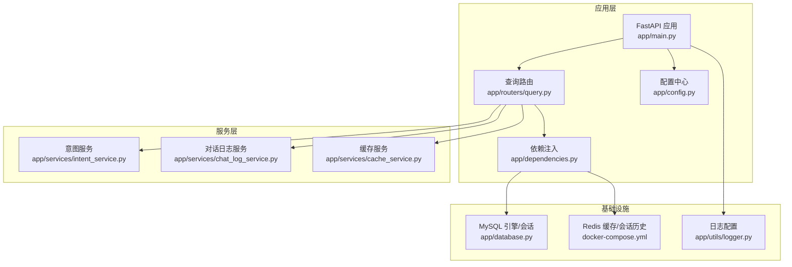
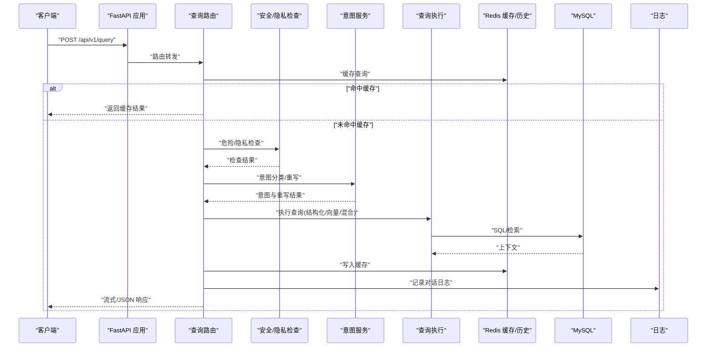
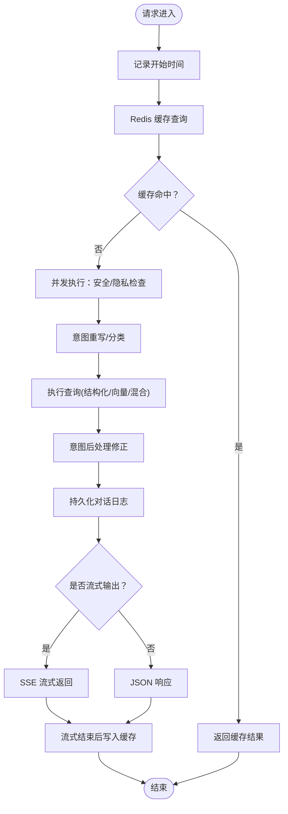
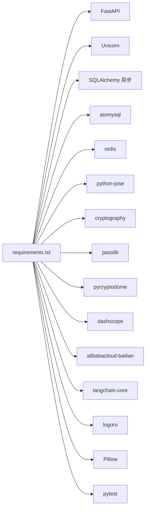

# 系统监控

<cite>
**本文档引用的文件**
- [service/ai_assistant/app/main.py](file://service/ai_assistant/app/main.py)
- [service/ai_assistant/app/utils/logger.py](file://service/ai_assistant/app/utils/logger.py)
- [service/ai_assistant/app/config.py](file://service/ai_assistant/app/config.py)
- [service/ai_assistant/docker-compose.yml](file://service/ai_assistant/docker-compose.yml)
- [service/ai_assistant/Dockerfile](file://service/ai_assistant/Dockerfile)
- [service/ai_assistant/app/routers/query.py](file://service/ai_assistant/app/routers/query.py)
- [service/ai_assistant/app/services/chat_log_service.py](file://service/ai_assistant/app/services/chat_log_service.py)
- [service/ai_assistant/app/dependencies.py](file://service/ai_assistant/app/dependencies.py)
- [service/ai_assistant/requirements.txt](file://service/ai_assistant/requirements.txt)
- [service/ai_assistant/app/services/cache_service.py](file://service/ai_assistant/app/services/cache_service.py)
- [service/ai_assistant/app/services/intent_service.py](file://service/ai_assistant/app/services/intent_service.py)
- [service/ai_assistant/app/models/models.py](file://service/ai_assistant/app/models/models.py)
- [service/ai_assistant/app/database.py](file://service/ai_assistant/app/database.py)
</cite>

## 目录
1. [引言](#引言)
2. [项目结构](#项目结构)
3. [核心组件](#核心组件)
4. [架构总览](#架构总览)
5. [详细组件分析](#详细组件分析)
6. [依赖分析](#依赖分析)
7. [性能考量](#性能考量)
8. [故障排查指南](#故障排查指南)
9. [结论](#结论)
10. [附录](#附录)

## 引言
本指南面向AI校园助手系统的运维与开发团队，提供一套可落地的性能监控与观测性实践方案。内容涵盖监控指标设计（业务、技术、用户体验）、日志体系配置与管理、APM与指标采集工具选择、健康检查与故障检测机制、性能基准测试方法，以及监控数据分析与性能调优的实操建议。文档以仓库现有代码为依据，结合系统实际运行路径，帮助读者快速建立可观测的生产环境。

## 项目结构
后端采用FastAPI + Uvicorn，容器化部署，使用MySQL作为主数据库、Redis作为缓存与会话历史存储，日志统一由Loguru输出至控制台与文件。查询路由贯穿多服务链路，包含安全检查、意图分类、查询执行、缓存与会话历史、流式回答等环节。

图表来源
- [service/ai_assistant/app/main.py:52-86](file://service/ai_assistant/app/main.py#L52-L86)
- [service/ai_assistant/app/routers/query.py:198-745](file://service/ai_assistant/app/routers/query.py#L198-L745)
- [service/ai_assistant/app/dependencies.py:27-51](file://service/ai_assistant/app/dependencies.py#L27-L51)
- [service/ai_assistant/app/config.py:6-113](file://service/ai_assistant/app/config.py#L6-L113)
- [service/ai_assistant/app/database.py:7-21](file://service/ai_assistant/app/database.py#L7-L21)
- [service/ai_assistant/docker-compose.yml:1-31](file://service/ai_assistant/docker-compose.yml#L1-L31)
- [service/ai_assistant/app/utils/logger.py:17-47](file://service/ai_assistant/app/utils/logger.py#L17-L47)

章节来源
- [service/ai_assistant/app/main.py:1-86](file://service/ai_assistant/app/main.py#L1-L86)
- [service/ai_assistant/app/config.py:1-113](file://service/ai_assistant/app/config.py#L1-L113)
- [service/ai_assistant/docker-compose.yml:1-31](file://service/ai_assistant/docker-compose.yml#L1-L31)
- [service/ai_assistant/Dockerfile:1-49](file://service/ai_assistant/Dockerfile#L1-L49)

## 核心组件
- 应用入口与生命周期：负责应用初始化、CORS中间件注册、路由挂载、启动/关闭日志与资源清理。
- 日志系统：统一使用Loguru，控制台INFO级别与文件DEBUG级别，带滚动与保留策略。
- 配置中心：集中管理应用、数据库、Redis、LLM模型、缓存TTL等配置项。
- 查询路由：核心业务链路，包含多模态输入处理、安全检查、并发任务、意图分类、查询执行、缓存与会话历史、流式回答。
- 服务层：意图服务（LangChain集成）、对话日志服务（隐私脱敏）、缓存服务（Redis键空间与TTL策略）。
- 基础设施：MySQL异步引擎与会话池、Redis容器健康检查、日志目录与文件落盘。

章节来源
- [service/ai_assistant/app/main.py:36-86](file://service/ai_assistant/app/main.py#L36-L86)
- [service/ai_assistant/app/utils/logger.py:17-53](file://service/ai_assistant/app/utils/logger.py#L17-L53)
- [service/ai_assistant/app/config.py:6-113](file://service/ai_assistant/app/config.py#L6-L113)
- [service/ai_assistant/app/routers/query.py:198-745](file://service/ai_assistant/app/routers/query.py#L198-L745)
- [service/ai_assistant/app/services/intent_service.py:218-346](file://service/ai_assistant/app/services/intent_service.py#L218-L346)
- [service/ai_assistant/app/services/chat_log_service.py:14-76](file://service/ai_assistant/app/services/chat_log_service.py#L14-L76)
- [service/ai_assistant/app/services/cache_service.py:92-177](file://service/ai_assistant/app/services/cache_service.py#L92-L177)
- [service/ai_assistant/app/database.py:7-21](file://service/ai_assistant/app/database.py#L7-L21)
- [service/ai_assistant/docker-compose.yml:18-22](file://service/ai_assistant/docker-compose.yml#L18-L22)

## 架构总览
系统采用前后端分离，后端通过Uvicorn运行FastAPI，查询路由串联安全、意图、检索/结构化查询、缓存与日志等模块。Redis承担缓存与会话历史，MySQL承载结构化数据与对话日志。日志统一输出至标准输出与文件，便于容器化日志采集。

图表来源
- [service/ai_assistant/app/routers/query.py:207-745](file://service/ai_assistant/app/routers/query.py#L207-L745)
- [service/ai_assistant/app/services/cache_service.py:92-177](file://service/ai_assistant/app/services/cache_service.py#L92-L177)
- [service/ai_assistant/app/services/intent_service.py:218-346](file://service/ai_assistant/app/services/intent_service.py#L218-L346)
- [service/ai_assistant/app/services/chat_log_service.py:14-76](file://service/ai_assistant/app/services/chat_log_service.py#L14-L76)
- [service/ai_assistant/app/dependencies.py:36-51](file://service/ai_assistant/app/dependencies.py#L36-L51)

## 详细组件分析

### 日志系统与配置
- 初始化策略：幂等初始化，移除默认sink后添加控制台与文件sink，文件位于项目根logs目录，按大小滚动与保留。
- 输出格式：包含时间、级别、模块名、函数名、行号与消息体。
- 默认级别：控制台INFO，文件DEBUG，便于生产与开发环境差异化的可观测性。
- 全局生效：模块导入即初始化，确保各模块日志落盘。

章节来源
- [service/ai_assistant/app/utils/logger.py:17-53](file://service/ai_assistant/app/utils/logger.py#L17-L53)

### 查询路由与性能关键路径
- 请求计时：进入路由后记录毫秒级开始时间，贯穿整个处理链路，用于统计端到端响应时间。
- 缓存优先：先查Redis缓存，命中则直接返回，显著降低延迟与外部依赖压力。
- 并发优化：安全检查与查询重写并行执行，缩短关键路径。
- 流式输出：SSE流式返回，边生成边输出，改善首字节时间与用户体验。
- 会话历史：Redis隔离会话历史，避免并发污染；异常时回退至数据库。
- 错误处理：对媒体处理、查询执行、流式生成等异常进行捕获与标准化错误输出。
- 缓存写入：流式结束后再写入缓存与日志，避免长连接占用。

图表来源
- [service/ai_assistant/app/routers/query.py:213-745](file://service/ai_assistant/app/routers/query.py#L213-L745)

章节来源
- [service/ai_assistant/app/routers/query.py:198-745](file://service/ai_assistant/app/routers/query.py#L198-L745)

### 缓存服务与TTL策略
- 键命名：统一前缀与版本号，支持跨版本失效与隔离。
- TTL策略：敏感查询30分钟，普通查询1天；日期敏感查询按自然日失效；课表相关查询通过版本号失效。
- 元数据：缓存payload携带元数据，包含日期桶与课表版本，保障时效性。
- 写入与读取：原子写入与解析校验，异常时删除键避免脏数据。

章节来源
- [service/ai_assistant/app/services/cache_service.py:49-177](file://service/ai_assistant/app/services/cache_service.py#L49-L177)

### 意图服务与LangChain集成
- 意图分类：基于模板与LLM进行分类，失败时回退为向量检索。
- 查询重写：结合历史上下文补齐缺失信息，超长截断并记录告警。
- 回答生成：构建提示词模板，裁剪历史与上下文长度，避免超限。
- 流式生成：支持流式输出，逐步产出token。

章节来源
- [service/ai_assistant/app/services/intent_service.py:218-346](file://service/ai_assistant/app/services/intent_service.py#L218-L346)

### 对话日志服务与隐私策略
- 隐私脱敏：普通消息仅存储DID，危险消息保留原始学号。
- 结构化字段：包含发送方、消息内容、系统动作、响应时间等。
- 历史加载：按DID与时间倒序加载，支持会话上下文构建。

章节来源
- [service/ai_assistant/app/services/chat_log_service.py:14-76](file://service/ai_assistant/app/services/chat_log_service.py#L14-L76)

### 数据库与会话池
- 异步引擎：启用pre_ping与回收策略，配合autoflush/expire策略。
- 会话管理：异步上下文管理，确保连接正确释放。

章节来源
- [service/ai_assistant/app/database.py:7-21](file://service/ai_assistant/app/database.py#L7-L21)

### 依赖注入与Redis连接
- 单例Redis客户端：全局连接池，避免重复创建。
- 依赖注入：路由层通过依赖获取Redis与数据库会话。

章节来源
- [service/ai_assistant/app/dependencies.py:36-51](file://service/ai_assistant/app/dependencies.py#L36-L51)

## 依赖分析
- 应用层依赖：FastAPI、Uvicorn、Pydantic Settings、Loguru。
- 数据访问：SQLAlchemy异步、aiomysql。
- 缓存：redis。
- LLM与检索：dashscope、alibabacloud-bailian、langchain-core。
- 安全与加解密：python-jose、cryptography、passlib、pycryptodome。
- 多媒体：Pillow。
- 测试：pytest、pytest-asyncio、pytest-mock。

图表来源
- [service/ai_assistant/requirements.txt:1-22](file://service/ai_assistant/requirements.txt#L1-L22)

章节来源
- [service/ai_assistant/requirements.txt:1-22](file://service/ai_assistant/requirements.txt#L1-L22)

## 性能考量
- 端到端响应时间：路由内记录毫秒级起止时间，作为核心业务指标。
- 缓存命中率：统计缓存命中/未命中次数与命中率，评估缓存策略有效性。
- 并发与资源：并发执行安全检查与查询重写，减少关键路径等待；流式输出降低首字节时间。
- 数据库与Redis：连接池预热与回收策略，避免连接泄漏；Redis内存限制与淘汰策略保障稳定性。
- LLM调用：合理设置温度与最大token，避免超时与超限；对长上下文进行裁剪与截断。
- 日志开销：生产环境建议控制台INFO级别，文件DEBUG级别，避免过度IO。

## 故障排查指南
- 启动与安全告警：应用启动时检查不安全默认配置并发出警告，部署前务必替换。
- Redis健康：容器内置健康检查，定期ping验证可用性；异常时自动重启。
- 查询异常：媒体处理失败、查询执行失败、流式生成异常均有捕获与标准化错误输出。
- 缓存异常：Redis不可用时降级，不影响主流程；缓存解析失败自动删除键。
- 数据库连接：pre_ping与回收策略减少连接失效；会话池满时观察连接数与慢查询。
- 日志定位：统一格式包含模块/函数/行号，结合时间戳快速定位问题。

章节来源
- [service/ai_assistant/app/main.py:25-49](file://service/ai_assistant/app/main.py#L25-L49)
- [service/ai_assistant/docker-compose.yml:18-22](file://service/ai_assistant/docker-compose.yml#L18-L22)
- [service/ai_assistant/app/routers/query.py:234-260](file://service/ai_assistant/app/routers/query.py#L234-L260)
- [service/ai_assistant/app/services/cache_service.py:92-147](file://service/ai_assistant/app/services/cache_service.py#L92-L147)
- [service/ai_assistant/app/database.py:7-21](file://service/ai_assistant/app/database.py#L7-L21)
- [service/ai_assistant/app/utils/logger.py:28-43](file://service/ai_assistant/app/utils/logger.py#L28-L43)

## 结论
本系统在日志、缓存、数据库与LLM集成方面具备良好的可观测性基础。建议在此基础上引入APM与指标采集，完善业务指标（如响应时间、吞吐量、意图分布）、技术指标（CPU/内存/连接池利用率、Redis命中率、数据库慢查询）与用户体验指标（首字节时间、错误率、会话时长），并建立自动化告警与容量规划流程，持续优化系统性能与稳定性。

## 附录

### 监控指标设计建议
- 业务指标
  - QPS/吞吐量：每路由维度统计
  - 响应时间（P50/P90/P99）：端到端与各子步骤
  - 意图分布：structured/vector/hybrid/smalltalk占比
  - 会话时长与消息数：评估用户粘性
  - 缓存命中率与命中耗时：评估缓存策略
- 技术指标
  - CPU/内存/GC：容器与进程级
  - 连接池利用率：数据库与Redis
  - Redis内存与键数量：键空间与TTL分布
  - LLM调用耗时与错误率：不同模型与提示词
  - 磁盘IO与日志写入速率：I/O瓶颈识别
- 用户体验指标
  - 首字节时间（TTFB）：流式SSE首包
  - 错误率与错误类型分布：安全拦截、隐私阻断、系统异常
  - 会话成功率：完整回答比例

### 日志系统配置与管理
- 日志级别
  - 生产：控制台INFO，文件DEBUG
  - 开发：控制台DEBUG，文件DEBUG
- 日志聚合
  - 容器标准输出采集，结合时间戳与容器标签
  - 文件日志按大小滚动与保留策略
- 日志分析
  - 关键字段：时间、级别、模块、函数、行号、消息
  - 常用查询：错误关键字、慢查询阈值、意图分布、缓存命中率

章节来源
- [service/ai_assistant/app/utils/logger.py:28-43](file://service/ai_assistant/app/utils/logger.py#L28-L43)

### APM工具与配置建议
- APM工具
  - 应用性能：OpenTelemetry（OTel）+ Jaeger/Tempo + Grafana
  - 指标采集：Prometheus + Grafana
  - 日志聚合：Loki + Promtail
- 配置要点
  - SDK接入：FastAPI中间件埋点，自动采集路由、DB、Redis、LLM调用
  - 指标导出：Gauge/Histogram/Counter，区分业务与技术指标
  - 告警策略：基于阈值与趋势，结合SLA

### 健康检查与故障检测
- 服务可用性
  - HTTP健康端点：/health（返回200/500）
  - 依赖自检：数据库连通性、Redis ping、LLM服务可达性
- 异常检测
  - 异常率突增、响应时间异常、缓存命中率骤降
  - 安全拦截与隐私阻断事件统计
- 自动化恢复
  - Redis/数据库连接池重建、LLM服务重试与熔断

章节来源
- [service/ai_assistant/docker-compose.yml:18-22](file://service/ai_assistant/docker-compose.yml#L18-L22)
- [service/ai_assistant/app/routers/query.py:415-471](file://service/ai_assistant/app/routers/query.py#L415-L471)

### 性能基准测试方法
- 压力测试
  - 场景：并发用户数逐步增加，观察QPS、P95/P99、错误率
  - 工具：wrk、JMeter、Locust
- 负载测试
  - 场景：固定并发下的长时间运行，观察内存泄漏与连接池状态
- 容量规划
  - 基于P99响应时间与资源利用率，确定扩容阈值
  - 缓存命中率与LLM调用成本评估

### 监控数据分析与性能调优
- 数据分析
  - 分维度（路由、意图、模型、时间）对比分析
  - 异常根因定位：日志+追踪+指标联动
- 调优建议
  - 缓存策略：调整TTL与版本号，优化键空间
  - 数据库：索引优化、慢查询分析、连接池参数
  - LLM：提示词优化、上下文裁剪、批量化与并发度
  - 流式输出：背压控制与缓冲区大小