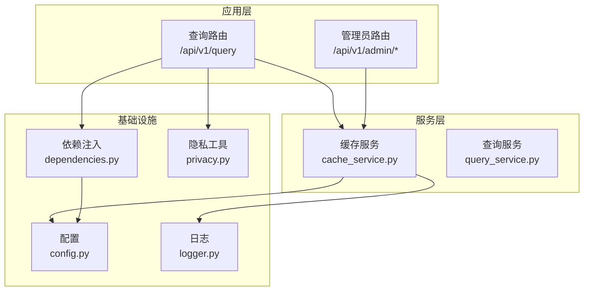
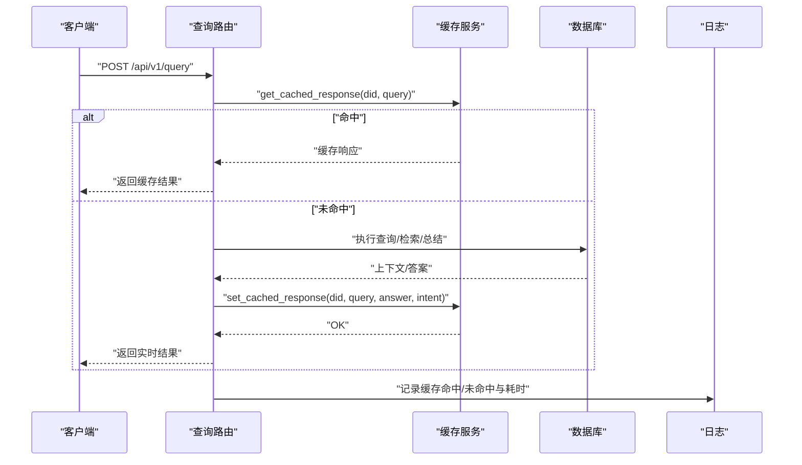
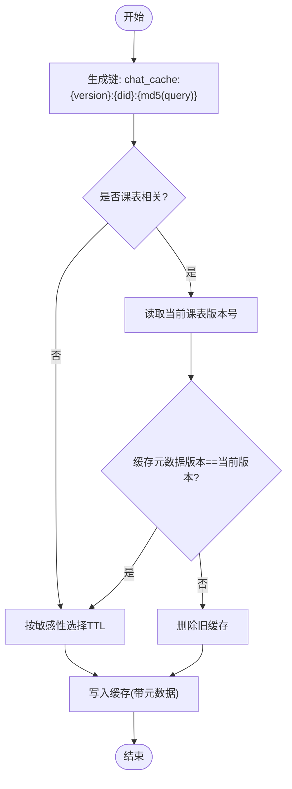
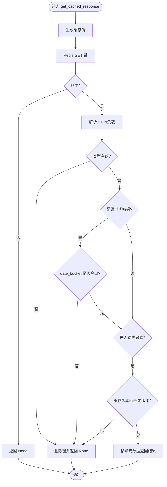
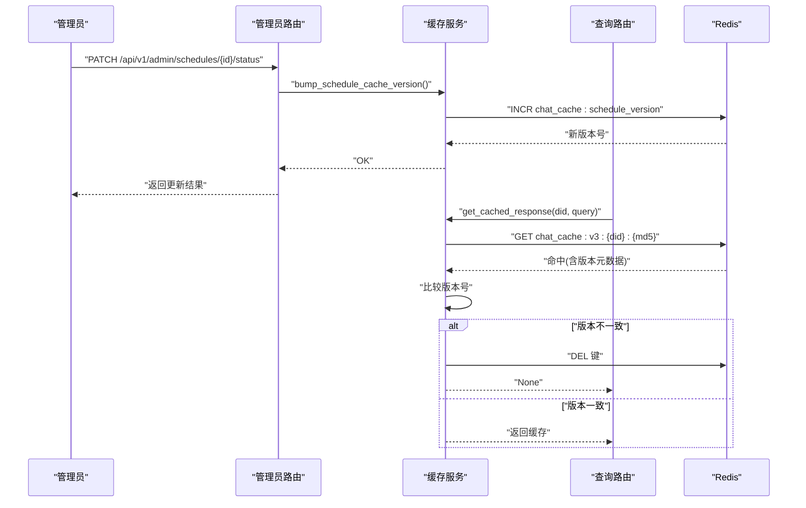
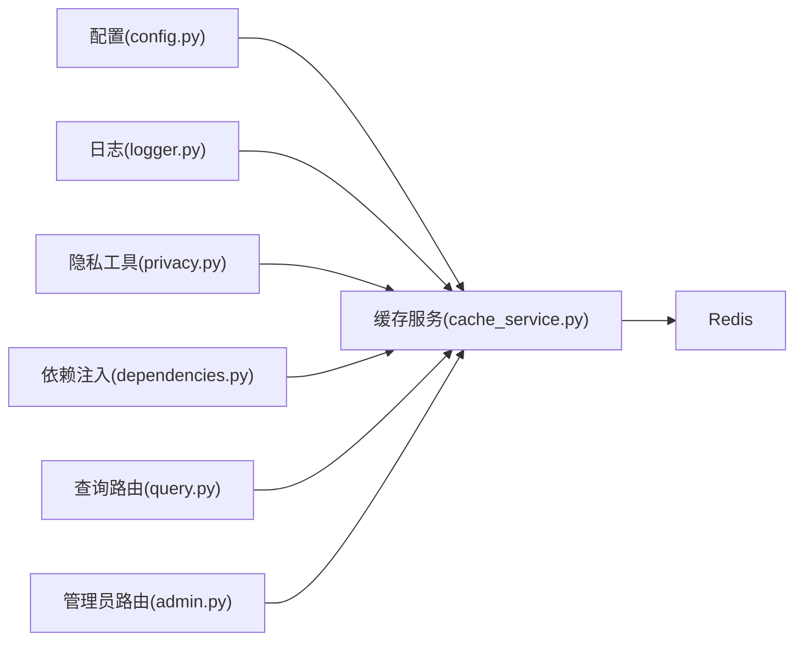

# 缓存策略优化

<cite>
**本文引用的文件**
- [cache_service.py](file://service/ai_assistant/app/services/cache_service.py)
- [config.py](file://service/ai_assistant/app/config.py)
- [query.py](file://service/ai_assistant/app/routers/query.py)
- [admin.py](file://service/ai_assistant/app/routers/admin.py)
- [dependencies.py](file://service/ai_assistant/app/dependencies.py)
- [privacy.py](file://service/ai_assistant/app/utils/privacy.py)
- [logger.py](file://service/ai_assistant/app/utils/logger.py)
</cite>

## 目录
1. [引言](#引言)
2. [项目结构](#项目结构)
3. [核心组件](#核心组件)
4. [架构总览](#架构总览)
5. [详细组件分析](#详细组件分析)
6. [依赖分析](#依赖分析)
7. [性能考虑](#性能考虑)
8. [故障排查指南](#故障排查指南)
9. [结论](#结论)
10. [附录](#附录)

## 引言
本指南围绕“AI校园助手”的Redis缓存系统，提供一套完整的优化策略与实践方法。重点覆盖缓存键命名规范、TTL策略设计、缓存穿透防护、敏感与时间敏感查询的差异化缓存策略、课表相关查询的版本化失效机制、缓存性能监控与调优、故障处理与降级策略，以及缓存与数据库一致性保障。

## 项目结构
缓存系统主要分布在以下模块：
- 缓存服务层：负责键生成、TTL策略、敏感性判断、缓存读写与失效控制
- 配置层：集中管理Redis与缓存TTL参数
- 路由层：查询路由在请求链路中集成缓存读写；管理员路由在课表变更后主动失效缓存
- 依赖注入层：提供Redis客户端单例与生命周期管理
- 隐私工具：基于DID隔离真实学号，避免跨用户缓存污染
- 日志：记录缓存命中/失效与版本变更等关键事件

图表来源
- [query.py](file://service/ai_assistant/app/routers/query.py)
- [admin.py](file://service/ai_assistant/app/routers/admin.py)
- [cache_service.py](file://service/ai_assistant/app/services/cache_service.py)
- [config.py](file://service/ai_assistant/app/config.py)
- [dependencies.py](file://service/ai_assistant/app/dependencies.py)
- [privacy.py](file://service/ai_assistant/app/utils/privacy.py)
- [logger.py](file://service/ai_assistant/app/utils/logger.py)

章节来源
- [query.py](file://service/ai_assistant/app/routers/query.py)
- [admin.py](file://service/ai_assistant/app/routers/admin.py)
- [cache_service.py](file://service/ai_assistant/app/services/cache_service.py)
- [config.py](file://service/ai_assistant/app/config.py)
- [dependencies.py](file://service/ai_assistant/app/dependencies.py)
- [privacy.py](file://service/ai_assistant/app/utils/privacy.py)
- [logger.py](file://service/ai_assistant/app/utils/logger.py)

## 核心组件
- 缓存键命名规范
  - 形如：chat_cache:{版本}:{DID}:{查询MD5}
  - 版本：v3，用于在查询/总结逻辑升级时隔离旧缓存
  - DID：基于学生真实学号与盐值生成的稳定哈希，避免泄露真实ID
  - 查询MD5：对标准化后的查询文本取MD5，保证同义问题命中同一缓存
- TTL策略
  - 敏感/隐私查询：30分钟
  - 普通查询：1天
- 敏感性与时间敏感性检测
  - 敏感关键词：成绩、分数、挂科、作弊、学籍、处分、奖学金、家庭、联系方式等
  - 时间敏感：包含“今天/明天/本周/本学期”等相对日期语义
  - 课表敏感：包含“课表/课程表/课程安排/schedule/class schedule”等
- 版本化失效
  - 课表缓存版本键：chat_cache:schedule_version
  - 管理员修改课表后递增版本号，触发相关查询缓存失效
- 缓存元数据
  - 写入时记录：date_sensitive、date_bucket、schedule_sensitive、schedule_cache_version
  - 读取时按元数据校验：跨天失效、版本号不一致失效

章节来源
- [cache_service.py](file://service/ai_assistant/app/services/cache_service.py)
- [config.py](file://service/ai_assistant/app/config.py)
- [privacy.py](file://service/ai_assistant/app/utils/privacy.py)

## 架构总览
缓存系统在查询链路中的位置如下：

图表来源
- [query.py](file://service/ai_assistant/app/routers/query.py)
- [cache_service.py](file://service/ai_assistant/app/services/cache_service.py)
- [logger.py](file://service/ai_assistant/app/utils/logger.py)

## 详细组件分析

### 缓存键命名与版本管理
- 键组成
  - 版本：v3，用于强制隔离升级后的缓存
  - DID：防止跨用户缓存污染
  - 查询MD5：标准化查询文本后取MD5，保证语义相同的问题共享缓存
- 版本号管理
  - 课表版本键：chat_cache:schedule_version
  - 管理员修改课表状态后递增版本号，查询时对比元数据中的版本号，不一致则失效

图表来源
- [cache_service.py](file://service/ai_assistant/app/services/cache_service.py)

章节来源
- [cache_service.py](file://service/ai_assistant/app/services/cache_service.py)

### TTL策略与敏感性控制
- 敏感查询（隐私/敏感关键词）：30分钟
- 普通查询：1天
- 写入缓存时根据查询文本自动判断敏感性，或显式传入
- 读取缓存时若检测到时间敏感查询，按“日期桶”跨天失效，避免语义过期

图表来源
- [cache_service.py](file://service/ai_assistant/app/services/cache_service.py)

章节来源
- [cache_service.py](file://service/ai_assistant/app/services/cache_service.py)
- [config.py](file://service/ai_assistant/app/config.py)

### 课表相关查询的版本化失效
- 管理员在更新课表状态后，调用递增课表缓存版本号
- 查询路由在执行总结前，若检测到课表敏感查询，使用空历史进行总结，避免历史干扰
- 读取缓存时对比元数据中的版本号，不一致则失效

图表来源
- [admin.py](file://service/ai_assistant/app/routers/admin.py)
- [cache_service.py](file://service/ai_assistant/app/services/cache_service.py)

章节来源
- [admin.py](file://service/ai_assistant/app/routers/admin.py)
- [cache_service.py](file://service/ai_assistant/app/services/cache_service.py)

### 缓存与数据库一致性保障
- 写入缓存发生在LLM总结完成后，确保缓存内容与最终答案一致
- 流式输出场景在生成结束后再写入缓存，避免中间态污染
- 清理会话缓存接口支持按DID批量清理缓存与会话历史，便于维护与调试

章节来源
- [query.py](file://service/ai_assistant/app/routers/query.py)
- [cache_service.py](file://service/ai_assistant/app/services/cache_service.py)

## 依赖分析
- 缓存服务依赖
  - 配置：TTL参数、Redis连接URL
  - 日志：记录缓存命中/失效与版本变更
  - 隐私：DID生成，隔离真实学号
  - 依赖注入：Redis客户端单例，生命周期管理
- 路由层依赖
  - 查询路由：在请求链路中集成缓存读写
  - 管理员路由：在课表状态变更后主动失效缓存

图表来源
- [config.py](file://service/ai_assistant/app/config.py)
- [cache_service.py](file://service/ai_assistant/app/services/cache_service.py)
- [logger.py](file://service/ai_assistant/app/utils/logger.py)
- [privacy.py](file://service/ai_assistant/app/utils/privacy.py)
- [dependencies.py](file://service/ai_assistant/app/dependencies.py)
- [query.py](file://service/ai_assistant/app/routers/query.py)
- [admin.py](file://service/ai_assistant/app/routers/admin.py)

章节来源
- [config.py](file://service/ai_assistant/app/config.py)
- [cache_service.py](file://service/ai_assistant/app/services/cache_service.py)
- [dependencies.py](file://service/ai_assistant/app/dependencies.py)
- [query.py](file://service/ai_assistant/app/routers/query.py)
- [admin.py](file://service/ai_assistant/app/routers/admin.py)

## 性能考虑
- 命中率优化
  - 使用标准化查询文本与MD5，提高同义问题命中率
  - 为时间敏感查询引入“日期桶”，避免跨天语义过期导致的误失效
  - 为课表敏感查询引入版本号，避免管理员改课后旧缓存误导
- 内存使用优化
  - 缓存仅存储最终答案与意图，不存储冗余上下文
  - 元数据最小化：仅记录date_sensitive/date_bucket/schedule_sensitive/schedule_cache_version
- 缓存预热策略
  - 针对高频查询（如“今日课表”、“本周考试”）可在业务低峰期预热热点键
  - 预热时可使用较低TTL，快速验证正确性后再调整为常规TTL
- 流式输出与连接池
  - 在流式生成前回滚数据库会话，释放连接，避免长时间占用
  - 使用独立短生命周期会话写入最终日志，避免复用长连接

章节来源
- [cache_service.py](file://service/ai_assistant/app/services/cache_service.py)
- [query.py](file://service/ai_assistant/app/routers/query.py)

## 故障排查指南
- 缓存未命中
  - 检查查询是否命中敏感性规则，确认TTL是否过短
  - 确认是否为时间敏感查询，检查date_bucket是否跨天
  - 检查是否为课表敏感查询，确认版本号是否一致
- 缓存负载异常
  - 检查缓存负载JSON解析失败的日志，确认键是否被意外修改
  - 检查缓存类型非字典的情况，确认写入路径是否正确
- Redis连接异常
  - 检查依赖注入中的Redis单例是否创建成功
  - 查看生命周期钩子是否正常关闭连接池
- 管理员改课后缓存未失效
  - 确认管理员路由是否调用了递增课表版本号
  - 检查版本号键是否存在且可读写

章节来源
- [cache_service.py](file://service/ai_assistant/app/services/cache_service.py)
- [dependencies.py](file://service/ai_assistant/app/dependencies.py)
- [admin.py](file://service/ai_assistant/app/routers/admin.py)
- [logger.py](file://service/ai_assistant/app/utils/logger.py)

## 结论
本缓存系统通过“键命名规范 + TTL策略 + 敏感性与时间敏感性检测 + 版本化失效 + 元数据校验”的组合拳，实现了对敏感查询、时间敏感查询与课表相关查询的差异化优化。配合流式输出与连接池管理，兼顾了性能与一致性。建议在生产环境中结合监控指标持续迭代TTL与预热策略，并完善版本号变更的审计与告警。

## 附录
- 缓存键命名规范
  - chat_cache:{version}:{did}:{query_md5}
  - 版本：v3
  - DID：基于学生ID与盐值的哈希
  - 查询MD5：标准化查询文本后取MD5
- TTL配置项
  - 敏感查询：30分钟
  - 普通查询：1天
- 课表版本键
  - chat_cache:schedule_version
- 清理会话缓存
  - 支持按DID批量删除缓存与会话历史

章节来源
- [cache_service.py](file://service/ai_assistant/app/services/cache_service.py)
- [config.py](file://service/ai_assistant/app/config.py)
- [query.py](file://service/ai_assistant/app/routers/query.py)