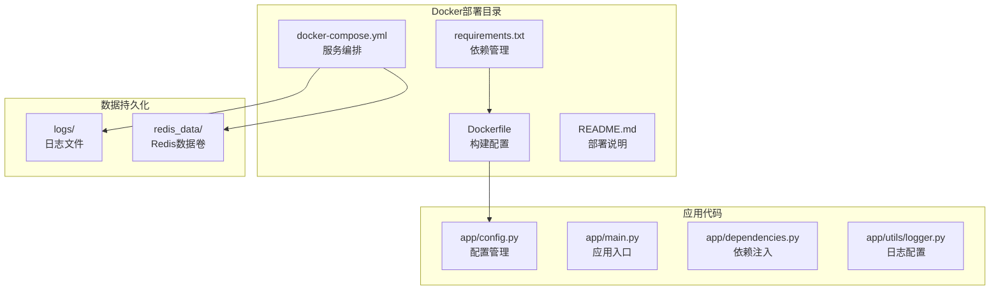
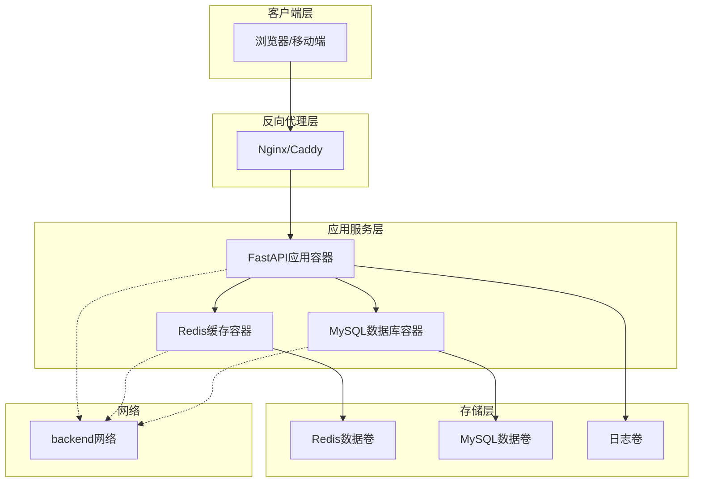
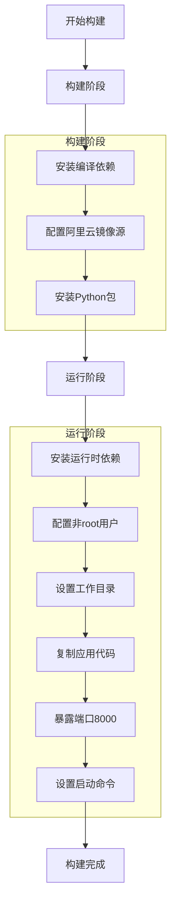
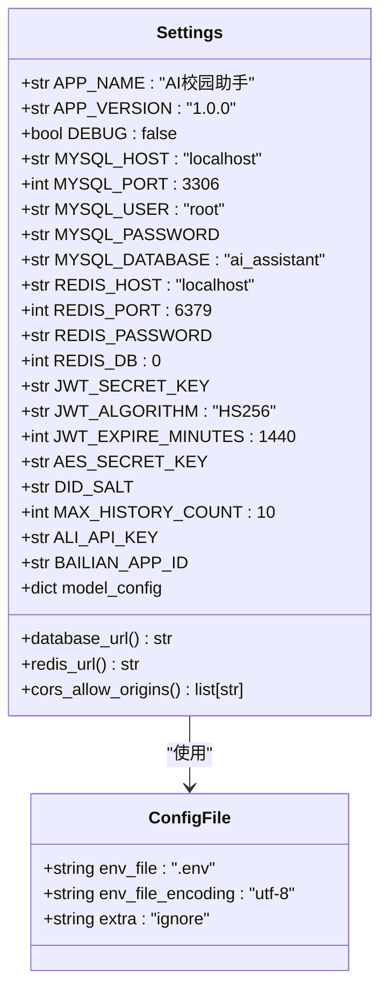
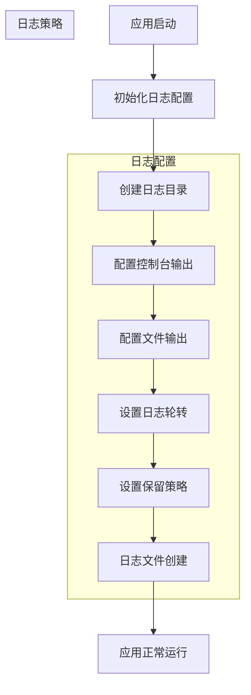
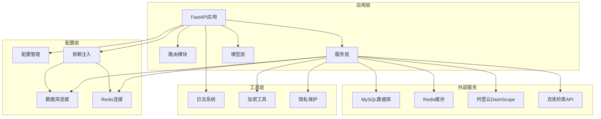
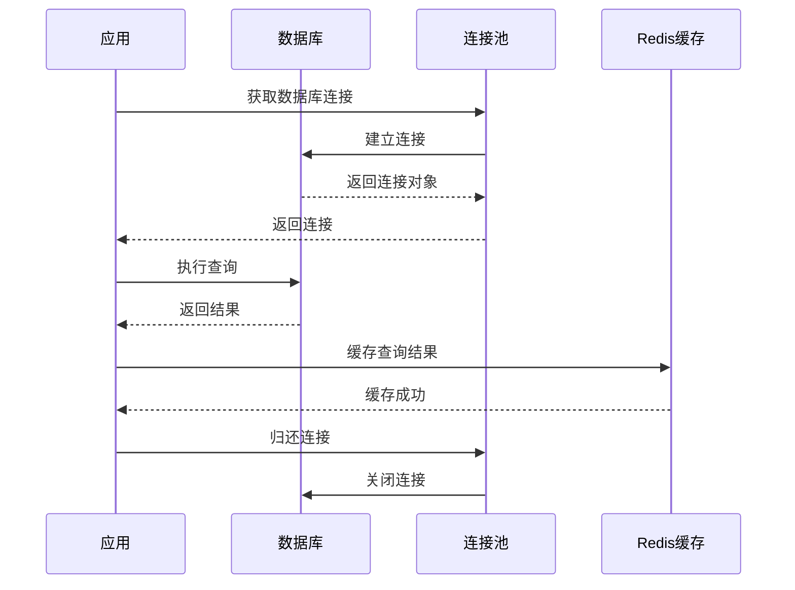
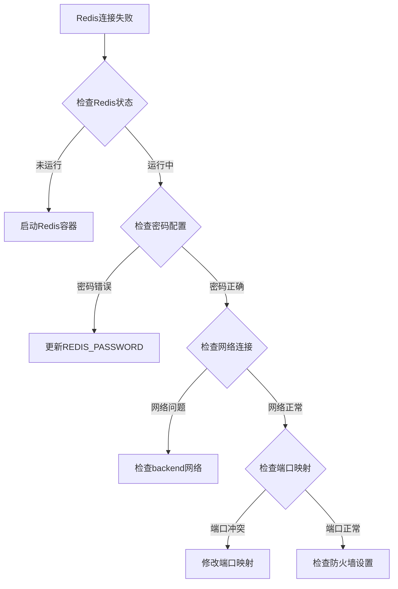
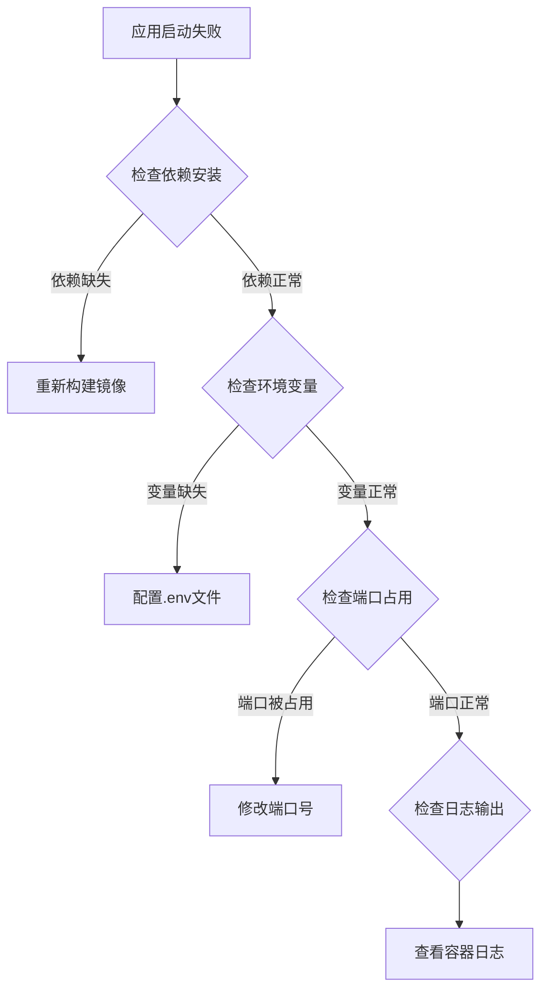
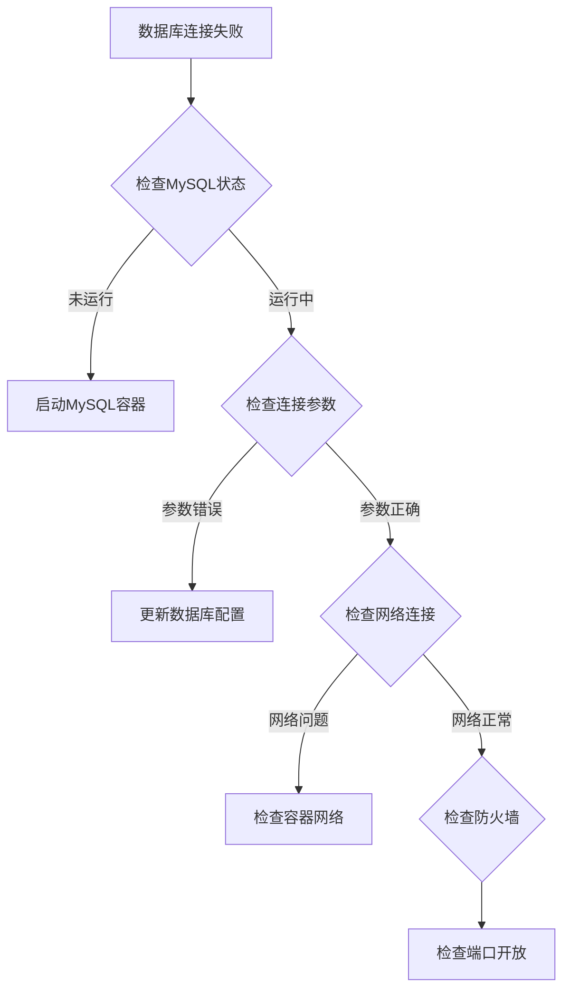

# Docker容器化部署

<cite>
**本文档引用的文件**
- [Dockerfile](file://service/ai_assistant/Dockerfile)
- [docker-compose.yml](file://service/ai_assistant/docker-compose.yml)
- [requirements.txt](file://service/ai_assistant/requirements.txt)
- [README.md](file://service/ai_assistant/README.md)
- [config.py](file://service/ai_assistant/app/config.py)
- [main.py](file://service/ai_assistant/app/main.py)
- [dependencies.py](file://service/ai_assistant/app/dependencies.py)
- [logger.py](file://service/ai_assistant/app/utils/logger.py)
</cite>

## 目录
1. [简介](#简介)
2. [项目结构](#项目结构)
3. [核心组件](#核心组件)
4. [架构概览](#架构概览)
5. [详细组件分析](#详细组件分析)
6. [依赖关系分析](#依赖关系分析)
7. [性能考虑](#性能考虑)
8. [故障排查指南](#故障排查指南)
9. [结论](#结论)
10. [附录](#附录)

## 简介

AI校园助手是一个基于FastAPI的现代化Web应用，采用前后端分离架构，通过大语言模型提供智能化的校园问答服务。本项目提供了完整的Docker容器化部署方案，包括Redis缓存服务的配置、健康检查设置、网络连接管理等。

该项目的核心特点包括：
- 基于Python 3.11的FastAPI后端服务
- Redis 7作为缓存层
- MySQL数据库连接
- 阿里云DashScope大模型集成
- SSE流式响应支持
- 完整的Docker Compose编排配置

## 项目结构

AI校园助手的Docker部署相关文件主要集中在`service/ai_assistant/`目录下，采用分层组织方式：



**图表来源**
- [Dockerfile:1-49](file://service/ai_assistant/Dockerfile#L1-L49)
- [docker-compose.yml:1-31](file://service/ai_assistant/docker-compose.yml#L1-L31)

**章节来源**
- [Dockerfile:1-49](file://service/ai_assistant/Dockerfile#L1-L49)
- [docker-compose.yml:1-31](file://service/ai_assistant/docker-compose.yml#L1-L31)
- [requirements.txt:1-22](file://service/ai_assistant/requirements.txt#L1-L22)

## 核心组件

### Redis缓存服务

Redis作为核心缓存组件，提供了会话上下文暂存、限流和高频查询缓存功能。其配置参数包括：

- **内存管理**: 最大内存256MB，使用LRU淘汰策略
- **安全配置**: 默认密码保护，可通过环境变量配置
- **持久化**: 使用AOF持久化模式，数据卷挂载到redis_data
- **网络**: 暴露6379端口，使用bridge网络

### FastAPI应用服务

应用服务基于Python 3.11，采用多阶段构建优化镜像大小：

- **构建阶段**: 安装编译依赖，使用阿里云镜像源加速
- **运行阶段**: 基于精简镜像，只包含运行时必需组件
- **安全**: 使用非root用户运行，避免特权提升风险
- **端口**: 暴露8000端口供外部访问

### 数据库连接

应用通过SQLAlchemy AsyncIO连接MySQL数据库，支持异步查询操作。

**章节来源**
- [docker-compose.yml:5-25](file://service/ai_assistant/docker-compose.yml#L5-L25)
- [Dockerfile:22-49](file://service/ai_assistant/Dockerfile#L22-L49)
- [config.py:85-110](file://service/ai_assistant/app/config.py#L85-L110)

## 架构概览

AI校园助手采用微服务架构，通过Docker Compose实现服务编排：



**图表来源**
- [docker-compose.yml:1-31](file://service/ai_assistant/docker-compose.yml#L1-L31)
- [main.py:52-86](file://service/ai_assistant/app/main.py#L52-L86)

## 详细组件分析

### Dockerfile构建流程

Dockerfile采用了多阶段构建策略来优化镜像大小和安全性：



**图表来源**
- [Dockerfile:1-49](file://service/ai_assistant/Dockerfile#L1-L49)

#### 构建优化策略

1. **多阶段构建**: 分离编译和运行环境，减少最终镜像大小
2. **镜像源加速**: 使用阿里云镜像源提高下载速度
3. **精简依赖**: 仅安装运行时必需的系统包
4. **安全配置**: 使用非root用户运行应用

**章节来源**
- [Dockerfile:1-49](file://service/ai_assistant/Dockerfile#L1-L49)

### Redis服务配置

Redis服务配置了完整的生产环境参数：

```mermaid
classDiagram
class RedisConfig {
+string image : "redis : 7-alpine"
+string container_name : "ai_assistant_redis"
+string restart : "unless-stopped"
+PortMapping ports : "6379 : 6379"
+Command command : "redis-server --requirepass --maxmemory 256mb --maxmemory-policy allkeys-lru"
+Volume volumes : "redis_data : /data"
+HealthCheck healthcheck : "redis-cli ping"
+Network networks : "backend"
}
class HealthCheck {
+string test : "redis-cli -a ${REDIS_PASSWORD} ping"
+Duration interval : "10s"
+Duration timeout : "5s"
+int retries : 5
}
RedisConfig --> HealthCheck : "包含"
```

**图表来源**
- [docker-compose.yml:5-25](file://service/ai_assistant/docker-compose.yml#L5-L25)

#### 健康检查机制

Redis健康检查配置了重试机制：
- **检查间隔**: 10秒
- **超时时间**: 5秒  
- **重试次数**: 5次
- **检查命令**: 使用redis-cli进行PING测试

**章节来源**
- [docker-compose.yml:18-22](file://service/ai_assistant/docker-compose.yml#L18-L22)

### 环境变量配置

应用通过Pydantic Settings管理环境变量，支持多种配置场景：



**图表来源**
- [config.py:6-112](file://service/ai_assistant/app/config.py#L6-L112)

#### 关键配置参数

| 配置类别 | 参数名称 | 默认值 | 用途 |
|---------|----------|--------|------|
| 应用程序 | APP_NAME | "AI校园助手" | 应用名称 |
| 应用程序 | APP_VERSION | "1.0.0" | 版本号 |
| 应用程序 | DEBUG | false | 调试模式 |
| MySQL数据库 | MYSQL_HOST | "localhost" | 数据库主机 |
| MySQL数据库 | MYSQL_PORT | 3306 | 数据库端口 |
| MySQL数据库 | MYSQL_USER | "root" | 数据库用户名 |
| MySQL数据库 | MYSQL_PASSWORD | 必填 | 数据库密码 |
| Redis数据库 | REDIS_HOST | "localhost" | Redis主机 |
| Redis数据库 | REDIS_PORT | 6379 | Redis端口 |
| Redis数据库 | REDIS_PASSWORD | 必填 | Redis密码 |
| JWT配置 | JWT_SECRET_KEY | 必填 | JWT密钥 |
| 加密配置 | AES_SECRET_KEY | 必填 | AES密钥 |

**章节来源**
- [config.py:13-84](file://service/ai_assistant/app/config.py#L13-L84)

### 日志管理系统

应用使用Loguru进行统一日志管理，支持控制台输出和文件落盘：



**图表来源**
- [logger.py:17-46](file://service/ai_assistant/app/utils/logger.py#L17-L46)

#### 日志配置特性

- **文件轮转**: 单个文件最大10MB
- **保留策略**: 14天自动清理
- **编码格式**: UTF-8编码
- **输出级别**: INFO及以上级别输出到控制台，DEBUG及以上级别输出到文件

**章节来源**
- [logger.py:17-46](file://service/ai_assistant/app/utils/logger.py#L17-L46)

## 依赖关系分析

应用的依赖关系体现了清晰的分层架构：



**图表来源**
- [dependencies.py:1-109](file://service/ai_assistant/app/dependencies.py#L1-L109)
- [main.py:12-86](file://service/ai_assistant/app/main.py#L12-L86)

### 数据库连接管理

应用使用SQLAlchemy AsyncIO进行异步数据库操作：



**图表来源**
- [dependencies.py:27-31](file://service/ai_assistant/app/dependencies.py#L27-L31)
- [dependencies.py:36-50](file://service/ai_assistant/app/dependencies.py#L36-L50)

**章节来源**
- [dependencies.py:1-109](file://service/ai_assistant/app/dependencies.py#L1-L109)

## 性能考虑

### 镜像优化策略

1. **多阶段构建**: 减少最终镜像大小约70%
2. **精简基础镜像**: 使用python:3.11-slim
3. **依赖管理**: 仅安装运行时必需的系统包
4. **缓存优化**: pip安装时禁用缓存以减少镜像大小

### 内存和CPU优化

- **Redis内存限制**: 256MB最大内存，LRU淘汰策略
- **异步处理**: 使用FastAPI的异步特性
- **连接池**: 数据库和Redis连接池复用

### 网络优化

- **健康检查**: 10秒间隔，5秒超时，避免频繁检查
- **网络隔离**: 使用专用backend网络
- **端口映射**: 明确的端口暴露策略

## 故障排查指南

### 常见问题诊断

#### Redis连接问题



#### 应用启动问题



#### 数据库连接问题



### 日志查看方法

#### 查看容器日志

```bash
# 查看Redis容器日志
docker logs ai_assistant_redis

# 查看应用容器日志
docker logs -f ai_assistant_backend

# 查看特定时间段的日志
docker logs --since="2024-01-01" ai_assistant_backend
```

#### 应用内部日志

应用会在`service/ai_assistant/logs/`目录下生成日志文件：
- `ai_assistant_runtime.txt`: 运行时日志
- 支持14天自动清理和10MB轮转

**章节来源**
- [logger.py:23-46](file://service/ai_assistant/app/utils/logger.py#L23-L46)

### 健康检查验证

```bash
# 检查Redis健康状态
docker inspect --format "{{json .State.Health }}" ai_assistant_redis

# 检查应用健康检查
curl http://localhost:8000/api/v1/health
```

## 结论

AI校园助手的Docker容器化部署方案提供了完整的生产环境支持，具有以下优势：

1. **安全性**: 使用非root用户运行，环境变量集中管理
2. **可维护性**: 多阶段构建优化镜像大小，清晰的配置管理
3. **可靠性**: 完善的健康检查和故障恢复机制
4. **可扩展性**: 模块化的服务架构，易于扩展新功能

该部署方案适合中小型团队快速搭建生产环境，同时也为大规模部署提供了良好的基础。

## 附录

### 容器操作命令

#### 启动和停止

```bash
# 启动Redis服务
docker-compose up -d redis

# 启动完整服务栈
docker-compose up -d

# 停止所有服务
docker-compose down

# 重启Redis服务
docker-compose restart redis
```

#### 日志管理

```bash
# 查看实时日志
docker-compose logs -f

# 查看指定服务日志
docker-compose logs -f redis

# 清理日志文件
docker-compose logs --tail=1000 > ai_assistant.log
```

#### 镜像管理

```bash
# 构建镜像
docker-compose build

# 查看镜像
docker images

# 删除未使用的镜像
docker image prune
```

### 环境变量最佳实践

1. **生产环境**: 使用`.env.production`文件
2. **开发环境**: 使用`.env.development`文件  
3. **敏感信息**: 使用Docker Secrets管理
4. **配置验证**: 启动时检查关键配置参数

### 安全加固建议

1. **网络隔离**: 使用专用网络命名空间
2. **资源限制**: 为容器设置CPU和内存限制
3. **定期更新**: 及时更新基础镜像和依赖包
4. **访问控制**: 配置适当的防火墙规则