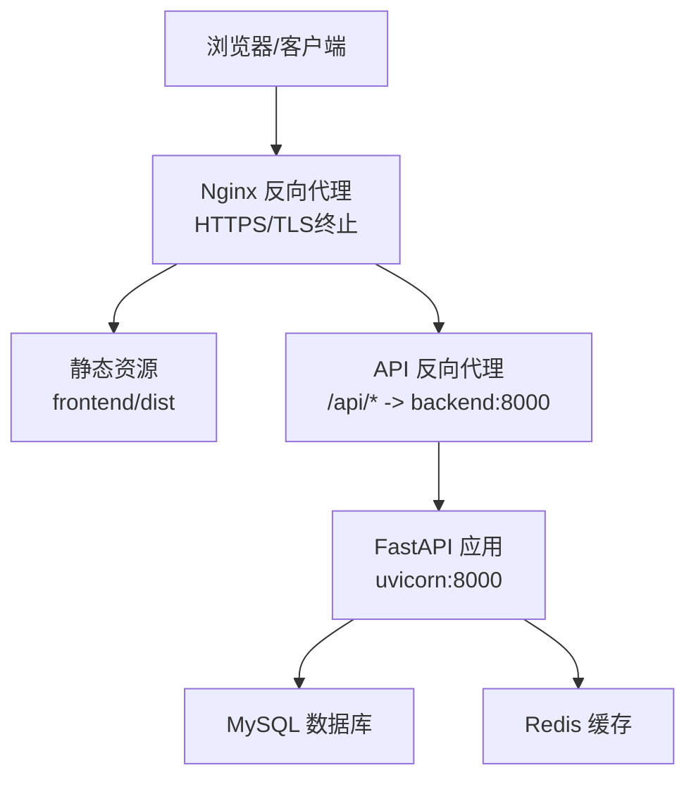
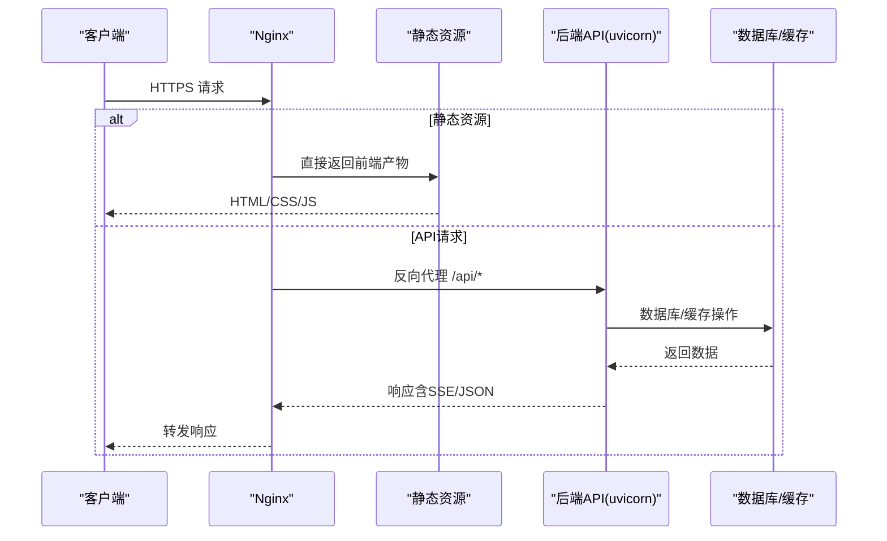
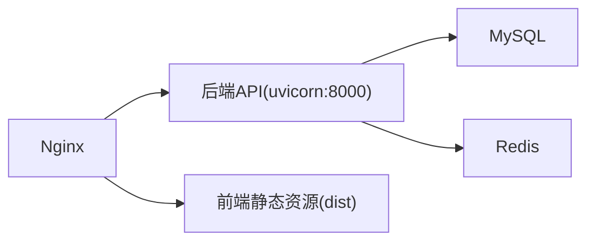

# Nginx反向代理配置

<cite>
**本文档引用的文件**
- [README.md](file://README.md)
- [docker-compose.yml](file://service/ai_assistant/docker-compose.yml)
- [Dockerfile](file://service/ai_assistant/Dockerfile)
- [main.py](file://service/ai_assistant/app/main.py)
- [config.py](file://service/ai_assistant/app/config.py)
- [auth.py](file://service/ai_assistant/app/routers/auth.py)
- [query.py](file://service/ai_assistant/app/routers/query.py)
- [system.py](file://service/ai_assistant/app/routers/system.py)
- [admin.py](file://service/ai_assistant/app/routers/admin.py)
- [vite.config.js](file://frontend/ai_assistant/vite.config.js)
</cite>

## 目录
1. [简介](#简介)
2. [项目结构](#项目结构)
3. [核心组件](#核心组件)
4. [架构总览](#架构总览)
5. [详细组件分析](#详细组件分析)
6. [依赖关系分析](#依赖关系分析)
7. [性能考虑](#性能考虑)
8. [故障排查指南](#故障排查指南)
9. [结论](#结论)
10. [附录](#附录)

## 简介
本文件面向AI校园助手项目的Nginx反向代理配置，围绕以下目标展开：
- 反向代理上游服务器配置与负载均衡策略
- 静态资源处理与前端产物托管
- SSL/TLS证书配置、HTTPS重定向与安全头部
- WebSocket与Server-Sent Events支持（SSE）以满足实时消息推送
- 性能优化：gzip压缩、缓存策略、超时设置
- 最佳实践与安全加固建议

项目背景与部署要点：
- 后端服务基于FastAPI，容器内监听8000端口
- 前端基于Vue 3 + Vite，开发时通过Vite代理转发/api请求
- 生产环境建议通过Nginx提供HTTPS与SSE支持

章节来源
- [README.md:47-104](file://README.md#L47-L104)
- [Dockerfile:46-49](file://service/ai_assistant/Dockerfile#L46-L49)

## 项目结构
下图展示了AI校园助手的典型部署拓扑，其中Nginx位于最外层，负责TLS终止、静态资源与API反向代理，后端服务容器监听8000端口。



图表来源
- [README.md:47-104](file://README.md#L47-L104)
- [docker-compose.yml:1-31](file://service/ai_assistant/docker-compose.yml#L1-L31)
- [Dockerfile:46-49](file://service/ai_assistant/Dockerfile#L46-L49)

章节来源
- [README.md:47-104](file://README.md#L47-L104)
- [docker-compose.yml:1-31](file://service/ai_assistant/docker-compose.yml#L1-L31)
- [Dockerfile:46-49](file://service/ai_assistant/Dockerfile#L46-L49)

## 核心组件
- Nginx反向代理：负责HTTPS终止、静态资源分发、API路由转发、SSE/WS支持
- FastAPI后端：提供认证、查询、管理员等功能接口，内部监听8000端口
- 前端静态资源：Vue应用构建产物，可由Nginx直接提供或通过容器提供
- 数据存储：MySQL（数据库）、Redis（缓存）

章节来源
- [main.py:52-86](file://service/ai_assistant/app/main.py#L52-L86)
- [docker-compose.yml:1-31](file://service/ai_assistant/docker-compose.yml#L1-L31)

## 架构总览
下图展示Nginx在整体架构中的作用与流量走向：



图表来源
- [README.md:47-104](file://README.md#L47-L104)
- [main.py:52-86](file://service/ai_assistant/app/main.py#L52-L86)
- [docker-compose.yml:1-31](file://service/ai_assistant/docker-compose.yml#L1-L31)

## 详细组件分析

### 反向代理上游与负载均衡
- 单节点上游：后端服务容器监听8000端口，Nginx通过proxy_pass指向该地址
- 负载均衡策略：若部署多实例，可在upstream中配置多节点，配合权重、健康检查
- 超时与缓冲：针对SSE/WS，需禁用代理缓冲、设置合适的超时参数

章节来源
- [README.md:67-104](file://README.md#L67-L104)
- [docker-compose.yml:1-31](file://service/ai_assistant/docker-compose.yml#L1-L31)
- [Dockerfile:46-49](file://service/ai_assistant/Dockerfile#L46-L49)

### 静态资源处理
- 前端构建产物路径：frontend/ai_assistant/dist
- Nginx可直接提供静态文件，或通过容器提供
- 建议启用缓存与压缩，提升首屏加载速度

章节来源
- [vite.config.js:1-23](file://frontend/ai_assistant/vite.config.js#L1-L23)

### SSL/TLS与HTTPS重定向
- 使用Let's Encrypt证书或自签证书
- HTTPS监听443端口，配置证书与私钥路径
- 建议开启HSTS、OCSP Stapling等安全特性

章节来源
- [README.md:67-104](file://README.md#L67-L104)

### WebSocket与SSE支持
- SSE：后端使用Server-Sent Events实现流式输出，需禁用代理缓冲、设置Connection头为空
- WebSocket：若未来引入WS，需升级到HTTP/2并配置ws://代理

```mermaid
sequenceDiagram
participant B as "浏览器"
participant N as "Nginx"
participant F as "后端FastAPI"
B->>N : 建立SSE连接
N->>F : 反向代理SSE
F-->>N : 事件流(data : ...)\n\n
N-->>B : 逐块推送事件
Note over N,F : 关键：proxy_buffering off; proxy_cache off;
```

图表来源
- [README.md:75-104](file://README.md#L75-L104)
- [query.py:115-126](file://service/ai_assistant/app/routers/query.py#L115-L126)

章节来源
- [README.md:75-104](file://README.md#L75-L104)
- [query.py:115-126](file://service/ai_assistant/app/routers/query.py#L115-L126)

### API路由与鉴权
- 认证接口：/api/v1/auth/login
- 查询接口：/api/v1/query（支持SSE流式输出）
- 管理员接口：/api/v1/admin/*
- 健康检查：/api/v1/health

章节来源
- [auth.py:21-102](file://service/ai_assistant/app/routers/auth.py#L21-L102)
- [query.py:46-788](file://service/ai_assistant/app/routers/query.py#L46-L788)
- [admin.py:48-388](file://service/ai_assistant/app/routers/admin.py#L48-L388)
- [system.py:22-38](file://service/ai_assistant/app/routers/system.py#L22-L38)

### CORS与跨域
- 生产环境需将允许的前端源加入CORS白名单
- 开发环境默认允许本地Vite源

章节来源
- [config.py:103-110](file://service/ai_assistant/app/config.py#L103-L110)
- [main.py:70-76](file://service/ai_assistant/app/main.py#L70-L76)
- [vite.config.js:12-22](file://frontend/ai_assistant/vite.config.js#L12-L22)

## 依赖关系分析
- Nginx依赖后端服务容器（uvicorn:8000）
- 后端依赖MySQL与Redis
- 前端构建产物由Nginx提供或由容器提供



图表来源
- [docker-compose.yml:1-31](file://service/ai_assistant/docker-compose.yml#L1-L31)
- [Dockerfile:46-49](file://service/ai_assistant/Dockerfile#L46-L49)

章节来源
- [docker-compose.yml:1-31](file://service/ai_assistant/docker-compose.yml#L1-L31)
- [Dockerfile:46-49](file://service/ai_assistant/Dockerfile#L46-L49)

## 性能考虑
- gzip压缩：对文本类资源启用gzip压缩
- 缓存策略：静态资源设置长期缓存，API响应避免缓存敏感数据
- 超时设置：根据SSE/WS特性设置合理的proxy_read_timeout与send_timeout
- 连接池：后端uvicorn连接池与Nginx上游连接数匹配
- 压测与监控：上线前进行压力测试与性能监控

[本节为通用指导，无需特定文件引用]

## 故障排查指南
- SSE输出被缓冲：确认已禁用proxy_buffering与proxy_cache
- CORS错误：核对CORS允许源配置
- 404/路径不匹配：检查location匹配与proxy_pass路径
- 证书问题：确认证书与私钥路径正确、权限正确
- 超时：适当增大proxy_read_timeout与send_timeout

章节来源
- [README.md:75-104](file://README.md#L75-L104)
- [main.py:70-76](file://service/ai_assistant/app/main.py#L70-L76)
- [config.py:103-110](file://service/ai_assistant/app/config.py#L103-L110)

## 结论
通过合理配置Nginx的反向代理、SSE支持与安全策略，可为AI校园助手提供稳定、安全、高性能的线上服务。建议在生产环境启用HTTPS、严格的CORS策略与安全头部，并持续监控性能指标。

[本节为总结性内容，无需特定文件引用]

## 附录

### Nginx配置要点清单
- 监听443端口，配置SSL证书与私钥
- location /api/ 反向代理至后端8000端口
- SSE关键参数：禁用缓冲、关闭缓存、设置HTTP/1.1与chunked_transfer_encoding
- CORS：允许生产环境前端源
- 静态资源：提供frontend/dist或通过容器提供
- 超时：根据业务调整proxy_read_timeout与send_timeout
- 安全：HSTS、安全头部、OCSP Stapling（如适用）

章节来源
- [README.md:67-104](file://README.md#L67-L104)
- [query.py:115-126](file://service/ai_assistant/app/routers/query.py#L115-L126)
- [main.py:70-76](file://service/ai_assistant/app/main.py#L70-L76)
- [config.py:103-110](file://service/ai_assistant/app/config.py#L103-L110)