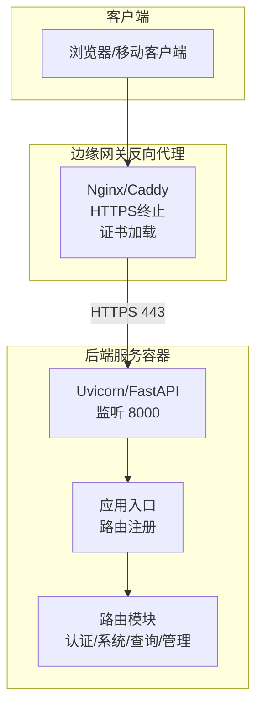
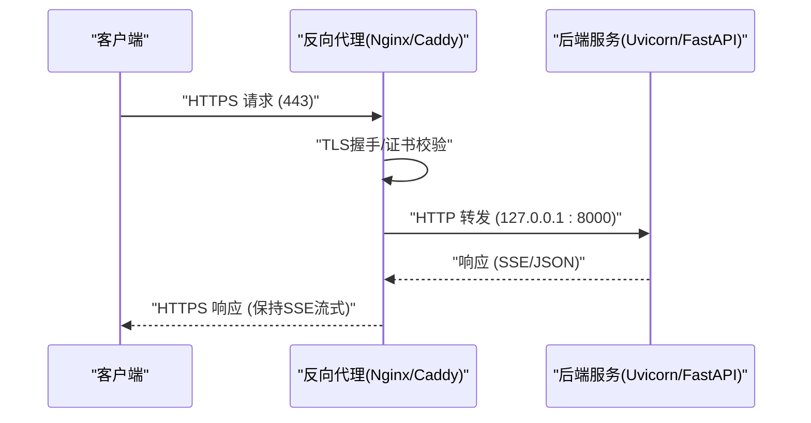
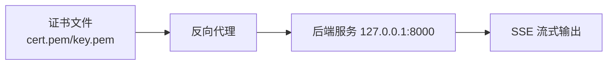

# SSL证书管理

<cite>
**本文引用的文件**
- [README.md](file://README.md)
- [Dockerfile](file://service/ai_assistant/Dockerfile)
- [docker-compose.yml](file://service/ai_assistant/docker-compose.yml)
- [app/main.py](file://service/ai_assistant/app/main.py)
- [app/config.py](file://service/ai_assistant/app/config.py)
- [app/routers/system.py](file://service/ai_assistant/app/routers/system.py)
- [app/routers/auth.py](file://service/ai_assistant/app/routers/auth.py)
- [frontend/package.json](file://frontend/ai_assistant/package.json)
</cite>

## 目录
1. [简介](#简介)
2. [项目结构](#项目结构)
3. [核心组件](#核心组件)
4. [架构总览](#架构总览)
5. [详细组件分析](#详细组件分析)
6. [依赖分析](#依赖分析)
7. [性能考虑](#性能考虑)
8. [故障排查指南](#故障排查指南)
9. [结论](#结论)
10. [附录](#附录)

## 简介
本文件面向“AI校园助手”项目，提供一套完整的SSL/TLS证书管理方案，覆盖以下主题：
- HTTPS证书申请与自动化配置（重点为Let’s Encrypt免费证书）
- 证书续期自动化脚本与定时任务配置
- 自签名证书的生成与适用场景
- 证书链配置、私钥保护、证书监控等安全措施
- 不同证书提供商的配置示例与迁移方法
- 证书验证与常见故障排查命令与工具

说明：本项目后端服务通过反向代理（如Nginx/Caddy）提供HTTPS访问，后端容器监听本地端口并通过代理转发到公网。因此，证书管理的关键在于反向代理层的证书配置与续期策略。

## 项目结构
项目采用前后端分离架构，后端使用FastAPI，容器化部署并通过反向代理对外提供HTTPS服务。与证书管理直接相关的组件包括：
- 反向代理（Nginx/Caddy）：负责TLS终止、证书加载、SSE流式透传
- 后端服务（FastAPI）：监听本地端口，提供REST API与SSE
- 健康检查与版本接口：便于证书生效后的连通性验证

图表来源
- [README.md:67-104](file://README.md#L67-L104)
- [Dockerfile:46-49](file://service/ai_assistant/Dockerfile#L46-L49)
- [app/main.py:52-86](file://service/ai_assistant/app/main.py#L52-L86)
- [app/routers/system.py:22-38](file://service/ai_assistant/app/routers/system.py#L22-L38)
- [app/routers/auth.py:21-53](file://service/ai_assistant/app/routers/auth.py#L21-L53)

章节来源
- [README.md:67-104](file://README.md#L67-L104)
- [Dockerfile:46-49](file://service/ai_assistant/Dockerfile#L46-L49)
- [app/main.py:52-86](file://service/ai_assistant/app/main.py#L52-L86)

## 核心组件
- 反向代理（Nginx/Caddy）
  - 负责TLS终止、证书加载、SSE流式透传（禁用代理缓冲、开启分块传输）
  - 证书路径通过配置文件指定（证书与私钥文件）
- 后端服务（FastAPI）
  - 默认监听本地端口，通过反向代理对外提供HTTPS
  - 提供健康检查与版本接口，便于证书生效后的连通性验证
- 健康检查接口
  - GET /api/v1/health：返回服务状态
  - GET /api/v1/version：返回应用名称与版本

章节来源
- [README.md:67-104](file://README.md#L67-L104)
- [app/routers/system.py:22-38](file://service/ai_assistant/app/routers/system.py#L22-L38)

## 架构总览
下图展示了证书在整体架构中的位置与流转：

图表来源
- [README.md:75-102](file://README.md#L75-L102)
- [Dockerfile:46-49](file://service/ai_assistant/Dockerfile#L46-L49)
- [app/main.py:52-86](file://service/ai_assistant/app/main.py#L52-L86)

## 详细组件分析

### 反向代理与证书加载
- TLS终止位置：反向代理负责TLS握手与证书加载
- 证书与私钥路径：在代理配置中分别指定证书与私钥文件路径
- SSE流式支持：为/ api/ 路径启用禁用缓冲、关闭缓存、设置Connection为空、HTTP 1.1与分块传输编码，确保前端能逐条接收SSE事件
- 健康检查：通过访问 https://域名/api/v1/health 验证HTTPS连通性

章节来源
- [README.md:75-104](file://README.md#L75-L104)

### 后端服务（FastAPI）与SSE
- 监听端口：容器内监听8000端口
- 路由注册：认证、系统、查询、管理等路由
- SSE特性：后端通过StreamingResponse实现SSE，配合代理的SSE透传配置可保证前端实时渲染

章节来源
- [Dockerfile:46-49](file://service/ai_assistant/Dockerfile#L46-L49)
- [app/main.py:52-86](file://service/ai_assistant/app/main.py#L52-L86)

### 健康检查与版本接口
- 健康检查：GET /api/v1/health 返回服务状态
- 版本信息：GET /api/v1/version 返回应用名称与版本
- 用途：证书生效后用于快速验证HTTPS连通性与服务可用性

章节来源
- [app/routers/system.py:22-38](file://service/ai_assistant/app/routers/system.py#L22-L38)

### 认证路由与安全基线
- 登录接口：POST /api/v1/auth/login，返回JWT Bearer令牌
- 密码变更：需要有效Bearer Token，旧密码验证通过后方可更新
- 安全要点：配合HTTPS传输，避免明文泄露；JWT密钥与AES密钥需妥善保管

章节来源
- [app/routers/auth.py:21-53](file://service/ai_assistant/app/routers/auth.py#L21-L53)
- [app/config.py:32-44](file://service/ai_assistant/app/config.py#L32-L44)

## 依赖分析
- 反向代理与后端服务的耦合点：代理负责TLS终止并将HTTP请求转发至后端8000端口
- 证书依赖：代理需加载有效的证书与私钥文件，证书链需完整（含中间证书）
- SSE依赖：代理需禁用缓冲并启用分块传输，以支持SSE流式输出

图表来源
- [README.md:75-102](file://README.md#L75-L102)
- [Dockerfile:46-49](file://service/ai_assistant/Dockerfile#L46-L49)

章节来源
- [README.md:75-102](file://README.md#L75-L102)
- [Dockerfile:46-49](file://service/ai_assistant/Dockerfile#L46-L49)

## 性能考虑
- SSE流式性能：代理禁用缓冲与缓存，使用HTTP 1.1与分块传输，减少延迟，提升前端打字机式体验
- 证书链优化：确保证书链完整，避免客户端重复握手与额外网络往返
- 私钥保护：私钥文件权限最小化，仅允许代理进程读取；定期轮换私钥与证书

## 故障排查指南
- 证书链问题
  - 现象：浏览器显示证书不受信任或中间证书缺失
  - 排查：确认代理配置中证书链完整（包含中间证书），并重新加载代理
- 私钥权限问题
  - 现象：代理无法读取私钥或握手失败
  - 排查：检查私钥文件权限与属主，确保仅允许代理进程读取
- SSE流式中断
  - 现象：前端未逐条收到事件，而是等待一段时间后一次性显示
  - 排查：确认代理对/ api/ 路径禁用了缓冲、关闭了缓存，并启用了分块传输
- 健康检查失败
  - 现象：访问 https://域名/api/v1/health 返回不可达
  - 排查：检查代理是否正确转发到后端8000端口，确认后端容器已启动并监听8000端口

章节来源
- [README.md:75-104](file://README.md#L75-L104)
- [app/routers/system.py:22-38](file://service/ai_assistant/app/routers/system.py#L22-L38)

## 结论
本项目通过反向代理实现HTTPS与SSE流式透传，证书管理的关键在于代理层的证书加载与续期策略。建议优先采用Let’s Encrypt自动化证书申请与续期，结合严格的私钥权限与证书链完整性校验，确保生产环境的安全与稳定。

## 附录

### Let’s Encrypt免费证书自动化配置
- 证书申请与自动续期
  - 使用Certbot（acme-tiny或官方certbot）申请与续期Let’s Encrypt证书
  - 配置Webroot模式或独立HTTP-01验证，确保域名解析指向当前服务器
  - 设置定时任务（如每日）自动续期并触发代理重载
- 证书文件与代理配置
  - 将证书与私钥路径配置到反向代理（证书文件与私钥文件）
  - 重启或重载代理以使新证书生效

章节来源
- [README.md:74](file://README.md#L74)

### 自签名证书生成与使用场景
- 生成自签名证书
  - 使用OpenSSL生成自签名证书与私钥，适用于开发与测试环境
- 使用场景
  - 开发联调、内网演示、离线环境
- 注意事项
  - 自签名证书在生产环境会被浏览器标记为不受信任，需谨慎使用
  - 如需在生产使用，建议通过内部CA签发或购买商业证书

章节来源
- [README.md:74](file://README.md#L74)

### 证书链配置与私钥保护
- 证书链配置
  - 确保证书链完整（根证书与中间证书），避免客户端重复握手
- 私钥保护
  - 私钥文件权限最小化（仅允许代理进程读取）
  - 私钥与证书分离存储，定期轮换
- 证书监控
  - 设置到期提醒与自动续期
  - 通过健康检查接口验证HTTPS连通性

章节来源
- [README.md:75-104](file://README.md#L75-L104)

### 不同证书提供商的配置示例与迁移方法
- 商业证书（如阿里云证书服务、腾讯云SSL证书）
  - 下载证书与私钥，按代理配置要求放置到指定路径
  - 上传证书链（含中间证书），确保链完整
- 迁移方法
  - 新证书就位后先验证健康检查接口连通性
  - 切换代理配置并重载代理
  - 回滚策略：保留旧证书与私钥，若新证书异常则立即回滚

章节来源
- [README.md:74-104](file://README.md#L74-L104)

### 证书验证与故障排查常用命令与工具
- 证书链验证
  - OpenSSL：检查证书链完整性与有效期
- 代理重载
  - Nginx：重载配置以应用新证书
  - Caddy：自动热重载证书
- 健康检查
  - 访问 https://域名/api/v1/health 验证HTTPS连通性
  - 访问 https://域名/api/v1/version 获取版本信息

章节来源
- [README.md:75-104](file://README.md#L75-L104)
- [app/routers/system.py:22-38](file://service/ai_assistant/app/routers/system.py#L22-L38)