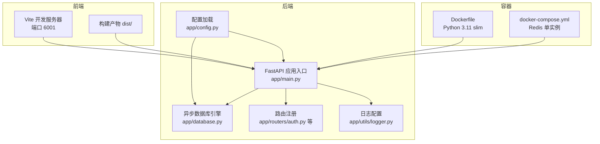
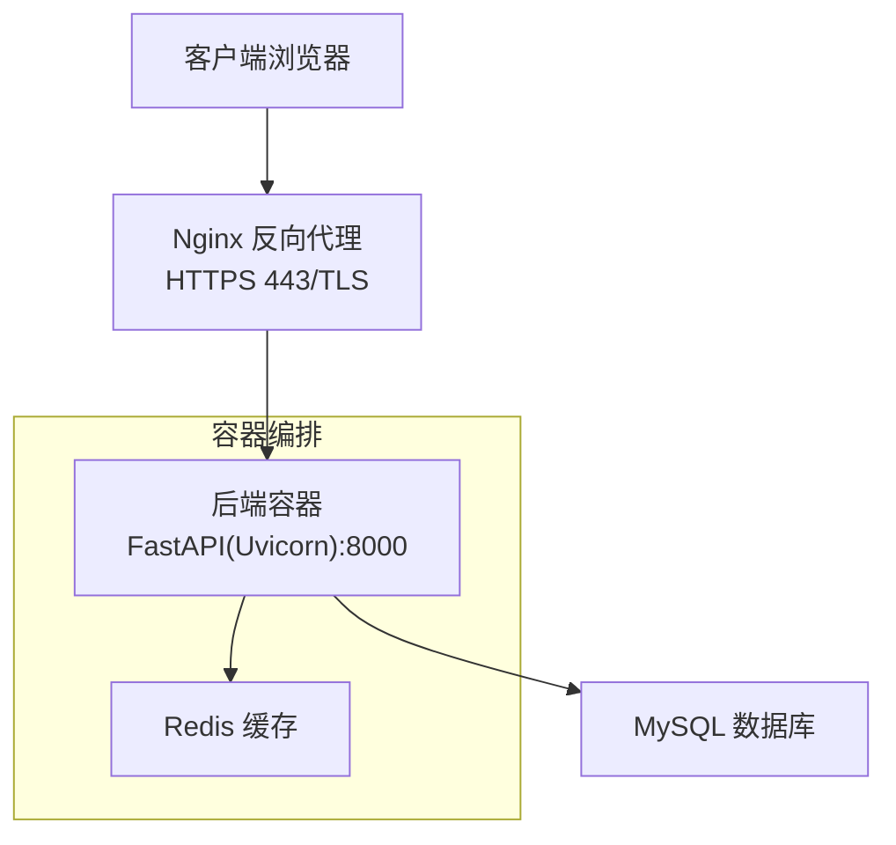
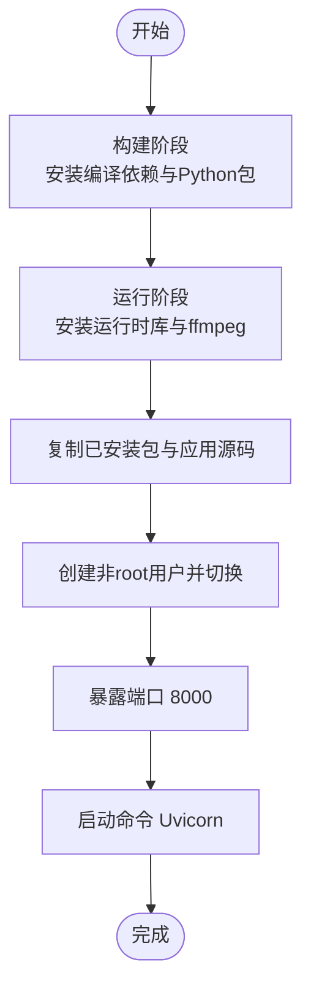
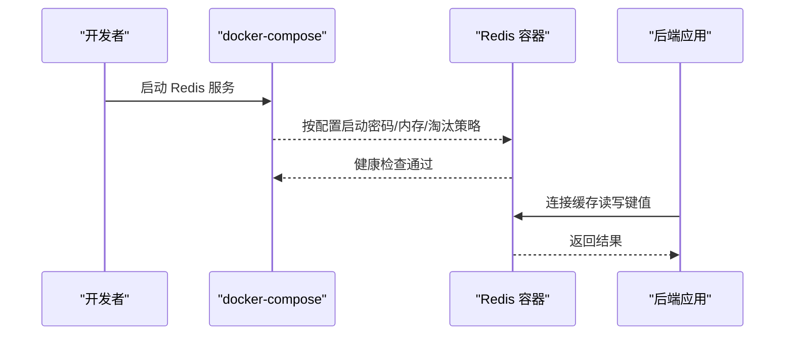
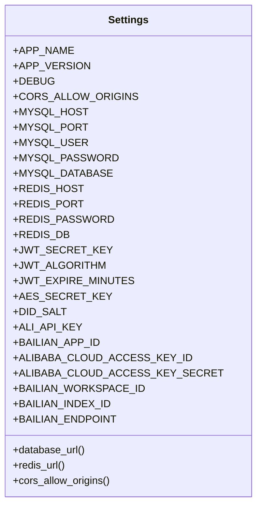
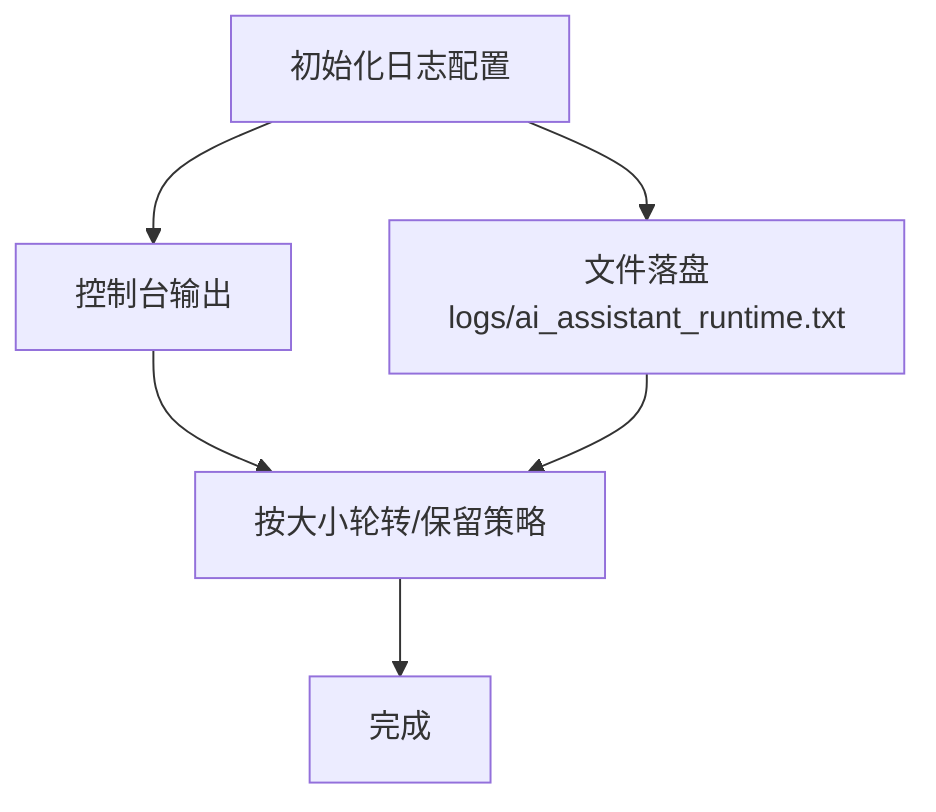
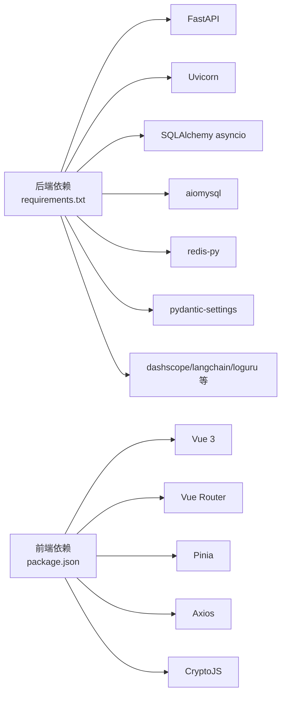

# 生产环境部署

<cite>
**本文引用的文件**
- [Dockerfile](file://service/ai_assistant/Dockerfile)
- [docker-compose.yml](file://service/ai_assistant/docker-compose.yml)
- [requirements.txt](file://service/ai_assistant/requirements.txt)
- [app/main.py](file://service/ai_assistant/app/main.py)
- [app/config.py](file://service/ai_assistant/app/config.py)
- [app/database.py](file://service/ai_assistant/app/database.py)
- [app/utils/logger.py](file://service/ai_assistant/app/utils/logger.py)
- [app/routers/auth.py](file://service/ai_assistant/app/routers/auth.py)
- [frontend/vite.config.js](file://frontend/ai_assistant/vite.config.js)
- [frontend/package.json](file://frontend/ai_assistant/package.json)
- [README.md](file://README.md)
- [service/README.md](file://service/ai_assistant/README.md)
</cite>

## 目录
1. [简介](#简介)
2. [项目结构](#项目结构)
3. [核心组件](#核心组件)
4. [架构总览](#架构总览)
5. [详细组件分析](#详细组件分析)
6. [依赖分析](#依赖分析)
7. [性能考虑](#性能考虑)
8. [故障排查指南](#故障排查指南)
9. [结论](#结论)
10. [附录](#附录)

## 简介
本文件面向生产环境，提供“AI校园助手”的完整部署指南，涵盖容器化镜像构建、服务编排、反向代理（Nginx）配置、HTTPS证书（Let’s Encrypt）申请与配置、环境变量与敏感信息保护、系统与硬件建议、以及自动化部署脚本与流程。文档严格依据仓库现有文件进行说明，避免臆造信息。

## 项目结构
后端采用 FastAPI + Uvicorn + 异步 SQLAlchemy + Redis 的技术栈；前端使用 Vue 3 + Vite；容器化通过 Docker 与 docker-compose 实现；日志统一由 Loguru 输出到文件；应用通过 Pydantic Settings 从 .env 加载配置。

图表来源
- [Dockerfile:1-49](file://service/ai_assistant/Dockerfile#L1-L49)
- [docker-compose.yml:1-31](file://service/ai_assistant/docker-compose.yml#L1-L31)
- [app/main.py:1-86](file://service/ai_assistant/app/main.py#L1-L86)
- [app/config.py:1-113](file://service/ai_assistant/app/config.py#L1-L113)
- [app/database.py:1-35](file://service/ai_assistant/app/database.py#L1-L35)
- [app/utils/logger.py:1-53](file://service/ai_assistant/app/utils/logger.py#L1-L53)
- [app/routers/auth.py:1-102](file://service/ai_assistant/app/routers/auth.py#L1-L102)
- [frontend/vite.config.js:1-23](file://frontend/ai_assistant/vite.config.js#L1-L23)

章节来源
- [Dockerfile:1-49](file://service/ai_assistant/Dockerfile#L1-L49)
- [docker-compose.yml:1-31](file://service/ai_assistant/docker-compose.yml#L1-L31)
- [app/main.py:1-86](file://service/ai_assistant/app/main.py#L1-L86)
- [app/config.py:1-113](file://service/ai_assistant/app/config.py#L1-L113)
- [app/database.py:1-35](file://service/ai_assistant/app/database.py#L1-L35)
- [app/utils/logger.py:1-53](file://service/ai_assistant/app/utils/logger.py#L1-L53)
- [frontend/vite.config.js:1-23](file://frontend/ai_assistant/vite.config.js#L1-L23)

## 核心组件
- 容器镜像与运行时
  - 基于 Python 3.11 slim 的多阶段构建，包含 MySQL 客户端与 ffmpeg，暴露 8000 端口，以非 root 用户运行。
- 服务编排
  - docker-compose 提供 Redis 7 容器，支持密码、内存策略与健康检查；网络为自定义桥接网络。
- 配置管理
  - 通过 Pydantic Settings 从 .env 加载，支持数据库、Redis、JWT、AES、隐私盐、阿里百炼与 DashScope 等配置。
- 日志系统
  - 使用 Loguru 输出到控制台与文件，文件轮转与保留策略配置明确。
- 健康检查
  - 前端系统接口提供健康检查与版本查询；后端路由注册包含系统相关路由。
- 前端开发代理
  - Vite 开发服务器代理 /api 到后端 8000 端口，便于联调。

章节来源
- [Dockerfile:1-49](file://service/ai_assistant/Dockerfile#L1-L49)
- [docker-compose.yml:1-31](file://service/ai_assistant/docker-compose.yml#L1-L31)
- [app/config.py:1-113](file://service/ai_assistant/app/config.py#L1-L113)
- [app/utils/logger.py:1-53](file://service/ai_assistant/app/utils/logger.py#L1-L53)
- [frontend/vite.config.js:1-23](file://frontend/ai_assistant/vite.config.js#L1-L23)
- [frontend/src/api/system.js:1-18](file://frontend/ai_assistant/src/api/system.js#L1-L18)

## 架构总览
下图展示生产环境典型拓扑：Nginx 作为反向代理与 SSL 终止，后端容器监听 8000 端口，Redis 作为缓存，数据库由外部托管或容器化（当前 compose 仅提供 Redis）。

图表来源
- [docker-compose.yml:1-31](file://service/ai_assistant/docker-compose.yml#L1-L31)
- [app/main.py:1-86](file://service/ai_assistant/app/main.py#L1-L86)
- [app/config.py:1-113](file://service/ai_assistant/app/config.py#L1-L113)

## 详细组件分析

### 容器镜像与构建流程
- 多阶段构建
  - 构建阶段安装编译依赖与 Python 依赖，使用国内镜像加速。
  - 运行阶段安装运行时依赖（MariaDB 客户端、ffmpeg），复制已安装包与应用源码。
- 安全与权限
  - 创建非 root 用户并切换，降低容器权限风险。
- 端口与入口
  - 暴露 8000 端口，Uvicorn 启动应用。

图表来源
- [Dockerfile:1-49](file://service/ai_assistant/Dockerfile#L1-L49)

章节来源
- [Dockerfile:1-49](file://service/ai_assistant/Dockerfile#L1-L49)

### 服务编排与 Redis 配置
- Redis 7（Alpine）
  - 默认密码来自环境变量（未设置则使用默认值），内存上限与淘汰策略配置，健康检查使用 redis-cli ping。
  - 数据卷持久化，网络为自定义桥接网络。
- MySQL
  - 当前 compose 未包含 MySQL 服务；若需一键编排，可参考现有模板新增 MySQL 服务（注意数据库初始化与备份策略）。

图表来源
- [docker-compose.yml:1-31](file://service/ai_assistant/docker-compose.yml#L1-L31)
- [app/config.py:26-31](file://service/ai_assistant/app/config.py#L26-L31)

章节来源
- [docker-compose.yml:1-31](file://service/ai_assistant/docker-compose.yml#L1-L31)
- [app/config.py:26-31](file://service/ai_assistant/app/config.py#L26-L31)

### 配置管理与环境变量
- 配置来源
  - 通过 .env 文件加载，支持数据库、Redis、JWT、AES、隐私盐、阿里百炼与 DashScope 等。
- CORS 与调试
  - CORS 允许来源由配置项提供，DEBUG 默认关闭，生产环境务必保持关闭。
- 数据库与 Redis URL
  - 提供属性方法拼装连接串，支持带/不带密码场景。
- 不安全默认检查
  - 启动时检查若干密钥是否使用默认值，触发告警提示。

图表来源
- [app/config.py:1-113](file://service/ai_assistant/app/config.py#L1-L113)
- [app/main.py:18-34](file://service/ai_assistant/app/main.py#L18-L34)

章节来源
- [app/config.py:1-113](file://service/ai_assistant/app/config.py#L1-L113)
- [app/main.py:18-34](file://service/ai_assistant/app/main.py#L18-L34)

### 日志系统与文件落盘
- 初始化与目标
  - 首次导入即初始化，输出到控制台与文件，文件位于 logs 目录，支持轮转与保留。
- 生产建议
  - 将日志目录映射到持久化存储，结合集中式日志收集工具（如 Filebeat/Fluent Bit）采集。

图表来源
- [app/utils/logger.py:1-53](file://service/ai_assistant/app/utils/logger.py#L1-L53)

章节来源
- [app/utils/logger.py:1-53](file://service/ai_assistant/app/utils/logger.py#L1-L53)

### 健康检查与系统接口
- 前端系统接口
  - 提供健康检查与版本查询，便于 Nginx 或外部探针探测。
- 后端路由
  - 主程序注册系统相关路由，配合健康检查保障可观测性。

章节来源
- [frontend/src/api/system.js:1-18](file://frontend/ai_assistant/src/api/system.js#L1-L18)
- [app/main.py:81-86](file://service/ai_assistant/app/main.py#L81-L86)

### 前端开发代理与跨域
- Vite 代理
  - 将 /api 请求代理到后端 8000 端口，便于本地联调。
- CORS 中间件
  - 后端通过中间件限制允许来源，生产环境务必精确配置为前端域名。

章节来源
- [frontend/vite.config.js:1-23](file://frontend/ai_assistant/vite.config.js#L1-L23)
- [app/main.py:66-77](file://service/ai_assistant/app/main.py#L66-L77)

## 依赖分析
- 后端依赖
  - FastAPI、Uvicorn、SQLAlchemy 异步、aiomysql、Redis、Pydantic Settings、HTTPX、DashScope、LangChain、Loguru 等。
- 前端依赖
  - Vue 3、Vue Router、Pinia、Axios、CryptoJS、UUID、Marked 等。

图表来源
- [requirements.txt:1-22](file://service/ai_assistant/requirements.txt#L1-L22)
- [frontend/package.json:1-24](file://frontend/ai_assistant/package.json#L1-L24)

章节来源
- [requirements.txt:1-22](file://service/ai_assistant/requirements.txt#L1-L22)
- [frontend/package.json:1-24](file://frontend/ai_assistant/package.json#L1-L24)

## 性能考虑
- 反向代理与流式输出
  - Nginx 需禁用缓冲与缓存，启用分块传输编码，保证 SSE/流式接口实时输出。
- 连接池与超时
  - 数据库连接池 pre_ping 与 recycle 参数有助于稳定性；Redis 连接池在生命周期结束时关闭。
- 缓存策略
  - Redis 内存上限与淘汰策略已配置，建议结合业务热点数据设定 TTL。
- 镜像与运行时
  - 多阶段构建减少镜像体积；非 root 运行降低安全风险。

章节来源
- [app/database.py:7-20](file://service/ai_assistant/app/database.py#L7-L20)
- [app/main.py:43-49](file://service/ai_assistant/app/main.py#L43-L49)
- [docker-compose.yml:13-15](file://service/ai_assistant/docker-compose.yml#L13-L15)

## 故障排查指南
- 启动阶段告警
  - 若出现“不安全默认”告警，立即在 .env 中替换对应密钥与盐值。
- CORS 问题
  - 确认后端 CORS 允许来源与前端域名一致，避免跨域失败。
- Redis 连接失败
  - 检查密码、端口、网络连通性与健康检查状态。
- 日志定位
  - 查看 logs/ai_assistant_runtime.txt，结合 INFO/DEBUG 级别定位问题。
- 健康检查
  - 通过前端系统接口的健康检查与版本查询确认服务可用性。

章节来源
- [app/main.py:18-34](file://service/ai_assistant/app/main.py#L18-L34)
- [app/main.py:66-77](file://service/ai_assistant/app/main.py#L66-L77)
- [docker-compose.yml:18-22](file://service/ai_assistant/docker-compose.yml#L18-L22)
- [app/utils/logger.py:1-53](file://service/ai_assistant/app/utils/logger.py#L1-L53)
- [frontend/src/api/system.js:1-18](file://frontend/ai_assistant/src/api/system.js#L1-L18)

## 结论
本部署文档基于仓库现有配置，给出了生产环境的镜像构建、服务编排、反向代理、HTTPS 证书、环境变量与敏感信息保护、系统与硬件建议及自动化部署思路。建议在上线前完成密钥替换、CORS 精准配置、Redis 健康检查与日志落盘、Nginx 流式输出优化，并进行端到端联调与压测。

## 附录

### A. 生产环境部署清单
- 域名与 DNS
  - 子域名通过 A 记录解析到云服务器公网 IP。
- 反向代理（Nginx）
  - HTTPS 443/TLS，证书路径指向实际证书与私钥；/api 路由禁用缓冲、缓存，启用分块传输，保持长连接。
- 证书申请（Let’s Encrypt）
  - 使用 acme.sh 或 certbot 获取证书，定期续期；将证书与私钥路径配置到 Nginx。
- 环境变量与敏感信息
  - .env 中必须替换不安全默认值（如 JWT、AES、DID_SALT、数据库与 Redis 密码、阿里百炼与 DashScope 凭据）。
- 系统与硬件建议
  - CPU：至少 2 核；内存：至少 2GB；磁盘：系统盘 50GB+，日志与持久化卷按业务量预留。
- 自动化部署
  - 使用 docker-compose 一键拉起 Redis；后端镜像构建与容器启动；Nginx 配置热加载；证书自动续期脚本。

章节来源
- [README.md:67-104](file://README.md#L67-L104)
- [service/README.md:51-104](file://service/ai_assistant/README.md#L51-L104)
- [app/config.py:1-113](file://service/ai_assistant/app/config.py#L1-L113)
- [docker-compose.yml:1-31](file://service/ai_assistant/docker-compose.yml#L1-L31)