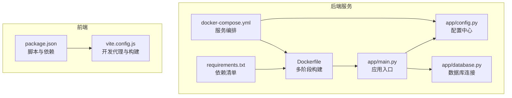
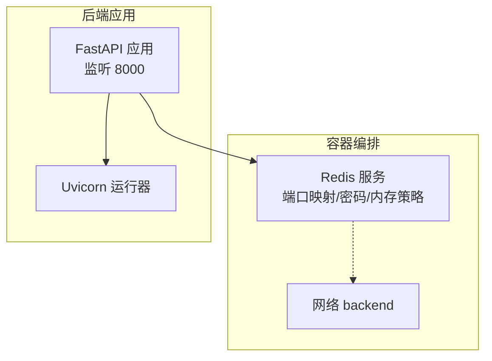
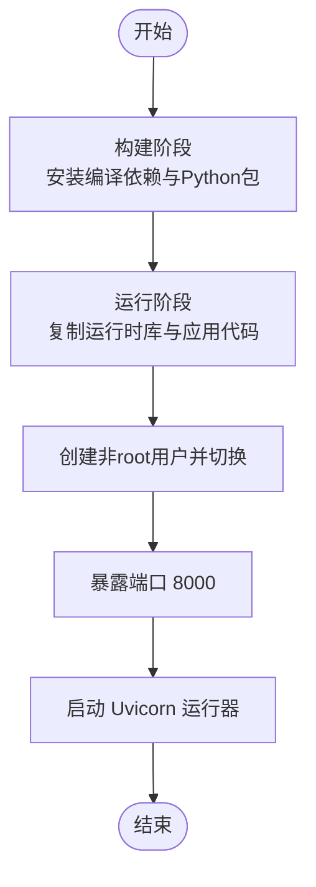
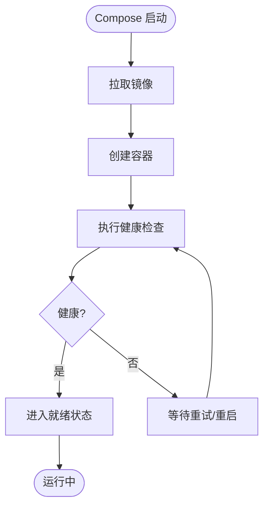
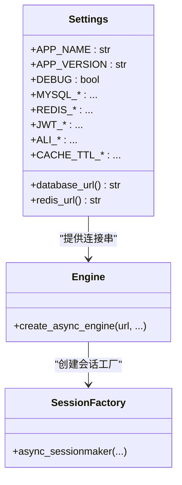
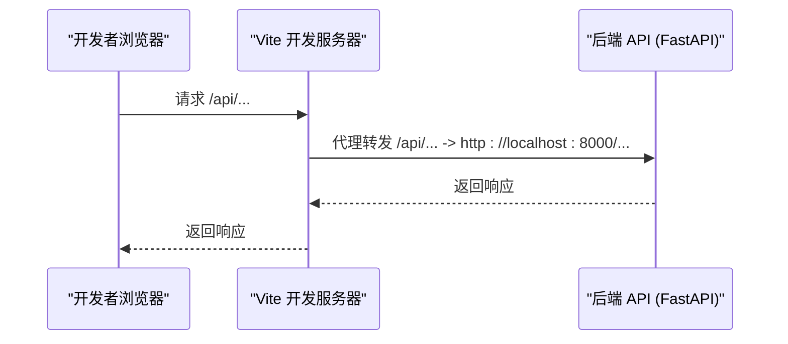
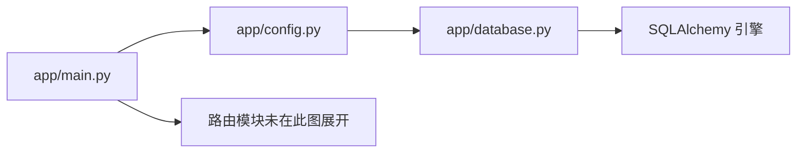

# 部署自动化

<cite>
**本文引用的文件**
- [Dockerfile](file://service/ai_assistant/Dockerfile)
- [docker-compose.yml](file://service/ai_assistant/docker-compose.yml)
- [requirements.txt](file://service/ai_assistant/requirements.txt)
- [main.py](file://service/ai_assistant/app/main.py)
- [config.py](file://service/ai_assistant/app/config.py)
- [database.py](file://service/ai_assistant/app/database.py)
- [package.json](file://frontend/ai_assistant/package.json)
- [vite.config.js](file://frontend/ai_assistant/vite.config.js)
- [README.md](file://README.md)
</cite>

## 目录
1. [简介](#简介)
2. [项目结构](#项目结构)
3. [核心组件](#核心组件)
4. [架构总览](#架构总览)
5. [详细组件分析](#详细组件分析)
6. [依赖分析](#依赖分析)
7. [性能考虑](#性能考虑)
8. [故障排查指南](#故障排查指南)
9. [结论](#结论)
10. [附录](#附录)

## 简介
本文件面向“AI校园助手”项目的部署自动化，围绕CI/CD流水线、镜像构建与推送、容器编排与多阶段部署、版本管理、蓝绿与滚动更新策略、部署脚本参数化、监控与告警、日志与故障恢复等方面，提供可落地的实践方案与参考路径。文档严格基于仓库内现有配置文件进行分析与提炼，避免臆造未在代码中出现的信息。

## 项目结构
项目采用前后端分离架构，后端基于FastAPI + Python，使用Docker与Docker Compose进行容器化与编排；前端基于Vue 3 + Vite。后端服务通过Compose定义Redis缓存服务，应用通过多阶段Dockerfile构建镜像，前端通过Vite进行开发与构建。

图表来源
- [Dockerfile:1-49](file://service/ai_assistant/Dockerfile#L1-L49)
- [docker-compose.yml:1-31](file://service/ai_assistant/docker-compose.yml#L1-L31)
- [requirements.txt:1-22](file://service/ai_assistant/requirements.txt#L1-L22)
- [main.py:1-86](file://service/ai_assistant/app/main.py#L1-L86)
- [config.py:1-113](file://service/ai_assistant/app/config.py#L1-L113)
- [database.py:1-35](file://service/ai_assistant/app/database.py#L1-L35)
- [package.json:1-24](file://frontend/ai_assistant/package.json#L1-L24)
- [vite.config.js:1-23](file://frontend/ai_assistant/vite.config.js#L1-L23)

章节来源
- [README.md:1-104](file://README.md#L1-L104)

## 核心组件
- 后端镜像构建：使用多阶段Dockerfile，第一阶段安装构建依赖并下载Python包，第二阶段仅复制运行时所需依赖与应用代码，降低镜像体积并提升安全性。
- 服务编排：通过Compose定义Redis服务，包含健康检查、资源限制与持久化卷，便于本地与生产环境快速拉起。
- 配置管理：后端使用Pydantic Settings加载.env文件，集中管理数据库、缓存、鉴权、模型参数等配置。
- 前端构建：Vite作为开发服务器与打包工具，提供代理配置以便联调后端API。

章节来源
- [Dockerfile:1-49](file://service/ai_assistant/Dockerfile#L1-L49)
- [docker-compose.yml:1-31](file://service/ai_assistant/docker-compose.yml#L1-L31)
- [config.py:1-113](file://service/ai_assistant/app/config.py#L1-L113)
- [package.json:1-24](file://frontend/ai_assistant/package.json#L1-L24)
- [vite.config.js:1-23](file://frontend/ai_assistant/vite.config.js#L1-L23)

## 架构总览
下图展示了后端服务与外部依赖的关系，以及容器编排的关键要素。

图表来源
- [docker-compose.yml:5-24](file://service/ai_assistant/docker-compose.yml#L5-L24)
- [Dockerfile:46-48](file://service/ai_assistant/Dockerfile#L46-L48)

章节来源
- [docker-compose.yml:1-31](file://service/ai_assistant/docker-compose.yml#L1-L31)
- [main.py:52-86](file://service/ai_assistant/app/main.py#L52-L86)

## 详细组件分析

### 后端镜像构建（多阶段与版本管理）
- 多阶段构建策略
  - 构建阶段：安装编译器与MySQL客户端开发包，使用国内镜像源加速APT与pip，随后将依赖安装到独立目录并清理缓存。
  - 运行阶段：仅复制构建阶段安装的Python包与应用代码，安装运行时所需的MySQL客户端库与ffmpeg，创建非root用户并以非root身份运行。
- 版本管理
  - Python基础镜像固定为3.11-slim，确保镜像与运行时一致性。
  - 依赖版本通过requirements.txt集中声明，便于锁定与升级。
- 安全与体积优化
  - 清理APT缓存与pip缓存，减少镜像层数与体积。
  - 非root用户运行，降低容器攻击面。

图表来源
- [Dockerfile:1-49](file://service/ai_assistant/Dockerfile#L1-L49)

章节来源
- [Dockerfile:1-49](file://service/ai_assistant/Dockerfile#L1-L49)
- [requirements.txt:1-22](file://service/ai_assistant/requirements.txt#L1-L22)

### 服务编排与健康检查
- Redis服务
  - 使用redis:7-alpine镜像，设置密码、最大内存与淘汰策略，启用健康检查，挂载持久化卷，加入bridge网络。
- 健康检查策略
  - 通过CLI命令周期性探测，设置间隔、超时与重试次数，便于编排层进行滚动更新与故障恢复。

图表来源
- [docker-compose.yml:18-22](file://service/ai_assistant/docker-compose.yml#L18-L22)

章节来源
- [docker-compose.yml:1-31](file://service/ai_assistant/docker-compose.yml#L1-L31)

### 配置与数据库连接
- 配置中心
  - 使用Pydantic Settings从.env文件读取配置，包含应用名称/版本、数据库、Redis、JWT、AES、隐私盐、DashScope与百炼检索参数、缓存TTL等。
  - 提供数据库URL与Redis URL工厂属性，简化连接串拼接。
- 数据库连接
  - 使用SQLAlchemy AsyncIO创建异步引擎，开启pre_ping与recycle，配置会话工厂，提供异步上下文管理器以保证会话正确释放。

图表来源
- [config.py:6-113](file://service/ai_assistant/app/config.py#L6-L113)
- [database.py:7-20](file://service/ai_assistant/app/database.py#L7-L20)

章节来源
- [config.py:1-113](file://service/ai_assistant/app/config.py#L1-L113)
- [database.py:1-35](file://service/ai_assistant/app/database.py#L1-L35)

### 前端构建与开发代理
- 构建与开发
  - package.json定义开发、构建与预览脚本，Vite作为开发服务器与打包工具。
- 开发代理
  - vite.config.js配置代理将/api前缀转发至后端HTTP地址，便于联调。

图表来源
- [package.json:6-9](file://frontend/ai_assistant/package.json#L6-L9)
- [vite.config.js:15-21](file://frontend/ai_assistant/vite.config.js#L15-L21)

章节来源
- [package.json:1-24](file://frontend/ai_assistant/package.json#L1-L24)
- [vite.config.js:1-23](file://frontend/ai_assistant/vite.config.js#L1-L23)

### CI/CD流水线与镜像推送（通用实践）
以下为通用实践建议，帮助将现有构建与编排能力纳入自动化流水线。请结合实际CI平台（如GitHub Actions、GitLab CI、Jenkins等）进行具体配置。

- 代码构建与测试
  - 前端：执行构建脚本生成静态产物，必要时运行测试脚本。
  - 后端：在构建阶段复用现有requirements.txt，确保依赖一致。
- 镜像构建与标签
  - 使用多阶段Dockerfile构建镜像，镜像标签建议采用语义化版本号或提交哈希，便于追踪。
- 镜像推送
  - 将镜像推送到容器镜像仓库（如Docker Hub、企业镜像仓库），并保留多版本标签。
- 容器部署
  - 使用Compose或Kubernetes进行部署，结合健康检查与滚动更新策略。
- 版本管理
  - 通过环境变量或配置文件指定应用版本，确保发布一致性。

[本节为通用实践说明，不直接分析具体文件，故不附“章节来源”]

### 部署策略：蓝绿部署与滚动更新
- 蓝绿部署
  - 准备两套完全相同的环境（蓝/绿），通过反向代理或编排层切换流量，实现零停机发布与快速回滚。
- 滚动更新
  - 通过编排层逐步替换容器实例，结合健康检查与超时策略，确保新旧实例平滑过渡。
- 配合健康检查
  - 利用Compose的健康检查与探针，确保新实例健康后再切换流量或停止旧实例。

[本节为通用实践说明，不直接分析具体文件，故不附“章节来源”]

### 部署脚本与参数化配置
- 参数化
  - 将环境变量（如数据库地址、Redis密码、API密钥）通过环境文件或CI平台注入，避免硬编码。
- 脚本化
  - 编写部署脚本，包含拉取镜像、停止旧容器、创建新容器、健康检查、切换流量等步骤。
- 多环境
  - 通过不同环境文件与编排文件，支持开发、测试、预发布与生产环境的差异化配置。

[本节为通用实践说明，不直接分析具体文件，故不附“章节来源”]

### 部署监控、回滚与故障恢复
- 监控与告警
  - 结合容器运行指标与应用日志，设置阈值告警；对健康检查失败、错误率上升、响应延迟等事件触发告警。
- 回滚策略
  - 通过镜像标签与编排配置快速回滚至上一个稳定版本；蓝绿部署可直接切换回绿/蓝环境。
- 故障恢复
  - 利用编排层的重启策略与健康检查，自动重启异常容器；对关键服务（如Redis）配置持久化与备份。

[本节为通用实践说明，不直接分析具体文件，故不附“章节来源”]

### 日志收集与告警配置
- 日志收集
  - 后端应用使用日志库输出结构化日志；容器标准输出与错误输出由编排层收集；可接入集中式日志系统（如ELK、Loki）。
- 告警配置
  - 基于日志与指标设置告警规则，覆盖错误率、延迟、资源使用率等关键指标。

[本节为通用实践说明，不直接分析具体文件，故不附“章节来源”]

## 依赖分析
后端应用依赖关系清晰：应用入口导入配置与路由模块，配置模块提供数据库与Redis连接串，数据库模块负责异步引擎与会话工厂。Compose定义Redis服务并与后端应用在同一网络中通信。

图表来源
- [main.py:12-14](file://service/ai_assistant/app/main.py#L12-L14)
- [config.py:85-109](file://service/ai_assistant/app/config.py#L85-L109)
- [database.py:7-20](file://service/ai_assistant/app/database.py#L7-L20)

章节来源
- [main.py:1-86](file://service/ai_assistant/app/main.py#L1-L86)
- [config.py:1-113](file://service/ai_assistant/app/config.py#L1-L113)
- [database.py:1-35](file://service/ai_assistant/app/database.py#L1-L35)

## 性能考虑
- 镜像体积与启动速度
  - 多阶段构建与清理缓存有助于减小镜像体积，缩短拉取与启动时间。
- 运行时库与媒体支持
  - 运行阶段安装MySQL客户端库与ffmpeg，满足数据库连接与多媒体处理需求。
- 数据库连接池
  - 异步引擎与连接回收策略有助于提高数据库访问效率与稳定性。
- 健康检查与资源限制
  - Redis设置最大内存与淘汰策略，避免内存溢出；Compose健康检查可配合重启策略提升可用性。

章节来源
- [Dockerfile:28-32](file://service/ai_assistant/Dockerfile#L28-L32)
- [database.py:7-20](file://service/ai_assistant/app/database.py#L7-L20)
- [docker-compose.yml:13-15](file://service/ai_assistant/docker-compose.yml#L13-L15)

## 故障排查指南
- 启动失败
  - 检查环境变量是否正确注入（如数据库密码、Redis密码、API密钥）；确认端口未被占用。
- 健康检查失败
  - 查看Redis健康检查配置与密码设置；确认容器网络互通。
- 数据库连接问题
  - 核对数据库URL构造与连接参数；检查异步引擎初始化与会话工厂配置。
- 日志定位
  - 查看应用日志输出与容器标准输出；结合错误码与堆栈信息定位问题。

章节来源
- [config.py:85-109](file://service/ai_assistant/app/config.py#L85-L109)
- [database.py:27-34](file://service/ai_assistant/app/database.py#L27-L34)
- [docker-compose.yml:18-22](file://service/ai_assistant/docker-compose.yml#L18-L22)

## 结论
本项目已具备完善的容器化与编排基础：多阶段Dockerfile、Compose服务编排、集中式配置与数据库连接。结合CI/CD流水线与健康检查，可进一步实现蓝绿/滚动等部署策略、参数化脚本与监控告警，从而形成完整的部署自动化闭环。建议在CI平台中复用现有依赖清单与构建脚本，确保前后端构建一致性与可追溯性。

## 附录
- 生产部署建议
  - 反向代理与HTTPS：建议通过Nginx/Caddy提供HTTPS与SSE流式支持，避免缓冲导致的前端渲染问题。
  - DNS与证书：为子域名申请Let’s Encrypt证书，确保生产环境的安全与合规。
- 参考路径
  - 部署步骤与HTTPS配置参考项目根目录说明文档。

章节来源
- [README.md:47-104](file://README.md#L47-L104)