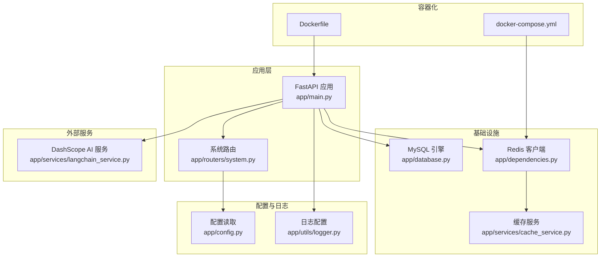
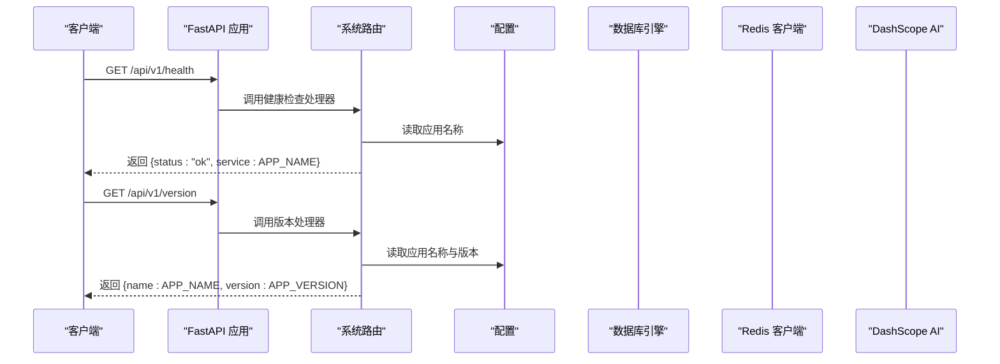
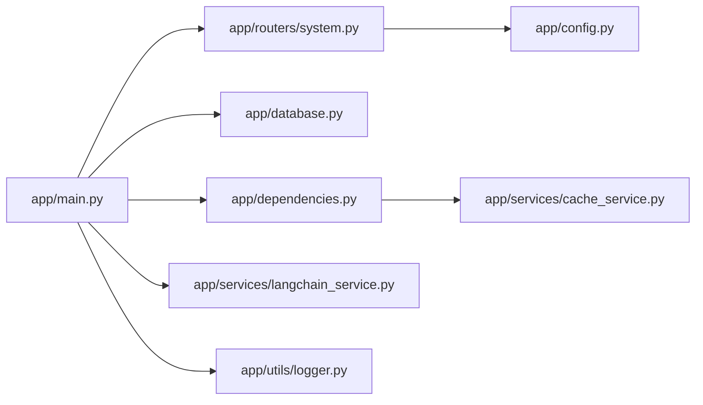

# 健康检查

<cite>
**本文引用的文件**
- [main.py](file://service/ai_assistant/app/main.py)
- [system.py](file://service/ai_assistant/app/routers/system.py)
- [config.py](file://service/ai_assistant/app/config.py)
- [database.py](file://service/ai_assistant/app/database.py)
- [dependencies.py](file://service/ai_assistant/app/dependencies.py)
- [cache_service.py](file://service/ai_assistant/app/services/cache_service.py)
- [langchain_service.py](file://service/ai_assistant/app/services/langchain_service.py)
- [logger.py](file://service/ai_assistant/app/utils/logger.py)
- [Dockerfile](file://service/ai_assistant/Dockerfile)
- [docker-compose.yml](file://service/ai_assistant/docker-compose.yml)
</cite>

## 目录
1. [简介](#简介)
2. [项目结构](#项目结构)
3. [核心组件](#核心组件)
4. [架构总览](#架构总览)
5. [详细组件分析](#详细组件分析)
6. [依赖分析](#依赖分析)
7. [性能考虑](#性能考虑)
8. [故障排查指南](#故障排查指南)
9. [结论](#结论)
10. [附录](#附录)

## 简介
本文件面向“AI校园助手”后端服务，系统化梳理健康检查系统的实现与配置，覆盖以下要点：
- 健康检查端点的实现与响应格式
- 数据库连接检查与Redis连接状态检查的现状与扩展建议
- AI服务可用性检查的现状与扩展建议
- 响应格式与状态码含义
- 容器化部署下的健康检查配置（Docker健康检查指令与Kubernetes探针）
- 自动故障检测与恢复机制的实现方案
- 如何通过健康检查进行系统状态监控与故障预警

## 项目结构
后端采用FastAPI应用，健康检查端点位于系统路由模块；数据库使用SQLAlchemy异步引擎；缓存使用Redis；AI服务通过DashScope集成。Docker与docker-compose提供容器化运行与Redis健康检查。

图表来源
- [main.py:1-86](file://service/ai_assistant/app/main.py#L1-L86)
- [system.py:1-38](file://service/ai_assistant/app/routers/system.py#L1-L38)
- [config.py:1-113](file://service/ai_assistant/app/config.py#L1-L113)
- [database.py:1-35](file://service/ai_assistant/app/database.py#L1-L35)
- [dependencies.py:1-109](file://service/ai_assistant/app/dependencies.py#L1-L109)
- [cache_service.py:1-177](file://service/ai_assistant/app/services/cache_service.py#L1-L177)
- [langchain_service.py:1-278](file://service/ai_assistant/app/services/langchain_service.py#L1-L278)
- [logger.py:1-53](file://service/ai_assistant/app/utils/logger.py#L1-L53)
- [Dockerfile:1-49](file://service/ai_assistant/Dockerfile#L1-L49)
- [docker-compose.yml:1-31](file://service/ai_assistant/docker-compose.yml#L1-L31)

章节来源
- [main.py:1-86](file://service/ai_assistant/app/main.py#L1-L86)
- [system.py:1-38](file://service/ai_assistant/app/routers/system.py#L1-L38)
- [config.py:1-113](file://service/ai_assistant/app/config.py#L1-L113)
- [database.py:1-35](file://service/ai_assistant/app/database.py#L1-L35)
- [dependencies.py:1-109](file://service/ai_assistant/app/dependencies.py#L1-L109)
- [cache_service.py:1-177](file://service/ai_assistant/app/services/cache_service.py#L1-L177)
- [langchain_service.py:1-278](file://service/ai_assistant/app/services/langchain_service.py#L1-L278)
- [logger.py:1-53](file://service/ai_assistant/app/utils/logger.py#L1-L53)
- [Dockerfile:1-49](file://service/ai_assistant/Dockerfile#L1-L49)
- [docker-compose.yml:1-31](file://service/ai_assistant/docker-compose.yml#L1-L31)

## 核心组件
- 健康检查端点：提供基础健康状态与版本信息，便于容器编排与运维监控。
- 数据库连接：使用SQLAlchemy异步引擎，具备连接池与预检查能力。
- Redis连接：通过依赖注入提供单例客户端，支持缓存读写与版本控制。
- AI服务：通过DashScope调用LLM，具备错误处理与日志记录。
- 日志系统：统一日志输出，便于问题定位与健康检查关联分析。

章节来源
- [system.py:1-38](file://service/ai_assistant/app/routers/system.py#L1-L38)
- [database.py:1-35](file://service/ai_assistant/app/database.py#L1-L35)
- [dependencies.py:1-109](file://service/ai_assistant/app/dependencies.py#L1-L109)
- [langchain_service.py:1-278](file://service/ai_assistant/app/services/langchain_service.py#L1-L278)
- [logger.py:1-53](file://service/ai_assistant/app/utils/logger.py#L1-L53)

## 架构总览
健康检查在应用启动阶段完成基本初始化，系统路由提供健康与版本端点；数据库与Redis作为基础设施依赖；AI服务通过DashScope提供语言模型能力。Docker与docker-compose负责容器化运行与Redis健康检查。

图表来源
- [system.py:1-38](file://service/ai_assistant/app/routers/system.py#L1-L38)
- [config.py:1-113](file://service/ai_assistant/app/config.py#L1-L113)

## 详细组件分析

### 健康检查端点实现
- 端点路径：/api/v1/health 与 /api/v1/version
- 响应模型：
  - 健康检查：包含状态与服务名字段
  - 版本信息：包含应用名与版本号字段
- 实现位置：系统路由模块
- 扩展建议：
  - 数据库连接检查：在处理器内发起一次轻量查询或连接池校验
  - Redis连接检查：尝试PING或GET操作
  - AI服务可用性检查：调用DashScope的最小成本接口并捕获异常
  - 统一响应：增加子系统状态数组，便于分项诊断

章节来源
- [system.py:1-38](file://service/ai_assistant/app/routers/system.py#L1-L38)

### 数据库连接检查
- 连接方式：SQLAlchemy异步引擎，启用连接池预检查与回收策略
- 会话管理：异步上下文生成器，确保会话正确关闭
- 健康检查扩展思路：
  - 在健康检查处理器中执行一次简单查询（如SELECT 1）
  - 将异常映射为非健康状态并记录日志
  - 可结合连接池状态统计进行更细粒度评估

章节来源
- [database.py:1-35](file://service/ai_assistant/app/database.py#L1-L35)

### Redis连接状态检查
- 客户端获取：依赖注入提供单例Redis客户端
- 健康检查扩展思路：
  - 在健康检查处理器中执行PING命令
  - 对于带密码的实例，确保凭据正确传递
  - 可结合缓存服务中的键操作进行读写测试
- 现状：应用侧未在健康检查中直接验证Redis，但提供了客户端与缓存服务

章节来源
- [dependencies.py:1-109](file://service/ai_assistant/app/dependencies.py#L1-L109)
- [cache_service.py:1-177](file://service/ai_assistant/app/services/cache_service.py#L1-L177)

### AI服务可用性检查
- 能力范围：通过DashScope调用多种模型，具备输入裁剪与流式输出能力
- 错误处理：对非200状态抛出异常并记录错误日志
- 健康检查扩展思路：
  - 在健康检查处理器中调用最小成本模型接口（如快速推理）
  - 捕获网络/鉴权/配额等异常并映射为具体子状态
  - 可区分“服务可达但不可用”和“服务不可达”的不同状态

章节来源
- [langchain_service.py:1-278](file://service/ai_assistant/app/services/langchain_service.py#L1-L278)

### 响应格式与状态码含义
- 健康检查响应格式（当前）：
  - 字段：status（字符串），service（字符串）
  - 示例：{"status":"ok","service":"AI 校园助手"}
- 版本信息响应格式（当前）：
  - 字段：name（字符串），version（字符串）
  - 示例：{"name":"AI 校园助手","version":"1.0.0"}
- 状态码：
  - 健康检查端点返回标准HTTP 200；若扩展为多子系统检查，可考虑使用200表示整体健康，子系统异常在响应体中标注
  - 若出现严重异常，建议返回5xx以触发编排层面的重启/告警

章节来源
- [system.py:1-38](file://service/ai_assistant/app/routers/system.py#L1-L38)

### 容器化部署健康检查配置

#### Docker健康检查指令
- 当前Dockerfile未定义应用层健康检查，仅提供运行命令
- 建议在Dockerfile中添加HEALTHCHECK指令，指向应用内部健康端点
- 示例思路（不展示具体命令）：
  - 使用curl或wget访问 /api/v1/health
  - 设置间隔、超时与重试次数，与编排平台保持一致
  - 结合环境变量配置目标主机与端口

章节来源
- [Dockerfile:1-49](file://service/ai_assistant/Dockerfile#L1-L49)

#### Kubernetes探针配置
- 建议使用HTTPGet探针，目标为 /api/v1/health
- 探针参数建议：
  - initialDelaySeconds：启动后延迟探测时间
  - periodSeconds：探测周期
  - timeoutSeconds：单次探测超时
  - failureThreshold：连续失败阈值
- 可选：livenessProbe与readinessProbe分离，readinessProbe失败时停止接收流量，livenessProbe失败时触发重启

章节来源
- [system.py:1-38](file://service/ai_assistant/app/routers/system.py#L1-L38)

#### docker-compose健康检查
- 当前compose文件为Redis提供健康检查（redis-cli ping）
- 建议为应用服务添加健康检查（HTTP探针），指向 /api/v1/health
- 参数与Kubernetes一致，便于多环境一致性

章节来源
- [docker-compose.yml:1-31](file://service/ai_assistant/docker-compose.yml#L1-L31)

### 自动故障检测与恢复机制实现方案
- 健康检查扩展（多子系统）：
  - 数据库：连接池预检查 + 轻量查询
  - Redis：PING + 关键键读写
  - AI服务：最小成本模型调用 + 超时控制
  - 统一聚合：将各子系统状态汇总到响应体
- 自动恢复：
  - 应用层：健康检查失败时记录日志并触发资源重建（重启容器）
  - 缓存层：Redis异常时清空/重建连接池
  - 数据层：数据库异常时重试与降级（只读/只缓存）
- 告警联动：
  - 健康检查失败达到阈值后触发告警
  - 日志系统记录失败原因与时间戳，便于回溯

章节来源
- [system.py:1-38](file://service/ai_assistant/app/routers/system.py#L1-L38)
- [database.py:1-35](file://service/ai_assistant/app/database.py#L1-L35)
- [dependencies.py:1-109](file://service/ai_assistant/app/dependencies.py#L1-L109)
- [cache_service.py:1-177](file://service/ai_assistant/app/services/cache_service.py#L1-L177)
- [langchain_service.py:1-278](file://service/ai_assistant/app/services/langchain_service.py#L1-L278)
- [logger.py:1-53](file://service/ai_assistant/app/utils/logger.py#L1-L53)

### 系统状态监控与故障预警
- 监控指标：
  - 健康检查成功率
  - 子系统可用性（数据库/Redis/AI服务）
  - 响应时间与错误率
- 预警规则：
  - 连续N次健康检查失败触发告警
  - AI服务错误率超过阈值触发告警
- 日志关联：
  - 健康检查失败与日志中的错误堆栈关联，便于快速定位

章节来源
- [logger.py:1-53](file://service/ai_assistant/app/utils/logger.py#L1-L53)

## 依赖分析
- 应用启动与生命周期：应用初始化、CORS配置、路由注册、Redis连接池关闭
- 路由依赖：系统路由依赖配置读取
- 数据层依赖：数据库引擎与会话管理
- 缓存依赖：Redis客户端与缓存服务
- AI服务依赖：DashScope SDK与请求会话

图表来源
- [main.py:1-86](file://service/ai_assistant/app/main.py#L1-L86)
- [system.py:1-38](file://service/ai_assistant/app/routers/system.py#L1-L38)
- [config.py:1-113](file://service/ai_assistant/app/config.py#L1-L113)
- [database.py:1-35](file://service/ai_assistant/app/database.py#L1-L35)
- [dependencies.py:1-109](file://service/ai_assistant/app/dependencies.py#L1-L109)
- [cache_service.py:1-177](file://service/ai_assistant/app/services/cache_service.py#L1-L177)
- [langchain_service.py:1-278](file://service/ai_assistant/app/services/langchain_service.py#L1-L278)
- [logger.py:1-53](file://service/ai_assistant/app/utils/logger.py#L1-L53)

## 性能考虑
- 健康检查应尽量轻量化，避免阻塞主业务线程
- 数据库与Redis检查建议使用连接池预检查，减少实际IO
- AI服务检查应设置合理超时，避免拖慢整体健康检查
- 日志级别与落盘策略需平衡可观测性与性能

## 故障排查指南
- 健康检查返回非200或异常：
  - 检查应用日志，定位具体子系统失败原因
  - 确认配置文件中的数据库与Redis地址、端口、密码是否正确
- 数据库连接失败：
  - 检查数据库服务状态与网络连通性
  - 查看连接池配置与回收策略
- Redis连接失败：
  - 检查Redis服务状态与密码
  - 确认网络策略与防火墙
- AI服务异常：
  - 检查API密钥与配额
  - 关注网络代理与超时设置

章节来源
- [logger.py:1-53](file://service/ai_assistant/app/utils/logger.py#L1-L53)
- [config.py:1-113](file://service/ai_assistant/app/config.py#L1-L113)
- [langchain_service.py:1-278](file://service/ai_assistant/app/services/langchain_service.py#L1-L278)

## 结论
当前系统已具备基础健康检查端点与版本信息端点，数据库与Redis连接均已在应用中启用。建议在健康检查中扩展数据库、Redis与AI服务的子系统检查，并在容器编排中配置应用层健康检查与探针，以实现自动故障检测与恢复，配合日志与告警体系，构建完善的系统可观测性。

## 附录

### 健康检查端点定义（路径与响应）
- GET /api/v1/health
  - 响应字段：status（字符串），service（字符串）
  - 示例：{"status":"ok","service":"AI 校园助手"}
- GET /api/v1/version
  - 响应字段：name（字符串），version（字符串）
  - 示例：{"name":"AI 校园助手","version":"1.0.0"}

章节来源
- [system.py:1-38](file://service/ai_assistant/app/routers/system.py#L1-L38)

### 配置项参考（与健康检查相关）
- 数据库连接URL：由配置类动态拼接
- Redis连接URL：支持带/不带密码
- CORS允许来源：影响跨域健康检查访问

章节来源
- [config.py:1-113](file://service/ai_assistant/app/config.py#L1-L113)