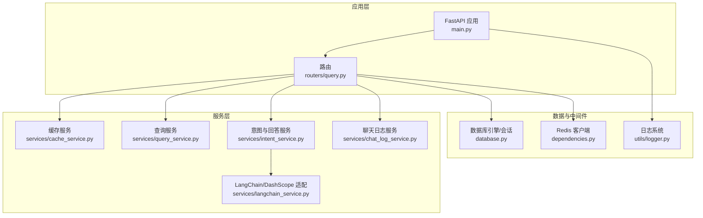
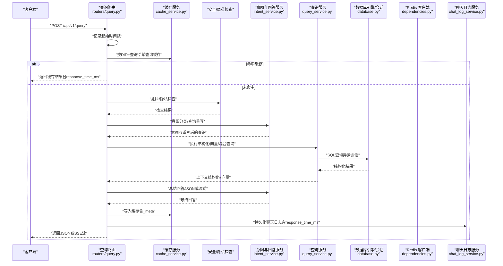
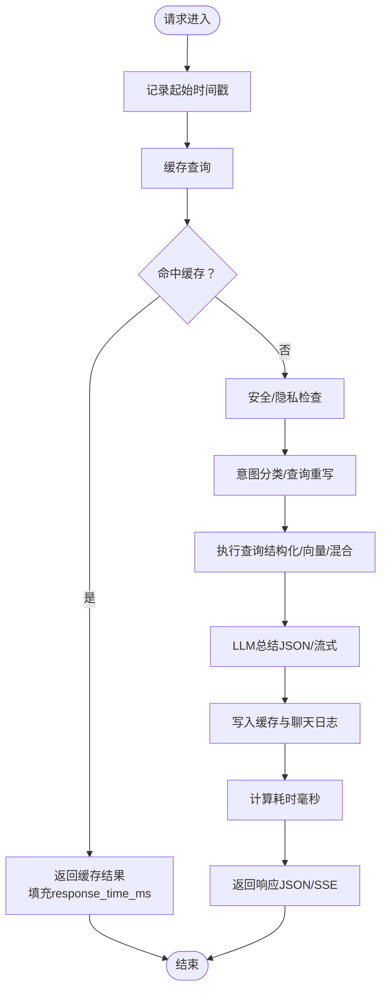
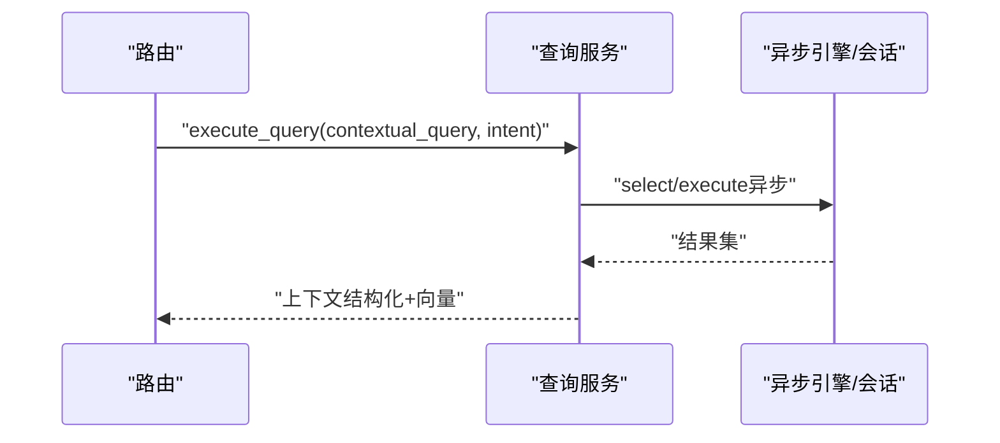
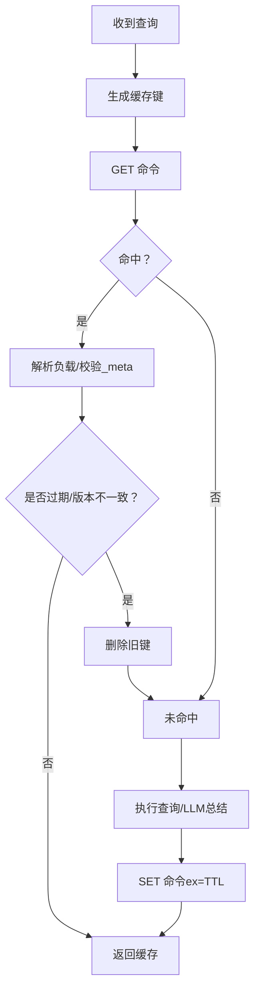
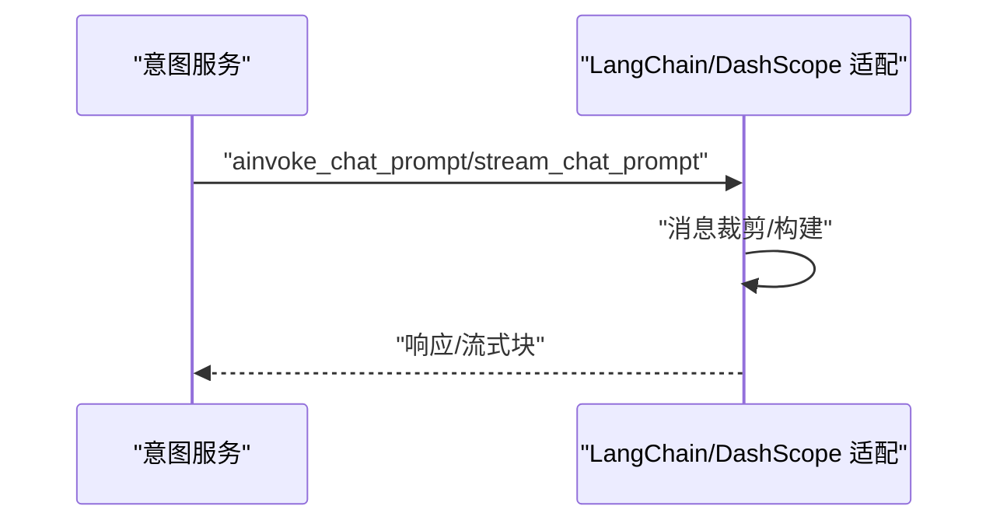
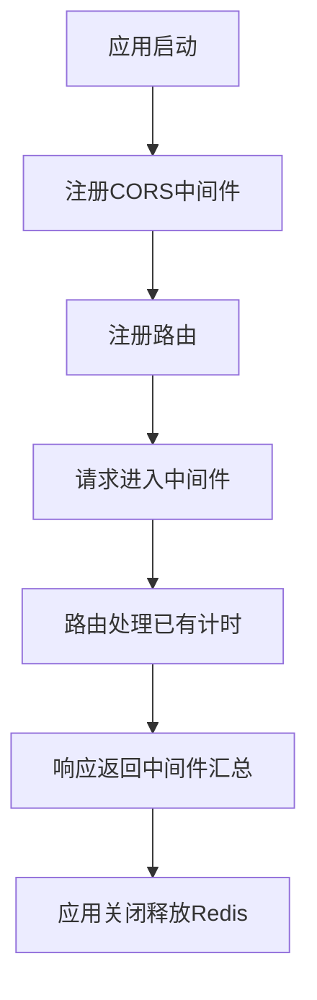
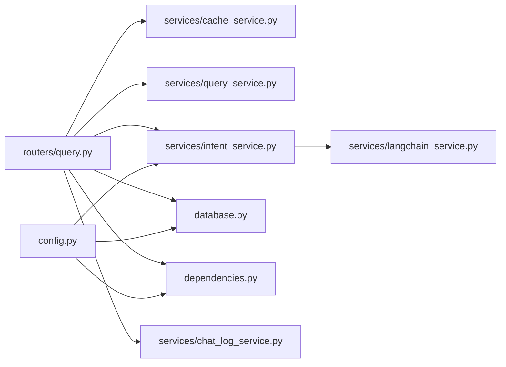

# 性能监控

<cite>
**本文引用的文件**
- [app/main.py](file://service/ai_assistant/app/main.py)
- [app/config.py](file://service/ai_assistant/app/config.py)
- [app/database.py](file://service/ai_assistant/app/database.py)
- [app/utils/logger.py](file://service/ai_assistant/app/utils/logger.py)
- [app/dependencies.py](file://service/ai_assistant/app/dependencies.py)
- [app/routers/query.py](file://service/ai_assistant/app/routers/query.py)
- [app/services/cache_service.py](file://service/ai_assistant/app/services/cache_service.py)
- [app/services/query_service.py](file://service/ai_assistant/app/services/query_service.py)
- [app/services/langchain_service.py](file://service/ai_assistant/app/services/langchain_service.py)
- [app/services/intent_service.py](file://service/ai_assistant/app/services/intent_service.py)
- [app/services/chat_log_service.py](file://service/ai_assistant/app/services/chat_log_service.py)
- [app/schemas/query.py](file://service/ai_assistant/app/schemas/query.py)
</cite>

## 目录
1. [简介](#简介)
2. [项目结构](#项目结构)
3. [核心组件](#核心组件)
4. [架构总览](#架构总览)
5. [详细组件分析](#详细组件分析)
6. [依赖分析](#依赖分析)
7. [性能考量](#性能考量)
8. [故障排查指南](#故障排查指南)
9. [结论](#结论)
10. [附录](#附录)

## 简介
本文件面向“AI校园助手”项目，系统化阐述如何在FastAPI应用中建立性能监控体系，覆盖API响应时间、数据库查询执行时间、缓存命中率、Redis连接与使用情况等关键指标，并提供在现有代码基础上集成性能监控中间件、采集与上报性能数据、识别性能瓶颈与优化建议、设置阈值与告警、以及性能数据可视化的方法。

## 项目结构
本项目采用FastAPI + SQLAlchemy异步ORM + Redis异步客户端的典型后端架构。核心模块包括：
- 应用入口与生命周期：FastAPI应用、CORS中间件、路由注册、生命周期钩子
- 配置中心：数据库、Redis、LLM模型、缓存TTL等配置
- 数据层：异步引擎与会话工厂、基础模型与上下文管理
- 服务层：缓存服务、查询服务、意图与回答服务、媒体服务、安全与隐私服务、聊天日志服务
- 路由层：统一查询接口，串联各服务并产出性能度量
- 日志与监控：统一日志配置，便于采集与可视化

图表来源
- [app/main.py:52-86](file://service/ai_assistant/app/main.py#L52-L86)
- [app/routers/query.py:198-745](file://service/ai_assistant/app/routers/query.py#L198-L745)
- [app/dependencies.py:36-51](file://service/ai_assistant/app/dependencies.py#L36-L51)
- [app/database.py:7-20](file://service/ai_assistant/app/database.py#L7-L20)
- [app/utils/logger.py:17-46](file://service/ai_assistant/app/utils/logger.py#L17-L46)

章节来源
- [app/main.py:1-86](file://service/ai_assistant/app/main.py#L1-L86)
- [app/config.py:1-113](file://service/ai_assistant/app/config.py#L1-L113)
- [app/database.py:1-35](file://service/ai_assistant/app/database.py#L1-L35)
- [app/utils/logger.py:1-53](file://service/ai_assistant/app/utils/logger.py#L1-L53)
- [app/dependencies.py:1-109](file://service/ai_assistant/app/dependencies.py#L1-L109)

## 核心组件
- 应用入口与生命周期：负责应用初始化、CORS配置、路由注册、Redis连接池生命周期管理
- 配置中心：集中管理数据库URL、Redis URL、LLM模型、缓存TTL、跨域白名单等
- 数据库层：异步SQLAlchemy引擎与会话工厂，支持连接池预ping与回收
- 服务层：
  - 缓存服务：基于Redis的键空间设计、敏感性与日期/课表版本守卫、TTL策略
  - 查询服务：结构化SQL查询、向量检索、混合检索、工具规划与重排
  - 意图与回答服务：意图分类、查询重写、上下文裁剪与LLM总结
  - LangChain/DashScope适配：消息构建、调用与流式输出、输入裁剪
  - 聊天日志服务：记录响应耗时、隐私与危险标记
- 路由层：统一查询端点，贯穿缓存、安全、意图、查询、总结、缓存写回与日志持久化
- 日志系统：统一输出到控制台与文件，便于采集与可视化

章节来源
- [app/main.py:36-49](file://service/ai_assistant/app/main.py#L36-L49)
- [app/config.py:85-110](file://service/ai_assistant/app/config.py#L85-L110)
- [app/database.py:7-20](file://service/ai_assistant/app/database.py#L7-L20)
- [app/services/cache_service.py:49-176](file://service/ai_assistant/app/services/cache_service.py#L49-L176)
- [app/services/query_service.py:240-248](file://service/ai_assistant/app/services/query_service.py#L240-L248)
- [app/services/langchain_service.py:139-203](file://service/ai_assistant/app/services/langchain_service.py#L139-L203)
- [app/services/intent_service.py:218-248](file://service/ai_assistant/app/services/intent_service.py#L218-L248)
- [app/services/chat_log_service.py:14-55](file://service/ai_assistant/app/services/chat_log_service.py#L14-L55)
- [app/routers/query.py:207-745](file://service/ai_assistant/app/routers/query.py#L207-L745)
- [app/utils/logger.py:17-46](file://service/ai_assistant/app/utils/logger.py#L17-L46)

## 架构总览
下图展示了从客户端请求到响应返回的关键路径，以及性能度量的落点：

图表来源
- [app/routers/query.py:207-745](file://service/ai_assistant/app/routers/query.py#L207-L745)
- [app/services/cache_service.py:92-176](file://service/ai_assistant/app/services/cache_service.py#L92-L176)
- [app/services/intent_service.py:218-346](file://service/ai_assistant/app/services/intent_service.py#L218-L346)
- [app/services/query_service.py:575-800](file://service/ai_assistant/app/services/query_service.py#L575-L800)
- [app/database.py:27-35](file://service/ai_assistant/app/database.py#L27-L35)
- [app/dependencies.py:36-51](file://service/ai_assistant/app/dependencies.py#L36-L51)
- [app/services/chat_log_service.py:14-55](file://service/ai_assistant/app/services/chat_log_service.py#L14-L55)

## 详细组件分析

### API响应时间监控
- 起点：路由层在请求进入时记录起始时间戳，贯穿整个处理链路
- 终点：在返回JSON与SSE流的分支分别计算并填充响应耗时字段
- 指标落点：QueryResponse.response_time_ms、SSE数据包中的response_time_ms字段
- 采集建议：将上述耗时作为“请求总耗时”指标，结合路由路径、意图类型、是否命中缓存进行分桶聚合

图表来源
- [app/routers/query.py:213-312](file://service/ai_assistant/app/routers/query.py#L213-L312)
- [app/routers/query.py:582-745](file://service/ai_assistant/app/routers/query.py#L582-L745)

章节来源
- [app/routers/query.py:213-312](file://service/ai_assistant/app/routers/query.py#L213-L312)
- [app/routers/query.py:582-745](file://service/ai_assistant/app/routers/query.py#L582-L745)
- [app/schemas/query.py:26-32](file://service/ai_assistant/app/schemas/query.py#L26-L32)

### 数据库查询性能监控
- 引擎与会话：使用异步SQLAlchemy引擎，开启pool_pre_ping与pool_recycle，有助于连接健康与回收
- 查询执行：查询服务内封装结构化SQL查询，按意图与上下文动态拼装
- 监控建议：
  - 在查询服务中对每个SQL执行点打点，记录执行耗时与参数片段
  - 对慢查询阈值报警（如>500ms），并记录SQL与绑定参数
  - 结合数据库侧慢查询日志与连接池状态（活跃/空闲连接数）

图表来源
- [app/services/query_service.py:575-800](file://service/ai_assistant/app/services/query_service.py#L575-L800)
- [app/database.py:7-20](file://service/ai_assistant/app/database.py#L7-L20)

章节来源
- [app/database.py:7-20](file://service/ai_assistant/app/database.py#L7-L20)
- [app/services/query_service.py:575-800](file://service/ai_assistant/app/services/query_service.py#L575-L800)

### 缓存命中率与Redis使用监控
- 键空间设计：基于版本号、DID与查询哈希生成键，支持敏感性与日期/课表版本守卫
- 命中策略：优先缓存，命中则直接返回；未命中时才执行查询与LLM总结
- 监控建议：
  - 统计“缓存命中/未命中/过期/清理”事件，计算命中率
  - 记录敏感性分布（敏感/普通）与TTL使用情况
  - 监控Redis连接池状态（连接数、命令QPS、内存使用、阻塞事件）

图表来源
- [app/services/cache_service.py:49-176](file://service/ai_assistant/app/services/cache_service.py#L49-L176)

章节来源
- [app/services/cache_service.py:49-176](file://service/ai_assistant/app/services/cache_service.py#L49-L176)
- [app/dependencies.py:36-51](file://service/ai_assistant/app/dependencies.py#L36-L51)

### AI服务调用延迟监控
- LangChain适配：统一消息构建、调用与流式输出，支持输入裁剪与超时控制
- 监控建议：
  - 记录每次LLM调用的开始/结束时间、模型、温度、最大tokens、消息数量
  - 统计流式输出的首字节延迟（TTFT）与吞吐（字/秒）
  - 对调用失败（状态码非200）进行告警

图表来源
- [app/services/langchain_service.py:139-203](file://service/ai_assistant/app/services/langchain_service.py#L139-L203)
- [app/services/intent_service.py:298-346](file://service/ai_assistant/app/services/intent_service.py#L298-L346)

章节来源
- [app/services/langchain_service.py:139-203](file://service/ai_assistant/app/services/langchain_service.py#L139-L203)
- [app/services/intent_service.py:298-346](file://service/ai_assistant/app/services/intent_service.py#L298-L346)

### 请求生命周期与中间件集成
- 应用生命周期：在lifespan中进行启动/关闭处理，关闭时释放Redis连接池
- 中间件：当前使用CORS中间件；可扩展自定义性能中间件（如请求计时、速率限制、熔断）
- 建议：
  - 自定义中间件在请求进入时打点，在响应发送后汇总耗时
  - 与现有路由层计时互补，形成“中间件层+路由层”的双计时

图表来源
- [app/main.py:52-86](file://service/ai_assistant/app/main.py#L52-L86)
- [app/main.py:36-49](file://service/ai_assistant/app/main.py#L36-L49)

章节来源
- [app/main.py:52-86](file://service/ai_assistant/app/main.py#L52-L86)
- [app/main.py:36-49](file://service/ai_assistant/app/main.py#L36-L49)

## 依赖分析
- 路由依赖服务：缓存、查询、意图、媒体、安全、聊天日志
- 服务依赖外部：数据库（SQLAlchemy异步）、Redis（aioredis）、DashScope（LangChain适配）
- 配置依赖：Settings集中管理数据库URL、Redis URL、LLM模型、缓存TTL

图表来源
- [app/routers/query.py:35-42](file://service/ai_assistant/app/routers/query.py#L35-L42)
- [app/config.py:85-110](file://service/ai_assistant/app/config.py#L85-L110)

章节来源
- [app/routers/query.py:35-42](file://service/ai_assistant/app/routers/query.py#L35-L42)
- [app/config.py:85-110](file://service/ai_assistant/app/config.py#L85-L110)

## 性能考量
- API响应时间
  - 优化点：缓存优先、并发任务（安全检查、查询重写）并行、流式输出提前释放数据库连接
  - 建议：对热点查询增加缓存预热，缩短冷启动时间
- 数据库查询
  - 优化点：合理索引、参数化查询、批量操作、连接池健康检查
  - 建议：对慢查询SQL建立基线，定期审查执行计划
- 缓存与Redis
  - 优化点：键空间设计清晰、TTL合理、敏感性与版本守卫
  - 建议：监控连接池饱和度与阻塞事件，适时扩容
- AI服务调用
  - 优化点：消息裁剪、温度与tokens控制、流式输出
  - 建议：对LLM调用失败进行重试与降级，记录失败原因

[本节为通用性能指导，不直接分析具体文件]

## 故障排查指南
- Redis异常
  - 现象：缓存查询失败，路由降级到数据库
  - 排查：检查Redis连接URL、密码、网络连通性；查看日志中的异常堆栈
- 数据库异常
  - 现象：查询执行失败，返回502
  - 排查：确认连接池状态、SQL语法与权限、慢查询日志
- LLM调用异常
  - 现象：总结失败或流式中断
  - 排查：检查API Key、模型参数、网络代理设置、响应状态码
- 日志与指标
  - 建议：统一使用日志系统输出结构化信息，便于采集与可视化

章节来源
- [app/routers/query.py:283-286](file://service/ai_assistant/app/routers/query.py#L283-L286)
- [app/services/langchain_service.py:189-203](file://service/ai_assistant/app/services/langchain_service.py#L189-L203)
- [app/utils/logger.py:17-46](file://service/ai_assistant/app/utils/logger.py#L17-L46)

## 结论
通过在路由层与服务层埋点、利用现有日志系统与配置中心，可以低成本地实现API响应时间、数据库查询、缓存命中率与Redis使用情况的监控。建议进一步引入自定义中间件与指标采集组件，完善阈值与告警机制，并结合可视化面板持续跟踪系统性能趋势。

[本节为总结性内容，不直接分析具体文件]

## 附录

### 关键性能指标定义与采集方法
- API响应时间
  - 定义：从请求进入至响应返回的总耗时
  - 采集：路由层记录起始时间戳，返回时计算并填充响应对象
  - 参考路径：[app/routers/query.py:213-312](file://service/ai_assistant/app/routers/query.py#L213-L312)、[app/routers/query.py:582-745](file://service/ai_assistant/app/routers/query.py#L582-L745)
- 查询执行时间
  - 定义：数据库SQL执行与向量检索的耗时
  - 采集：在查询服务中对关键SQL与检索步骤打点
  - 参考路径：[app/services/query_service.py:575-800](file://service/ai_assistant/app/services/query_service.py#L575-L800)
- 缓存命中率
  - 定义：命中次数 / 总请求次数
  - 采集：统计缓存查询的命中/未命中/过期/清理事件
  - 参考路径：[app/services/cache_service.py:92-176](file://service/ai_assistant/app/services/cache_service.py#L92-L176)
- Redis连接数
  - 定义：活跃连接数、阻塞事件、命令QPS
  - 采集：通过Redis INFO命令或客户端连接池统计
  - 参考路径：[app/dependencies.py:36-51](file://service/ai_assistant/app/dependencies.py#L36-L51)

### 集成性能监控中间件与数据上报
- 中间件建议：自定义中间件在请求进入时打点，在响应发送后汇总耗时并上报
- 数据上报：将指标写入日志或推送至指标系统（如Prometheus Pushgateway、OpenTelemetry）
- 配置中心：通过Settings集中管理监控开关与上报地址

章节来源
- [app/main.py:52-86](file://service/ai_assistant/app/main.py#L52-L86)
- [app/config.py:85-110](file://service/ai_assistant/app/config.py#L85-L110)

### 数据库查询性能监控方案
- 执行点打点：在每个SQL执行处记录开始/结束时间与参数片段
- 慢查询阈值：对超过阈值的查询报警并记录上下文
- 连接池监控：关注活跃/空闲连接数与等待队列长度

章节来源
- [app/services/query_service.py:575-800](file://service/ai_assistant/app/services/query_service.py#L575-L800)
- [app/database.py:7-20](file://service/ai_assistant/app/database.py#L7-L20)

### AI服务调用延迟监控方案
- 调用打点：记录开始/结束时间、模型、温度、tokens、消息数量
- 流式监控：统计首字节延迟与吞吐
- 失败告警：对非200状态码与异常进行告警

章节来源
- [app/services/langchain_service.py:139-203](file://service/ai_assistant/app/services/langchain_service.py#L139-L203)
- [app/services/intent_service.py:298-346](file://service/ai_assistant/app/services/intent_service.py#L298-L346)

### 性能瓶颈识别与优化建议
- 瓶颈识别：通过指标面板观察热点端点、慢查询、缓存命中率与Redis阻塞
- 优化建议：缓存预热、连接池扩容、SQL索引优化、LLM参数调优、流式输出提前释放资源

[本节为通用指导，不直接分析具体文件]

### 性能阈值与告警机制
- 阈值建议：API响应时间（P95/P99）、慢查询（>500ms）、缓存命中率（<80%）、Redis阻塞事件
- 告警渠道：邮件/IM通知，结合日志与指标系统

[本节为通用指导，不直接分析具体文件]

### 性能数据可视化展示
- 指标面板：请求总量、成功率、响应时间分布、慢查询TopN、缓存命中率、Redis连接数
- 展示建议：结合日志系统与指标系统，形成多维度仪表板

[本节为通用指导，不直接分析具体文件]