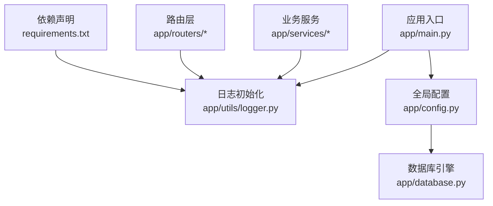
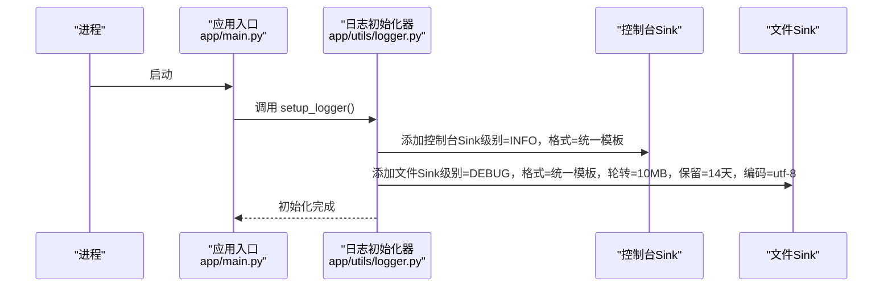
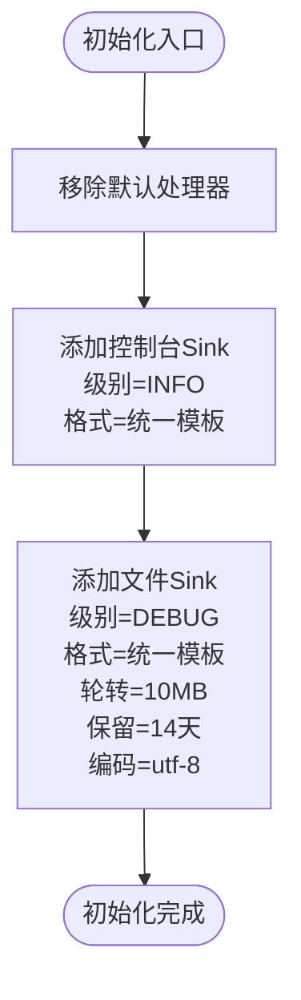
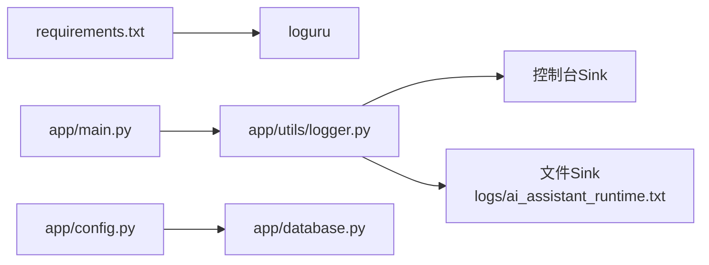

# 日志管理

<cite>
**本文引用的文件**
- [logger.py](file://service/ai_assistant/app/utils/logger.py)
- [main.py](file://service/ai_assistant/app/main.py)
- [config.py](file://service/ai_assistant/app/config.py)
- [database.py](file://service/ai_assistant/app/database.py)
- [requirements.txt](file://service/ai_assistant/requirements.txt)
- [chat_log_service.py](file://service/ai_assistant/app/services/chat_log_service.py)
- [cache_service.py](file://service/ai_assistant/app/services/cache_service.py)
- [query.py](file://service/ai_assistant/app/routers/query.py)
- [admin.py](file://service/ai_assistant/app/routers/admin.py)
</cite>

## 目录
1. [简介](#简介)
2. [项目结构](#项目结构)
3. [核心组件](#核心组件)
4. [架构总览](#架构总览)
5. [详细组件分析](#详细组件分析)
6. [依赖分析](#依赖分析)
7. [性能考虑](#性能考虑)
8. [故障排查指南](#故障排查指南)
9. [结论](#结论)
10. [附录](#附录)

## 简介
本文件面向“AI校园助手”项目的日志管理，基于 Loguru 提供统一的日志配置与使用规范。系统采用“控制台输出 + 文件落盘”的双重输出策略，文件格式为纯文本，按大小与时间进行轮转，便于在开发、测试与生产环境下进行问题定位、行为审计与运行状态监控。

## 项目结构
日志系统的核心配置集中在后端 Python 服务中，主要涉及以下文件：
- 日志初始化与配置：app/utils/logger.py
- 应用入口：app/main.py
- 全局配置：app/config.py（含 DEBUG 开关）
- 数据库引擎配置：app/database.py（受 DEBUG 影响）
- 依赖声明：requirements.txt（包含 loguru）
- 业务模块日志使用示例：app/services/* 与 app/routers/*

图表来源
- [main.py:1-86](file://service/ai_assistant/app/main.py#L1-L86)
- [logger.py:1-53](file://service/ai_assistant/app/utils/logger.py#L1-L53)
- [config.py:1-113](file://service/ai_assistant/app/config.py#L1-L113)
- [database.py:1-35](file://service/ai_assistant/app/database.py#L1-L35)
- [requirements.txt:1-22](file://service/ai_assistant/requirements.txt#L1-L22)

章节来源
- [main.py:1-86](file://service/ai_assistant/app/main.py#L1-L86)
- [logger.py:1-53](file://service/ai_assistant/app/utils/logger.py#L1-L53)
- [config.py:1-113](file://service/ai_assistant/app/config.py#L1-L113)
- [database.py:1-35](file://service/ai_assistant/app/database.py#L1-L35)
- [requirements.txt:1-22](file://service/ai_assistant/requirements.txt#L1-L22)

## 核心组件
- 统一日志初始化器：负责移除默认处理器、添加控制台与文件两个 Sink，并设置级别、格式、轮转与保留策略。
- 应用入口集成：在应用启动时调用初始化器，确保全局日志可用。
- 配置联动：DEBUG 开关影响 SQL 层回显；日志文件位于项目根 logs 目录下，文件名固定。
- 业务模块使用：各服务与路由广泛使用 info/warning/error/exception/debug 等级别进行事件记录。

章节来源
- [logger.py:17-47](file://service/ai_assistant/app/utils/logger.py#L17-L47)
- [main.py:13-16](file://service/ai_assistant/app/main.py#L13-L16)
- [config.py:16](file://service/ai_assistant/app/config.py#L16)
- [database.py:11](file://service/ai_assistant/app/database.py#L11)

## 架构总览
日志系统在进程启动时完成初始化，随后所有模块共享同一 Logger 实例。控制台 Sink 输出 INFO 及以上级别，文件 Sink 输出 DEBUG 及以上级别，二者共用统一格式模板。

图表来源
- [main.py:13-16](file://service/ai_assistant/app/main.py#L13-L16)
- [logger.py:28-43](file://service/ai_assistant/app/utils/logger.py#L28-L43)

## 详细组件分析

### 日志初始化器（Loguru）
- 双 Sink 配置
  - 控制台 Sink：级别 INFO，输出到标准输出，便于本地开发与实时观察。
  - 文件 Sink：级别 DEBUG，输出到项目根 logs/ai_assistant_runtime.txt，启用大小轮转与时间保留。
- 格式模板：包含时间、级别、模块名:函数名:行号、消息体，便于快速定位。
- 编码与轮转：UTF-8 编码，单文件最大 10MB，保留最近 14 天的历史文件。
- 幂等初始化：内部维护标记，避免重复配置。

图表来源
- [logger.py:28-43](file://service/ai_assistant/app/utils/logger.py#L28-L43)

章节来源
- [logger.py:17-47](file://service/ai_assistant/app/utils/logger.py#L17-L47)

### 应用入口集成
- 在应用启动阶段调用日志初始化器，确保后续模块导入时即可使用全局 Logger。
- 启动与关闭生命周期中记录关键事件，便于追踪服务状态。

章节来源
- [main.py:13-16](file://service/ai_assistant/app/main.py#L13-L16)
- [main.py:37-49](file://service/ai_assistant/app/main.py#L37-L49)
- [main.py:63-64](file://service/ai_assistant/app/main.py#L63-L64)
- [main.py:84-85](file://service/ai_assistant/app/main.py#L84-L85)

### 配置联动（DEBUG 与 SQL 回显）
- DEBUG 开关来自全局配置对象，用于控制 SQLAlchemy 引擎的 echo 行为，从而影响 SQL 语句在控制台的输出级别。
- 日志文件 Sink 级别为 DEBUG，因此在 DEBUG=true 时，SQL 语句与日志将同时出现在控制台与文件中，便于联查。

章节来源
- [config.py:16](file://service/ai_assistant/app/config.py#L16)
- [database.py:11](file://service/ai_assistant/app/database.py#L11)

### 业务模块日志使用示例
- 对话日志服务：记录消息持久化、历史加载等关键动作，便于审计与回放。
- 缓存服务：记录缓存命中/未命中、过期与清理等细节，辅助性能与一致性分析。
- 查询路由：记录多模态输入解析、缓存与数据库回退、并发任务调度、隐私与安全检查等全流程事件。
- 管理路由：记录管理员操作与异常，便于审计与追踪。

章节来源
- [chat_log_service.py:14-55](file://service/ai_assistant/app/services/chat_log_service.py#L14-L55)
- [chat_log_service.py:58-73](file://service/ai_assistant/app/services/chat_log_service.py#L58-L73)
- [cache_service.py:92-146](file://service/ai_assistant/app/services/cache_service.py#L92-L146)
- [cache_service.py:149-176](file://service/ai_assistant/app/services/cache_service.py#L149-L176)
- [query.py:216-273](file://service/ai_assistant/app/routers/query.py#L216-L273)
- [query.py:281-342](file://service/ai_assistant/app/routers/query.py#L281-L342)
- [query.py:350-352](file://service/ai_assistant/app/routers/query.py#L350-L352)
- [query.py:356-361](file://service/ai_assistant/app/routers/query.py#L356-L361)
- [query.py:685](file://service/ai_assistant/app/routers/query.py#L685)
- [admin.py:371](file://service/ai_assistant/app/routers/admin.py#L371)

## 依赖分析
- 日志系统依赖 Loguru，版本在依赖清单中明确声明。
- 应用入口依赖日志初始化器，确保在任何业务代码导入前完成初始化。
- 全局配置对象提供 DEBUG 开关，间接影响 SQL 层输出与日志级别。

图表来源
- [requirements.txt:22](file://service/ai_assistant/requirements.txt#L22)
- [main.py:13-16](file://service/ai_assistant/app/main.py#L13-L16)
- [logger.py:28-43](file://service/ai_assistant/app/utils/logger.py#L28-L43)
- [config.py:16](file://service/ai_assistant/app/config.py#L16)
- [database.py:11](file://service/ai_assistant/app/database.py#L11)

章节来源
- [requirements.txt:1-22](file://service/ai_assistant/requirements.txt#L1-L22)
- [main.py:13-16](file://service/ai_assistant/app/main.py#L13-L16)
- [logger.py:28-43](file://service/ai_assistant/app/utils/logger.py#L28-L43)
- [config.py:16](file://service/ai_assistant/app/config.py#L16)
- [database.py:11](file://service/ai_assistant/app/database.py#L11)

## 性能考虑
- 控制台 Sink 级别为 INFO，文件 Sink 级别为 DEBUG，避免在生产环境产生过多磁盘 IO。
- 文件轮转阈值为 10MB，保留期为 14 天，兼顾日志容量与历史可追溯性。
- 使用 enqueue=True 支持异步写入，降低阻塞风险。
- 建议在生产环境保持 DEBUG=false，以减少 SQL 层冗余输出，同时通过文件 Sink 的 DEBUG 级别记录必要信息。

章节来源
- [logger.py:31](file://service/ai_assistant/app/utils/logger.py#L31)
- [logger.py:37](file://service/ai_assistant/app/utils/logger.py#L37)
- [logger.py:39](file://service/ai_assistant/app/utils/logger.py#L39)
- [logger.py:40](file://service/ai_assistant/app/utils/logger.py#L40)
- [logger.py:32](file://service/ai_assistant/app/utils/logger.py#L32)
- [config.py:16](file://service/ai_assistant/app/config.py#L16)
- [database.py:11](file://service/ai_assistant/app/database.py#L11)

## 故障排查指南
- 日志文件位置与命名
  - 存储位置：项目根目录下的 logs 目录。
  - 文件名：ai_assistant_runtime.txt。
  - 轮转产物：按大小轮转产生的历史文件将保留最近 14 天。
- 查看与分析
  - 控制台：启动服务后，INFO 级别及以上日志将实时显示。
  - 文件：在 logs 目录下查看 ai_assistant_runtime.txt 及轮转历史文件。
  - 关键事件：应用启动、路由注册、生命周期事件、业务流程关键节点均记录日志。
- 常见问题定位
  - SQL 性能与错误：结合 DEBUG 开关与文件 Sink 的 DEBUG 级别，定位慢查询与异常。
  - 缓存问题：通过缓存服务日志判断命中/未命中、过期与清理行为。
  - 多模态处理：通过查询路由日志定位图像/语音转文本阶段的异常。
  - 管理员操作：通过管理路由日志定位状态变更与异常。

章节来源
- [logger.py:24](file://service/ai_assistant/app/utils/logger.py#L24)
- [logger.py:26](file://service/ai_assistant/app/utils/logger.py#L26)
- [logger.py:39](file://service/ai_assistant/app/utils/logger.py#L39)
- [logger.py:40](file://service/ai_assistant/app/utils/logger.py#L40)
- [main.py:37-49](file://service/ai_assistant/app/main.py#L37-L49)
- [main.py:84-85](file://service/ai_assistant/app/main.py#L84-L85)
- [cache_service.py:92-146](file://service/ai_assistant/app/services/cache_service.py#L92-L146)
- [query.py:216-273](file://service/ai_assistant/app/routers/query.py#L216-L273)
- [query.py:281-342](file://service/ai_assistant/app/routers/query.py#L281-L342)
- [admin.py:371](file://service/ai_assistant/app/routers/admin.py#L371)

## 结论
本日志管理体系以 Loguru 为核心，实现了“控制台 + 文件”的双通道输出，统一了格式与轮转策略，并与全局配置联动。通过在关键业务流程中埋点日志，能够有效支持调试、问题排查与系统状态监控。建议在不同环境下合理设置 DEBUG 与 Sink 级别，以平衡可观测性与性能。

## 附录

### 环境差异与最佳实践
- 开发环境
  - 建议 DEBUG=true，以便 SQL 层输出与日志同步显示。
  - 控制台与文件 Sink 均开启，便于快速定位问题。
- 测试环境
  - 可维持 DEBUG=false，仅关注文件 Sink 的 DEBUG 级别日志。
  - 重点关注业务流程日志与异常堆栈。
- 生产环境
  - 建议 DEBUG=false，减少 SQL 层冗余输出。
  - 重点依赖文件 Sink 的 DEBUG 级别日志进行问题排查。
  - 定期巡检 logs 目录，确保轮转与保留策略生效。

章节来源
- [config.py:16](file://service/ai_assistant/app/config.py#L16)
- [database.py:11](file://service/ai_assistant/app/database.py#L11)
- [logger.py:31](file://service/ai_assistant/app/utils/logger.py#L31)
- [logger.py:37](file://service/ai_assistant/app/utils/logger.py#L37)
- [logger.py:39](file://service/ai_assistant/app/utils/logger.py#L39)
- [logger.py:40](file://service/ai_assistant/app/utils/logger.py#L40)