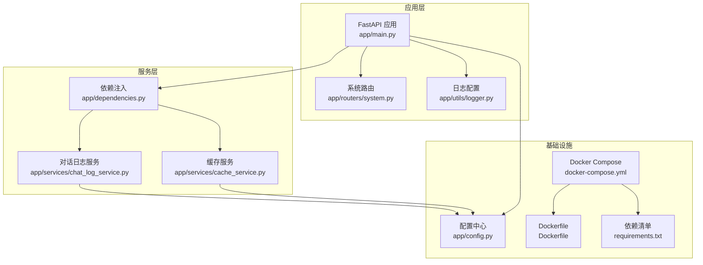
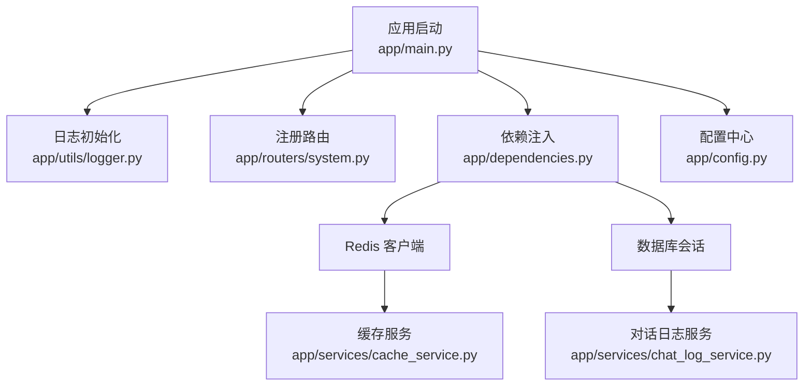
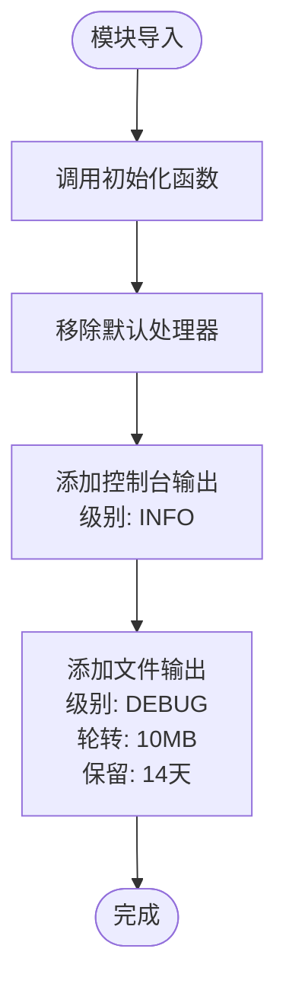
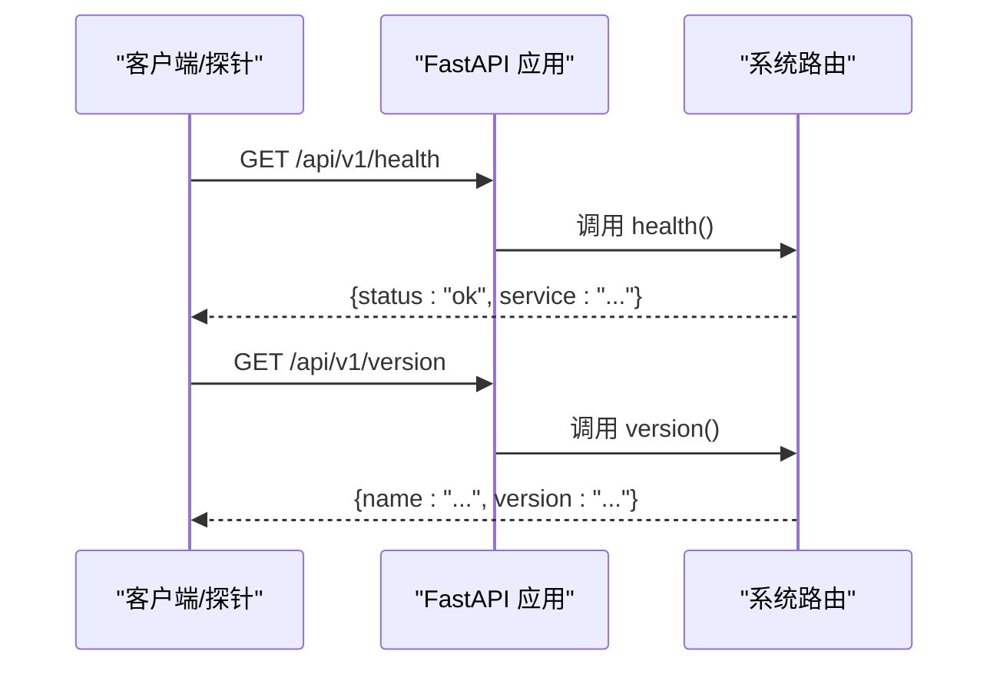
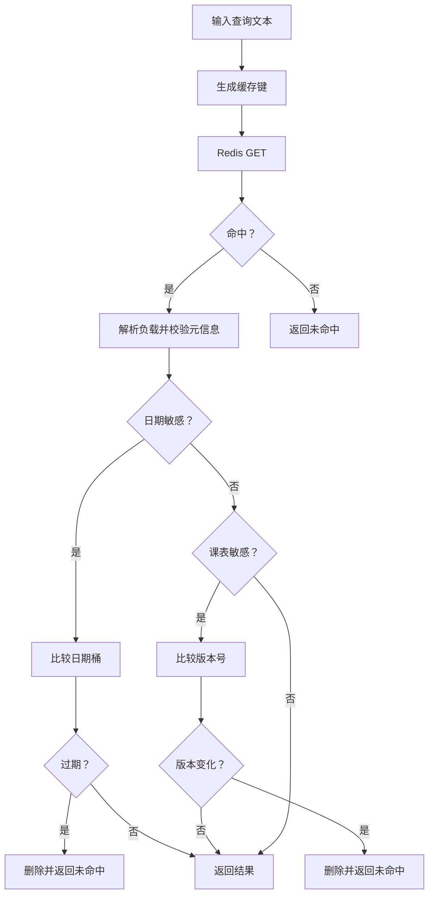
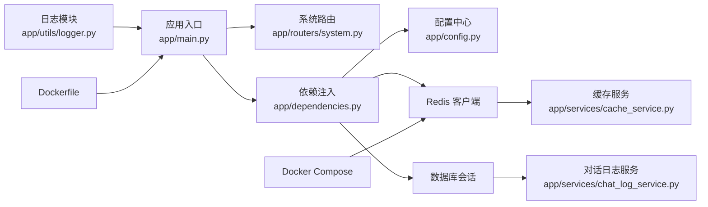

# 监控与日志

<cite>
**本文引用的文件**
- [logger.py](file://service/ai_assistant/app/utils/logger.py)
- [main.py](file://service/ai_assistant/app/main.py)
- [config.py](file://service/ai_assistant/app/config.py)
- [system.py](file://service/ai_assistant/app/routers/system.py)
- [cache_service.py](file://service/ai_assistant/app/services/cache_service.py)
- [dependencies.py](file://service/ai_assistant/app/dependencies.py)
- [chat_log_service.py](file://service/ai_assistant/app/services/chat_log_service.py)
- [docker-compose.yml](file://service/ai_assistant/docker-compose.yml)
- [Dockerfile](file://service/ai_assistant/Dockerfile)
- [requirements.txt](file://service/ai_assistant/requirements.txt)
</cite>

## 目录
1. [简介](#简介)
2. [项目结构](#项目结构)
3. [核心组件](#核心组件)
4. [架构总览](#架构总览)
5. [详细组件分析](#详细组件分析)
6. [依赖分析](#依赖分析)
7. [性能考虑](#性能考虑)
8. [故障排查指南](#故障排查指南)
9. [结论](#结论)
10. [附录](#附录)

## 简介
本文件面向“AI校园助手”项目的监控与日志系统配置，聚焦以下目标：
- 日志系统：统一日志配置、日志级别、控制台与文件落盘、日志轮转与保留策略
- 性能监控：API响应时间、内存使用、Redis性能等指标的采集与建议
- 健康检查：/api/v1/health 与 /api/v1/version 的使用与扩展
- 错误追踪与异常监控：日志埋点、异常捕获与上报建议
- 告警规则与通知：基于现有日志与健康检查的告警思路
- 可视化与报表：日志聚合与分析工具链建议
- 日志分析与问题诊断：工具与技巧

## 项目结构
后端采用 FastAPI + Redis + MySQL 架构，日志系统通过 Loguru 统一配置，运行于容器环境并通过健康检查保障可用性。

**图表来源**
- [main.py:1-86](file://service/ai_assistant/app/main.py#L1-L86)
- [system.py:1-38](file://service/ai_assistant/app/routers/system.py#L1-L38)
- [logger.py:1-53](file://service/ai_assistant/app/utils/logger.py#L1-L53)
- [dependencies.py:1-109](file://service/ai_assistant/app/dependencies.py#L1-L109)
- [cache_service.py:1-177](file://service/ai_assistant/app/services/cache_service.py#L1-L177)
- [chat_log_service.py:1-76](file://service/ai_assistant/app/services/chat_log_service.py#L1-L76)
- [config.py:1-113](file://service/ai_assistant/app/config.py#L1-L113)
- [docker-compose.yml:1-31](file://service/ai_assistant/docker-compose.yml#L1-L31)
- [Dockerfile:1-49](file://service/ai_assistant/Dockerfile#L1-L49)
- [requirements.txt:1-22](file://service/ai_assistant/requirements.txt#L1-L22)

**章节来源**
- [main.py:1-86](file://service/ai_assistant/app/main.py#L1-L86)
- [docker-compose.yml:1-31](file://service/ai_assistant/docker-compose.yml#L1-L31)
- [Dockerfile:1-49](file://service/ai_assistant/Dockerfile#L1-L49)

## 核心组件
- 日志系统：统一使用 Loguru，同时输出到控制台与文件；文件按大小轮转、保留14天
- 健康检查：提供 /api/v1/health 与 /api/v1/version 两个端点
- Redis 缓存：提供缓存命中/未命中、过期策略、版本化失效等能力
- 对话日志：持久化聊天记录，支持危险内容标记与响应时间记录
- 配置中心：集中管理应用、数据库、Redis、LLM 等参数
- 依赖注入：统一提供数据库会话与 Redis 客户端

**章节来源**
- [logger.py:1-53](file://service/ai_assistant/app/utils/logger.py#L1-L53)
- [system.py:1-38](file://service/ai_assistant/app/routers/system.py#L1-L38)
- [cache_service.py:1-177](file://service/ai_assistant/app/services/cache_service.py#L1-L177)
- [chat_log_service.py:1-76](file://service/ai_assistant/app/services/chat_log_service.py#L1-L76)
- [config.py:1-113](file://service/ai_assistant/app/config.py#L1-L113)
- [dependencies.py:1-109](file://service/ai_assistant/app/dependencies.py#L1-L109)

## 架构总览
下图展示了日志、健康检查、缓存与依赖注入之间的交互关系。

**图表来源**
- [main.py:1-86](file://service/ai_assistant/app/main.py#L1-L86)
- [logger.py:1-53](file://service/ai_assistant/app/utils/logger.py#L1-L53)
- [system.py:1-38](file://service/ai_assistant/app/routers/system.py#L1-L38)
- [dependencies.py:1-109](file://service/ai_assistant/app/dependencies.py#L1-L109)
- [cache_service.py:1-177](file://service/ai_assistant/app/services/cache_service.py#L1-L177)
- [chat_log_service.py:1-76](file://service/ai_assistant/app/services/chat_log_service.py#L1-L76)
- [config.py:1-113](file://service/ai_assistant/app/config.py#L1-L113)

## 详细组件分析

### 日志系统配置与管理
- 初始化方式：在模块首次导入时执行初始化，保证全局日志生效
- 输出目标：
  - 控制台：INFO 级别及以上，便于开发调试
  - 文件：DEBUG 级别及以上，落盘至 logs/ai_assistant_runtime.txt
- 日志轮转与保留：
  - 单文件最大 10MB，超过则轮转
  - 自动保留最近 14 天的日志文件
- 日志格式：包含时间戳、级别、模块名:函数名:行号、消息体
- 使用建议：
  - 生产环境建议将控制台级别提升至 WARNING 或 ERROR
  - 结合日志聚合平台（如 ELK/Fluent Bit/Loki/Promtail）进行集中收集与检索

**图表来源**
- [logger.py:17-46](file://service/ai_assistant/app/utils/logger.py#L17-L46)

**章节来源**
- [logger.py:1-53](file://service/ai_assistant/app/utils/logger.py#L1-L53)

### 健康检查端点
- /api/v1/health：返回服务状态与服务名，用于容器编排与负载均衡探活
- /api/v1/version：返回应用名称与版本，便于运维与审计
- 建议：
  - 在容器编排中启用健康检查，结合 /api/v1/health 判断存活
  - 将 /api/v1/version 作为发布版本标识，配合日志与监控进行回溯

**图表来源**
- [system.py:22-37](file://service/ai_assistant/app/routers/system.py#L22-L37)

**章节来源**
- [system.py:1-38](file://service/ai_assistant/app/routers/system.py#L1-L38)

### Redis 缓存与性能观测
- 缓存键命名规范：chat_cache:{version}:{did}:{query_hash}
- TTL 规则：
  - 敏感/隐私查询：settings.CACHE_TTL_SENSITIVE（默认 30 分钟）
  - 普通查询：settings.CACHE_TTL_NORMAL（默认 1 天）
- 特殊失效策略：
  - 日期敏感：按自然日失效，避免跨日语义错误
  - 课表敏感：通过版本号控制，管理员改课后递增版本，旧缓存失效
- 日志观测点：
  - 命中/未命中：记录 key、命中率趋势
  - 解析失败/类型异常：记录并清理异常键
  - 写入/删除：记录 TTL 与敏感标记
- 性能建议：
  - 监控命中率、过期事件、内存占用
  - 使用 maxmemory 与淘汰策略（LRU）控制内存
  - 通过版本化键隔离升级带来的缓存不一致

**图表来源**
- [cache_service.py:92-146](file://service/ai_assistant/app/services/cache_service.py#L92-L146)

**章节来源**
- [cache_service.py:1-177](file://service/ai_assistant/app/services/cache_service.py#L1-L177)
- [dependencies.py:36-50](file://service/ai_assistant/app/dependencies.py#L36-L50)

### 对话日志与隐私保护
- 存储字段：DID（脱敏学号）、原始学号（仅危险内容）、时间戳、发送方、消息内容、系统动作、响应时间
- 隐私策略：普通消息仅存储 DID；危险内容保留原始学号
- 观测点：记录写入成功与历史读取数量，便于审计与回放

**章节来源**
- [chat_log_service.py:1-76](file://service/ai_assistant/app/services/chat_log_service.py#L1-L76)

### 配置中心与运行参数
- 应用与调试：APP_NAME、APP_VERSION、DEBUG
- 数据库：MYSQL_*（主机、端口、用户、密码、库名）
- Redis：REDIS_*（主机、端口、密码、DB）
- 安全与隐私：JWT、AES、DID_SALT
- LLM 与百炼：DashScope 与 Bailian 相关参数
- 缓存 TTL：CACHE_TTL_SENSITIVE、CACHE_TTL_NORMAL
- CORS：CORS_ALLOW_ORIGINS

**章节来源**
- [config.py:1-113](file://service/ai_assistant/app/config.py#L1-L113)

### 容器与健康检查
- Redis 服务：
  - 暴露端口 6379
  - 设置密码、最大内存 256MB、LRU 淘汰策略
  - 健康检查：每 10 秒 ping，超时 5 秒，重试 5 次
- 应用容器：
  - 暴露 8000 端口
  - 使用 uvicorn 启动应用

**章节来源**
- [docker-compose.yml:1-31](file://service/ai_assistant/docker-compose.yml#L1-L31)
- [Dockerfile:1-49](file://service/ai_assistant/Dockerfile#L1-L49)

## 依赖分析
- 日志：依赖 Loguru，输出到 stdout 与文件
- Web 框架：FastAPI，路由注册于应用入口
- 数据库：SQLAlchemy 异步会话，依赖配置中心
- 缓存：Redis 客户端，依赖配置中心与依赖注入
- 健康检查：系统路由提供 /api/v1/health 与 /api/v1/version
- 容器：Compose 管理 Redis，Dockerfile 定义运行时

**图表来源**
- [logger.py:1-53](file://service/ai_assistant/app/utils/logger.py#L1-L53)
- [main.py:1-86](file://service/ai_assistant/app/main.py#L1-L86)
- [system.py:1-38](file://service/ai_assistant/app/routers/system.py#L1-L38)
- [dependencies.py:1-109](file://service/ai_assistant/app/dependencies.py#L1-L109)
- [cache_service.py:1-177](file://service/ai_assistant/app/services/cache_service.py#L1-L177)
- [chat_log_service.py:1-76](file://service/ai_assistant/app/services/chat_log_service.py#L1-L76)
- [config.py:1-113](file://service/ai_assistant/app/config.py#L1-L113)
- [docker-compose.yml:1-31](file://service/ai_assistant/docker-compose.yml#L1-L31)
- [Dockerfile:1-49](file://service/ai_assistant/Dockerfile#L1-L49)

**章节来源**
- [requirements.txt:1-22](file://service/ai_assistant/requirements.txt#L1-L22)

## 性能考虑
- API 响应时间
  - 建议在请求处理流程中记录开始时间与结束时间，并将响应时间写入对话日志或独立指标
  - 可结合 Prometheus/Grafana 对 P50/P95/P99 延迟进行可视化
- 内存使用
  - 应用容器暴露端口 8000；建议在容器编排中设置内存限制与 OOM 监控
  - Redis 设置 maxmemory 与淘汰策略，避免内存溢出
- Redis 性能
  - 监控命中率、过期事件、内存使用、连接数
  - 使用版本化键与日期敏感策略降低脏读风险
- 日志开销
  - 生产环境建议降低控制台日志级别，减少 stdout 压力
  - 使用异步写入（Loguru enqueue）与轮转策略，避免磁盘 IO 抖动

[本节为通用性能建议，无需特定文件引用]

## 故障排查指南
- 健康检查失败
  - 使用 /api/v1/health 与 /api/v1/version 排查服务状态与版本
  - 检查容器健康检查配置与日志
- Redis 不可用
  - 查看容器健康检查结果与日志
  - 核对密码、网络连通性与 maxmemory 设置
- 缓存命中异常
  - 检查敏感性判定与日期/课表版本策略
  - 关注日志中的解析失败与异常键清理
- 对话日志缺失
  - 核对数据库连接与权限
  - 检查危险内容标记与隐私策略

**章节来源**
- [system.py:22-37](file://service/ai_assistant/app/routers/system.py#L22-L37)
- [docker-compose.yml:18-22](file://service/ai_assistant/docker-compose.yml#L18-L22)
- [cache_service.py:92-146](file://service/ai_assistant/app/services/cache_service.py#L92-L146)
- [chat_log_service.py:14-55](file://service/ai_assistant/app/services/chat_log_service.py#L14-L55)

## 结论
本项目已具备完善的日志落盘与健康检查能力，建议在此基础上引入日志聚合与可视化、Redis 专项监控、以及 API 响应时间与资源使用指标采集，形成闭环的可观测体系。通过版本化缓存与严格隐私策略，既能提升用户体验，又能满足合规要求。

[本节为总结性内容，无需特定文件引用]

## 附录

### 告警规则与通知（示例思路）
- 健康检查失败：连续多次 /api/v1/health 返回非 ok
- Redis 不可用：健康检查失败或连接异常
- 缓存命中率骤降：连续窗口内命中率低于阈值
- 日志异常：ERROR/WARNING 指标突增
- 响应时间：P95/P99 超过阈值
- 通知机制：邮件/IM/Webhook，结合 Grafana/AlertManager

[本节为概念性内容，无需特定文件引用]

### 日志分析与问题诊断（工具与技巧）
- 工具链建议：Logstash/Fluent Bit/Loki/Promtail + Grafana
- 技巧：
  - 使用时间戳与模块名过滤
  - 结合请求 ID 串联一次完整调用链
  - 对高频错误进行聚合统计与根因定位

[本节为通用指导，无需特定文件引用]