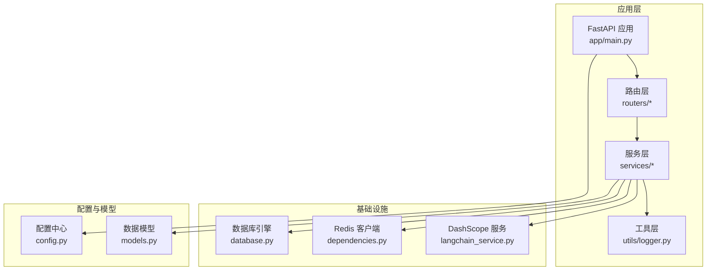
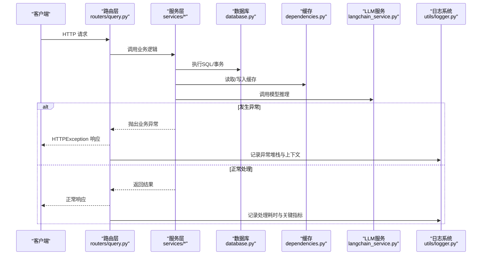
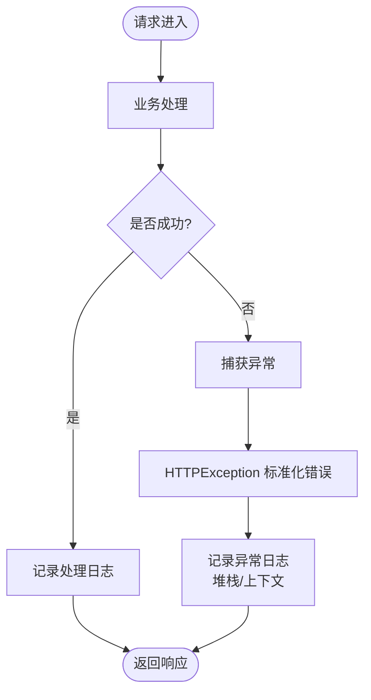
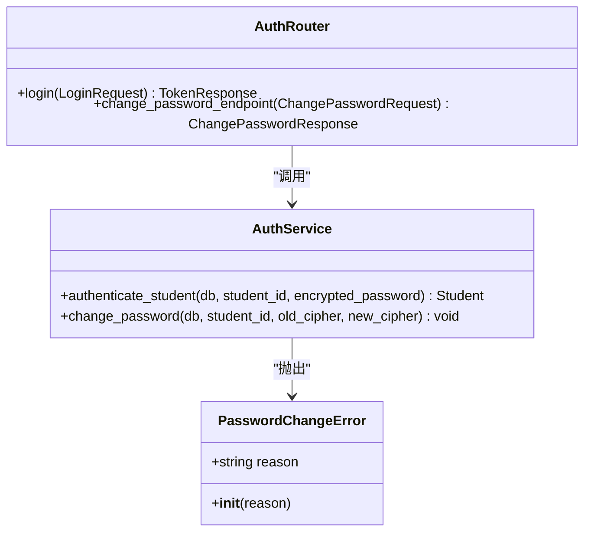
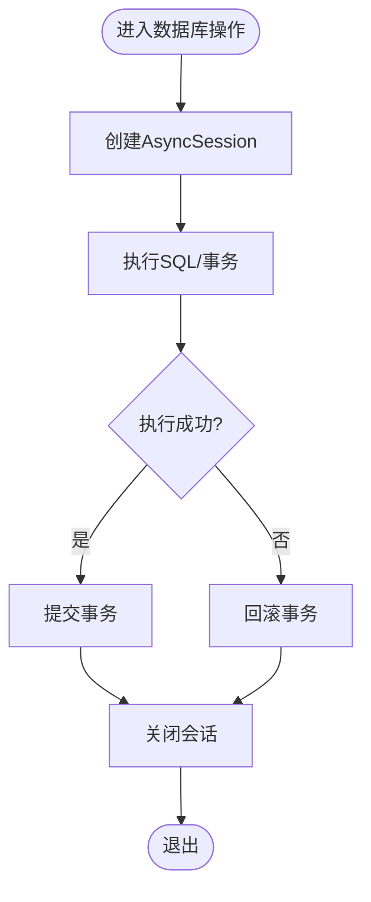
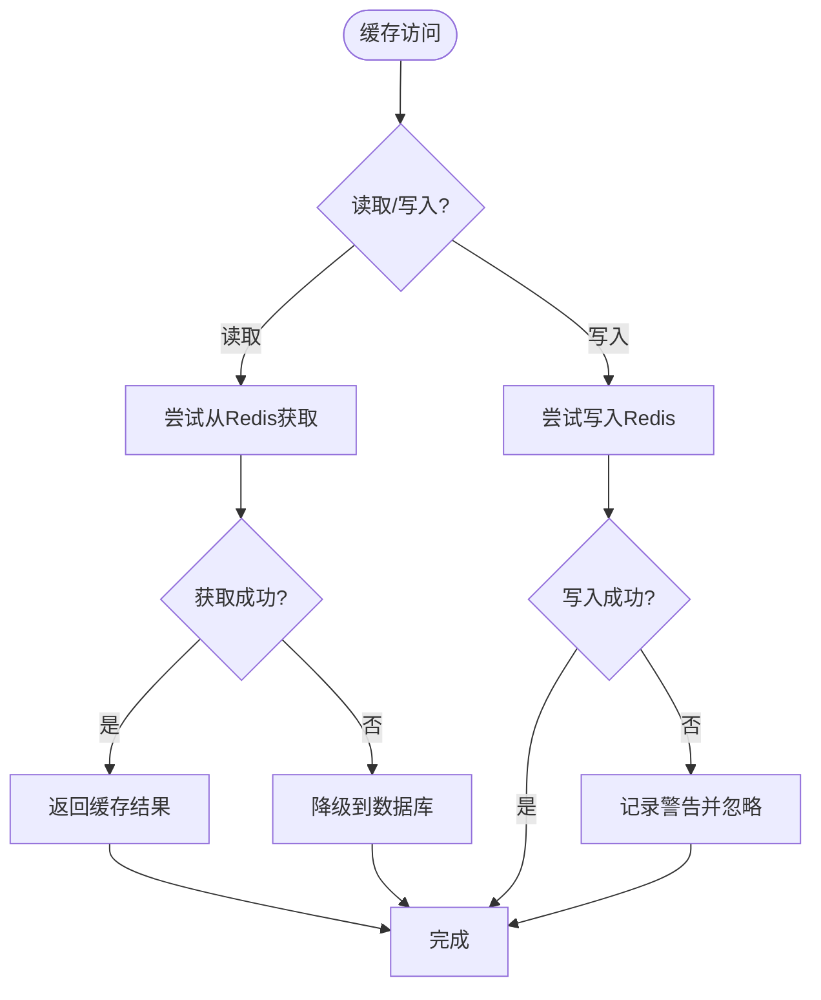
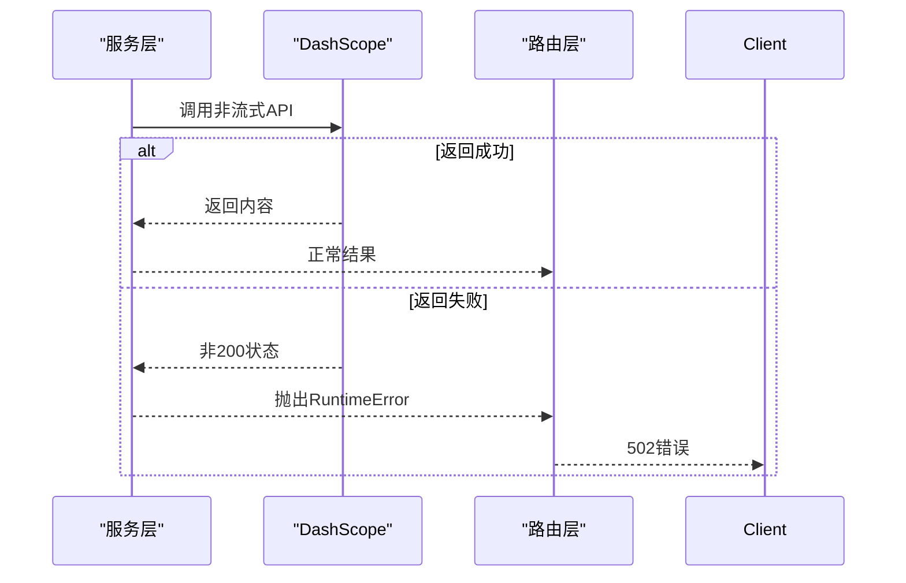
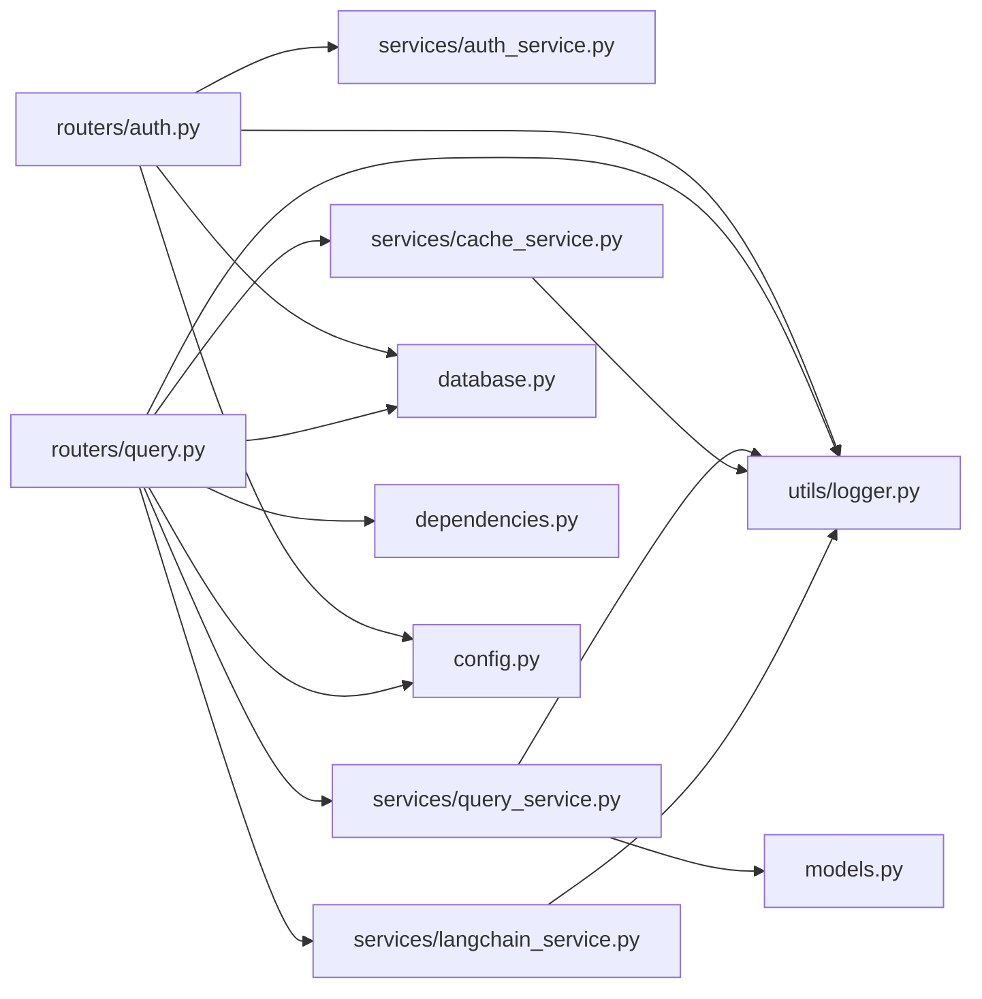

# 错误追踪

<cite>
**本文档引用的文件**
- [logger.py](file://service/ai_assistant/app/utils/logger.py)
- [main.py](file://service/ai_assistant/app/main.py)
- [config.py](file://service/ai_assistant/app/config.py)
- [database.py](file://service/ai_assistant/app/database.py)
- [dependencies.py](file://service/ai_assistant/app/dependencies.py)
- [auth.py](file://service/ai_assistant/app/routers/auth.py)
- [query.py](file://service/ai_assistant/app/routers/query.py)
- [cache_service.py](file://service/ai_assistant/app/services/cache_service.py)
- [langchain_service.py](file://service/ai_assistant/app/services/langchain_service.py)
- [auth_service.py](file://service/ai_assistant/app/services/auth_service.py)
- [query_service.py](file://service/ai_assistant/app/services/query_service.py)
- [models.py](file://service/ai_assistant/app/models/models.py)
- [ai_assistant_runtime.txt](file://service/ai_assistant/logs/ai_assistant_runtime.txt)
</cite>

## 目录
1. [简介](#简介)
2. [项目结构](#项目结构)
3. [核心组件](#核心组件)
4. [架构总览](#架构总览)
5. [详细组件分析](#详细组件分析)
6. [依赖关系分析](#依赖关系分析)
7. [性能考虑](#性能考虑)
8. [故障排查指南](#故障排查指南)
9. [结论](#结论)

## 简介
本文件面向AI校园助手项目的错误追踪与异常监控，系统性阐述异常捕获与记录机制、全局异常处理器配置、自定义异常类型定义、日志记录与上下文数据采集、常见异常分类与处理策略、错误率监控与趋势分析方法，以及错误告警配置与通知机制。文档旨在帮助开发者快速定位问题、进行根因分析，并建立完善的运行时质量保障体系。

## 项目结构
AI校园助手采用FastAPI + SQLAlchemy + Redis + DashScope的后端架构，日志系统基于Loguru统一输出至控制台与文件。异常处理主要通过FastAPI路由层的HTTPException与服务层的业务异常实现，结合Redis与数据库的连接池管理，形成完整的错误追踪闭环。

**图表来源**
- [main.py:1-86](file://service/ai_assistant/app/main.py#L1-L86)
- [database.py:1-35](file://service/ai_assistant/app/database.py#L1-L35)
- [dependencies.py:1-109](file://service/ai_assistant/app/dependencies.py#L1-L109)
- [config.py:1-113](file://service/ai_assistant/app/config.py#L1-L113)
- [models.py:1-660](file://service/ai_assistant/app/models/models.py#L1-L660)

**章节来源**
- [main.py:1-86](file://service/ai_assistant/app/main.py#L1-L86)
- [config.py:1-113](file://service/ai_assistant/app/config.py#L1-L113)

## 核心组件
- 日志系统（Loguru）：统一控制台与文件输出，支持旋转与保留策略，便于问题回溯与审计。
- 全局异常处理：路由层使用HTTPException进行标准化错误响应，服务层抛出自定义异常并由路由捕获。
- 数据库与缓存：通过连接池与上下文管理器确保资源释放，异常时进行回滚与关闭。
- LLM调用：对DashScope API调用进行状态校验与异常包装，统一错误提示。
- 配置中心：集中管理数据库、Redis、LLM等外部依赖的连接参数与行为开关。

**章节来源**
- [logger.py:1-53](file://service/ai_assistant/app/utils/logger.py#L1-L53)
- [auth.py:1-102](file://service/ai_assistant/app/routers/auth.py#L1-L102)
- [query.py:1-788](file://service/ai_assistant/app/routers/query.py#L1-L788)
- [database.py:1-35](file://service/ai_assistant/app/database.py#L1-L35)
- [dependencies.py:1-109](file://service/ai_assistant/app/dependencies.py#L1-L109)
- [langchain_service.py:1-278](file://service/ai_assistant/app/services/langchain_service.py#L1-L278)

## 架构总览
下图展示了错误追踪在系统中的流转路径：请求进入路由层，经依赖注入与业务处理，遇到异常时统一转化为HTTP响应；同时，日志系统记录异常堆栈与上下文，便于后续分析。

**图表来源**
- [query.py:1-788](file://service/ai_assistant/app/routers/query.py#L1-L788)
- [auth.py:1-102](file://service/ai_assistant/app/routers/auth.py#L1-L102)
- [database.py:1-35](file://service/ai_assistant/app/database.py#L1-L35)
- [dependencies.py:1-109](file://service/ai_assistant/app/dependencies.py#L1-L109)
- [langchain_service.py:1-278](file://service/ai_assistant/app/services/langchain_service.py#L1-L278)
- [logger.py:1-53](file://service/ai_assistant/app/utils/logger.py#L1-L53)

## 详细组件分析

### 日志系统与全局异常处理
- 初始化与配置：首次导入即初始化Loguru，输出到控制台与文件，支持旋转与保留策略，确保长期运行稳定性。
- 全局异常处理：路由层通过HTTPException返回标准错误，服务层抛出业务异常（如认证失败、密码修改失败），由路由捕获并转换为HTTP状态码与错误信息。
- 上下文记录：在关键节点记录请求ID、用户ID、查询文本长度、缓存命中/未命中、LLM调用状态等，便于根因分析。

**图表来源**
- [auth.py:1-102](file://service/ai_assistant/app/routers/auth.py#L1-L102)
- [query.py:1-788](file://service/ai_assistant/app/routers/query.py#L1-L788)
- [logger.py:1-53](file://service/ai_assistant/app/utils/logger.py#L1-L53)

**章节来源**
- [logger.py:1-53](file://service/ai_assistant/app/utils/logger.py#L1-L53)
- [auth.py:1-102](file://service/ai_assistant/app/routers/auth.py#L1-L102)
- [query.py:1-788](file://service/ai_assistant/app/routers/query.py#L1-L788)

### 自定义异常类型与业务异常处理
- 认证与密码修改异常：服务层定义PasswordChangeError，携带reason字段，路由层根据reason映射为不同HTTP状态码与错误详情。
- 认证失败：当用户名或密码无效时，抛出ValueError，路由层捕获并返回401。
- LLM调用异常：DashScope调用返回非200状态时，抛出RuntimeError，统一包装为502错误并返回友好提示。

**图表来源**
- [auth_service.py:1-253](file://service/ai_assistant/app/services/auth_service.py#L1-L253)
- [auth.py:1-102](file://service/ai_assistant/app/routers/auth.py#L1-L102)

**章节来源**
- [auth_service.py:1-253](file://service/ai_assistant/app/services/auth_service.py#L1-L253)
- [auth.py:1-102](file://service/ai_assistant/app/routers/auth.py#L1-L102)

### 数据库连接异常与事务管理
- 连接池配置：使用SQLAlchemy异步引擎与连接池，开启pre_ping与recycle，确保连接健康与回收。
- 事务管理：通过上下文管理器确保会话创建与关闭，异常时进行回滚，避免连接泄漏。
- 常见问题：连接超时、SQL语法错误、死锁等，均通过日志记录SQL与参数，便于定位。

**图表来源**
- [database.py:1-35](file://service/ai_assistant/app/database.py#L1-L35)
- [query.py:1-788](file://service/ai_assistant/app/routers/query.py#L1-L788)

**章节来源**
- [database.py:1-35](file://service/ai_assistant/app/database.py#L1-L35)
- [query.py:1-788](file://service/ai_assistant/app/routers/query.py#L1-L788)

### 缓存访问异常与降级策略
- 缓存读取：Redis异常时记录异常并降级到数据库历史查询，保证服务可用性。
- 缓存写入：异常时记录警告并忽略，避免影响主流程。
- 缓存清理：批量删除键时捕获异常并记录，确保清理动作的可观测性。

**图表来源**
- [cache_service.py:1-177](file://service/ai_assistant/app/services/cache_service.py#L1-L177)
- [query.py:1-788](file://service/ai_assistant/app/routers/query.py#L1-L788)

**章节来源**
- [cache_service.py:1-177](file://service/ai_assistant/app/services/cache_service.py#L1-L177)
- [query.py:1-788](file://service/ai_assistant/app/routers/query.py#L1-L788)

### AI服务调用异常与流式处理
- 非流式调用：校验DashScope返回状态，非200时抛出RuntimeError，统一包装为502错误。
- 流式调用：逐块消费响应，异常时记录错误并返回友好提示，避免客户端长时间阻塞。
- 输入裁剪：对消息长度进行裁剪，超限时记录警告并继续处理，确保鲁棒性。

**图表来源**
- [langchain_service.py:1-278](file://service/ai_assistant/app/services/langchain_service.py#L1-L278)
- [query.py:1-788](file://service/ai_assistant/app/routers/query.py#L1-L788)

**章节来源**
- [langchain_service.py:1-278](file://service/ai_assistant/app/services/langchain_service.py#L1-L278)
- [query.py:1-788](file://service/ai_assistant/app/routers/query.py#L1-L788)

### 常见异常分类与处理策略
- 认证与授权异常
  - 场景：用户名或密码无效、令牌无效或过期、权限不足。
  - 处理：返回401/403，记录上下文（用户ID、IP、时间戳）。
- 数据库异常
  - 场景：连接超时、SQL语法错误、死锁、唯一约束冲突。
  - 处理：回滚事务，记录SQL与参数，必要时重试或降级。
- 缓存异常
  - 场景：Redis连接失败、序列化失败、键过期。
  - 处理：降级到数据库，记录警告，继续提供服务。
- LLM服务异常
  - 场景：API返回非200、输入超长、流式中断。
  - 处理：返回友好提示，记录模型名称、输入长度、错误码。
- 路由层异常
  - 场景：参数缺失、格式错误、业务规则违反。
  - 处理：返回400，记录请求体摘要与上下文。

**章节来源**
- [auth.py:1-102](file://service/ai_assistant/app/routers/auth.py#L1-L102)
- [query.py:1-788](file://service/ai_assistant/app/routers/query.py#L1-L788)
- [auth_service.py:1-253](file://service/ai_assistant/app/services/auth_service.py#L1-L253)
- [cache_service.py:1-177](file://service/ai_assistant/app/services/cache_service.py#L1-L177)
- [langchain_service.py:1-278](file://service/ai_assistant/app/services/langchain_service.py#L1-L278)

## 依赖关系分析
- 路由层依赖服务层与依赖注入（数据库、Redis、JWT解码）。
- 服务层依赖配置中心、数据模型、第三方LLM服务。
- 日志系统作为横切关注点，被各层调用以记录上下文与异常。

**图表来源**
- [auth.py:1-102](file://service/ai_assistant/app/routers/auth.py#L1-L102)
- [query.py:1-788](file://service/ai_assistant/app/routers/query.py#L1-L788)
- [auth_service.py:1-253](file://service/ai_assistant/app/services/auth_service.py#L1-L253)
- [query_service.py:1-800](file://service/ai_assistant/app/services/query_service.py#L1-L800)
- [cache_service.py:1-177](file://service/ai_assistant/app/services/cache_service.py#L1-L177)
- [langchain_service.py:1-278](file://service/ai_assistant/app/services/langchain_service.py#L1-L278)
- [database.py:1-35](file://service/ai_assistant/app/database.py#L1-L35)
- [dependencies.py:1-109](file://service/ai_assistant/app/dependencies.py#L1-L109)
- [config.py:1-113](file://service/ai_assistant/app/config.py#L1-L113)
- [models.py:1-660](file://service/ai_assistant/app/models/models.py#L1-L660)
- [logger.py:1-53](file://service/ai_assistant/app/utils/logger.py#L1-L53)

**章节来源**
- [auth.py:1-102](file://service/ai_assistant/app/routers/auth.py#L1-L102)
- [query.py:1-788](file://service/ai_assistant/app/routers/query.py#L1-L788)
- [auth_service.py:1-253](file://service/ai_assistant/app/services/auth_service.py#L1-L253)
- [query_service.py:1-800](file://service/ai_assistant/app/services/query_service.py#L1-L800)
- [cache_service.py:1-177](file://service/ai_assistant/app/services/cache_service.py#L1-L177)
- [langchain_service.py:1-278](file://service/ai_assistant/app/services/langchain_service.py#L1-L278)
- [database.py:1-35](file://service/ai_assistant/app/database.py#L1-L35)
- [dependencies.py:1-109](file://service/ai_assistant/app/dependencies.py#L1-L109)
- [config.py:1-113](file://service/ai_assistant/app/config.py#L1-L113)
- [models.py:1-660](file://service/ai_assistant/app/models/models.py#L1-L660)
- [logger.py:1-53](file://service/ai_assistant/app/utils/logger.py#L1-L53)

## 性能考虑
- 日志性能：使用enqueue异步写入，避免阻塞主线程；文件旋转与保留策略减少磁盘压力。
- 数据库性能：连接池参数（pre_ping、recycle）提升连接可靠性；事务及时提交/回滚，避免长事务。
- 缓存性能：命中优先策略与TTL控制，敏感查询短期缓存，普通查询长期缓存。
- LLM性能：消息长度裁剪与增量输出，减少超时风险；并发任务并行化缩短总耗时。

[本节为通用指导，无需特定文件引用]

## 故障排查指南
- 定位步骤
  - 查看日志文件：定位异常发生时间、模块、函数与行号。
  - 检查上下文：确认用户ID、请求ID、查询文本长度、缓存命中情况。
  - 复现最小样本：收集请求参数与环境变量，尝试在测试环境复现。
- 常见问题
  - 认证失败：检查JWT密钥、令牌有效期与角色校验。
  - 数据库连接失败：检查主机、端口、用户名、密码与网络连通性。
  - Redis不可用：检查连接URL、密码与网络策略。
  - LLM调用失败：检查API Key、模型名称、输入长度与代理配置。
- 日志示例
  - 认证与查询请求：包含用户ID、会话ID、文本长度、缓存命中/未命中、LLM调用状态。
  - 异常堆栈：包含模块、函数、行号与异常类型。

**章节来源**
- [ai_assistant_runtime.txt:1-697](file://service/ai_assistant/logs/ai_assistant_runtime.txt#L1-L697)
- [logger.py:1-53](file://service/ai_assistant/app/utils/logger.py#L1-L53)
- [auth_service.py:1-253](file://service/ai_assistant/app/services/auth_service.py#L1-L253)
- [query.py:1-788](file://service/ai_assistant/app/routers/query.py#L1-L788)

## 结论
通过统一的日志系统、标准化的异常处理与完善的上下文记录，AI校园助手实现了对认证、数据库、缓存与LLM服务的全面错误追踪。配合缓存降级、事务回滚与流式处理等策略，系统在异常情况下仍能保持高可用与可观测性。建议持续完善错误率监控与告警机制，结合日志分析工具进行趋势分析，以实现更高效的根因定位与预防性维护。