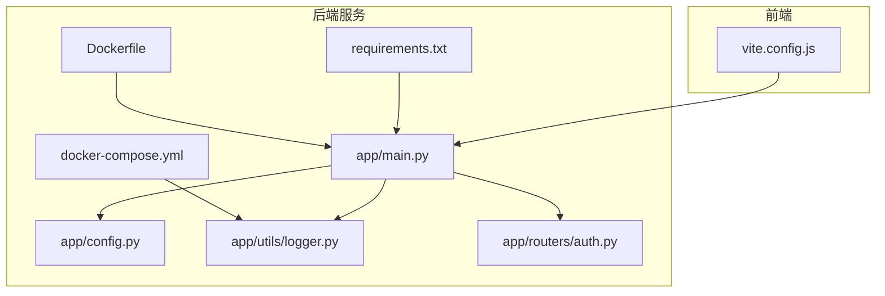
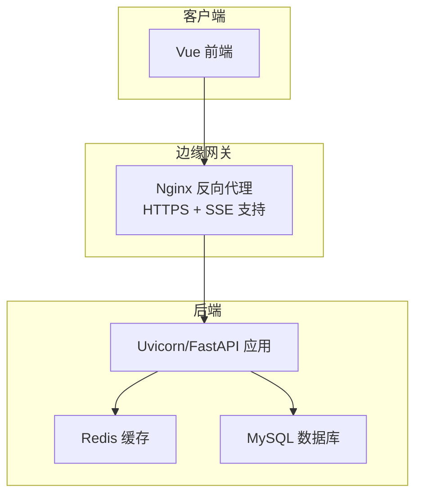
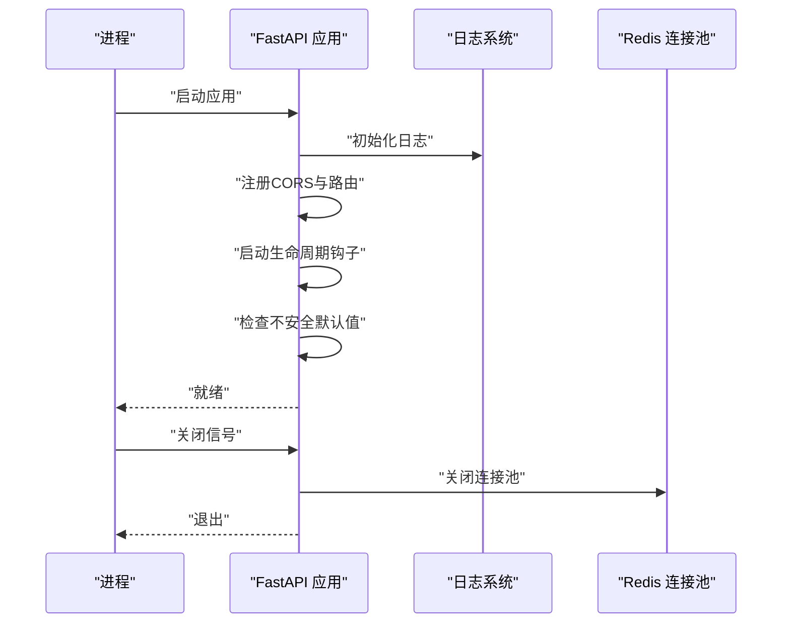
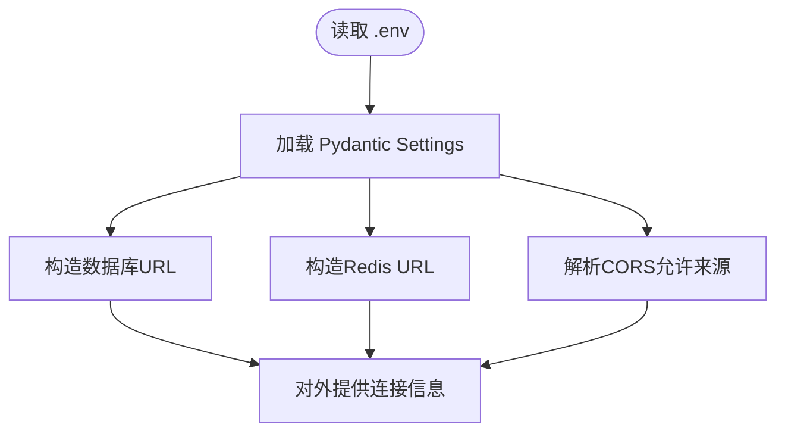
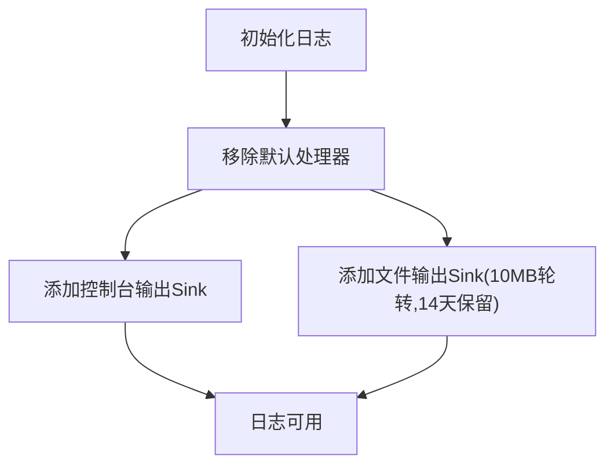
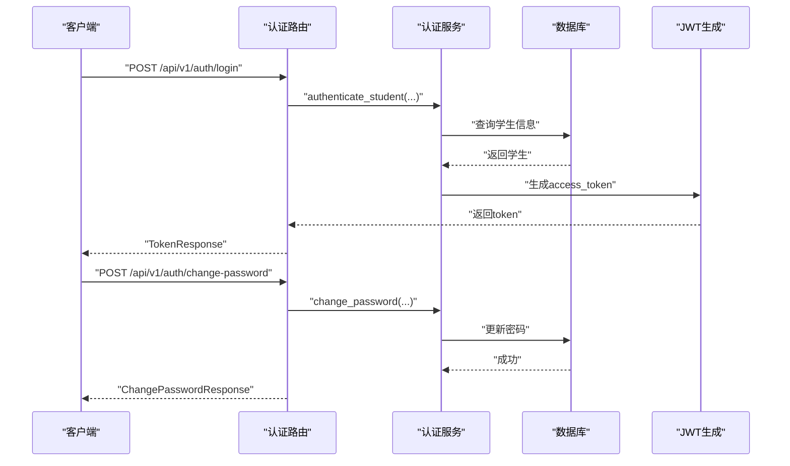
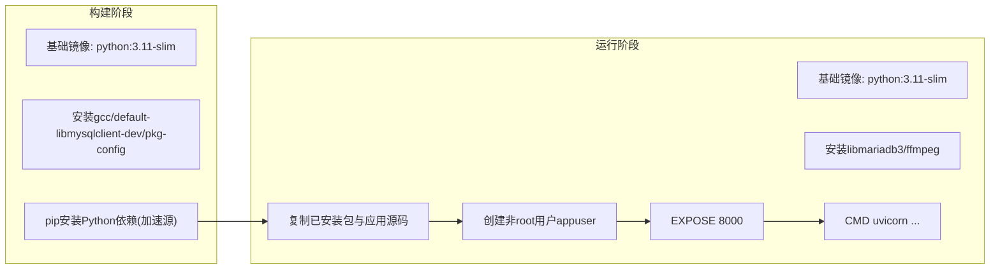
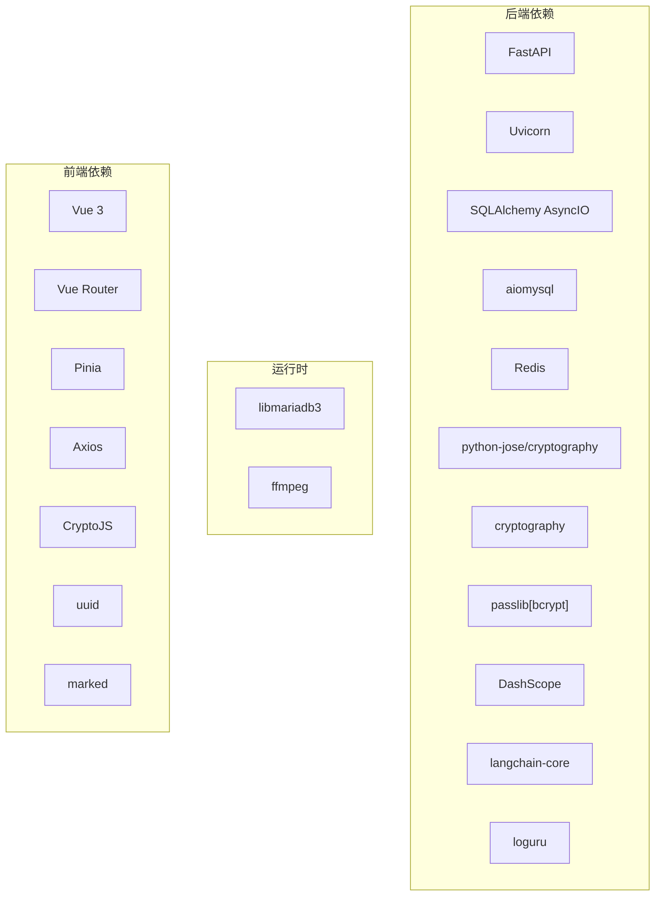

# 部署运维

<cite>
**本文引用的文件**
- [Dockerfile](file://service/ai_assistant/Dockerfile)
- [docker-compose.yml](file://service/ai_assistant/docker-compose.yml)
- [requirements.txt](file://service/ai_assistant/requirements.txt)
- [app/main.py](file://service/ai_assistant/app/main.py)
- [app/config.py](file://service/ai_assistant/app/config.py)
- [app/utils/logger.py](file://service/ai_assistant/app/utils/logger.py)
- [app/routers/auth.py](file://service/ai_assistant/app/routers/auth.py)
- [frontend/vite.config.js](file://frontend/ai_assistant/vite.config.js)
- [服务端README.md](file://service/ai_assistant/README.md)
</cite>

## 目录
1. [简介](#简介)
2. [项目结构](#项目结构)
3. [核心组件](#核心组件)
4. [架构总览](#架构总览)
5. [详细组件分析](#详细组件分析)
6. [依赖分析](#依赖分析)
7. [性能考虑](#性能考虑)
8. [故障排除指南](#故障排除指南)
9. [结论](#结论)
10. [附录](#附录)

## 简介
本文件面向运维工程师，提供AI校园助手在生产环境的完整部署与运维指南。内容覆盖：Docker容器化与编排、Nginx反向代理与HTTPS、环境准备与网络配置、微服务部署模式、监控与日志、性能调优与容量规划、备份恢复与灾备、安全加固与漏洞防护、运维自动化与CI/CD、以及故障排除与诊断流程。  
项目后端基于FastAPI + Uvicorn，使用Redis作为缓存，MySQL存储结构化数据，前端基于Vue 3 + Vite，通过SSE实现流式输出。当前仓库提供了后端Dockerfile与Compose配置，以及前端Vite开发代理配置。

## 项目结构
后端服务位于 service/ai_assistant，包含：
- Dockerfile：多阶段构建，包含构建期依赖与运行期依赖，暴露8000端口，使用非root用户运行
- docker-compose.yml：定义Redis服务，含健康检查、密码、内存限制与持久化卷
- requirements.txt：后端依赖清单
- app/：FastAPI应用入口、配置、路由、服务与工具
- 日志目录：service/ai_assistant/logs（运行时生成）

前端位于 frontend/ai_assistant，包含：
- vite.config.js：开发代理配置，将/api前缀转发到后端

**图表来源**
- [Dockerfile:1-49](file://service/ai_assistant/Dockerfile#L1-L49)
- [docker-compose.yml:1-31](file://service/ai_assistant/docker-compose.yml#L1-L31)
- [requirements.txt:1-22](file://service/ai_assistant/requirements.txt#L1-L22)
- [app/main.py:1-86](file://service/ai_assistant/app/main.py#L1-L86)
- [app/config.py:1-113](file://service/ai_assistant/app/config.py#L1-L113)
- [app/utils/logger.py:1-53](file://service/ai_assistant/app/utils/logger.py#L1-L53)
- [app/routers/auth.py:1-102](file://service/ai_assistant/app/routers/auth.py#L1-L102)
- [frontend/vite.config.js:1-23](file://frontend/ai_assistant/vite.config.js#L1-L23)

**章节来源**
- [Dockerfile:1-49](file://service/ai_assistant/Dockerfile#L1-L49)
- [docker-compose.yml:1-31](file://service/ai_assistant/docker-compose.yml#L1-L31)
- [requirements.txt:1-22](file://service/ai_assistant/requirements.txt#L1-L22)
- [app/main.py:1-86](file://service/ai_assistant/app/main.py#L1-L86)
- [app/config.py:1-113](file://service/ai_assistant/app/config.py#L1-L113)
- [app/utils/logger.py:1-53](file://service/ai_assistant/app/utils/logger.py#L1-L53)
- [app/routers/auth.py:1-102](file://service/ai_assistant/app/routers/auth.py#L1-L102)
- [frontend/vite.config.js:1-23](file://frontend/ai_assistant/vite.config.js#L1-L23)

## 核心组件
- 应用入口与生命周期：FastAPI应用初始化、CORS中间件、路由注册、启动/关闭钩子检查不安全默认值
- 配置管理：基于Pydantic Settings的环境变量加载，支持MySQL、Redis、JWT、AES、隐私盐、DashScope与百炼检索、缓存TTL等
- 日志系统：Loguru统一日志，控制台与文件双通道，文件滚动与保留策略
- 认证路由：登录与改密接口，依赖数据库会话与当前用户校验
- 容器与编排：多阶段构建、非root运行、Redis服务定义与健康检查
- 前端代理：开发环境将/api转发至后端8000端口

**章节来源**
- [app/main.py:1-86](file://service/ai_assistant/app/main.py#L1-L86)
- [app/config.py:1-113](file://service/ai_assistant/app/config.py#L1-L113)
- [app/utils/logger.py:1-53](file://service/ai_assistant/app/utils/logger.py#L1-L53)
- [app/routers/auth.py:1-102](file://service/ai_assistant/app/routers/auth.py#L1-L102)
- [Dockerfile:1-49](file://service/ai_assistant/Dockerfile#L1-L49)
- [docker-compose.yml:1-31](file://service/ai_assistant/docker-compose.yml#L1-L31)
- [frontend/vite.config.js:1-23](file://frontend/ai_assistant/vite.config.js#L1-L23)

## 架构总览
后端采用FastAPI + Uvicorn，Redis提供缓存与会话上下文，MySQL承载结构化数据。前端Vue应用通过Vite开发服务器运行，开发时将/api前缀代理到后端。生产建议通过Nginx反向代理，开启HTTPS与SSE流式支持。

**图表来源**
- [app/main.py:52-86](file://service/ai_assistant/app/main.py#L52-L86)
- [app/config.py:85-110](file://service/ai_assistant/app/config.py#L85-L110)
- [docker-compose.yml:5-24](file://service/ai_assistant/docker-compose.yml#L5-L24)
- [frontend/vite.config.js:15-22](file://frontend/ai_assistant/vite.config.js#L15-L22)

## 详细组件分析

### 应用入口与生命周期
- 初始化：设置日志、注册CORS、注册路由、设置文档与健康检查路径
- 生命周期钩子：启动时检查不安全默认值并告警，关闭时关闭Redis连接池
- CORS：允许生产环境指定的前端源列表

**图表来源**
- [app/main.py:36-49](file://service/ai_assistant/app/main.py#L36-L49)

**章节来源**
- [app/main.py:1-86](file://service/ai_assistant/app/main.py#L1-L86)

### 配置管理
- 环境变量文件：.env，编码utf-8，额外字段忽略
- 数据库URL与Redis URL构造
- CORS来源解析为列表
- 关键配置项：MySQL/Redis连接、JWT密钥与算法、AES密钥、隐私盐、DashScope与百炼检索、缓存TTL、LLM模型族

**图表来源**
- [app/config.py:6-110](file://service/ai_assistant/app/config.py#L6-L110)

**章节来源**
- [app/config.py:1-113](file://service/ai_assistant/app/config.py#L1-L113)

### 日志系统
- 控制台输出：INFO级别
- 文件落盘：DEBUG级别，10MB轮转，14天保留
- 路径：service/ai_assistant/logs/ai_assistant_runtime.txt

**图表来源**
- [app/utils/logger.py:17-46](file://service/ai_assistant/app/utils/logger.py#L17-L46)

**章节来源**
- [app/utils/logger.py:1-53](file://service/ai_assistant/app/utils/logger.py#L1-L53)

### 认证路由
- 登录：接收加密密码，认证学生，签发JWT
- 修改密码：需当前用户身份，校验旧密码，更新新密码

**图表来源**
- [app/routers/auth.py:24-101](file://service/ai_assistant/app/routers/auth.py#L24-L101)

**章节来源**
- [app/routers/auth.py:1-102](file://service/ai_assistant/app/routers/auth.py#L1-L102)

### 容器与编排
- Dockerfile：多阶段构建，构建期安装编译依赖与Python包，运行期安装运行时库与ffmpeg，非root用户，暴露8000端口，CMD启动Uvicorn
- docker-compose：Redis 7，设置密码、最大内存、LRU策略、健康检查、持久化卷、桥接网络

**图表来源**
- [Dockerfile:1-49](file://service/ai_assistant/Dockerfile#L1-L49)

**章节来源**
- [Dockerfile:1-49](file://service/ai_assistant/Dockerfile#L1-L49)
- [docker-compose.yml:1-31](file://service/ai_assistant/docker-compose.yml#L1-L31)

### 前端代理
- 开发服务器监听127.0.0.1:6001
- 将/api前缀代理到后端HTTP 127.0.0.1:8000
- 便于本地联调

**章节来源**
- [frontend/vite.config.js:1-23](file://frontend/ai_assistant/vite.config.js#L1-L23)

## 依赖分析
- 应用依赖：FastAPI、Uvicorn、SQLAlchemy AsyncIO、aiomysql、Redis、JWT、加密库、DashScope、LangChain、Loguru等
- 运行时依赖：MariaDB客户端库、ffmpeg
- 前端依赖：Vue 3、Vue Router、Pinia、Axios、CryptoJS、UUID、Marked

**图表来源**
- [requirements.txt:1-22](file://service/ai_assistant/requirements.txt#L1-L22)
- [Dockerfile:28-32](file://service/ai_assistant/Dockerfile#L28-L32)
- [frontend/package.json:11-22](file://frontend/ai_assistant/package.json#L11-L22)

**章节来源**
- [requirements.txt:1-22](file://service/ai_assistant/requirements.txt#L1-L22)
- [Dockerfile:28-32](file://service/ai_assistant/Dockerfile#L28-L32)
- [frontend/package.json:1-24](file://frontend/ai_assistant/package.json#L1-L24)

## 性能考虑
- Redis缓存策略
  - 敏感数据缓存TTL：30分钟
  - 正常数据缓存TTL：1天
  - 内存上限与淘汰策略：maxmemory 256MB，allkeys-lru
- 数据库连接
  - 使用异步SQLAlchemy，减少阻塞
- 日志与SSE
  - Nginx禁用代理缓冲，启用chunked传输，保证SSE流式输出
- 容器资源
  - 限制Redis内存，避免OOM
  - 非root运行降低风险

**章节来源**
- [app/config.py:81-84](file://service/ai_assistant/app/config.py#L81-L84)
- [docker-compose.yml:13-15](file://service/ai_assistant/docker-compose.yml#L13-L15)
- [app/utils/logger.py:35-43](file://service/ai_assistant/app/utils/logger.py#L35-L43)
- [服务端README.md:75-102](file://service/ai_assistant/README.md#L75-L102)

## 故障排除指南
- 启动失败
  - 检查环境变量是否正确加载（.env存在且编码为utf-8）
  - 检查不安全默认值告警，及时替换密钥
- Redis异常
  - 健康检查失败：确认密码、端口映射、maxmemory配置
  - 内存不足：调整maxmemory与淘汰策略
- 数据库连接
  - 检查数据库URL构造与网络连通性
- 日志排查
  - 查看service/ai_assistant/logs/ai_assistant_runtime.txt
- SSE流中断
  - 检查Nginx配置：proxy_buffering off、chunked_transfer_encoding on
- CORS错误
  - 确认生产环境CORS_ALLOW_ORIGINS配置

**章节来源**
- [app/main.py:25-33](file://service/ai_assistant/app/main.py#L25-L33)
- [app/config.py:7-11](file://service/ai_assistant/app/config.py#L7-L11)
- [docker-compose.yml:18-22](file://service/ai_assistant/docker-compose.yml#L18-L22)
- [app/utils/logger.py:23-26](file://service/ai_assistant/app/utils/logger.py#L23-L26)
- [服务端README.md:67-104](file://service/ai_assistant/README.md#L67-L104)

## 结论
本部署运维文档基于现有仓库配置，给出了生产环境的容器化、反向代理、HTTPS、日志与监控、性能与容量规划、安全加固与灾备、运维自动化与CI/CD、以及故障排除的实施要点。建议在生产中结合企业级平台完善镜像仓库、Secret管理、负载均衡与自动扩缩容策略，并持续优化SSE与缓存策略以提升用户体验与系统稳定性。

## 附录

### 生产环境部署步骤（基于仓库能力）
- 环境准备
  - 安装Docker与Docker Compose
  - 准备MySQL与Redis（当前仓库提供Redis容器编排）
- 配置环境变量
  - 复制并编辑.env，设置MySQL/Redis/JWT/AES/DashScope/百炼检索等
- 启动Redis
  - docker-compose启动Redis服务
- 启动后端
  - 使用uvicorn启动FastAPI应用（生产建议使用进程管理器与反向代理）
- 反向代理与HTTPS
  - 使用Nginx反向代理至后端8000端口，开启HTTPS与SSE流式支持
- 健康检查
  - 访问/api/v1/health验证服务状态

**章节来源**
- [服务端README.md:47-105](file://service/ai_assistant/README.md#L47-L105)
- [docker-compose.yml:1-31](file://service/ai_assistant/docker-compose.yml#L1-L31)
- [app/main.py:59-61](file://service/ai_assistant/app/main.py#L59-L61)

### 微服务与容器编排建议
- 当前：后端单体服务 + Redis容器
- 建议：将后端容器化并纳入编排，配合Nginx/Caddy统一入口，按需拆分认证、查询、系统等子服务

**章节来源**
- [Dockerfile:1-49](file://service/ai_assistant/Dockerfile#L1-L49)
- [docker-compose.yml:1-31](file://service/ai_assistant/docker-compose.yml#L1-L31)

### 监控与日志
- 日志：Loguru落盘，按大小轮转与时间保留
- 建议：集成集中式日志收集（如ELK/EFK），采集容器标准输出与日志文件

**章节来源**
- [app/utils/logger.py:17-46](file://service/ai_assistant/app/utils/logger.py#L17-L46)

### 安全加固与漏洞防护
- 不安全默认值：启动时告警，务必替换
- 密钥管理：使用Secret管理与环境注入
- CORS白名单：生产环境限定具体域名
- 传输安全：强制HTTPS，SSE流式需Nginx正确配置

**章节来源**
- [app/main.py:18-33](file://service/ai_assistant/app/main.py#L18-L33)
- [app/config.py](file://service/ai_assistant/app/config.py#L17)
- [服务端README.md:69-104](file://service/ai_assistant/README.md#L69-L104)

### 备份恢复与灾备
- 数据库：定期备份MySQL，验证恢复流程
- 缓存：Redis持久化卷，注意内存与快照策略
- 配置：.env与密钥集中管理，版本化

**章节来源**
- [docker-compose.yml:16-17](file://service/ai_assistant/docker-compose.yml#L16-L17)

### 运维自动化与CI/CD
- 建议流水线步骤：代码检出 → 依赖安装 → 单元测试 → 构建镜像 → 推送镜像 → 编排部署 → 健康检查
- 反向代理与证书：在流水线中自动化部署Nginx与Let’s Encrypt证书

**章节来源**
- [Dockerfile:1-49](file://service/ai_assistant/Dockerfile#L1-L49)
- [服务端README.md:67-74](file://service/ai_assistant/README.md#L67-L74)