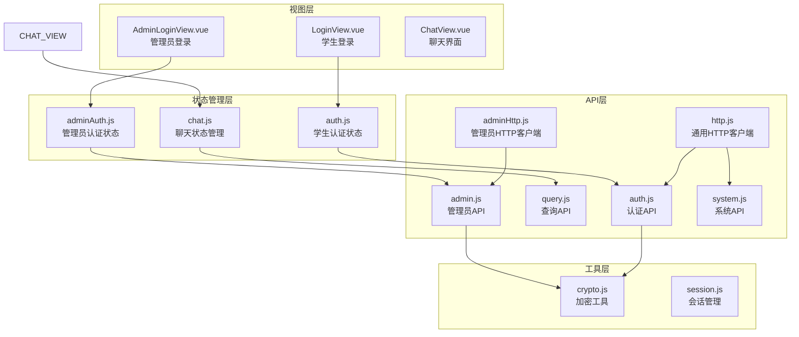
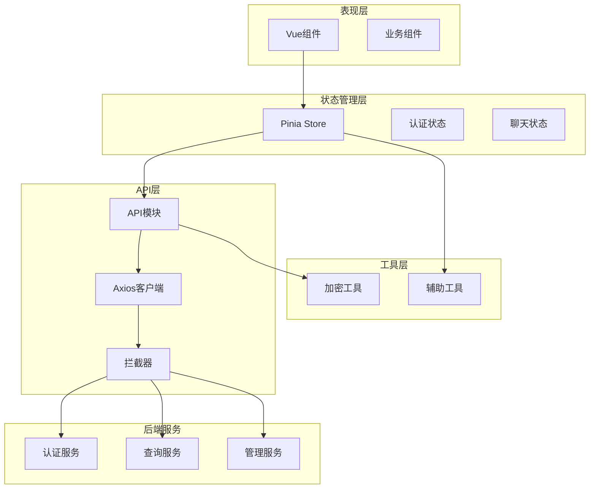
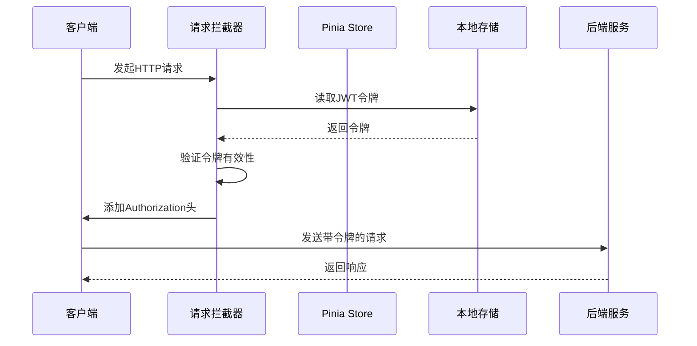
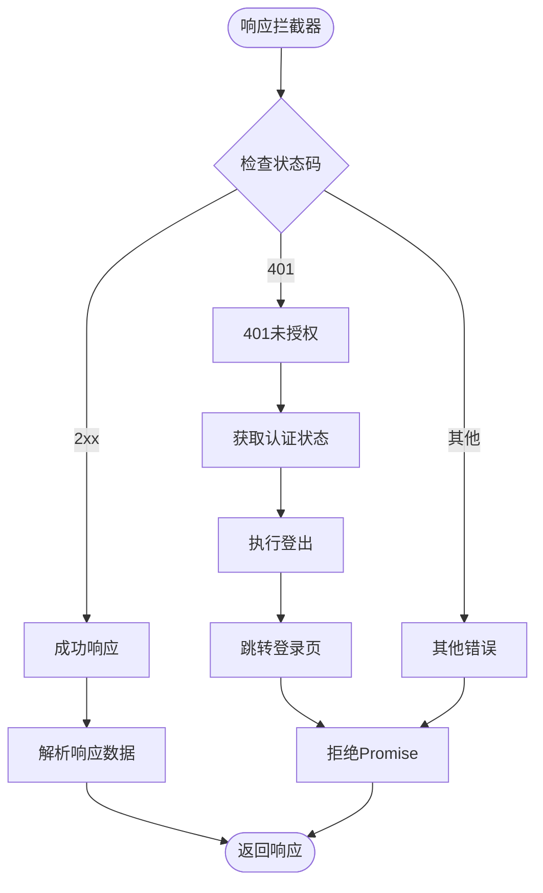
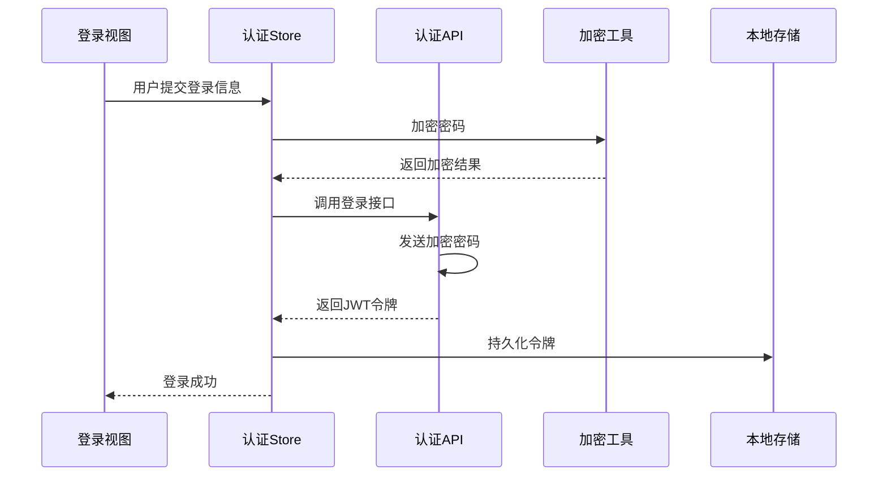
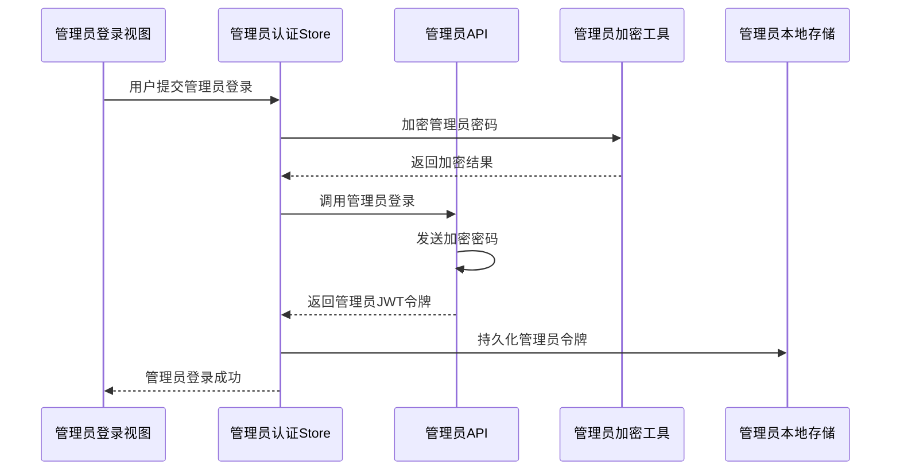
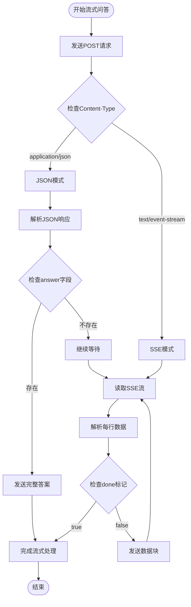
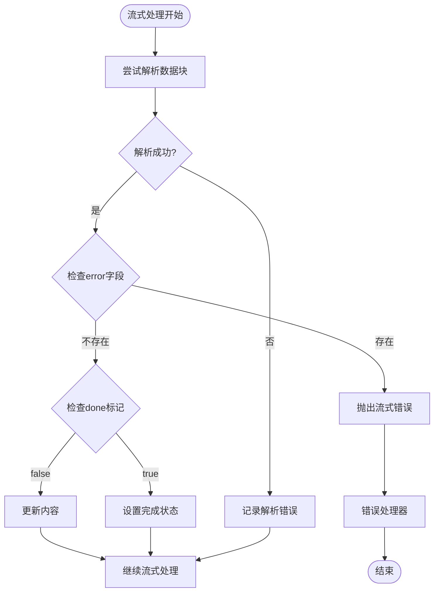
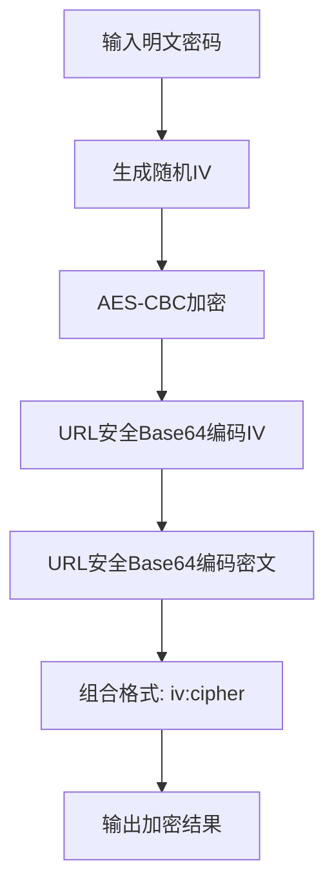
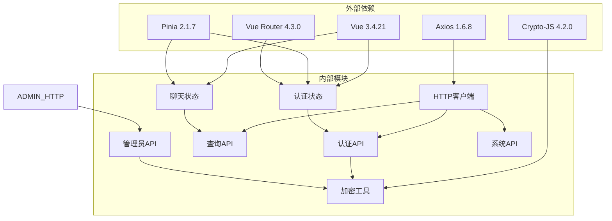

# API客户端封装

<cite>
**本文档引用的文件**
- [http.js](file://frontend/ai_assistant/src/api/http.js)
- [adminHttp.js](file://frontend/ai_assistant/src/api/adminHttp.js)
- [auth.js](file://frontend/ai_assistant/src/api/auth.js)
- [query.js](file://frontend/ai_assistant/src/api/query.js)
- [admin.js](file://frontend/ai_assistant/src/api/admin.js)
- [system.js](file://frontend/ai_assistant/src/api/system.js)
- [auth.js](file://frontend/ai_assistant/src/stores/auth.js)
- [adminAuth.js](file://frontend/ai_assistant/src/stores/adminAuth.js)
- [chat.js](file://frontend/ai_assistant/src/stores/chat.js)
- [crypto.js](file://frontend/ai_assistant/src/utils/crypto.js)
- [LoginView.vue](file://frontend/ai_assistant/src/views/LoginView.vue)
- [AdminLoginView.vue](file://frontend/ai_assistant/src/views/AdminLoginView.vue)
- [ChatView.vue](file://frontend/ai_assistant/src/views/ChatView.vue)
- [package.json](file://frontend/ai_assistant/package.json)
</cite>

## 目录
1. [简介](#简介)
2. [项目结构](#项目结构)
3. [核心组件](#核心组件)
4. [架构概览](#架构概览)
5. [详细组件分析](#详细组件分析)
6. [依赖关系分析](#依赖关系分析)
7. [性能考虑](#性能考虑)
8. [故障排除指南](#故障排除指南)
9. [结论](#结论)
10. [附录](#附录)

## 简介

AI校园助手项目的API客户端封装是一个基于Vue 3和Axios的现代化前端API层设计。该项目实现了完整的认证体系、智能问答功能、管理员后台管理等功能模块，采用统一的HTTP请求封装、拦截器机制和错误处理策略。

本项目的核心设计理念包括：
- **统一的HTTP客户端**：通过Axios实例化实现全局配置和拦截器
- **双认证体系**：学生认证和管理员认证分离，各自独立的状态管理
- **多模态交互**：支持文本、图片、语音等多种输入方式
- **流式响应处理**：实时流式输出SSE支持
- **完整的错误处理**：401自动登出、状态码映射、用户友好提示

## 项目结构

项目采用模块化的API设计，主要分为以下几个层次：



**图表来源**
- [http.js:1-49](file://frontend/ai_assistant/src/api/http.js#L1-L49)
- [adminHttp.js:1-44](file://frontend/ai_assistant/src/api/adminHttp.js#L1-L44)
- [auth.js:1-36](file://frontend/ai_assistant/src/api/auth.js#L1-L36)
- [query.js:1-141](file://frontend/ai_assistant/src/api/query.js#L1-L141)
- [admin.js:1-41](file://frontend/ai_assistant/src/api/admin.js#L1-L41)
- [system.js:1-18](file://frontend/ai_assistant/src/api/system.js#L1-L18)

**章节来源**
- [http.js:1-49](file://frontend/ai_assistant/src/api/http.js#L1-L49)
- [adminHttp.js:1-44](file://frontend/ai_assistant/src/api/adminHttp.js#L1-L44)
- [auth.js:1-36](file://frontend/ai_assistant/src/api/auth.js#L1-L36)
- [query.js:1-141](file://frontend/ai_assistant/src/api/query.js#L1-L141)
- [admin.js:1-41](file://frontend/ai_assistant/src/api/admin.js#L1-L41)
- [system.js:1-18](file://frontend/ai_assistant/src/api/system.js#L1-L18)

## 核心组件

### HTTP客户端封装

项目实现了两个核心的HTTP客户端实例，分别服务于不同的认证场景：

#### 通用HTTP客户端 (http.js)
- **基础配置**：统一的baseURL `/api/v1`，60秒超时，JSON内容类型
- **请求拦截器**：自动从localStorage读取JWT令牌并附加到Authorization头
- **响应拦截器**：401状态码自动执行登出逻辑并跳转登录页
- **安全性**：支持两种令牌读取方式，既可直接读取localStorage，也可通过Pinia store获取

#### 管理员HTTP客户端 (adminHttp.js)
- **专用配置**：独立的管理员令牌键值，确保与学生令牌隔离
- **认证机制**：与通用客户端相同的拦截器模式，但针对管理员端点
- **路由集成**：401时跳转到管理员登录页面

**章节来源**
- [http.js:10-47](file://frontend/ai_assistant/src/api/http.js#L10-L47)
- [adminHttp.js:12-41](file://frontend/ai_assistant/src/api/adminHttp.js#L12-L41)

### 认证API模块

#### 学生认证API (auth.js)
- **登录接口**：POST `/api/v1/auth/login`，支持AES-CBC加密密码传输
- **密码修改**：POST `/api/v1/auth/change-password`，双向加密保护
- **参数设计**：学号+加密密码的组合，确保传输安全
- **响应处理**：返回JWT令牌、过期时间、学生ID等关键信息

#### 管理员认证API (admin.js)
- **管理员登录**：POST `/api/v1/admin/auth/login`
- **个人信息**：GET `/api/v1/admin/auth/me`
- **仪表板摘要**：GET `/api/v1/admin/dashboard/summary`
- **元数据查询**：GET `/api/v1/admin/meta/terms` 和 `/api/v1/admin/meta/classes`
- **调度管理**：GET `/api/v1/admin/schedules` 和 PATCH `/api/v1/admin/schedules/{id}/status`

**章节来源**
- [auth.js:8-36](file://frontend/ai_assistant/src/api/auth.js#L8-L36)
- [admin.js:6-40](file://frontend/ai_assistant/src/api/admin.js#L6-L40)

### 查询API模块

#### 智能问答API (query.js)
- **基础问答**：POST `/api/v1/query`，支持文本、图片、语音多模态输入
- **会话清理**：DELETE `/api/v1/sessions`，清除Redis缓存和历史记录
- **流式输出**：SSE支持，实时接收回答片段
- **兼容性处理**：同时支持标准SSE和JSON全量返回的兼容模式

**章节来源**
- [query.js:7-141](file://frontend/ai_assistant/src/api/query.js#L7-L141)

### 系统API模块

#### 系统接口 (system.js)
- **健康检查**：GET `/api/v1/health`，监控服务可用性
- **版本信息**：GET `/api/v1/version`，获取系统版本

**章节来源**
- [system.js:8-18](file://frontend/ai_assistant/src/api/system.js#L8-L18)

## 架构概览

项目采用分层架构设计，实现了清晰的关注点分离：



**图表来源**
- [auth.js:17-77](file://frontend/ai_assistant/src/stores/auth.js#L17-L77)
- [chat.js:22-278](file://frontend/ai_assistant/src/stores/chat.js#L22-L278)
- [http.js:19-47](file://frontend/ai_assistant/src/api/http.js#L19-L47)
- [query.js:28-141](file://frontend/ai_assistant/src/api/query.js#L28-L141)

## 详细组件分析

### HTTP拦截器机制

#### 请求拦截器设计


**图表来源**
- [http.js:19-34](file://frontend/ai_assistant/src/api/http.js#L19-L34)
- [adminHttp.js:20-29](file://frontend/ai_assistant/src/api/adminHttp.js#L20-L29)

#### 响应拦截器设计


**图表来源**
- [http.js:37-47](file://frontend/ai_assistant/src/api/http.js#L37-L47)
- [adminHttp.js:31-41](file://frontend/ai_assistant/src/api/adminHttp.js#L31-L41)

**章节来源**
- [http.js:19-47](file://frontend/ai_assistant/src/api/http.js#L19-L47)
- [adminHttp.js:20-41](file://frontend/ai_assistant/src/api/adminHttp.js#L20-L41)

### 认证状态管理系统

#### 学生认证流程


**图表来源**
- [auth.js:29-43](file://frontend/ai_assistant/src/stores/auth.js#L29-L43)
- [LoginView.vue:94-121](file://frontend/ai_assistant/src/views/LoginView.vue#L94-L121)

#### 管理员认证流程


**图表来源**
- [adminAuth.js:28-47](file://frontend/ai_assistant/src/stores/adminAuth.js#L28-L47)
- [AdminLoginView.vue:75-105](file://frontend/ai_assistant/src/views/AdminLoginView.vue#L75-L105)

**章节来源**
- [auth.js:17-77](file://frontend/ai_assistant/src/stores/auth.js#L17-L77)
- [adminAuth.js:16-77](file://frontend/ai_assistant/src/stores/adminAuth.js#L16-L77)
- [LoginView.vue:94-121](file://frontend/ai_assistant/src/views/LoginView.vue#L94-L121)
- [AdminLoginView.vue:75-105](file://frontend/ai_assistant/src/views/AdminLoginView.vue#L75-L105)

### 流式问答系统

#### SSE流式处理机制


**图表来源**
- [query.js:28-141](file://frontend/ai_assistant/src/api/query.js#L28-L141)

#### 错误处理策略


**图表来源**
- [query.js:78-139](file://frontend/ai_assistant/src/api/query.js#L78-L139)

**章节来源**
- [query.js:28-141](file://frontend/ai_assistant/src/api/query.js#L28-L141)

### 加密工具实现

项目采用AES-CBC加密算法保护敏感数据传输：

#### 加密流程设计


**图表来源**
- [crypto.js:26-40](file://frontend/ai_assistant/src/utils/crypto.js#L26-L40)

**章节来源**
- [crypto.js:1-40](file://frontend/ai_assistant/src/utils/crypto.js#L1-L40)

## 依赖关系分析

### 核心依赖关系



**图表来源**
- [package.json:11-19](file://frontend/ai_assistant/package.json#L11-L19)
- [http.js:6-8](file://frontend/ai_assistant/src/api/http.js#L6-L8)
- [auth.js:6](file://frontend/ai_assistant/src/api/auth.js#L6)

### 模块间耦合度分析

项目实现了低耦合的设计原则：
- **API层与状态层解耦**：通过独立的Store管理状态，API层只负责数据传输
- **客户端与业务逻辑解耦**：HTTP客户端专注于网络通信，业务逻辑集中在Store中
- **认证与查询功能分离**：不同功能域使用独立的API模块和状态管理

**章节来源**
- [package.json:11-19](file://frontend/ai_assistant/package.json#L11-L19)
- [auth.js:6](file://frontend/ai_assistant/src/api/auth.js#L6)
- [admin.js:4](file://frontend/ai_assistant/src/api/admin.js#L4)

## 性能考虑

### 并发控制策略

项目采用了多种并发控制机制：

#### 请求队列管理
- **会话级并发**：每个会话维护独立的加载状态，避免相互干扰
- **流式处理**：问答请求采用流式处理，减少内存占用
- **错误恢复**：流式处理具备断线重连能力

#### 缓存策略
- **本地存储**：JWT令牌持久化存储，减少重复登录
- **会话缓存**：聊天会话状态本地持久化
- **响应缓存**：后端支持缓存标记，前端显示缓存状态

### 性能优化建议

1. **请求去重**：对于相同参数的请求可以实现去重机制
2. **批量操作**：管理员端可以实现批量调度状态更新
3. **懒加载**：非关键功能可以按需加载
4. **资源压缩**：图片上传前进行压缩处理

## 故障排除指南

### 常见错误处理

#### 认证相关错误
- **401未授权**：自动执行登出，跳转登录页面
- **403禁止访问**：管理员账户不可用，需要联系系统管理员
- **400参数错误**：检查请求参数格式和必填字段

#### 网络相关错误
- **超时错误**：检查网络连接和后端服务状态
- **连接失败**：验证API端点可达性和CORS配置
- **流式处理错误**：检查SSE连接和后端流式输出配置

#### 数据处理错误
- **解析失败**：检查响应格式和Content-Type设置
- **加密失败**：验证AES密钥配置和加密算法一致性

**章节来源**
- [LoginView.vue:111-121](file://frontend/ai_assistant/src/views/LoginView.vue#L111-L121)
- [AdminLoginView.vue:92-105](file://frontend/ai_assistant/src/views/AdminLoginView.vue#L92-L105)
- [chat.js:235-257](file://frontend/ai_assistant/src/stores/chat.js#L235-L257)

### 调试方法

#### 开发环境调试
1. **浏览器开发者工具**：监控网络请求和响应
2. **Vue DevTools**：检查Pinia状态变化
3. **Console日志**：查看详细的错误信息和堆栈跟踪

#### 生产环境监控
1. **错误边界**：捕获未处理的Promise拒绝
2. **性能监控**：记录API响应时间和错误率
3. **用户行为追踪**：记录关键操作和错误事件

## 结论

AI校园助手项目的API客户端封装展现了现代前端开发的最佳实践：

### 设计优势
- **统一的HTTP抽象**：通过Axios实例化实现全局配置和拦截器
- **清晰的模块划分**：认证、查询、管理等功能模块职责明确
- **完善的错误处理**：401自动登出、状态码映射、用户友好提示
- **安全的数据传输**：AES-CBC加密保护敏感信息

### 技术亮点
- **流式响应处理**：SSE支持实现实时问答体验
- **多模态输入支持**：文本、图片、语音一体化处理
- **响应式状态管理**：Pinia实现高效的状态同步
- **模块化设计**：低耦合高内聚的代码组织

### 改进建议
1. **增加重试机制**：为关键API请求实现指数退避重试
2. **实现请求取消**：支持用户取消正在进行的请求
3. **增强缓存策略**：实现更精细的缓存控制
4. **添加监控指标**：集成APM工具进行性能监控

该项目为构建企业级Web应用提供了优秀的参考模板，其设计思路和实现细节值得在类似项目中借鉴和应用。

## 附录

### API使用示例

#### 基础认证流程
```javascript
// 学生登录
const authStore = useAuthStore()
await authStore.login('2023001', 'password123')

// 修改密码
await authStore.changePassword('oldPassword', 'newPassword')

// 管理员登录
const adminAuth = useAdminAuthStore()
await adminAuth.login('admin', 'adminPassword')
```

#### 流式问答示例
```javascript
// 发送多模态问题
const chatStore = useChatStore()
await chatStore.sendMessage({
  text: '查询明天的课表',
  image_base64: 'base64图片数据',
  audio_base64: 'base64音频数据'
})

// 直接调用流式API
await queryApi.askStream(params, (data) => {
  console.log('收到数据块:', data.chunk)
}, (error) => {
  console.error('流式处理错误:', error)
})
```

#### 管理员操作示例
```javascript
// 获取管理员信息
const adminInfo = await adminApi.me()

// 更新调度状态
await adminApi.updateScheduleStatus(scheduleId, 'approved', '审核通过')

// 获取系统统计
const dashboard = await adminApi.getSummary()
```

### 最佳实践清单

#### 开发规范
- **统一的错误处理**：所有API调用都要包含错误处理逻辑
- **参数验证**：在调用API前验证必要参数
- **状态管理**：使用Pinia管理全局状态，避免组件间直接通信
- **资源清理**：及时清理定时器、事件监听器和媒体流

#### 性能优化
- **请求合并**：将多个相关的API调用合并为批处理
- **防抖节流**：对频繁触发的操作使用防抖节流
- **懒加载**：非关键功能按需加载
- **缓存策略**：合理使用localStorage和后端缓存

#### 安全考虑
- **密码加密**：始终使用AES-CBC加密传输密码
- **令牌管理**：定期检查令牌有效期，自动刷新
- **输入验证**：对用户输入进行严格的验证和清理
- **CORS配置**：正确配置跨域资源共享策略