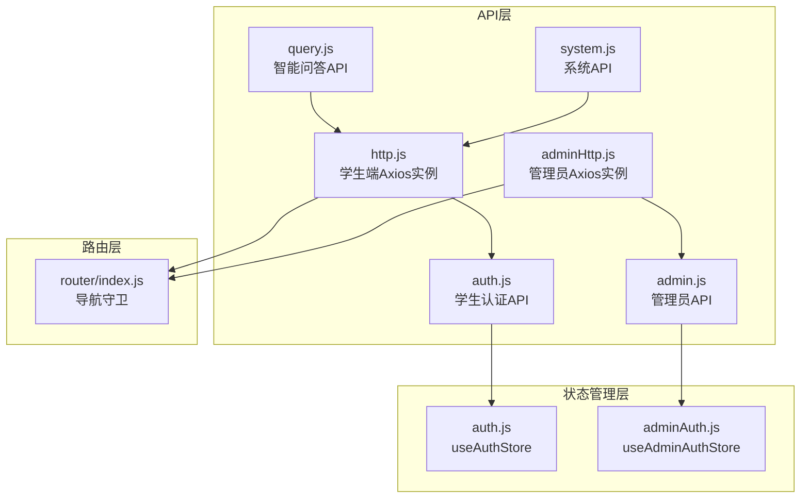
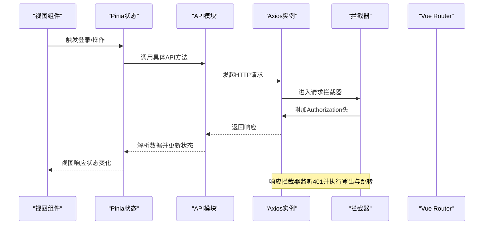
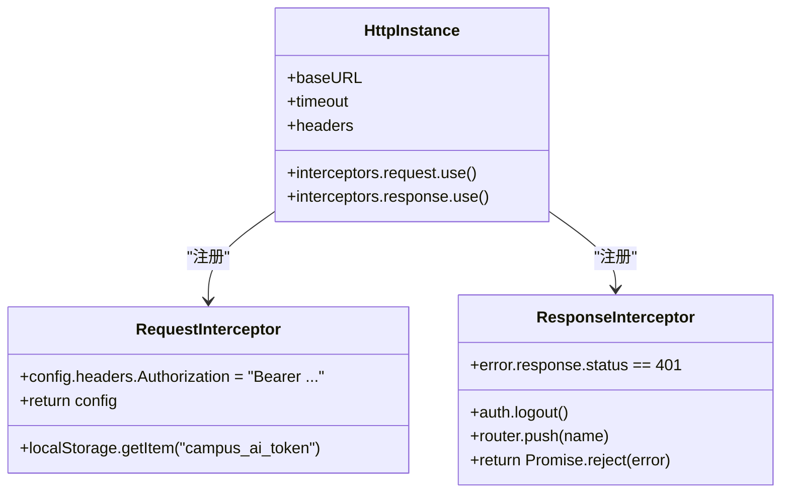
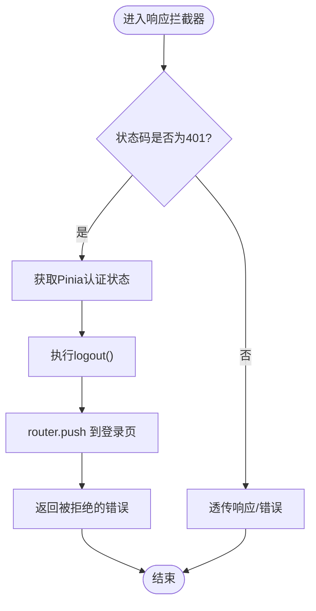
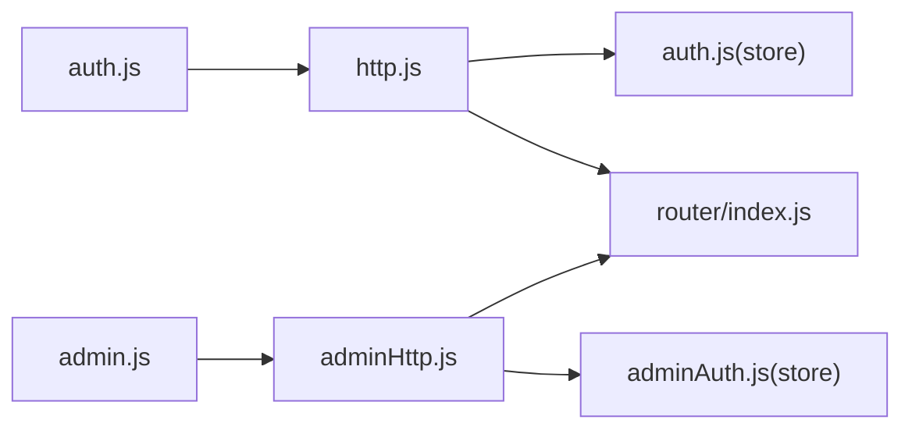

# HTTP请求配置

<cite>
**本文引用的文件**
- [frontend/ai_assistant/src/api/http.js](file://frontend/ai_assistant/src/api/http.js)
- [frontend/ai_assistant/src/api/adminHttp.js](file://frontend/ai_assistant/src/api/adminHttp.js)
- [frontend/ai_assistant/src/stores/auth.js](file://frontend/ai_assistant/src/stores/auth.js)
- [frontend/ai_assistant/src/stores/adminAuth.js](file://frontend/ai_assistant/src/stores/adminAuth.js)
- [frontend/ai_assistant/src/router/index.js](file://frontend/ai_assistant/src/router/index.js)
- [frontend/ai_assistant/src/api/auth.js](file://frontend/ai_assistant/src/api/auth.js)
- [frontend/ai_assistant/src/api/admin.js](file://frontend/ai_assistant/src/api/admin.js)
- [frontend/ai_assistant/src/api/query.js](file://frontend/ai_assistant/src/api/query.js)
- [frontend/ai_assistant/src/api/system.js](file://frontend/ai_assistant/src/api/system.js)
- [frontend/ai_assistant/src/utils/crypto.js](file://frontend/ai_assistant/src/utils/crypto.js)
- [frontend/ai_assistant/src/views/LoginView.vue](file://frontend/ai_assistant/src/views/LoginView.vue)
- [frontend/ai_assistant/src/views/AdminLoginView.vue](file://frontend/ai_assistant/src/views/AdminLoginView.vue)
</cite>

## 目录
1. [简介](#简介)
2. [项目结构](#项目结构)
3. [核心组件](#核心组件)
4. [架构总览](#架构总览)
5. [详细组件分析](#详细组件分析)
6. [依赖关系分析](#依赖关系分析)
7. [性能考虑](#性能考虑)
8. [故障排查指南](#故障排查指南)
9. [结论](#结论)
10. [附录](#附录)

## 简介
本章节面向AI校园助手项目的前端HTTP请求配置，系统性阐述基于axios的统一HTTP客户端设计与实现，重点覆盖以下方面：
- axios实例创建与基础配置（baseURL、超时、默认请求头）
- 请求拦截器设计（JWT Bearer Token自动附加机制、localStorage存储策略）
- 响应拦截器实现（401错误自动处理、用户登出与页面跳转）
- HTTP客户端使用示例与最佳实践（请求取消、并发控制、错误处理策略）

## 项目结构
前端HTTP相关代码主要位于src/api目录，围绕两个核心HTTP实例展开：
- 学生端HTTP实例：负责学生认证、智能问答、系统健康检查等
- 管理员HTTP实例：负责管理员认证、仪表盘、元数据与课表管理等

图表来源
- [frontend/ai_assistant/src/api/http.js:1-49](file://frontend/ai_assistant/src/api/http.js#L1-L49)
- [frontend/ai_assistant/src/api/adminHttp.js:1-44](file://frontend/ai_assistant/src/api/adminHttp.js#L1-L44)
- [frontend/ai_assistant/src/api/auth.js:1-36](file://frontend/ai_assistant/src/api/auth.js#L1-L36)
- [frontend/ai_assistant/src/api/admin.js:1-41](file://frontend/ai_assistant/src/api/admin.js#L1-L41)
- [frontend/ai_assistant/src/api/query.js:1-141](file://frontend/ai_assistant/src/api/query.js#L1-L141)
- [frontend/ai_assistant/src/api/system.js:1-18](file://frontend/ai_assistant/src/api/system.js#L1-L18)
- [frontend/ai_assistant/src/stores/auth.js:1-77](file://frontend/ai_assistant/src/stores/auth.js#L1-L77)
- [frontend/ai_assistant/src/stores/adminAuth.js:1-77](file://frontend/ai_assistant/src/stores/adminAuth.js#L1-L77)
- [frontend/ai_assistant/src/router/index.js:1-75](file://frontend/ai_assistant/src/router/index.js#L1-L75)

章节来源
- [frontend/ai_assistant/src/api/http.js:1-49](file://frontend/ai_assistant/src/api/http.js#L1-L49)
- [frontend/ai_assistant/src/api/adminHttp.js:1-44](file://frontend/ai_assistant/src/api/adminHttp.js#L1-L44)
- [frontend/ai_assistant/src/router/index.js:1-75](file://frontend/ai_assistant/src/router/index.js#L1-L75)

## 核心组件
本节聚焦HTTP客户端的核心配置与行为。

- axios实例创建与基础配置
  - baseURL统一为/api/v1，便于后端路由前缀管理
  - 超时时间60秒，兼顾长流程（如流式问答）与稳定性
  - 默认Content-Type为application/json，确保后端按JSON解析

- 请求拦截器
  - 在请求发起前从localStorage读取JWT令牌，并自动附加到Authorization头
  - 提供两种策略说明：直接读取localStorage（推荐，无依赖）、通过Pinia store读取（需响应式状态时）

- 响应拦截器
  - 对401未授权错误进行统一处理：清空管理员/学生认证状态，跳转至对应登录页
  - 其他错误原样抛出，交由调用方处理

章节来源
- [frontend/ai_assistant/src/api/http.js:10-47](file://frontend/ai_assistant/src/api/http.js#L10-L47)
- [frontend/ai_assistant/src/api/adminHttp.js:12-41](file://frontend/ai_assistant/src/api/adminHttp.js#L12-L41)

## 架构总览
下图展示HTTP客户端在认证、状态管理与路由之间的交互关系：

图表来源
- [frontend/ai_assistant/src/api/http.js:19-47](file://frontend/ai_assistant/src/api/http.js#L19-L47)
- [frontend/ai_assistant/src/api/adminHttp.js:20-41](file://frontend/ai_assistant/src/api/adminHttp.js#L20-L41)
- [frontend/ai_assistant/src/stores/auth.js:28-66](file://frontend/ai_assistant/src/stores/auth.js#L28-L66)
- [frontend/ai_assistant/src/stores/adminAuth.js:28-63](file://frontend/ai_assistant/src/stores/adminAuth.js#L28-L63)
- [frontend/ai_assistant/src/router/index.js:57-73](file://frontend/ai_assistant/src/router/index.js#L57-L73)

## 详细组件分析

### 学生端HTTP实例（http.js）
- 功能要点
  - 创建axios实例，设置baseURL、timeout与默认Content-Type
  - 请求拦截：从localStorage读取令牌并附加到Authorization头
  - 响应拦截：捕获401错误，调用useAuthStore.logout并跳转登录页

- 关键实现路径
  - 实例创建与拦截器注册：[frontend/ai_assistant/src/api/http.js:10-47](file://frontend/ai_assistant/src/api/http.js#L10-L47)
  - 认证状态管理（登录/登出/过期判断）：[frontend/ai_assistant/src/stores/auth.js:17-76](file://frontend/ai_assistant/src/stores/auth.js#L17-L76)
  - 登录视图中对401错误的友好提示：[frontend/ai_assistant/src/views/LoginView.vue:107-121](file://frontend/ai_assistant/src/views/LoginView.vue#L107-L121)

- 使用示例
  - 学生认证API调用：[frontend/ai_assistant/src/api/auth.js:15-35](file://frontend/ai_assistant/src/api/auth.js#L15-L35)
  - 智能问答API调用（非流式）：[frontend/ai_assistant/src/api/query.js:11-13](file://frontend/ai_assistant/src/api/query.js#L11-L13)
  - 系统健康检查：[frontend/ai_assistant/src/api/system.js:10-12](file://frontend/ai_assistant/src/api/system.js#L10-L12)

章节来源
- [frontend/ai_assistant/src/api/http.js:10-47](file://frontend/ai_assistant/src/api/http.js#L10-L47)
- [frontend/ai_assistant/src/stores/auth.js:17-76](file://frontend/ai_assistant/src/stores/auth.js#L17-L76)
- [frontend/ai_assistant/src/views/LoginView.vue:107-121](file://frontend/ai_assistant/src/views/LoginView.vue#L107-L121)
- [frontend/ai_assistant/src/api/auth.js:15-35](file://frontend/ai_assistant/src/api/auth.js#L15-L35)
- [frontend/ai_assistant/src/api/query.js:11-13](file://frontend/ai_assistant/src/api/query.js#L11-L13)
- [frontend/ai_assistant/src/api/system.js:10-12](file://frontend/ai_assistant/src/api/system.js#L10-L12)

### 管理员HTTP实例（adminHttp.js）
- 功能要点
  - 与学生端类似，但使用独立的localStorage键值与管理员store
  - 响应拦截器针对管理员401错误，清理管理员状态并跳转管理员登录页

- 关键实现路径
  - 实例创建与拦截器注册：[frontend/ai_assistant/src/api/adminHttp.js:12-41](file://frontend/ai_assistant/src/api/adminHttp.js#L12-L41)
  - 管理员认证状态管理（登录/登出/过期判断）：[frontend/ai_assistant/src/stores/adminAuth.js:16-76](file://frontend/ai_assistant/src/stores/adminAuth.js#L16-L76)
  - 管理员登录视图中对401/403错误的友好提示：[frontend/ai_assistant/src/views/AdminLoginView.vue:88-105](file://frontend/ai_assistant/src/views/AdminLoginView.vue#L88-L105)

- 使用示例
  - 管理员认证与仪表盘API调用：[frontend/ai_assistant/src/api/admin.js:7-40](file://frontend/ai_assistant/src/api/admin.js#L7-L40)

章节来源
- [frontend/ai_assistant/src/api/adminHttp.js:12-41](file://frontend/ai_assistant/src/api/adminHttp.js#L12-L41)
- [frontend/ai_assistant/src/stores/adminAuth.js:16-76](file://frontend/ai_assistant/src/stores/adminAuth.js#L16-L76)
- [frontend/ai_assistant/src/views/AdminLoginView.vue:88-105](file://frontend/ai_assistant/src/views/AdminLoginView.vue#L88-L105)
- [frontend/ai_assistant/src/api/admin.js:7-40](file://frontend/ai_assistant/src/api/admin.js#L7-L40)

### 流式问答与SSE兼容（query.js）
- 功能要点
  - 非流式问答：复用学生端HTTP实例
  - 流式问答：使用原生fetch手动拼装Authorization头，兼容SSE与兼容模式
  - 自动解析SSE数据块，兜底处理未发送done包的情况

- 关键实现路径
  - 流式问答实现与SSE解析：[frontend/ai_assistant/src/api/query.js:28-141](file://frontend/ai_assistant/src/api/query.js#L28-L141)

- 使用示例
  - 流式问答调用：[frontend/ai_assistant/src/views/ChatView.vue:1-200](file://frontend/ai_assistant/src/views/ChatView.vue#L1-L200)

章节来源
- [frontend/ai_assistant/src/api/query.js:28-141](file://frontend/ai_assistant/src/api/query.js#L28-L141)

### 密码加密工具（crypto.js）
- 功能要点
  - 使用AES-CBC对密码进行加密，输出格式为iv_base64:ciphertext_base64
  - 采用URL安全Base64编码，适配前后端一致的传输格式

- 关键实现路径
  - 加密实现与格式化：[frontend/ai_assistant/src/utils/crypto.js:26-40](file://frontend/ai_assistant/src/utils/crypto.js#L26-L40)

章节来源
- [frontend/ai_assistant/src/utils/crypto.js:26-40](file://frontend/ai_assistant/src/utils/crypto.js#L26-L40)

### 请求拦截器工作流（类图）

图表来源
- [frontend/ai_assistant/src/api/http.js:10-47](file://frontend/ai_assistant/src/api/http.js#L10-L47)

### 响应拦截器处理流程（流程图）

图表来源
- [frontend/ai_assistant/src/api/http.js:37-47](file://frontend/ai_assistant/src/api/http.js#L37-L47)
- [frontend/ai_assistant/src/api/adminHttp.js:31-41](file://frontend/ai_assistant/src/api/adminHttp.js#L31-L41)

## 依赖关系分析
- 组件耦合
  - API模块依赖HTTP实例；HTTP实例依赖Pinia store用于401时的登出
  - 路由层通过导航守卫配合store实现访问控制
- 外部依赖
  - axios用于HTTP请求
  - Vue Router用于页面跳转
  - Pinia用于状态管理
- 可能的循环依赖
  - 当前结构清晰，API模块仅单向依赖HTTP实例，避免循环

图表来源
- [frontend/ai_assistant/src/api/auth.js:1-36](file://frontend/ai_assistant/src/api/auth.js#L1-L36)
- [frontend/ai_assistant/src/api/admin.js:1-41](file://frontend/ai_assistant/src/api/admin.js#L1-L41)
- [frontend/ai_assistant/src/api/http.js:1-49](file://frontend/ai_assistant/src/api/http.js#L1-L49)
- [frontend/ai_assistant/src/api/adminHttp.js:1-44](file://frontend/ai_assistant/src/api/adminHttp.js#L1-L44)
- [frontend/ai_assistant/src/stores/auth.js:1-77](file://frontend/ai_assistant/src/stores/auth.js#L1-L77)
- [frontend/ai_assistant/src/stores/adminAuth.js:1-77](file://frontend/ai_assistant/src/stores/adminAuth.js#L1-L77)
- [frontend/ai_assistant/src/router/index.js:1-75](file://frontend/ai_assistant/src/router/index.js#L1-L75)

## 性能考虑
- 超时设置
  - 60秒超时适用于长流程（如流式问答），同时避免长时间挂起
- 并发控制
  - 建议在业务层引入请求去重与并发上限控制，避免重复请求与资源浪费
- 缓存策略
  - 对于非敏感查询结果，可在应用层引入轻量缓存，减少重复请求
- 体积与加载
  - 将axios与拦截器集中管理，避免重复导入，降低打包体积

## 故障排查指南
- 401未授权
  - 现象：接口返回401，自动触发登出并跳转登录页
  - 排查：确认localStorage中的令牌是否存在且未过期；检查后端签发的token是否正确
  - 参考实现：[frontend/ai_assistant/src/api/http.js:37-47](file://frontend/ai_assistant/src/api/http.js#L37-L47)、[frontend/ai_assistant/src/api/adminHttp.js:31-41](file://frontend/ai_assistant/src/api/adminHttp.js#L31-L41)
- 登录失败
  - 学生端：401时提示“学号或密码错误”，其他错误提示“网络异常”
    - 参考实现：[frontend/ai_assistant/src/views/LoginView.vue:107-121](file://frontend/ai_assistant/src/views/LoginView.vue#L107-L121)
  - 管理员端：401提示“用户名或密码错误”，403提示“账号不可用”
    - 参考实现：[frontend/ai_assistant/src/views/AdminLoginView.vue:88-105](file://frontend/ai_assistant/src/views/AdminLoginView.vue#L88-L105)
- 流式问答异常
  - 现象：SSE解析失败或未收到done包
  - 排查：确认后端SSE输出格式；前端已做兜底，若仍异常可回退至非流式接口
  - 参考实现：[frontend/ai_assistant/src/api/query.js:78-141](file://frontend/ai_assistant/src/api/query.js#L78-L141)

章节来源
- [frontend/ai_assistant/src/api/http.js:37-47](file://frontend/ai_assistant/src/api/http.js#L37-L47)
- [frontend/ai_assistant/src/api/adminHttp.js:31-41](file://frontend/ai_assistant/src/api/adminHttp.js#L31-L41)
- [frontend/ai_assistant/src/views/LoginView.vue:107-121](file://frontend/ai_assistant/src/views/LoginView.vue#L107-L121)
- [frontend/ai_assistant/src/views/AdminLoginView.vue:88-105](file://frontend/ai_assistant/src/views/AdminLoginView.vue#L88-L105)
- [frontend/ai_assistant/src/api/query.js:78-141](file://frontend/ai_assistant/src/api/query.js#L78-L141)

## 结论
本HTTP请求配置以axios为核心，通过统一实例与拦截器实现了：
- 一致的baseURL与超时策略
- 自动化的JWT Bearer Token附加
- 401错误的统一登出与跳转
- 面向学生的智能问答与系统接口支持，以及面向管理员的完整后台接口支持

该设计具备良好的扩展性与可维护性，建议在后续迭代中进一步完善并发控制、请求取消与错误恢复策略。

## 附录

### HTTP客户端使用示例与最佳实践
- 基础请求
  - 学生认证：[frontend/ai_assistant/src/api/auth.js:15-35](file://frontend/ai_assistant/src/api/auth.js#L15-L35)
  - 管理员认证：[frontend/ai_assistant/src/api/admin.js:7-12](file://frontend/ai_assistant/src/api/admin.js#L7-L12)
  - 系统健康检查：[frontend/ai_assistant/src/api/system.js:10-12](file://frontend/ai_assistant/src/api/system.js#L10-L12)
- 流式问答
  - 使用原生fetch手动拼装Authorization头，兼容SSE与兼容模式
  - 参考实现：[frontend/ai_assistant/src/api/query.js:28-141](file://frontend/ai_assistant/src/api/query.js#L28-L141)
- 最佳实践
  - 请求取消：在组件卸载或路由切换时取消未完成请求，避免内存泄漏
  - 并发控制：限制同一接口的并发请求数，必要时引入请求去重
  - 错误处理：区分401/403/网络错误，分别给出用户提示与自动登出
  - 令牌管理：优先使用localStorage存储，必要时结合Pinia store保持UI响应式