# 查询API模块

<cite>
**本文档引用的文件**
- [query.py](file://service/ai_assistant/app/routers/query.py)
- [query_service.py](file://service/ai_assistant/app/services/query_service.py)
- [query.js](file://frontend/ai_assistant/src/api/query.js)
- [query.py](file://service/ai_assistant/app/schemas/query.py)
- [langchain_service.py](file://service/ai_assistant/app/services/langchain_service.py)
- [media_service.py](file://service/ai_assistant/app/services/media_service.py)
- [intent_service.py](file://service/ai_assistant/app/services/intent_service.py)
- [cache_service.py](file://service/ai_assistant/app/services/cache_service.py)
- [chat_log_service.py](file://service/ai_assistant/app/services/chat_log_service.py)
- [safety_service.py](file://service/ai_assistant/app/services/safety_service.py)
- [config.py](file://service/ai_assistant/app/config.py)
- [models.py](file://service/ai_assistant/app/models/models.py)
- [chat.js](file://frontend/ai_assistant/src/stores/chat.js)
</cite>

## 目录
1. [简介](#简介)
2. [项目结构](#项目结构)
3. [核心组件](#核心组件)
4. [架构概览](#架构概览)
5. [详细组件分析](#详细组件分析)
6. [依赖关系分析](#依赖关系分析)
7. [性能考虑](#性能考虑)
8. [故障排除指南](#故障排除指南)
9. [结论](#结论)
10. [附录](#附录)

## 简介

AI校园助手项目的查询API模块是一个高度集成的多模态智能问答系统，支持文本、图像和语音三种输入方式。该模块实现了完整的查询处理流水线，包括多模态输入解码、安全检查、意图分类、查询执行、答案生成和缓存管理等功能。

系统采用FastAPI框架构建，后端服务通过LangChain和DashScope API提供强大的语言模型能力，前端使用Vue.js和Pinia进行状态管理。整个系统注重用户体验，提供了实时流式响应和会话状态维护功能。

## 项目结构

查询API模块主要分布在以下目录结构中：

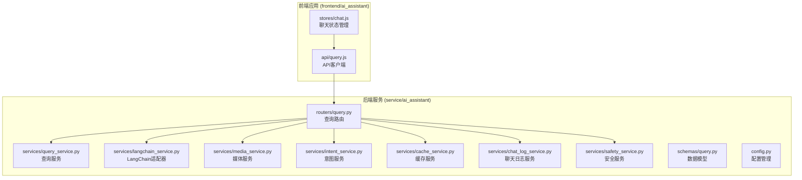

**图表来源**
- [query.py:1-788](file://service/ai_assistant/app/routers/query.py#L1-L788)
- [query_service.py:1-800](file://service/ai_assistant/app/services/query_service.py#L1-L800)
- [query.js:1-141](file://frontend/ai_assistant/src/api/query.js#L1-L141)

**章节来源**
- [query.py:1-788](file://service/ai_assistant/app/routers/query.py#L1-L788)
- [query_service.py:1-800](file://service/ai_assistant/app/services/query_service.py#L1-L800)
- [query.js:1-141](file://frontend/ai_assistant/src/api/query.js#L1-L141)

## 核心组件

### 查询路由层 (Query Router)

查询路由层是整个API的入口点，负责接收和处理来自客户端的查询请求。它实现了统一的查询处理流程，包括多模态输入解码、安全检查、意图分类和响应生成。

主要功能特性：
- 支持文本、图像、语音三种输入方式
- 实时流式响应和JSON响应两种输出模式
- 会话状态管理和历史记录维护
- 缓存机制和错误处理

### 查询服务层 (Query Service)

查询服务层负责具体的查询执行逻辑，包括结构化查询、向量检索和混合查询的协调处理。它提供了丰富的数据库操作能力和智能查询优化功能。

核心能力：
- 结构化SQL查询执行
- 向量知识库检索
- 混合查询策略
- 学期ID自动解析
- 课表智能分析

### 媒体服务层 (Media Service)

媒体服务层专门处理图像和语音的多模态输入，通过DashScope API提供高质量的媒体理解能力。

主要功能：
- 图像内容识别和描述生成
- 语音转文字ASR处理
- 媒体格式转换和优化
- 多模态内容融合

**章节来源**
- [query.py:198-745](file://service/ai_assistant/app/routers/query.py#L198-L745)
- [query_service.py:575-800](file://service/ai_assistant/app/services/query_service.py#L575-L800)
- [media_service.py:115-246](file://service/ai_assistant/app/services/media_service.py#L115-L246)

## 架构概览

查询API模块采用了分层架构设计，各层之间职责明确，耦合度低，便于维护和扩展。

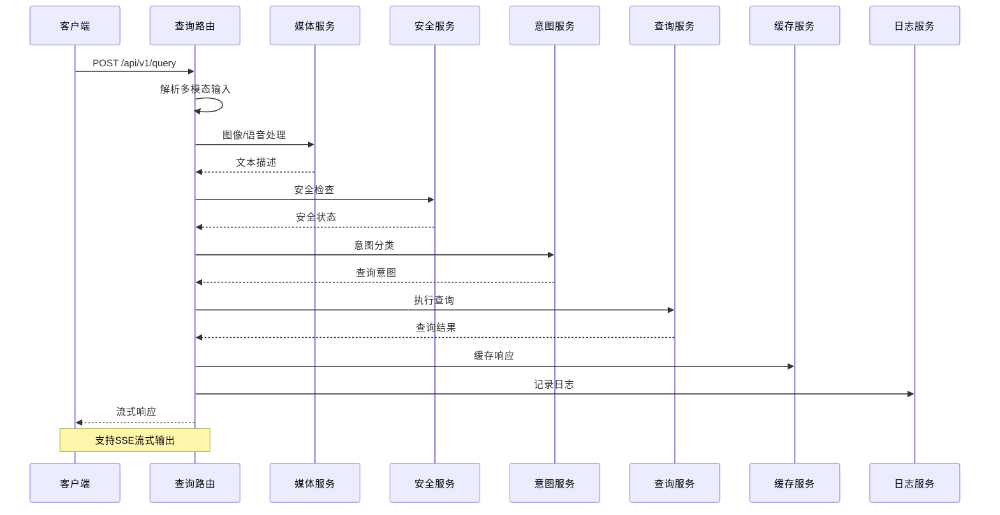

**图表来源**
- [query.py:207-745](file://service/ai_assistant/app/routers/query.py#L207-L745)
- [media_service.py:115-246](file://service/ai_assistant/app/services/media_service.py#L115-L246)
- [safety_service.py:84-144](file://service/ai_assistant/app/services/safety_service.py#L84-L144)

### 数据流架构

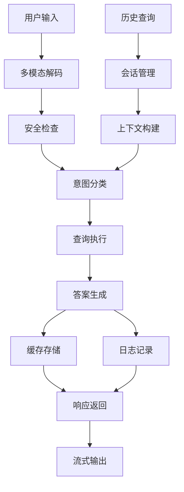

**图表来源**
- [query.py:227-549](file://service/ai_assistant/app/routers/query.py#L227-L549)
- [cache_service.py:92-177](file://service/ai_assistant/app/services/cache_service.py#L92-L177)

## 详细组件分析

### 查询路由实现

查询路由实现了完整的查询处理流水线，包括输入验证、多模态解码、安全检查、意图分类和响应生成等步骤。

#### 多模态输入处理

系统支持三种输入方式的灵活组合：

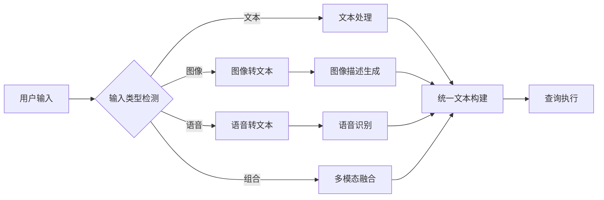

**图表来源**
- [query.py:230-273](file://service/ai_assistant/app/routers/query.py#L230-L273)

#### 安全检查机制

系统内置多层次的安全检查机制，确保查询内容的安全性和合规性：

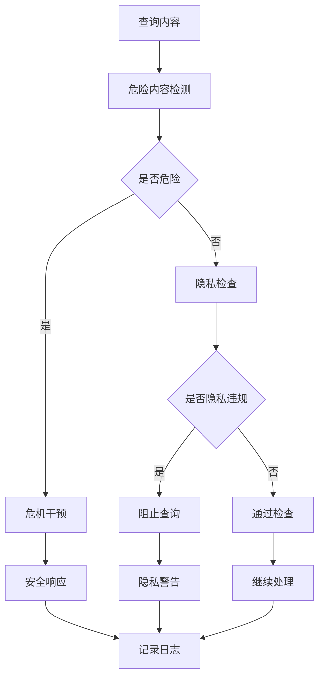

**图表来源**
- [query.py:350-470](file://service/ai_assistant/app/routers/query.py#L350-L470)
- [safety_service.py:84-144](file://service/ai_assistant/app/services/safety_service.py#L84-L144)

#### 缓存策略

系统采用智能缓存策略，平衡响应速度和数据准确性：

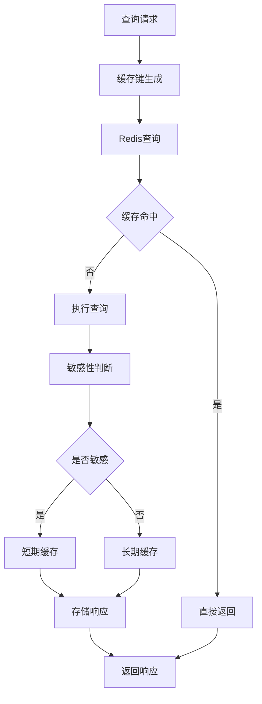

**图表来源**
- [cache_service.py:92-177](file://service/ai_assistant/app/services/cache_service.py#L92-L177)

### 查询服务实现

查询服务层提供了强大的查询执行能力，支持多种查询模式和数据源。

#### 结构化查询执行

系统能够自动识别和执行结构化查询，包括成绩查询、课表查询、个人信息查询等：

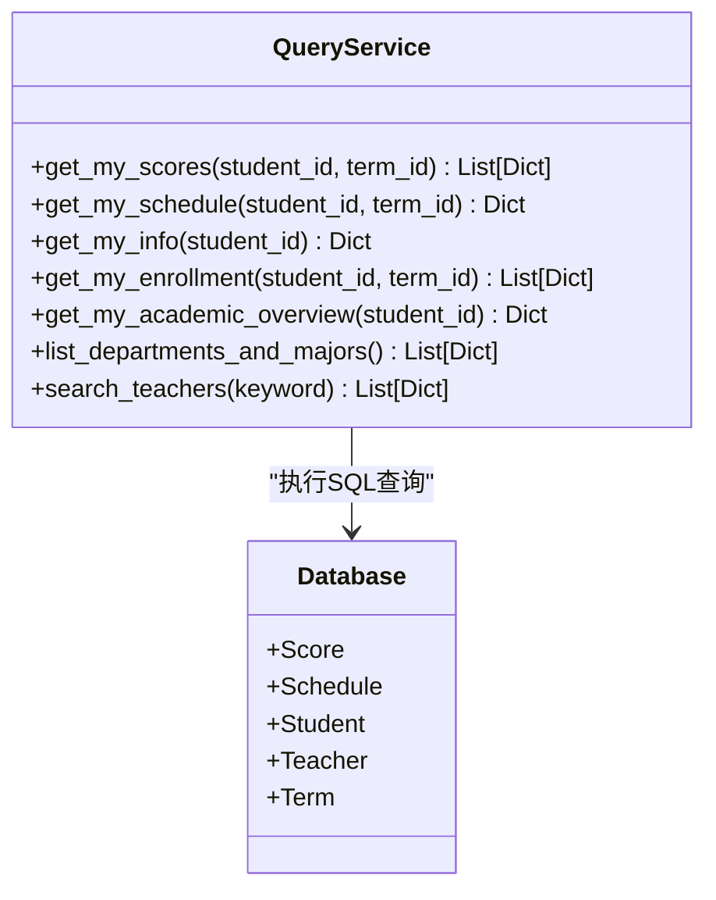

**图表来源**
- [query_service.py:575-800](file://service/ai_assistant/app/services/query_service.py#L575-L800)

#### 向量检索集成

系统集成了向量知识库检索功能，能够处理复杂的语义查询：

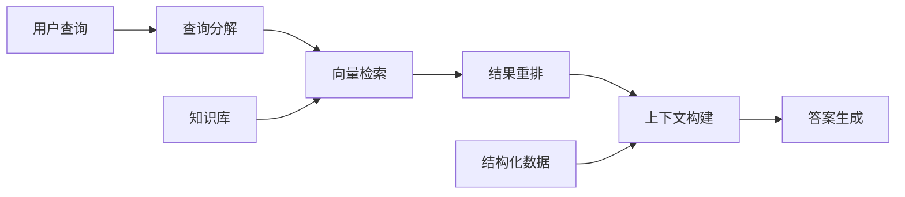

**图表来源**
- [query_service.py:150-210](file://service/ai_assistant/app/services/query_service.py#L150-L210)

### 媒体服务实现

媒体服务层提供了高质量的多模态处理能力，通过DashScope API实现专业的媒体理解。

#### 图像处理流程

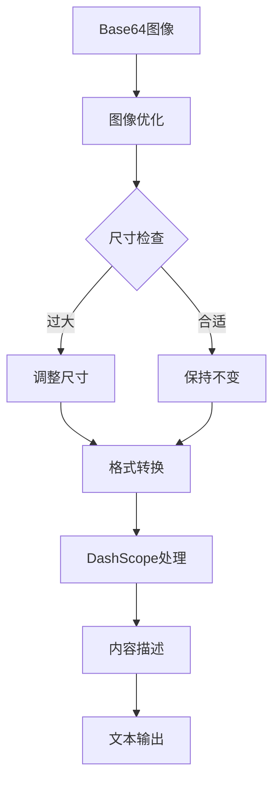

**图表来源**
- [media_service.py:23-156](file://service/ai_assistant/app/services/media_service.py#L23-L156)

#### 语音处理流程

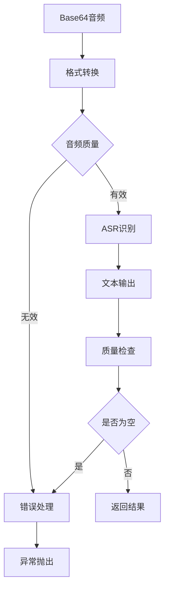

**图表来源**
- [media_service.py:159-246](file://service/ai_assistant/app/services/media_service.py#L159-L246)

### 前端集成实现

前端应用通过专门的API客户端与后端服务进行交互，提供了完整的用户界面和交互体验。

#### 流式响应处理

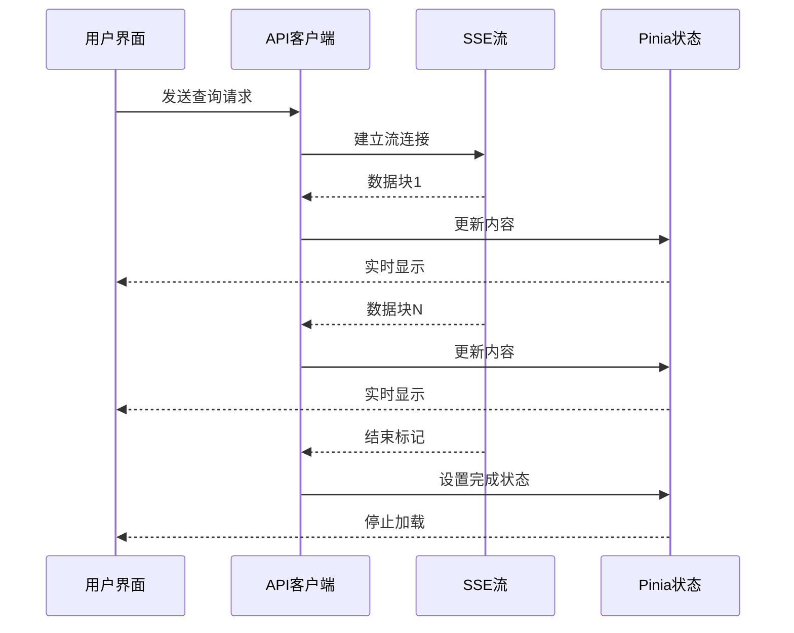

**图表来源**
- [query.js:28-141](file://frontend/ai_assistant/src/api/query.js#L28-L141)
- [chat.js:189-230](file://frontend/ai_assistant/src/stores/chat.js#L189-L230)

#### 会话管理

前端实现了完整的会话管理功能，包括会话创建、切换、删除和持久化：

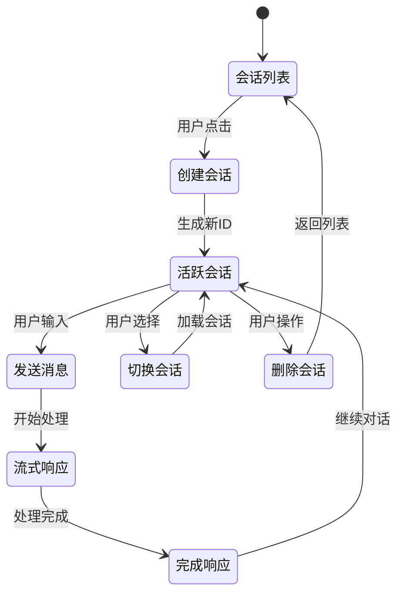

**图表来源**
- [chat.js:66-116](file://frontend/ai_assistant/src/stores/chat.js#L66-L116)

**章节来源**
- [query.py:115-125](file://service/ai_assistant/app/routers/query.py#L115-L125)
- [query_service.py:1-800](file://service/ai_assistant/app/services/query_service.py#L1-L800)
- [media_service.py:1-246](file://service/ai_assistant/app/services/media_service.py#L1-L246)
- [query.js:1-141](file://frontend/ai_assistant/src/api/query.js#L1-L141)
- [chat.js:1-278](file://frontend/ai_assistant/src/stores/chat.js#L1-L278)

## 依赖关系分析

查询API模块的依赖关系体现了清晰的分层架构设计，各组件之间的耦合度低，便于独立开发和测试。

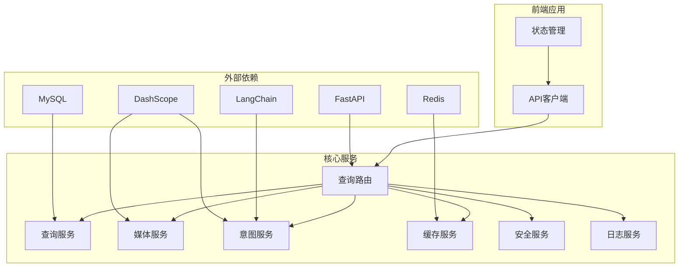

**图表来源**
- [query.py:25-44](file://service/ai_assistant/app/routers/query.py#L25-L44)
- [config.py:48-83](file://service/ai_assistant/app/config.py#L48-L83)

### 组件间通信

系统采用事件驱动和异步处理的方式实现组件间的松耦合通信：

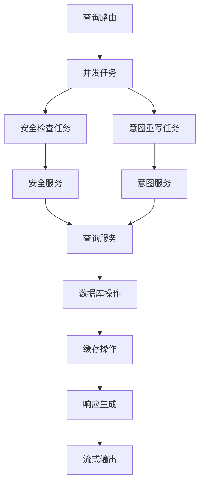

**图表来源**
- [query.py:347-352](file://service/ai_assistant/app/routers/query.py#L347-L352)

**章节来源**
- [query.py:1-788](file://service/ai_assistant/app/routers/query.py#L1-L788)
- [config.py:1-113](file://service/ai_assistant/app/config.py#L1-L113)

## 性能考虑

查询API模块在设计时充分考虑了性能优化，采用了多种策略来提升系统的响应速度和吞吐量。

### 缓存优化策略

系统实现了多层次的缓存机制，包括内存缓存、Redis缓存和数据库缓存：

- **短期缓存**：针对敏感查询使用30分钟TTL，确保数据安全性
- **长期缓存**：针对普通查询使用24小时TTL，提升响应速度
- **会话缓存**：基于DID和会话ID的隔离缓存，避免数据串扰

### 并发处理优化

系统采用异步并发处理模式，充分利用系统资源：

- **并行任务**：安全检查和查询重写同时执行
- **异步I/O**：数据库和外部API调用采用异步模式
- **流式处理**：支持实时流式响应，减少等待时间

### 内存和CPU优化

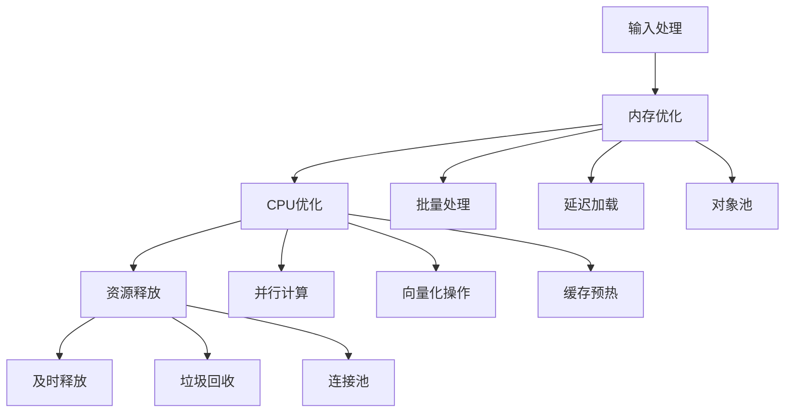

**图表来源**
- [query.py:654-658](file://service/ai_assistant/app/routers/query.py#L654-L658)

## 故障排除指南

### 常见问题诊断

#### 媒体处理错误

**问题现象**：图像或语音处理失败，返回502错误

**可能原因**：
- 媒体格式不支持
- 文件大小超出限制
- 外部API调用失败

**解决方案**：
- 检查媒体文件格式和大小
- 验证DashScope API配置
- 查看服务器日志获取详细错误信息

#### 缓存相关问题

**问题现象**：查询结果不准确或过期

**可能原因**：
- 缓存键生成冲突
- 缓存过期时间设置不当
- 缓存版本不一致

**解决方案**：
- 检查缓存键格式和版本
- 调整缓存TTL设置
- 手动清理相关缓存键

#### 安全检查误判

**问题现象**：正常查询被标记为危险内容

**可能原因**：
- LLM模型误判
- 正则表达式过于严格
- 上下文理解偏差

**解决方案**：
- 调整安全检查阈值
- 更新正则表达式规则
- 优化LLM提示词

### 调试技巧

#### 日志分析

系统提供了详细的日志记录机制，便于问题诊断：

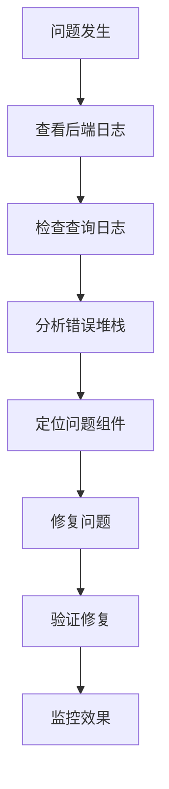

**图表来源**
- [query.py:217-225](file://service/ai_assistant/app/routers/query.py#L217-L225)

#### 性能监控

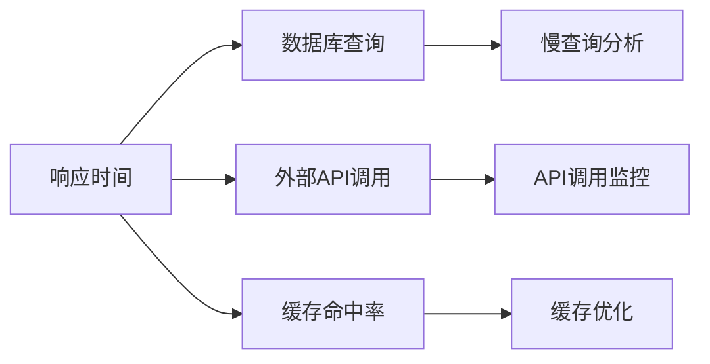

**图表来源**
- [query.py:289-290](file://service/ai_assistant/app/routers/query.py#L289-L290)

**章节来源**
- [query.py:142-151](file://service/ai_assistant/app/routers/query.py#L142-L151)
- [media_service.py:100-113](file://service/ai_assistant/app/services/media_service.py#L100-L113)
- [cache_service.py:92-147](file://service/ai_assistant/app/services/cache_service.py#L92-L147)

## 结论

AI校园助手项目的查询API模块是一个功能完整、架构清晰的多模态智能问答系统。它成功地将多种技术整合在一起，为用户提供了一站式的校园信息服务。

### 主要优势

1. **多模态支持**：全面支持文本、图像、语音三种输入方式
2. **智能处理**：具备意图识别、安全检查、上下文理解等高级功能
3. **高性能**：采用缓存、并发处理等优化策略
4. **易扩展**：模块化设计便于功能扩展和维护
5. **用户体验**：提供实时流式响应和完整的会话管理

### 技术亮点

- **LangChain集成**：利用LangChain的强大提示工程能力
- **DashScope API**：借助阿里云的专业AI服务能力
- **Redis缓存**：实现高效的响应加速
- **SSE流式传输**：提供流畅的用户体验
- **隐私保护**：严格的隐私数据处理机制

### 发展建议

1. **模型优化**：持续优化LLM模型配置和提示词设计
2. **性能监控**：建立更完善的性能监控和告警机制
3. **功能扩展**：根据用户反馈增加新的查询能力
4. **安全加固**：进一步完善安全检查和防护机制
5. **用户体验**：优化界面设计和交互流程

## 附录

### API使用示例

#### 基础查询调用

```javascript
// 文本查询
const response = await queryApi.ask({
  text: "我的课表是什么？",
  session_id: "session-123"
});

// 图片查询
const response = await queryApi.ask({
  image_base64: "base64编码的图片",
  text: "解释这张图片的内容"
});

// 语音查询
const response = await queryApi.ask({
  audio_base64: "base64编码的音频",
  text: "语音转文字"
});
```

#### 流式响应处理

```javascript
// 流式查询
await queryApi.askStream({
  text: "帮我查询成绩",
  session_id: "session-123"
}, (data) => {
  if (data.done) {
    console.log('查询完成');
  } else {
    console.log('实时内容:', data.chunk);
  }
}, (error) => {
  console.error('查询错误:', error);
});
```

### 配置参数说明

#### 关键配置项

| 配置项 | 默认值 | 说明 |
|--------|--------|------|
| MAX_HISTORY_COUNT | 10 | 最大历史记录数量 |
| CACHE_TTL_SENSITIVE | 1800 | 敏感查询缓存TTL(秒) |
| CACHE_TTL_NORMAL | 86400 | 普通查询缓存TTL(秒) |
| DASHSCOPE_MAX_INPUT_CHARS | 28000 | DashScope最大输入字符数 |

#### 模型配置

| 模型用途 | 默认模型 | 说明 |
|----------|----------|------|
| 意图分类 | qwen-turbo | 查询意图识别 |
| 查询重写 | qwen-turbo | 上下文重写 |
| 最终回答 | qwen-plus | 答案生成 |
| 安全检查 | qwen-turbo | 内容安全检测 |
| 图像理解 | qwen-vl-plus | 图像内容理解 |
| 语音识别 | paraformer-realtime-v1 | 实时语音识别 |

### 错误码对照表

| 错误码 | 描述 | 处理建议 |
|--------|------|----------|
| 400 | 参数错误 | 检查请求参数格式 |
| 401 | 未授权 | 重新登录获取令牌 |
| 403 | 权限不足 | 检查用户权限 |
| 502 | 服务不可用 | 稍后重试或检查服务状态 |
| 504 | 网关超时 | 检查网络连接和服务器状态 |