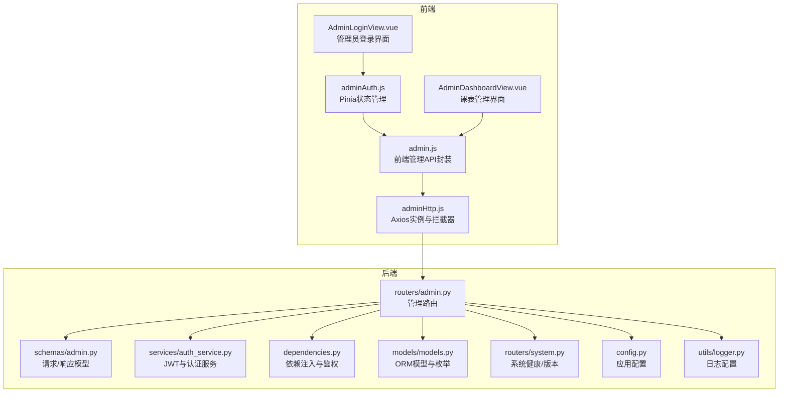
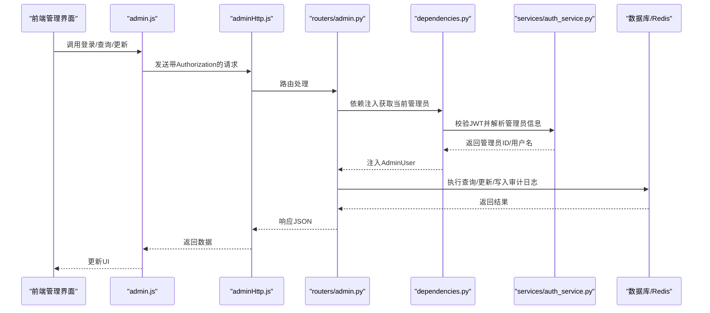
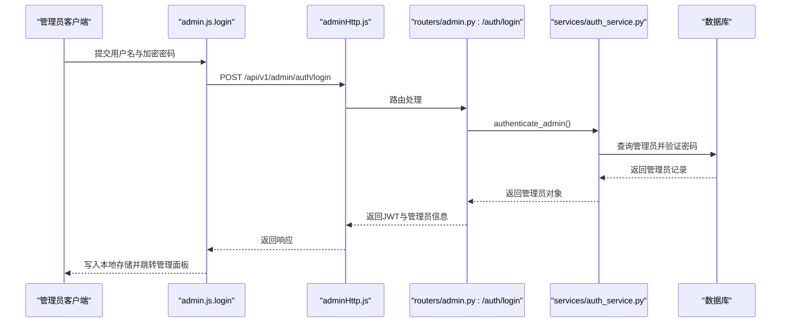
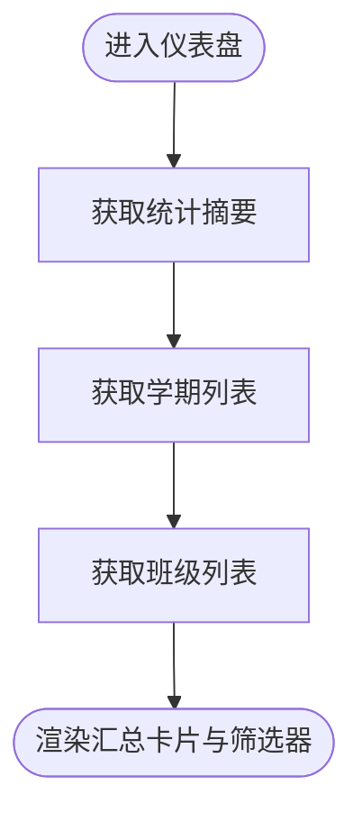
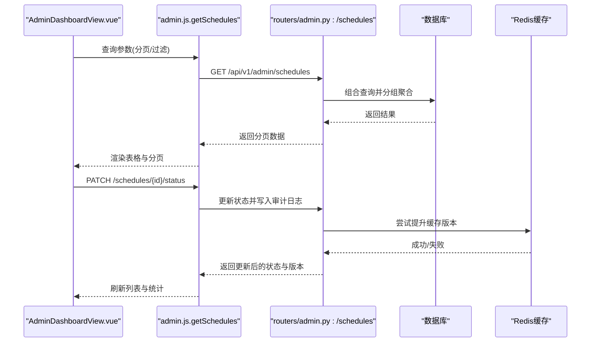
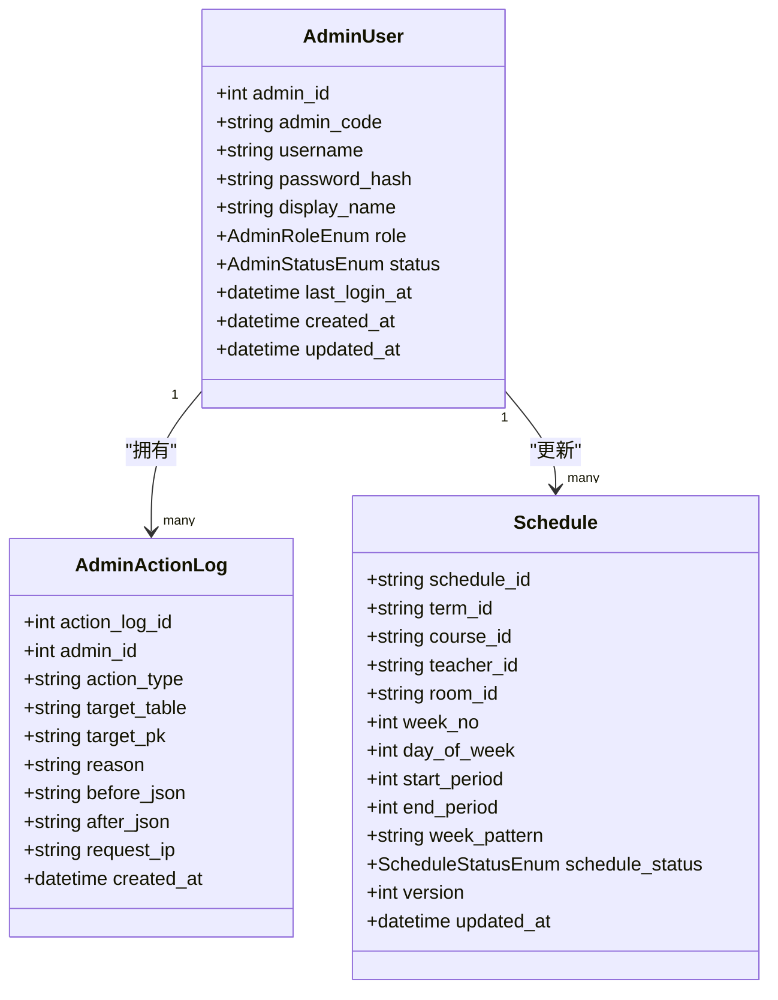
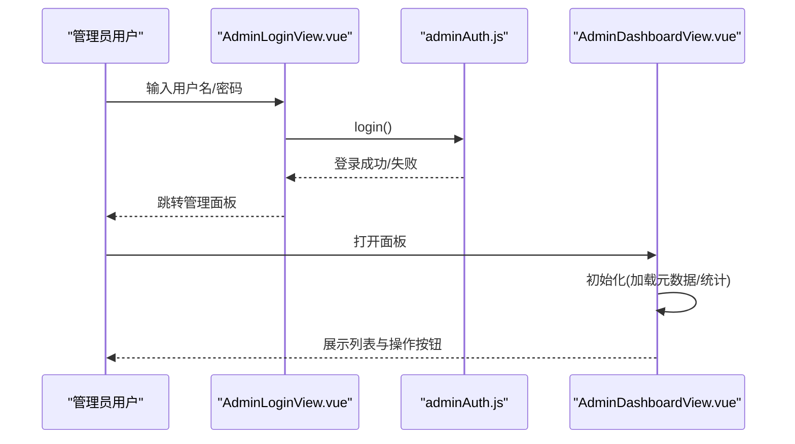
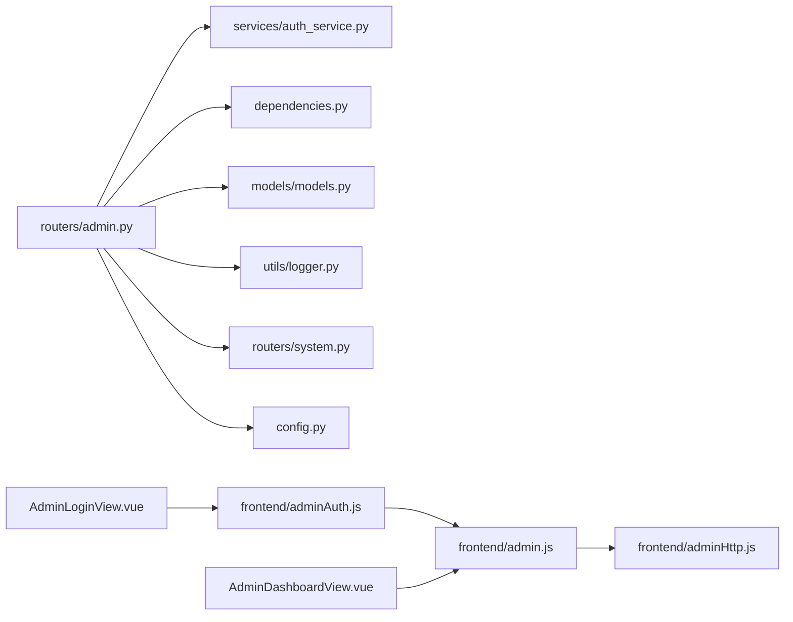

# 管理API模块

<cite>
**本文档引用的文件**
- [service/ai_assistant/app/routers/admin.py](file://service/ai_assistant/app/routers/admin.py)
- [service/ai_assistant/app/schemas/admin.py](file://service/ai_assistant/app/schemas/admin.py)
- [service/ai_assistant/app/services/auth_service.py](file://service/ai_assistant/app/services/auth_service.py)
- [service/ai_assistant/app/dependencies.py](file://service/ai_assistant/app/dependencies.py)
- [service/ai_assistant/app/models/models.py](file://service/ai_assistant/app/models/models.py)
- [service/ai_assistant/app/utils/logger.py](file://service/ai_assistant/app/utils/logger.py)
- [service/ai_assistant/app/routers/system.py](file://service/ai_assistant/app/routers/system.py)
- [service/ai_assistant/app/config.py](file://service/ai_assistant/app/config.py)
- [frontend/ai_assistant/src/api/admin.js](file://frontend/ai_assistant/src/api/admin.js)
- [frontend/ai_assistant/src/api/adminHttp.js](file://frontend/ai_assistant/src/api/adminHttp.js)
- [frontend/ai_assistant/src/stores/adminAuth.js](file://frontend/ai_assistant/src/stores/adminAuth.js)
- [frontend/ai_assistant/src/views/AdminDashboardView.vue](file://frontend/ai_assistant/src/views/AdminDashboardView.vue)
- [frontend/ai_assistant/src/views/AdminLoginView.vue](file://frontend/ai_assistant/src/views/AdminLoginView.vue)
</cite>

## 目录
1. [简介](#简介)
2. [项目结构](#项目结构)
3. [核心组件](#核心组件)
4. [架构总览](#架构总览)
5. [详细组件分析](#详细组件分析)
6. [依赖关系分析](#依赖关系分析)
7. [性能考虑](#性能考虑)
8. [故障排查指南](#故障排查指南)
9. [结论](#结论)
10. [附录](#附录)

## 简介
本文件面向AI校园助手项目的管理API模块，系统性阐述管理员后台相关接口的设计与实现，包括管理员认证与权限、课表状态管理、元数据查询、仪表盘统计等能力。文档覆盖从后端FastAPI路由、Pydantic数据模型、认证与权限依赖注入，到前端Axios封装、Pinia状态管理与Vue视图组件的完整链路，并提供安全控制、批量分页查询、审计日志与缓存策略的技术细节与最佳实践。

## 项目结构
管理API模块由“后端路由层 + 服务层 + 数据模型 + 前端API封装 + 视图组件”构成，采用前后端分离架构，后端通过FastAPI提供REST接口，前端通过Axios实例统一发送请求并携带JWT令牌。

图表来源
- [service/ai_assistant/app/routers/admin.py:48-388](file://service/ai_assistant/app/routers/admin.py#L48-L388)
- [service/ai_assistant/app/schemas/admin.py:11-105](file://service/ai_assistant/app/schemas/admin.py#L11-L105)
- [service/ai_assistant/app/services/auth_service.py:63-123](file://service/ai_assistant/app/services/auth_service.py#L63-L123)
- [service/ai_assistant/app/dependencies.py:75-109](file://service/ai_assistant/app/dependencies.py#L75-L109)
- [service/ai_assistant/app/models/models.py:28-112](file://service/ai_assistant/app/models/models.py#L28-L112)
- [service/ai_assistant/app/routers/system.py:22-38](file://service/ai_assistant/app/routers/system.py#L22-L38)
- [service/ai_assistant/app/config.py:6-113](file://service/ai_assistant/app/config.py#L6-L113)
- [frontend/ai_assistant/src/api/admin.js:6-41](file://frontend/ai_assistant/src/api/admin.js#L6-L41)
- [frontend/ai_assistant/src/api/adminHttp.js:12-44](file://frontend/ai_assistant/src/api/adminHttp.js#L12-L44)
- [frontend/ai_assistant/src/stores/adminAuth.js:16-77](file://frontend/ai_assistant/src/stores/adminAuth.js#L16-L77)
- [frontend/ai_assistant/src/views/AdminDashboardView.vue:178-361](file://frontend/ai_assistant/src/views/AdminDashboardView.vue#L178-L361)
- [frontend/ai_assistant/src/views/AdminLoginView.vue:59-106](file://frontend/ai_assistant/src/views/AdminLoginView.vue#L59-L106)

章节来源
- [service/ai_assistant/app/routers/admin.py:48-388](file://service/ai_assistant/app/routers/admin.py#L48-L388)
- [frontend/ai_assistant/src/api/admin.js:6-41](file://frontend/ai_assistant/src/api/admin.js#L6-L41)
- [frontend/ai_assistant/src/api/adminHttp.js:12-44](file://frontend/ai_assistant/src/api/adminHttp.js#L12-L44)

## 核心组件
- 管理路由层：提供管理员登录、个人信息、仪表盘统计、元数据查询、课表列表与状态更新等接口。
- 认证与权限：基于JWT的管理员令牌签发与校验，结合依赖注入在路由层强制鉴权。
- 数据模型与枚举：定义管理员角色、状态、课表状态等枚举，以及AdminUser、AdminActionLog等实体。
- 前端API封装：统一的Axios实例，自动附加Authorization头并处理401登出。
- 前端状态管理：管理员认证状态持久化与登录流程。
- 日志与系统：统一日志配置与系统健康/版本接口。

章节来源
- [service/ai_assistant/app/routers/admin.py:51-388](file://service/ai_assistant/app/routers/admin.py#L51-L388)
- [service/ai_assistant/app/services/auth_service.py:63-123](file://service/ai_assistant/app/services/auth_service.py#L63-L123)
- [service/ai_assistant/app/models/models.py:28-112](file://service/ai_assistant/app/models/models.py#L28-L112)
- [frontend/ai_assistant/src/api/adminHttp.js:20-41](file://frontend/ai_assistant/src/api/adminHttp.js#L20-L41)
- [frontend/ai_assistant/src/stores/adminAuth.js:16-77](file://frontend/ai_assistant/src/stores/adminAuth.js#L16-L77)
- [service/ai_assistant/app/utils/logger.py:17-53](file://service/ai_assistant/app/utils/logger.py#L17-L53)

## 架构总览
管理API采用“路由-服务-模型-依赖注入”的分层设计，前端通过Axios实例统一访问后端接口，后端通过依赖注入解析JWT并校验管理员状态，涉及Redis用于缓存版本提升，日志系统记录关键审计事件。

图表来源
- [frontend/ai_assistant/src/api/admin.js:6-41](file://frontend/ai_assistant/src/api/admin.js#L6-L41)
- [frontend/ai_assistant/src/api/adminHttp.js:20-41](file://frontend/ai_assistant/src/api/adminHttp.js#L20-L41)
- [service/ai_assistant/app/routers/admin.py:57-82](file://service/ai_assistant/app/routers/admin.py#L57-L82)
- [service/ai_assistant/app/dependencies.py:75-109](file://service/ai_assistant/app/dependencies.py#L75-L109)
- [service/ai_assistant/app/services/auth_service.py:212-252](file://service/ai_assistant/app/services/auth_service.py#L212-L252)

## 详细组件分析

### 管理员认证与权限
- 登录接口：接收用户名与AES加密密码，调用认证服务验证后签发JWT。
- 当前管理员信息：通过依赖注入获取当前管理员信息。
- 权限校验：依赖注入中对JWT进行解码并校验管理员状态，非活跃状态直接拒绝。

图表来源
- [frontend/ai_assistant/src/api/admin.js:7-12](file://frontend/ai_assistant/src/api/admin.js#L7-L12)
- [frontend/ai_assistant/src/api/adminHttp.js:12-18](file://frontend/ai_assistant/src/api/adminHttp.js#L12-L18)
- [service/ai_assistant/app/routers/admin.py:57-82](file://service/ai_assistant/app/routers/admin.py#L57-L82)
- [service/ai_assistant/app/services/auth_service.py:212-252](file://service/ai_assistant/app/services/auth_service.py#L212-L252)

章节来源
- [service/ai_assistant/app/routers/admin.py:57-99](file://service/ai_assistant/app/routers/admin.py#L57-L99)
- [service/ai_assistant/app/services/auth_service.py:212-252](file://service/ai_assistant/app/services/auth_service.py#L212-L252)
- [service/ai_assistant/app/dependencies.py:75-109](file://service/ai_assistant/app/dependencies.py#L75-L109)

### 仪表盘统计与元数据
- 仪表盘统计：聚合待处理调课、启用/停用课表数量、班级与学期总数。
- 学期列表：按开始日期倒序返回学期区间。
- 班级列表：关联专业与院系，按年级与班级ID排序。

图表来源
- [service/ai_assistant/app/routers/admin.py:107-144](file://service/ai_assistant/app/routers/admin.py#L107-L144)
- [service/ai_assistant/app/routers/admin.py:152-166](file://service/ai_assistant/app/routers/admin.py#L152-L166)
- [service/ai_assistant/app/routers/admin.py:174-196](file://service/ai_assistant/app/routers/admin.py#L174-L196)

章节来源
- [service/ai_assistant/app/routers/admin.py:107-196](file://service/ai_assistant/app/routers/admin.py#L107-L196)

### 课表列表与状态更新
- 列表查询：支持按学期、班级、周次、状态、关键词过滤，分页返回，包含多班级映射。
- 状态更新：支持启用/停用切换，记录审计日志，更新版本号并尝试提升缓存版本。

图表来源
- [frontend/ai_assistant/src/views/AdminDashboardView.vue:248-361](file://frontend/ai_assistant/src/views/AdminDashboardView.vue#L248-L361)
- [service/ai_assistant/app/routers/admin.py:204-301](file://service/ai_assistant/app/routers/admin.py#L204-L301)
- [service/ai_assistant/app/routers/admin.py:309-387](file://service/ai_assistant/app/routers/admin.py#L309-L387)

章节来源
- [service/ai_assistant/app/routers/admin.py:204-387](file://service/ai_assistant/app/routers/admin.py#L204-L387)
- [frontend/ai_assistant/src/views/AdminDashboardView.vue:248-361](file://frontend/ai_assistant/src/views/AdminDashboardView.vue#L248-L361)

### 数据模型与枚举
- 管理员角色与状态：超级管理员、课表管理员、安全管理员、只读管理员；状态含启用/禁用/锁定。
- 课表状态：活动/取消。
- 审计日志：记录管理员操作类型、目标表与主键、变更前后快照。

图表来源
- [service/ai_assistant/app/models/models.py:28-112](file://service/ai_assistant/app/models/models.py#L28-L112)
- [service/ai_assistant/app/models/models.py:406-436](file://service/ai_assistant/app/models/models.py#L406-L436)

章节来源
- [service/ai_assistant/app/models/models.py:28-112](file://service/ai_assistant/app/models/models.py#L28-L112)
- [service/ai_assistant/app/models/models.py:406-436](file://service/ai_assistant/app/models/models.py#L406-L436)

### 前端集成与使用示例
- 登录流程：输入用户名与密码，前端加密后提交，成功后写入本地存储并跳转管理面板。
- 仪表盘：加载统计、学期与班级元数据，支持多维过滤与分页。
- 课表状态切换：弹窗确认后发起PATCH请求，成功后刷新列表与统计。

图表来源
- [frontend/ai_assistant/src/views/AdminLoginView.vue:75-105](file://frontend/ai_assistant/src/views/AdminLoginView.vue#L75-L105)
- [frontend/ai_assistant/src/stores/adminAuth.js:28-47](file://frontend/ai_assistant/src/stores/adminAuth.js#L28-L47)
- [frontend/ai_assistant/src/views/AdminDashboardView.vue:265-272](file://frontend/ai_assistant/src/views/AdminDashboardView.vue#L265-L272)

章节来源
- [frontend/ai_assistant/src/views/AdminLoginView.vue:75-105](file://frontend/ai_assistant/src/views/AdminLoginView.vue#L75-L105)
- [frontend/ai_assistant/src/stores/adminAuth.js:28-47](file://frontend/ai_assistant/src/stores/adminAuth.js#L28-L47)
- [frontend/ai_assistant/src/views/AdminDashboardView.vue:265-361](file://frontend/ai_assistant/src/views/AdminDashboardView.vue#L265-L361)

## 依赖关系分析
- 路由依赖：依赖注入获取数据库会话、Redis客户端、当前管理员。
- 认证服务：负责JWT签发与解码、管理员密码验证。
- 数据模型：定义管理员、课表、审计日志等实体及枚举。
- 前端依赖：Axios实例统一拦截请求与响应，Pinia持久化管理员状态。

图表来源
- [service/ai_assistant/app/routers/admin.py:12-46](file://service/ai_assistant/app/routers/admin.py#L12-L46)
- [service/ai_assistant/app/services/auth_service.py:63-123](file://service/ai_assistant/app/services/auth_service.py#L63-L123)
- [service/ai_assistant/app/dependencies.py:75-109](file://service/ai_assistant/app/dependencies.py#L75-L109)
- [service/ai_assistant/app/models/models.py:28-112](file://service/ai_assistant/app/models/models.py#L28-L112)
- [service/ai_assistant/app/utils/logger.py:17-53](file://service/ai_assistant/app/utils/logger.py#L17-L53)
- [service/ai_assistant/app/routers/system.py:22-38](file://service/ai_assistant/app/routers/system.py#L22-L38)
- [service/ai_assistant/app/config.py:6-113](file://service/ai_assistant/app/config.py#L6-L113)
- [frontend/ai_assistant/src/api/admin.js:6-41](file://frontend/ai_assistant/src/api/admin.js#L6-L41)
- [frontend/ai_assistant/src/api/adminHttp.js:12-44](file://frontend/ai_assistant/src/api/adminHttp.js#L12-L44)
- [frontend/ai_assistant/src/stores/adminAuth.js:16-77](file://frontend/ai_assistant/src/stores/adminAuth.js#L16-L77)

章节来源
- [service/ai_assistant/app/routers/admin.py:12-46](file://service/ai_assistant/app/routers/admin.py#L12-L46)
- [frontend/ai_assistant/src/api/admin.js:6-41](file://frontend/ai_assistant/src/api/admin.js#L6-L41)
- [frontend/ai_assistant/src/api/adminHttp.js:12-44](file://frontend/ai_assistant/src/api/adminHttp.js#L12-L44)

## 性能考虑
- 分页与过滤：后端对列表接口提供分页参数与多维过滤，避免一次性返回大量数据。
- 缓存版本提升：状态更新后尝试提升缓存版本，减少读取延迟。
- 日志落盘：统一日志配置，避免高频写入影响性能。
- Redis连接：依赖注入提供Redis单例，降低连接成本。

章节来源
- [service/ai_assistant/app/routers/admin.py:204-301](file://service/ai_assistant/app/routers/admin.py#L204-L301)
- [service/ai_assistant/app/routers/admin.py:369-373](file://service/ai_assistant/app/routers/admin.py#L369-L373)
- [service/ai_assistant/app/utils/logger.py:17-53](file://service/ai_assistant/app/utils/logger.py#L17-L53)
- [service/ai_assistant/app/dependencies.py:36-50](file://service/ai_assistant/app/dependencies.py#L36-L50)

## 故障排查指南
- 登录失败（401）：检查用户名/密码是否正确，确认前端已加密传输，后端JWT密钥与算法配置正确。
- 账号不可用（403）：管理员状态非active，需联系超管恢复。
- 课表状态更新失败：确认schedule_id存在，目标状态与当前状态不同，必要时检查Redis可用性。
- 401自动登出：前端Axios拦截器在收到401时自动清理本地状态并跳转登录页。
- 审计日志：状态变更会写入审计日志，便于追踪与回溯。

章节来源
- [service/ai_assistant/app/routers/admin.py:61-72](file://service/ai_assistant/app/routers/admin.py#L61-L72)
- [service/ai_assistant/app/dependencies.py:100-107](file://service/ai_assistant/app/dependencies.py#L100-L107)
- [service/ai_assistant/app/routers/admin.py:322-335](file://service/ai_assistant/app/routers/admin.py#L322-L335)
- [frontend/ai_assistant/src/api/adminHttp.js:31-41](file://frontend/ai_assistant/src/api/adminHttp.js#L31-L41)

## 结论
管理API模块以清晰的分层设计实现了管理员认证、课表管理与系统监控能力，配合前端统一的Axios封装与状态管理，提供了稳定、可扩展的后台管理体验。通过JWT鉴权、审计日志与缓存策略，兼顾了安全性与性能。建议在生产环境中进一步完善权限细分与操作审计范围，并持续优化日志与监控指标。

## 附录
- 系统健康与版本：提供健康检查与版本信息接口，便于运维监控。
- 配置项：JWT密钥、算法、过期时间、AES密钥、数据库与Redis连接等。

章节来源
- [service/ai_assistant/app/routers/system.py:22-38](file://service/ai_assistant/app/routers/system.py#L22-L38)
- [service/ai_assistant/app/config.py:32-40](file://service/ai_assistant/app/config.py#L32-L40)