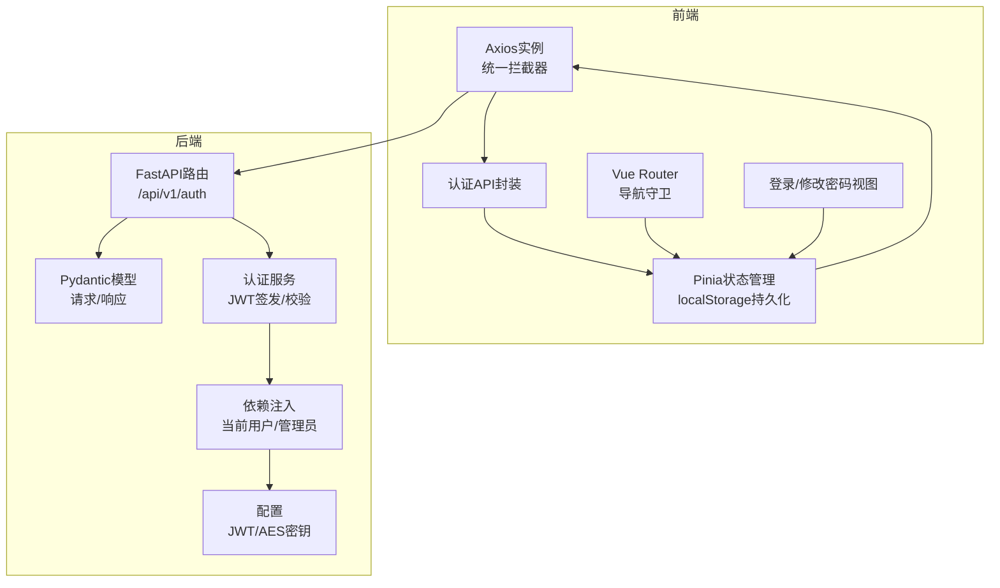
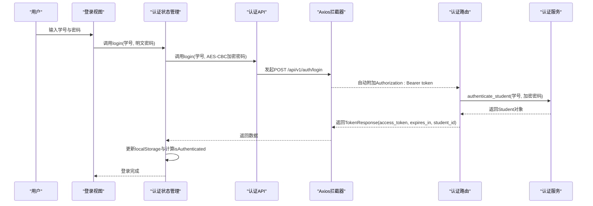
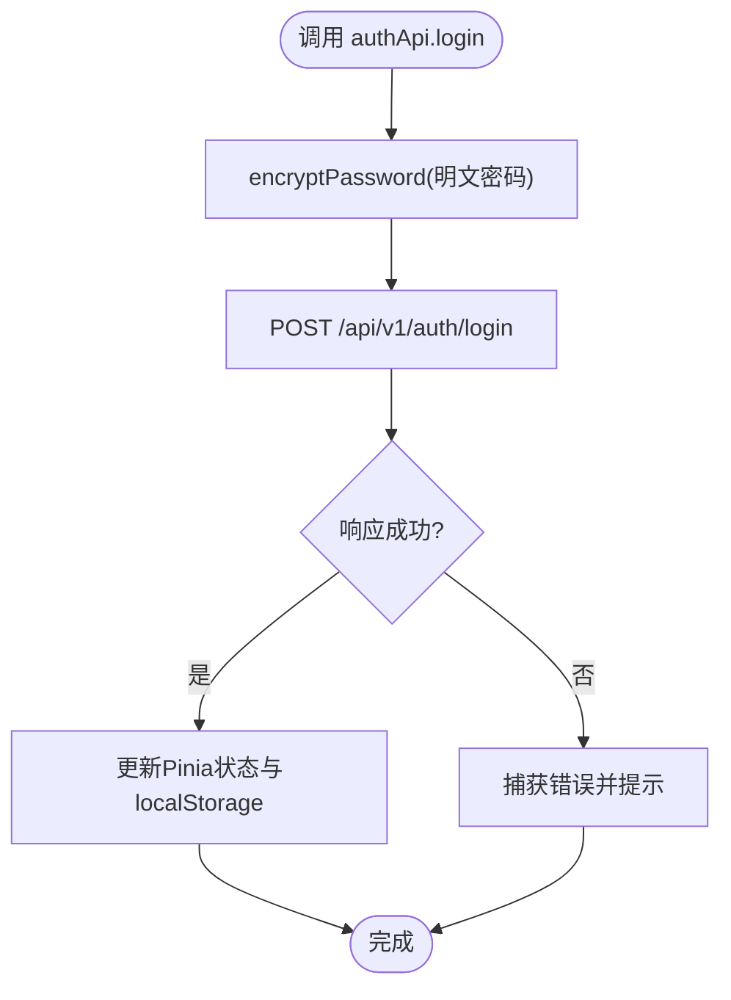
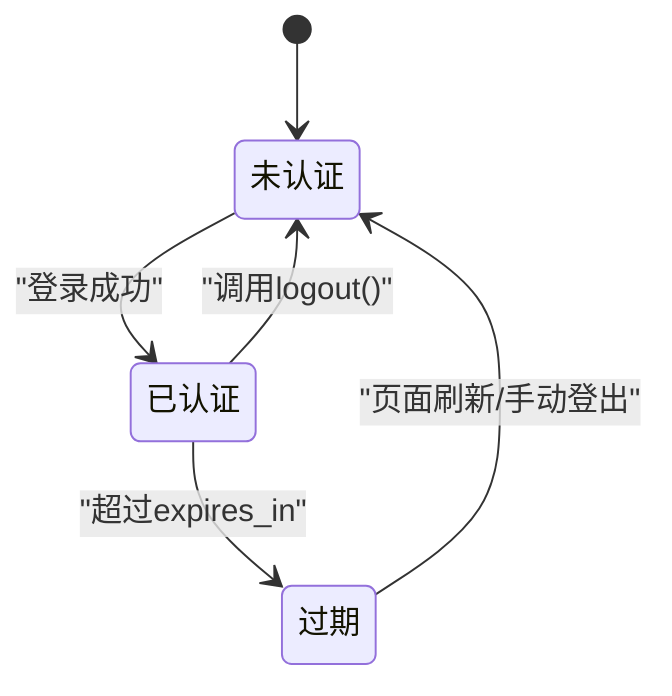
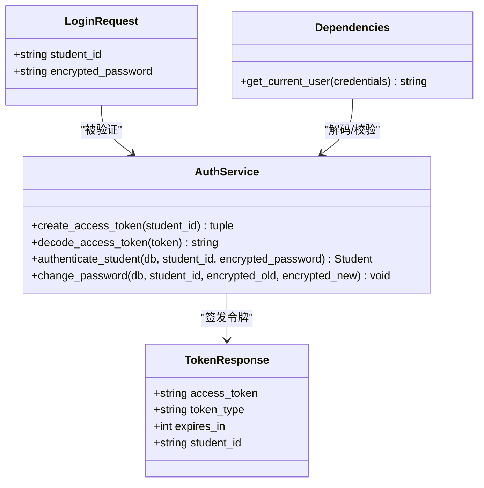
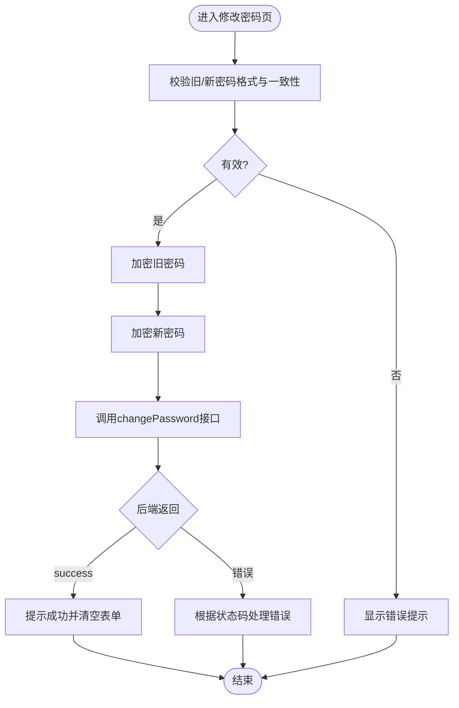
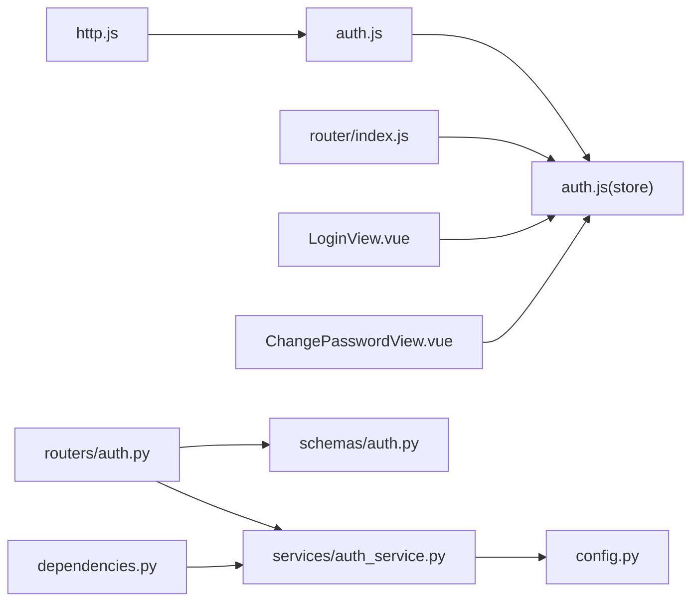

# 认证API模块

<cite>
**本文档引用的文件**
- [frontend/ai_assistant/src/api/auth.js](file://frontend/ai_assistant/src/api/auth.js)
- [service/ai_assistant/app/routers/auth.py](file://service/ai_assistant/app/routers/auth.py)
- [service/ai_assistant/app/schemas/auth.py](file://service/ai_assistant/app/schemas/auth.py)
- [service/ai_assistant/app/services/auth_service.py](file://service/ai_assistant/app/services/auth_service.py)
- [frontend/ai_assistant/src/stores/auth.js](file://frontend/ai_assistant/src/stores/auth.js)
- [frontend/ai_assistant/src/utils/crypto.js](file://frontend/ai_assistant/src/utils/crypto.js)
- [service/ai_assistant/app/dependencies.py](file://service/ai_assistant/app/dependencies.py)
- [frontend/ai_assistant/src/api/http.js](file://frontend/ai_assistant/src/api/http.js)
- [service/ai_assistant/app/config.py](file://service/ai_assistant/app/config.py)
- [frontend/ai_assistant/src/views/LoginView.vue](file://frontend/ai_assistant/src/views/LoginView.vue)
- [frontend/ai_assistant/src/stores/adminAuth.js](file://frontend/ai_assistant/src/stores/adminAuth.js)
- [service/ai_assistant/app/routers/admin.py](file://service/ai_assistant/app/routers/admin.py)
- [frontend/ai_assistant/src/router/index.js](file://frontend/ai_assistant/src/router/index.js)
- [frontend/ai_assistant/src/views/ChangePasswordView.vue](file://frontend/ai_assistant/src/views/ChangePasswordView.vue)
- [service/ai_assistant/app/schemas/admin.py](file://service/ai_assistant/app/schemas/admin.py)
</cite>

## 目录
1. [简介](#简介)
2. [项目结构](#项目结构)
3. [核心组件](#核心组件)
4. [架构总览](#架构总览)
5. [详细组件分析](#详细组件分析)
6. [依赖关系分析](#依赖关系分析)
7. [性能考虑](#性能考虑)
8. [故障排除指南](#故障排除指南)
9. [结论](#结论)
10. [附录](#附录)

## 简介
本文件系统性梳理AI校园助手项目的认证API模块，覆盖学生认证与密码修改接口、JWT令牌签发与校验、前端状态管理与自动登出机制、以及权限控制与安全最佳实践。文档以代码级分析为基础，配合可视化图表，帮助开发者快速理解并正确集成认证功能。

## 项目结构
认证相关代码分布在前后端两部分：
- 前端：API封装、状态管理、路由守卫、视图组件
- 后端：FastAPI路由、Pydantic模型、认证服务、依赖注入

**图表来源**
- [frontend/ai_assistant/src/api/http.js:1-49](file://frontend/ai_assistant/src/api/http.js#L1-L49)
- [frontend/ai_assistant/src/api/auth.js:1-36](file://frontend/ai_assistant/src/api/auth.js#L1-L36)
- [frontend/ai_assistant/src/stores/auth.js:1-77](file://frontend/ai_assistant/src/stores/auth.js#L1-L77)
- [frontend/ai_assistant/src/router/index.js:1-75](file://frontend/ai_assistant/src/router/index.js#L1-L75)
- [service/ai_assistant/app/routers/auth.py:1-102](file://service/ai_assistant/app/routers/auth.py#L1-L102)
- [service/ai_assistant/app/schemas/auth.py:1-56](file://service/ai_assistant/app/schemas/auth.py#L1-L56)
- [service/ai_assistant/app/services/auth_service.py:1-253](file://service/ai_assistant/app/services/auth_service.py#L1-L253)
- [service/ai_assistant/app/dependencies.py:1-109](file://service/ai_assistant/app/dependencies.py#L1-L109)
- [service/ai_assistant/app/config.py:1-113](file://service/ai_assistant/app/config.py#L1-L113)

**章节来源**
- [frontend/ai_assistant/src/api/http.js:1-49](file://frontend/ai_assistant/src/api/http.js#L1-L49)
- [frontend/ai_assistant/src/api/auth.js:1-36](file://frontend/ai_assistant/src/api/auth.js#L1-L36)
- [frontend/ai_assistant/src/stores/auth.js:1-77](file://frontend/ai_assistant/src/stores/auth.js#L1-L77)
- [frontend/ai_assistant/src/router/index.js:1-75](file://frontend/ai_assistant/src/router/index.js#L1-L75)
- [service/ai_assistant/app/routers/auth.py:1-102](file://service/ai_assistant/app/routers/auth.py#L1-L102)
- [service/ai_assistant/app/schemas/auth.py:1-56](file://service/ai_assistant/app/schemas/auth.py#L1-L56)
- [service/ai_assistant/app/services/auth_service.py:1-253](file://service/ai_assistant/app/services/auth_service.py#L1-L253)
- [service/ai_assistant/app/dependencies.py:1-109](file://service/ai_assistant/app/dependencies.py#L1-L109)
- [service/ai_assistant/app/config.py:1-113](file://service/ai_assistant/app/config.py#L1-L113)

## 核心组件
- 前端认证API封装：提供登录与修改密码的请求方法，参数为AES-CBC加密后的密码字符串。
- 前端状态管理：基于Pinia与localStorage，保存token、学号、过期时间，计算认证状态；自动登出与401响应联动。
- 后端认证路由：接收加密密码，调用服务层进行解密与哈希验证，签发JWT。
- 后端认证服务：JWT签发/解码、密码哈希验证、用户认证与密码修改。
- 依赖注入：从Authorization头解析Bearer Token，校验并注入当前用户。
- 配置：JWT算法、密钥、过期时间、AES密钥等。

**章节来源**
- [frontend/ai_assistant/src/api/auth.js:8-36](file://frontend/ai_assistant/src/api/auth.js#L8-L36)
- [frontend/ai_assistant/src/stores/auth.js:17-77](file://frontend/ai_assistant/src/stores/auth.js#L17-L77)
- [service/ai_assistant/app/routers/auth.py:24-102](file://service/ai_assistant/app/routers/auth.py#L24-L102)
- [service/ai_assistant/app/services/auth_service.py:45-210](file://service/ai_assistant/app/services/auth_service.py#L45-L210)
- [service/ai_assistant/app/dependencies.py:56-72](file://service/ai_assistant/app/dependencies.py#L56-L72)
- [service/ai_assistant/app/config.py:32-40](file://service/ai_assistant/app/config.py#L32-L40)

## 架构总览
认证流程贯穿前后端：前端将明文密码通过AES-CBC加密后提交至后端；后端解密并验证哈希，签发JWT；前端将token写入localStorage并在后续请求中自动附加；后端依赖注入解析token并校验角色与有效性；401时前端自动登出并跳转登录页。

**图表来源**
- [frontend/ai_assistant/src/views/LoginView.vue:94-121](file://frontend/ai_assistant/src/views/LoginView.vue#L94-L121)
- [frontend/ai_assistant/src/stores/auth.js:29-43](file://frontend/ai_assistant/src/stores/auth.js#L29-L43)
- [frontend/ai_assistant/src/api/auth.js:15-20](file://frontend/ai_assistant/src/api/auth.js#L15-L20)
- [frontend/ai_assistant/src/api/http.js:19-34](file://frontend/ai_assistant/src/api/http.js#L19-L34)
- [service/ai_assistant/app/routers/auth.py:33-52](file://service/ai_assistant/app/routers/auth.py#L33-L52)
- [service/ai_assistant/app/services/auth_service.py:125-169](file://service/ai_assistant/app/services/auth_service.py#L125-L169)

## 详细组件分析

### 前端认证API封装
- 登录接口：接收学号与AES-CBC加密密码，调用POST /api/v1/auth/login，返回access_token、expires_in、student_id。
- 修改密码接口：需要当前登录用户上下文，调用POST /api/v1/auth/change-password，返回success、student_id、detail。

**图表来源**
- [frontend/ai_assistant/src/api/auth.js:15-20](file://frontend/ai_assistant/src/api/auth.js#L15-L20)
- [frontend/ai_assistant/src/utils/crypto.js:26-40](file://frontend/ai_assistant/src/utils/crypto.js#L26-L40)
- [frontend/ai_assistant/src/stores/auth.js:29-43](file://frontend/ai_assistant/src/stores/auth.js#L29-L43)

**章节来源**
- [frontend/ai_assistant/src/api/auth.js:8-36](file://frontend/ai_assistant/src/api/auth.js#L8-L36)
- [frontend/ai_assistant/src/utils/crypto.js:1-40](file://frontend/ai_assistant/src/utils/crypto.js#L1-L40)

### 前端状态管理与自动登出
- 状态字段：token、studentId、expiresAt；计算isAuthenticated用于路由守卫与UI展示。
- 登录流程：加密密码、调用API、写入localStorage、设置过期时间。
- 修改密码：加密旧/新密码、调用API、处理返回。
- 登出：清空状态与localStorage。
- 自动登出：Axios响应拦截器对401进行登出并跳转登录页。

**图表来源**
- [frontend/ai_assistant/src/stores/auth.js:17-77](file://frontend/ai_assistant/src/stores/auth.js#L17-L77)
- [frontend/ai_assistant/src/api/http.js:36-47](file://frontend/ai_assistant/src/api/http.js#L36-L47)

**章节来源**
- [frontend/ai_assistant/src/stores/auth.js:1-77](file://frontend/ai_assistant/src/stores/auth.js#L1-L77)
- [frontend/ai_assistant/src/api/http.js:1-49](file://frontend/ai_assistant/src/api/http.js#L1-L49)

### 后端认证路由与服务
- 登录路由：接收LoginRequest，调用authenticate_student，成功则create_access_token返回TokenResponse。
- 修改密码路由：依赖get_current_user确保当前用户上下文，校验student_id一致性，调用change_password。
- 认证服务：JWT签发/解码、AES解密、SHA256哈希验证、密码修改事务处理。
- 依赖注入：get_current_user从Authorization头解析Bearer Token并解码，校验角色与有效性。

**图表来源**
- [service/ai_assistant/app/schemas/auth.py:4-50](file://service/ai_assistant/app/schemas/auth.py#L4-L50)
- [service/ai_assistant/app/services/auth_service.py:45-210](file://service/ai_assistant/app/services/auth_service.py#L45-L210)
- [service/ai_assistant/app/dependencies.py:56-72](file://service/ai_assistant/app/dependencies.py#L56-L72)

**章节来源**
- [service/ai_assistant/app/routers/auth.py:24-102](file://service/ai_assistant/app/routers/auth.py#L24-L102)
- [service/ai_assistant/app/schemas/auth.py:1-56](file://service/ai_assistant/app/schemas/auth.py#L1-L56)
- [service/ai_assistant/app/services/auth_service.py:125-210](file://service/ai_assistant/app/services/auth_service.py#L125-L210)
- [service/ai_assistant/app/dependencies.py:56-72](file://service/ai_assistant/app/dependencies.py#L56-L72)

### 管理员认证（对比参考）
- 管理员登录路由：authenticate_admin + create_admin_access_token，返回包含admin_id、username、display_name、role的令牌。
- 管理员信息接口：get_current_admin注入AdminUser并返回基本信息。
- 管理员认证状态管理：独立的Pinia store，区分学生与管理员的localStorage键值。

**章节来源**
- [service/ai_assistant/app/routers/admin.py:51-82](file://service/ai_assistant/app/routers/admin.py#L51-L82)
- [service/ai_assistant/app/schemas/admin.py:30-46](file://service/ai_assistant/app/schemas/admin.py#L30-L46)
- [frontend/ai_assistant/src/stores/adminAuth.js:16-76](file://frontend/ai_assistant/src/stores/adminAuth.js#L16-L76)

### 路由守卫与权限控制
- 学生路由守卫：requiresAuth未认证重定向登录；guest已认证重定向主页。
- 管理员路由守卫：requiresAdminAuth未认证重定向管理员登录；adminGuest已认证重定向管理员仪表盘。
- 权限控制：后端get_current_user仅接受student角色的JWT，避免跨角色访问。

**章节来源**
- [frontend/ai_assistant/src/router/index.js:58-73](file://frontend/ai_assistant/src/router/index.js#L58-L73)
- [service/ai_assistant/app/dependencies.py:56-72](file://service/ai_assistant/app/dependencies.py#L56-L72)

### 密码修改流程（前端）
- 前端校验：旧密码与新密码长度、一致性、不得与旧密码相同。
- 加密：调用encryptPassword分别加密旧/新密码。
- 请求：POST /api/v1/auth/change-password，携带student_id与两个加密字段。
- 错误处理：匹配400/403/404并提示用户。

**图表来源**
- [frontend/ai_assistant/src/views/ChangePasswordView.vue:155-232](file://frontend/ai_assistant/src/views/ChangePasswordView.vue#L155-L232)
- [frontend/ai_assistant/src/stores/auth.js:46-56](file://frontend/ai_assistant/src/stores/auth.js#L46-L56)
- [frontend/ai_assistant/src/utils/crypto.js:26-40](file://frontend/ai_assistant/src/utils/crypto.js#L26-L40)

**章节来源**
- [frontend/ai_assistant/src/views/ChangePasswordView.vue:1-466](file://frontend/ai_assistant/src/views/ChangePasswordView.vue#L1-L466)
- [frontend/ai_assistant/src/stores/auth.js:46-56](file://frontend/ai_assistant/src/stores/auth.js#L46-L56)

## 依赖关系分析
- 前端依赖关系：http.js依赖auth.js与stores；auth.js依赖utils/crypto.js；router依赖stores；views依赖stores。
- 后端依赖关系：routers/auth.py依赖schemas/auth.py与services/auth_service.py；dependencies.py依赖config.py与auth_service.py；auth_service.py依赖config.py与utils/crypto.py。

**图表来源**
- [frontend/ai_assistant/src/api/http.js:1-49](file://frontend/ai_assistant/src/api/http.js#L1-L49)
- [frontend/ai_assistant/src/api/auth.js:1-36](file://frontend/ai_assistant/src/api/auth.js#L1-L36)
- [frontend/ai_assistant/src/stores/auth.js:1-77](file://frontend/ai_assistant/src/stores/auth.js#L1-L77)
- [frontend/ai_assistant/src/router/index.js:1-75](file://frontend/ai_assistant/src/router/index.js#L1-L75)
- [frontend/ai_assistant/src/views/LoginView.vue:1-343](file://frontend/ai_assistant/src/views/LoginView.vue#L1-L343)
- [frontend/ai_assistant/src/views/ChangePasswordView.vue:1-466](file://frontend/ai_assistant/src/views/ChangePasswordView.vue#L1-L466)
- [service/ai_assistant/app/routers/auth.py:1-102](file://service/ai_assistant/app/routers/auth.py#L1-L102)
- [service/ai_assistant/app/schemas/auth.py:1-56](file://service/ai_assistant/app/schemas/auth.py#L1-L56)
- [service/ai_assistant/app/services/auth_service.py:1-253](file://service/ai_assistant/app/services/auth_service.py#L1-L253)
- [service/ai_assistant/app/dependencies.py:1-109](file://service/ai_assistant/app/dependencies.py#L1-L109)
- [service/ai_assistant/app/config.py:1-113](file://service/ai_assistant/app/config.py#L1-L113)

**章节来源**
- [service/ai_assistant/app/routers/auth.py:1-102](file://service/ai_assistant/app/routers/auth.py#L1-L102)
- [service/ai_assistant/app/schemas/auth.py:1-56](file://service/ai_assistant/app/schemas/auth.py#L1-L56)
- [service/ai_assistant/app/services/auth_service.py:1-253](file://service/ai_assistant/app/services/auth_service.py#L1-L253)
- [service/ai_assistant/app/dependencies.py:1-109](file://service/ai_assistant/app/dependencies.py#L1-L109)
- [service/ai_assistant/app/config.py:1-113](file://service/ai_assistant/app/config.py#L1-L113)

## 性能考虑
- JWT过期时间：默认1天，建议结合业务场景调整，减少频繁刷新。
- AES加密：前端每次请求均进行加密，注意避免重复加密导致的性能损耗。
- 依赖注入：get_current_user每次请求都会解析与校验token，建议在网关层做缓存或预检。
- 响应拦截：401自动登出避免了重复逻辑，但需注意避免循环跳转。

[本节为通用指导，无需特定文件来源]

## 故障排除指南
- 401未认证：Axios响应拦截器触发自动登出并跳转登录页；检查Authorization头是否正确附加。
- 400密码错误：旧密码不正确、新旧密码相同、加密数据无效；前端已做基础校验，后端会返回具体原因。
- 403禁止修改：student_id与当前用户不一致；确保修改密码时携带正确的student_id。
- 404学生不存在：数据库中无该学号记录；检查数据初始化。
- JWT角色不匹配：非student角色访问student端点；确保使用正确的令牌类型。

**章节来源**
- [frontend/ai_assistant/src/api/http.js:36-47](file://frontend/ai_assistant/src/api/http.js#L36-L47)
- [service/ai_assistant/app/routers/auth.py:66-99](file://service/ai_assistant/app/routers/auth.py#L66-L99)
- [service/ai_assistant/app/dependencies.py:56-72](file://service/ai_assistant/app/dependencies.py#L56-L72)

## 结论
本认证模块通过前后端协同实现了安全、可控的学生认证与密码修改能力：前端负责密码加密与状态持久化，后端负责JWT签发与严格校验；路由守卫与依赖注入共同保障了权限控制与自动登出机制。遵循本文档的最佳实践与安全注意事项，可有效提升系统的安全性与可用性。

[本节为总结，无需特定文件来源]

## 附录

### 接口定义与调用方式
- 登录
  - 方法：POST
  - 路径：/api/v1/auth/login
  - 请求体字段：student_id、encrypted_password（AES-CBC加密）
  - 成功响应字段：access_token、token_type、expires_in、student_id
- 修改密码
  - 方法：POST
  - 路径：/api/v1/auth/change-password
  - 请求体字段：student_id、encrypted_old_password、encrypted_new_password
  - 成功响应字段：success、student_id、detail

**章节来源**
- [service/ai_assistant/app/routers/auth.py:24-102](file://service/ai_assistant/app/routers/auth.py#L24-L102)
- [service/ai_assistant/app/schemas/auth.py:4-56](file://service/ai_assistant/app/schemas/auth.py#L4-L56)
- [frontend/ai_assistant/src/api/auth.js:8-36](file://frontend/ai_assistant/src/api/auth.js#L8-L36)

### 参数格式与返回数据结构
- 参数格式
  - encrypted_password：iv_base64:ciphertext_base64（URL安全Base64）
  - AES密钥：与后端配置一致
- 返回数据结构
  - 登录：TokenResponse
  - 修改密码：ChangePasswordResponse

**章节来源**
- [frontend/ai_assistant/src/utils/crypto.js:26-40](file://frontend/ai_assistant/src/utils/crypto.js#L26-L40)
- [service/ai_assistant/app/schemas/auth.py:45-56](file://service/ai_assistant/app/schemas/auth.py#L45-L56)

### 认证流程完整示例
- 登录验证：前端加密密码 → 调用登录接口 → 写入localStorage → 路由跳转
- 自动登出处理：后端401 → Axios拦截器 → 清空状态与localStorage → 跳转登录
- 权限控制实现：路由元信息requiresAuth/RequiresAdminAuth → Pinia状态判断 → 未认证重定向

**章节来源**
- [frontend/ai_assistant/src/views/LoginView.vue:94-121](file://frontend/ai_assistant/src/views/LoginView.vue#L94-L121)
- [frontend/ai_assistant/src/api/http.js:36-47](file://frontend/ai_assistant/src/api/http.js#L36-L47)
- [frontend/ai_assistant/src/router/index.js:58-73](file://frontend/ai_assistant/src/router/index.js#L58-L73)

### 最佳实践与安全注意事项
- 密钥管理：JWT_SECRET_KEY与AES_SECRET_KEY需妥善保管，避免硬编码在客户端。
- 传输安全：启用HTTPS，防止中间人攻击。
- 前端加密：确保每次请求都进行AES-CBC加密，避免重复加密。
- 过期策略：合理设置expires_in，平衡用户体验与安全风险。
- 错误处理：后端返回明确错误信息，前端进行友好提示与日志记录。
- 权限最小化：仅暴露必要接口，避免越权访问。

[本节为通用指导，无需特定文件来源]