# 前端架构设计

<cite>
**本文档引用的文件**
- [main.js](file://frontend/ai_assistant/src/main.js)
- [App.vue](file://frontend/ai_assistant/src/App.vue)
- [router/index.js](file://frontend/ai_assistant/src/router/index.js)
- [stores/auth.js](file://frontend/ai_assistant/src/stores/auth.js)
- [stores/adminAuth.js](file://frontend/ai_assistant/src/stores/adminAuth.js)
- [stores/chat.js](file://frontend/ai_assistant/src/stores/chat.js)
- [layouts/MainLayout.vue](file://frontend/ai_assistant/src/layouts/MainLayout.vue)
- [views/ChatView.vue](file://frontend/ai_assistant/src/views/ChatView.vue)
- [api/auth.js](file://frontend/ai_assistant/src/api/auth.js)
- [api/admin.js](file://frontend/ai_assistant/src/api/admin.js)
- [api/query.js](file://frontend/ai_assistant/src/api/query.js)
- [utils/crypto.js](file://frontend/ai_assistant/src/utils/crypto.js)
- [utils/format.js](file://frontend/ai_assistant/src/utils/format.js)
- [package.json](file://frontend/ai_assistant/package.json)
- [vite.config.js](file://frontend/ai_assistant/vite.config.js)
</cite>

## 目录
1. [引言](#引言)
2. [项目结构](#项目结构)
3. [核心组件](#核心组件)
4. [架构概览](#架构概览)
5. [详细组件分析](#详细组件分析)
6. [依赖关系分析](#依赖关系分析)
7. [性能考虑](#性能考虑)
8. [故障排除指南](#故障排除指南)
9. [结论](#结论)

## 引言

AI校园助手是一个基于Vue 3的单页应用(SPA)，旨在为学生提供智能化的校园咨询服务。该应用采用现代化的前端技术栈，结合Pinia状态管理和Vue Router路由系统，实现了完整的认证流程、智能问答功能和管理员后台管理。

本项目的核心目标是通过AI技术简化校园生活，为学生提供24小时在线的智能问答服务，涵盖课表查询、成绩查询、教师联系、学籍信息等多个校园应用场景。

## 项目结构

前端项目采用模块化的目录结构，按照功能域进行组织：

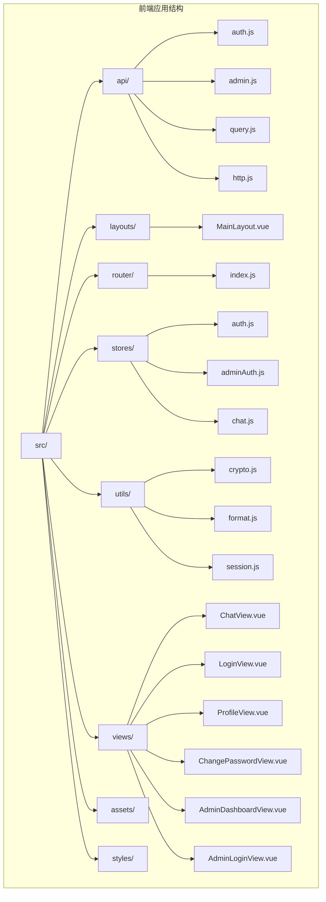

**图表来源**
- [main.js:1-10](file://frontend/ai_assistant/src/main.js#L1-L10)
- [router/index.js:1-75](file://frontend/ai_assistant/src/router/index.js#L1-L75)

**章节来源**
- [main.js:1-10](file://frontend/ai_assistant/src/main.js#L1-L10)
- [package.json:1-24](file://frontend/ai_assistant/package.json#L1-L24)

## 核心组件

### 应用入口配置

应用入口位于`src/main.js`，负责初始化Vue应用、注册插件和挂载根组件：

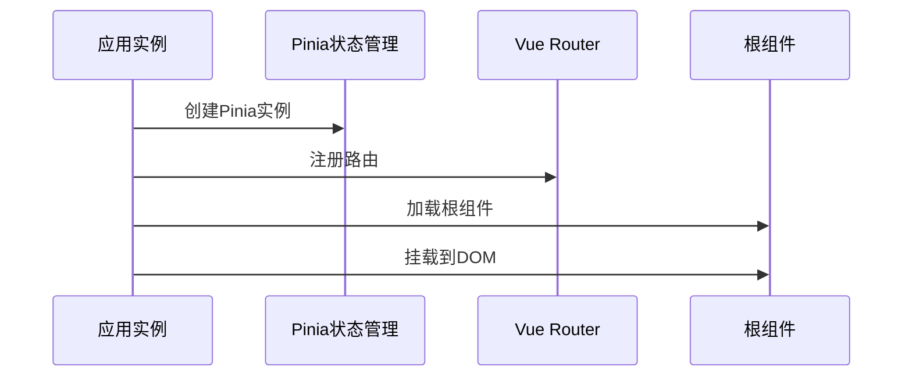

**图表来源**
- [main.js:7-10](file://frontend/ai_assistant/src/main.js#L7-L10)

### 路由系统设计

路由系统采用Vue Router 4，支持嵌套路由和导航守卫：

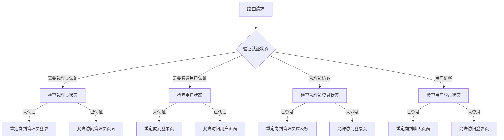

**图表来源**
- [router/index.js:57-73](file://frontend/ai_assistant/src/router/index.js#L57-L73)

**章节来源**
- [router/index.js:1-75](file://frontend/ai_assistant/src/router/index.js#L1-L75)

## 架构概览

AI校园助手采用分层架构设计，各层职责明确，耦合度低：

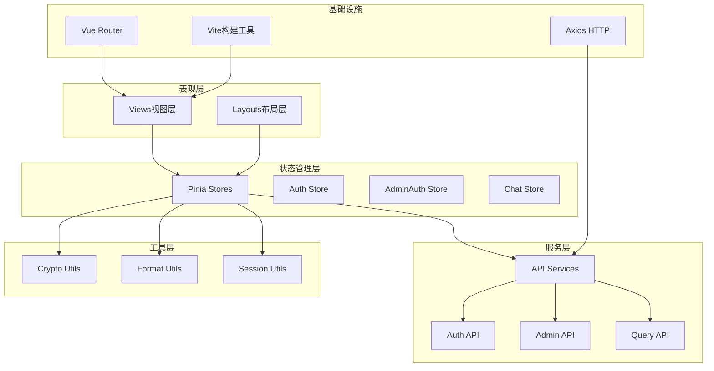

**图表来源**
- [main.js:1-10](file://frontend/ai_assistant/src/main.js#L1-L10)
- [stores/chat.js:10-21](file://frontend/ai_assistant/src/stores/chat.js#L10-L21)

## 详细组件分析

### 状态管理模式

#### 认证状态管理

应用采用Pinia进行状态管理，实现了用户认证和管理员认证两个独立的状态存储：

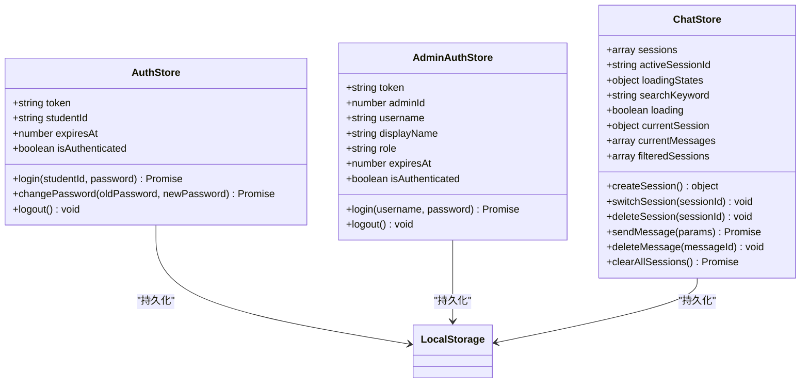

**图表来源**
- [stores/auth.js:17-77](file://frontend/ai_assistant/src/stores/auth.js#L17-L77)
- [stores/adminAuth.js:16-77](file://frontend/ai_assistant/src/stores/adminAuth.js#L16-L77)
- [stores/chat.js:22-278](file://frontend/ai_assistant/src/stores/chat.js#L22-L278)

#### 聊天状态管理

聊天功能是最复杂的业务逻辑，实现了完整的会话管理：

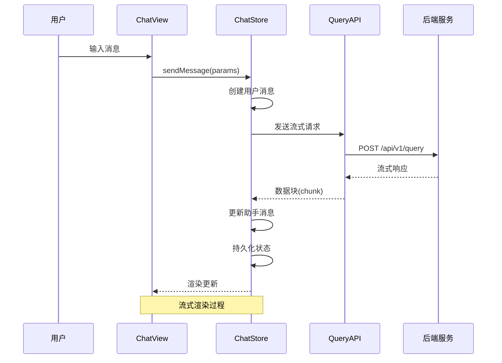

**图表来源**
- [stores/chat.js:133-230](file://frontend/ai_assistant/src/stores/chat.js#L133-L230)
- [api/query.js:28-141](file://frontend/ai_assistant/src/api/query.js#L28-L141)

**章节来源**
- [stores/auth.js:1-77](file://frontend/ai_assistant/src/stores/auth.js#L1-L77)
- [stores/adminAuth.js:1-77](file://frontend/ai_assistant/src/stores/adminAuth.js#L1-L77)
- [stores/chat.js:1-278](file://frontend/ai_assistant/src/stores/chat.js#L1-L278)

### 组件化设计理念

#### 主布局组件

主布局组件实现了响应式设计和侧边栏导航：

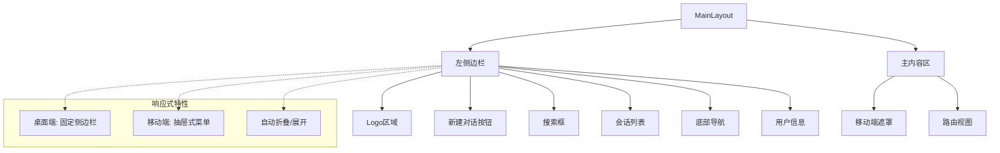

**图表来源**
- [layouts/MainLayout.vue:1-487](file://frontend/ai_assistant/src/layouts/MainLayout.vue#L1-L487)

#### 聊天视图组件

聊天视图实现了多模态输入和流式渲染：

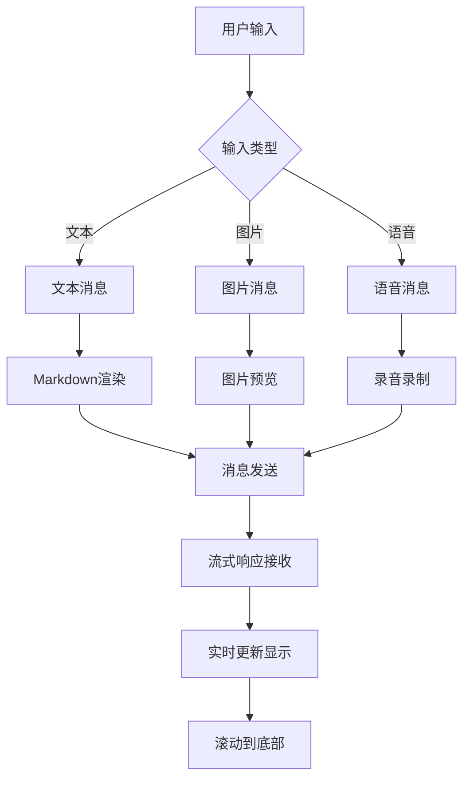

**图表来源**
- [views/ChatView.vue:149-219](file://frontend/ai_assistant/src/views/ChatView.vue#L149-L219)

**章节来源**
- [layouts/MainLayout.vue:1-487](file://frontend/ai_assistant/src/layouts/MainLayout.vue#L1-L487)
- [views/ChatView.vue:1-800](file://frontend/ai_assistant/src/views/ChatView.vue#L1-L800)

### 前端与后端API交互模式

#### 认证流程

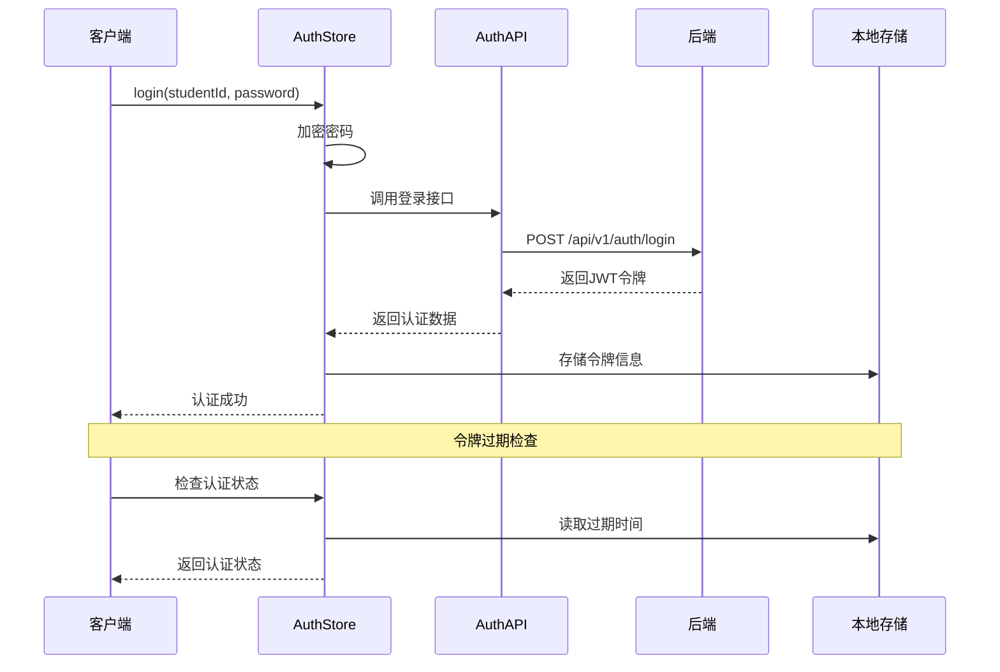

**图表来源**
- [stores/auth.js:29-43](file://frontend/ai_assistant/src/stores/auth.js#L29-L43)
- [api/auth.js:15-20](file://frontend/ai_assistant/src/api/auth.js#L15-L20)

#### 智能问答API

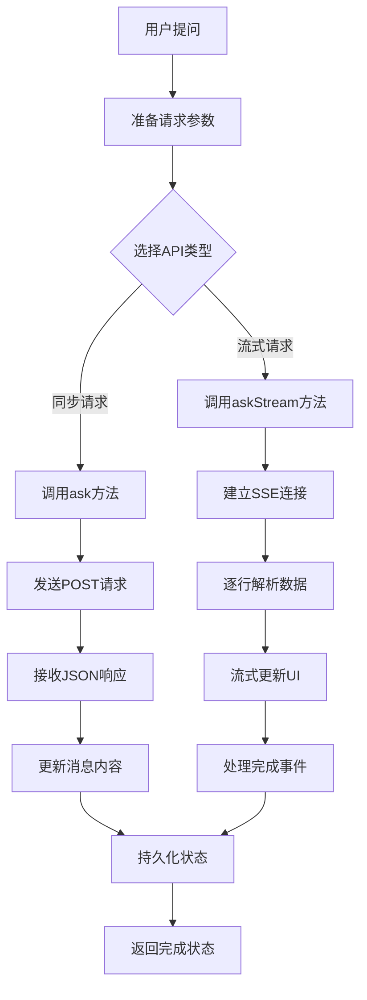

**图表来源**
- [api/query.js:11-20](file://frontend/ai_assistant/src/api/query.js#L11-L20)
- [api/query.js:28-141](file://frontend/ai_assistant/src/api/query.js#L28-L141)

**章节来源**
- [api/auth.js:1-36](file://frontend/ai_assistant/src/api/auth.js#L1-L36)
- [api/admin.js:1-41](file://frontend/ai_assistant/src/api/admin.js#L1-L41)
- [api/query.js:1-141](file://frontend/ai_assistant/src/api/query.js#L1-L141)

### 错误处理机制

应用实现了多层次的错误处理策略：

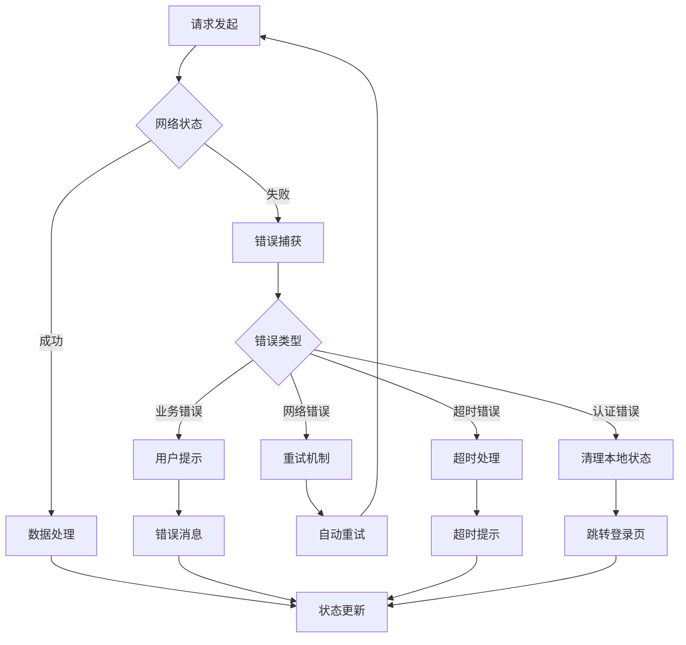

**图表来源**
- [stores/chat.js:235-257](file://frontend/ai_assistant/src/stores/chat.js#L235-L257)

**章节来源**
- [stores/chat.js:235-257](file://frontend/ai_assistant/src/stores/chat.js#L235-L257)

## 依赖关系分析

### 技术栈依赖

```mermaid
graph TB
subgraph "核心框架"
A[Vue 3.4.21]
B[Vue Router 4.3.0]
C[Pinia 2.1.7]
end
subgraph "HTTP客户端"
D[Axios 1.6.8]
end
subgraph "加密库"
E[Crypto-JS 4.2.0]
end
subgraph "构建工具"
F[Vite 5.2.0]
G[@vitejs/plugin-vue 5.0.4]
end
subgraph "其他工具"
H[UUID 9.0.1]
I[Marked 12.0.1]
end
A --> B
A --> C
C --> D
A --> D
A --> E
F --> G
```

**图表来源**
- [package.json:11-22](file://frontend/ai_assistant/package.json#L11-L22)

### 开发环境配置

Vite配置支持热重载和代理转发：

```mermaid
flowchart LR
A[Vite开发服务器] --> B[前端代码]
A --> C[代理配置]
C --> D[/api -> 后端地址]
D --> E[HTTP请求转发]
B --> F[热重载]
E --> G[跨域解决]
```

**图表来源**
- [vite.config.js:15-21](file://frontend/ai_assistant/vite.config.js#L15-L21)

**章节来源**
- [package.json:1-24](file://frontend/ai_assistant/package.json#L1-24)
- [vite.config.js:1-23](file://frontend/ai_assistant/vite.config.js#L1-L23)

## 性能考虑

### 响应式设计原则

应用采用移动优先的设计理念：

- **断点设计**: 768px作为移动端和桌面端的分界线
- **弹性布局**: 使用CSS Grid和Flexbox实现自适应布局
- **触摸优化**: 针对移动端触摸操作进行优化
- **性能优化**: 图片压缩、音频处理、虚拟滚动等

### 用户体验优化策略

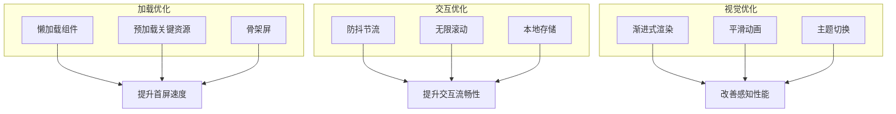

## 故障排除指南

### 常见问题诊断

#### 认证相关问题

1. **登录失败**
   - 检查密码加密是否正确
   - 验证令牌存储是否正常
   - 确认后端接口响应格式

2. **令牌过期**
   - 实现自动刷新机制
   - 提供过期提醒
   - 清理本地存储

#### 聊天功能问题

1. **消息发送失败**
   - 检查网络连接
   - 验证流式API连接
   - 查看控制台错误日志

2. **图片上传问题**
   - 检查文件大小限制
   - 验证图片格式支持
   - 确认压缩算法正常

**章节来源**
- [stores/auth.js:58-66](file://frontend/ai_assistant/src/stores/auth.js#L58-L66)
- [stores/chat.js:235-257](file://frontend/ai_assistant/src/stores/chat.js#L235-L257)

## 结论

AI校园助手前端架构设计充分体现了现代Vue 3应用的最佳实践：

1. **模块化设计**: 清晰的目录结构和职责分离
2. **状态管理**: Pinia提供了简洁高效的状态管理方案
3. **路由系统**: Vue Router实现了灵活的导航控制
4. **API集成**: 完整的前后端交互模式和错误处理
5. **用户体验**: 响应式设计和性能优化并重

该架构为后续的功能扩展和维护提供了良好的基础，能够支持更多校园应用场景的集成和优化。