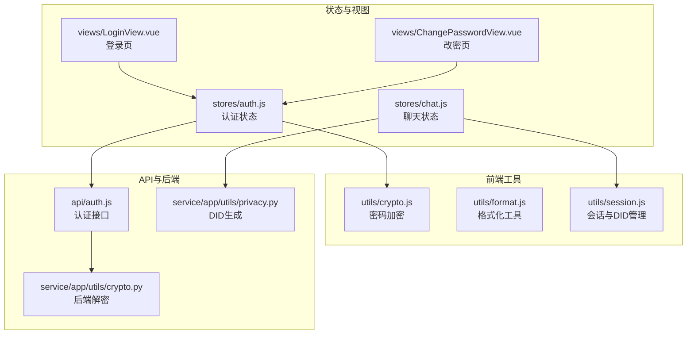
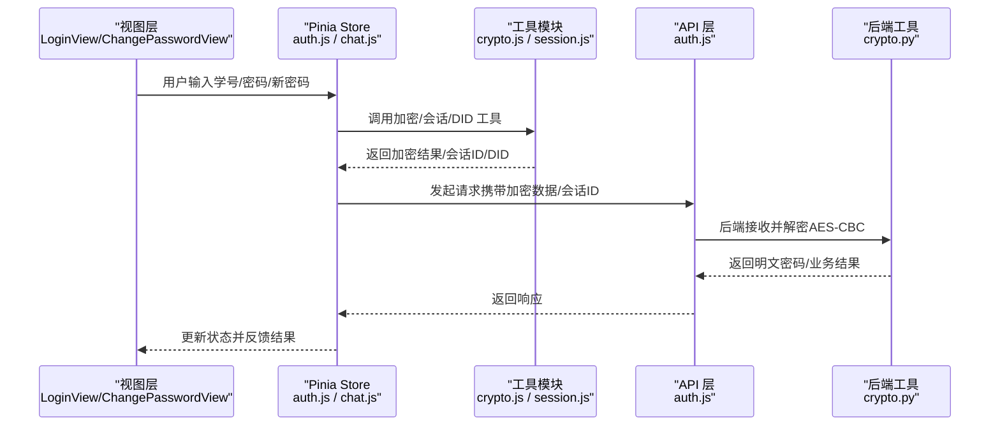
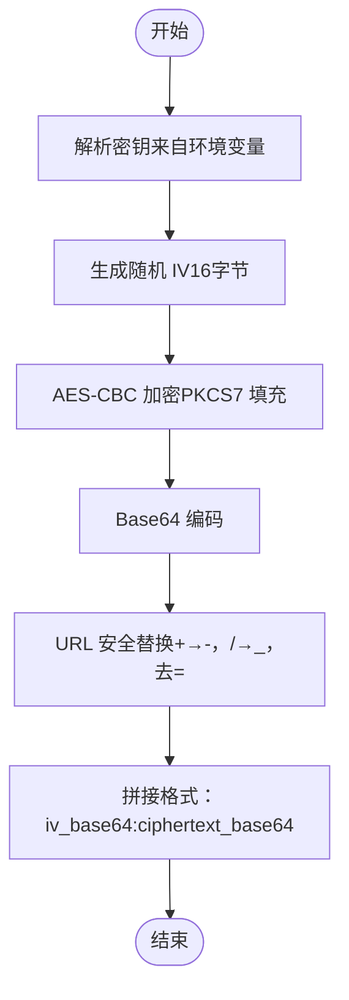
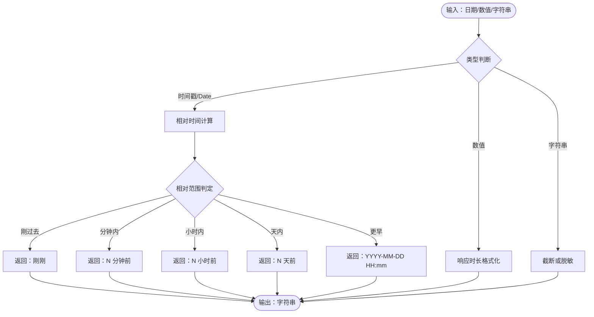
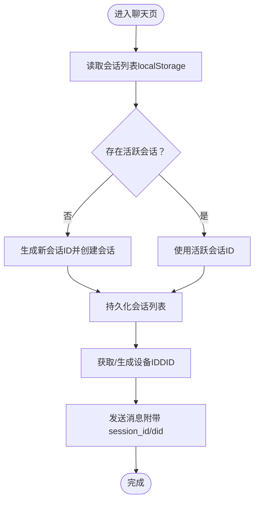
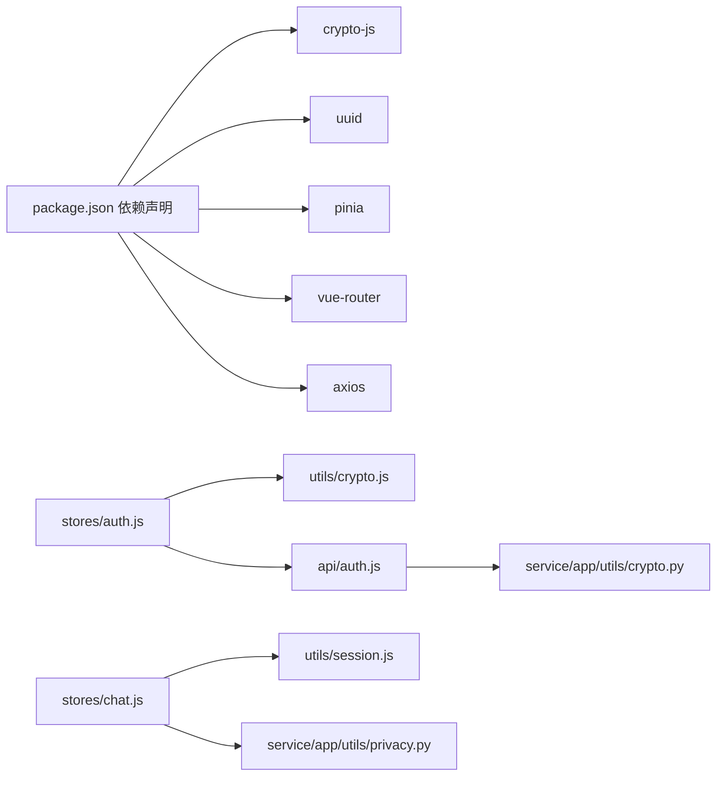

# 工具与实用程序

<cite>
**本文引用的文件**
- [crypto.js](file://frontend/ai_assistant/src/utils/crypto.js)
- [format.js](file://frontend/ai_assistant/src/utils/format.js)
- [session.js](file://frontend/ai_assistant/src/utils/session.js)
- [auth.js](file://frontend/ai_assistant/src/stores/auth.js)
- [chat.js](file://frontend/ai_assistant/src/stores/chat.js)
- [auth.js](file://frontend/ai_assistant/src/api/auth.js)
- [ChangePasswordView.vue](file://frontend/ai_assistant/src/views/ChangePasswordView.vue)
- [LoginView.vue](file://frontend/ai_assistant/src/views/LoginView.vue)
- [package.json](file://frontend/ai_assistant/package.json)
- [crypto.py](file://service/ai_assistant/app/utils/crypto.py)
- [privacy.py](file://service/ai_assistant/app/utils/privacy.py)
</cite>

## 目录
1. [简介](#简介)
2. [项目结构](#项目结构)
3. [核心组件](#核心组件)
4. [架构总览](#架构总览)
5. [详细组件分析](#详细组件分析)
6. [依赖关系分析](#依赖关系分析)
7. [性能考量](#性能考量)
8. [故障排查指南](#故障排查指南)
9. [结论](#结论)
10. [附录](#附录)

## 简介
本章节面向“AI校园助手”项目的前端工具与实用程序，系统梳理并深入解析以下三类工具模块：
- 加密工具：基于 CryptoJS 的 AES-CBC 密码加密，统一前后端加密格式，保障传输安全
- 格式化工具：时间显示、响应时长、字符串截断、学号脱敏、日期格式化等
- 会话管理工具：会话 ID 生成、设备 ID（DID）生成与持久化、会话列表持久化与活跃会话标记

文档将从模块化设计、可复用性、性能优化、错误处理与类型检查、单元测试建议、以及与 Pinia 状态管理、Vue 组件的集成方式等方面进行全面阐述，并提供可视化图示帮助理解。

## 项目结构
前端工具位于 src/utils 下，分别对应三个功能域；与之配套的 Pinia Store 在 src/stores 中调用这些工具；API 层在 src/api 中负责与后端交互；视图层在 src/views 中展示与引导用户操作。

图表来源
- [crypto.js:1-40](file://frontend/ai_assistant/src/utils/crypto.js#L1-L40)
- [format.js:1-67](file://frontend/ai_assistant/src/utils/format.js#L1-L67)
- [session.js:1-70](file://frontend/ai_assistant/src/utils/session.js#L1-L70)
- [auth.js:1-77](file://frontend/ai_assistant/src/stores/auth.js#L1-L77)
- [chat.js:1-278](file://frontend/ai_assistant/src/stores/chat.js#L1-L278)
- [auth.js:1-36](file://frontend/ai_assistant/src/api/auth.js#L1-L36)
- [crypto.py:1-73](file://service/ai_assistant/app/utils/crypto.py#L1-L73)
- [privacy.py:1-23](file://service/ai_assistant/app/utils/privacy.py#L1-L23)

章节来源
- [package.json:1-24](file://frontend/ai_assistant/package.json#L1-L24)

## 核心组件
- 加密工具（AES-CBC + URL 安全 Base64）
  - 统一加密格式：iv_base64:ciphertext_base64，URL 安全编码
  - 密钥来自环境变量，未配置时提供默认值（开发用途）
  - 输出格式与后端解密严格对齐
- 格式化工具
  - 时间相对化显示、响应时长单位转换、字符串截断、学号脱敏、日期格式化
- 会话管理工具
  - 会话 ID：基于 UUID 生成，去除连字符并加前缀
  - 设备 ID（DID）：首次生成并持久化至 localStorage，用于隐私保护
  - 会话列表：localStorage 持久化，支持获取/保存/活跃会话标记

章节来源
- [crypto.js:1-40](file://frontend/ai_assistant/src/utils/crypto.js#L1-L40)
- [format.js:1-67](file://frontend/ai_assistant/src/utils/format.js#L1-L67)
- [session.js:1-70](file://frontend/ai_assistant/src/utils/session.js#L1-L70)

## 架构总览
下图展示了从前端工具到状态管理、API 层再到后端解密的整体链路，强调数据在各层之间的形态与职责边界。

图表来源
- [auth.js:28-56](file://frontend/ai_assistant/src/stores/auth.js#L28-L56)
- [chat.js:133-230](file://frontend/ai_assistant/src/stores/chat.js#L133-L230)
- [auth.js:8-36](file://frontend/ai_assistant/src/api/auth.js#L8-L36)
- [crypto.js:26-40](file://frontend/ai_assistant/src/utils/crypto.js#L26-L40)
- [session.js:14-31](file://frontend/ai_assistant/src/utils/session.js#L14-L31)
- [crypto.py:39-73](file://service/ai_assistant/app/utils/crypto.py#L39-L73)

## 详细组件分析

### 加密工具（AES-CBC）
- 设计要点
  - 使用 CryptoJS AES-CBC，PKCS7 填充
  - IV 随机生成，与密文一起输出，格式为 iv_base64:ciphertext_base64
  - Base64 输出采用 URL 安全替换（+→-，/→_，去除 =），便于 URL/JSON 传输
  - 密钥来自环境变量，未配置时提供默认值（仅用于开发）
- 数据结构与复杂度
  - 输入：明文字符串
  - 输出：字符串（格式固定）
  - 复杂度：O(n) 与明文长度线性相关，受 CryptoJS 实现影响
- 错误处理与健壮性
  - 默认密钥仅用于开发场景，生产需正确配置密钥
  - 若密钥长度不符合要求，后端解密会报错
- 性能优化
  - 加密开销极低，适合频繁调用
  - 建议在登录与改密等关键路径使用，避免在高频 UI 事件中重复加密同一明文
- 可复用性
  - 单一职责函数，导入即用，适配多处调用点（认证、改密）

图表来源
- [crypto.js:14-40](file://frontend/ai_assistant/src/utils/crypto.js#L14-L40)

章节来源
- [crypto.js:1-40](file://frontend/ai_assistant/src/utils/crypto.js#L1-L40)
- [auth.js:28-56](file://frontend/ai_assistant/src/stores/auth.js#L28-L56)
- [auth.js:8-36](file://frontend/ai_assistant/src/api/auth.js#L8-L36)
- [ChangePasswordView.vue:190-232](file://frontend/ai_assistant/src/views/ChangePasswordView.vue#L190-L232)
- [LoginView.vue:94-121](file://frontend/ai_assistant/src/views/LoginView.vue#L94-L121)

### 格式化工具
- 功能清单
  - formatTime：将时间戳相对化为“刚刚/分钟前/小时前/天前/具体日期”
  - formatResponseTime：将毫秒数格式化为“xxms”或“xs”
  - truncate：按最大长度截断并追加省略号
  - maskStudentId：隐藏学号中间部分（保留前缀与后缀）
  - formatDate：格式化为 YYYY-MM-DD
- 设计原则
  - 无副作用纯函数，输入输出类型明确
  - 国际化友好，中文文案便于用户理解
- 典型使用场景
  - 消息时间显示、响应耗时展示、列表摘要、敏感信息脱敏

图表来源
- [format.js:10-67](file://frontend/ai_assistant/src/utils/format.js#L10-L67)

章节来源
- [format.js:1-67](file://frontend/ai_assistant/src/utils/format.js#L1-L67)

### 会话管理工具
- 功能清单
  - generateSessionId：生成唯一会话 ID（sess_xxxxxxxxxxxxxx）
  - getDeviceId：生成并持久化设备 ID（did_xxxxxxxxxxxxxx）
  - getAllSessions/saveSessions：会话列表的读取与持久化
  - getActiveSessionId/setActiveSessionId：当前活跃会话的读取与设置
- 设计原则
  - 会话 ID 与设备 ID 均采用前缀 + UUID 的统一风格，便于识别与检索
  - localStorage 作为持久化介质，提供容错（try/catch）与空数组兜底
- 典型使用场景
  - 聊天页面初始化、新建会话、切换会话、清空会话、发送消息时附加 DID

图表来源
- [session.js:37-70](file://frontend/ai_assistant/src/utils/session.js#L37-L70)
- [chat.js:66-182](file://frontend/ai_assistant/src/stores/chat.js#L66-L182)

章节来源
- [session.js:1-70](file://frontend/ai_assistant/src/utils/session.js#L1-L70)
- [chat.js:1-278](file://frontend/ai_assistant/src/stores/chat.js#L1-L278)

## 依赖关系分析
- 前端依赖
  - crypto-js：密码加密
  - uuid：会话与设备 ID 生成
  - pinia/vue-router/axios/marked：状态管理、路由、HTTP、Markdown 渲染
- 工具模块间耦合
  - 加密工具与认证 Store/API 强耦合（登录/改密）
  - 会话工具与聊天 Store 强耦合（会话生命周期管理）
  - 格式化工具与视图层弱耦合（纯展示逻辑）
- 与后端的契约
  - 前端加密格式与后端解密格式完全一致（IV+密文，URL 安全 Base64）
  - DID 生成算法与后端隐私工具保持一致，确保日志关联与隐私保护

图表来源
- [package.json:11-18](file://frontend/ai_assistant/package.json#L11-L18)
- [auth.js:1-77](file://frontend/ai_assistant/src/stores/auth.js#L1-L77)
- [chat.js:1-278](file://frontend/ai_assistant/src/stores/chat.js#L1-L278)
- [auth.js:1-36](file://frontend/ai_assistant/src/api/auth.js#L1-L36)
- [crypto.py:1-73](file://service/ai_assistant/app/utils/crypto.py#L1-L73)
- [privacy.py:1-23](file://service/ai_assistant/app/utils/privacy.py#L1-L23)

章节来源
- [package.json:1-24](file://frontend/ai_assistant/package.json#L1-L24)

## 性能考量
- 加密性能
  - AES-CBC 开销极低，适合在用户交互关键路径使用
  - 避免重复加密相同明文，可在调用方缓存一次性结果
- 格式化性能
  - 所有格式化函数均为 O(n)，字符串截断与日期格式化成本可控
  - 相对时间计算为常量时间，适合高频 UI 更新
- 会话持久化
  - localStorage 读写为同步操作，建议批量更新（如 persist 合并）减少 IO
  - 避免在每次消息插入后都持久化，可采用节流/防抖策略

## 故障排查指南
- 登录/改密失败（401/400）
  - 检查前端加密是否启用、密钥是否正确
  - 后端解密失败通常由密钥长度不符或格式错误引起
- 会话异常
  - 检查 localStorage 是否可用、键名是否被意外覆盖
  - 确认活跃会话 ID 与会话列表一致性
- DID 不一致
  - 确认后端隐私工具与前端会话工具的生成逻辑一致（salt/算法）
- 视图层错误提示
  - 登录页与改密页均包含错误/成功提示，结合后端状态码定位问题

章节来源
- [auth.js:28-56](file://frontend/ai_assistant/src/stores/auth.js#L28-L56)
- [chat.js:235-257](file://frontend/ai_assistant/src/stores/chat.js#L235-L257)
- [LoginView.vue:94-121](file://frontend/ai_assistant/src/views/LoginView.vue#L94-L121)
- [ChangePasswordView.vue:190-232](file://frontend/ai_assistant/src/views/ChangePasswordView.vue#L190-L232)
- [crypto.py:17-73](file://service/ai_assistant/app/utils/crypto.py#L17-L73)
- [privacy.py:9-23](file://service/ai_assistant/app/utils/privacy.py#L9-L23)

## 结论
本项目的工具与实用程序遵循“单一职责、格式统一、可复用性强”的设计原则。加密工具与后端解密严格对齐，确保传输安全；格式化工具提升用户体验；会话管理工具保障多会话与隐私需求。通过与 Pinia、Vue 组件的紧密协作，形成清晰的数据流与控制流。建议在后续迭代中补充单元测试与类型定义，进一步增强可维护性与可靠性。

## 附录

### 使用示例与集成方法
- 登录流程（含密码加密）
  - 视图层收集学号与密码
  - Store 调用加密工具对密码进行 AES-CBC 加密
  - Store 调用 API 层发起登录请求
  - 成功后 Store 将 JWT 令牌与过期时间持久化
- 改密流程（含双密码加密）
  - 视图层校验表单与密码强度
  - Store 调用加密工具对旧密码与新密码分别加密
  - Store 调用 API 层发起改密请求
- 聊天流程（含会话与 DID）
  - Store 初始化时读取会话列表与活跃会话
  - 发送消息前生成 DID 并附加到请求体
  - Store 持久化会话列表与更新时间

章节来源
- [auth.js:28-56](file://frontend/ai_assistant/src/stores/auth.js#L28-L56)
- [auth.js:8-36](file://frontend/ai_assistant/src/api/auth.js#L8-L36)
- [ChangePasswordView.vue:190-232](file://frontend/ai_assistant/src/views/ChangePasswordView.vue#L190-L232)
- [chat.js:133-230](file://frontend/ai_assistant/src/stores/chat.js#L133-L230)
- [session.js:14-31](file://frontend/ai_assistant/src/utils/session.js#L14-L31)

### 错误处理与类型检查建议
- 类型检查
  - 为工具函数添加 JSDoc 或 TypeScript 接口定义，明确输入输出类型
- 错误处理
  - 加密失败：捕获异常并提示用户重试或检查网络
  - 解密失败：后端返回明确错误码，前端统一映射为用户可理解的提示
  - localStorage 异常：提供降级策略（内存态）与用户提示

### 单元测试建议
- 加密工具
  - 测试不同长度明文的输出格式一致性
  - 测试 URL 安全 Base64 编解码正确性
  - 测试密钥长度非法与格式非法的错误分支
- 格式化工具
  - 测试时间相对化边界值（刚刚/1 分钟/1 小时/1 天）
  - 测试字符串截断与学号脱敏边界值
- 会话管理工具
  - 测试会话列表读取/保存/活跃会话切换的正确性
  - 测试 DID 首次生成与后续读取的一致性