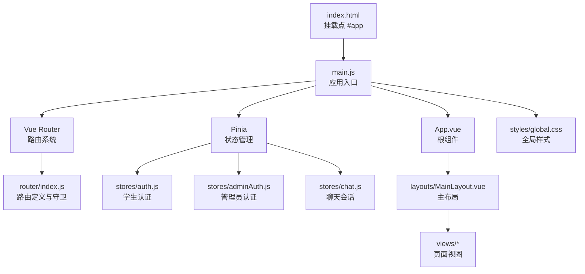
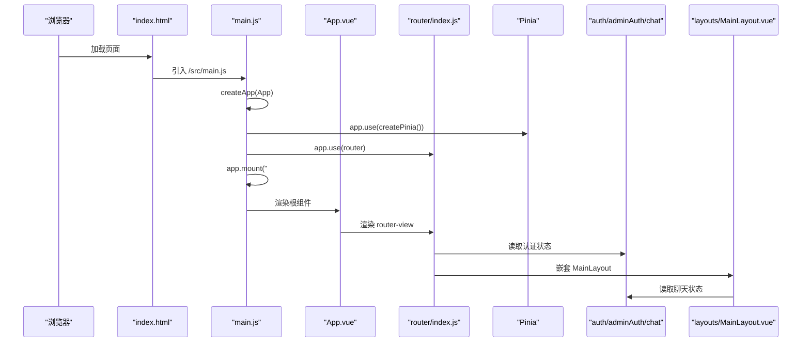
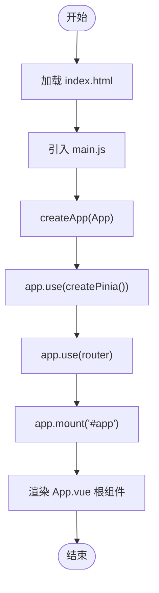
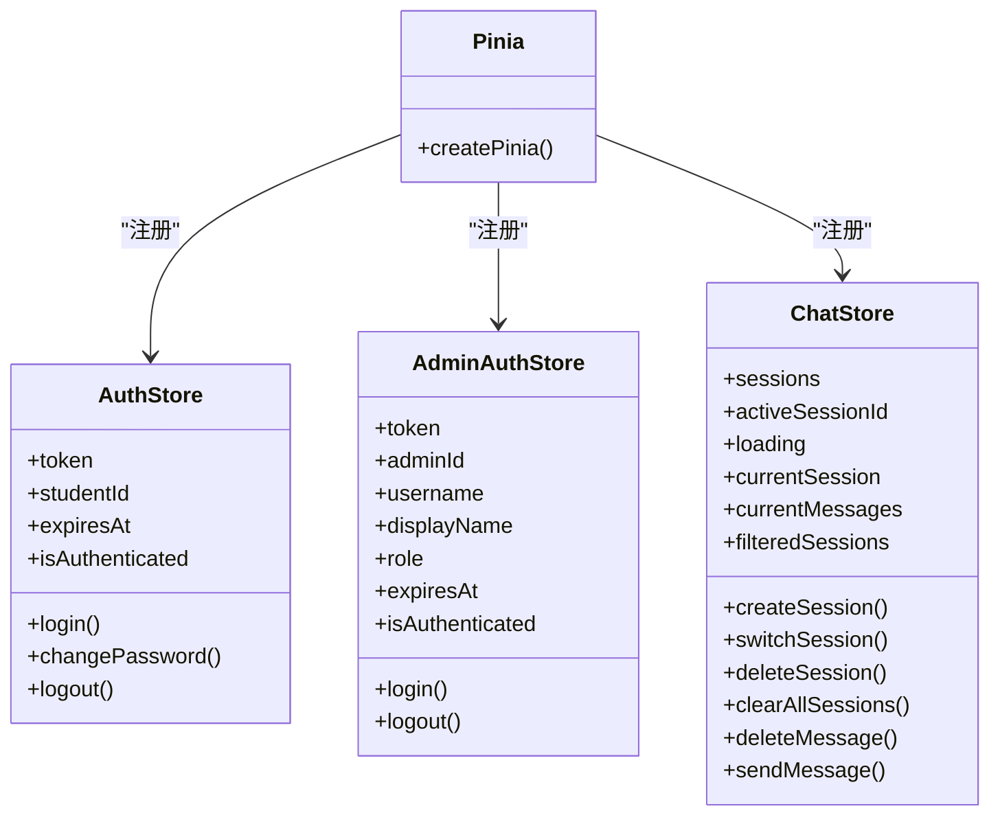
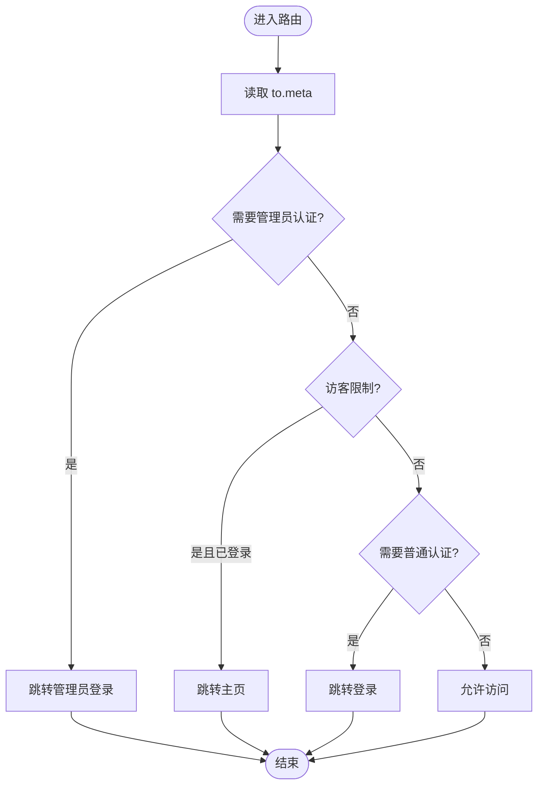
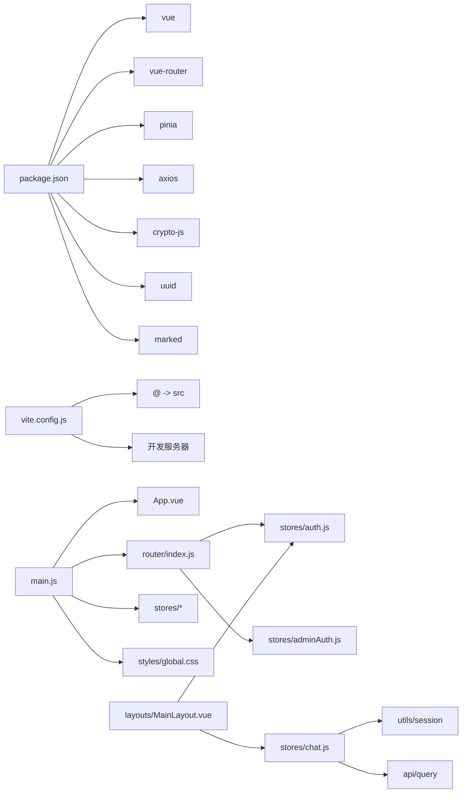

# 应用入口与初始化

<cite>
**本文引用的文件**
- [main.js](file://frontend/ai_assistant/src/main.js)
- [App.vue](file://frontend/ai_assistant/src/App.vue)
- [router/index.js](file://frontend/ai_assistant/src/router/index.js)
- [stores/auth.js](file://frontend/ai_assistant/src/stores/auth.js)
- [stores/adminAuth.js](file://frontend/ai_assistant/src/stores/adminAuth.js)
- [stores/chat.js](file://frontend/ai_assistant/src/stores/chat.js)
- [layouts/MainLayout.vue](file://frontend/ai_assistant/src/layouts/MainLayout.vue)
- [styles/global.css](file://frontend/ai_assistant/src/styles/global.css)
- [package.json](file://frontend/ai_assistant/package.json)
- [vite.config.js](file://frontend/ai_assistant/vite.config.js)
- [index.html](file://frontend/ai_assistant/index.html)
</cite>

## 目录
1. [简介](#简介)
2. [项目结构](#项目结构)
3. [核心组件](#核心组件)
4. [架构总览](#架构总览)
5. [详细组件分析](#详细组件分析)
6. [依赖关系分析](#依赖关系分析)
7. [性能考虑](#性能考虑)
8. [故障排查指南](#故障排查指南)
9. [结论](#结论)

## 简介
本章节聚焦于AI校园助手前端应用的“应用入口与初始化”主题，系统性阐述从浏览器加载到Vue 3应用启动、插件注册、全局样式注入、路由与状态管理集成的完整流程。我们将以代码级视角解析：
- createApp()的使用与应用实例构建
- Pinia状态管理的集成与多仓库设计
- Vue Router的挂载与导航守卫策略
- App.vue根组件的设计理念与职责
- 全局样式的组织与CSS变量体系
- 应用启动流程中的组件树构建、生命周期钩子与错误边界处理
- 开发者最佳实践与常见问题解决方案

## 项目结构
前端项目采用典型的Vue 3 + Vite工程化结构，入口位于src/main.js，通过index.html挂载到DOM节点#app。路由、状态管理、全局样式等模块化组织，便于维护与扩展。

图表来源
- [index.html:1-13](file://frontend/ai_assistant/index.html#L1-L13)
- [main.js:1-10](file://frontend/ai_assistant/src/main.js#L1-L10)
- [App.vue:1-7](file://frontend/ai_assistant/src/App.vue#L1-L7)
- [router/index.js:1-75](file://frontend/ai_assistant/src/router/index.js#L1-L75)
- [stores/auth.js:1-77](file://frontend/ai_assistant/src/stores/auth.js#L1-L77)
- [stores/adminAuth.js:1-77](file://frontend/ai_assistant/src/stores/adminAuth.js#L1-L77)
- [stores/chat.js:1-200](file://frontend/ai_assistant/src/stores/chat.js#L1-L200)
- [layouts/MainLayout.vue:1-487](file://frontend/ai_assistant/src/layouts/MainLayout.vue#L1-L487)
- [styles/global.css:1-113](file://frontend/ai_assistant/src/styles/global.css#L1-L113)

章节来源
- [index.html:1-13](file://frontend/ai_assistant/index.html#L1-L13)
- [main.js:1-10](file://frontend/ai_assistant/src/main.js#L1-L10)
- [package.json:1-24](file://frontend/ai_assistant/package.json#L1-L24)
- [vite.config.js:1-23](file://frontend/ai_assistant/vite.config.js#L1-L23)

## 核心组件
本节从应用初始化角度，逐项解析关键组件与配置的作用与交互。

- 应用入口与插件注册
  - 使用createApp()创建应用实例，并依次注册Pinia与Vue Router插件，最后挂载到#app。
  - 全局样式通过导入global.css实现统一风格与变量体系。
  - 参考路径：[main.js:1-10](file://frontend/ai_assistant/src/main.js#L1-L10)

- 根组件App.vue
  - 采用setup语法糖，模板仅包含router-view，作为路由视图的承载容器，体现“单一职责”的根组件设计理念。
  - 参考路径：[App.vue:1-7](file://frontend/ai_assistant/src/App.vue#L1-L7)

- 路由系统
  - 基于history模式的路由，定义多级嵌套路由与动态导入视图组件。
  - 导航守卫根据meta字段判断是否需要登录、是否为访客、是否为管理员权限，实现自动重定向与访问控制。
  - 参考路径：[router/index.js:1-75](file://frontend/ai_assistant/src/router/index.js#L1-L75)

- Pinia状态管理
  - 定义多个store：学生认证、管理员认证、聊天会话，均采用组合式API风格，集中管理状态、计算属性与异步操作。
  - 认证store负责token、过期时间、登录/修改密码/登出流程；聊天store负责会话生命周期、消息流式渲染与本地持久化。
  - 参考路径：
    - [stores/auth.js:1-77](file://frontend/ai_assistant/src/stores/auth.js#L1-L77)
    - [stores/adminAuth.js:1-77](file://frontend/ai_assistant/src/stores/adminAuth.js#L1-L77)
    - [stores/chat.js:1-200](file://frontend/ai_assistant/src/stores/chat.js#L1-L200)

- 全局样式
  - 统一引入字体资源，定义CSS变量（主色、强调色、背景、阴影、圆角、过渡），覆盖基础标签样式与滚动条样式。
  - 提供路由过渡动画类名，配合router-view实现平滑切换。
  - 参考路径：[styles/global.css:1-113](file://frontend/ai_assistant/src/styles/global.css#L1-L113)

章节来源
- [main.js:1-10](file://frontend/ai_assistant/src/main.js#L1-L10)
- [App.vue:1-7](file://frontend/ai_assistant/src/App.vue#L1-L7)
- [router/index.js:1-75](file://frontend/ai_assistant/src/router/index.js#L1-L75)
- [stores/auth.js:1-77](file://frontend/ai_assistant/src/stores/auth.js#L1-L77)
- [stores/adminAuth.js:1-77](file://frontend/ai_assistant/src/stores/adminAuth.js#L1-L77)
- [stores/chat.js:1-200](file://frontend/ai_assistant/src/stores/chat.js#L1-L200)
- [styles/global.css:1-113](file://frontend/ai_assistant/src/styles/global.css#L1-L113)

## 架构总览
下图展示了应用启动的关键步骤与组件交互关系，涵盖入口初始化、插件注册、路由与状态管理集成、根组件渲染以及全局样式的注入。

图表来源
- [index.html:1-13](file://frontend/ai_assistant/index.html#L1-L13)
- [main.js:1-10](file://frontend/ai_assistant/src/main.js#L1-L10)
- [App.vue:1-7](file://frontend/ai_assistant/src/App.vue#L1-L7)
- [router/index.js:1-75](file://frontend/ai_assistant/src/router/index.js#L1-L75)
- [stores/auth.js:1-77](file://frontend/ai_assistant/src/stores/auth.js#L1-L77)
- [stores/adminAuth.js:1-77](file://frontend/ai_assistant/src/stores/adminAuth.js#L1-L77)
- [stores/chat.js:1-200](file://frontend/ai_assistant/src/stores/chat.js#L1-L200)
- [layouts/MainLayout.vue:1-487](file://frontend/ai_assistant/src/layouts/MainLayout.vue#L1-L487)

## 详细组件分析

### 应用入口与初始化流程
- 浏览器加载index.html，其中包含#app挂载点与对main.js的脚本引入。
- main.js执行以下步骤：
  - 导入Vue核心、Pinia、Router与App根组件
  - 导入全局样式global.css
  - 创建应用实例并注册插件，最后挂载到#app
- 初始化流程确保了：
  - 插件顺序正确（Pinia在Router之前注册，保证路由守卫可访问store）
  - 全局样式优先注入，避免首屏闪烁
  - 根组件仅承载router-view，降低耦合度

图表来源
- [index.html:1-13](file://frontend/ai_assistant/index.html#L1-L13)
- [main.js:1-10](file://frontend/ai_assistant/src/main.js#L1-L10)

章节来源
- [index.html:1-13](file://frontend/ai_assistant/index.html#L1-L13)
- [main.js:1-10](file://frontend/ai_assistant/src/main.js#L1-L10)

### 根组件App.vue设计理念
- 设计理念
  - 单一职责：仅承载router-view，不包含业务逻辑或UI细节
  - 最小化：减少不必要的DOM层级，提升渲染效率
  - 可扩展：通过router-view与布局组件解耦，便于后续功能扩展
- 生命周期
  - 在createApp()阶段被创建与挂载，随后由Router驱动子组件渲染
- 错误边界
  - 根组件本身不直接处理子组件异常；建议在布局或具体视图组件中设置错误边界，避免影响全局

章节来源
- [App.vue:1-7](file://frontend/ai_assistant/src/App.vue#L1-L7)

### Pinia状态管理集成
- 多仓库设计
  - 认证仓库：学生认证与管理员认证分别独立管理，避免交叉污染
  - 聊天仓库：集中管理会话、消息、搜索与本地持久化
- 注册与使用
  - 在main.js中通过app.use(createPinia())完成全局注册
  - 在组件中通过useXxxStore()组合式API访问状态与方法
- 数据持久化
  - 认证信息存储于localStorage，结合过期时间实现安全与可用性平衡
  - 聊天会话与活动会话ID持久化至localStorage，保障刷新后继续对话

图表来源
- [stores/auth.js:1-77](file://frontend/ai_assistant/src/stores/auth.js#L1-L77)
- [stores/adminAuth.js:1-77](file://frontend/ai_assistant/src/stores/adminAuth.js#L1-L77)
- [stores/chat.js:1-200](file://frontend/ai_assistant/src/stores/chat.js#L1-L200)
- [main.js:1-10](file://frontend/ai_assistant/src/main.js#L1-L10)

章节来源
- [stores/auth.js:1-77](file://frontend/ai_assistant/src/stores/auth.js#L1-L77)
- [stores/adminAuth.js:1-77](file://frontend/ai_assistant/src/stores/adminAuth.js#L1-L77)
- [stores/chat.js:1-200](file://frontend/ai_assistant/src/stores/chat.js#L1-L200)
- [main.js:1-10](file://frontend/ai_assistant/src/main.js#L1-L10)

### Vue Router挂载与导航守卫
- 路由定义
  - 定义登录页、主页子路由、管理员登录与仪表盘等路径
  - 使用动态导入视图组件，实现按需加载与打包优化
- 导航守卫策略
  - 根据meta字段判断是否需要登录、访客限制或管理员权限
  - 未满足条件时自动重定向至目标路由，提升用户体验
- 嵌套路由
  - 主页采用嵌套布局，内部包含聊天、个人资料、修改密码等子路由

图表来源
- [router/index.js:57-73](file://frontend/ai_assistant/src/router/index.js#L57-L73)

章节来源
- [router/index.js:1-75](file://frontend/ai_assistant/src/router/index.js#L1-L75)

### 全局样式组织与CSS变量体系
- 字体与基础样式
  - 引入Google Fonts Inter字体，统一字体家族
  - 重置基础标签样式，设置box-sizing与滚动条样式
- CSS变量
  - 定义主色、强调色、背景、边框、文字、语义色、阴影、圆角、过渡等变量
  - 通过var()在组件中复用，便于主题切换与一致性维护
- 路由过渡
  - 提供淡入淡出与上滑过渡类，配合router-view实现流畅切换

章节来源
- [styles/global.css:1-113](file://frontend/ai_assistant/src/styles/global.css#L1-L113)

### 主布局与组件树构建
- 主布局MainLayout
  - 包含左侧边栏（Logo、新建对话、搜索、会话列表）、移动端遮罩、主内容区与底部导航
  - 通过useAuthStore与useChatStore读取认证与聊天状态，实现侧边栏与内容联动
  - 响应式设计：在小屏设备自动折叠侧边栏并显示移动端顶栏
- 组件树
  - App.vue -> MainLayout -> 各个子路由视图（Chat/Profile/ChangePassword/AdminLogin/AdminDashboard）
  - 路由守卫在进入前决定渲染哪个视图

章节来源
- [layouts/MainLayout.vue:1-487](file://frontend/ai_assistant/src/layouts/MainLayout.vue#L1-L487)

## 依赖关系分析
- 依赖清单
  - Vue 3、Vue Router 4、Pinia 2、Axios、CryptoJS、UUID、Marked等
  - Vite开发服务器与别名@指向src目录，便于模块导入
- 关键依赖关系
  - main.js依赖App.vue、router/index.js、stores/*与global.css
  - router/index.js依赖stores/auth.js与stores/adminAuth.js用于导航守卫
  - layouts/MainLayout.vue依赖stores/auth.js与stores/chat.js
  - stores/chat.js依赖utils/session与api/query

图表来源
- [package.json:1-24](file://frontend/ai_assistant/package.json#L1-L24)
- [vite.config.js:1-23](file://frontend/ai_assistant/vite.config.js#L1-L23)
- [main.js:1-10](file://frontend/ai_assistant/src/main.js#L1-L10)
- [router/index.js:1-75](file://frontend/ai_assistant/src/router/index.js#L1-L75)
- [layouts/MainLayout.vue:1-487](file://frontend/ai_assistant/src/layouts/MainLayout.vue#L1-L487)
- [stores/chat.js:1-200](file://frontend/ai_assistant/src/stores/chat.js#L1-L200)

章节来源
- [package.json:1-24](file://frontend/ai_assistant/package.json#L1-L24)
- [vite.config.js:1-23](file://frontend/ai_assistant/vite.config.js#L1-L23)
- [main.js:1-10](file://frontend/ai_assistant/src/main.js#L1-L10)
- [router/index.js:1-75](file://frontend/ai_assistant/src/router/index.js#L1-L75)
- [layouts/MainLayout.vue:1-487](file://frontend/ai_assistant/src/layouts/MainLayout.vue#L1-L487)
- [stores/chat.js:1-200](file://frontend/ai_assistant/src/stores/chat.js#L1-L200)

## 性能考虑
- 路由懒加载
  - 通过动态导入视图组件，实现按需加载，减少首屏体积与初次渲染时间
- 状态持久化
  - 认证与聊天状态持久化至localStorage，避免频繁请求与重复计算
- CSS变量与过渡
  - 使用CSS变量统一主题，过渡动画类名减少重复样式定义
- 开发服务器优化
  - Vite启用开发服务器与代理，提升开发体验与跨域调试效率

## 故障排查指南
- 应用无法挂载到#app
  - 检查index.html中是否存在#app节点与正确的脚本引入路径
  - 参考路径：[index.html:1-13](file://frontend/ai_assistant/index.html#L1-L13)
- 路由跳转异常或循环重定向
  - 检查router/index.js中的导航守卫逻辑与meta字段配置
  - 参考路径：[router/index.js:57-73](file://frontend/ai_assistant/src/router/index.js#L57-L73)
- 认证状态不生效或token过期
  - 确认localStorage中存在对应token与过期时间，检查store中的isAuthenticated计算属性
  - 参考路径：
    - [stores/auth.js:24-26](file://frontend/ai_assistant/src/stores/auth.js#L24-L26)
    - [stores/adminAuth.js:24-26](file://frontend/ai_assistant/src/stores/adminAuth.js#L24-L26)
- 聊天会话丢失或消息不显示
  - 检查localStorage中会话数据与activeSessionId，确认persist()调用时机
  - 参考路径：[stores/chat.js:61-63](file://frontend/ai_assistant/src/stores/chat.js#L61-L63)
- 全局样式未生效
  - 确认main.js中已导入global.css，检查CSS变量与选择器优先级
  - 参考路径：[main.js:5](file://frontend/ai_assistant/src/main.js#L5)、[styles/global.css:1-113](file://frontend/ai_assistant/src/styles/global.css#L1-L113)

章节来源
- [index.html:1-13](file://frontend/ai_assistant/index.html#L1-L13)
- [router/index.js:57-73](file://frontend/ai_assistant/src/router/index.js#L57-L73)
- [stores/auth.js:24-26](file://frontend/ai_assistant/src/stores/auth.js#L24-L26)
- [stores/adminAuth.js:24-26](file://frontend/ai_assistant/src/stores/adminAuth.js#L24-L26)
- [stores/chat.js:61-63](file://frontend/ai_assistant/src/stores/chat.js#L61-L63)
- [main.js:5](file://frontend/ai_assistant/src/main.js#L5)
- [styles/global.css:1-113](file://frontend/ai_assistant/src/styles/global.css#L1-L113)

## 结论
本文件从应用入口与初始化的角度，全面解析了AI校园助手前端的启动流程、插件注册机制、全局样式配置、路由与状态管理集成。通过清晰的组件职责划分与模块化组织，项目实现了高内聚、低耦合的架构设计。遵循本文的最佳实践与故障排查建议，开发者可以快速定位问题、优化性能并稳定交付高质量的前端应用。