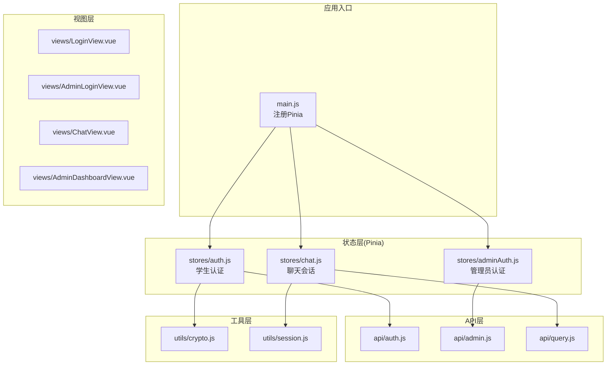
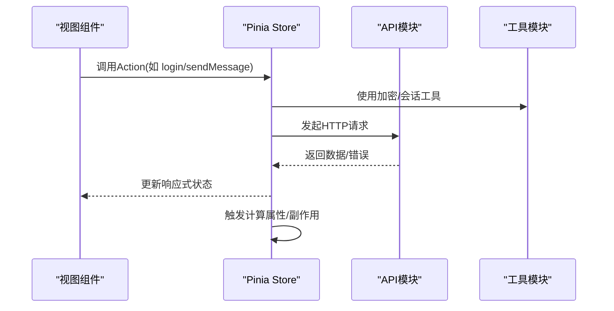
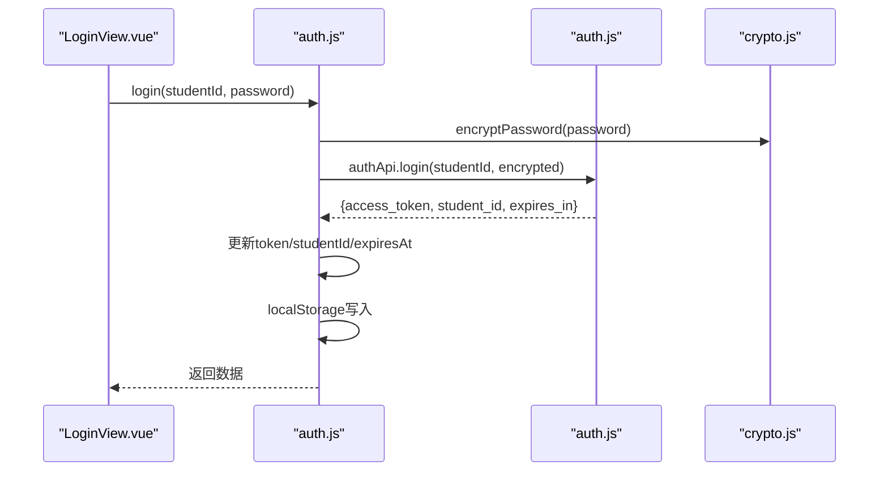
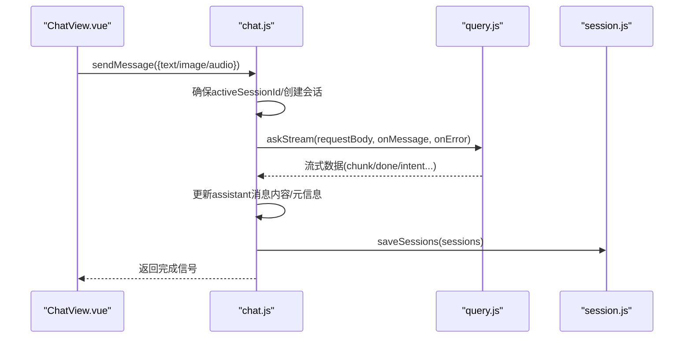
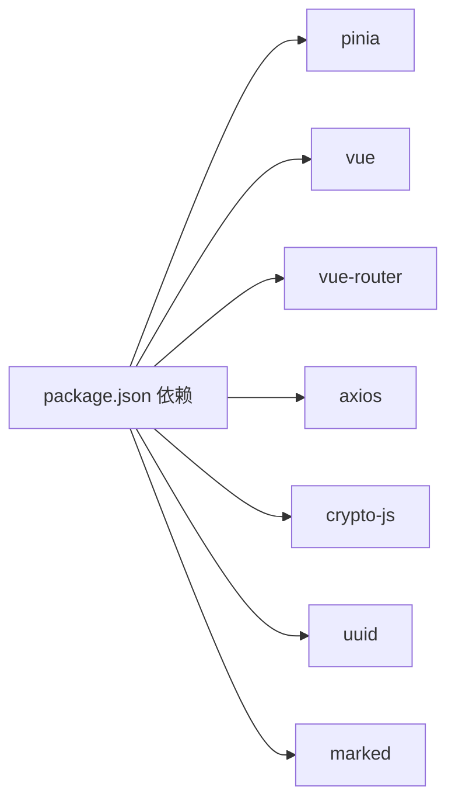

# 状态管理架构

<cite>
**本文引用的文件**
- [frontend/ai_assistant/src/main.js](file://frontend/ai_assistant/src/main.js)
- [frontend/ai_assistant/package.json](file://frontend/ai_assistant/package.json)
- [frontend/ai_assistant/src/stores/auth.js](file://frontend/ai_assistant/src/stores/auth.js)
- [frontend/ai_assistant/src/stores/adminAuth.js](file://frontend/ai_assistant/src/stores/adminAuth.js)
- [frontend/ai_assistant/src/stores/chat.js](file://frontend/ai_assistant/src/stores/chat.js)
- [frontend/ai_assistant/src/api/auth.js](file://frontend/ai_assistant/src/api/auth.js)
- [frontend/ai_assistant/src/api/admin.js](file://frontend/ai_assistant/src/api/admin.js)
- [frontend/ai_assistant/src/api/query.js](file://frontend/ai_assistant/src/api/query.js)
- [frontend/ai_assistant/src/utils/crypto.js](file://frontend/ai_assistant/src/utils/crypto.js)
- [frontend/ai_assistant/src/utils/session.js](file://frontend/ai_assistant/src/utils/session.js)
- [frontend/ai_assistant/src/views/LoginView.vue](file://frontend/ai_assistant/src/views/LoginView.vue)
- [frontend/ai_assistant/src/views/AdminLoginView.vue](file://frontend/ai_assistant/src/views/AdminLoginView.vue)
- [frontend/ai_assistant/src/views/ChatView.vue](file://frontend/ai_assistant/src/views/ChatView.vue)
- [frontend/ai_assistant/src/views/AdminDashboardView.vue](file://frontend/ai_assistant/src/views/AdminDashboardView.vue)
</cite>

## 目录
1. [引言](#引言)
2. [项目结构](#项目结构)
3. [核心组件](#核心组件)
4. [架构总览](#架构总览)
5. [详细组件分析](#详细组件分析)
6. [依赖关系分析](#依赖关系分析)
7. [性能考量](#性能考量)
8. [故障排查指南](#故障排查指南)
9. [结论](#结论)
10. [附录](#附录)

## 引言
本文件面向AI校园助手项目的前端状态管理，系统性梳理基于Pinia的状态架构设计与实现细节，覆盖以下主题：
- Store定义与模块化组织
- 状态响应式更新与计算属性
- Action方法设计与副作用处理
- 用户认证与管理员认证状态管理
- 聊天会话状态与多模态消息流式渲染
- 状态持久化策略与跨组件共享
- 状态同步机制与最佳实践
- 调试技巧与常见问题定位

## 项目结构
前端采用Vue 3 + Pinia + Vue Router的组合，状态管理集中于src/stores目录，API层位于src/api，工具函数位于src/utils，视图组件位于src/views。

图表来源
- [frontend/ai_assistant/src/main.js:1-10](file://frontend/ai_assistant/src/main.js#L1-L10)
- [frontend/ai_assistant/src/stores/auth.js:1-77](file://frontend/ai_assistant/src/stores/auth.js#L1-L77)
- [frontend/ai_assistant/src/stores/adminAuth.js:1-77](file://frontend/ai_assistant/src/stores/adminAuth.js#L1-L77)
- [frontend/ai_assistant/src/stores/chat.js:1-278](file://frontend/ai_assistant/src/stores/chat.js#L1-L278)
- [frontend/ai_assistant/src/api/auth.js:1-36](file://frontend/ai_assistant/src/api/auth.js#L1-L36)
- [frontend/ai_assistant/src/api/admin.js:1-41](file://frontend/ai_assistant/src/api/admin.js#L1-L41)
- [frontend/ai_assistant/src/api/query.js:1-141](file://frontend/ai_assistant/src/api/query.js#L1-L141)
- [frontend/ai_assistant/src/utils/crypto.js:1-40](file://frontend/ai_assistant/src/utils/crypto.js#L1-L40)
- [frontend/ai_assistant/src/utils/session.js:1-70](file://frontend/ai_assistant/src/utils/session.js#L1-L70)
- [frontend/ai_assistant/src/views/LoginView.vue:1-343](file://frontend/ai_assistant/src/views/LoginView.vue#L1-L343)
- [frontend/ai_assistant/src/views/AdminLoginView.vue:1-261](file://frontend/ai_assistant/src/views/AdminLoginView.vue#L1-L261)
- [frontend/ai_assistant/src/views/ChatView.vue:1-800](file://frontend/ai_assistant/src/views/ChatView.vue#L1-L800)
- [frontend/ai_assistant/src/views/AdminDashboardView.vue:1-200](file://frontend/ai_assistant/src/views/AdminDashboardView.vue#L1-L200)

章节来源
- [frontend/ai_assistant/src/main.js:1-10](file://frontend/ai_assistant/src/main.js#L1-L10)
- [frontend/ai_assistant/package.json:1-24](file://frontend/ai_assistant/package.json#L1-L24)

## 核心组件
本项目采用Composition API风格的Pinia Store，围绕三大领域状态展开：
- 学生认证状态：token、studentId、expiresAt、isAuthenticated、登录/改密/登出
- 管理员认证状态：token、adminId、username、displayName、role、expiresAt、isAuthenticated、登录/登出
- 聊天会话状态：sessions、activeSessionId、loadingStates、searchKeyword、当前会话/消息、会话CRUD、消息发送与流式渲染、搜索过滤、localStorage持久化

章节来源
- [frontend/ai_assistant/src/stores/auth.js:17-77](file://frontend/ai_assistant/src/stores/auth.js#L17-L77)
- [frontend/ai_assistant/src/stores/adminAuth.js:16-77](file://frontend/ai_assistant/src/stores/adminAuth.js#L16-L77)
- [frontend/ai_assistant/src/stores/chat.js:22-278](file://frontend/ai_assistant/src/stores/chat.js#L22-L278)

## 架构总览
Pinia在应用启动时被全局注册，各Store通过defineStore统一导出，视图组件通过useXxxStore注入状态与动作。认证与聊天两大域分别对接独立API模块，并通过工具模块完成加密与会话持久化。

图表来源
- [frontend/ai_assistant/src/views/LoginView.vue:78-122](file://frontend/ai_assistant/src/views/LoginView.vue#L78-L122)
- [frontend/ai_assistant/src/views/ChatView.vue:222-333](file://frontend/ai_assistant/src/views/ChatView.vue#L222-L333)
- [frontend/ai_assistant/src/stores/auth.js:28-66](file://frontend/ai_assistant/src/stores/auth.js#L28-L66)
- [frontend/ai_assistant/src/stores/chat.js:133-230](file://frontend/ai_assistant/src/stores/chat.js#L133-L230)
- [frontend/ai_assistant/src/api/auth.js:8-36](file://frontend/ai_assistant/src/api/auth.js#L8-L36)
- [frontend/ai_assistant/src/api/query.js:28-141](file://frontend/ai_assistant/src/api/query.js#L28-L141)
- [frontend/ai_assistant/src/utils/crypto.js:26-40](file://frontend/ai_assistant/src/utils/crypto.js#L26-L40)
- [frontend/ai_assistant/src/utils/session.js:37-70](file://frontend/ai_assistant/src/utils/session.js#L37-L70)

## 详细组件分析

### 认证状态管理（学生/管理员）
- 状态定义
  - 学生认证：token、studentId、expiresAt；计算属性isAuthenticated用于判定登录有效性
  - 管理员认证：token、adminId、username、displayName、role、expiresAt；计算属性isAuthenticated
- 动作设计
  - 登录：加密密码 → 调用API → 写入store与localStorage → 返回后端数据
  - 修改密码（仅学生）：加密旧/新密码 → 调用API → 返回结果
  - 登出：清空store与localStorage对应键值
- 数据持久化
  - 通过localStorage存储令牌、用户标识与过期时间，实现刷新后状态恢复
- 跨组件共享
  - 组件通过useAuthStore/useAdminAuthStore注入，实现全局共享与响应式更新

图表来源
- [frontend/ai_assistant/src/views/LoginView.vue:94-121](file://frontend/ai_assistant/src/views/LoginView.vue#L94-L121)
- [frontend/ai_assistant/src/stores/auth.js:28-43](file://frontend/ai_assistant/src/stores/auth.js#L28-L43)
- [frontend/ai_assistant/src/api/auth.js:15-20](file://frontend/ai_assistant/src/api/auth.js#L15-L20)
- [frontend/ai_assistant/src/utils/crypto.js:26-40](file://frontend/ai_assistant/src/utils/crypto.js#L26-L40)

章节来源
- [frontend/ai_assistant/src/stores/auth.js:17-77](file://frontend/ai_assistant/src/stores/auth.js#L17-L77)
- [frontend/ai_assistant/src/stores/adminAuth.js:16-77](file://frontend/ai_assistant/src/stores/adminAuth.js#L16-L77)
- [frontend/ai_assistant/src/api/auth.js:1-36](file://frontend/ai_assistant/src/api/auth.js#L1-L36)
- [frontend/ai_assistant/src/api/admin.js:1-41](file://frontend/ai_assistant/src/api/admin.js#L1-L41)
- [frontend/ai_assistant/src/utils/crypto.js:1-40](file://frontend/ai_assistant/src/utils/crypto.js#L1-L40)

### 聊天会话状态管理
- 状态与计算属性
  - sessions、activeSessionId、loadingStates、searchKeyword
  - loading：根据当前会话的加载标记判断
  - currentSession/currentMessages：当前激活会话及其消息列表
  - filteredSessions：按标题或消息内容关键词过滤
- 会话生命周期
  - 创建：生成唯一session_id，插入sessions，设置为激活会话，持久化
  - 切换：更新activeSessionId并持久化
  - 删除：从sessions移除；若删除激活会话则自动切换至下一个
  - 清空：尝试调用后端清理接口，随后清空本地会话并重置激活会话
- 消息发送与流式渲染
  - 自动确保存在激活会话；向后端发起请求；预置助手消息占位
  - 流式回调中增量拼接content，更新intent/response_time_ms/cached等字段
  - 错误处理：捕获异常并以错误消息形式写入助手消息
- 搜索与过滤
  - 关键词过滤会话标题或消息内容
- 持久化
  - 本地持久化sessions与activeSessionId，保证刷新后恢复

图表来源
- [frontend/ai_assistant/src/views/ChatView.vue:312-333](file://frontend/ai_assistant/src/views/ChatView.vue#L312-L333)
- [frontend/ai_assistant/src/stores/chat.js:133-230](file://frontend/ai_assistant/src/stores/chat.js#L133-L230)
- [frontend/ai_assistant/src/api/query.js:28-141](file://frontend/ai_assistant/src/api/query.js#L28-L141)
- [frontend/ai_assistant/src/utils/session.js:50-70](file://frontend/ai_assistant/src/utils/session.js#L50-L70)

章节来源
- [frontend/ai_assistant/src/stores/chat.js:22-278](file://frontend/ai_assistant/src/stores/chat.js#L22-L278)
- [frontend/ai_assistant/src/utils/session.js:1-70](file://frontend/ai_assistant/src/utils/session.js#L1-L70)
- [frontend/ai_assistant/src/views/ChatView.vue:1-800](file://frontend/ai_assistant/src/views/ChatView.vue#L1-L800)

### 状态持久化策略
- 认证持久化
  - 学生与管理员分别使用独立localStorage键，包含token、用户标识、过期时间戳
- 会话持久化
  - sessions与activeSessionId通过localStorage保存，读取时JSON反序列化，异常时回退为空数组
- 策略优势
  - 刷新后状态恢复，提升用户体验
  - 降低后端压力，减少重复初始化成本

章节来源
- [frontend/ai_assistant/src/stores/auth.js:13-15](file://frontend/ai_assistant/src/stores/auth.js#L13-L15)
- [frontend/ai_assistant/src/stores/adminAuth.js:9-14](file://frontend/ai_assistant/src/stores/adminAuth.js#L9-L14)
- [frontend/ai_assistant/src/stores/chat.js:60-63](file://frontend/ai_assistant/src/stores/chat.js#L60-L63)
- [frontend/ai_assistant/src/utils/session.js:37-52](file://frontend/ai_assistant/src/utils/session.js#L37-L52)

### 跨组件状态共享与同步
- 全局注册
  - 应用启动时注册Pinia，所有Store在全局可注入
- 组件注入
  - 登录页、聊天页、管理员后台等视图通过useXxxStore注入状态与动作
- 响应式更新
  - Store内部使用ref/computed，视图层通过模板绑定自动更新
- 同步机制
  - 认证状态通过计算属性isAuthenticated统一判定；聊天会话通过activeSessionId与sessions保持一致性

章节来源
- [frontend/ai_assistant/src/main.js:7-10](file://frontend/ai_assistant/src/main.js#L7-L10)
- [frontend/ai_assistant/src/views/LoginView.vue:81-84](file://frontend/ai_assistant/src/views/LoginView.vue#L81-L84)
- [frontend/ai_assistant/src/views/ChatView.vue:224-228](file://frontend/ai_assistant/src/views/ChatView.vue#L224-L228)
- [frontend/ai_assistant/src/views/AdminDashboardView.vue:182-185](file://frontend/ai_assistant/src/views/AdminDashboardView.vue#L182-L185)

### 最佳实践
- Store模块化设计
  - 按领域拆分：auth.js、adminAuth.js、chat.js，职责单一
  - 统一命名：store导出函数使用useXxxStore，便于识别
- 状态命名规范
  - 使用语义化名称：如token、studentId、adminId、sessions、activeSessionId
  - 计算属性以is/has/should等前缀表达布尔含义
- 副作用处理
  - 登录成功后立即写入localStorage，确保跨页面可用
  - 发送消息时预置占位消息，流式更新content，避免UI闪烁
  - 错误处理统一在store内转换为用户可读提示
- 安全与隐私
  - 密码加密在前端完成，避免明文传输
  - 令牌随请求头携带，避免泄露

章节来源
- [frontend/ai_assistant/src/stores/auth.js:1-77](file://frontend/ai_assistant/src/stores/auth.js#L1-L77)
- [frontend/ai_assistant/src/stores/adminAuth.js:1-77](file://frontend/ai_assistant/src/stores/adminAuth.js#L1-L77)
- [frontend/ai_assistant/src/stores/chat.js:1-278](file://frontend/ai_assistant/src/stores/chat.js#L1-L278)
- [frontend/ai_assistant/src/utils/crypto.js:1-40](file://frontend/ai_assistant/src/utils/crypto.js#L1-L40)

## 依赖关系分析
- 应用依赖
  - Vue 3、Pinia、Vue Router、Axios、CryptoJS、UUID、Marked
- Store与API耦合
  - 认证Store依赖auth.js；管理员Store依赖admin.js；聊天Store依赖query.js
- 工具依赖
  - 加密工具用于认证；会话工具用于聊天持久化

图表来源
- [frontend/ai_assistant/package.json:11-19](file://frontend/ai_assistant/package.json#L11-L19)

章节来源
- [frontend/ai_assistant/package.json:1-24](file://frontend/ai_assistant/package.json#L1-L24)

## 性能考量
- 响应式粒度
  - 将loadingStates按会话维度维护，避免全局loading导致的过度重渲染
- 持久化频率
  - 仅在关键变更（新增/删除/切换/清空/消息增删）时持久化，降低IO开销
- 流式渲染
  - 逐步追加content，配合最小DOM更新，保证流畅体验
- 计算属性缓存
  - 使用computed缓存派生状态，减少重复计算

## 故障排查指南
- 登录失败
  - 检查后端返回状态码与错误详情，前端根据状态码映射提示
  - 确认加密流程与后端一致（IV与密文编码）
- 会话异常
  - 检查localStorage中的sessions与activeSessionId是否一致
  - 若出现空会话，确认createSession逻辑是否执行
- 流式输出卡顿
  - 确认后端SSE响应格式正确，前端解析逻辑健壮
  - 检查done标记与兜底逻辑
- 权限过期
  - 认证计算属性isAuthenticated基于当前时间与expiresAt判断，过期需重新登录

章节来源
- [frontend/ai_assistant/src/views/LoginView.vue:94-121](file://frontend/ai_assistant/src/views/LoginView.vue#L94-L121)
- [frontend/ai_assistant/src/stores/chat.js:235-257](file://frontend/ai_assistant/src/stores/chat.js#L235-L257)
- [frontend/ai_assistant/src/api/query.js:28-141](file://frontend/ai_assistant/src/api/query.js#L28-L141)
- [frontend/ai_assistant/src/utils/crypto.js:26-40](file://frontend/ai_assistant/src/utils/crypto.js#L26-L40)

## 结论
本项目以Pinia为核心，结合工具模块与API层，构建了清晰、可维护的状态管理架构。通过模块化的Store设计、严格的持久化策略与完善的错误处理，实现了认证与聊天两大领域的稳定运行。建议持续优化流式渲染与持久化时机，进一步提升交互性能与可靠性。

## 附录
- 调试技巧
  - 在浏览器控制台打印store状态，观察响应式更新
  - 使用Vue DevTools追踪组件渲染与状态变更
  - 在API层增加请求/响应日志，定位网络问题
- 扩展建议
  - 引入中间件或插件统一处理错误与加载状态
  - 对高频更新的会话列表引入节流/防抖
  - 将通用逻辑抽象为composables，复用至多个Store