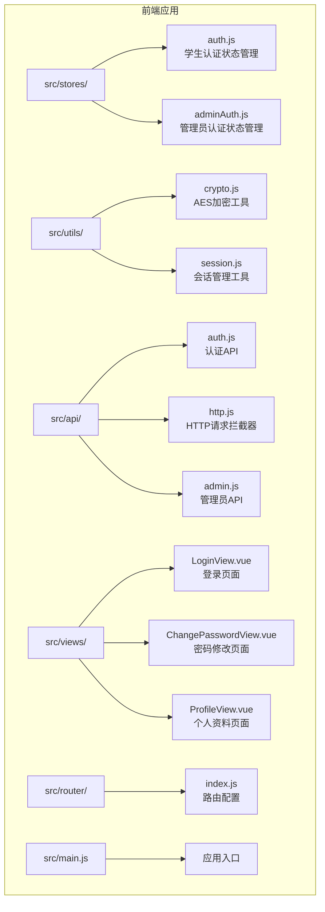
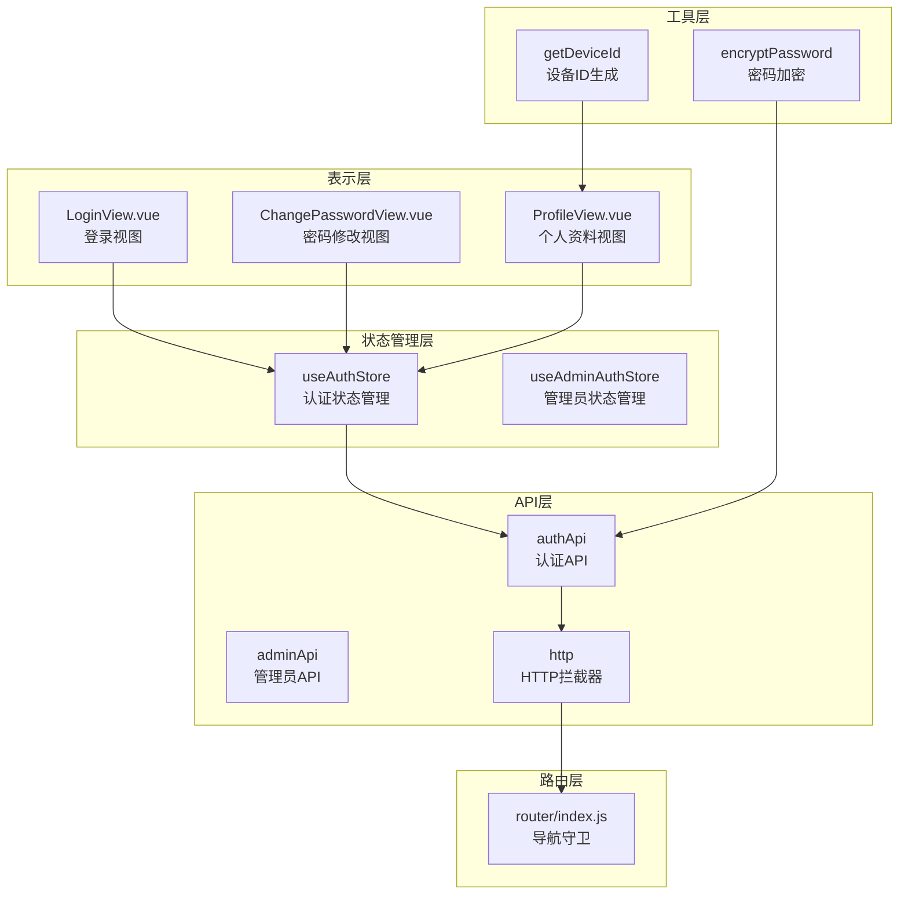
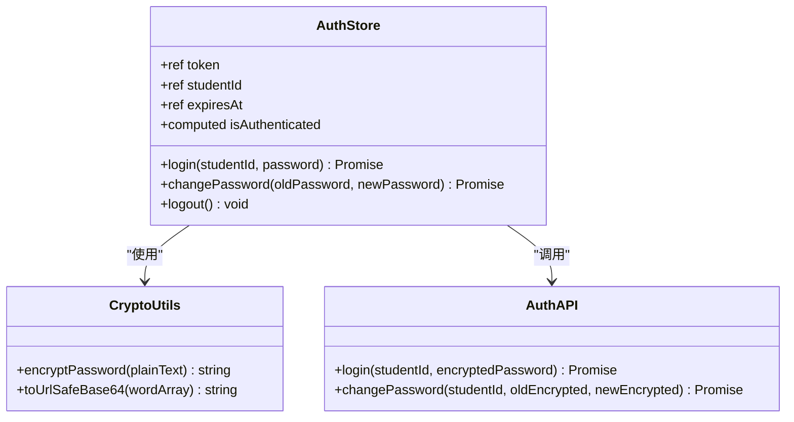
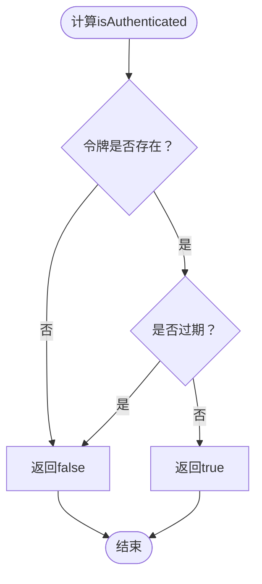
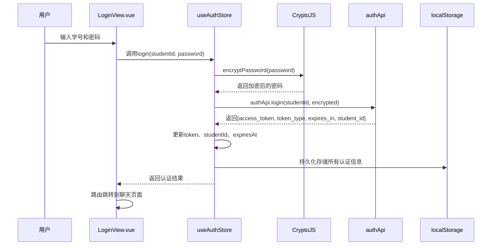
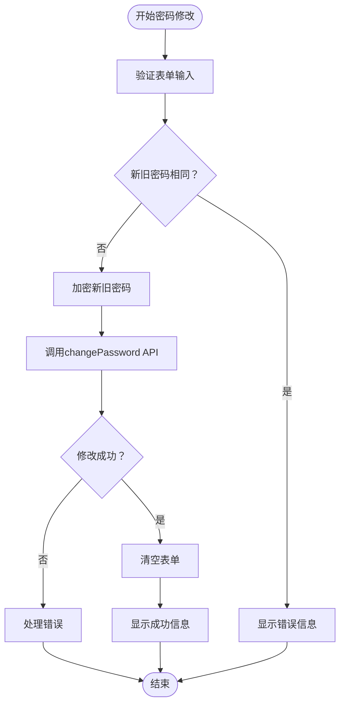
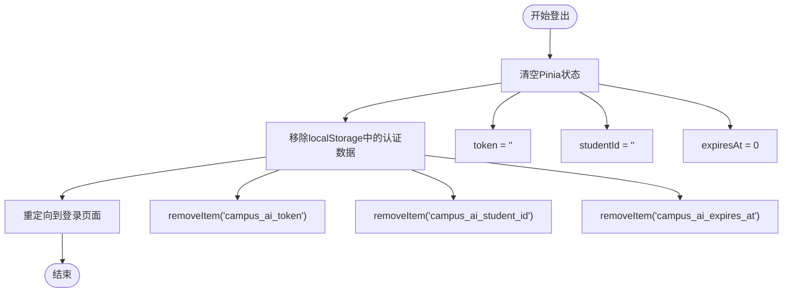
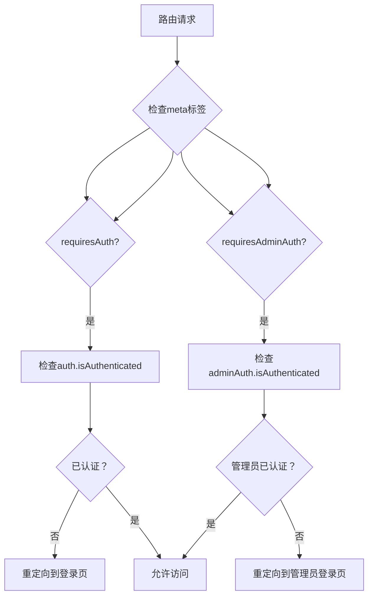
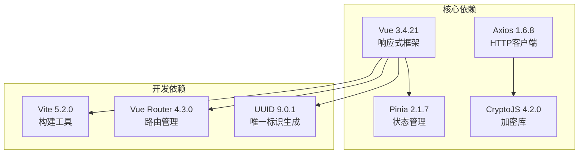
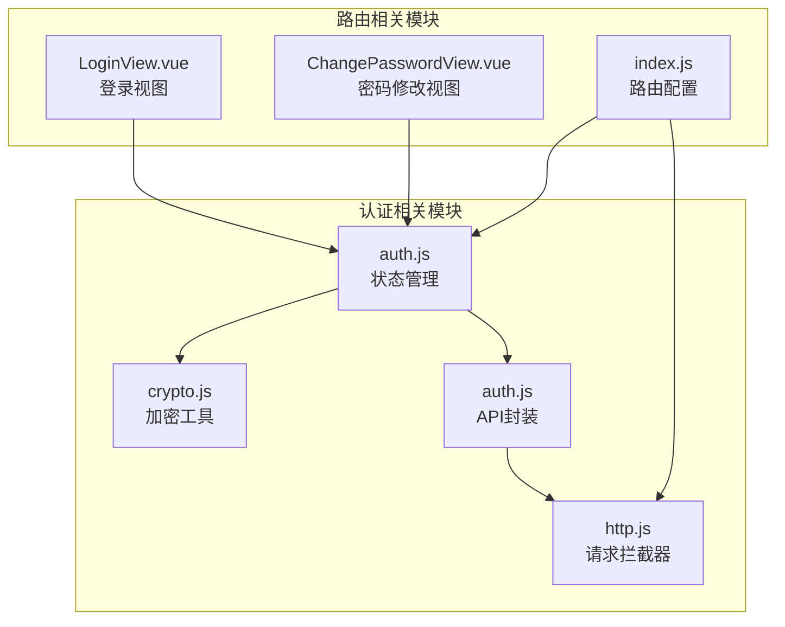

# 用户认证状态管理

<cite>
**本文档引用的文件**
- [auth.js](file://frontend/ai_assistant/src/stores/auth.js)
- [crypto.js](file://frontend/ai_assistant/src/utils/crypto.js)
- [auth.js](file://frontend/ai_assistant/src/api/auth.js)
- [http.js](file://frontend/ai_assistant/src/api/http.js)
- [index.js](file://frontend/ai_assistant/src/router/index.js)
- [LoginView.vue](file://frontend/ai_assistant/src/views/LoginView.vue)
- [ChangePasswordView.vue](file://frontend/ai_assistant/src/views/ChangePasswordView.vue)
- [ProfileView.vue](file://frontend/ai_assistant/src/views/ProfileView.vue)
- [adminAuth.js](file://frontend/ai_assistant/src/stores/adminAuth.js)
- [session.js](file://frontend/ai_assistant/src/utils/session.js)
- [admin.js](file://frontend/ai_assistant/src/api/admin.js)
- [main.js](file://frontend/ai_assistant/src/main.js)
</cite>

## 目录
1. [简介](#简介)
2. [项目结构](#项目结构)
3. [核心组件](#核心组件)
4. [架构概览](#架构概览)
5. [详细组件分析](#详细组件分析)
6. [依赖关系分析](#依赖关系分析)
7. [性能考虑](#性能考虑)
8. [故障排除指南](#故障排除指南)
9. [结论](#结论)

## 简介

AI校园助手项目的用户认证状态管理系统是一个基于Vue 3和Pinia的状态管理解决方案。该系统实现了完整的用户认证流程，包括密码加密、JWT令牌管理、localStorage持久化存储、过期时间控制等功能。系统采用前后端分离架构，前端负责用户界面交互和状态管理，后端提供RESTful API接口。

## 项目结构

认证系统主要分布在以下目录结构中：



**图表来源**
- [auth.js:1-77](file://frontend/ai_assistant/src/stores/auth.js#L1-L77)
- [crypto.js:1-40](file://frontend/ai_assistant/src/utils/crypto.js#L1-L40)
- [http.js:1-49](file://frontend/ai_assistant/src/api/http.js#L1-L49)

**章节来源**
- [auth.js:1-77](file://frontend/ai_assistant/src/stores/auth.js#L1-L77)
- [main.js:1-10](file://frontend/ai_assistant/src/main.js#L1-L10)

## 核心组件

### 认证状态管理器

认证状态管理器是整个系统的核心组件，负责管理用户认证状态、令牌存储和过期时间控制。

#### 主要功能特性

1. **状态管理**：使用Pinia进行响应式状态管理
2. **令牌存储**：localStorage持久化存储JWT令牌
3. **过期控制**：基于时间戳的令牌过期检测
4. **计算属性**：动态计算认证状态
5. **异步操作**：支持登录、修改密码、登出等异步操作

#### 关键常量定义

系统使用统一的localStorage键名规范：
- `campus_ai_token`：JWT访问令牌
- `campus_ai_student_id`：学生ID
- `campus_ai_expires_at`：过期时间戳

**章节来源**
- [auth.js:13-21](file://frontend/ai_assistant/src/stores/auth.js#L13-L21)

## 架构概览

认证系统的整体架构采用分层设计，确保各组件职责清晰、耦合度低。



**图表来源**
- [auth.js:17-77](file://frontend/ai_assistant/src/stores/auth.js#L17-L77)
- [index.js:57-73](file://frontend/ai_assistant/src/router/index.js#L57-L73)
- [http.js:18-47](file://frontend/ai_assistant/src/api/http.js#L18-L47)

## 详细组件分析

### 认证状态管理器实现

#### 数据结构设计



**图表来源**
- [auth.js:17-77](file://frontend/ai_assistant/src/stores/auth.js#L17-L77)
- [crypto.js:26-40](file://frontend/ai_assistant/src/utils/crypto.js#L26-L40)
- [auth.js:8-36](file://frontend/ai_assistant/src/api/auth.js#L8-L36)

#### 计算属性isAuthenticated工作原理

`isAuthenticated`计算属性通过双重条件判断确保认证状态的准确性：

1. **令牌存在性检查**：`!!token.value`确保JWT令牌非空
2. **过期时间检查**：`Date.now() < expiresAt.value`验证令牌有效性



**图表来源**
- [auth.js:24-26](file://frontend/ai_assistant/src/stores/auth.js#L24-L26)

**章节来源**
- [auth.js:24-26](file://frontend/ai_assistant/src/stores/auth.js#L24-L26)

### 登录流程详解

登录流程包含密码加密、API调用、状态更新和持久化存储四个关键步骤。



**图表来源**
- [LoginView.vue:94-121](file://frontend/ai_assistant/src/views/LoginView.vue#L94-L121)
- [auth.js:29-43](file://frontend/ai_assistant/src/stores/auth.js#L29-L43)
- [crypto.js:26-40](file://frontend/ai_assistant/src/utils/crypto.js#L26-L40)

#### 登录流程的关键实现细节

1. **密码加密**：使用AES-CBC算法对密码进行加密
2. **令牌存储**：将JWT令牌、学生ID和过期时间存储到localStorage
3. **状态同步**：同时更新Pinia状态和localStorage
4. **时间计算**：`expiresAt = Date.now() + data.expires_in * 1000`

**章节来源**
- [auth.js:29-43](file://frontend/ai_assistant/src/stores/auth.js#L29-L43)

### 密码修改流程

密码修改流程确保用户能够安全地更新账户密码。



**图表来源**
- [ChangePasswordView.vue:191-232](file://frontend/ai_assistant/src/views/ChangePasswordView.vue#L191-L232)
- [auth.js:46-56](file://frontend/ai_assistant/src/stores/auth.js#L46-L56)

**章节来源**
- [ChangePasswordView.vue:191-232](file://frontend/ai_assistant/src/views/ChangePasswordView.vue#L191-L232)
- [auth.js:46-56](file://frontend/ai_assistant/src/stores/auth.js#L46-L56)

### 登出清理机制

登出操作确保用户会话的完全清理，防止敏感信息泄露。



**图表来源**
- [auth.js:59-66](file://frontend/ai_assistant/src/stores/auth.js#L59-L66)

**章节来源**
- [auth.js:59-66](file://frontend/ai_assistant/src/stores/auth.js#L59-L66)

### 加密工具使用和安全考虑

#### AES-CBC加密实现

系统使用CryptoJS库实现AES-CBC加密，确保密码传输安全。

```mermaid
classDiagram
class CryptoUtils {
+string AES_KEY
+toUrlSafeBase64(wordArray) string
+encryptPassword(plainText) string
}
note for CryptoUtils : "加密格式 : iv_base64 : ciphertext_base64\n使用URL安全的Base64编码"
```

**图表来源**
- [crypto.js:9-40](file://frontend/ai_assistant/src/utils/crypto.js#L9-L40)

#### 安全策略

1. **环境变量配置**：AES密钥通过环境变量注入
2. **URL安全编码**：Base64编码转换为URL安全格式
3. **随机IV生成**：每次加密使用随机初始化向量
4. **前后端一致性**：确保加密格式与后端实现一致

**章节来源**
- [crypto.js:9-40](file://frontend/ai_assistant/src/utils/crypto.js#L9-L40)

### localStorage存储策略

#### 存储键值规范

系统采用统一的localStorage键值命名规范，避免冲突并提高可维护性：

| 键名 | 用途 | 数据类型 |
|------|------|----------|
| campus_ai_token | JWT访问令牌 | string |
| campus_ai_student_id | 学生ID | string |
| campus_ai_expires_at | 过期时间戳 | number |

#### 存储策略优势

1. **持久化存储**：浏览器关闭后仍保持认证状态
2. **快速访问**：无需网络请求即可获取认证信息
3. **跨组件共享**：多个组件可以共享认证状态
4. **性能优化**：减少重复的API调用

**章节来源**
- [auth.js:13-15](file://frontend/ai_assistant/src/stores/auth.js#L13-L15)

### 认证状态在组件间的使用模式

#### 路由守卫配合

系统通过Vue Router的导航守卫实现全局认证控制。



**图表来源**
- [index.js:57-73](file://frontend/ai_assistant/src/router/index.js#L57-L73)

#### 组件内使用示例

在Vue组件中使用认证状态的典型模式：

```javascript
// 在setup函数中导入和使用
const authStore = useAuthStore()

// 访问认证状态
const isAuth = authStore.isAuthenticated
const studentId = authStore.studentId

// 使用计算属性
const formattedExpiry = computed(() => {
  return new Date(authStore.expiresAt).toLocaleString()
})
```

**章节来源**
- [index.js:57-73](file://frontend/ai_assistant/src/router/index.js#L57-L73)
- [ProfileView.vue:105-122](file://frontend/ai_assistant/src/views/ProfileView.vue#L105-L122)

## 依赖关系分析

### 外部依赖

系统依赖以下关键外部库：



**图表来源**
- [package.json:11-23](file://frontend/ai_assistant/package.json#L11-L23)

### 内部模块依赖



**图表来源**
- [auth.js:8-11](file://frontend/ai_assistant/src/stores/auth.js#L8-L11)
- [index.js:1-4](file://frontend/ai_assistant/src/router/index.js#L1-L4)

**章节来源**
- [package.json:11-23](file://frontend/ai_assistant/package.json#L11-L23)

## 性能考虑

### 状态管理优化

1. **响应式更新**：使用Pinia的响应式特性，只在必要时重新渲染
2. **懒加载**：路由组件按需加载，减少初始包大小
3. **缓存策略**：localStorage缓存认证信息，避免重复请求

### 网络请求优化

1. **请求拦截器**：统一添加Authorization头，避免重复代码
2. **错误处理**：401自动登出，提升用户体验
3. **超时设置**：60秒超时，平衡性能和可靠性

### 存储优化

1. **键值精简**：使用简短的localStorage键名
2. **数据序列化**：合理处理JSON序列化和反序列化
3. **内存管理**：及时清理不需要的数据

## 故障排除指南

### 常见问题及解决方案

#### 登录失败

**症状**：用户输入正确的凭据但无法登录

**可能原因**：
1. 网络连接问题
2. 服务器认证失败
3. 密码加密格式不正确

**解决步骤**：
1. 检查网络连接状态
2. 验证后端服务可用性
3. 确认密码加密算法正确

#### 令牌过期

**症状**：用户登录后一段时间自动退出

**可能原因**：
1. 令牌过期时间设置过短
2. 系统时间不同步
3. 多设备登录冲突

**解决步骤**：
1. 检查系统时间设置
2. 调整令牌过期时间配置
3. 实现令牌刷新机制

#### localStorage存储问题

**症状**：认证状态无法持久化

**可能原因**：
1. 浏览器禁用localStorage
2. 存储空间不足
3. 浏览器隐私模式

**解决步骤**：
1. 检查浏览器设置
2. 清理存储空间
3. 提供降级方案

**章节来源**
- [http.js:39-46](file://frontend/ai_assistant/src/api/http.js#L39-L46)
- [LoginView.vue:110-120](file://frontend/ai_assistant/src/views/LoginView.vue#L110-L120)

### 开发调试技巧

1. **浏览器开发者工具**：检查localStorage中的认证数据
2. **Vue DevTools**：监控Pinia状态变化
3. **网络面板**：查看API请求和响应
4. **控制台日志**：输出关键调试信息

## 结论

AI校园助手项目的用户认证状态管理系统展现了现代前端应用的最佳实践。通过合理的架构设计、安全的加密实现、完善的错误处理和良好的用户体验，系统实现了可靠的用户认证功能。

### 主要优势

1. **安全性**：采用AES-CBC加密和JWT令牌机制
2. **易用性**：简洁的API接口和直观的用户界面
3. **可维护性**：清晰的代码结构和完善的注释
4. **扩展性**：模块化的架构便于功能扩展

### 改进建议

1. **令牌刷新**：实现自动令牌刷新机制
2. **多设备同步**：支持多设备间的认证状态同步
3. **安全审计**：增加认证日志和安全审计功能
4. **性能监控**：添加认证相关的性能监控指标

该认证系统为AI校园助手项目提供了坚实的基础，确保了用户数据的安全性和应用的稳定性。