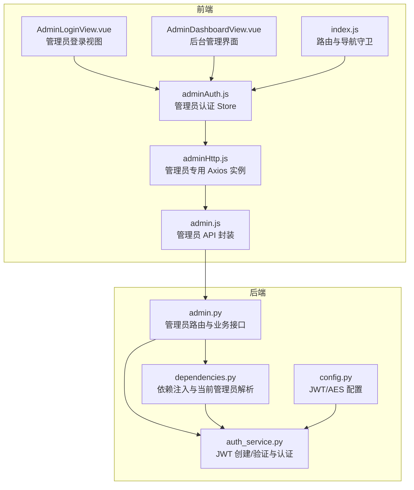
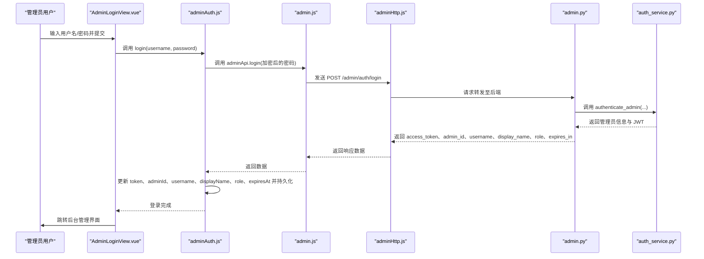
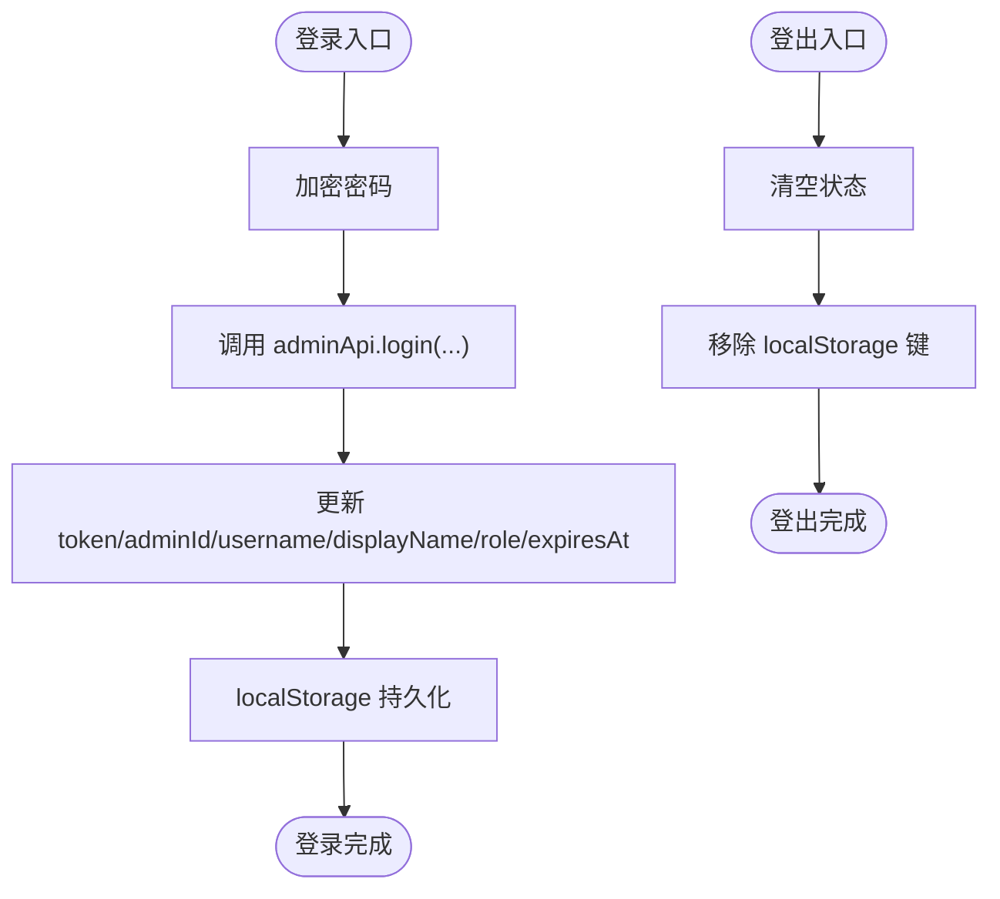
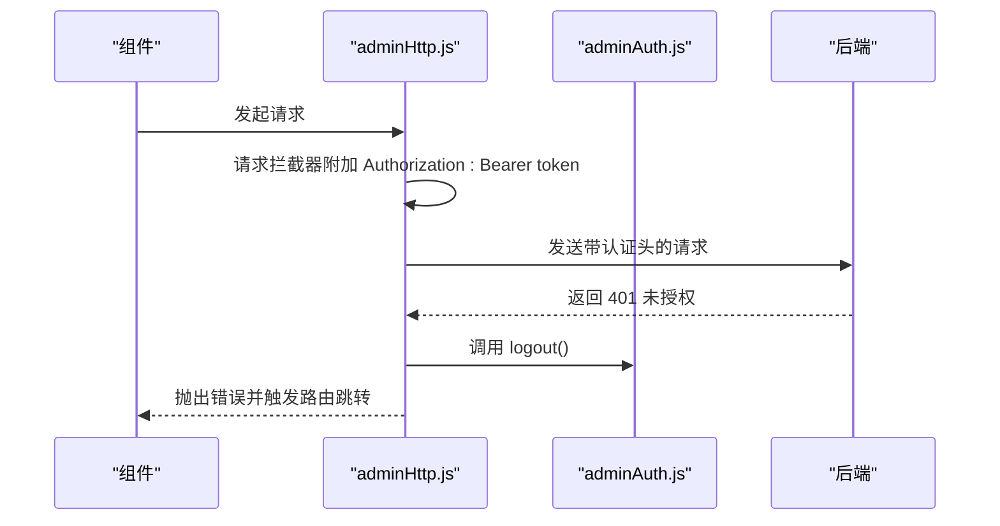
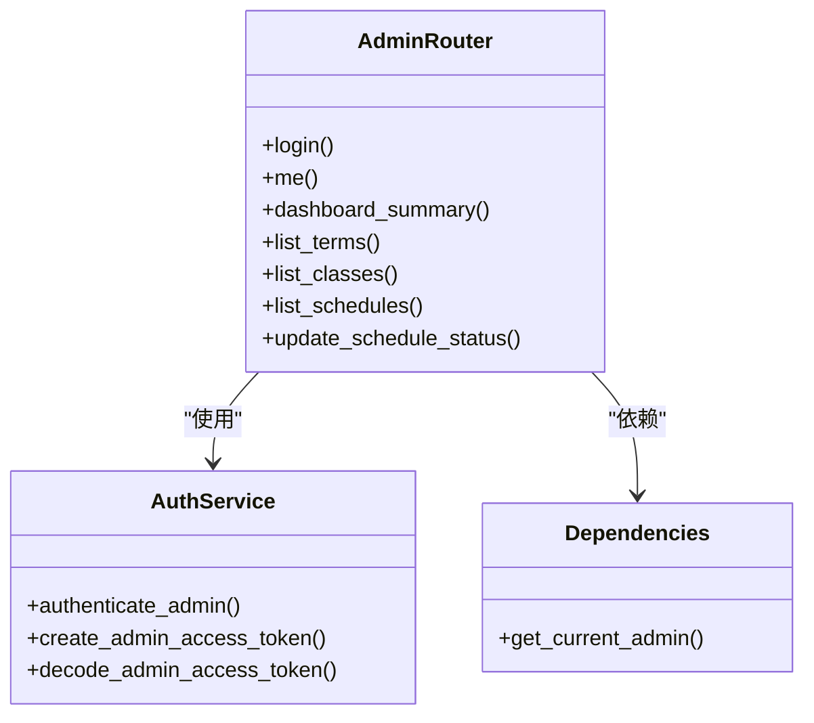
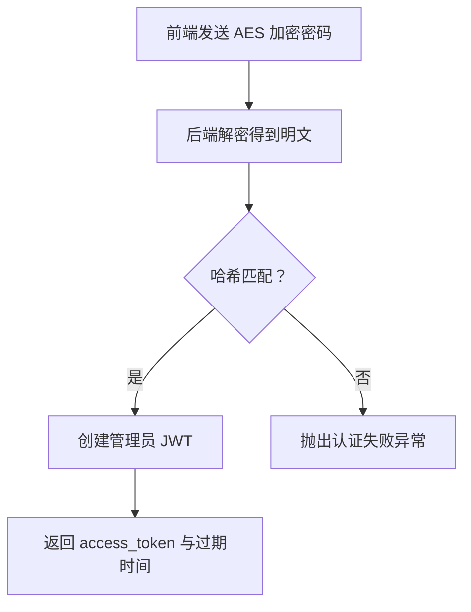
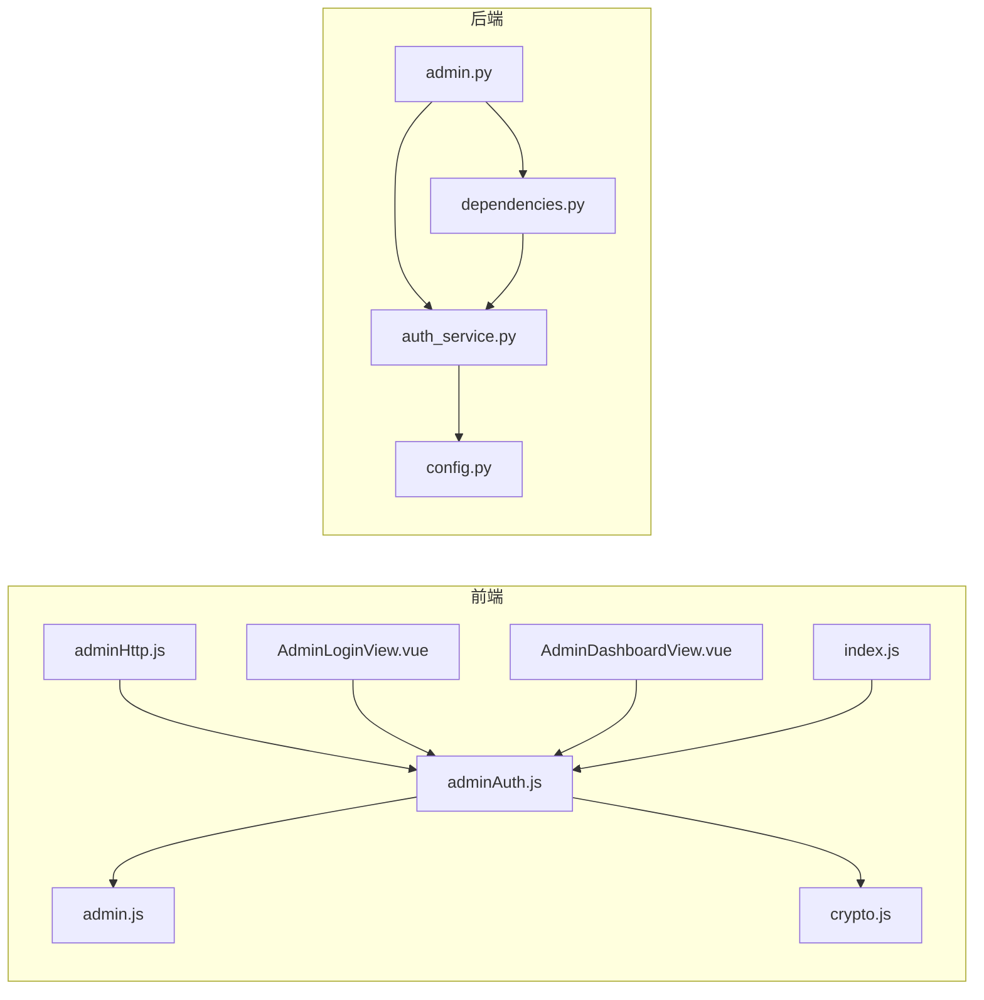

# 管理员认证状态管理

<cite>
**本文档引用的文件**
- [adminAuth.js](file://frontend/ai_assistant/src/stores/adminAuth.js)
- [auth.js](file://frontend/ai_assistant/src/stores/auth.js)
- [admin.js](file://frontend/ai_assistant/src/api/admin.js)
- [adminHttp.js](file://frontend/ai_assistant/src/api/adminHttp.js)
- [admin.py](file://service/ai_assistant/app/routers/admin.py)
- [auth_service.py](file://service/ai_assistant/app/services/auth_service.py)
- [dependencies.py](file://service/ai_assistant/app/dependencies.py)
- [AdminLoginView.vue](file://frontend/ai_assistant/src/views/AdminLoginView.vue)
- [AdminDashboardView.vue](file://frontend/ai_assistant/src/views/AdminDashboardView.vue)
- [index.js](file://frontend/ai_assistant/src/router/index.js)
- [crypto.js](file://frontend/ai_assistant/src/utils/crypto.js)
- [config.py](file://service/ai_assistant/app/config.py)
</cite>

## 目录
1. [简介](#简介)
2. [项目结构](#项目结构)
3. [核心组件](#核心组件)
4. [架构总览](#架构总览)
5. [详细组件分析](#详细组件分析)
6. [依赖关系分析](#依赖关系分析)
7. [性能考量](#性能考量)
8. [故障排除指南](#故障排除指南)
9. [结论](#结论)

## 简介
本文件深入解析 AI 校园助手项目的管理员认证状态管理系统，重点覆盖以下方面：
- 管理员 token 的生成、存储与校验机制
- 权限状态控制与会话保持策略
- 管理员登录流程与权限验证机制
- 角色访问控制（RBAC）在后台管理界面中的应用
- 管理员认证与普通用户认证的差异对比
- 在后台管理界面中菜单权限控制与功能访问限制的实现方式
- 安全考虑与最佳实践

## 项目结构
管理员认证状态管理涉及前端 Pinia Store、自定义 Axios 实例、后端 FastAPI 路由与依赖注入、以及 Vue 组件之间的协作。整体采用前后端分离架构，前端通过 Pinia 管理状态，Axios 拦截器统一处理认证头与 401 自动登出；后端通过依赖注入获取当前管理员并进行权限校验。

**图表来源**
- [adminAuth.js:1-77](file://frontend/ai_assistant/src/stores/adminAuth.js#L1-L77)
- [adminHttp.js:1-44](file://frontend/ai_assistant/src/api/adminHttp.js#L1-L44)
- [admin.js:1-41](file://frontend/ai_assistant/src/api/admin.js#L1-L41)
- [admin.py:1-388](file://service/ai_assistant/app/routers/admin.py#L1-L388)
- [auth_service.py:1-253](file://service/ai_assistant/app/services/auth_service.py#L1-L253)
- [dependencies.py:1-109](file://service/ai_assistant/app/dependencies.py#L1-L109)
- [config.py:1-113](file://service/ai_assistant/app/config.py#L1-L113)
- [AdminLoginView.vue:1-261](file://frontend/ai_assistant/src/views/AdminLoginView.vue#L1-L261)
- [AdminDashboardView.vue:1-688](file://frontend/ai_assistant/src/views/AdminDashboardView.vue#L1-L688)
- [index.js:1-75](file://frontend/ai_assistant/src/router/index.js#L1-L75)

**章节来源**
- [adminAuth.js:1-77](file://frontend/ai_assistant/src/stores/adminAuth.js#L1-L77)
- [adminHttp.js:1-44](file://frontend/ai_assistant/src/api/adminHttp.js#L1-L44)
- [admin.py:1-388](file://service/ai_assistant/app/routers/admin.py#L1-L388)
- [auth_service.py:1-253](file://service/ai_assistant/app/services/auth_service.py#L1-L253)
- [dependencies.py:1-109](file://service/ai_assistant/app/dependencies.py#L1-L109)
- [config.py:1-113](file://service/ai_assistant/app/config.py#L1-L113)
- [AdminLoginView.vue:1-261](file://frontend/ai_assistant/src/views/AdminLoginView.vue#L1-L261)
- [AdminDashboardView.vue:1-688](file://frontend/ai_assistant/src/views/AdminDashboardView.vue#L1-L688)
- [index.js:1-75](file://frontend/ai_assistant/src/router/index.js#L1-L75)

## 核心组件
- 管理员认证 Store（Pinia）
  - 管理 token、管理员 ID、用户名、显示名、角色、过期时间等状态
  - 提供登录、登出、认证状态计算等方法
- 管理员专用 Axios 实例
  - 自动附加 Bearer Token 到请求头
  - 统一处理 401 未授权：清空状态并跳转登录页
- 管理员 API 封装
  - 提供登录、个人信息、仪表盘统计、元数据、课表列表与状态更新等接口
- 后端管理员路由
  - 登录、个人信息、统计、元数据、课表列表、状态更新等接口
- 认证服务与依赖注入
  - JWT 创建与解码（管理员/学生）
  - 当前管理员解析与权限校验
- 路由与导航守卫
  - 控制管理员页面访问权限与登录态跳转

**章节来源**
- [adminAuth.js:16-76](file://frontend/ai_assistant/src/stores/adminAuth.js#L16-L76)
- [adminHttp.js:20-41](file://frontend/ai_assistant/src/api/adminHttp.js#L20-L41)
- [admin.js:6-40](file://frontend/ai_assistant/src/api/admin.js#L6-L40)
- [admin.py:51-387](file://service/ai_assistant/app/routers/admin.py#L51-L387)
- [auth_service.py:63-122](file://service/ai_assistant/app/services/auth_service.py#L63-L122)
- [dependencies.py:75-107](file://service/ai_assistant/app/dependencies.py#L75-L107)
- [index.js:58-73](file://frontend/ai_assistant/src/router/index.js#L58-L73)

## 架构总览
管理员认证状态管理遵循“前端状态 + 请求拦截 + 后端鉴权”的三层协同模式：
- 前端：Pinia Store 管理管理员状态，Axios 拦截器自动附加认证头，路由守卫控制访问
- 中间层：后端依赖注入解析 JWT，校验管理员状态与权限
- 后端：FastAPI 路由提供管理员专属接口，返回结构化响应模型

**图表来源**
- [AdminLoginView.vue:75-105](file://frontend/ai_assistant/src/views/AdminLoginView.vue#L75-L105)
- [adminAuth.js:28-47](file://frontend/ai_assistant/src/stores/adminAuth.js#L28-L47)
- [admin.js:7-12](file://frontend/ai_assistant/src/api/admin.js#L7-L12)
- [adminHttp.js:12-18](file://frontend/ai_assistant/src/api/adminHttp.js#L12-L18)
- [admin.py:57-82](file://service/ai_assistant/app/routers/admin.py#L57-L82)
- [auth_service.py:212-252](file://service/ai_assistant/app/services/auth_service.py#L212-L252)

## 详细组件分析

### 管理员认证 Store（adminAuth.js）
- 状态字段
  - token：JWT 访问令牌
  - adminId、username、displayName、role：管理员标识与角色信息
  - expiresAt：过期时间戳（毫秒）
- 计算属性
  - isAuthenticated：基于 token 是否存在且未过期判断
- 方法
  - login(username, password)：加密密码、调用后端登录、更新状态并持久化到 localStorage
  - logout()：清空状态并移除 localStorage 中的键值对
- 本地存储键名
  - campus_ai_admin_token、campus_ai_admin_id、campus_ai_admin_username、campus_ai_admin_display_name、campus_ai_admin_role、campus_ai_admin_expires_at

**图表来源**
- [adminAuth.js:28-63](file://frontend/ai_assistant/src/stores/adminAuth.js#L28-L63)

**章节来源**
- [adminAuth.js:9-76](file://frontend/ai_assistant/src/stores/adminAuth.js#L9-L76)

### 管理员专用 Axios 实例（adminHttp.js）
- 请求拦截器
  - 从 localStorage 读取 token，并在 Authorization 头中附加 Bearer Token
- 响应拦截器
  - 捕获 401 未授权：调用管理员认证 Store 的 logout()，并跳转到管理员登录页

**图表来源**
- [adminHttp.js:20-41](file://frontend/ai_assistant/src/api/adminHttp.js#L20-L41)
- [adminAuth.js:49-63](file://frontend/ai_assistant/src/stores/adminAuth.js#L49-L63)

**章节来源**
- [adminHttp.js:20-41](file://frontend/ai_assistant/src/api/adminHttp.js#L20-L41)

### 管理员 API 封装（admin.js）
- 接口方法
  - login(username, encrypted_password)：POST /admin/auth/login
  - me()：GET /admin/auth/me
  - getSummary()：GET /admin/dashboard/summary
  - getTerms()：GET /admin/meta/terms
  - getClasses()：GET /admin/meta/classes
  - getSchedules(params)：GET /admin/schedules
  - updateScheduleStatus(scheduleId, schedule_status, reason)：PATCH /admin/schedules/{id}/status

**章节来源**
- [admin.js:6-40](file://frontend/ai_assistant/src/api/admin.js#L6-L40)

### 后端管理员路由（admin.py）
- 登录接口
  - POST /admin/auth/login：调用 authenticate_admin，创建管理员 JWT，返回 access_token、expires_in、admin_id、username、display_name、role
- 个人信息接口
  - GET /admin/auth/me：返回当前管理员信息
- 仪表盘统计接口
  - GET /admin/dashboard/summary：统计待处理调课、启用/停用课表数量、班级与学期总数
- 元数据接口
  - GET /admin/meta/terms：学期列表
  - GET /admin/meta/classes：班级列表
- 课表管理接口
  - GET /admin/schedules：分页查询课表，支持按学期、班级、周次、状态、关键词过滤
  - PATCH /admin/schedules/{id}/status：更新课表状态，记录操作日志并更新缓存版本

**图表来源**
- [admin.py:51-387](file://service/ai_assistant/app/routers/admin.py#L51-L387)
- [auth_service.py:212-122](file://service/ai_assistant/app/services/auth_service.py#L212-L122)
- [dependencies.py:75-107](file://service/ai_assistant/app/dependencies.py#L75-L107)

**章节来源**
- [admin.py:51-387](file://service/ai_assistant/app/routers/admin.py#L51-L387)

### 认证服务与依赖注入（auth_service.py、dependencies.py）
- JWT 配置
  - 算法、密钥、过期时间由配置文件提供
- 管理员 JWT
  - create_admin_access_token：payload 包含 sub、role、username、exp、iat
  - decode_admin_access_token：校验 role=“admin”，解析 admin_id 与 username
- 当前管理员解析
  - get_current_admin：从 Authorization 头提取凭据，解码 JWT，查询数据库并校验状态为 active
- 密码传输安全
  - 前端使用 AES-CBC 加密密码，后端解密后再进行哈希验证

**图表来源**
- [auth_service.py:212-252](file://service/ai_assistant/app/services/auth_service.py#L212-L252)
- [config.py:32-40](file://service/ai_assistant/app/config.py#L32-L40)

**章节来源**
- [auth_service.py:63-122](file://service/ai_assistant/app/services/auth_service.py#L63-L122)
- [dependencies.py:75-107](file://service/ai_assistant/app/dependencies.py#L75-L107)
- [config.py:32-40](file://service/ai_assistant/app/config.py#L32-L40)

### 路由与导航守卫（index.js）
- 管理员页面保护
  - requiresAdminAuth：未认证管理员则跳转登录页
  - adminGuest：已认证管理员访问登录页则跳转后台
- 普通用户页面保护
  - requiresAuth/guest：与管理员路由互不影响

**章节来源**
- [index.js:58-73](file://frontend/ai_assistant/src/router/index.js#L58-L73)

### 后台管理界面使用（AdminDashboardView.vue）
- 展示管理员信息与角色徽章
- 加载仪表盘统计与元数据（学期、班级）
- 分页查询课表，支持筛选与状态切换
- 退出登录时清空状态并跳转登录页

**章节来源**
- [AdminDashboardView.vue:1-688](file://frontend/ai_assistant/src/views/AdminDashboardView.vue#L1-L688)

## 依赖关系分析
- 前端依赖
  - adminAuth.js 依赖 admin.js 与 crypto.js
  - adminHttp.js 依赖 adminAuth.js 与路由模块
  - AdminLoginView.vue 与 AdminDashboardView.vue 依赖 adminAuth.js
  - index.js 依赖两个 Store 以实现导航守卫
- 后端依赖
  - admin.py 依赖 dependencies.py 与 auth_service.py
  - dependencies.py 依赖 auth_service.py 与数据库会话
  - auth_service.py 依赖配置文件与加密工具

**图表来源**
- [adminAuth.js:6-7](file://frontend/ai_assistant/src/stores/adminAuth.js#L6-L7)
- [admin.js](file://frontend/ai_assistant/src/api/admin.js#L4)
- [adminHttp.js:7-8](file://frontend/ai_assistant/src/api/adminHttp.js#L7-L8)
- [AdminLoginView.vue](file://frontend/ai_assistant/src/views/AdminLoginView.vue#L62)
- [AdminDashboardView.vue](file://frontend/ai_assistant/src/views/AdminDashboardView.vue#L182)
- [index.js:2-3](file://frontend/ai_assistant/src/router/index.js#L2-L3)
- [admin.py:12-44](file://service/ai_assistant/app/routers/admin.py#L12-L44)
- [dependencies.py:13-16](file://service/ai_assistant/app/dependencies.py#L13-L16)
- [auth_service.py:11-13](file://service/ai_assistant/app/services/auth_service.py#L11-L13)
- [config.py:6-40](file://service/ai_assistant/app/config.py#L6-L40)

**章节来源**
- [adminAuth.js:6-7](file://frontend/ai_assistant/src/stores/adminAuth.js#L6-L7)
- [adminHttp.js:7-8](file://frontend/ai_assistant/src/api/adminHttp.js#L7-L8)
- [admin.py:12-44](file://service/ai_assistant/app/routers/admin.py#L12-L44)
- [dependencies.py:13-16](file://service/ai_assistant/app/dependencies.py#L13-L16)
- [auth_service.py:11-13](file://service/ai_assistant/app/services/auth_service.py#L11-L13)
- [config.py:6-40](file://service/ai_assistant/app/config.py#L6-L40)

## 性能考量
- 本地存储与内存同步
  - Store 状态与 localStorage 同步，避免重复 IO；建议在高频更新场景下批量更新以减少渲染次数
- 请求拦截与 401 自动登出
  - 统一拦截器减少重复代码，但需注意在登出时避免无限循环跳转
- 后端查询优化
  - 课表列表接口支持多条件过滤与分页，建议前端合理设置 limit 与 offset，避免一次性加载过多数据
- 缓存与版本控制
  - 状态变更后更新缓存版本，确保前端展示一致性

[本节为通用性能建议，不直接分析具体文件]

## 故障排除指南
- 登录失败
  - 前端：检查用户名/密码输入与错误提示；查看后端返回的状态码与 detail
  - 后端：确认用户名存在、密码哈希匹配、管理员状态为 active
- 401 未授权
  - 前端：确认 adminHttp 拦截器是否正确附加 Authorization 头；检查 localStorage 中 token 是否存在
  - 后端：确认 JWT 解码成功、role 为 admin、管理员状态为 active
- 页面无法访问
  - 检查路由守卫逻辑：requiresAdminAuth 与 adminGuest 的 meta 配置
- 密码传输问题
  - 确认前端 AES 密钥与后端一致；检查加密格式与 Base64 编码

**章节来源**
- [AdminLoginView.vue:75-105](file://frontend/ai_assistant/src/views/AdminLoginView.vue#L75-L105)
- [adminHttp.js:31-41](file://frontend/ai_assistant/src/api/adminHttp.js#L31-L41)
- [admin.py:61-72](file://service/ai_assistant/app/routers/admin.py#L61-L72)
- [auth_service.py:212-252](file://service/ai_assistant/app/services/auth_service.py#L212-L252)
- [index.js:58-73](file://frontend/ai_assistant/src/router/index.js#L58-L73)

## 结论
管理员认证状态管理系统通过 Pinia Store、Axios 拦截器与后端依赖注入形成闭环，实现了：
- 安全的管理员登录与会话保持
- 统一的权限校验与自动登出机制
- 后台管理界面的菜单与功能访问控制
- 与普通用户认证体系的清晰边界与差异化设计

建议在生产环境中进一步强化：
- HTTPS 传输与安全 Cookie 配置
- JWT 密钥轮换与短期令牌策略
- 前端路由级别的细粒度权限控制
- 后端接口的速率限制与审计日志