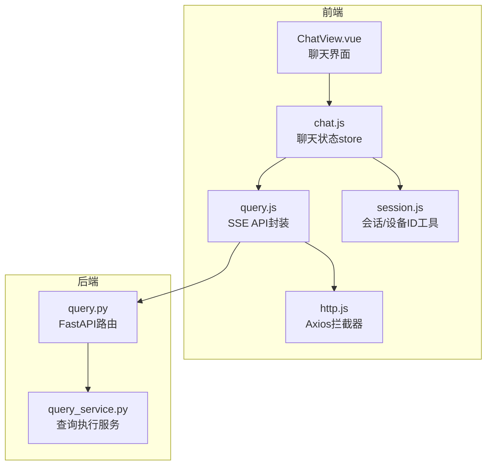
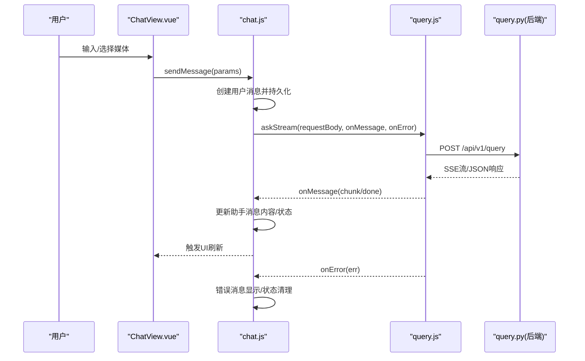
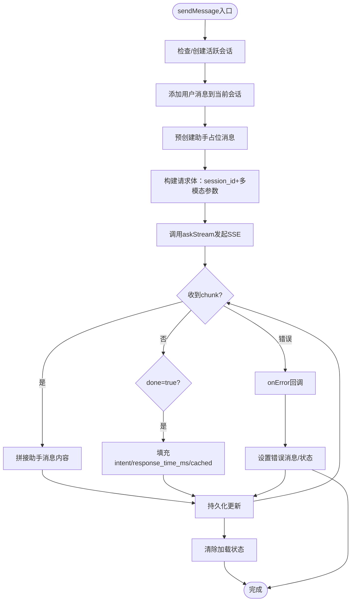
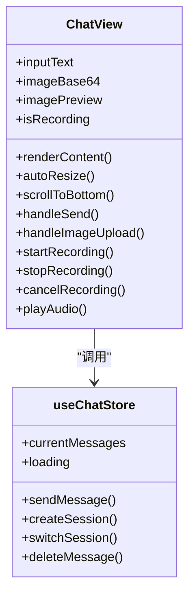
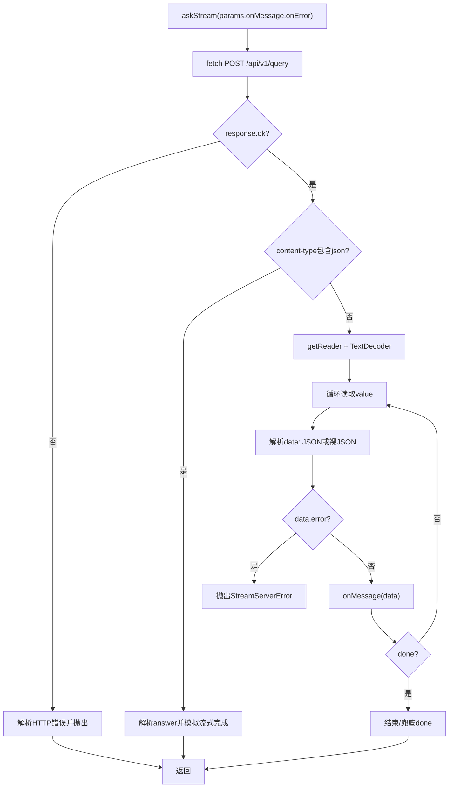
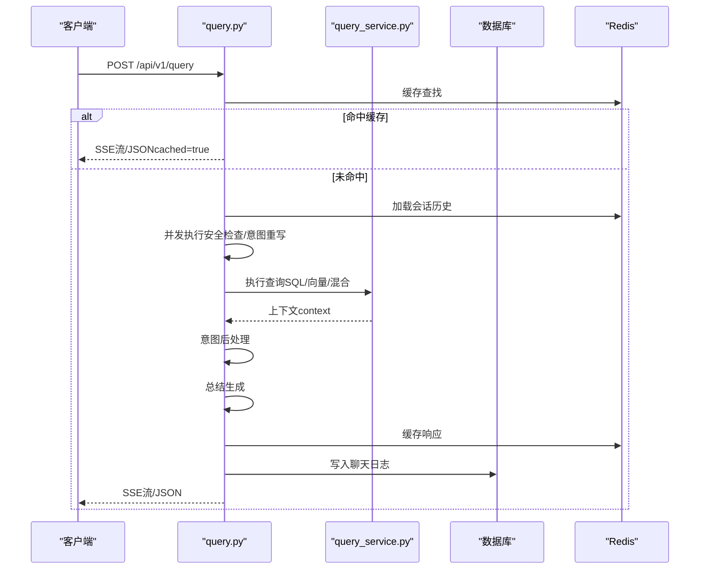
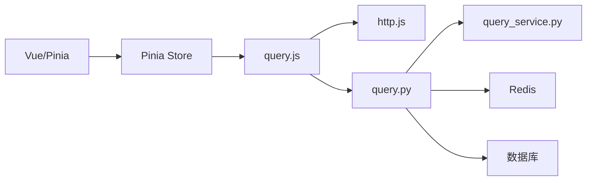

# 聊天会话状态管理

<cite>
**本文档引用的文件**
- [chat.js](file://frontend/ai_assistant/src/stores/chat.js)
- [ChatView.vue](file://frontend/ai_assistant/src/views/ChatView.vue)
- [query.js](file://frontend/ai_assistant/src/api/query.js)
- [http.js](file://frontend/ai_assistant/src/api/http.js)
- [query.py](file://service/ai_assistant/app/routers/query.py)
- [query_service.py](file://service/ai_assistant/app/services/query_service.py)
- [query.py](file://service/ai_assistant/app/schemas/query.py)
- [session.js](file://frontend/ai_assistant/src/utils/session.js)
- [main.js](file://frontend/ai_assistant/src/main.js)
</cite>

## 目录
1. [简介](#简介)
2. [项目结构](#项目结构)
3. [核心组件](#核心组件)
4. [架构总览](#架构总览)
5. [详细组件分析](#详细组件分析)
6. [依赖关系分析](#依赖关系分析)
7. [性能考虑](#性能考虑)
8. [故障排除指南](#故障排除指南)
9. [结论](#结论)

## 简介
本文件面向AI校园助手项目的聊天会话状态管理，系统性阐述前端聊天状态管理store、消息列表管理、会话状态跟踪、输入状态控制；详细说明消息发送流程、实时响应处理、SSE流式数据接收；阐述消息状态管理（发送中、已发送、错误状态）、历史记录加载、会话恢复机制；提供聊天界面组件的状态绑定模式，包括消息渲染、滚动控制、输入框状态同步；解释与后端查询API的集成方式，包括请求参数传递、响应数据处理、错误状态管理。

## 项目结构
前端采用Vue 3 + Pinia架构，后端采用FastAPI + Redis + 数据库的查询服务。聊天功能由独立的store管理，视图层通过响应式绑定与store交互，API层负责与后端SSE流通信。

**图表来源**
- [ChatView.vue:1-1168](file://frontend/ai_assistant/src/views/ChatView.vue#L1-L1168)
- [chat.js:1-278](file://frontend/ai_assistant/src/stores/chat.js#L1-L278)
- [query.js:1-141](file://frontend/ai_assistant/src/api/query.js#L1-L141)
- [http.js:1-49](file://frontend/ai_assistant/src/api/http.js#L1-L49)
- [query.py:1-788](file://service/ai_assistant/app/routers/query.py#L1-L788)
- [query_service.py:1-800](file://service/ai_assistant/app/services/query_service.py#L1-L800)

**章节来源**
- [main.js:1-10](file://frontend/ai_assistant/src/main.js#L1-L10)
- [chat.js:1-278](file://frontend/ai_assistant/src/stores/chat.js#L1-L278)
- [ChatView.vue:1-1168](file://frontend/ai_assistant/src/views/ChatView.vue#L1-L1168)
- [query.js:1-141](file://frontend/ai_assistant/src/api/query.js#L1-L141)
- [http.js:1-49](file://frontend/ai_assistant/src/api/http.js#L1-L49)
- [query.py:1-788](file://service/ai_assistant/app/routers/query.py#L1-L788)
- [query_service.py:1-800](file://service/ai_assistant/app/services/query_service.py#L1-L800)
- [session.js:1-70](file://frontend/ai_assistant/src/utils/session.js#L1-L70)

## 核心组件
- 聊天状态store：集中管理会话列表、当前会话、消息列表、搜索过滤、加载状态、持久化策略。
- 聊天视图：负责UI渲染、输入控制、滚动控制、多媒体输入（图片、语音）、Markdown渲染。
- SSE API封装：统一封装SSE流式接收，兼容JSON回退与错误处理。
- 会话工具：生成会话ID、设备ID，localStorage持久化。
- 后端路由：统一入口POST /api/v1/query，支持SSE流式输出与JSON输出。

**章节来源**
- [chat.js:22-278](file://frontend/ai_assistant/src/stores/chat.js#L22-L278)
- [ChatView.vue:222-534](file://frontend/ai_assistant/src/views/ChatView.vue#L222-L534)
- [query.js:28-141](file://frontend/ai_assistant/src/api/query.js#L28-L141)
- [session.js:14-70](file://frontend/ai_assistant/src/utils/session.js#L14-L70)
- [query.py:198-745](file://service/ai_assistant/app/routers/query.py#L198-L745)

## 架构总览
前端store在sendMessage中构建请求体，调用SSE API，后端路由解析多模态输入，执行意图分类与查询执行，返回SSE流或JSON响应。前端store在流式过程中动态更新助手消息内容，最终完成持久化与状态清理。

**图表来源**
- [ChatView.vue:312-333](file://frontend/ai_assistant/src/views/ChatView.vue#L312-L333)
- [chat.js:133-230](file://frontend/ai_assistant/src/stores/chat.js#L133-L230)
- [query.js:28-141](file://frontend/ai_assistant/src/api/query.js#L28-L141)
- [query.py:207-745](file://service/ai_assistant/app/routers/query.py#L207-L745)

## 详细组件分析

### 聊天状态store（chat.js）
- 状态管理
  - sessions：会话列表，localStorage持久化
  - activeSessionId：当前激活会话ID
  - loadingStates：按会话标记加载状态
  - searchKeyword：会话/消息搜索关键词
- 计算属性
  - loading：基于activeSessionId与loadingStates
  - currentSession/currentMessages：当前会话与消息列表
  - filteredSessions：按标题或消息内容过滤
- 会话操作
  - createSession/switchSession/deleteSession/clearAllSessions/deleteMessage
- 消息发送
  - sendMessage：自动创建用户消息、占位助手消息、SSE流式更新、错误处理、持久化
  - resolveErrorMessage：根据后端状态码与错误详情解析用户可见错误

**图表来源**
- [chat.js:133-230](file://frontend/ai_assistant/src/stores/chat.js#L133-L230)

**章节来源**
- [chat.js:22-278](file://frontend/ai_assistant/src/stores/chat.js#L22-L278)

### 聊天视图（ChatView.vue）
- 界面状态
  - welcome-screen：无消息时的欢迎界面
  - messages-area：消息列表，支持Markdown渲染、图片/语音展示
  - input-area：输入区域，支持文本、图片、语音录制
- 关键逻辑
  - renderContent：Markdown渲染
  - autoResize：textarea自适应高度
  - scrollToBottom：消息变化自动滚到底部
  - handleSend：组装参数、清空输入、调用store.sendMessage
  - 图片上传：限制大小、压缩、base64预览
  - 语音录制：MediaRecorder、时长校验、静音检测、发送
  - 播放语音：webm/data URI播放、状态同步

**图表来源**
- [ChatView.vue:222-534](file://frontend/ai_assistant/src/views/ChatView.vue#L222-L534)
- [chat.js:133-230](file://frontend/ai_assistant/src/stores/chat.js#L133-L230)

**章节来源**
- [ChatView.vue:1-1168](file://frontend/ai_assistant/src/views/ChatView.vue#L1-L1168)

### SSE API封装（query.js）
- askStream：发起POST /api/v1/query，支持SSE流式接收
  - 兼容JSON回退：若content-type为application/json，解析answer并模拟流式完成
  - 流式解析：TextDecoder + getReader，逐行解析data: JSON块
  - 错误处理：HTTP错误、JSON解析失败、服务端error字段
  - 结束兜底：若未收到done包，主动触发done
- ask：普通POST，返回完整JSON

**图表来源**
- [query.js:28-141](file://frontend/ai_assistant/src/api/query.js#L28-L141)

**章节来源**
- [query.js:1-141](file://frontend/ai_assistant/src/api/query.js#L1-L141)

### 后端查询路由（query.py）
- 统一入口：POST /api/v1/query
- 多模态输入：text/image_base64/audio_base64 + session_id
- 处理流程：
  - 图片/音频转文本
  - 统一查询文本构建
  - 安全检查与隐私检查
  - Redis缓存查找（命中则直接返回或模拟流式）
  - 历史记录加载（Redis会话隔离）
  - 并发执行：危险内容检查、意图重写
  - 意图分类（structured/vector/hybrid/smalltalk）
  - 查询执行（SQL/向量/混合）
  - 总结生成（LLM总结）
  - 缓存与日志持久化
  - SSE流式输出或JSON输出
- SSE响应头：禁用缓存与反向代理缓冲
- JSON输出：answer/intent/session_id/response_time_ms/cached

**图表来源**
- [query.py:198-745](file://service/ai_assistant/app/routers/query.py#L198-L745)
- [query_service.py:1-800](file://service/ai_assistant/app/services/query_service.py#L1-L800)

**章节来源**
- [query.py:1-788](file://service/ai_assistant/app/routers/query.py#L1-L788)
- [query_service.py:1-800](file://service/ai_assistant/app/services/query_service.py#L1-L800)
- [query.py:1-33](file://service/ai_assistant/app/schemas/query.py#L1-L33)

### 会话与设备ID工具（session.js）
- generateSessionId：生成会话ID（sess_xxxxx）
- getDeviceId：生成并持久化设备ID（did_xxxxx）
- getAllSessions/saveSessions/getActiveSessionId/setActiveSessionId：localStorage持久化

**章节来源**
- [session.js:1-70](file://frontend/ai_assistant/src/utils/session.js#L1-L70)

## 依赖关系分析
- 前端依赖
  - Vue 3 + Pinia：状态管理
  - Axios：HTTP请求与拦截器
  - marked：Markdown渲染
  - uuid：ID生成
- 后端依赖
  - FastAPI：路由与SSE
  - redis：缓存与会话历史
  - SQLAlchemy：数据库访问
  - LangChain/DashScope：检索与总结

**图表来源**
- [ChatView.vue:222-534](file://frontend/ai_assistant/src/views/ChatView.vue#L222-L534)
- [chat.js:10-20](file://frontend/ai_assistant/src/stores/chat.js#L10-L20)
- [query.js:5-32](file://frontend/ai_assistant/src/api/query.js#L5-L32)
- [http.js:10-16](file://frontend/ai_assistant/src/api/http.js#L10-L16)
- [query.py:207-745](file://service/ai_assistant/app/routers/query.py#L207-L745)
- [query_service.py:1-800](file://service/ai_assistant/app/services/query_service.py#L1-L800)

**章节来源**
- [chat.js:10-20](file://frontend/ai_assistant/src/stores/chat.js#L10-L20)
- [query.js:5-32](file://frontend/ai_assistant/src/api/query.js#L5-L32)
- [http.js:10-16](file://frontend/ai_assistant/src/api/http.js#L10-L16)
- [query.py:207-745](file://service/ai_assistant/app/routers/query.py#L207-L745)

## 性能考虑
- 前端
  - 图片压缩：前端压缩避免Nginx上传限制，减少带宽与后端压力
  - 流式渲染：增量更新助手消息，提升感知速度
  - 滚动优化：watch消息长度自动滚底，避免阻塞主线程
  - 持久化：localStorage批量写入，减少频繁IO
- 后端
  - Redis缓存：命中即返回，SSE模拟或直接返回
  - 并发任务：安全检查与意图重写并行，缩短总延迟
  - 连接池：流式阶段释放数据库连接，避免长时间占用
  - SSE头部：禁用缓存与缓冲，确保实时性

[本节为通用性能讨论，无需特定文件来源]

## 故障排除指南
- 常见错误与处理
  - 400：至少需要提供文本、图片或语音之一
  - 401：登录过期，自动登出并跳转登录页
  - 502：AI服务不可用或未识别到语音内容
  - 音频处理失败：前端友好提示“未检测到清晰的语音内容”
- 前端错误展示
  - store在onError中将错误消息写入助手消息，设置isError标记
  - resolveErrorMessage根据后端状态码与detail进行用户友好化
- 后端错误
  - SSE流中data.error字段会被前端捕获并展示
  - 未收到done包时，前端兜底触发done，避免“正在思考”状态卡死

**章节来源**
- [chat.js:235-257](file://frontend/ai_assistant/src/stores/chat.js#L235-L257)
- [query.js:136-139](file://frontend/ai_assistant/src/api/query.js#L136-L139)
- [query.py:142-151](file://service/ai_assistant/app/routers/query.py#L142-L151)

## 结论
本项目通过Pinia store集中管理聊天会话状态，结合SSE流式响应与本地持久化，实现了流畅的多模态聊天体验。前端视图与store双向绑定，确保消息渲染、滚动控制、输入状态同步的一致性；后端路由统一处理多模态输入、意图分类与查询执行，提供稳定可靠的SSE/JSON输出。整体架构清晰、扩展性强，具备良好的用户体验与可维护性。