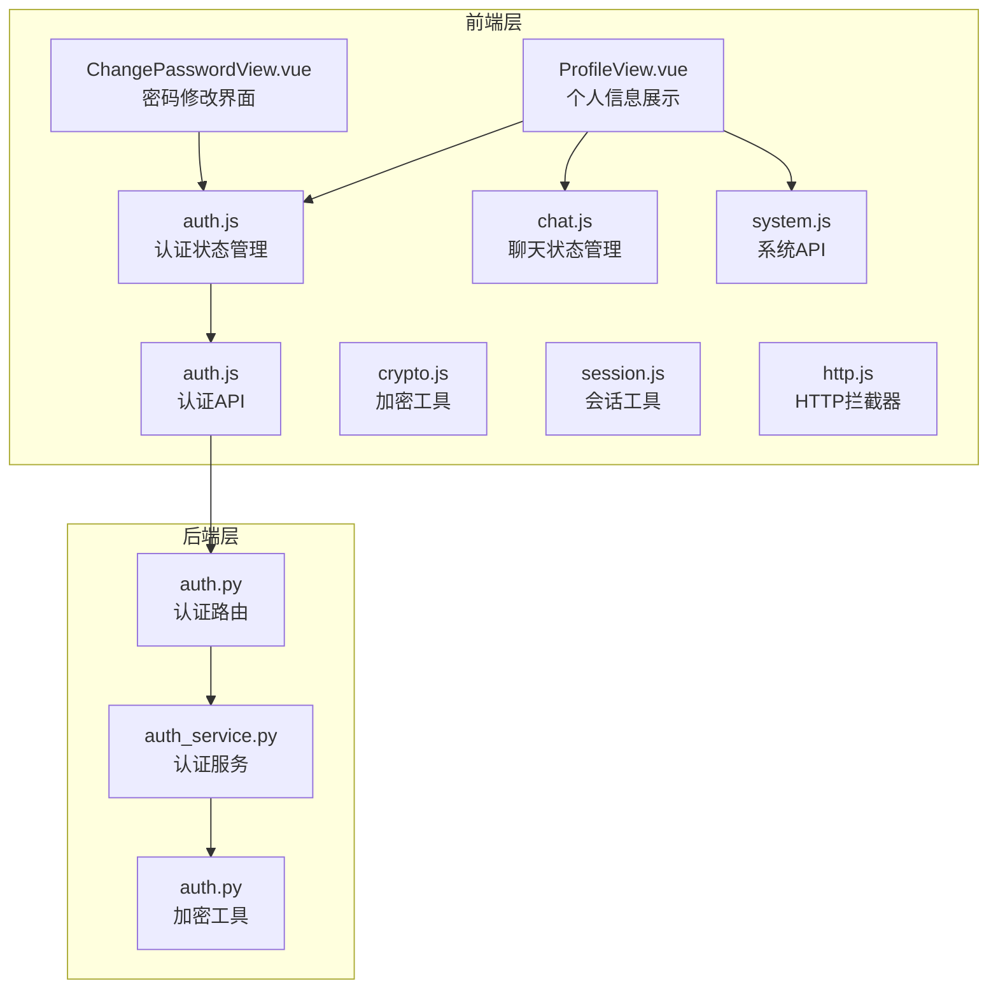
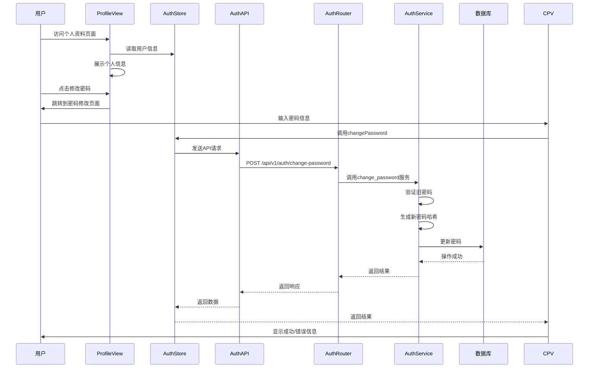
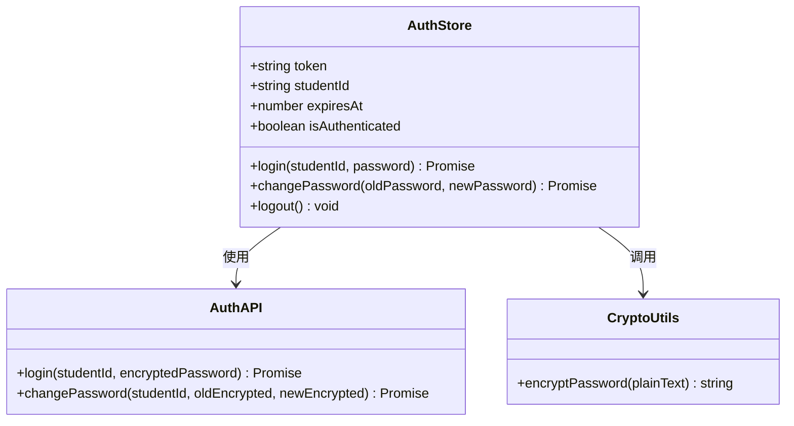
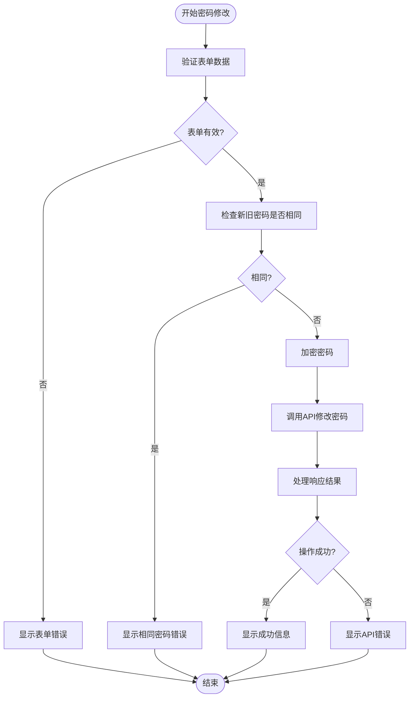
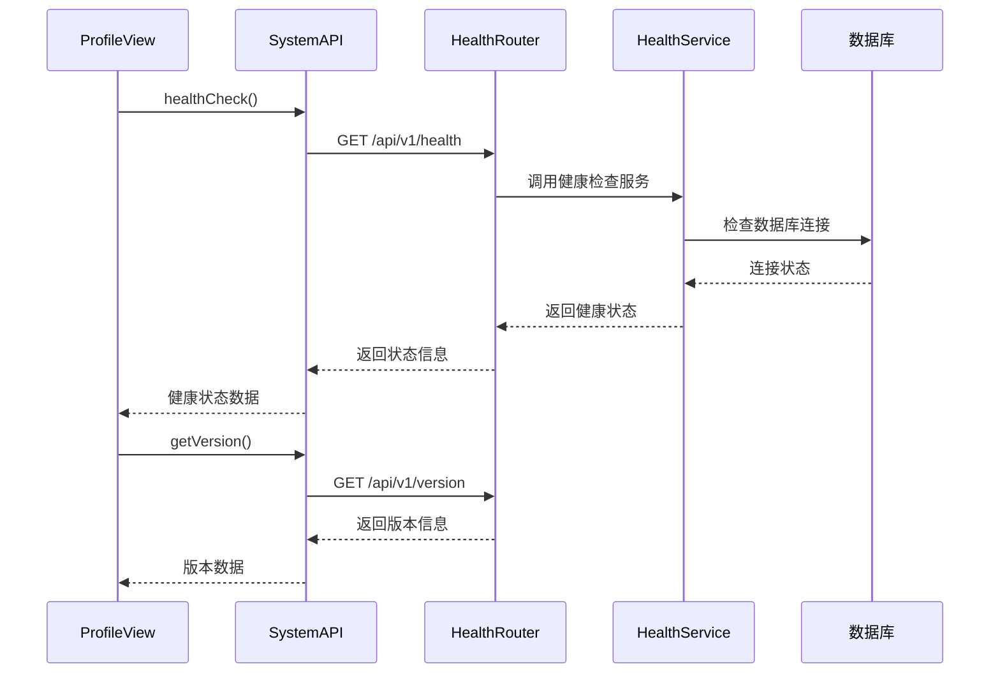
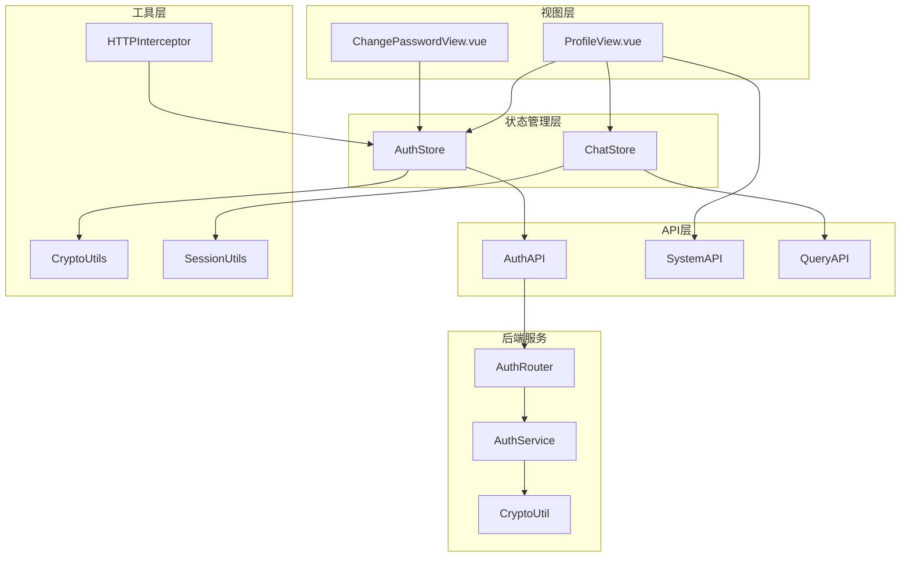

# 个人资料组件设计

<cite>
**本文档引用的文件**
- [ProfileView.vue](file://frontend/ai_assistant/src/views/ProfileView.vue)
- [ChangePasswordView.vue](file://frontend/ai_assistant/src/views/ChangePasswordView.vue)
- [auth.js](file://frontend/ai_assistant/src/stores/auth.js)
- [auth.js](file://frontend/ai_assistant/src/api/auth.js)
- [crypto.js](file://frontend/ai_assistant/src/utils/crypto.js)
- [system.js](file://frontend/ai_assistant/src/api/system.js)
- [chat.js](file://frontend/ai_assistant/src/stores/chat.js)
- [session.js](file://frontend/ai_assistant/src/utils/session.js)
- [http.js](file://frontend/ai_assistant/src/api/http.js)
- [auth.py](file://service/ai_assistant/app/routers/auth.py)
- [auth_service.py](file://service/ai_assistant/app/services/auth_service.py)
- [crypto.py](file://service/ai_assistant/app/utils/crypto.py)
</cite>

## 目录
1. [简介](#简介)
2. [项目结构](#项目结构)
3. [核心组件](#核心组件)
4. [架构概览](#架构概览)
5. [详细组件分析](#详细组件分析)
6. [依赖分析](#依赖分析)
7. [性能考虑](#性能考虑)
8. [故障排除指南](#故障排除指南)
9. [结论](#结论)

## 简介

AI校园助手的个人资料组件是一个完整的用户信息管理和密码修改系统。该组件提供了个人信息展示、系统状态监控、密码修改功能以及相关的安全策略。系统采用前后端分离架构，前端使用Vue 3 + Pinia + Vite构建，后端使用FastAPI提供RESTful API服务。

## 项目结构

个人资料组件主要由以下层次构成：

**图表来源**
- [ProfileView.vue:1-380](file://frontend/ai_assistant/src/views/ProfileView.vue#L1-L380)
- [ChangePasswordView.vue:1-466](file://frontend/ai_assistant/src/views/ChangePasswordView.vue#L1-L466)
- [auth.js:1-77](file://frontend/ai_assistant/src/stores/auth.js#L1-L77)

**章节来源**
- [ProfileView.vue:1-380](file://frontend/ai_assistant/src/views/ProfileView.vue#L1-L380)
- [ChangePasswordView.vue:1-466](file://frontend/ai_assistant/src/views/ChangePasswordView.vue#L1-L466)
- [auth.js:1-77](file://frontend/ai_assistant/src/stores/auth.js#L1-L77)

## 核心组件

### 个人信息展示组件

个人信息展示组件负责显示学生的基本信息和系统状态，采用响应式设计确保在不同设备上的良好体验。

**主要功能特性：**
- 学号、账户状态、令牌有效期等基本信息展示
- 设备标识(DID)和会话统计信息
- 系统健康状态监控和版本信息显示
- 对话记录清理功能

**数据绑定机制：**
- 使用Pinia状态管理存储用户认证信息
- 通过计算属性实现动态数据绑定
- 支持实时刷新系统状态

**章节来源**
- [ProfileView.vue:10-53](file://frontend/ai_assistant/src/views/ProfileView.vue#L10-L53)
- [ProfileView.vue:113-126](file://frontend/ai_assistant/src/views/ProfileView.vue#L113-L126)

### 密码修改组件

密码修改组件提供了安全的密码更新功能，包含完整的前端验证和后端安全检查。

**主要功能特性：**
- 三阶段密码输入：当前密码、新密码、确认密码
- 实时密码强度评估和可视化反馈
- 密码规则提示和验证状态显示
- 完整的错误处理和用户反馈机制

**章节来源**
- [ChangePasswordView.vue:10-131](file://frontend/ai_assistant/src/views/ChangePasswordView.vue#L10-L131)
- [ChangePasswordView.vue:155-189](file://frontend/ai_assistant/src/views/ChangePasswordView.vue#L155-L189)

## 架构概览

系统采用分层架构设计，确保职责分离和代码可维护性：

**图表来源**
- [ChangePasswordView.vue:191-232](file://frontend/ai_assistant/src/views/ChangePasswordView.vue#L191-L232)
- [auth.js:45-56](file://frontend/ai_assistant/src/stores/auth.js#L45-L56)
- [auth.js:29-35](file://frontend/ai_assistant/src/api/auth.js#L29-L35)

## 详细组件分析

### 认证状态管理

认证状态管理使用Pinia实现，提供全局状态管理和持久化存储：

**图表来源**
- [auth.js:17-77](file://frontend/ai_assistant/src/stores/auth.js#L17-L77)
- [auth.js:8-36](file://frontend/ai_assistant/src/api/auth.js#L8-L36)
- [crypto.js:26-40](file://frontend/ai_assistant/src/utils/crypto.js#L26-L40)

**核心实现要点：**
- 使用localStorage持久化存储认证信息
- 实现JWT令牌的自动续期机制
- 提供统一的错误处理和状态管理

**章节来源**
- [auth.js:17-77](file://frontend/ai_assistant/src/stores/auth.js#L17-L77)
- [auth.js:8-36](file://frontend/ai_assistant/src/api/auth.js#L8-L36)

### 密码加密与验证

系统采用AES-CBC对称加密算法确保密码传输安全：

**图表来源**
- [ChangePasswordView.vue:191-232](file://frontend/ai_assistant/src/views/ChangePasswordView.vue#L191-L232)
- [crypto.js:26-40](file://frontend/ai_assistant/src/utils/crypto.js#L26-L40)

**安全策略实现：**
- 前端AES-CBC加密，URL安全Base64编码
- 后端严格的身份验证和权限控制
- 完整的错误处理和状态码映射

**章节来源**
- [ChangePasswordView.vue:191-232](file://frontend/ai_assistant/src/views/ChangePasswordView.vue#L191-L232)
- [crypto.js:26-40](file://frontend/ai_assistant/src/utils/crypto.js#L26-L40)

### 系统状态监控

个人信息页面集成了系统健康检查和版本信息显示功能：

**图表来源**
- [ProfileView.vue:144-167](file://frontend/ai_assistant/src/views/ProfileView.vue#L144-L167)
- [system.js:8-18](file://frontend/ai_assistant/src/api/system.js#L8-L18)

**章节来源**
- [ProfileView.vue:144-167](file://frontend/ai_assistant/src/views/ProfileView.vue#L144-L167)
- [system.js:8-18](file://frontend/ai_assistant/src/api/system.js#L8-L18)

### 对话数据管理

个人资料组件还集成了对话数据的管理功能：

**章节来源**
- [ProfileView.vue:169-174](file://frontend/ai_assistant/src/views/ProfileView.vue#L169-L174)
- [chat.js:103-116](file://frontend/ai_assistant/src/stores/chat.js#L103-L116)

## 依赖分析

系统各组件之间的依赖关系如下：

**图表来源**
- [ProfileView.vue:98-107](file://frontend/ai_assistant/src/views/ProfileView.vue#L98-L107)
- [ChangePasswordView.vue:136-140](file://frontend/ai_assistant/src/views/ChangePasswordView.vue#L136-L140)
- [auth.js:17-21](file://frontend/ai_assistant/src/stores/auth.js#L17-L21)

**依赖特点：**
- 前端组件间松耦合，通过状态管理器通信
- API层提供统一的接口抽象
- 工具类模块职责单一，便于测试和维护

**章节来源**
- [ProfileView.vue:98-107](file://frontend/ai_assistant/src/views/ProfileView.vue#L98-L107)
- [ChangePasswordView.vue:136-140](file://frontend/ai_assistant/src/views/ChangePasswordView.vue#L136-L140)

## 性能考虑

### 前端性能优化

1. **懒加载和按需加载**
   - 组件采用懒加载减少初始包体积
   - 图标和样式按需加载

2. **状态管理优化**
   - 使用Pinia的响应式状态避免不必要的重渲染
   - 计算属性缓存复杂计算结果

3. **内存管理**
   - 及时清理事件监听器和定时器
   - 合理使用localStorage避免内存泄漏

### 后端性能优化

1. **数据库查询优化**
   - 使用异步查询避免阻塞
   - 合理的索引设计和查询优化

2. **缓存策略**
   - JWT令牌缓存减少重复计算
   - 响应缓存提升常用接口性能

## 故障排除指南

### 常见问题及解决方案

**密码修改失败**
- 检查新旧密码是否相同
- 确认旧密码输入正确
- 验证网络连接状态

**系统状态检查失败**
- 检查后端服务是否正常运行
- 验证数据库连接状态
- 确认防火墙设置

**认证失败**
- 检查JWT令牌是否过期
- 验证服务器时间同步
- 确认密钥配置正确

**章节来源**
- [ChangePasswordView.vue:212-232](file://frontend/ai_assistant/src/views/ChangePasswordView.vue#L212-L232)
- [ProfileView.vue:144-151](file://frontend/ai_assistant/src/views/ProfileView.vue#L144-L151)

### 错误处理机制

系统实现了多层次的错误处理：

1. **前端表单验证**
   - 实时输入验证和反馈
   - 密码强度可视化评估

2. **API错误处理**
   - HTTP状态码映射到用户友好的错误信息
   - 自动登出401错误

3. **后端业务逻辑验证**
   - 严格的密码验证规则
   - 完整的权限控制

**章节来源**
- [ChangePasswordView.vue:212-232](file://frontend/ai_assistant/src/views/ChangePasswordView.vue#L212-L232)
- [http.js:36-47](file://frontend/ai_assistant/src/api/http.js#L36-L47)

## 结论

AI校园助手的个人资料组件设计体现了现代Web应用的最佳实践：

**设计优势：**
- 清晰的分层架构确保了代码的可维护性和可扩展性
- 完善的安全策略保护用户数据安全
- 优秀的用户体验设计提升了用户满意度
- 良好的错误处理机制增强了系统的稳定性

**技术亮点：**
- 前后端分离架构符合现代开发趋势
- AES-CBC加密确保密码传输安全
- 响应式设计适配多终端设备
- 完整的状态管理和持久化机制

该组件为AI校园助手提供了可靠的个人资料管理基础，为后续功能扩展奠定了坚实的技术基础。