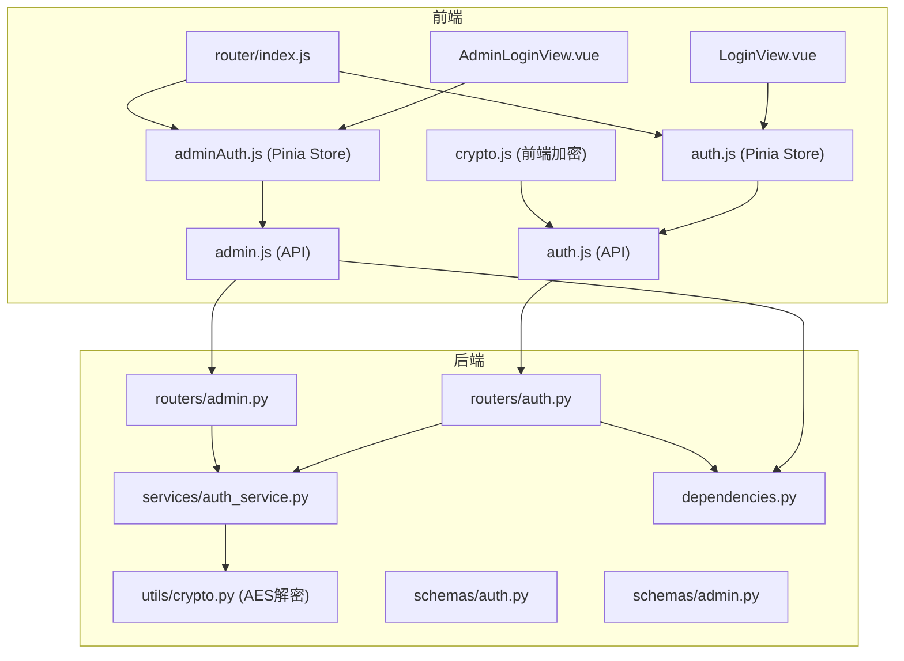
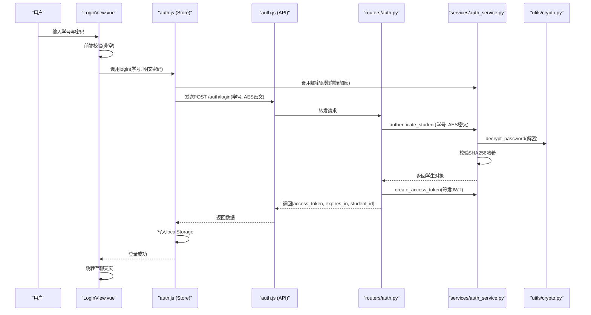
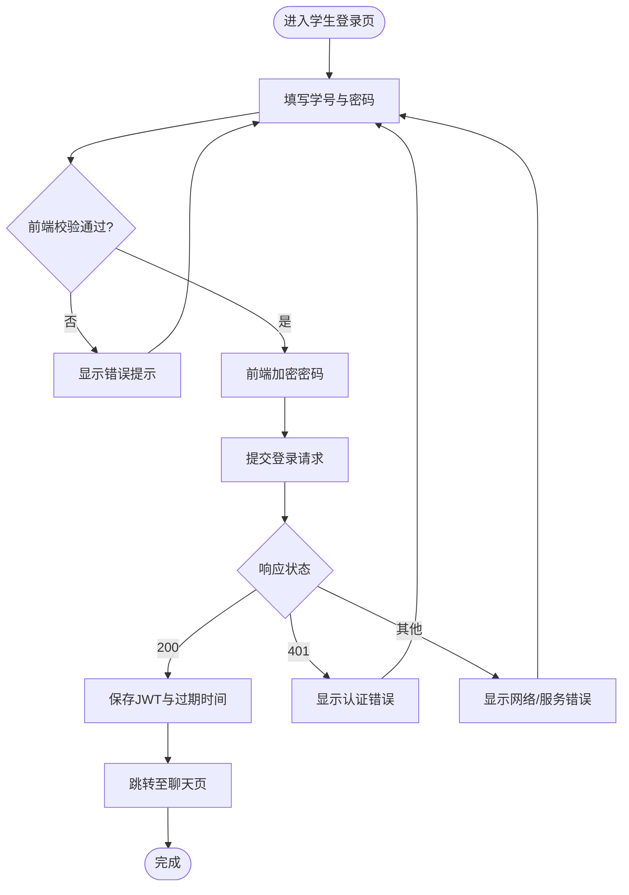
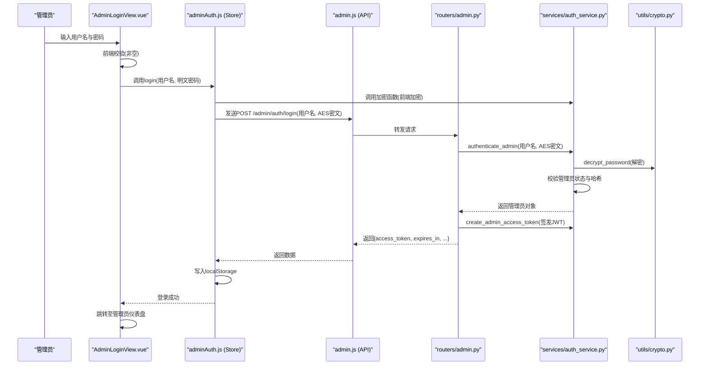
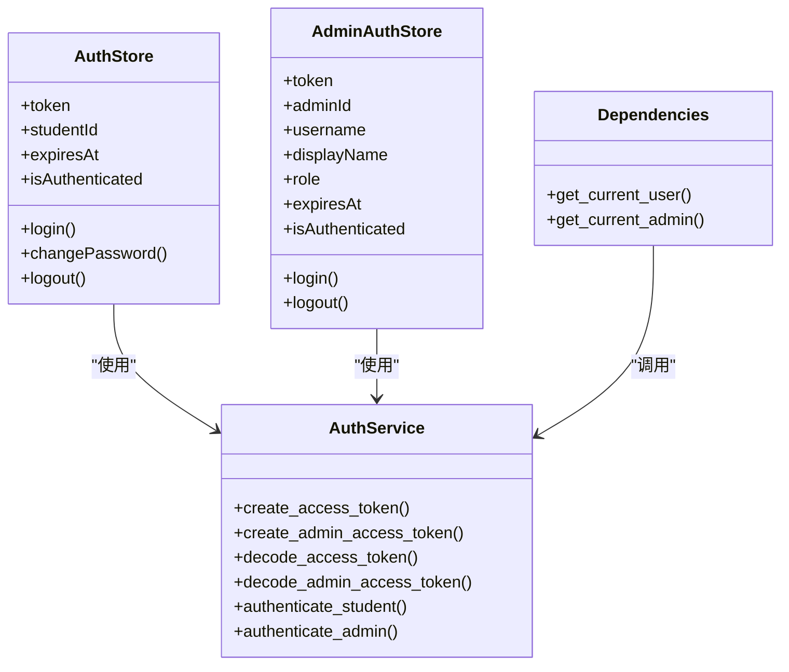
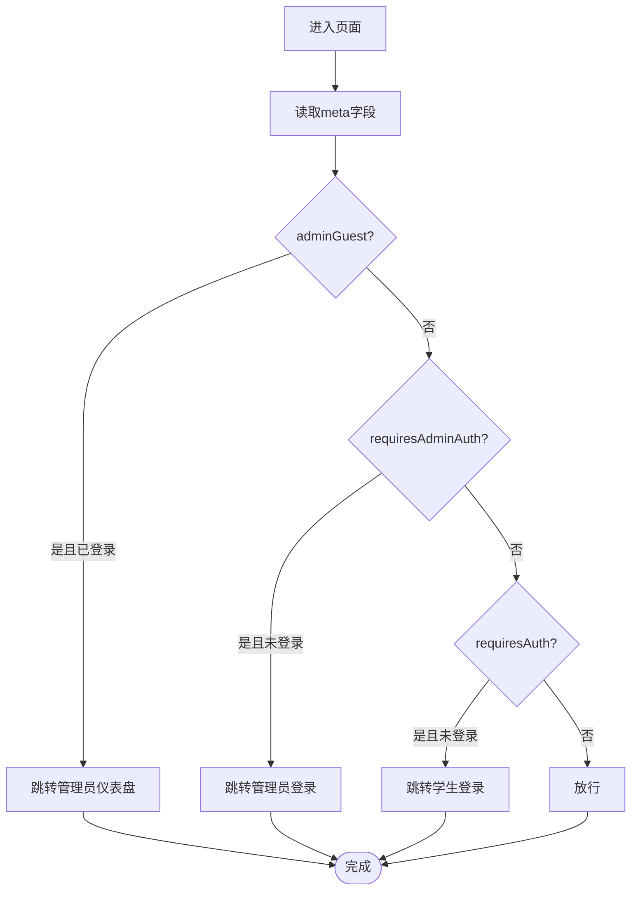
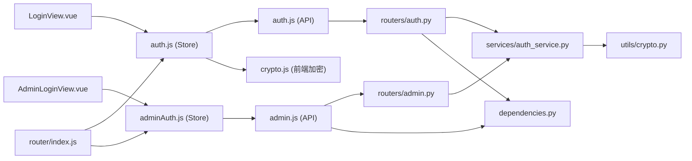

# 登录组件设计

<cite>
**本文档引用的文件**
- [LoginView.vue](file://frontend/ai_assistant/src/views/LoginView.vue)
- [AdminLoginView.vue](file://frontend/ai_assistant/src/views/AdminLoginView.vue)
- [auth.js](file://frontend/ai_assistant/src/stores/auth.js)
- [adminAuth.js](file://frontend/ai_assistant/src/stores/adminAuth.js)
- [auth.js](file://frontend/ai_assistant/src/api/auth.js)
- [admin.js](file://frontend/ai_assistant/src/api/admin.js)
- [index.js](file://frontend/ai_assistant/src/router/index.js)
- [auth.py](file://service/ai_assistant/app/routers/auth.py)
- [admin.py](file://service/ai_assistant/app/routers/admin.py)
- [auth_service.py](file://service/ai_assistant/app/services/auth_service.py)
- [crypto.js](file://frontend/ai_assistant/src/utils/crypto.js)
- [crypto.py](file://service/ai_assistant/app/utils/crypto.py)
- [auth.py](file://service/ai_assistant/app/schemas/auth.py)
- [admin.py](file://service/ai_assistant/app/schemas/admin.py)
- [dependencies.py](file://service/ai_assistant/app/dependencies.py)
</cite>

## 目录
1. [引言](#引言)
2. [项目结构](#项目结构)
3. [核心组件](#核心组件)
4. [架构总览](#架构总览)
5. [详细组件分析](#详细组件分析)
6. [依赖分析](#依赖分析)
7. [性能考虑](#性能考虑)
8. [故障排除指南](#故障排除指南)
9. [结论](#结论)

## 引言
本设计文档围绕AI校园助手的登录组件展开，系统性阐述学生登录与管理员登录的设计理念、表单验证、认证流程、权限控制与状态管理。文档同时覆盖JWT认证实现、会话管理策略、权限分级机制、安全设计、用户体验优化以及可扩展性考量，帮助开发者与产品人员全面理解登录体系。

## 项目结构
登录相关代码在前后端分别组织如下：
- 前端
  - 视图层：学生登录视图与管理员登录视图
  - 状态管理：Pinia Store（学生与管理员）
  - API封装：统一的HTTP客户端与认证接口
  - 路由与导航守卫：基于meta字段的权限控制
  - 工具：密码加密（CryptoJS）与会话存储
- 后端
  - 路由：学生认证与管理员认证接口
  - 服务：JWT签发与校验、密码解密与校验
  - 模型与Schema：请求与响应模型
  - 依赖注入：认证中间件与当前用户解析

图表来源
- [LoginView.vue:1-343](file://frontend/ai_assistant/src/views/LoginView.vue#L1-L343)
- [AdminLoginView.vue:1-261](file://frontend/ai_assistant/src/views/AdminLoginView.vue#L1-L261)
- [auth.js:1-77](file://frontend/ai_assistant/src/stores/auth.js#L1-L77)
- [adminAuth.js:1-77](file://frontend/ai_assistant/src/stores/adminAuth.js#L1-L77)
- [auth.js:1-36](file://frontend/ai_assistant/src/api/auth.js#L1-L36)
- [admin.js:1-41](file://frontend/ai_assistant/src/api/admin.js#L1-L41)
- [index.js:1-75](file://frontend/ai_assistant/src/router/index.js#L1-L75)
- [auth.py:1-102](file://service/ai_assistant/app/routers/auth.py#L1-L102)
- [admin.py:1-388](file://service/ai_assistant/app/routers/admin.py#L1-L388)
- [auth_service.py:1-253](file://service/ai_assistant/app/services/auth_service.py#L1-L253)
- [crypto.js:1-40](file://frontend/ai_assistant/src/utils/crypto.js#L1-L40)
- [crypto.py:1-73](file://service/ai_assistant/app/utils/crypto.py#L1-L73)
- [auth.py:1-56](file://service/ai_assistant/app/schemas/auth.py#L1-L56)
- [admin.py:1-105](file://service/ai_assistant/app/schemas/admin.py#L1-L105)
- [dependencies.py:1-109](file://service/ai_assistant/app/dependencies.py#L1-L109)

章节来源
- [LoginView.vue:1-343](file://frontend/ai_assistant/src/views/LoginView.vue#L1-L343)
- [AdminLoginView.vue:1-261](file://frontend/ai_assistant/src/views/AdminLoginView.vue#L1-L261)
- [auth.js:1-77](file://frontend/ai_assistant/src/stores/auth.js#L1-L77)
- [adminAuth.js:1-77](file://frontend/ai_assistant/src/stores/adminAuth.js#L1-L77)
- [auth.js:1-36](file://frontend/ai_assistant/src/api/auth.js#L1-L36)
- [admin.js:1-41](file://frontend/ai_assistant/src/api/admin.js#L1-L41)
- [index.js:1-75](file://frontend/ai_assistant/src/router/index.js#L1-L75)
- [auth.py:1-102](file://service/ai_assistant/app/routers/auth.py#L1-L102)
- [admin.py:1-388](file://service/ai_assistant/app/routers/admin.py#L1-L388)
- [auth_service.py:1-253](file://service/ai_assistant/app/services/auth_service.py#L1-L253)
- [crypto.js:1-40](file://frontend/ai_assistant/src/utils/crypto.js#L1-L40)
- [crypto.py:1-73](file://service/ai_assistant/app/utils/crypto.py#L1-L73)
- [auth.py:1-56](file://service/ai_assistant/app/schemas/auth.py#L1-L56)
- [admin.py:1-105](file://service/ai_assistant/app/schemas/admin.py#L1-L105)
- [dependencies.py:1-109](file://service/ai_assistant/app/dependencies.py#L1-L109)

## 核心组件
- 学生登录视图：负责学号与密码输入、前端即时校验、提交与错误展示、跳转逻辑。
- 管理员登录视图：负责用户名与密码输入、前端即时校验、提交与错误展示、跳转逻辑。
- 学生认证Store：封装登录、改密、登出；持久化JWT与过期时间；计算是否已认证。
- 管理员认证Store：封装登录、登出；持久化管理员信息与过期时间；计算是否已认证。
- API封装：统一调用后端认证接口，传递加密密码。
- 路由守卫：根据meta字段控制访问权限，未登录重定向至登录页，已登录重定向至主页。
- 后端认证服务：签发JWT、解密前端AES密码、校验哈希、解析当前用户。

章节来源
- [LoginView.vue:78-122](file://frontend/ai_assistant/src/views/LoginView.vue#L78-L122)
- [AdminLoginView.vue:59-106](file://frontend/ai_assistant/src/views/AdminLoginView.vue#L59-L106)
- [auth.js:17-77](file://frontend/ai_assistant/src/stores/auth.js#L17-L77)
- [adminAuth.js:16-77](file://frontend/ai_assistant/src/stores/adminAuth.js#L16-L77)
- [auth.js:8-36](file://frontend/ai_assistant/src/api/auth.js#L8-L36)
- [admin.js:6-41](file://frontend/ai_assistant/src/api/admin.js#L6-L41)
- [index.js:57-75](file://frontend/ai_assistant/src/router/index.js#L57-L75)
- [auth_service.py:45-123](file://service/ai_assistant/app/services/auth_service.py#L45-L123)

## 架构总览
登录流程采用“前端加密 + 后端解密 + JWT签发”的模式，确保密码在传输过程中始终以密文形式存在。前端Store负责状态与持久化，API封装负责请求，后端路由与服务完成认证与令牌签发，依赖注入模块解析令牌并校验角色与状态。

图表来源
- [LoginView.vue:94-121](file://frontend/ai_assistant/src/views/LoginView.vue#L94-L121)
- [auth.js:28-43](file://frontend/ai_assistant/src/stores/auth.js#L28-L43)
- [auth.js:15-20](file://frontend/ai_assistant/src/api/auth.js#L15-L20)
- [auth.py:33-52](file://service/ai_assistant/app/routers/auth.py#L33-L52)
- [auth_service.py:125-169](file://service/ai_assistant/app/services/auth_service.py#L125-L169)
- [crypto.py:39-73](file://service/ai_assistant/app/utils/crypto.py#L39-L73)

## 详细组件分析

### 学生登录组件分析
- 表单字段与验证
  - 字段：学号、密码（支持切换可见）
  - 前端即时校验：学号与密码均不能为空
  - 提交状态：防止重复提交
- 错误处理
  - 401：学号或密码错误
  - 其他错误：网络异常或服务端错误
- 认证流程
  - Store加密密码并调用API
  - API发送至后端路由
  - 后端解密并校验哈希
  - 成功后签发JWT并写入本地存储
- 权限控制
  - 路由守卫根据meta.requiresAuth控制访问
  - Store计算isAuthenticated用于界面与功能开关

图表来源
- [LoginView.vue:94-121](file://frontend/ai_assistant/src/views/LoginView.vue#L94-L121)
- [auth.js:28-43](file://frontend/ai_assistant/src/stores/auth.js#L28-L43)
- [auth.js:15-20](file://frontend/ai_assistant/src/api/auth.js#L15-L20)
- [auth.py:33-52](file://service/ai_assistant/app/routers/auth.py#L33-L52)
- [auth_service.py:125-169](file://service/ai_assistant/app/services/auth_service.py#L125-L169)

章节来源
- [LoginView.vue:78-122](file://frontend/ai_assistant/src/views/LoginView.vue#L78-L122)
- [auth.js:17-77](file://frontend/ai_assistant/src/stores/auth.js#L17-L77)
- [auth.js:8-36](file://frontend/ai_assistant/src/api/auth.js#L8-L36)
- [auth.py:24-52](file://service/ai_assistant/app/routers/auth.py#L24-L52)
- [auth_service.py:125-169](file://service/ai_assistant/app/services/auth_service.py#L125-L169)

### 管理员登录组件分析
- 表单字段与验证
  - 字段：用户名、密码（支持切换可见）
  - 前端即时校验：用户名与密码均不能为空
  - 提交状态：防止重复提交
- 错误处理
  - 401：用户名或密码错误
  - 403：账号不可用
  - 其他错误：网络异常或服务端错误
- 认证流程
  - Store加密密码并调用管理员API
  - 后端解密并校验管理员状态与哈希
  - 成功后签发管理员JWT并写入本地存储
- 权限控制
  - 路由守卫根据meta.requiresAdminAuth控制访问
  - Store计算isAuthenticated用于界面与功能开关

图表来源
- [AdminLoginView.vue:75-105](file://frontend/ai_assistant/src/views/AdminLoginView.vue#L75-L105)
- [adminAuth.js:28-47](file://frontend/ai_assistant/src/stores/adminAuth.js#L28-L47)
- [admin.js:7-12](file://frontend/ai_assistant/src/api/admin.js#L7-L12)
- [admin.py:57-82](file://service/ai_assistant/app/routers/admin.py#L57-L82)
- [auth_service.py:212-252](file://service/ai_assistant/app/services/auth_service.py#L212-L252)
- [crypto.py:39-73](file://service/ai_assistant/app/utils/crypto.py#L39-L73)

章节来源
- [AdminLoginView.vue:59-106](file://frontend/ai_assistant/src/views/AdminLoginView.vue#L59-L106)
- [adminAuth.js:16-77](file://frontend/ai_assistant/src/stores/adminAuth.js#L16-L77)
- [admin.js:1-41](file://frontend/ai_assistant/src/api/admin.js#L1-L41)
- [admin.py:51-82](file://service/ai_assistant/app/routers/admin.py#L51-L82)
- [auth_service.py:212-252](file://service/ai_assistant/app/services/auth_service.py#L212-L252)

### JWT认证与会话管理
- JWT载荷
  - 学生：sub=student_id，role=student，exp/iat
  - 管理员：sub=admin_id，role=admin，username，exp/iat
- 签发与校验
  - 前端：Store接收后端返回的access_token与expires_in，计算过期时间并写入localStorage
  - 后端：服务层根据配置签发JWT，依赖注入模块解析并校验令牌
- 会话策略
  - 前端：localStorage持久化，Store计算isAuthenticated
  - 后端：依赖注入解析Bearer令牌，校验角色与管理员状态

图表来源
- [auth.js:17-77](file://frontend/ai_assistant/src/stores/auth.js#L17-L77)
- [adminAuth.js:16-77](file://frontend/ai_assistant/src/stores/adminAuth.js#L16-L77)
- [auth_service.py:45-123](file://service/ai_assistant/app/services/auth_service.py#L45-L123)
- [dependencies.py:56-108](file://service/ai_assistant/app/dependencies.py#L56-L108)

章节来源
- [auth.js:13-43](file://frontend/ai_assistant/src/stores/auth.js#L13-L43)
- [adminAuth.js:9-47](file://frontend/ai_assistant/src/stores/adminAuth.js#L9-L47)
- [auth_service.py:45-123](file://service/ai_assistant/app/services/auth_service.py#L45-L123)
- [dependencies.py:56-108](file://service/ai_assistant/app/dependencies.py#L56-L108)

### 权限分级与路由控制
- 路由元信息
  - guest：未登录可访问
  - requiresAuth：需学生认证
  - adminGuest：管理员未登录可访问
  - requiresAdminAuth：需管理员认证
- 导航守卫
  - 根据store的isAuthenticated与meta字段决定跳转
  - 已登录用户被重定向至对应主页

图表来源
- [index.js:57-75](file://frontend/ai_assistant/src/router/index.js#L57-L75)

章节来源
- [index.js:5-75](file://frontend/ai_assistant/src/router/index.js#L5-L75)

### 表单验证与错误处理机制
- 学生登录
  - 前端：学号与密码非空校验
  - 后端：认证失败返回401，详情包含具体原因
- 管理员登录
  - 前端：用户名与密码非空校验
  - 后端：认证失败返回401；账号不可用返回403；详情包含具体原因
- 改密流程
  - 需要有效Bearer Token
  - 旧密码验证通过后更新新密码
  - 失败场景：学生不存在、旧密码不正确、新旧密码相同、加密数据无效

章节来源
- [LoginView.vue:94-121](file://frontend/ai_assistant/src/views/LoginView.vue#L94-L121)
- [AdminLoginView.vue:75-105](file://frontend/ai_assistant/src/views/AdminLoginView.vue#L75-L105)
- [auth.py:24-101](file://service/ai_assistant/app/routers/auth.py#L24-L101)
- [admin.py:51-82](file://service/ai_assistant/app/routers/admin.py#L51-L82)

## 依赖分析
- 前端
  - 视图依赖Store与路由
  - Store依赖API与加密工具
  - API依赖HTTP客户端
- 后端
  - 路由依赖服务层与依赖注入
  - 服务层依赖配置、模型与加密工具
  - 依赖注入解析令牌并校验角色与状态

图表来源
- [LoginView.vue:1-343](file://frontend/ai_assistant/src/views/LoginView.vue#L1-L343)
- [AdminLoginView.vue:1-261](file://frontend/ai_assistant/src/views/AdminLoginView.vue#L1-L261)
- [auth.js:1-77](file://frontend/ai_assistant/src/stores/auth.js#L1-L77)
- [adminAuth.js:1-77](file://frontend/ai_assistant/src/stores/adminAuth.js#L1-L77)
- [auth.js:1-36](file://frontend/ai_assistant/src/api/auth.js#L1-L36)
- [admin.js:1-41](file://frontend/ai_assistant/src/api/admin.js#L1-L41)
- [auth.py:1-102](file://service/ai_assistant/app/routers/auth.py#L1-L102)
- [admin.py:1-388](file://service/ai_assistant/app/routers/admin.py#L1-L388)
- [auth_service.py:1-253](file://service/ai_assistant/app/services/auth_service.py#L1-L253)
- [crypto.js:1-40](file://frontend/ai_assistant/src/utils/crypto.js#L1-L40)
- [crypto.py:1-73](file://service/ai_assistant/app/utils/crypto.py#L1-L73)
- [index.js:1-75](file://frontend/ai_assistant/src/router/index.js#L1-L75)
- [dependencies.py:1-109](file://service/ai_assistant/app/dependencies.py#L1-L109)

章节来源
- [auth.js:8-11](file://frontend/ai_assistant/src/stores/auth.js#L8-L11)
- [adminAuth.js:5-7](file://frontend/ai_assistant/src/stores/adminAuth.js#L5-L7)
- [auth.py:7-19](file://service/ai_assistant/app/routers/auth.py#L7-L19)
- [admin.py:12-44](file://service/ai_assistant/app/routers/admin.py#L12-L44)
- [dependencies.py:13-16](file://service/ai_assistant/app/dependencies.py#L13-L16)

## 性能考虑
- 前端
  - 密码加密在浏览器端完成，避免明文传输
  - Store仅在登录成功后写入localStorage，减少IO开销
  - 路由守卫轻量判断，避免复杂逻辑
- 后端
  - JWT签发与校验为O(1)，避免复杂查询
  - AES解密与哈希校验为CPU密集操作，建议合理配置并发与超时
  - 依赖注入解析令牌时进行角色与状态校验，降低后续业务层负担

## 故障排除指南
- 常见错误与排查
  - 401 未授权：检查学号/用户名与密码是否正确；确认前端加密密钥与后端一致
  - 403 禁止访问：管理员账号状态非active；检查后端状态枚举
  - 网络错误：检查API地址与跨域配置；确认后端服务可用
  - 令牌过期：前端Store计算isAuthenticated时会自动失效；建议在路由守卫中统一处理
- 日志与调试
  - 后端服务层记录认证与令牌解码日志，便于定位问题
  - 前端Store与API封装记录关键步骤，便于前端调试

章节来源
- [auth.py:42-52](file://service/ai_assistant/app/routers/auth.py#L42-L52)
- [admin.py:64-72](file://service/ai_assistant/app/routers/admin.py#L64-L72)
- [auth_service.py:78-95](file://service/ai_assistant/app/services/auth_service.py#L78-L95)
- [auth_service.py:98-122](file://service/ai_assistant/app/services/auth_service.py#L98-L122)

## 结论
本登录组件设计以“前端加密 + 后端解密 + JWT”为核心，结合Pinia状态管理与FastAPI依赖注入，实现了安全、清晰且可扩展的认证体系。通过路由守卫与权限控制，确保不同角色用户只能访问授权资源。建议在生产环境中进一步强化安全配置（如HTTPS、CSP、安全头），并持续监控与优化认证性能与用户体验。