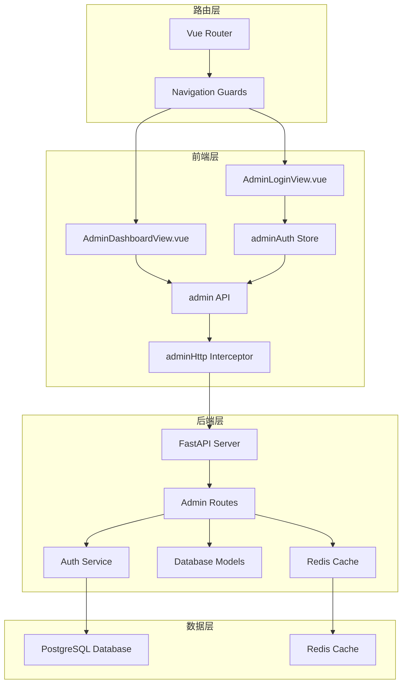
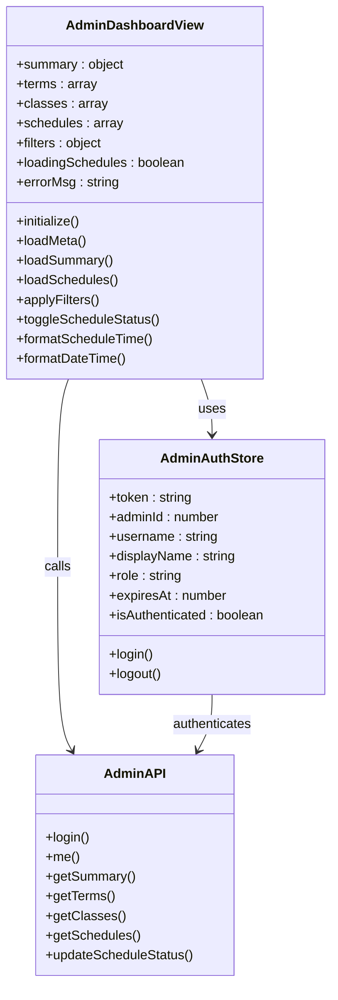
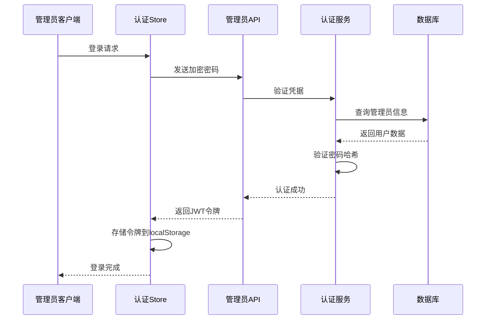
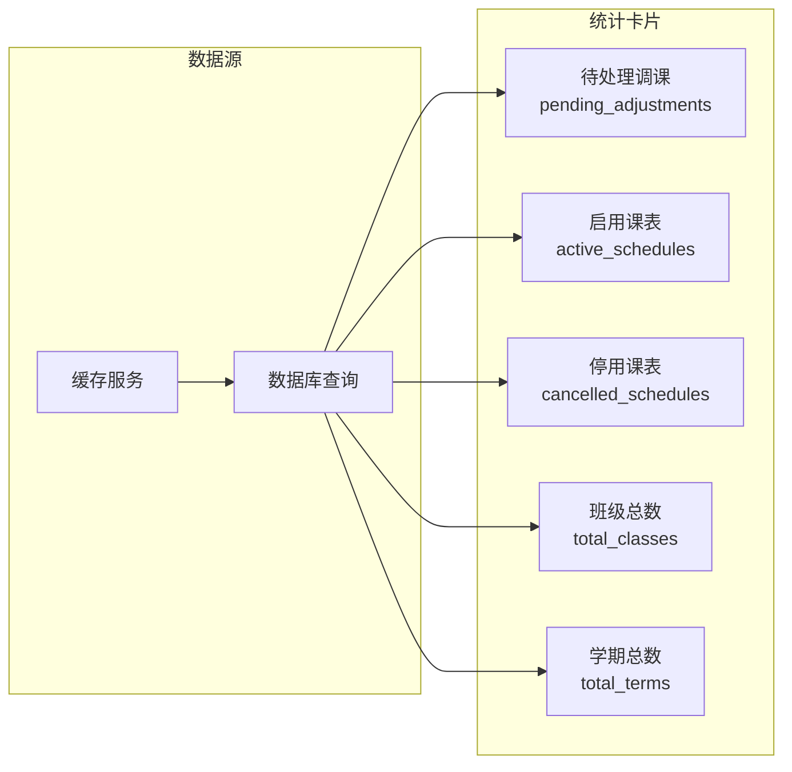
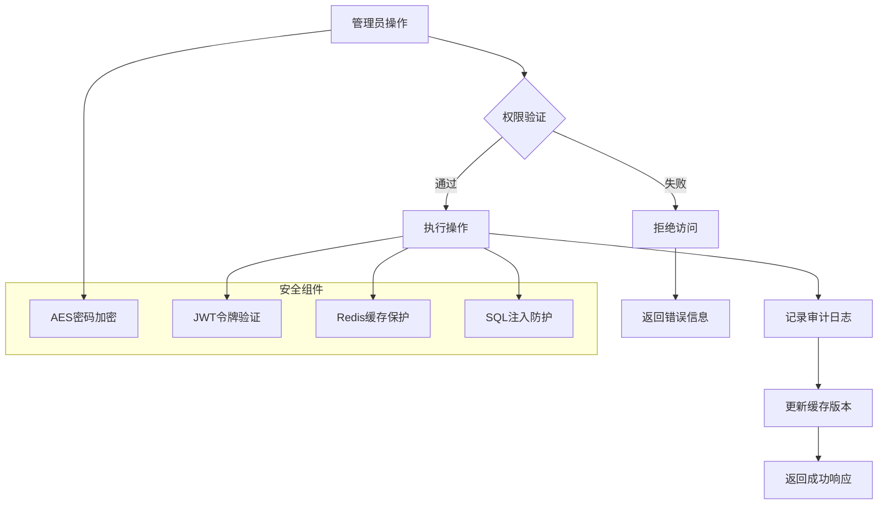
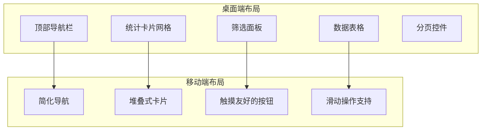

# 管理员面板组件设计

<cite>
**本文档引用的文件**
- [AdminDashboardView.vue](file://frontend/ai_assistant/src/views/AdminDashboardView.vue)
- [AdminLoginView.vue](file://frontend/ai_assistant/src/views/AdminLoginView.vue)
- [adminAuth.js](file://frontend/ai_assistant/src/stores/adminAuth.js)
- [admin.js](file://frontend/ai_assistant/src/api/admin.js)
- [adminHttp.js](file://frontend/ai_assistant/src/api/adminHttp.js)
- [index.js](file://frontend/ai_assistant/src/router/index.js)
- [crypto.js](file://frontend/ai_assistant/src/utils/crypto.js)
- [global.css](file://frontend/ai_assistant/src/styles/global.css)
- [admin.py](file://service/ai_assistant/app/routers/admin.py)
- [auth_service.py](file://service/ai_assistant/app/services/auth_service.py)
- [models.py](file://service/ai_assistant/app/models/models.py)
- [dependencies.py](file://service/ai_assistant/app/dependencies.py)
- [admin.py](file://service/ai_assistant/app/schemas/admin.py)
</cite>

## 目录
1. [项目概述](#项目概述)
2. [系统架构](#系统架构)
3. [核心组件分析](#核心组件分析)
4. [权限管理系统](#权限管理系统)
5. [数据可视化设计](#数据可视化设计)
6. [安全设计](#安全设计)
7. [布局与交互设计](#布局与交互设计)
8. [性能优化](#性能优化)
9. [故障排除指南](#故障排除指南)
10. [总结](#总结)

## 项目概述

AI校园助手管理员面板是一个基于Vue 3 + FastAPI构建的现代化管理系统，专为高校课表管理和调课审核而设计。该系统提供了完整的管理员后台功能，包括数据统计、用户管理、系统监控和权限控制等模块。

### 主要特性
- **实时数据统计**：仪表板展示关键业务指标
- **智能筛选系统**：支持多维度条件查询
- **状态管理**：动态课表状态切换
- **权限控制**：基于角色的访问控制
- **安全认证**：JWT令牌和密码加密
- **响应式设计**：适配多种设备屏幕

## 系统架构

系统采用前后端分离架构，前端使用Vue 3 + Vite构建，后端使用FastAPI提供RESTful API服务。



**图表来源**
- [AdminDashboardView.vue:178-361](file://frontend/ai_assistant/src/views/AdminDashboardView.vue#L178-L361)
- [admin.py:48-388](file://service/ai_assistant/app/routers/admin.py#L48-L388)

## 核心组件分析

### 管理员仪表板组件

管理员仪表板是整个系统的中枢，集成了数据统计、筛选查询和表格管理三大核心功能模块。



**图表来源**
- [AdminDashboardView.vue:178-361](file://frontend/ai_assistant/src/views/AdminDashboardView.vue#L178-L361)
- [adminAuth.js:16-76](file://frontend/ai_assistant/src/stores/adminAuth.js#L16-L76)
- [admin.js:6-40](file://frontend/ai_assistant/src/api/admin.js#L6-L40)

### 数据模型设计

系统采用清晰的数据模型层次结构，支持复杂的多对多关系映射。

```mermaid
erDiagram
ADMIN_USER {
bigint admin_id PK
string admin_code UK
string username UK
string password_hash
string display_name
enum role
enum status
datetime last_login_at
datetime created_at
datetime updated_at
}
SCHEDULE {
string schedule_id PK
string term_id
string course_id
string teacher_id
string room_id
int week_no
int day_of_week
int start_period
int end_period
string week_pattern
enum schedule_status
int version
datetime updated_at
}
CLASS {
string class_id PK
string name
string major_id FK
int grade
}
TERM {
string term_id PK
date start_date
date end_date
}
COURSE {
string course_id PK
string course_name
}
TEACHER {
string teacher_id PK
string name
string dept_id FK
}
DEPARTMENT {
string dept_id PK
string name
}
MAJOR {
string major_id PK
string name
string dept_id FK
}
ADMIN_ACTION_LOG {
bigint action_log_id PK
bigint admin_id FK
string action_type
string target_table
string target_pk
string reason
text before_json
text after_json
datetime created_at
}
ADMIN_USER ||--o{ ADMIN_ACTION_LOG : creates
ADMIN_USER ||--o{ SCHEDULE : updates
CLASS ||--o{ SCHEDULE_CLASS_MAP : maps
SCHEDULE ||--|| SCHEDULE_CLASS_MAP : contains
TERM ||--|| SCHEDULE : belongs_to
COURSE ||--|| SCHEDULE : contains
TEACHER ||--|| SCHEDULE : teaches
DEPARTMENT ||--|| MAJOR : contains
MAJOR ||--|| CLASS : contains
```

**图表来源**
- [models.py:41-112](file://service/ai_assistant/app/models/models.py#L41-L112)
- [models.py:155-200](file://service/ai_assistant/app/models/models.py#L155-L200)

**章节来源**
- [AdminDashboardView.vue:1-688](file://frontend/ai_assistant/src/views/AdminDashboardView.vue#L1-L688)
- [adminAuth.js:1-77](file://frontend/ai_assistant/src/stores/adminAuth.js#L1-L77)
- [models.py:1-200](file://service/ai_assistant/app/models/models.py#L1-L200)

## 权限管理系统

系统实现了基于角色的权限控制（RBAC），支持四种不同的管理员角色：

### 角色权限矩阵

| 角色类型 | 权限范围 | 功能限制 |
|---------|----------|----------|
| super_admin | 完全权限 | 所有功能完全开放 |
| scheduler_admin | 课表管理 | 仅限课表相关操作 |
| security_admin | 安全审计 | 仅限日志查看和审计 |
| readonly_admin | 只读权限 | 仅限查看功能 |

### 认证流程



**图表来源**
- [adminAuth.js:28-47](file://frontend/ai_assistant/src/stores/adminAuth.js#L28-L47)
- [auth_service.py:212-253](file://service/ai_assistant/app/services/auth_service.py#L212-L253)

**章节来源**
- [adminAuth.js:1-77](file://frontend/ai_assistant/src/stores/adminAuth.js#L1-L77)
- [auth_service.py:28-123](file://service/ai_assistant/app/services/auth_service.py#L28-L123)
- [models.py:28-39](file://service/ai_assistant/app/models/models.py#L28-L39)

## 数据可视化设计

### 仪表板统计卡片

系统提供了五个关键的统计数据卡片，实时展示业务核心指标：



**图表来源**
- [admin.py:107-144](file://service/ai_assistant/app/routers/admin.py#L107-L144)
- [AdminDashboardView.vue:187-193](file://frontend/ai_assistant/src/views/AdminDashboardView.vue#L187-L193)

### 图表组件集成

系统采用响应式设计，支持在不同屏幕尺寸下的自适应布局：

- **桌面端**：5列网格布局，显示所有统计卡片
- **平板端**：3列网格布局，优化信息密度
- **移动端**：2列网格布局，确保可读性

**章节来源**
- [AdminDashboardView.vue:420-446](file://frontend/ai_assistant/src/views/AdminDashboardView.vue#L420-L446)
- [AdminDashboardView.vue:655-686](file://frontend/ai_assistant/src/views/AdminDashboardView.vue#L655-L686)

## 安全设计

### 多层安全防护

系统实施了多层次的安全策略，确保管理员操作的安全性和可追溯性：



**图表来源**
- [adminHttp.js:20-41](file://frontend/ai_assistant/src/api/adminHttp.js#L20-L41)
- [auth_service.py:63-76](file://service/ai_assistant/app/services/auth_service.py#L63-L76)

### 敏感操作保护

系统对关键操作实施了额外的安全保护措施：

1. **双重确认机制**：重要操作需要二次确认
2. **操作原因记录**：强制输入操作原因
3. **审计日志追踪**：完整记录所有管理员活动
4. **令牌自动失效**：设置合理的过期时间

**章节来源**
- [AdminDashboardView.vue:329-351](file://frontend/ai_assistant/src/views/AdminDashboardView.vue#L329-L351)
- [admin.py:304-387](file://service/ai_assistant/app/routers/admin.py#L304-L387)

## 布局与交互设计

### 响应式布局架构

系统采用灵活的响应式设计，确保在各种设备上的最佳用户体验：



**图表来源**
- [AdminDashboardView.vue:363-688](file://frontend/ai_assistant/src/views/AdminDashboardView.vue#L363-L688)

### 交互体验优化

系统注重细节的交互设计，提供流畅的用户体验：

- **渐进式加载**：使用过渡动画提升感知性能
- **即时反馈**：操作结果立即反馈给用户
- **错误处理**：友好的错误提示和恢复机制
- **键盘导航**：支持键盘快捷键操作

**章节来源**
- [AdminDashboardView.vue:115-117](file://frontend/ai_assistant/src/views/AdminDashboardView.vue#L115-L117)
- [AdminDashboardView.vue:582-588](file://frontend/ai_assistant/src/views/AdminDashboardView.vue#L582-L588)

## 性能优化

### 前端性能优化策略

系统采用了多项前端性能优化技术：

1. **懒加载组件**：路由级别的代码分割
2. **虚拟滚动**：大数据量表格的性能优化
3. **缓存策略**：本地存储和HTTP缓存结合
4. **资源压缩**：生产环境的资源优化

### 后端性能优化

后端服务实现了高效的数据库查询和缓存机制：

- **批量查询**：使用Promise.all并行获取元数据
- **索引优化**：为常用查询字段建立索引
- **连接池管理**：Redis和数据库连接池优化
- **查询去重**：避免重复的数据库查询

**章节来源**
- [AdminDashboardView.vue:233-237](file://frontend/ai_assistant/src/views/AdminDashboardView.vue#L233-L237)
- [admin.py:214-301](file://service/ai_assistant/app/routers/admin.py#L214-L301)

## 故障排除指南

### 常见问题诊断

| 问题类型 | 症状描述 | 解决方案 |
|---------|----------|----------|
| 认证失败 | 登录后立即被重定向到登录页 | 检查JWT令牌是否正确存储 |
| 数据加载失败 | 表格显示空白或加载指示器 | 检查网络连接和API端点 |
| 权限不足 | 操作被拒绝 | 验证管理员角色权限 |
| 缓存异常 | 数据不更新 | 清除浏览器缓存和Redis缓存 |

### 调试工具

系统提供了完善的调试和监控工具：

- **浏览器开发者工具**：网络请求监控和错误追踪
- **Vue DevTools**：组件状态检查和性能分析
- **后端日志**：详细的服务器端日志记录
- **Redis监控**：缓存状态和性能监控

**章节来源**
- [adminHttp.js:31-41](file://frontend/ai_assistant/src/api/adminHttp.js#L31-L41)
- [dependencies.py:75-108](file://service/ai_assistant/app/dependencies.py#L75-L108)

## 总结

AI校园助手管理员面板组件设计体现了现代Web应用的最佳实践，通过以下关键设计原则实现了高效、安全、可扩展的管理功能：

### 设计亮点

1. **模块化架构**：清晰的前后端分离和组件化设计
2. **安全性优先**：多层安全防护和权限控制机制
3. **用户体验**：响应式设计和流畅的交互体验
4. **性能优化**：前后端协同的性能优化策略
5. **可扩展性**：灵活的架构支持未来功能扩展

### 技术优势

- **Vue 3 Composition API**：提供更好的逻辑复用和类型支持
- **FastAPI异步架构**：高性能的后端服务
- **JWT认证**：标准的无状态认证机制
- **Redis缓存**：高效的缓存解决方案
- **响应式设计**：适配多种设备的用户体验

该系统为高校课表管理提供了一个功能完整、安全可靠的管理平台，具备良好的可维护性和扩展性，能够满足未来业务发展的需求。