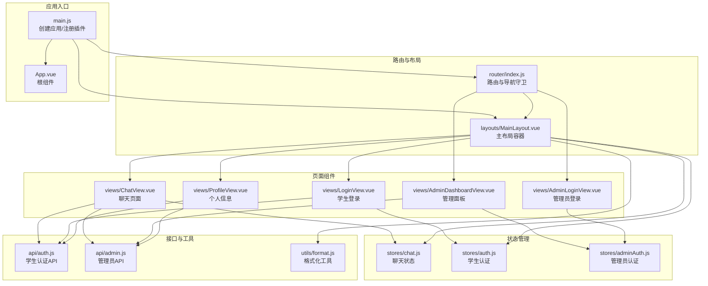
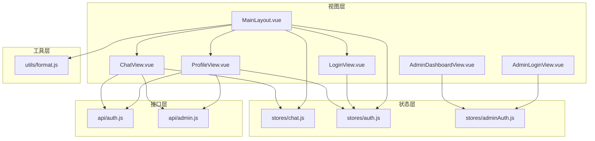
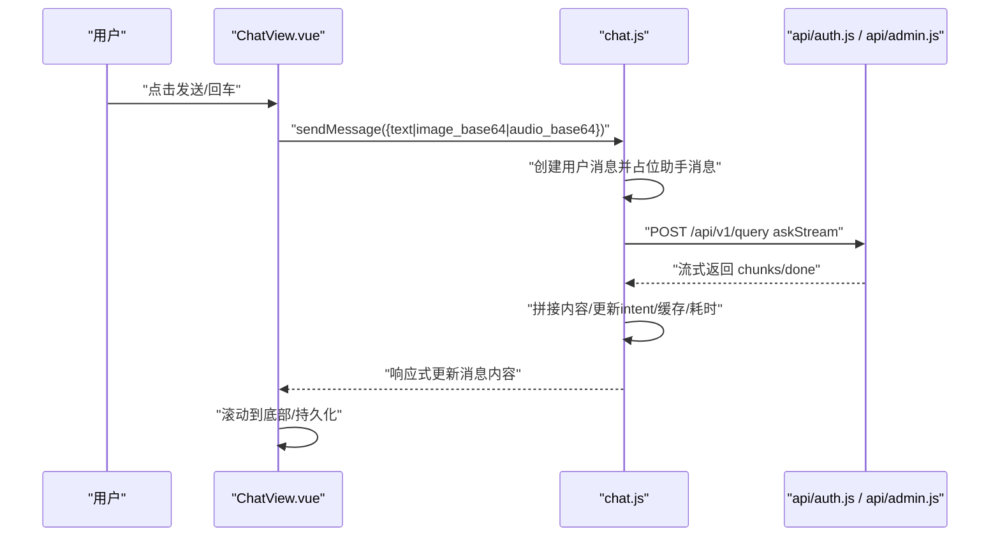
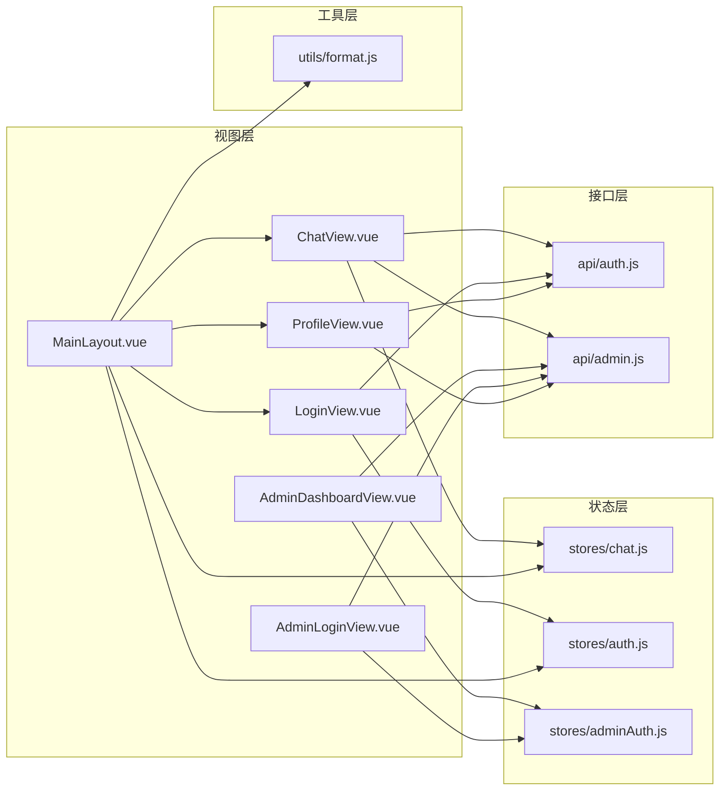

# 组件设计体系

<cite>
**本文引用的文件**
- [App.vue](file://frontend/ai_assistant/src/App.vue)
- [main.js](file://frontend/ai_assistant/src/main.js)
- [MainLayout.vue](file://frontend/ai_assistant/src/layouts/MainLayout.vue)
- [ChatView.vue](file://frontend/ai_assistant/src/views/ChatView.vue)
- [LoginView.vue](file://frontend/ai_assistant/src/views/LoginView.vue)
- [AdminDashboardView.vue](file://frontend/ai_assistant/src/views/AdminDashboardView.vue)
- [AdminLoginView.vue](file://frontend/ai_assistant/src/views/AdminLoginView.vue)
- [ProfileView.vue](file://frontend/ai_assistant/src/views/ProfileView.vue)
- [index.js](file://frontend/ai_assistant/src/router/index.js)
- [chat.js](file://frontend/ai_assistant/src/stores/chat.js)
- [auth.js](file://frontend/ai_assistant/src/stores/auth.js)
- [adminAuth.js](file://frontend/ai_assistant/src/stores/adminAuth.js)
- [auth.js](file://frontend/ai_assistant/src/api/auth.js)
- [admin.js](file://frontend/ai_assistant/src/api/admin.js)
- [format.js](file://frontend/ai_assistant/src/utils/format.js)
</cite>

## 目录
1. [引言](#引言)
2. [项目结构](#项目结构)
3. [核心组件](#核心组件)
4. [架构总览](#架构总览)
5. [组件详解](#组件详解)
6. [依赖关系分析](#依赖关系分析)
7. [性能考量](#性能考量)
8. [故障排查指南](#故障排查指南)
9. [结论](#结论)
10. [附录](#附录)

## 引言
本文件系统性梳理AI校园助手前端的Vue 3组件设计体系，覆盖组件定义、props传递、事件处理、插槽使用；页面组件设计模式（ChatView、LoginView、AdminDashboardView等）；组件间通信机制（父子、兄弟、跨层级）、复用策略与封装原则、测试方法与最佳实践，并给出性能优化建议。

## 项目结构
前端采用基于功能域的组织方式：views承载页面级组件，layouts承载布局容器，stores承载状态管理，api承载HTTP接口封装，utils承载通用工具函数，router承载路由配置与导航守卫，根组件负责挂载应用与全局注入。

**图表来源**
- [main.js:1-10](file://frontend/ai_assistant/src/main.js#L1-L10)
- [App.vue:1-7](file://frontend/ai_assistant/src/App.vue#L1-L7)
- [index.js:1-75](file://frontend/ai_assistant/src/router/index.js#L1-L75)
- [MainLayout.vue:1-116](file://frontend/ai_assistant/src/layouts/MainLayout.vue#L1-L116)
- [ChatView.vue:1-220](file://frontend/ai_assistant/src/views/ChatView.vue#L1-L220)
- [LoginView.vue:1-76](file://frontend/ai_assistant/src/views/LoginView.vue#L1-L76)
- [AdminDashboardView.vue:1-176](file://frontend/ai_assistant/src/views/AdminDashboardView.vue#L1-L176)
- [AdminLoginView.vue:1-57](file://frontend/ai_assistant/src/views/AdminLoginView.vue#L1-L57)
- [ProfileView.vue:1-96](file://frontend/ai_assistant/src/views/ProfileView.vue#L1-L96)
- [chat.js:1-278](file://frontend/ai_assistant/src/stores/chat.js#L1-L278)
- [auth.js:1-77](file://frontend/ai_assistant/src/stores/auth.js#L1-L77)
- [adminAuth.js:1-77](file://frontend/ai_assistant/src/stores/adminAuth.js#L1-L77)
- [auth.js:1-36](file://frontend/ai_assistant/src/api/auth.js#L1-L36)
- [admin.js:1-41](file://frontend/ai_assistant/src/api/admin.js#L1-L41)
- [format.js:1-67](file://frontend/ai_assistant/src/utils/format.js#L1-L67)

**章节来源**
- [main.js:1-10](file://frontend/ai_assistant/src/main.js#L1-L10)
- [App.vue:1-7](file://frontend/ai_assistant/src/App.vue#L1-L7)
- [index.js:1-75](file://frontend/ai_assistant/src/router/index.js#L1-L75)

## 核心组件
- 根组件与应用挂载：根组件仅承载路由视图，应用在入口统一注册Pinia、路由与全局样式。
- 布局组件：MainLayout作为主布局容器，承载侧边栏、移动端遮罩、主内容区与子路由视图。
- 页面组件：ChatView负责多模态聊天交互；LoginView负责学生登录；AdminDashboardView负责课表管理；AdminLoginView负责管理员登录；ProfileView负责个人信息与系统健康检查。
- 状态管理：Pinia Store封装认证与聊天状态，提供计算属性与异步操作。
- 接口封装：API模块对HTTP请求进行薄封装，统一参数与返回结构。
- 工具函数：format模块提供时间、响应时间、截断、学号掩码等格式化能力。

**章节来源**
- [App.vue:1-7](file://frontend/ai_assistant/src/App.vue#L1-L7)
- [main.js:1-10](file://frontend/ai_assistant/src/main.js#L1-L10)
- [MainLayout.vue:1-116](file://frontend/ai_assistant/src/layouts/MainLayout.vue#L1-L116)
- [ChatView.vue:1-220](file://frontend/ai_assistant/src/views/ChatView.vue#L1-L220)
- [LoginView.vue:1-76](file://frontend/ai_assistant/src/views/LoginView.vue#L1-L76)
- [AdminDashboardView.vue:1-176](file://frontend/ai_assistant/src/views/AdminDashboardView.vue#L1-L176)
- [AdminLoginView.vue:1-57](file://frontend/ai_assistant/src/views/AdminLoginView.vue#L1-L57)
- [ProfileView.vue:1-96](file://frontend/ai_assistant/src/views/ProfileView.vue#L1-L96)
- [chat.js:1-278](file://frontend/ai_assistant/src/stores/chat.js#L1-L278)
- [auth.js:1-77](file://frontend/ai_assistant/src/stores/auth.js#L1-L77)
- [adminAuth.js:1-77](file://frontend/ai_assistant/src/stores/adminAuth.js#L1-L77)
- [auth.js:1-36](file://frontend/ai_assistant/src/api/auth.js#L1-L36)
- [admin.js:1-41](file://frontend/ai_assistant/src/api/admin.js#L1-L41)
- [format.js:1-67](file://frontend/ai_assistant/src/utils/format.js#L1-L67)

## 架构总览
应用采用“布局容器 + 页面组件 + Pinia状态 + API封装 + 工具函数”的分层设计。路由负责页面级导航与鉴权控制，布局容器负责侧边栏、会话列表与主内容区，页面组件聚焦业务交互，状态管理集中处理会话、消息与认证，API模块屏蔽HTTP细节，工具模块提供通用格式化。

**图表来源**
- [MainLayout.vue:1-116](file://frontend/ai_assistant/src/layouts/MainLayout.vue#L1-L116)
- [ChatView.vue:1-220](file://frontend/ai_assistant/src/views/ChatView.vue#L1-L220)
- [ProfileView.vue:1-96](file://frontend/ai_assistant/src/views/ProfileView.vue#L1-L96)
- [LoginView.vue:1-76](file://frontend/ai_assistant/src/views/LoginView.vue#L1-L76)
- [AdminDashboardView.vue:1-176](file://frontend/ai_assistant/src/views/AdminDashboardView.vue#L1-L176)
- [AdminLoginView.vue:1-57](file://frontend/ai_assistant/src/views/AdminLoginView.vue#L1-L57)
- [chat.js:1-278](file://frontend/ai_assistant/src/stores/chat.js#L1-L278)
- [auth.js:1-77](file://frontend/ai_assistant/src/stores/auth.js#L1-L77)
- [adminAuth.js:1-77](file://frontend/ai_assistant/src/stores/adminAuth.js#L1-L77)
- [auth.js:1-36](file://frontend/ai_assistant/src/api/auth.js#L1-L36)
- [admin.js:1-41](file://frontend/ai_assistant/src/api/admin.js#L1-L41)
- [format.js:1-67](file://frontend/ai_assistant/src/utils/format.js#L1-L67)

## 组件详解

### Vue 3组件化设计要点
- 组件定义：采用<script setup>组合式API，声明式模板与逻辑分离，便于维护与测试。
- props传递：通过store与router提供的计算属性与响应式数据驱动UI，减少显式props传递。
- 事件处理：统一使用v-on绑定，结合防抖、节流与错误捕获，确保交互稳定性。
- 插槽使用：当前项目以结构化模板为主，未见具名/作用域插槽使用，遵循“高内聚、低耦合”。

**章节来源**
- [ChatView.vue:222-333](file://frontend/ai_assistant/src/views/ChatView.vue#L222-L333)
- [LoginView.vue:78-122](file://frontend/ai_assistant/src/views/LoginView.vue#L78-L122)
- [AdminDashboardView.vue:178-361](file://frontend/ai_assistant/src/views/AdminDashboardView.vue#L178-L361)
- [MainLayout.vue:118-175](file://frontend/ai_assistant/src/layouts/MainLayout.vue#L118-L175)

### 页面组件设计模式

#### ChatView 聊天组件
- 功能特性
  - 欢迎屏与示例引导、快捷操作、输入区多模态支持（文本、图片、语音）。
  - 消息列表渲染、意图标签、缓存标记、响应时间、设备ID展示。
  - 自动滚动、Markdown渲染、语音播放与录制、错误提示与恢复。
- 设计模式
  - 使用Pinia chat store集中管理会话与消息，组件只负责UI与交互。
  - 通过计算属性与watch实现消息变更自动滚底，增强用户体验。
  - 语音录制采用MediaRecorder，前端压缩与校验，降低后端压力。
- 关键流程（发送消息）

**图表来源**
- [ChatView.vue:312-333](file://frontend/ai_assistant/src/views/ChatView.vue#L312-L333)
- [chat.js:133-230](file://frontend/ai_assistant/src/stores/chat.js#L133-L230)
- [auth.js:1-36](file://frontend/ai_assistant/src/api/auth.js#L1-L36)
- [admin.js:1-41](file://frontend/ai_assistant/src/api/admin.js#L1-L41)

**章节来源**
- [ChatView.vue:1-535](file://frontend/ai_assistant/src/views/ChatView.vue#L1-L535)
- [chat.js:1-278](file://frontend/ai_assistant/src/stores/chat.js#L1-L278)

#### LoginView 登录组件
- 功能特性
  - 表单校验、密码可见性切换、提交状态与错误提示。
  - 调用认证API，成功后跳转到聊天页。
- 设计模式
  - 使用Pinia auth store管理token与过期时间，组件仅负责UI与交互。
  - 错误信息根据HTTP状态码映射为友好提示。

**章节来源**
- [LoginView.vue:1-122](file://frontend/ai_assistant/src/views/LoginView.vue#L1-L122)
- [auth.js:1-77](file://frontend/ai_assistant/src/stores/auth.js#L1-L77)
- [auth.js:1-36](file://frontend/ai_assistant/src/api/auth.js#L1-L36)

#### AdminDashboardView 管理面板
- 功能特性
  - 摘要卡片、筛选器（学期/班级/状态/周次/关键词）、分页表格、状态切换。
  - 并发加载元数据与摘要，统一错误处理与提示。
- 设计模式
  - 使用Pinia adminAuth store管理管理员会话，组件负责UI与交互。
  - 查询参数构建与分页逻辑解耦，便于扩展。

**章节来源**
- [AdminDashboardView.vue:1-361](file://frontend/ai_assistant/src/views/AdminDashboardView.vue#L1-L361)
- [adminAuth.js:1-77](file://frontend/ai_assistant/src/stores/adminAuth.js#L1-L77)
- [admin.js:1-41](file://frontend/ai_assistant/src/api/admin.js#L1-L41)

#### AdminLoginView 管理员登录
- 功能特性
  - 管理员用户名/密码登录，错误映射与友好提示。
- 设计模式
  - 与学生登录一致的store与API封装，保持一致性。

**章节来源**
- [AdminLoginView.vue:1-106](file://frontend/ai_assistant/src/views/AdminLoginView.vue#L1-L106)
- [adminAuth.js:1-77](file://frontend/ai_assistant/src/stores/adminAuth.js#L1-L77)
- [admin.js:1-41](file://frontend/ai_assistant/src/api/admin.js#L1-L41)

#### ProfileView 个人信息
- 功能特性
  - 展示学号、令牌有效期、设备ID、会话数与消息总数。
  - 系统健康检查与版本查询，支持一键清除对话。
- 设计模式
  - 读取auth与chat store数据，调用system API进行健康检查。

**章节来源**
- [ProfileView.vue:1-179](file://frontend/ai_assistant/src/views/ProfileView.vue#L1-L179)
- [auth.js:1-77](file://frontend/ai_assistant/src/stores/auth.js#L1-L77)
- [chat.js:1-278](file://frontend/ai_assistant/src/stores/chat.js#L1-L278)

### 组件间通信机制

#### 父子组件关系
- MainLayout 与各页面组件：MainLayout作为路由出口容器，通过router-view承载子页面；同时通过store与工具函数向子组件提供能力。
- ChatView 与 chat store：ChatView通过useChatStore读写会话与消息，store内部封装发送、删除、清理等操作。
- LoginView 与 auth store：LoginView通过useAuthStore执行登录与登出，store负责token持久化与过期判断。
- AdminDashboardView 与 adminAuth store：AdminDashboardView通过useAdminAuthStore执行登录与登出，store负责管理员信息持久化。

#### 兄弟组件协作
- MainLayout中的侧边栏与主内容区通过store共享会话列表与搜索关键字，实现“会话列表变更 → 聊天内容切换”的联动。
- 通过计算属性与watch监听store状态变化，避免跨层级频繁props传递。

#### 跨层级通信
- 通过Pinia store集中管理全局状态，组件通过store暴露的方法与计算属性进行跨层级通信。
- 路由守卫在导航阶段拦截未授权访问，实现跨层级的权限控制。

**章节来源**
- [MainLayout.vue:118-175](file://frontend/ai_assistant/src/layouts/MainLayout.vue#L118-L175)
- [chat.js:1-278](file://frontend/ai_assistant/src/stores/chat.js#L1-L278)
- [auth.js:1-77](file://frontend/ai_assistant/src/stores/auth.js#L1-L77)
- [adminAuth.js:1-77](file://frontend/ai_assistant/src/stores/adminAuth.js#L1-L77)
- [index.js:57-73](file://frontend/ai_assistant/src/router/index.js#L57-L73)

### 组件复用策略与封装原则
- 复用策略
  - 将通用UI行为抽象为store方法（如发送消息、切换会话），在多个页面组件中复用。
  - 将通用格式化逻辑抽离为工具函数，供视图与store共同使用。
  - 将HTTP请求封装为API模块，统一错误处理与参数格式。
- 封装原则
  - 单一职责：每个store只负责一个领域（聊天/认证），避免交叉耦合。
  - 明确边界：组件只负责UI与交互，状态与网络请求由store/API承担。
  - 可测试性：通过store导出方法与API导出对象，便于单元测试与集成测试。

**章节来源**
- [chat.js:1-278](file://frontend/ai_assistant/src/stores/chat.js#L1-L278)
- [auth.js:1-77](file://frontend/ai_assistant/src/stores/auth.js#L1-L77)
- [adminAuth.js:1-77](file://frontend/ai_assistant/src/stores/adminAuth.js#L1-L77)
- [auth.js:1-36](file://frontend/ai_assistant/src/api/auth.js#L1-L36)
- [admin.js:1-41](file://frontend/ai_assistant/src/api/admin.js#L1-L41)
- [format.js:1-67](file://frontend/ai_assistant/src/utils/format.js#L1-L67)

### 组件测试方法
- 单元测试
  - 对store方法进行mock与断言，验证状态变更与副作用（如持久化）。
  - 对API模块进行请求参数与返回值断言，模拟网络错误场景。
- 集成测试
  - 使用真实store与API，模拟用户交互（输入、点击、滚动），验证UI与状态同步。
- 端到端测试
  - 通过路由守卫与登录流程，验证鉴权与页面跳转链路。

[本节为通用指导，无需特定文件引用]

## 依赖关系分析

**图表来源**
- [ChatView.vue:1-220](file://frontend/ai_assistant/src/views/ChatView.vue#L1-L220)
- [LoginView.vue:1-76](file://frontend/ai_assistant/src/views/LoginView.vue#L1-L76)
- [AdminDashboardView.vue:1-176](file://frontend/ai_assistant/src/views/AdminDashboardView.vue#L1-L176)
- [AdminLoginView.vue:1-57](file://frontend/ai_assistant/src/views/AdminLoginView.vue#L1-L57)
- [ProfileView.vue:1-96](file://frontend/ai_assistant/src/views/ProfileView.vue#L1-L96)
- [MainLayout.vue:1-116](file://frontend/ai_assistant/src/layouts/MainLayout.vue#L1-L116)
- [chat.js:1-278](file://frontend/ai_assistant/src/stores/chat.js#L1-L278)
- [auth.js:1-77](file://frontend/ai_assistant/src/stores/auth.js#L1-L77)
- [adminAuth.js:1-77](file://frontend/ai_assistant/src/stores/adminAuth.js#L1-L77)
- [auth.js:1-36](file://frontend/ai_assistant/src/api/auth.js#L1-L36)
- [admin.js:1-41](file://frontend/ai_assistant/src/api/admin.js#L1-L41)
- [format.js:1-67](file://frontend/ai_assistant/src/utils/format.js#L1-L67)

**章节来源**
- [index.js:1-75](file://frontend/ai_assistant/src/router/index.js#L1-L75)

## 性能考量
- 渲染优化
  - 使用TransitionGroup与列表动画时注意key稳定与元素数量控制，避免大规模重排。
  - 消息列表使用虚拟滚动（当前未实现）可进一步提升长对话性能。
- 状态与存储
  - store中使用计算属性与响应式引用，避免不必要的组件重渲染。
  - 本地持久化采用localStorage，注意序列化与字段迁移策略。
- 网络与流式
  - 流式接口按块增量更新，避免一次性渲染大文本。
  - 语音与图片上传前进行前端压缩与体积限制，降低带宽与后端压力。
- 资源与懒加载
  - 路由组件采用动态导入，配合骨架屏与渐进式渲染提升首屏体验。

[本节为通用指导，无需特定文件引用]

## 故障排查指南
- 登录失败
  - 检查认证API返回的状态码与错误详情，映射为用户可理解的提示。
  - 确认加密流程与token存储是否正确。
- 聊天无响应
  - 检查store中loading状态与消息占位是否正确创建。
  - 确认流式接口回调是否触发done与内容拼接。
- 管理面板数据为空
  - 检查meta与summary并发加载是否成功，确认筛选参数构建逻辑。
- 语音/图片异常
  - 校验前端压缩与格式转换逻辑，确认浏览器权限与兼容性。

**章节来源**
- [LoginView.vue:94-121](file://frontend/ai_assistant/src/views/LoginView.vue#L94-L121)
- [chat.js:235-257](file://frontend/ai_assistant/src/stores/chat.js#L235-L257)
- [AdminDashboardView.vue:220-263](file://frontend/ai_assistant/src/views/AdminDashboardView.vue#L220-L263)

## 结论
本项目通过“布局容器 + 页面组件 + Pinia状态 + API封装 + 工具函数”的分层设计，实现了清晰的职责划分与良好的可维护性。组件间通过store与路由守卫进行解耦通信，页面组件专注于交互与渲染，状态与网络请求由store与API承担。建议在后续迭代中引入虚拟滚动、更完善的错误边界与测试覆盖，持续提升性能与可靠性。

## 附录
- 最佳实践清单
  - 优先使用组合式API与store，减少props与事件层层传递。
  - 将UI与业务逻辑分离，保持组件薄而精。
  - 对外暴露明确的API与store方法，便于测试与演进。
  - 统一错误处理与用户提示，提升可诊断性与可用性。
- 性能优化建议
  - 大列表虚拟化、图片与语音压缩、请求去抖与合并。
  - 组件懒加载与预取、缓存策略与失效控制。
  - 监控与埋点：记录关键指标（首屏、交互延迟、错误率）。

[本节为通用指导，无需特定文件引用]