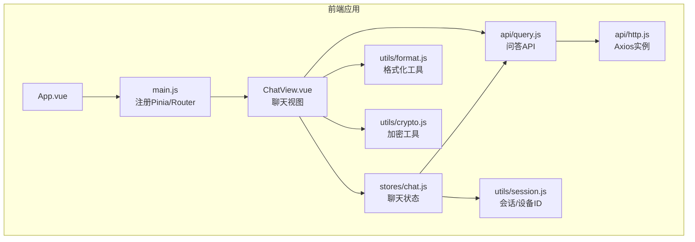
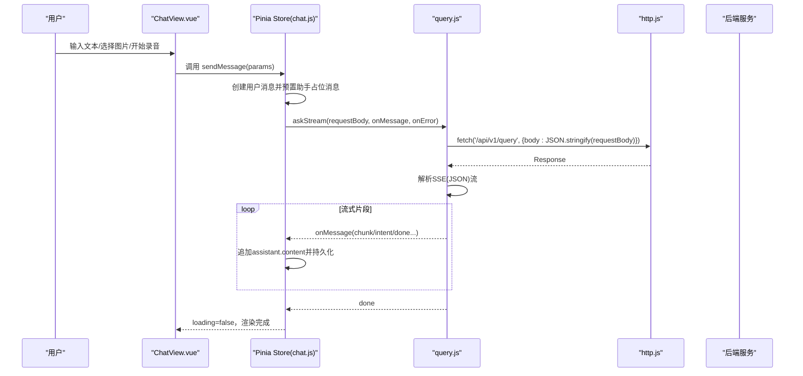
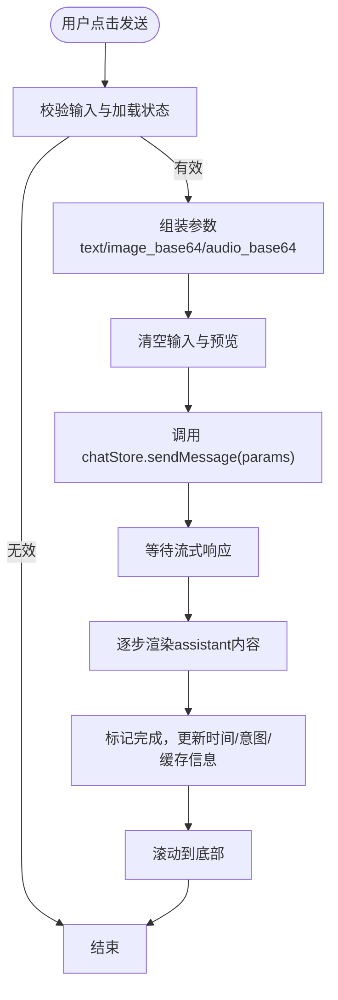
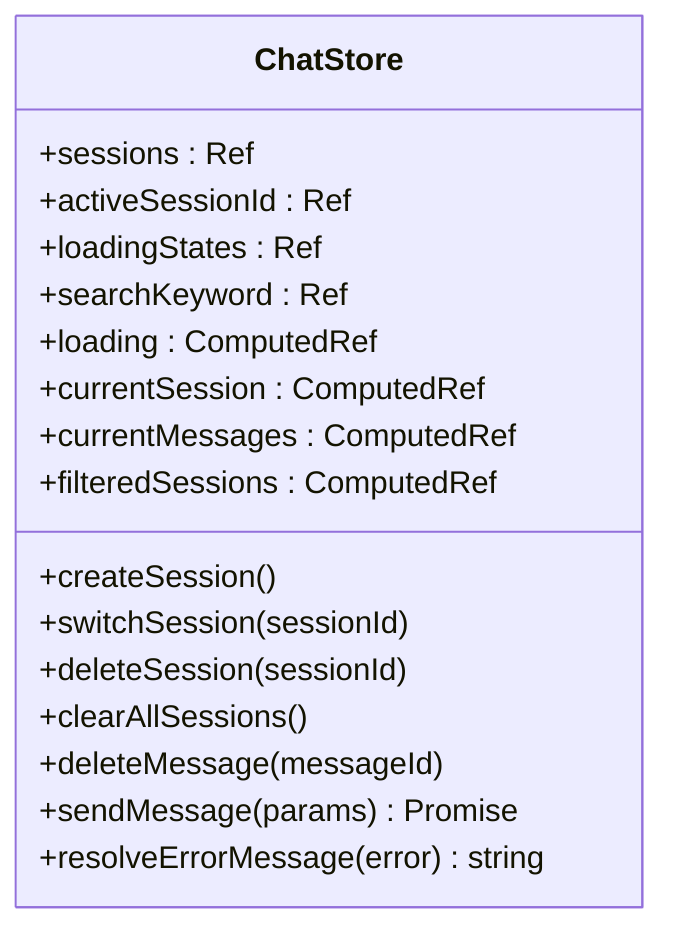
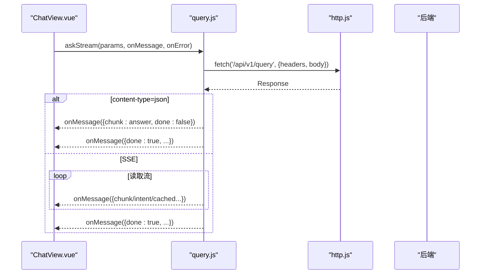
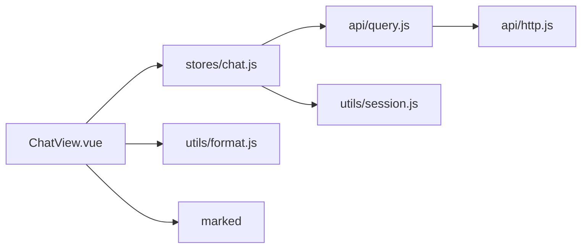

# 聊天组件设计

<cite>
**本文引用的文件**
- [ChatView.vue](file://frontend/ai_assistant/src/views/ChatView.vue)
- [chat.js](file://frontend/ai_assistant/src/stores/chat.js)
- [query.js](file://frontend/ai_assistant/src/api/query.js)
- [http.js](file://frontend/ai_assistant/src/api/http.js)
- [format.js](file://frontend/ai_assistant/src/utils/format.js)
- [session.js](file://frontend/ai_assistant/src/utils/session.js)
- [crypto.js](file://frontend/ai_assistant/src/utils/crypto.js)
- [package.json](file://frontend/ai_assistant/package.json)
- [main.js](file://frontend/ai_assistant/src/main.js)
</cite>

## 目录
1. [简介](#简介)
2. [项目结构](#项目结构)
3. [核心组件](#核心组件)
4. [架构总览](#架构总览)
5. [详细组件分析](#详细组件分析)
6. [依赖关系分析](#依赖关系分析)
7. [性能考量](#性能考量)
8. [故障排查指南](#故障排查指南)
9. [结论](#结论)
10. [附录](#附录)

## 简介
本设计文档围绕AI校园助手的聊天组件展开，系统性解析ChatView组件的架构设计与实现细节，覆盖多模态输入（文本、图片、语音）、消息渲染机制、实时流式响应、会话管理、状态与事件处理、生命周期钩子、Markdown渲染、图片压缩、语音录制与播放等关键技术，并提供组件复用策略、性能优化技巧与用户体验设计原则。

## 项目结构
前端采用Vue 3 + Pinia + Vue Router + Vite构建，聊天组件位于views层，状态管理位于stores层，API封装于api层，通用工具位于utils层。整体采用“视图-状态-接口-工具”的分层组织方式，职责清晰、耦合度低。

图表来源
- [main.js:1-10](file://frontend/ai_assistant/src/main.js#L1-L10)
- [ChatView.vue:1-220](file://frontend/ai_assistant/src/views/ChatView.vue#L1-L220)
- [chat.js:1-278](file://frontend/ai_assistant/src/stores/chat.js#L1-L278)
- [query.js:1-141](file://frontend/ai_assistant/src/api/query.js#L1-L141)
- [http.js:1-49](file://frontend/ai_assistant/src/api/http.js#L1-L49)
- [format.js:1-67](file://frontend/ai_assistant/src/utils/format.js#L1-L67)
- [session.js:1-70](file://frontend/ai_assistant/src/utils/session.js#L1-L70)
- [crypto.js:1-40](file://frontend/ai_assistant/src/utils/crypto.js#L1-L40)

章节来源
- [package.json:1-24](file://frontend/ai_assistant/package.json#L1-L24)
- [main.js:1-10](file://frontend/ai_assistant/src/main.js#L1-L10)

## 核心组件
- ChatView.vue：聊天主视图，负责多模态输入、消息渲染、滚动控制、录音播放、示例与快捷操作填充。
- chat.js（Pinia Store）：集中管理会话、消息、加载状态、搜索过滤、本地持久化。
- query.js：封装POST /api/v1/query的问答接口，支持JSON直返与SSE流式输出。
- http.js：Axios实例，统一请求头与401自动登出逻辑。
- format.js：时间、响应时间、字符串截断等格式化工具。
- session.js：会话ID、设备ID生成与localStorage持久化。
- crypto.js：AES-CBC加密工具（用于密码等敏感数据）。

章节来源
- [ChatView.vue:222-534](file://frontend/ai_assistant/src/views/ChatView.vue#L222-L534)
- [chat.js:22-278](file://frontend/ai_assistant/src/stores/chat.js#L22-L278)
- [query.js:7-141](file://frontend/ai_assistant/src/api/query.js#L7-L141)
- [http.js:10-49](file://frontend/ai_assistant/src/api/http.js#L10-L49)
- [format.js:10-67](file://frontend/ai_assistant/src/utils/format.js#L10-L67)
- [session.js:14-70](file://frontend/ai_assistant/src/utils/session.js#L14-L70)
- [crypto.js:26-40](file://frontend/ai_assistant/src/utils/crypto.js#L26-L40)

## 架构总览
聊天组件采用“视图-状态-接口-工具”的分层架构：
- 视图层：ChatView.vue负责UI交互、事件绑定、多模态输入处理与渲染。
- 状态层：Pinia Store管理会话、消息、加载状态与本地持久化。
- 接口层：query.js封装与后端的问答交互，兼容JSON直返与SSE流式输出。
- 工具层：format.js、session.js、crypto.js提供格式化、会话/设备ID与加密能力。

图表来源
- [ChatView.vue:312-333](file://frontend/ai_assistant/src/views/ChatView.vue#L312-L333)
- [chat.js:133-230](file://frontend/ai_assistant/src/stores/chat.js#L133-L230)
- [query.js:28-141](file://frontend/ai_assistant/src/api/query.js#L28-L141)
- [http.js:10-49](file://frontend/ai_assistant/src/api/http.js#L10-L49)

## 详细组件分析

### ChatView.vue：多模态聊天视图
- 欢迎界面与示例/快捷操作：无会话或空消息时显示，支持一键填充输入框。
- 消息列表渲染：基于TransitionGroup实现消息进入动画；根据角色渲染不同头像与气泡样式；支持图片缩略图与语音气泡。
- Markdown渲染：使用marked解析，支持换行与GitHub风格；异常时回退为换行。
- 输入区域：支持文本自适应高度、图片上传预览与移除、语音录制（按下开始、松开发送、移开取消）、发送按钮禁用逻辑。
- 语音播放：点击语音气泡播放webm音频，同一时刻仅允许一个播放，播放结束自动清理状态。
- 滚动控制：监听消息长度变化与mounted后自动滚动到底部，保证最新消息可见。
- 生命周期钩子：onMounted时滚动到底部；watch监听消息数量变化自动滚底。

图表来源
- [ChatView.vue:312-333](file://frontend/ai_assistant/src/views/ChatView.vue#L312-L333)
- [chat.js:133-230](file://frontend/ai_assistant/src/stores/chat.js#L133-L230)

章节来源
- [ChatView.vue:1-220](file://frontend/ai_assistant/src/views/ChatView.vue#L1-L220)
- [ChatView.vue:222-534](file://frontend/ai_assistant/src/views/ChatView.vue#L222-L534)
- [ChatView.vue:800-1168](file://frontend/ai_assistant/src/views/ChatView.vue#L800-L1168)

### Pinia Store：聊天状态管理
- 会话管理：创建、切换、删除、清空；活跃会话ID与会话列表持久化至localStorage。
- 消息管理：当前会话消息列表计算属性；删除单条消息；首条用户消息自动设置会话标题。
- 加载状态：按会话维度维护loadingStates，确保UI正确反馈。
- 搜索过滤：按会话标题或消息内容关键词过滤会话列表。
- 发送消息：自动附加session_id与设备ID；预置助手占位消息；流式回调追加内容；错误解析与持久化。
- 错误解析：针对后端特定错误（如音频处理失败）进行友好提示；通用HTTP状态码映射。

图表来源
- [chat.js:22-278](file://frontend/ai_assistant/src/stores/chat.js#L22-L278)

章节来源
- [chat.js:22-278](file://frontend/ai_assistant/src/stores/chat.js#L22-L278)

### API层：问答接口与流式处理
- ask：标准POST请求，返回完整答案。
- askStream：支持SSE流式输出，兼容网关可能改写格式；解析data行或JSON包裹；兜底处理未发送done包的情况；错误通过onError回调。
- http.js：Axios实例，自动附加Authorization头；401统一登出并跳转登录页。

图表来源
- [query.js:28-141](file://frontend/ai_assistant/src/api/query.js#L28-L141)
- [http.js:10-49](file://frontend/ai_assistant/src/api/http.js#L10-L49)

章节来源
- [query.js:7-141](file://frontend/ai_assistant/src/api/query.js#L7-L141)
- [http.js:10-49](file://frontend/ai_assistant/src/api/http.js#L10-L49)

### 工具层：格式化、会话与加密
- format.js：时间戳人性化显示、响应时间单位转换、字符串截断、学号掩码、日期格式化。
- session.js：生成session_id与did，会话列表与活跃会话ID的localStorage持久化。
- crypto.js：AES-CBC加密，URL-safe Base64编码，格式为iv_base64:ciphertext_base64。

章节来源
- [format.js:10-67](file://frontend/ai_assistant/src/utils/format.js#L10-L67)
- [session.js:14-70](file://frontend/ai_assistant/src/utils/session.js#L14-L70)
- [crypto.js:26-40](file://frontend/ai_assistant/src/utils/crypto.js#L26-L40)

## 依赖关系分析
- ChatView.vue依赖：
  - Pinia Store（useChatStore）
  - marked（Markdown渲染）
  - utils/format（时间/响应时间格式化）
- chat.js依赖：
  - api/query（问答接口）
  - utils/session（会话/设备ID）
- query.js依赖：
  - api/http（Axios实例）
- http.js依赖：
  - axios、stores/auth、router（401登出与路由跳转）

图表来源
- [ChatView.vue:222-227](file://frontend/ai_assistant/src/views/ChatView.vue#L222-L227)
- [chat.js:12-20](file://frontend/ai_assistant/src/stores/chat.js#L12-L20)
- [query.js:5](file://frontend/ai_assistant/src/api/query.js#L5)
- [http.js:6-8](file://frontend/ai_assistant/src/api/http.js#L6-L8)

章节来源
- [package.json:11-19](file://frontend/ai_assistant/package.json#L11-L19)

## 性能考量
- 图片压缩策略
  - 小于阈值（约800KB）直接使用原始DataURL，避免不必要的CPU消耗。
  - 大图在前端Canvas压缩，限制最大边为1024，输出jpeg质量0.7，兼顾体积与画质。
  - 前端上传限制5MB，避免后端网关/反向代理超限。
- 流式渲染
  - 后端SSE/JSON直返均支持增量渲染，避免一次性渲染大段内容导致卡顿。
  - 占位消息预置，确保assistant消息可逐步追加，提升感知速度。
- 滚动优化
  - nextTick后滚动到底部，减少DOM重排；仅在消息数量变化时触发。
- 本地持久化
  - 会话列表与活跃会话IDlocalStorage存储，避免刷新丢失。
- 语音处理
  - 录音时长与数据量双重校验，短录音与静音直接提示，降低无效请求。
  - Web Audio API播放，避免额外库依赖；同一时刻仅允许一个播放，防止资源竞争。

章节来源
- [ChatView.vue:335-390](file://frontend/ai_assistant/src/views/ChatView.vue#L335-L390)
- [ChatView.vue:397-525](file://frontend/ai_assistant/src/views/ChatView.vue#L397-L525)
- [chat.js:133-230](file://frontend/ai_assistant/src/stores/chat.js#L133-L230)

## 故障排查指南
- 无法访问麦克风
  - 现象：弹窗提示权限错误。
  - 处理：检查浏览器权限设置，确认HTTPS环境与媒体设备可用。
- 录音时间过短或无声音
  - 现象：提示录音时间太短或未检测到声音。
  - 处理：增大音量、靠近麦克风，确保环境噪音适中。
- 语音播放失败
  - 现象：播放报错或无法播放。
  - 处理：检查浏览器对webm的支持情况；尝试更换浏览器；确认音频Base64数据有效。
- 网络异常或后端错误
  - 现象：助手消息显示错误提示。
  - 处理：查看resolveErrorMessage映射，401自动登出；检查网络连通性与后端服务状态。
- 图片过大导致上传失败
  - 现象：上传5MB以上图片失败。
  - 处理：前端已限制；建议压缩或选择更小图片。

章节来源
- [ChatView.vue:400-464](file://frontend/ai_assistant/src/views/ChatView.vue#L400-L464)
- [ChatView.vue:486-525](file://frontend/ai_assistant/src/views/ChatView.vue#L486-L525)
- [chat.js:235-257](file://frontend/ai_assistant/src/stores/chat.js#L235-L257)

## 结论
该聊天组件通过清晰的分层架构与完善的多模态输入处理，实现了流畅的用户体验与良好的可维护性。流式渲染与本地持久化提升了交互效率与稳定性；图片压缩与语音校验降低了无效请求与资源浪费。后续可在以下方面持续优化：增强错误恢复与重试机制、引入图片懒加载、优化移动端交互细节、扩展更多多媒体类型支持。

## 附录
- 组件复用策略
  - 将消息渲染、图片预览、语音播放等子功能拆分为可复用的子组件或组合式函数，便于在其他页面复用。
  - 将格式化工具抽离为独立模块，统一对外暴露API。
- 用户体验设计原则
  - 明确的加载状态与错误提示，避免用户困惑。
  - 语音录制提供视觉反馈（录制动画），提升交互感知。
  - 移动端适配与触摸事件优化，保证易用性。
- 安全与隐私
  - 敏感数据（如密码）使用AES-CBC加密；避免在前端存储明文令牌。
  - 严格限制上传文件大小与类型，防止滥用。