# 路由系统设计

<cite>
**本文档引用的文件**
- [router/index.js](file://frontend/ai_assistant/src/router/index.js)
- [main.js](file://frontend/ai_assistant/src/main.js)
- [stores/auth.js](file://frontend/ai_assistant/src/stores/auth.js)
- [stores/adminAuth.js](file://frontend/ai_assistant/src/stores/adminAuth.js)
- [views/LoginView.vue](file://frontend/ai_assistant/src/views/LoginView.vue)
- [views/AdminLoginView.vue](file://frontend/ai_assistant/src/views/AdminLoginView.vue)
- [layouts/MainLayout.vue](file://frontend/ai_assistant/src/layouts/MainLayout.vue)
- [api/auth.js](file://frontend/ai_assistant/src/api/auth.js)
- [api/admin.js](file://frontend/ai_assistant/src/api/admin.js)
- [stores/chat.js](file://frontend/ai_assistant/src/stores/chat.js)
- [utils/crypto.js](file://frontend/ai_assistant/src/utils/crypto.js)
- [package.json](file://frontend/ai_assistant/package.json)
</cite>

## 目录
1. [简介](#简介)
2. [项目结构](#项目结构)
3. [核心组件](#核心组件)
4. [架构概览](#架构概览)
5. [详细组件分析](#详细组件分析)
6. [依赖关系分析](#依赖关系分析)
7. [性能考虑](#性能考虑)
8. [故障排除指南](#故障排除指南)
9. [结论](#结论)

## 简介

AI校园助手项目的路由系统基于Vue Router 4.x构建，采用现代化的组合式API设计，实现了完整的单页面应用路由管理。该系统支持用户认证、管理员认证、权限控制、动态路由加载等核心功能，为校园智能助手提供了流畅的用户体验。

## 项目结构

前端路由系统主要分布在以下目录结构中：

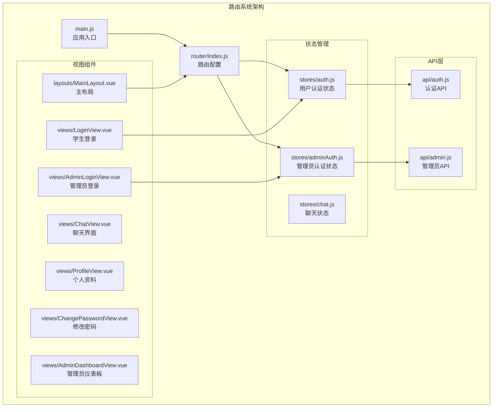

**图表来源**
- [router/index.js:1-75](file://frontend/ai_assistant/src/router/index.js#L1-L75)
- [main.js:1-10](file://frontend/ai_assistant/src/main.js#L1-L10)

**章节来源**
- [router/index.js:1-75](file://frontend/ai_assistant/src/router/index.js#L1-L75)
- [main.js:1-10](file://frontend/ai_assistant/src/main.js#L1-L10)

## 核心组件

### 路由配置系统

路由系统采用模块化设计，通过单一配置文件集中管理所有路由规则：

#### 路由定义结构
- **基础路由**: `/` 主应用路由，包含嵌套子路由
- **认证路由**: `/login` 学生登录，`/admin/login` 管理员登录
- **受保护路由**: `/admin` 管理员后台，`/profile` 个人资料
- **动态路由**: `/:pathMatch(.*)*` 通配符路由

#### 路由元信息设计
路由使用meta字段实现权限控制：
- `requiresAuth`: 学生认证要求
- `requiresAdminAuth`: 管理员认证要求  
- `guest`: 未登录访问限制
- `adminGuest`: 管理员未登录访问限制

**章节来源**
- [router/index.js:5-50](file://frontend/ai_assistant/src/router/index.js#L5-L50)

### 导航守卫系统

全局导航守卫实现统一的权限控制逻辑：

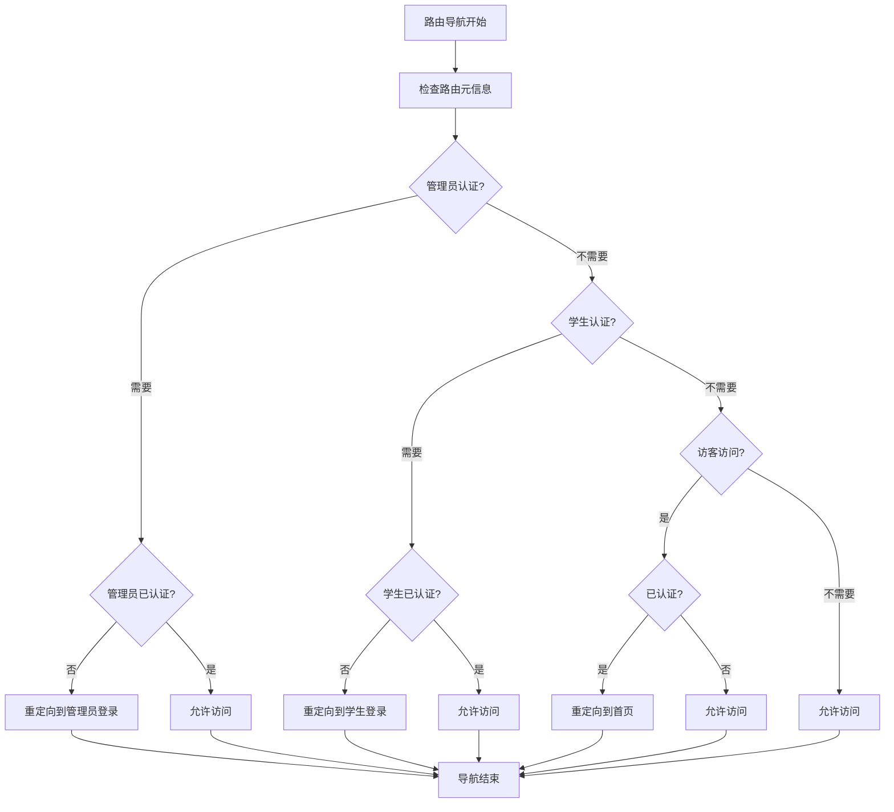

**图表来源**
- [router/index.js:57-73](file://frontend/ai_assistant/src/router/index.js#L57-L73)

**章节来源**
- [router/index.js:57-73](file://frontend/ai_assistant/src/router/index.js#L57-L73)

### 状态管理系统

#### 用户认证状态管理
使用Pinia Store管理用户认证状态，实现持久化存储：

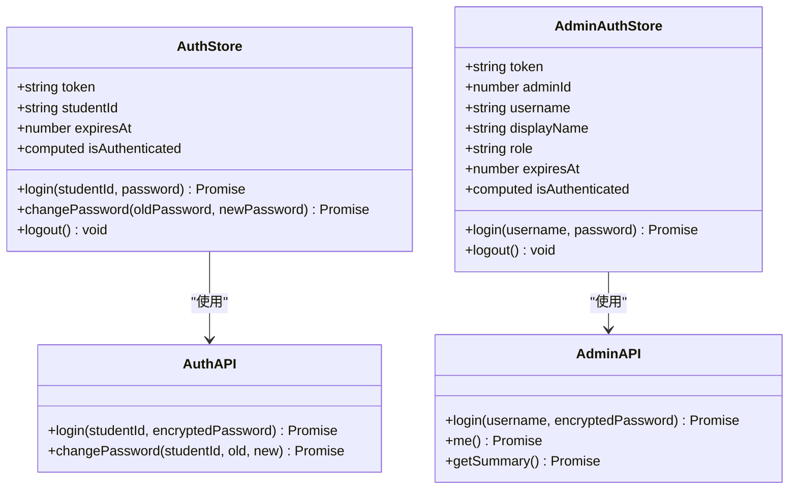

**图表来源**
- [stores/auth.js:17-77](file://frontend/ai_assistant/src/stores/auth.js#L17-L77)
- [stores/adminAuth.js:16-77](file://frontend/ai_assistant/src/stores/adminAuth.js#L16-L77)

**章节来源**
- [stores/auth.js:17-77](file://frontend/ai_assistant/src/stores/auth.js#L17-L77)
- [stores/adminAuth.js:16-77](file://frontend/ai_assistant/src/stores/adminAuth.js#L16-L77)

## 架构概览

### 整体架构设计

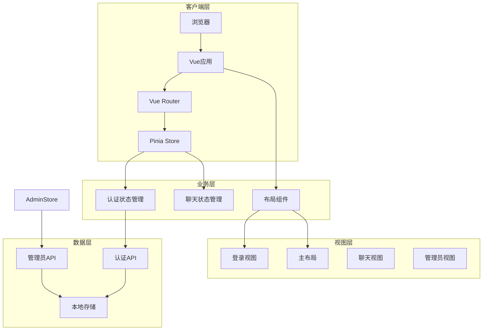

**图表来源**
- [main.js:1-10](file://frontend/ai_assistant/src/main.js#L1-L10)
- [router/index.js:1-75](file://frontend/ai_assistant/src/router/index.js#L1-L75)

### 路由权限控制流程

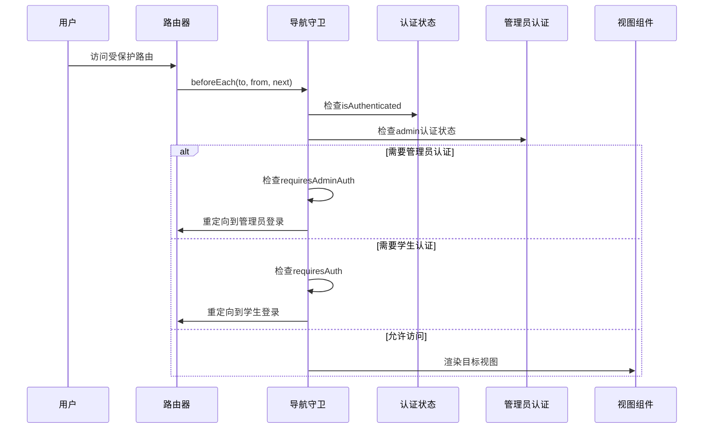

**图表来源**
- [router/index.js:57-73](file://frontend/ai_assistant/src/router/index.js#L57-L73)
- [stores/auth.js:24-26](file://frontend/ai_assistant/src/stores/auth.js#L24-L26)
- [stores/adminAuth.js:24-26](file://frontend/ai_assistant/src/stores/adminAuth.js#L24-L26)

## 详细组件分析

### 路由配置详解

#### 嵌套路由设计
主应用采用嵌套路由结构，通过MainLayout组件承载子路由：

```mermaid
graph LR
Root[/] --> MainLayout[MainLayout.vue]
MainLayout --> Chat[ChatView.vue]
MainLayout --> Profile[ProfileView.vue]
MainLayout --> ChangePassword[ChangePasswordView.vue]
subgraph "路由层级"
Root["根路由<br/>路径: /"] --> Child["子路由<br/>路径: /, /profile, /change-password"]
end
```

**图表来源**
- [router/index.js:25-45](file://frontend/ai_assistant/src/router/index.js#L25-L45)
- [layouts/MainLayout.vue:113](file://frontend/ai_assistant/src/layouts/MainLayout.vue#L113)

**章节来源**
- [router/index.js:25-45](file://frontend/ai_assistant/src/router/index.js#L25-L45)

#### 动态路由匹配
系统使用通配符路由处理未匹配的URL：

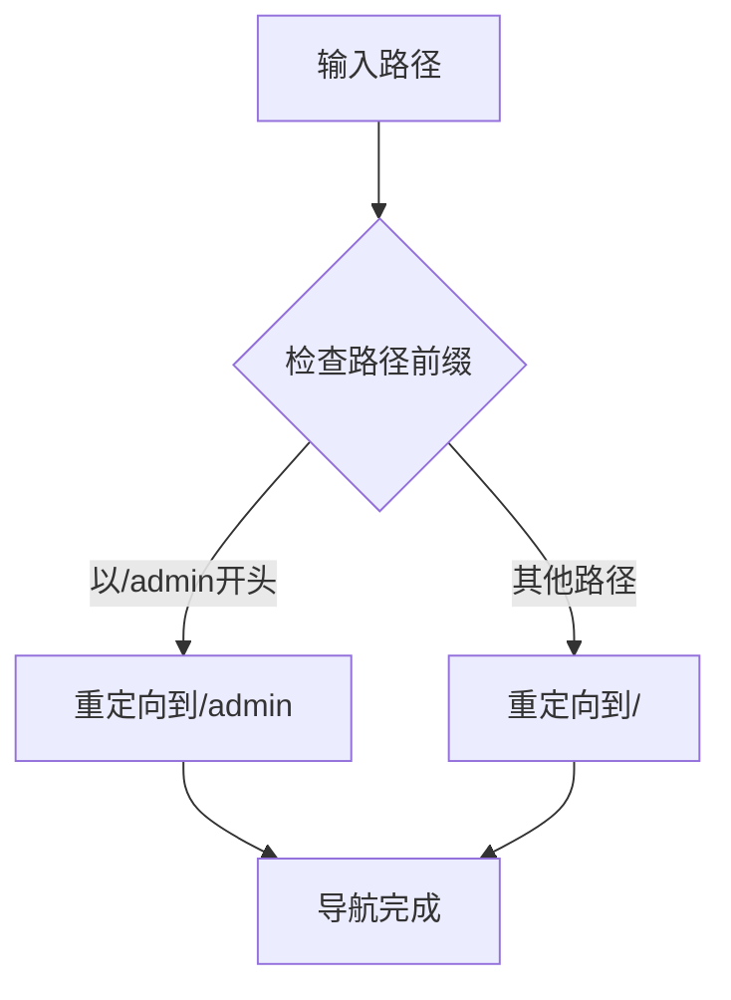

**图表来源**
- [router/index.js:46-49](file://frontend/ai_assistant/src/router/index.js#L46-L49)

**章节来源**
- [router/index.js:46-49](file://frontend/ai_assistant/src/router/index.js#L46-L49)

### 导航守卫实现

#### 权限控制逻辑
导航守卫根据路由元信息和认证状态执行相应的重定向：

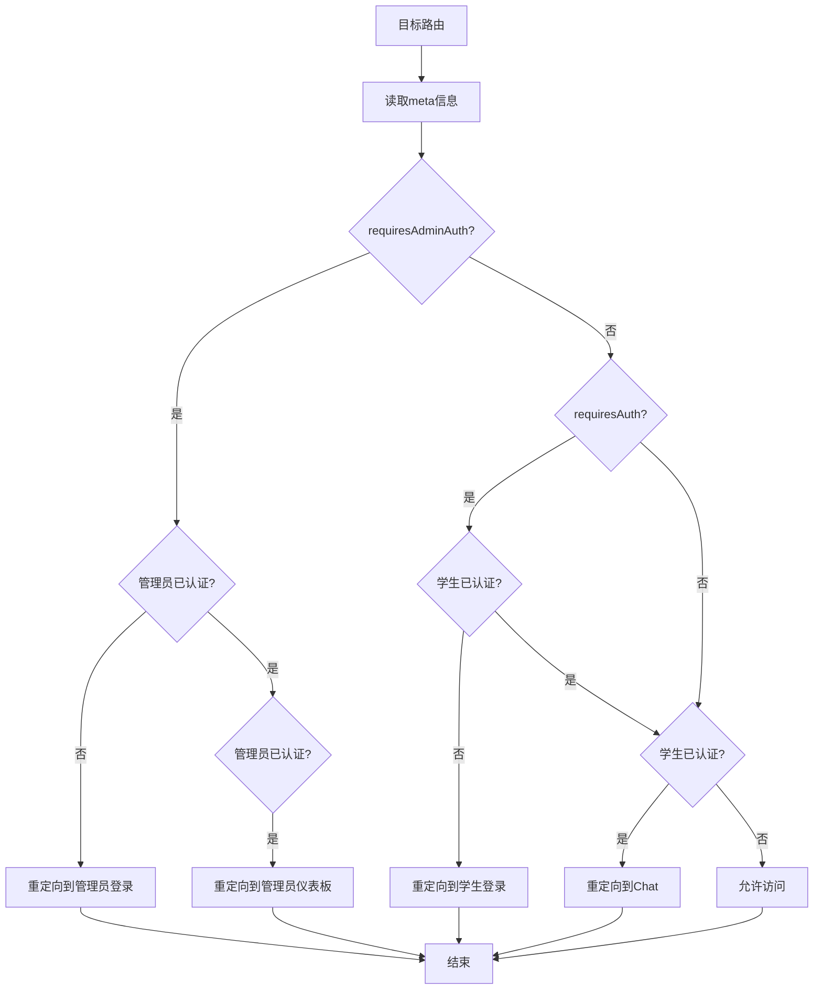

**图表来源**
- [router/index.js:58-72](file://frontend/ai_assistant/src/router/index.js#L58-L72)

**章节来源**
- [router/index.js:58-72](file://frontend/ai_assistant/src/router/index.js#L58-L72)

### 路由懒加载策略

#### 代码分割实现
所有路由组件均采用动态导入实现懒加载：

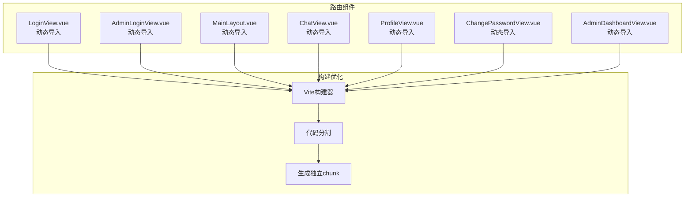

**图表来源**
- [router/index.js:9,15,21,32,37,42,89:9-9](file://frontend/ai_assistant/src/router/index.js#L9-L9)
- [router/index.js:15](file://frontend/ai_assistant/src/router/index.js#L15-L15)
- [router/index.js:21](file://frontend/ai_assistant/src/router/index.js#L21-L21)
- [router/index.js:32](file://frontend/ai_assistant/src/router/index.js#L32-L32)
- [router/index.js:37](file://frontend/ai_assistant/src/router/index.js#L37-L37)
- [router/index.js:42](file://frontend/ai_assistant/src/router/index.js#L42-L42)
- [router/index.js:89](file://frontend/ai_assistant/src/router/index.js#L89-L89)

**章节来源**
- [router/index.js:9,15,21,32,37,42,89:9-9](file://frontend/ai_assistant/src/router/index.js#L9-L9)

### 路由元信息使用

#### 权限控制标记
路由元信息实现细粒度的权限控制：

| 元信息键 | 用途 | 控制逻辑 |
|---------|------|----------|
| requiresAuth | 学生认证要求 | 未认证时重定向到登录页 |
| requiresAdminAuth | 管理员认证要求 | 未认证时重定向到管理员登录 |
| guest | 访客访问限制 | 已认证时重定向到首页 |
| adminGuest | 管理员访客限制 | 已认证时重定向到管理员仪表板 |

**章节来源**
- [router/index.js:10,16,22,26:10-26](file://frontend/ai_assistant/src/router/index.js#L10-L26)

### 路由导航流程

#### 编程式导航
在视图组件中使用编程式导航进行路由跳转：

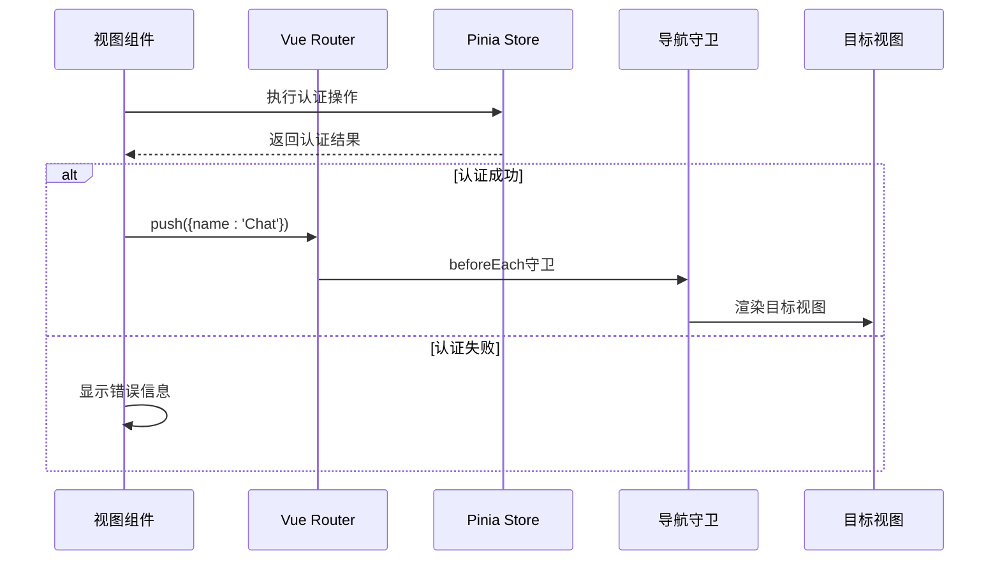

**图表来源**
- [views/LoginView.vue:109](file://frontend/ai_assistant/src/views/LoginView.vue#L109)
- [views/AdminLoginView.vue:90](file://frontend/ai_assistant/src/views/AdminLoginView.vue#L90)

**章节来源**
- [views/LoginView.vue:109](file://frontend/ai_assistant/src/views/LoginView.vue#L109)
- [views/AdminLoginView.vue:90](file://frontend/ai_assistant/src/views/AdminLoginView.vue#L90)

#### 声明式导航
使用`<router-link>`实现声明式导航：

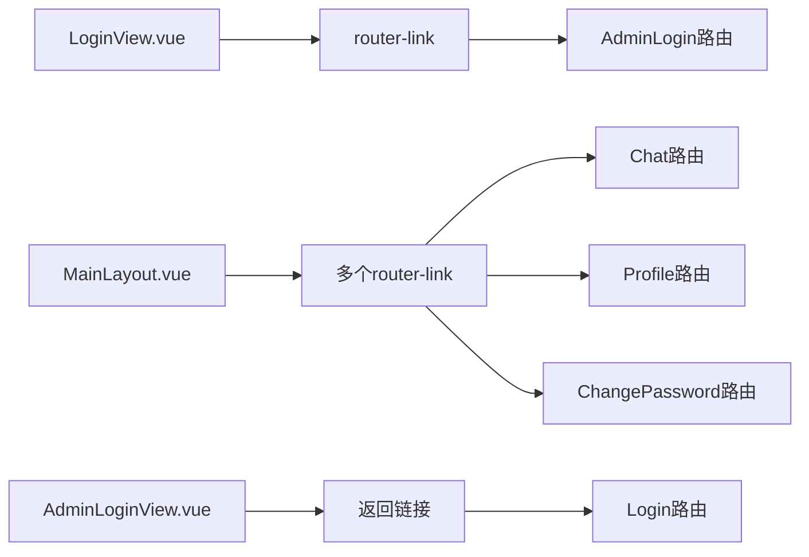

**图表来源**
- [views/LoginView.vue:63](file://frontend/ai_assistant/src/views/LoginView.vue#L63-L65)
- [layouts/MainLayout.vue:71-86](file://frontend/ai_assistant/src/layouts/MainLayout.vue#L71-L86)
- [views/AdminLoginView.vue:53](file://frontend/ai_assistant/src/views/AdminLoginView.vue#L53)

**章节来源**
- [views/LoginView.vue:63](file://frontend/ai_assistant/src/views/LoginView.vue#L63-L65)
- [layouts/MainLayout.vue:71-86](file://frontend/ai_assistant/src/layouts/MainLayout.vue#L71-L86)
- [views/AdminLoginView.vue:53](file://frontend/ai_assistant/src/views/AdminLoginView.vue#L53)

## 依赖关系分析

### 技术栈依赖

```mermaid
graph TB
subgraph "核心依赖"
Vue[Vue 3.4.21]
Router[Vue Router 4.3.0]
Pinia[Pinia 2.1.7]
end
subgraph "辅助依赖"
CryptoJS[CryptoJS 4.2.0]
Axios[Axios 1.6.8]
UUID[UUID 9.0.1]
Marked[Marked 12.0.1]
end
subgraph "开发依赖"
Vite[Vite 5.2.0]
PluginVue[@vitejs/plugin-vue 5.0.4]
end
Vue --> Router
Vue --> Pinia
Pinia --> CryptoJS
Router --> Axios
Vue --> Marked
```

**图表来源**
- [package.json:11-23](file://frontend/ai_assistant/package.json#L11-L23)

**章节来源**
- [package.json:11-23](file://frontend/ai_assistant/package.json#L11-L23)

### 组件间依赖关系

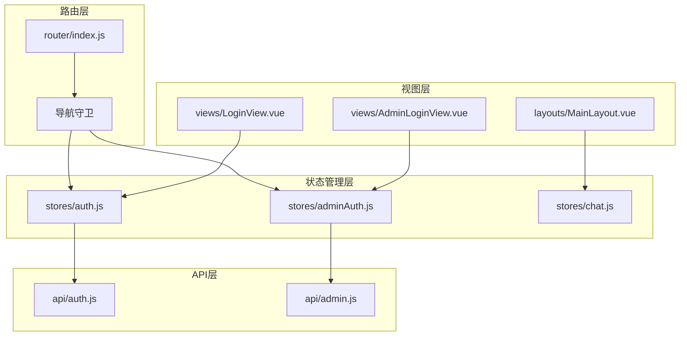

**图表来源**
- [router/index.js:1-75](file://frontend/ai_assistant/src/router/index.js#L1-L75)
- [stores/auth.js:1-77](file://frontend/ai_assistant/src/stores/auth.js#L1-L77)
- [stores/adminAuth.js:1-77](file://frontend/ai_assistant/src/stores/adminAuth.js#L1-L77)

**章节来源**
- [router/index.js:1-75](file://frontend/ai_assistant/src/router/index.js#L1-L75)

## 性能考虑

### 代码分割优化

#### 懒加载策略
- **按需加载**: 所有路由组件均采用动态导入
- **独立chunk**: 每个组件生成独立的代码块
- **首屏优化**: 减少初始包体积，提升加载速度

#### 缓存策略
- **浏览器缓存**: 静态资源利用浏览器缓存
- **组件缓存**: Vue Router内置组件缓存机制
- **状态持久化**: 认证状态存储在localStorage

### 内存管理

#### 状态清理
- **自动清理**: 组件卸载时自动清理相关状态
- **内存泄漏防护**: 合理的事件监听器管理
- **定时器清理**: 及时清理定时任务

### 网络优化

#### API调用优化
- **请求合并**: 合理的API调用频率控制
- **错误处理**: 完善的错误处理和重试机制
- **超时控制**: 合理的请求超时设置

## 故障排除指南

### 常见问题诊断

#### 路由重定向问题
**症状**: 用户被错误地重定向到登录页
**排查步骤**:
1. 检查认证状态是否正确
2. 验证localStorage中的token有效性
3. 确认路由元信息配置正确

#### 认证状态不同步
**症状**: 页面显示已登录但实际未认证
**解决方案**:
1. 检查store状态同步
2. 验证token过期时间
3. 确认加密算法一致性

#### 导航守卫失效
**症状**: 权限控制不生效
**排查方法**:
1. 检查beforeEach守卫逻辑
2. 验证路由元信息设置
3. 确认store实例正确注入

**章节来源**
- [stores/auth.js:19-26](file://frontend/ai_assistant/src/stores/auth.js#L19-L26)
- [stores/adminAuth.js:17-26](file://frontend/ai_assistant/src/stores/adminAuth.js#L17-L26)
- [router/index.js:58-73](file://frontend/ai_assistant/src/router/index.js#L58-L73)

### 调试技巧

#### 开发者工具使用
- **Vue DevTools**: 检查组件树和状态
- **Vue Router DevTools**: 跟踪路由变化
- **Network面板**: 监控API调用

#### 日志记录
- **路由事件**: 记录导航生命周期
- **状态变更**: 追踪store状态变化
- **错误日志**: 记录异常情况

## 结论

AI校园助手项目的路由系统设计体现了现代前端应用的最佳实践：

### 设计优势
1. **模块化架构**: 清晰的路由配置和状态管理分离
2. **权限控制**: 细粒度的路由权限控制机制
3. **性能优化**: 有效的代码分割和懒加载策略
4. **用户体验**: 流畅的导航体验和错误处理

### 技术亮点
- 基于Vue Router 4.x的现代化路由系统
- Pinia状态管理的组合式API设计
- 完整的认证和授权流程
- 响应式布局和移动端适配

### 改进建议
1. **路由预加载**: 对常用路由添加预加载策略
2. **错误边界**: 实现更完善的错误处理机制
3. **性能监控**: 添加路由性能指标监控
4. **测试覆盖**: 增加路由相关的单元测试

该路由系统为AI校园助手提供了稳定、高效、可维护的前端路由基础设施，为后续功能扩展奠定了良好的技术基础。