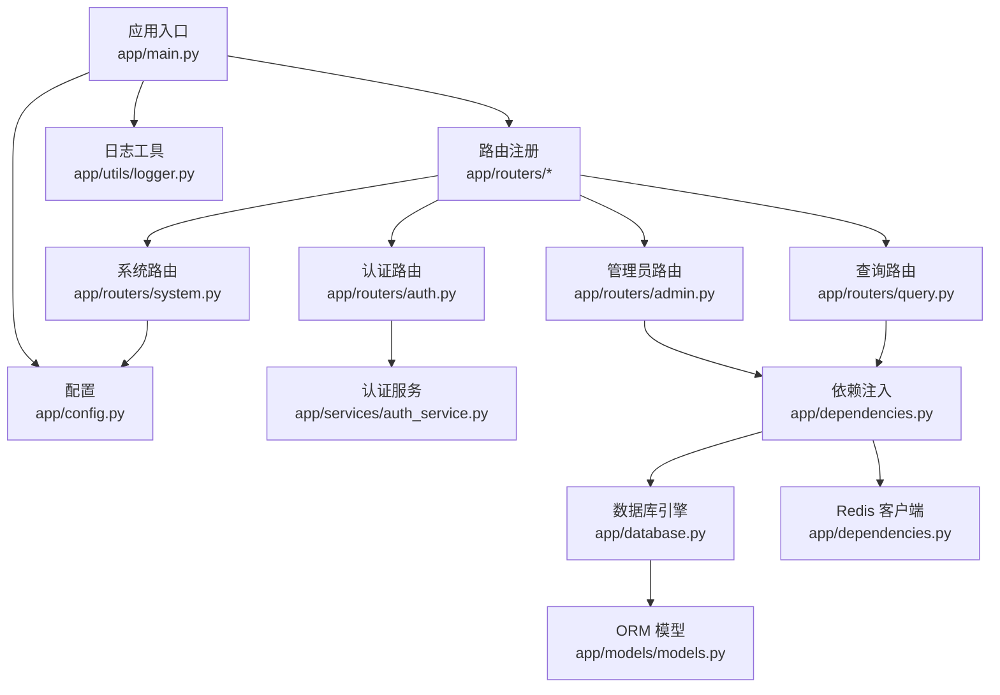
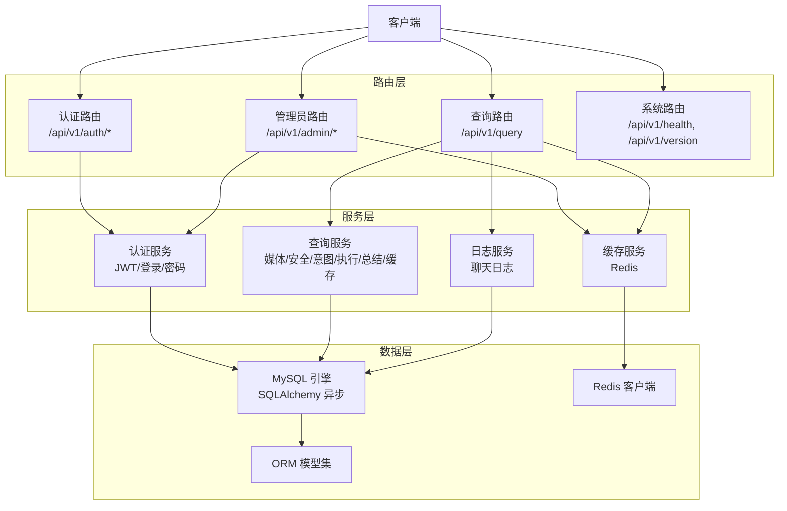
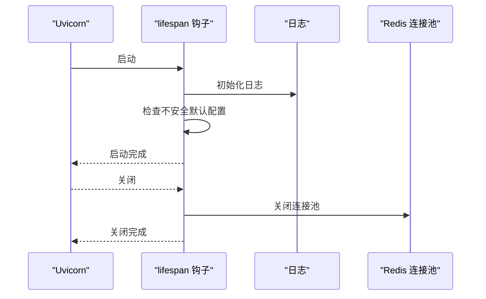
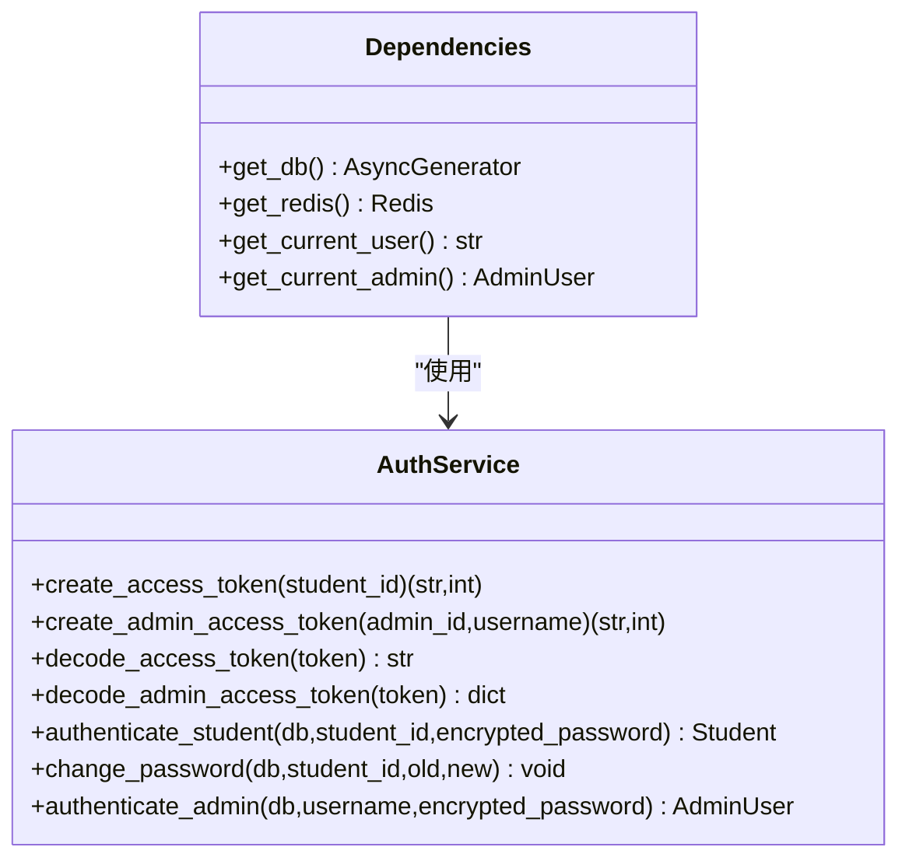
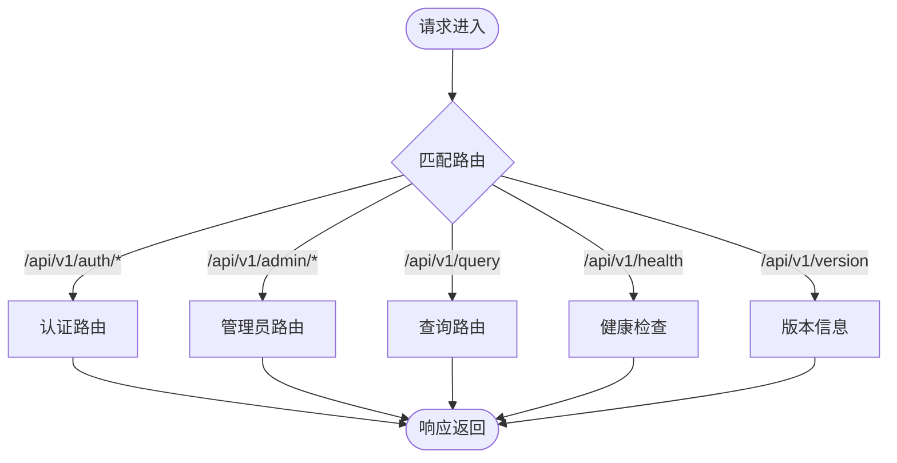
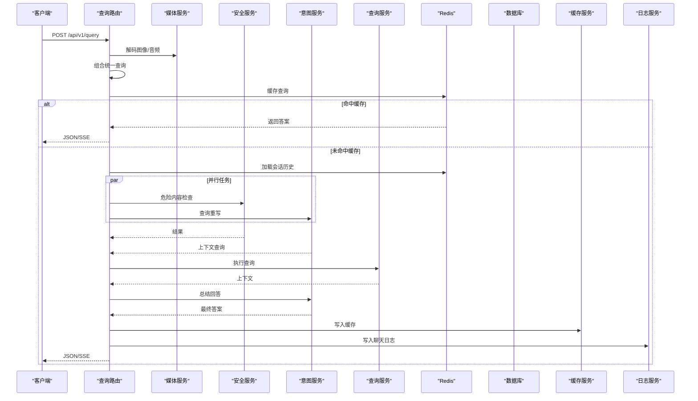
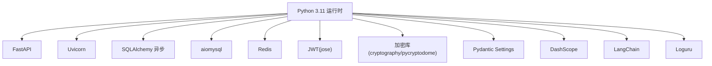

# 后端架构设计

<cite>
**本文档引用的文件**
- [main.py](file://service/ai_assistant/app/main.py)
- [config.py](file://service/ai_assistant/app/config.py)
- [database.py](file://service/ai_assistant/app/database.py)
- [dependencies.py](file://service/ai_assistant/app/dependencies.py)
- [models.py](file://service/ai_assistant/app/models/models.py)
- [auth.py](file://service/ai_assistant/app/routers/auth.py)
- [admin.py](file://service/ai_assistant/app/routers/admin.py)
- [query.py](file://service/ai_assistant/app/routers/query.py)
- [system.py](file://service/ai_assistant/app/routers/system.py)
- [auth_service.py](file://service/ai_assistant/app/services/auth_service.py)
- [logger.py](file://service/ai_assistant/app/utils/logger.py)
- [auth.py](file://service/ai_assistant/app/schemas/auth.py)
- [query.py](file://service/ai_assistant/app/schemas/query.py)
- [requirements.txt](file://service/ai_assistant/requirements.txt)
- [Dockerfile](file://service/ai_assistant/Dockerfile)
</cite>

## 目录
1. [引言](#引言)
2. [项目结构](#项目结构)
3. [核心组件](#核心组件)
4. [架构总览](#架构总览)
5. [详细组件分析](#详细组件分析)
6. [依赖关系分析](#依赖关系分析)
7. [性能考虑](#性能考虑)
8. [故障排查指南](#故障排查指南)
9. [结论](#结论)
10. [附录](#附录)

## 引言
本文件面向后端开发者，系统性阐述基于 FastAPI 的异步 Web 架构设计，覆盖应用初始化、中间件配置、路由系统、服务层架构、依赖注入、数据库连接管理、异步并发处理、错误处理、API 版本控制、文档生成与健康检查等基础设施。目标是帮助开发者快速理解并高效扩展 AI 校园助手后端。

## 项目结构
后端采用按功能域划分的目录组织方式，核心模块包括：
- 应用入口与生命周期：app/main.py
- 配置管理：app/config.py
- 数据库与ORM：app/database.py + app/models/models.py
- 依赖注入与认证：app/dependencies.py + app/services/auth_service.py
- 路由与控制器：app/routers/auth.py, admin.py, query.py, system.py
- 数据模型与枚举：app/models/models.py
- 请求/响应模型：app/schemas/auth.py, app/schemas/query.py
- 日志工具：app/utils/logger.py
- 运行时依赖与容器化：requirements.txt, Dockerfile



**图表来源**
- [main.py:52-86](file://service/ai_assistant/app/main.py#L52-L86)
- [config.py:6-113](file://service/ai_assistant/app/config.py#L6-L113)
- [database.py:7-35](file://service/ai_assistant/app/database.py#L7-L35)
- [dependencies.py:27-109](file://service/ai_assistant/app/dependencies.py#L27-L109)
- [models.py:22-660](file://service/ai_assistant/app/models/models.py#L22-L660)
- [auth.py:21-102](file://service/ai_assistant/app/routers/auth.py#L21-L102)
- [admin.py:48-388](file://service/ai_assistant/app/routers/admin.py#L48-L388)
- [query.py:46-788](file://service/ai_assistant/app/routers/query.py#L46-L788)
- [system.py:9-38](file://service/ai_assistant/app/routers/system.py#L9-L38)
- [auth_service.py:45-253](file://service/ai_assistant/app/services/auth_service.py#L45-L253)
- [logger.py:17-53](file://service/ai_assistant/app/utils/logger.py#L17-L53)

**章节来源**
- [main.py:1-86](file://service/ai_assistant/app/main.py#L1-L86)
- [config.py:1-113](file://service/ai_assistant/app/config.py#L1-L113)
- [database.py:1-35](file://service/ai_assistant/app/database.py#L1-L35)
- [dependencies.py:1-109](file://service/ai_assistant/app/dependencies.py#L1-L109)
- [models.py:1-660](file://service/ai_assistant/app/models/models.py#L1-L660)
- [auth.py:1-102](file://service/ai_assistant/app/routers/auth.py#L1-L102)
- [admin.py:1-388](file://service/ai_assistant/app/routers/admin.py#L1-L388)
- [query.py:1-788](file://service/ai_assistant/app/routers/query.py#L1-L788)
- [system.py:1-38](file://service/ai_assistant/app/routers/system.py#L1-L38)
- [auth_service.py:1-253](file://service/ai_assistant/app/services/auth_service.py#L1-L253)
- [logger.py:1-53](file://service/ai_assistant/app/utils/logger.py#L1-L53)

## 核心组件
- 应用入口与生命周期：定义 FastAPI 实例、CORS 中间件、路由注册、应用生命周期钩子（启动/关闭）、日志初始化与安全默认值检查。
- 配置管理：集中管理数据库、Redis、JWT、AES、LLM 模型、缓存 TTL、跨域等配置项，并提供数据库/Redis URL 生成与 CORS 来源解析。
- 数据库与 ORM：基于 SQLAlchemy 2.x 异步引擎与 async_sessionmaker，提供异步会话上下文管理与基础模型基类。
- 依赖注入：提供数据库会话、Redis 客户端、当前用户/管理员解析、JWT 解码等依赖，支持 FastAPI Depends 注入。
- 路由系统：按功能拆分认证、管理员、查询、系统健康检查四个路由模块，统一使用 APIRouter，前缀为 /api/v1。
- 服务层：认证服务（JWT 创建/验证、登录验证、密码修改）、查询流水线（媒体解码、安全检查、意图分类、查询执行、总结、缓存、日志）等。
- 数据模型：涵盖管理员、院系、专业、班级、教师、课程、教室、学生、选课、成绩、课表、调课、聊天日志等实体及索引约束。
- 请求/响应模型：Pydantic 模型定义登录、修改密码、查询请求与响应、意图类型等。
- 日志工具：基于 Loguru 的统一日志配置，控制台与文件双通道输出，自动旋转与保留策略。

**章节来源**
- [main.py:36-86](file://service/ai_assistant/app/main.py#L36-L86)
- [config.py:6-113](file://service/ai_assistant/app/config.py#L6-L113)
- [database.py:7-35](file://service/ai_assistant/app/database.py#L7-L35)
- [dependencies.py:27-109](file://service/ai_assistant/app/dependencies.py#L27-L109)
- [auth_service.py:45-253](file://service/ai_assistant/app/services/auth_service.py#L45-L253)
- [models.py:41-660](file://service/ai_assistant/app/models/models.py#L41-L660)
- [auth.py:4-56](file://service/ai_assistant/app/schemas/auth.py#L4-L56)
- [query.py:8-33](file://service/ai_assistant/app/schemas/query.py#L8-L33)
- [logger.py:17-53](file://service/ai_assistant/app/utils/logger.py#L17-L53)

## 架构总览
系统采用“路由层-服务层-数据层”三层架构，配合依赖注入与异步并发，实现高性能与可维护性。



**图表来源**
- [auth.py:21-102](file://service/ai_assistant/app/routers/auth.py#L21-L102)
- [admin.py:48-388](file://service/ai_assistant/app/routers/admin.py#L48-L388)
- [query.py:46-788](file://service/ai_assistant/app/routers/query.py#L46-L788)
- [system.py:9-38](file://service/ai_assistant/app/routers/system.py#L9-L38)
- [auth_service.py:125-253](file://service/ai_assistant/app/services/auth_service.py#L125-L253)
- [database.py:7-35](file://service/ai_assistant/app/database.py#L7-L35)
- [dependencies.py:27-109](file://service/ai_assistant/app/dependencies.py#L27-L109)
- [models.py:41-660](file://service/ai_assistant/app/models/models.py#L41-L660)

## 详细组件分析

### 应用初始化与生命周期
- 应用实例创建：设置标题、版本、描述、文档端点（/docs、/redoc），并启用 lifespan 钩子。
- 生命周期钩子：启动时检查不安全默认配置并记录告警；关闭时主动关闭 Redis 连接池。
- CORS 配置：允许来源可通过配置项动态设置，开发环境示例给出如何限制来源。
- 路由注册：集中注册认证、管理员、查询、系统路由。



**图表来源**
- [main.py:36-86](file://service/ai_assistant/app/main.py#L36-L86)
- [logger.py:17-53](file://service/ai_assistant/app/utils/logger.py#L17-L53)

**章节来源**
- [main.py:36-86](file://service/ai_assistant/app/main.py#L36-L86)
- [logger.py:17-53](file://service/ai_assistant/app/utils/logger.py#L17-L53)

### 配置管理
- 集中式配置：APP_NAME、APP_VERSION、DEBUG、CORS_ALLOW_ORIGINS、MySQL/Redis 连接参数、JWT、AES、隐私盐、对话上下文限制、DashScope/Bailian 配置、LLM 模型族、缓存 TTL 等。
- URL 生成：自动生成数据库与 Redis 连接 URL，支持带/不带密码的 Redis。
- CORS 解析：支持逗号分隔的多来源、通配符与空值处理。

**章节来源**
- [config.py:6-113](file://service/ai_assistant/app/config.py#L6-L113)

### 数据库与ORM
- 异步引擎：基于 SQLAlchemy 2.x 异步引擎，开启 pre_ping 与 recycle，DEBUG 下开启 echo。
- 会话工厂：async_sessionmaker 提供 AsyncSession，关闭时自动清理。
- 基类与上下文：Base 作为 ORM 基类，get_db 提供异步上下文管理器，确保异常时会话正确关闭。

**章节来源**
- [database.py:7-35](file://service/ai_assistant/app/database.py#L7-L35)

### 依赖注入与认证
- 数据库会话：get_db 依赖提供异步会话，确保每个请求作用域内复用。
- Redis 客户端：单例模式，延迟初始化，提供 get_redis 依赖。
- 当前用户：get_current_user 从 Authorization 头解析 JWT，返回 student_id。
- 当前管理员：get_current_admin 解析管理员 JWT，查询数据库校验状态与权限。
- 认证服务：create_access_token/create_admin_access_token/JWT 解码、authenticate_student/change_password/authenticate_admin。



**图表来源**
- [dependencies.py:27-109](file://service/ai_assistant/app/dependencies.py#L27-L109)
- [auth_service.py:45-253](file://service/ai_assistant/app/services/auth_service.py#L45-L253)

**章节来源**
- [dependencies.py:27-109](file://service/ai_assistant/app/dependencies.py#L27-L109)
- [auth_service.py:45-253](file://service/ai_assistant/app/services/auth_service.py#L45-L253)

### 路由系统与API版本控制
- 路由前缀：统一使用 /api/v1，便于未来版本演进。
- 认证路由：登录、修改密码。
- 管理员路由：登录、个人信息、仪表盘统计、元数据查询、课表列表、状态更新、审计日志。
- 查询路由：统一多模态查询端点，支持流式与JSON两种输出，内置安全检查、意图分类、查询执行、缓存与日志。
- 系统路由：健康检查、版本信息。



**图表来源**
- [auth.py:21-102](file://service/ai_assistant/app/routers/auth.py#L21-L102)
- [admin.py:48-388](file://service/ai_assistant/app/routers/admin.py#L48-L388)
- [query.py:46-788](file://service/ai_assistant/app/routers/query.py#L46-L788)
- [system.py:9-38](file://service/ai_assistant/app/routers/system.py#L9-L38)

**章节来源**
- [auth.py:21-102](file://service/ai_assistant/app/routers/auth.py#L21-L102)
- [admin.py:48-388](file://service/ai_assistant/app/routers/admin.py#L48-L388)
- [query.py:46-788](file://service/ai_assistant/app/routers/query.py#L46-L788)
- [system.py:9-38](file://service/ai_assistant/app/routers/system.py#L9-L38)

### 查询流水线与异步并发
- 输入预处理：多模态输入解码（图像/音频），构建统一查询文本。
- 缓存优先：基于 DID 与查询哈希的 Redis 缓存命中则直接返回。
- 历史加载：优先从 Redis 会话历史加载，失败则回退到数据库历史。
- 并发执行：安全检查与查询重写并行，缩短总耗时。
- 意图分类与执行：根据重写后的查询选择结构化/向量/混合/闲聊路径。
- 流式输出：SSE 流式返回，支持断点续传与进度反馈。
- 缓存与日志：流式结束后写入缓存与聊天日志，JSON 输出前回滚数据库会话避免长时间占用连接。



**图表来源**
- [query.py:207-745](file://service/ai_assistant/app/routers/query.py#L207-L745)
- [auth_service.py:125-253](file://service/ai_assistant/app/services/auth_service.py#L125-L253)

**章节来源**
- [query.py:207-745](file://service/ai_assistant/app/routers/query.py#L207-L745)

### 错误处理机制
- 路由层：对无效凭据、权限不足、资源不存在、输入非法等情况返回标准 HTTP 状态码与错误信息。
- 服务层：认证与密码修改使用专用异常类型，便于上层统一捕获与转换。
- 查询流水线：媒体解码失败、查询执行失败、回答生成失败均转换为 502 错误并返回可读提示。
- 日志：关键路径均记录 INFO/WARNING/ERROR 级别日志，便于追踪与审计。

**章节来源**
- [auth.py:42-101](file://service/ai_assistant/app/routers/auth.py#L42-L101)
- [admin.py:63-82](file://service/ai_assistant/app/routers/admin.py#L63-L82)
- [query.py:238-260](file://service/ai_assistant/app/routers/query.py#L238-L260)
- [auth_service.py:21-27](file://service/ai_assistant/app/services/auth_service.py#L21-L27)

### 数据模型与关系
- 实体覆盖：管理员、管理员操作日志、部门、专业、班级、教师、学期、课程、教室、学生、选课、成绩、课表、课表-班级映射、调课单、聊天日志等。
- 约束与索引：主键、唯一约束、外键、检查约束、复合索引等，保障数据一致性与查询效率。
- 关系映射：一对多/多对多关系通过 SQLAlchemy relationship 声明，支持懒加载与回溯。

```mermaid
erDiagram
ADMIN_USER {
bigint admin_id PK
string admin_code UK
string username UK
string password_hash
string display_name
enum role
enum status
datetime last_login_at
datetime created_at
datetime updated_at
}
ADMIN_ACTION_LOG {
bigint action_log_id PK
bigint admin_id FK
string action_type
string target_table
string target_pk
string reason
text before_json
text after_json
string request_ip
datetime created_at
}
DEPARTMENT {
string dept_id PK
string name UK
}
MAJOR {
string major_id PK
string name
string dept_id FK
}
CLASS {
string class_id PK
string name
string major_id FK
int grade
}
TEACHER {
string teacher_id PK
string name
string title
string dept_id FK
string phone
string email
string office_hours
string office_room
}
TERM {
string term_id PK
date start_date
date end_date
}
COURSE {
string course_id PK
string course_name
int credit
enum course_type
}
CLASSROOM {
string room_id PK
enum room_type
string location
int capacity
}
STUDENT {
string student_id PK
string name
string gender
date date_of_birth
smallint enroll_year
string class_id FK
string phone
string email
enum status
string password_hash
}
ENROLLMENT {
int enrollment_id PK
string student_id FK
string course_id FK
string term_id FK
}
SCORE {
int score_id PK
string student_id FK
string course_id FK
string term_id FK
int score
smallint credit_earned
smallint cheating
}
SCHEDULE {
string schedule_id PK
string course_id FK
string teacher_id FK
string room_id FK
string term_id FK
int week_no
small int day_of_week
int start_period
int end_period
string week_pattern
enum schedule_status
int version
bigint updated_by_admin_id FK
datetime updated_at
}
SCHEDULE_CLASS_MAP {
string schedule_id PK
string class_id PK
datetime created_at
bigint created_by_admin_id FK
}
SCHEDULE_ADJUSTMENT {
bigint adjustment_id PK
string schedule_id FK
string term_id FK
enum operation_type
enum status
int expected_schedule_version
int old_week_no
smallint old_day_of_week
int old_start_period
int old_end_period
string old_room_id
string old_teacher_id
int new_week_no
smallint new_day_of_week
int new_start_period
int new_end_period
string new_room_id
string new_teacher_id
bigint requested_by_admin_id FK
bigint approved_by_admin_id FK
datetime requested_at
datetime approved_at
datetime applied_at
bigint rollback_of_adjustment_id FK
text conflict_snapshot
}
CHAT_LOG {
bigint log_id PK
string did
string student_id
datetime timestamp
enum sender
text message_content
enum system_action
bigint response_time_ms
}
ADMIN_USER ||--o{ ADMIN_ACTION_LOG : "创建"
DEPARTMENT ||--o{ MAJOR : "拥有"
MAJOR ||--o{ CLASS : "拥有"
DEPARTMENT ||--o{ TEACHER : "拥有"
CLASS ||--o{ STUDENT : "拥有"
TERM ||--o{ ENROLLMENT : "包含"
COURSE ||--o{ ENROLLMENT : "包含"
TERM ||--o{ SCORE : "包含"
COURSE ||--o{ SCORE : "包含"
TERM ||--o{ SCHEDULE : "包含"
COURSE ||--o{ SCHEDULE : "包含"
TEACHER ||--o{ SCHEDULE : "拥有"
CLASSROOM ||--o{ SCHEDULE : "拥有"
SCHEDULE ||--o{ SCHEDULE_CLASS_MAP : "映射"
CLASS ||--o{ SCHEDULE_CLASS_MAP : "映射"
SCHEDULE ||--o{ SCHEDULE_ADJUSTMENT : "触发"
ADMIN_USER ||--o{ SCHEDULE_ADJUSTMENT : "申请/审批"
STUDENT ||--o{ CHAT_LOG : "产生"
```

**图表来源**
- [models.py:41-660](file://service/ai_assistant/app/models/models.py#L41-L660)

**章节来源**
- [models.py:41-660](file://service/ai_assistant/app/models/models.py#L41-L660)

### API版本控制、文档生成与健康检查
- 版本控制：所有业务路由统一使用 /api/v1 前缀，便于后续 /api/v2 迁移。
- 文档生成：启用 /docs（Swagger UI）与 /redoc（ReDoc），自动从路由注解与 Pydantic 模型生成。
- 健康检查：/api/v1/health 返回服务状态，/api/v1/version 返回应用名称与版本。

**章节来源**
- [main.py:52-62](file://service/ai_assistant/app/main.py#L52-L62)
- [system.py:22-37](file://service/ai_assistant/app/routers/system.py#L22-L37)

## 依赖关系分析
- 运行时依赖：FastAPI、Uvicorn、SQLAlchemy 异步、aiomysql、Redis、JWT、加密库、Pydantic Settings、DashScope、LangChain、Loguru 等。
- 容器化：Docker 多阶段构建，运行时包含 MariaDB 客户端与 ffmpeg，非 root 用户运行，暴露 8000 端口。



**图表来源**
- [requirements.txt:1-22](file://service/ai_assistant/requirements.txt#L1-L22)

**章节来源**
- [requirements.txt:1-22](file://service/ai_assistant/requirements.txt#L1-L22)
- [Dockerfile:1-49](file://service/ai_assistant/Dockerfile#L1-L49)

## 性能考虑
- 异步并发：查询路由中对安全检查与查询重写并行执行，减少端到端延迟。
- 连接池与超时：MySQL 引擎启用 pre_ping 与 recycle，避免僵尸连接；Redis 单例避免重复连接。
- 缓存策略：基于 DID 与查询哈希的 Redis 缓存，敏感与普通缓存区分 TTL，显著降低重复查询成本。
- SSE 流式：长连接期间尽早回滚数据库会话，避免长时间占用连接。
- 日志落盘：Loguru 控制台与文件双通道，异步写入，降低阻塞。

[本节为通用性能建议，无需特定文件引用]

## 故障排查指南
- 启动告警：若出现“不安全默认值”告警，检查 .env 中 JWT_SECRET_KEY、AES_SECRET_KEY、DID_SALT 是否已替换为强密钥。
- CORS 问题：确认 CORS_ALLOW_ORIGINS 设置正确，生产环境建议限制为具体域名。
- 数据库连接：检查数据库 URL 与凭据，观察 pre_ping 与 recycle 行为；必要时开启 DEBUG 查看 SQL。
- Redis 连接：确认 Redis 地址、密码与 DB 选择；注意连接池在关闭时会主动关闭。
- 认证失败：核对 JWT 密钥、算法与过期时间；检查管理员状态是否为 active。
- 查询异常：查看媒体解码、安全检查、意图分类、查询执行各阶段日志；必要时回退到数据库历史。
- 日志定位：统一通过 Loguru 输出，文件位于 logs 目录，按日期与大小轮转。

**章节来源**
- [main.py:25-49](file://service/ai_assistant/app/main.py#L25-L49)
- [config.py:85-113](file://service/ai_assistant/app/config.py#L85-L113)
- [database.py:7-12](file://service/ai_assistant/app/database.py#L7-L12)
- [dependencies.py:36-50](file://service/ai_assistant/app/dependencies.py#L36-L50)
- [auth_service.py:78-122](file://service/ai_assistant/app/services/auth_service.py#L78-L122)
- [logger.py:17-53](file://service/ai_assistant/app/utils/logger.py#L17-L53)

## 结论
本架构以 FastAPI 为核心，结合 SQLAlchemy 异步 ORM、Redis 缓存与完善的依赖注入体系，实现了高并发、可扩展、可观测的校园助手后端。通过清晰的路由分层、严格的错误处理与日志体系，开发者可以在此基础上快速迭代功能并保障稳定性。

## 附录
- 开发与部署建议：使用 .env 管理敏感配置；生产环境固定 CORS 来源；定期轮换 JWT 与 AES 密钥；监控数据库与 Redis 健康状态；启用日志轮转与告警。

[本节为通用建议，无需特定文件引用]