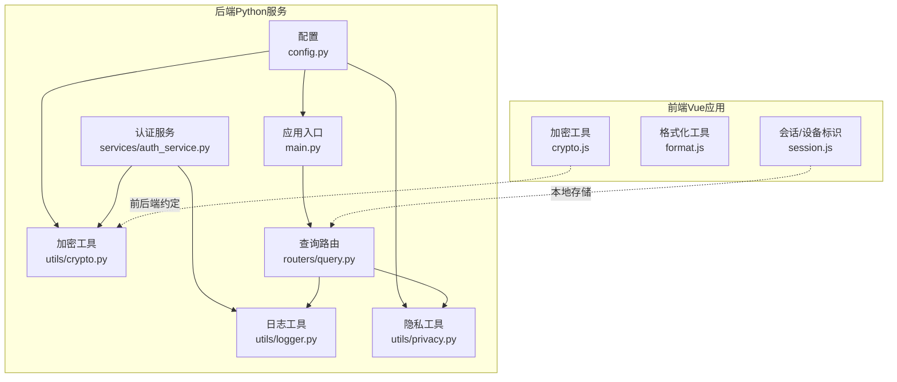
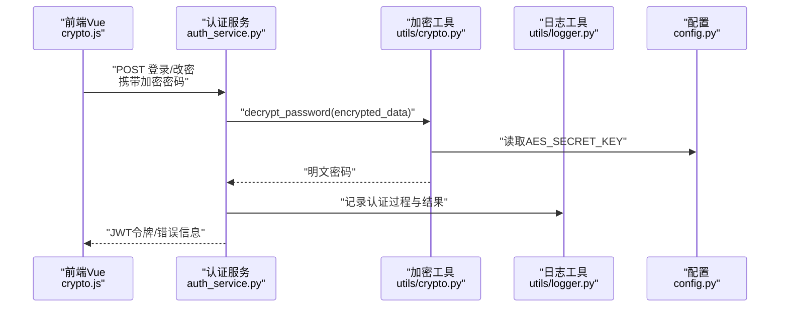
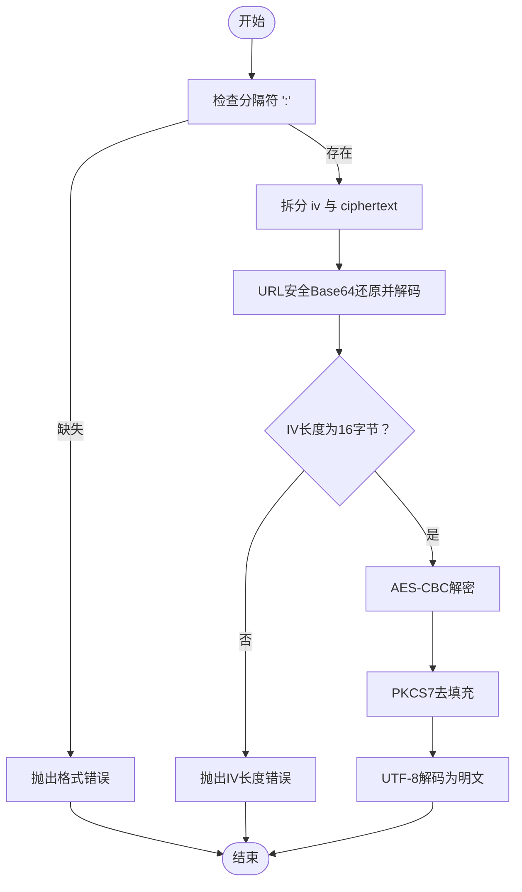
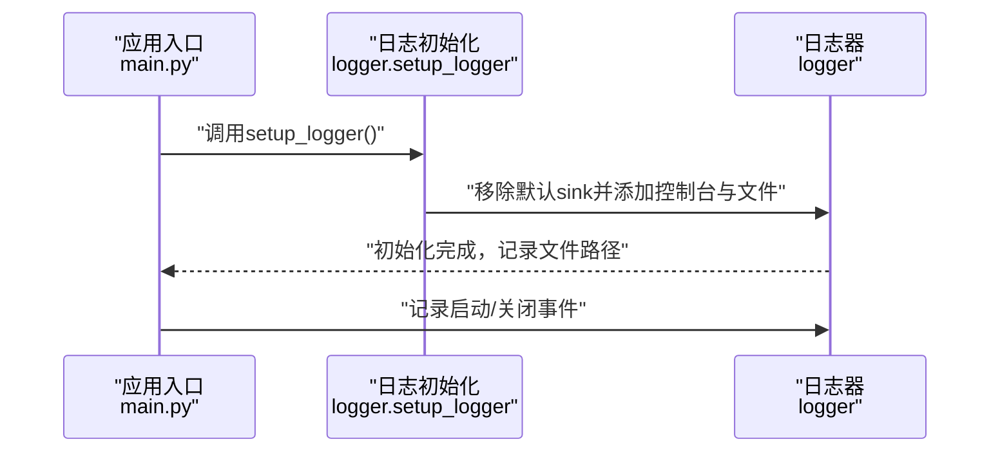
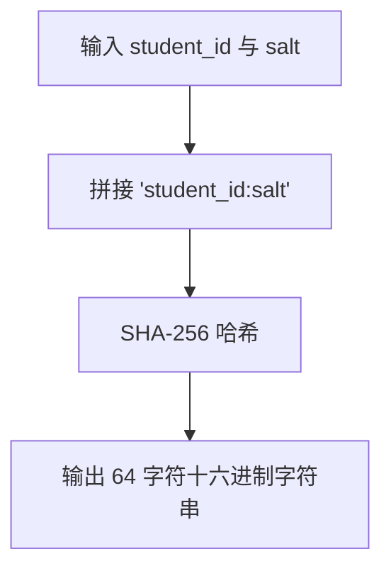
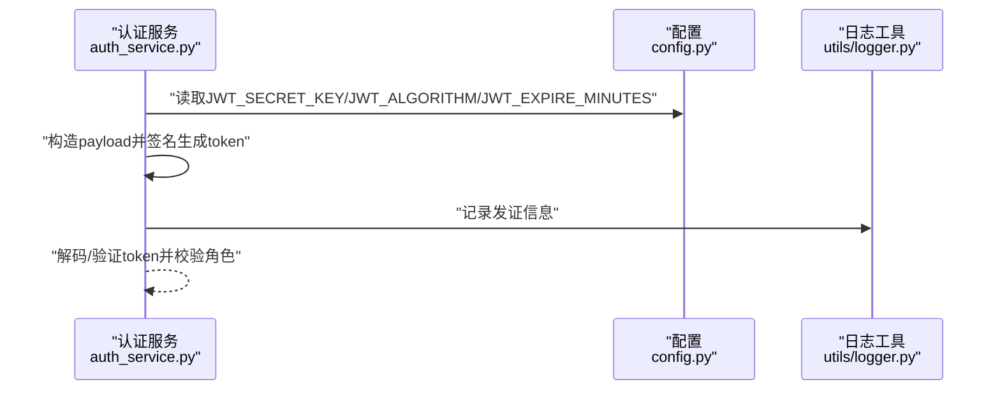
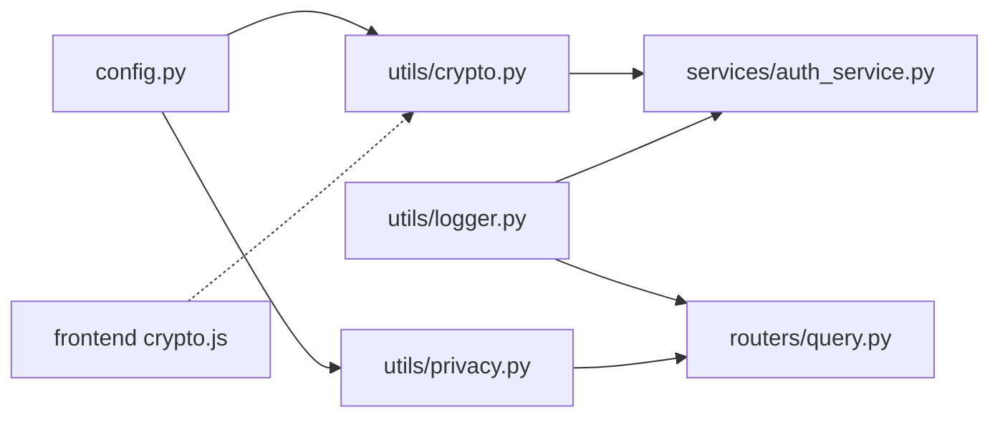

# 工具与实用程序

<cite>
**本文档引用的文件**
- [crypto.py](file://service/ai_assistant/app/utils/crypto.py)
- [logger.py](file://service/ai_assistant/app/utils/logger.py)
- [privacy.py](file://service/ai_assistant/app/utils/privacy.py)
- [config.py](file://service/ai_assistant/app/config.py)
- [auth_service.py](file://service/ai_assistant/app/services/auth_service.py)
- [query.py](file://service/ai_assistant/app/routers/query.py)
- [main.py](file://service/ai_assistant/app/main.py)
- [crypto.js](file://frontend/ai_assistant/src/utils/crypto.js)
- [format.js](file://frontend/ai_assistant/src/utils/format.js)
- [session.js](file://frontend/ai_assistant/src/utils/session.js)
</cite>

## 目录
1. [简介](#简介)
2. [项目结构](#项目结构)
3. [核心组件](#核心组件)
4. [架构总览](#架构总览)
5. [详细组件分析](#详细组件分析)
6. [依赖分析](#依赖分析)
7. [性能考量](#性能考量)
8. [故障排查指南](#故障排查指南)
9. [结论](#结论)
10. [附录](#附录)

## 简介
本章节概述AI校园助手项目中工具与实用程序模块的目标与范围，重点覆盖以下方面：
- 加密工具：基于AES-CBC的密码传输加密与解密，前后端一致的URL安全Base64编码格式，以及密钥长度校验与错误处理。
- 日志系统：统一的Loguru日志配置，控制台与文件双通道输出，按大小滚动与保留策略，以及全局初始化与幂等特性。
- 隐私保护工具：基于学生ID与盐值生成稳定的DID（去标识化ID），用于在聊天日志中替代真实学号，保障隐私可追溯但不暴露真实身份。
- JWT令牌处理：基于Pydantic设置的密钥与算法，创建与验证访问令牌，包含角色校验与过期时间控制。
- 前端配套：前端加密工具与会话/设备标识管理，确保与后端一致的密钥与编码规范。

## 项目结构
工具与实用程序主要分布在后端Python服务与前端Vue应用中：
- 后端Python服务（service/ai_assistant/app/utils/）：加密工具、日志工具、隐私工具。
- 后端业务层（service/ai_assistant/app/services/）：认证服务使用加密与日志工具。
- 后端路由层（service/ai_assistant/app/routers/）：查询路由使用隐私工具与日志工具。
- 前端Vue应用（frontend/ai_assistant/src/utils/）：加密工具、格式化工具、会话与设备标识管理。

**图表来源**
- [config.py:1-113](file://service/ai_assistant/app/config.py#L1-L113)
- [crypto.py:1-73](file://service/ai_assistant/app/utils/crypto.py#L1-L73)
- [logger.py:1-53](file://service/ai_assistant/app/utils/logger.py#L1-L53)
- [privacy.py:1-23](file://service/ai_assistant/app/utils/privacy.py#L1-L23)
- [auth_service.py:1-253](file://service/ai_assistant/app/services/auth_service.py#L1-L253)
- [query.py:1-788](file://service/ai_assistant/app/routers/query.py#L1-L788)
- [main.py:1-86](file://service/ai_assistant/app/main.py#L1-L86)
- [crypto.js:1-40](file://frontend/ai_assistant/src/utils/crypto.js#L1-L40)
- [format.js:1-67](file://frontend/ai_assistant/src/utils/format.js#L1-L67)
- [session.js:1-70](file://frontend/ai_assistant/src/utils/session.js#L1-L70)

**章节来源**
- [config.py:1-113](file://service/ai_assistant/app/config.py#L1-L113)
- [main.py:1-86](file://service/ai_assistant/app/main.py#L1-L86)

## 核心组件
本节对三大核心工具模块进行深入解析，并给出使用建议与最佳实践。

- 加密工具（AES-CBC）
  - 功能：从前端接收“iv_base64:ciphertext_base64”格式的URL安全Base64编码密文，使用配置中的共享密钥进行解密，返回明文密码。
  - 关键点：密钥长度校验（16/24/32字节）、URL安全编码还原与填充补齐、IV长度校验、解密与去填充异常处理。
  - 与前端约定：前端使用CryptoJS AES-CBC与PKCS7填充，输出格式与后端一致；密钥长度与算法需保持一致。
  - 使用场景：认证服务在登录/改密时解密前端传输的密码密文。
  - 错误处理：格式错误、IV长度不符、解密失败均抛出明确异常，便于上层捕获与提示。

- 日志系统（Loguru）
  - 功能：全局初始化日志器，同时输出到控制台与文件；文件按大小滚动与时间保留；统一格式包含时间、级别、位置与消息。
  - 关键点：幂等初始化、路径自动创建、UTF-8编码、异步入队（enqueue）提升性能。
  - 使用场景：所有服务与路由模块均可直接使用logger记录运行信息、警告与异常。
  - 性能：enqueue开启后避免阻塞主线程；rotation与retention减少单文件过大带来的IO压力。

- 隐私保护工具（DID生成）
  - 功能：基于学生ID与盐值生成稳定的SHA-256哈希作为DID，用于在聊天日志中替代真实学号。
  - 关键点：盐值来自配置，保证不同环境下的DID稳定性；同一学生始终生成相同DID，支持历史关联。
  - 使用场景：查询路由在构建缓存键与持久化日志时使用DID，避免泄露真实身份。
  - 合规性：DID为单向不可逆，满足最小化披露原则。

**章节来源**
- [crypto.py:1-73](file://service/ai_assistant/app/utils/crypto.py#L1-L73)
- [logger.py:1-53](file://service/ai_assistant/app/utils/logger.py#L1-L53)
- [privacy.py:1-23](file://service/ai_assistant/app/utils/privacy.py#L1-L23)
- [auth_service.py:1-253](file://service/ai_assistant/app/services/auth_service.py#L1-L253)
- [query.py:1-788](file://service/ai_assistant/app/routers/query.py#L1-L788)

## 架构总览
下图展示工具与实用程序在系统中的交互关系与调用链：

**图表来源**
- [auth_service.py:125-169](file://service/ai_assistant/app/services/auth_service.py#L125-L169)
- [crypto.py:39-72](file://service/ai_assistant/app/utils/crypto.py#L39-L72)
- [config.py:37-43](file://service/ai_assistant/app/config.py#L37-L43)
- [crypto.js:26-39](file://frontend/ai_assistant/src/utils/crypto.js#L26-L39)

## 详细组件分析

### 加密工具（AES-CBC）
- 实现要点
  - 密钥加载：从配置读取UTF-8编码的密钥字符串，长度必须为16/24/32字符。
  - URL安全Base64：还原“-”、“_”为“+”、“/”，补齐“=”后解码。
  - 解密流程：使用AES-CBC与PKCS7去填充，IV长度固定为16字节。
  - 错误处理：格式缺失分隔符、IV长度不符、解密失败均抛出明确异常。
- 复杂度与性能
  - 时间复杂度：O(n)，n为密文字节长度；解密与去填充均为线性。
  - 空间复杂度：O(n)。
  - 性能优化：使用pycryptodome底层加速；避免在热路径重复初始化cipher对象。
- 安全性
  - 密钥长度校验防止弱密钥；IV长度校验防止篡改。
  - 建议：密钥与盐值务必通过环境变量注入，禁止硬编码；定期轮换密钥。
- 使用建议
  - 前端与后端密钥一致；编码格式严格遵循“iv_base64:ciphertext_base64”。
  - 在认证服务中先解密再进行哈希比对，失败时记录日志并返回统一错误。

**图表来源**
- [crypto.py:39-72](file://service/ai_assistant/app/utils/crypto.py#L39-L72)

**章节来源**
- [crypto.py:1-73](file://service/ai_assistant/app/utils/crypto.py#L1-L73)
- [auth_service.py:125-169](file://service/ai_assistant/app/services/auth_service.py#L125-L169)
- [config.py:37-43](file://service/ai_assistant/app/config.py#L37-L43)
- [crypto.js:1-40](file://frontend/ai_assistant/src/utils/crypto.js#L1-L40)

### 日志系统（Loguru）
- 实现要点
  - 幂等初始化：首次导入即执行setup_logger，避免重复添加sink。
  - 输出目标：控制台INFO级别与文件DEBUG级别，文件按10MB滚动、保留14天。
  - 格式化：包含时间、级别、模块名、函数名、行号与消息。
  - 编码与异步：文件UTF-8编码，enqueue启用异步入队。
- 性能与可靠性
  - enqueue避免阻塞主线程；rotation与retention降低磁盘占用与IO压力。
  - 建议：生产环境根据吞吐量调整rotation大小与retention周期。
- 使用方式
  - 直接从utils/logger导入logger与setup_logger；在各模块中使用logger.info/warning/exception等方法。
  - 应用入口在lifespan中记录启动与关闭事件，便于运维监控。

**图表来源**
- [main.py:36-49](file://service/ai_assistant/app/main.py#L36-L49)
- [logger.py:17-46](file://service/ai_assistant/app/utils/logger.py#L17-L46)

**章节来源**
- [logger.py:1-53](file://service/ai_assistant/app/utils/logger.py#L1-L53)
- [main.py:1-86](file://service/ai_assistant/app/main.py#L1-L86)
- [auth_service.py:1-253](file://service/ai_assistant/app/services/auth_service.py#L1-L253)
- [query.py:1-788](file://service/ai_assistant/app/routers/query.py#L1-L788)

### 隐私保护工具（DID生成）
- 实现要点
  - 输入：学生ID与盐值（来自配置）。
  - 处理：拼接“student_id:salt”后进行SHA-256哈希，输出64字符十六进制字符串。
  - 用途：在聊天日志与缓存键中替代真实学号，保证可关联但不暴露身份。
- 复杂度与性能
  - 时间复杂度：O(n)，n为输入长度；哈希计算线性。
  - 空间复杂度：O(1)。
- 合规性与扩展
  - 单向不可逆，符合最小披露原则；盐值可跨环境稳定生成DID。
  - 扩展：若需要更强混淆，可在哈希前加入随机盐或使用blake2b等算法。

**图表来源**
- [privacy.py:9-22](file://service/ai_assistant/app/utils/privacy.py#L9-L22)

**章节来源**
- [privacy.py:1-23](file://service/ai_assistant/app/utils/privacy.py#L1-L23)
- [query.py:1-788](file://service/ai_assistant/app/routers/query.py#L1-L788)
- [config.py:42-43](file://service/ai_assistant/app/config.py#L42-L43)

### JWT令牌处理（认证服务）
- 实现要点
  - 创建：基于配置的密钥与算法，设置iat/exp等声明，返回令牌与过期秒数。
  - 验证：解码payload并校验角色与主体字段，失败抛出JWTError。
  - 与加密工具协作：登录时先解密密码，再进行哈希比对。
- 安全性
  - 密钥与算法来自配置，建议使用强密钥与HS256算法。
  - 过期时间可配置，建议结合刷新令牌策略。
- 使用建议
  - 在路由层使用依赖注入获取当前用户，确保权限控制。
  - 记录关键操作日志，便于审计与追踪。

**图表来源**
- [auth_service.py:45-123](file://service/ai_assistant/app/services/auth_service.py#L45-L123)
- [config.py:32-35](file://service/ai_assistant/app/config.py#L32-L35)

**章节来源**
- [auth_service.py:1-253](file://service/ai_assistant/app/services/auth_service.py#L1-L253)
- [config.py:32-35](file://service/ai_assistant/app/config.py#L32-L35)

### 前端配套工具
- 加密工具（crypto.js）
  - 使用CryptoJS AES-CBC与PKCS7填充，生成“iv_base64:ciphertext_base64”格式，URL安全Base64编码。
  - 密钥来自Vite环境变量，建议在部署时替换为强密钥。
- 格式化工具（format.js）
  - 提供时间、响应时间、截断、学号掩码、日期格式化等通用方法，便于UI展示。
- 会话与设备标识（session.js）
  - 生成会话ID与设备ID（did），通过localStorage持久化，支持会话列表管理与活跃会话切换。

**章节来源**
- [crypto.js:1-40](file://frontend/ai_assistant/src/utils/crypto.js#L1-L40)
- [format.js:1-67](file://frontend/ai_assistant/src/utils/format.js#L1-L67)
- [session.js:1-70](file://frontend/ai_assistant/src/utils/session.js#L1-L70)

## 依赖分析
- 组件耦合
  - 加密工具与配置紧密耦合，密钥与算法来自配置；认证服务依赖加密工具与日志工具。
  - 日志工具为全局单例，所有模块均可直接使用，降低传播成本。
  - 隐私工具依赖配置中的盐值，查询路由在缓存与日志中广泛使用DID。
- 外部依赖
  - pycryptodome（AES-CBC）、loguru（日志）、jose（JWT）、CryptoJS（前端加密）。
- 潜在风险
  - 若密钥或盐值泄露，DID与密码仍具备一定可恢复性；建议定期轮换并加强密钥管理。
  - 前端密钥通过环境变量注入，需确保构建产物不泄露。

**图表来源**
- [config.py:1-113](file://service/ai_assistant/app/config.py#L1-L113)
- [crypto.py:1-73](file://service/ai_assistant/app/utils/crypto.py#L1-L73)
- [privacy.py:1-23](file://service/ai_assistant/app/utils/privacy.py#L1-L23)
- [auth_service.py:1-253](file://service/ai_assistant/app/services/auth_service.py#L1-L253)
- [query.py:1-788](file://service/ai_assistant/app/routers/query.py#L1-L788)
- [crypto.js:1-40](file://frontend/ai_assistant/src/utils/crypto.js#L1-L40)

**章节来源**
- [config.py:1-113](file://service/ai_assistant/app/config.py#L1-L113)
- [auth_service.py:1-253](file://service/ai_assistant/app/services/auth_service.py#L1-L253)
- [query.py:1-788](file://service/ai_assistant/app/routers/query.py#L1-L788)

## 性能考量
- 加密工具
  - pycryptodome底层优化，解密为线性复杂度；建议在高频路径避免重复解密与哈希计算。
- 日志系统
  - enqueue异步入队显著降低阻塞；rotation与retention控制文件大小与数量，避免磁盘压力。
  - 建议：生产环境根据QPS调整rotation大小与日志级别，减少DEBUG日志量。
- 隐私工具
  - SHA-256哈希开销极低，DID生成可忽略不计；在高频写入场景中建议批量处理日志与缓存键。
- 前端工具
  - 加密与格式化均为轻量操作；注意避免在渲染循环中频繁调用大字符串处理函数。

[本节为通用性能讨论，无需特定文件来源]

## 故障排查指南
- 加密解密失败
  - 现象：抛出“无效的加密格式/IV长度不符/AES解密失败”等异常。
  - 排查：确认前端密钥与后端一致；检查Base64编码是否URL安全；核对分隔符与填充。
  - 参考：[crypto.py:39-72](file://service/ai_assistant/app/utils/crypto.py#L39-L72)
- JWT解码失败
  - 现象：抛出“token role mismatch/缺少主题声明/invalid admin id”等错误。
  - 排查：确认密钥与算法一致；检查令牌过期时间；核对角色与主体字段。
  - 参考：[auth_service.py:78-122](file://service/ai_assistant/app/services/auth_service.py#L78-L122)
- 日志未落盘或重复输出
  - 现象：仅控制台输出或文件未生成。
  - 排查：确认setup_logger已执行且幂等；检查日志目录权限与路径；确认未重复remove默认sink。
  - 参考：[logger.py:17-46](file://service/ai_assistant/app/utils/logger.py#L17-L46)
- DID不一致或为空
  - 现象：同一学生生成不同DID或为空。
  - 排查：确认salt配置正确；检查student_id输入；确保生成函数未被重写。
  - 参考：[privacy.py:9-22](file://service/ai_assistant/app/utils/privacy.py#L9-L22)
- 前端加密不匹配
  - 现象：后端无法解密前端加密数据。
  - 排查：确认Vite环境变量中的密钥；检查编码格式与填充方式；前后端版本一致。
  - 参考：[crypto.js:1-40](file://frontend/ai_assistant/src/utils/crypto.js#L1-L40)

**章节来源**
- [crypto.py:39-72](file://service/ai_assistant/app/utils/crypto.py#L39-L72)
- [auth_service.py:78-122](file://service/ai_assistant/app/services/auth_service.py#L78-L122)
- [logger.py:17-46](file://service/ai_assistant/app/utils/logger.py#L17-L46)
- [privacy.py:9-22](file://service/ai_assistant/app/utils/privacy.py#L9-L22)
- [crypto.js:1-40](file://frontend/ai_assistant/src/utils/crypto.js#L1-L40)

## 结论
本工具库围绕“安全、可观测、隐私”三大目标构建：
- 安全：前后端一致的AES-CBC加密与严格的密钥/IV校验，配合JWT令牌的角色与过期控制。
- 可观测：统一的日志配置与全局日志器，覆盖启动、运行与异常全流程。
- 隐私：稳定的DID生成机制，确保日志与缓存可关联但不暴露真实身份。
建议在生产环境中强化密钥管理、完善日志分级与保留策略，并持续评估性能与合规性。

[本节为总结性内容，无需特定文件来源]

## 附录
- 使用指南与扩展建议
  - 加密工具
    - 前后端密钥与算法保持一致；在认证服务中统一调用decrypt_password。
    - 扩展：支持多密钥轮换与动态密钥派生（如HKDF）。
  - 日志系统
    - 在业务关键路径记录INFO/WARNING/ERROR；避免在高频循环中记录大量DEBUG。
    - 扩展：增加结构化日志字段（trace_id、span_id）以便分布式追踪。
  - 隐私工具
    - DID仅用于非敏感关联；涉及敏感数据时建议额外脱敏或加盐。
    - 扩展：支持多种去标识化方案（如差分隐私扰动）。
  - JWT令牌
    - 建议引入刷新令牌与黑名单机制；定期轮换密钥。
  - 前端工具
    - 密钥通过环境变量注入；UI侧提供统一的错误提示与重试机制。

[本节为通用建议，无需特定文件来源]