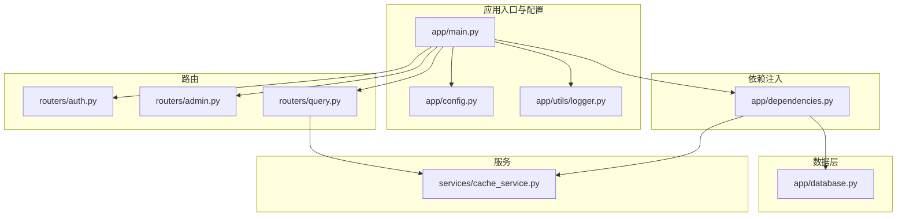
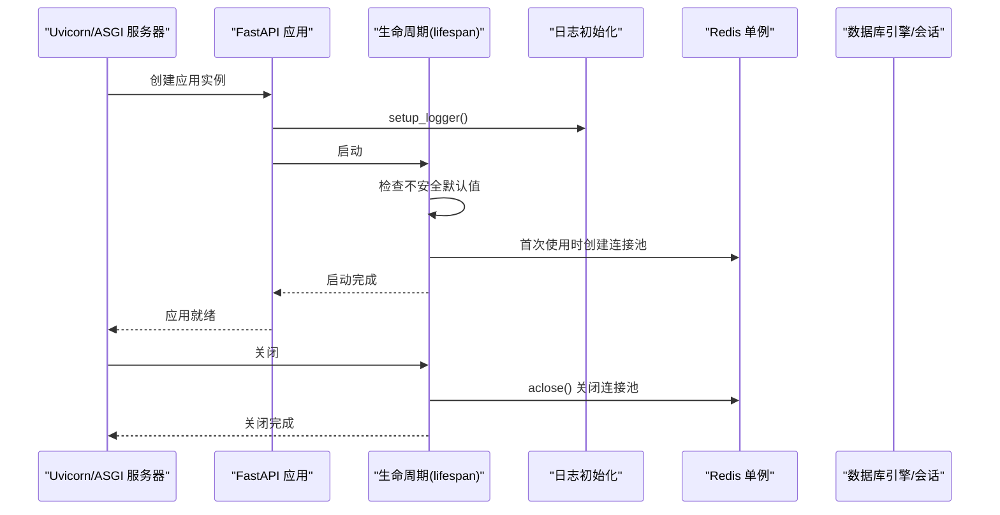
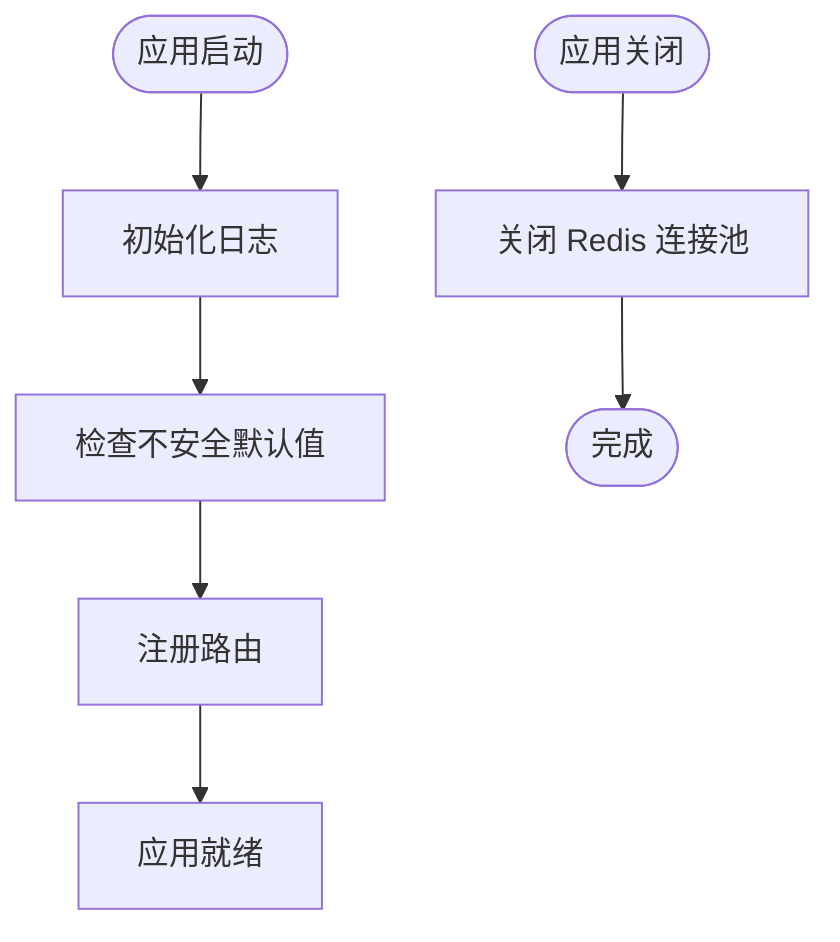
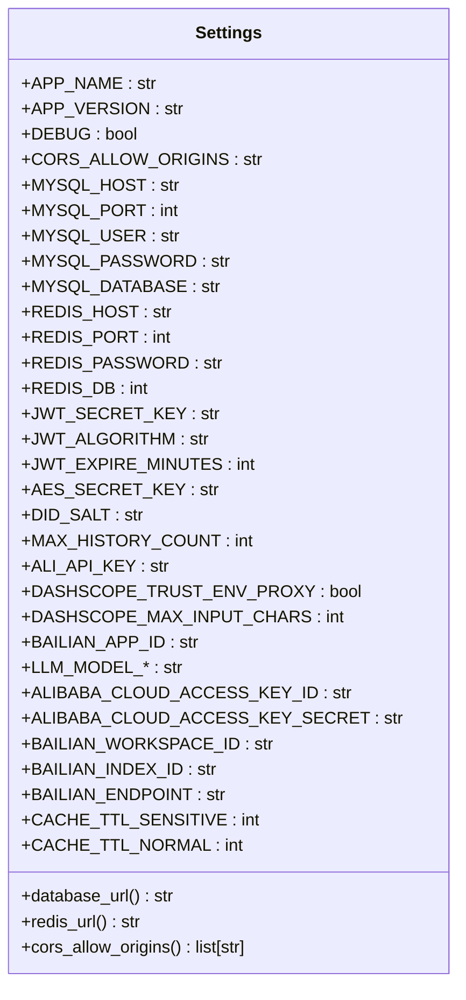
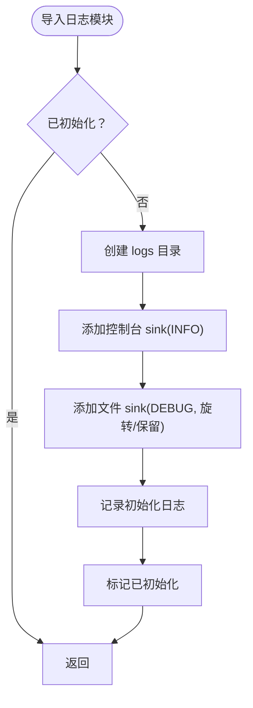
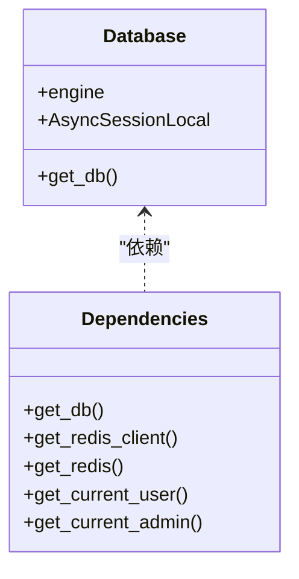
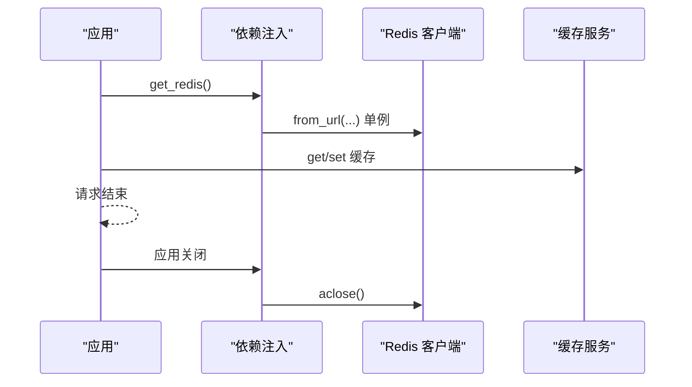
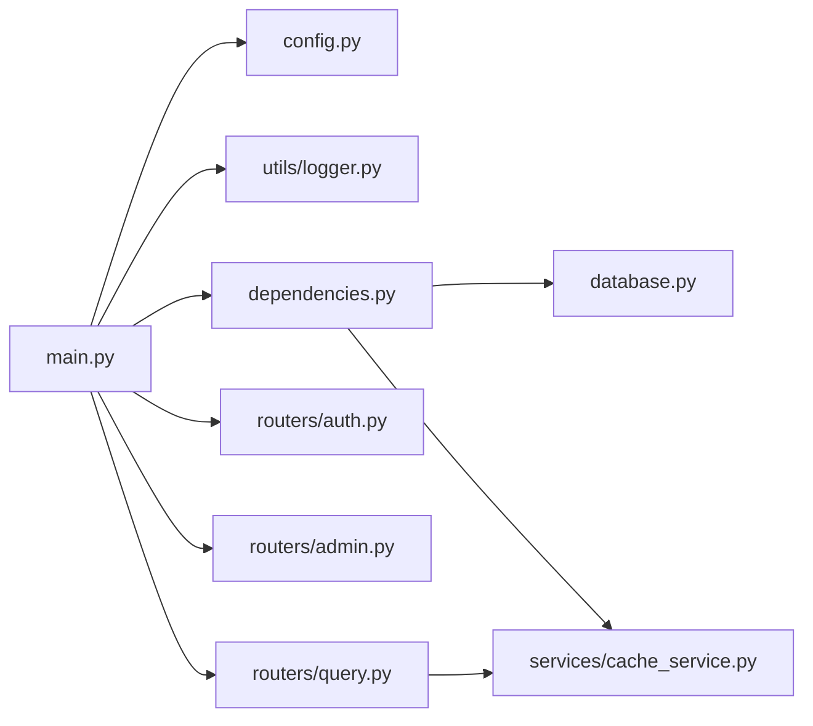

# 应用入口与配置

<cite>
**本文引用的文件**
- [main.py](file://service/ai_assistant/app/main.py)
- [config.py](file://service/ai_assistant/app/config.py)
- [database.py](file://service/ai_assistant/app/database.py)
- [dependencies.py](file://service/ai_assistant/app/dependencies.py)
- [logger.py](file://service/ai_assistant/app/utils/logger.py)
- [cache_service.py](file://service/ai_assistant/app/services/cache_service.py)
- [auth.py](file://service/ai_assistant/app/routers/auth.py)
- [admin.py](file://service/ai_assistant/app/routers/admin.py)
- [query.py](file://service/ai_assistant/app/routers/query.py)
- [requirements.txt](file://service/ai_assistant/requirements.txt)
</cite>

## 目录
1. [简介](#简介)
2. [项目结构](#项目结构)
3. [核心组件](#核心组件)
4. [架构总览](#架构总览)
5. [详细组件分析](#详细组件分析)
6. [依赖分析](#依赖分析)
7. [性能考虑](#性能考虑)
8. [故障排查指南](#故障排查指南)
9. [结论](#结论)
10. [附录](#附录)

## 简介
本章节面向开发者，系统性讲解 AI 校园助手项目的 FastAPI 应用入口与配置体系，重点覆盖：
- FastAPI 应用实例初始化流程与生命周期管理
- 配置系统设计（环境变量加载、安全默认值检查、日志系统初始化）
- 资源管理策略（数据库引擎与会话、Redis 连接池的创建与销毁）
- CORS 中间件配置与生产环境最佳实践
- 开发者可直接落地的配置与运维建议

## 项目结构
后端采用 FastAPI + SQLAlchemy Async + Redis 异步生态，按功能模块组织：
- 应用入口与配置：app/main.py、app/config.py、app/utils/logger.py
- 数据层：app/database.py、app/models/
- 依赖注入：app/dependencies.py
- 路由与业务：app/routers/ 下的各模块
- 缓存服务：app/services/cache_service.py
- 前端：frontend/ai_assistant（Vue3 + Vite）

图表来源
- [main.py:1-86](file://service/ai_assistant/app/main.py#L1-L86)
- [config.py:1-113](file://service/ai_assistant/app/config.py#L1-L113)
- [database.py:1-35](file://service/ai_assistant/app/database.py#L1-L35)
- [dependencies.py:1-109](file://service/ai_assistant/app/dependencies.py#L1-L109)
- [logger.py:1-53](file://service/ai_assistant/app/utils/logger.py#L1-L53)
- [cache_service.py:1-177](file://service/ai_assistant/app/services/cache_service.py#L1-L177)
- [auth.py:1-102](file://service/ai_assistant/app/routers/auth.py#L1-L102)
- [admin.py:1-388](file://service/ai_assistant/app/routers/admin.py#L1-L388)
- [query.py:1-788](file://service/ai_assistant/app/routers/query.py#L1-L788)

章节来源
- [main.py:1-86](file://service/ai_assistant/app/main.py#L1-L86)
- [config.py:1-113](file://service/ai_assistant/app/config.py#L1-L113)
- [database.py:1-35](file://service/ai_assistant/app/database.py#L1-L35)
- [dependencies.py:1-109](file://service/ai_assistant/app/dependencies.py#L1-L109)
- [logger.py:1-53](file://service/ai_assistant/app/utils/logger.py#L1-L53)
- [cache_service.py:1-177](file://service/ai_assistant/app/services/cache_service.py#L1-L177)
- [auth.py:1-102](file://service/ai_assistant/app/routers/auth.py#L1-L102)
- [admin.py:1-388](file://service/ai_assistant/app/routers/admin.py#L1-L388)
- [query.py:1-788](file://service/ai_assistant/app/routers/query.py#L1-L788)

## 核心组件
- 应用入口与生命周期：在应用初始化时完成日志初始化、安全默认值检查，并通过 lifespan 管理 Redis 连接池的创建与销毁。
- 配置系统：基于 Pydantic Settings 的 Settings 类，支持 .env 文件加载、URL 构造属性、CORS 来源解析。
- 日志系统：Loguru 初始化，控制台与文件双通道，幂等配置。
- 数据库与依赖注入：异步 SQLAlchemy 引擎与会话工厂；Redis 客户端单例；认证与权限依赖。
- 缓存服务：基于 Redis 的查询结果缓存，含敏感度与课表版本控制。

章节来源
- [main.py:36-50](file://service/ai_assistant/app/main.py#L36-L50)
- [config.py:6-113](file://service/ai_assistant/app/config.py#L6-L113)
- [logger.py:17-47](file://service/ai_assistant/app/utils/logger.py#L17-L47)
- [database.py:7-20](file://service/ai_assistant/app/database.py#L7-L20)
- [dependencies.py:27-51](file://service/ai_assistant/app/dependencies.py#L27-L51)
- [cache_service.py:49-177](file://service/ai_assistant/app/services/cache_service.py#L49-L177)

## 架构总览
应用启动时序与资源管理如下：

图表来源
- [main.py:16-50](file://service/ai_assistant/app/main.py#L16-L50)
- [dependencies.py:36-51](file://service/ai_assistant/app/dependencies.py#L36-L51)

章节来源
- [main.py:52-86](file://service/ai_assistant/app/main.py#L52-L86)
- [dependencies.py:36-51](file://service/ai_assistant/app/dependencies.py#L36-L51)

## 详细组件分析

### FastAPI 应用初始化与生命周期
- 应用实例创建：设置标题、版本、文档路径、生命周期回调。
- CORS 中间件：允许来源、凭证、方法与头均可通配，生产环境建议限定来源。
- 路由注册：认证、管理员、查询、系统相关路由。
- 生命周期管理：启动时检查不安全默认值；关闭时关闭 Redis 连接池。

图表来源
- [main.py:16-86](file://service/ai_assistant/app/main.py#L16-L86)

章节来源
- [main.py:52-86](file://service/ai_assistant/app/main.py#L52-L86)

### 配置管理系统
- 环境变量加载：通过 SettingsConfigDict 指定 .env 文件与编码，忽略未知字段。
- 安全默认值检查：对关键密钥与盐值进行不安全默认值告警。
- URL 构造：数据库与 Redis URL 属性，支持带/不带密码的连接串。
- CORS 来源解析：支持逗号分隔、通配符与空值处理。
- 默认值与敏感项：MySQL/Redis/JWT/AES/DID 等均在 Settings 中集中定义。

图表来源
- [config.py:6-113](file://service/ai_assistant/app/config.py#L6-L113)

章节来源
- [config.py:6-113](file://service/ai_assistant/app/config.py#L6-L113)

### 日志系统初始化
- 幂等初始化：避免重复配置，首次导入即初始化。
- 输出目标：控制台 INFO 级别与文件 DEBUG 级别，文件滚动与保留策略。
- 路径定位：自动定位项目根目录下的 logs 目录。

图表来源
- [logger.py:17-47](file://service/ai_assistant/app/utils/logger.py#L17-L47)

章节来源
- [logger.py:17-47](file://service/ai_assistant/app/utils/logger.py#L17-L47)

### 数据库与依赖注入
- 异步引擎：启用 pre_ping 与连接回收，DEBUG 时开启 SQL 回显。
- 会话工厂：非自动提交/刷新，避免过早释放连接。
- 依赖注入：数据库会话、Redis 客户端单例、JWT 当前用户与管理员解析。

图表来源
- [database.py:7-35](file://service/ai_assistant/app/database.py#L7-L35)
- [dependencies.py:27-109](file://service/ai_assistant/app/dependencies.py#L27-L109)

章节来源
- [database.py:7-35](file://service/ai_assistant/app/database.py#L7-L35)
- [dependencies.py:27-109](file://service/ai_assistant/app/dependencies.py#L27-L109)

### Redis 连接池与资源管理
- 单例客户端：首次使用时创建，复用连接池。
- 生命周期关闭：应用关闭时调用 aclose() 归还连接池。
- 缓存服务：键命名空间、TTL、敏感度与课表版本控制。

图表来源
- [dependencies.py:36-51](file://service/ai_assistant/app/dependencies.py#L36-L51)
- [cache_service.py:49-177](file://service/ai_assistant/app/services/cache_service.py#L49-L177)
- [main.py:43-49](file://service/ai_assistant/app/main.py#L43-L49)

章节来源
- [dependencies.py:36-51](file://service/ai_assistant/app/dependencies.py#L36-L51)
- [cache_service.py:49-177](file://service/ai_assistant/app/services/cache_service.py#L49-L177)
- [main.py:43-49](file://service/ai_assistant/app/main.py#L43-L49)

### CORS 中间件与生产环境建议
- 当前配置：允许来源、凭证、方法与头均可通配，便于开发调试。
- 生产建议：限定 allow_origins 为前端域名，避免通配符带来的跨域风险。

章节来源
- [main.py:70-76](file://service/ai_assistant/app/main.py#L70-L76)
- [config.py:102-110](file://service/ai_assistant/app/config.py#L102-L110)

### 路由与认证集成
- 认证路由：登录、修改密码，依赖当前用户解析。
- 管理员路由：登录、个人信息、仪表盘统计、课表列表与状态更新，依赖管理员解析与 Redis。
- 查询路由：统一多模态输入，安全检查、意图分类、缓存、流式输出，依赖当前用户、数据库与 Redis。

章节来源
- [auth.py:24-102](file://service/ai_assistant/app/routers/auth.py#L24-L102)
- [admin.py:57-388](file://service/ai_assistant/app/routers/admin.py#L57-L388)
- [query.py:207-788](file://service/ai_assistant/app/routers/query.py#L207-L788)

## 依赖分析
- 应用入口依赖配置与日志，间接依赖依赖注入与路由。
- 依赖注入依赖配置、数据库与缓存服务。
- 路由依赖依赖注入与服务层，查询路由尤为复杂，贯穿多服务。

图表来源
- [main.py:12-14](file://service/ai_assistant/app/main.py#L12-L14)
- [dependencies.py:13-16](file://service/ai_assistant/app/dependencies.py#L13-L16)
- [query.py:30-44](file://service/ai_assistant/app/routers/query.py#L30-L44)

章节来源
- [main.py:12-14](file://service/ai_assistant/app/main.py#L12-L14)
- [dependencies.py:13-16](file://service/ai_assistant/app/dependencies.py#L13-L16)
- [query.py:30-44](file://service/ai_assistant/app/routers/query.py#L30-L44)

## 性能考虑
- 连接池与回滚：在流式输出前主动回滚数据库会话，避免长时间占用连接。
- 并发任务：查询流程中对安全检查与意图重写并行执行，缩短总耗时。
- 缓存策略：敏感与普通查询采用不同 TTL，课表相关查询结合版本号失效，兼顾一致性与性能。
- Redis 单例：减少连接开销，配合生命周期统一关闭。

章节来源
- [query.py:654-658](file://service/ai_assistant/app/routers/query.py#L654-L658)
- [query.py:347-352](file://service/ai_assistant/app/routers/query.py#L347-L352)
- [cache_service.py:85-177](file://service/ai_assistant/app/services/cache_service.py#L85-L177)
- [dependencies.py:36-51](file://service/ai_assistant/app/dependencies.py#L36-L51)

## 故障排查指南
- 不安全默认值告警：若看到相关警告，立即在 .env 中替换对应密钥与盐值。
- Redis 连接异常：确认 REDIS_HOST/PORT/PASSWORD/DB 配置正确；查看日志中 Redis 失败与回退到数据库历史的记录。
- CORS 跨域问题：生产环境需将 allow_origins 限定为前端域名。
- 数据库连接问题：检查 MySQL 地址、端口、账号与密码；DEBUG 模式下可在日志中观察 SQL 语句。
- 流式输出中断：关注 SSE 生成器异常与公共错误映射，必要时切换 JSON 输出模式。

章节来源
- [main.py:25-34](file://service/ai_assistant/app/main.py#L25-L34)
- [query.py:280-313](file://service/ai_assistant/app/routers/query.py#L280-L313)
- [query.py:740-744](file://service/ai_assistant/app/routers/query.py#L740-L744)
- [config.py:26-31](file://service/ai_assistant/app/config.py#L26-L31)
- [config.py:102-110](file://service/ai_assistant/app/config.py#L102-L110)

## 结论
本项目以清晰的模块划分与完善的生命周期管理为基础，实现了从配置加载、日志初始化、数据库与 Redis 资源管理到路由与业务服务的完整闭环。生产部署时应重点关注 CORS 限制、密钥安全与缓存一致性策略，以获得稳定、高性能的服务体验。

## 附录
- 依赖清单：见 requirements.txt，包含 FastAPI、SQLAlchemy Async、Redis、Pydantic Settings、Loguru 等关键依赖。

章节来源
- [requirements.txt:1-22](file://service/ai_assistant/requirements.txt#L1-L22)