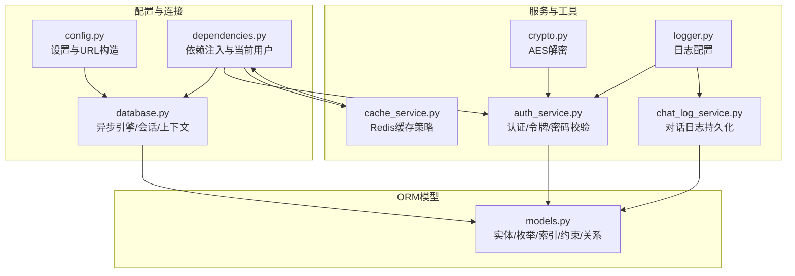
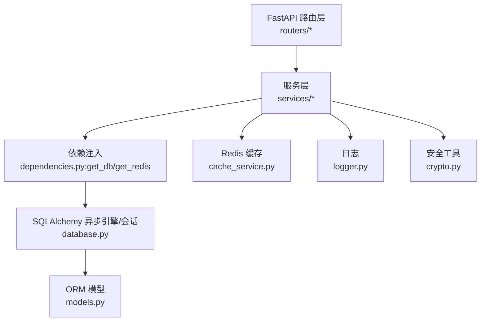
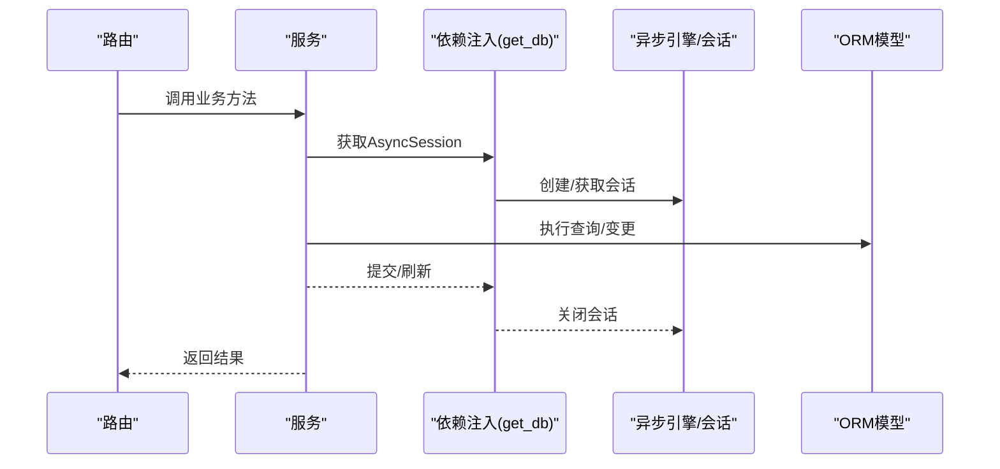
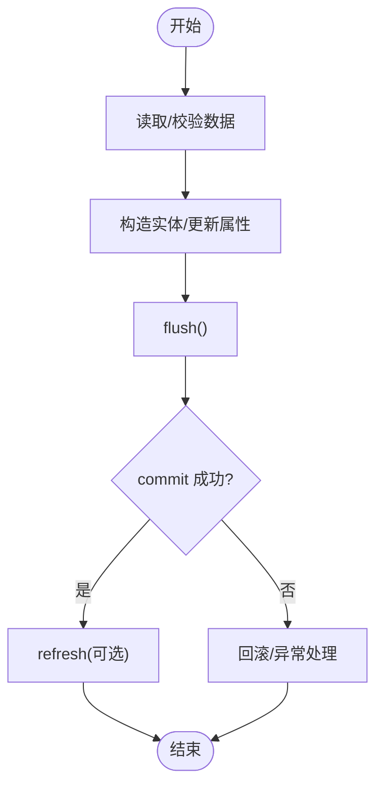
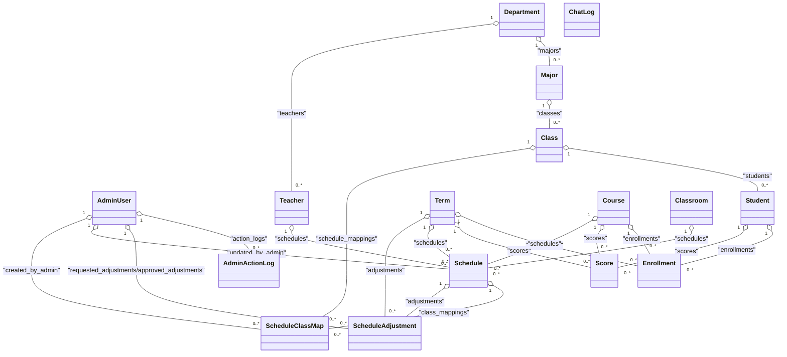
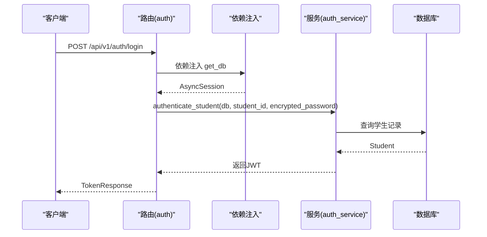
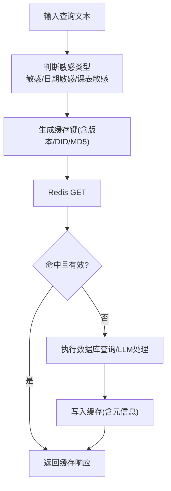
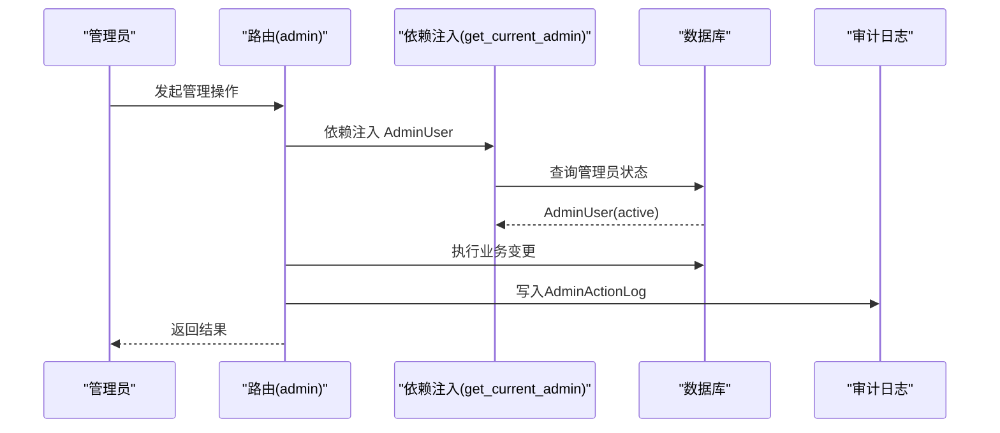
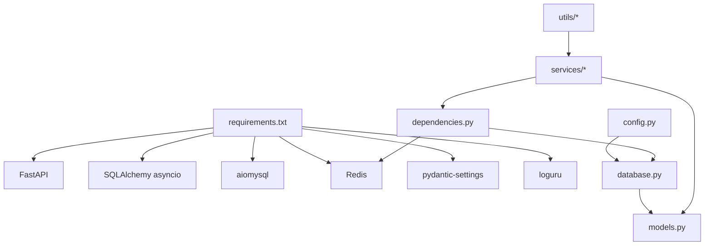

# 数据访问层

<cite>
**本文引用的文件**
- [database.py](file://service/ai_assistant/app/database.py)
- [models.py](file://service/ai_assistant/app/models/models.py)
- [dependencies.py](file://service/ai_assistant/app/dependencies.py)
- [config.py](file://service/ai_assistant/app/config.py)
- [main.py](file://service/ai_assistant/app/main.py)
- [auth.py](file://service/ai_assistant/app/routers/auth.py)
- [auth_service.py](file://service/ai_assistant/app/services/auth_service.py)
- [cache_service.py](file://service/ai_assistant/app/services/cache_service.py)
- [chat_log_service.py](file://service/ai_assistant/app/services/chat_log_service.py)
- [crypto.py](file://service/ai_assistant/app/utils/crypto.py)
- [logger.py](file://service/ai_assistant/app/utils/logger.py)
- [requirements.txt](file://service/ai_assistant/requirements.txt)
</cite>

## 目录
1. [引言](#引言)
2. [项目结构](#项目结构)
3. [核心组件](#核心组件)
4. [架构总览](#架构总览)
5. [详细组件分析](#详细组件分析)
6. [依赖关系分析](#依赖关系分析)
7. [性能考量](#性能考量)
8. [故障排查指南](#故障排查指南)
9. [结论](#结论)
10. [附录](#附录)

## 引言
本章节面向AI校园助手项目的“数据访问层”，系统化阐述基于SQLAlchemy的ORM模型设计与实现，覆盖数据库连接管理、会话生命周期、事务处理策略；解释数据模型定义、关系映射与约束配置；说明依赖注入机制、数据库连接池管理与异步数据库操作；介绍数据访问模式、查询优化与缓存策略；并给出数据安全、权限控制与审计日志的设计要点及性能优化建议。

## 项目结构
数据访问层主要由以下模块构成：
- 配置与连接：应用配置、数据库URL构造、异步引擎与会话工厂、会话上下文管理器
- ORM模型：完整的实体模型、枚举类型、索引与约束、关系映射
- 依赖注入：数据库会话依赖、Redis客户端依赖、当前用户与管理员解析
- 服务层：认证服务、缓存服务、对话日志服务等对数据层的封装
- 工具与日志：密码解密工具、统一日志配置

**图表来源**
- [config.py:85-101](file://service/ai_assistant/app/config.py#L85-L101)
- [database.py:7-35](file://service/ai_assistant/app/database.py#L7-L35)
- [models.py:41-660](file://service/ai_assistant/app/models/models.py#L41-L660)
- [dependencies.py:27-109](file://service/ai_assistant/app/dependencies.py#L27-L109)
- [auth_service.py:125-253](file://service/ai_assistant/app/services/auth_service.py#L125-L253)
- [cache_service.py:49-177](file://service/ai_assistant/app/services/cache_service.py#L49-L177)
- [chat_log_service.py:14-76](file://service/ai_assistant/app/services/chat_log_service.py#L14-L76)
- [crypto.py:39-73](file://service/ai_assistant/app/utils/crypto.py#L39-L73)
- [logger.py:17-53](file://service/ai_assistant/app/utils/logger.py#L17-L53)

**章节来源**
- [config.py:6-113](file://service/ai_assistant/app/config.py#L6-L113)
- [database.py:1-35](file://service/ai_assistant/app/database.py#L1-L35)
- [models.py:1-660](file://service/ai_assistant/app/models/models.py#L1-L660)
- [dependencies.py:1-109](file://service/ai_assistant/app/dependencies.py#L1-L109)
- [requirements.txt:1-22](file://service/ai_assistant/requirements.txt#L1-L22)

## 核心组件
- 异步数据库引擎与会话工厂
  - 使用异步驱动创建引擎，启用连接预检与回收，按配置开启SQL回显
  - 会话工厂配置为非自动提交、非自动刷新、关闭提交时过期，减少ORM状态混乱
- ORM基类与模型
  - 统一的DeclarativeBase子类，所有模型继承
  - 模型内定义主键、字段类型、枚举、唯一/检查/复合索引、外键与关系
- 依赖注入
  - get_db提供异步上下文管理器，确保会话创建与关闭
  - get_redis提供Redis单例客户端，支持生命周期内复用
  - get_current_user/get_current_admin解析JWT并从数据库加载当前用户
- 日志与安全
  - 使用Loguru统一日志输出，落地到文件
  - AES解密用于密码传输安全，配合JWT令牌与角色控制

**章节来源**
- [database.py:7-35](file://service/ai_assistant/app/database.py#L7-L35)
- [models.py:23-24](file://service/ai_assistant/app/models/models.py#L23-L24)
- [dependencies.py:27-109](file://service/ai_assistant/app/dependencies.py#L27-L109)
- [logger.py:17-53](file://service/ai_assistant/app/utils/logger.py#L17-L53)
- [crypto.py:39-73](file://service/ai_assistant/app/utils/crypto.py#L39-L73)

## 架构总览
数据访问层围绕“异步SQLAlchemy + FastAPI依赖注入”展开，结合Redis缓存与日志审计，形成高可用、可扩展的数据层。

**图表来源**
- [auth.py:33-52](file://service/ai_assistant/app/routers/auth.py#L33-L52)
- [dependencies.py:27-109](file://service/ai_assistant/app/dependencies.py#L27-L109)
- [database.py:7-35](file://service/ai_assistant/app/database.py#L7-L35)
- [models.py:41-660](file://service/ai_assistant/app/models/models.py#L41-L660)
- [cache_service.py:49-177](file://service/ai_assistant/app/services/cache_service.py#L49-L177)
- [logger.py:17-53](file://service/ai_assistant/app/utils/logger.py#L17-L53)
- [crypto.py:39-73](file://service/ai_assistant/app/utils/crypto.py#L39-L73)

## 详细组件分析

### 数据库连接与会话管理
- 引擎配置
  - 使用异步MySQL驱动，启用pool_pre_ping与pool_recycle，保证连接健康与回收
  - 根据DEBUG开关决定是否输出SQL
- 会话工厂
  - 非自动提交/刷新，关闭提交时过期，降低并发写入的复杂度
- 会话上下文
  - 异步上下文管理器确保异常时也能正确关闭会话

**图表来源**
- [database.py:27-35](file://service/ai_assistant/app/database.py#L27-L35)
- [dependencies.py:27-31](file://service/ai_assistant/app/dependencies.py#L27-L31)

**章节来源**
- [database.py:7-35](file://service/ai_assistant/app/database.py#L7-L35)
- [dependencies.py:27-31](file://service/ai_assistant/app/dependencies.py#L27-L31)

### 事务处理策略
- 写操作流程
  - 读取/校验数据 → 构造实体 → flush → commit → refresh（必要时）
- 错误处理
  - 服务层捕获异常并转换为HTTP错误，避免泄漏内部细节
- 会话生命周期
  - 严格遵循“进入即创建，退出即关闭”的原则，避免连接泄露

**图表来源**
- [auth_service.py:206-209](file://service/ai_assistant/app/services/auth_service.py#L206-L209)
- [chat_log_service.py:45-55](file://service/ai_assistant/app/services/chat_log_service.py#L45-L55)

**章节来源**
- [auth_service.py:173-210](file://service/ai_assistant/app/services/auth_service.py#L173-L210)
- [chat_log_service.py:14-55](file://service/ai_assistant/app/services/chat_log_service.py#L14-L55)

### 数据模型设计与关系映射
- 实体与枚举
  - 管理员、部门、专业、班级、教师、学期、课程、教室、学生、选课、成绩、课程安排、排课-班级映射、调课单、对话日志等
  - 使用Python枚举定义状态/类型，保证取值一致性
- 约束与索引
  - 唯一约束：如管理员工号/用户名、院系名称、专业(院系, 名称)、班级(专业, 年级, 名称)、选课(学号, 课程, 学期)、成绩(学号, 课程, 学期)
  - 检查约束：如学期起止日期、课程学分、教室容量、成绩范围、周次/节次/星期范围、调课前后节次范围
  - 复合索引：如管理员角色/状态、课程名、教室位置、学生所在班级/入学年份、课表(学期+课程/教师/教室/状态/时间)、调课(学期状态/请求时间/课表/申请人)
- 关系映射
  - 一对多/多对一：如班级-学生、专业-班级、院系-专业/教师
  - 多对多：通过中间表ScheduleClassMap实现课程安排与班级的多对多
  - 自引用/外键：如调课单的回滚关联、管理员审计日志

**图表来源**
- [models.py:41-660](file://service/ai_assistant/app/models/models.py#L41-L660)

**章节来源**
- [models.py:41-660](file://service/ai_assistant/app/models/models.py#L41-L660)

### 依赖注入与权限控制
- 数据库会话依赖
  - get_db提供异步上下文管理器，供路由与服务层注入
- Redis依赖
  - get_redis提供单例Redis客户端，生命周期与应用一致
- 权限控制
  - get_current_user：解析JWT，返回学生ID
  - get_current_admin：解析管理员JWT，查询管理员并校验状态

**图表来源**
- [auth.py:33-52](file://service/ai_assistant/app/routers/auth.py#L33-L52)
- [dependencies.py:27-31](file://service/ai_assistant/app/dependencies.py#L27-L31)
- [auth_service.py:125-169](file://service/ai_assistant/app/services/auth_service.py#L125-L169)

**章节来源**
- [dependencies.py:27-109](file://service/ai_assistant/app/dependencies.py#L27-L109)
- [auth.py:33-52](file://service/ai_assistant/app/routers/auth.py#L33-L52)
- [auth_service.py:125-253](file://service/ai_assistant/app/services/auth_service.py#L125-L253)

### 缓存策略与查询优化
- 缓存键与版本
  - 键格式包含版本号、DID与查询MD5，便于升级时隔离旧缓存
  - 课表敏感查询维护版本号，管理员改课后递增版本，强制失效相关缓存
- TTL策略
  - 敏感/隐私查询30分钟，普通查询1天
- 日期敏感与课表敏感保护
  - 日期敏感查询按“日桶”失效，避免跨天语义错误
  - 课表敏感查询对比版本号，确保与最新排课一致
- 查询优化建议
  - 为高频过滤字段建立复合索引（如课表按学期+课程/教师/教室/状态/时间）
  - 使用selectinload/eagerload减少N+1查询（在服务层按需加载）
  - 对大结果集分页查询，避免一次性载入

**图表来源**
- [cache_service.py:49-177](file://service/ai_assistant/app/services/cache_service.py#L49-L177)

**章节来源**
- [cache_service.py:49-177](file://service/ai_assistant/app/services/cache_service.py#L49-L177)

### 数据安全、权限控制与审计日志
- 数据安全
  - 密码以哈希形式存储，传输采用AES-CBC并在服务端解密
  - JWT令牌区分学生与管理员角色，接口按角色访问
- 权限控制
  - 管理员状态为active才允许登录；路由层通过依赖注入解析并校验
- 审计日志
  - 管理员操作记录在审计表中，包含目标表/主键、变更前后JSON、IP等
  - 对话日志按DID存储，危险消息保留原始学号以便干预

**图表来源**
- [dependencies.py:75-109](file://service/ai_assistant/app/dependencies.py#L75-L109)
- [models.py:86-112](file://service/ai_assistant/app/models/models.py#L86-L112)

**章节来源**
- [crypto.py:39-73](file://service/ai_assistant/app/utils/crypto.py#L39-L73)
- [auth_service.py:212-253](file://service/ai_assistant/app/services/auth_service.py#L212-L253)
- [models.py:86-112](file://service/ai_assistant/app/models/models.py#L86-L112)
- [chat_log_service.py:14-55](file://service/ai_assistant/app/services/chat_log_service.py#L14-L55)

## 依赖关系分析
- 外部依赖
  - FastAPI、SQLAlchemy异步、aiomysql、Redis、Pydantic Settings、Loguru等
- 内部依赖
  - 配置驱动数据库/Redis URL；数据库驱动模型；依赖注入贯穿路由与服务；服务依赖工具与日志

**图表来源**
- [requirements.txt:1-22](file://service/ai_assistant/requirements.txt#L1-L22)
- [config.py:85-101](file://service/ai_assistant/app/config.py#L85-L101)
- [database.py:7-35](file://service/ai_assistant/app/database.py#L7-L35)
- [models.py:41-660](file://service/ai_assistant/app/models/models.py#L41-L660)
- [dependencies.py:27-109](file://service/ai_assistant/app/dependencies.py#L27-L109)

**章节来源**
- [requirements.txt:1-22](file://service/ai_assistant/requirements.txt#L1-L22)
- [config.py:85-101](file://service/ai_assistant/app/config.py#L85-L101)

## 性能考量
- 连接池与引擎参数
  - pool_pre_ping与pool_recycle提升连接稳定性与回收效率
  - 根据DEBUG动态开启SQL回显，便于开发调试
- 会话策略
  - 关闭自动提交/刷新，减少ORM状态同步开销；在事务边界明确flush/commit
- 查询优化
  - 为热点字段建立复合索引；使用selectinload减少N+1；分页与条件裁剪
- 缓存策略
  - 针对敏感/日期敏感/课表敏感查询分别处理，避免脏缓存
  - 版本化缓存键，升级时自动隔离
- 日志与监控
  - 使用Loguru统一输出，结合文件轮转与保留策略，便于问题定位

[本节为通用性能建议，无需特定文件引用]

## 故障排查指南
- 连接问题
  - 检查数据库URL与凭据；确认pool_pre_ping与pool_recycle生效
  - 开启DEBUG观察SQL执行情况
- 会话泄漏
  - 确认每个请求均通过依赖注入获取会话，并在finally中关闭
- 权限错误
  - 管理员状态非active会导致认证失败；检查JWT角色与解析逻辑
- 缓存异常
  - 缓存键格式变化或元信息缺失会导致命中失败；检查版本号与元信息字段
- 日志定位
  - 使用统一日志配置，关注INFO/DEBUG级别输出，定位异常路径

**章节来源**
- [database.py:7-35](file://service/ai_assistant/app/database.py#L7-L35)
- [dependencies.py:27-109](file://service/ai_assistant/app/dependencies.py#L27-L109)
- [cache_service.py:92-177](file://service/ai_assistant/app/services/cache_service.py#L92-L177)
- [logger.py:17-53](file://service/ai_assistant/app/utils/logger.py#L17-L53)

## 结论
本数据访问层以SQLAlchemy异步ORM为核心，结合FastAPI依赖注入、Redis缓存与统一日志，实现了高可用、可扩展、可审计的数据访问方案。通过严格的约束与索引设计、明确的事务边界与会话生命周期管理、以及针对敏感场景的缓存策略，满足了校园助手在安全性、性能与可维护性方面的综合需求。

## 附录
- 设计原则
  - 明确职责分离：路由/服务/数据层清晰划分
  - 依赖倒置：通过依赖注入解耦组件
  - 可观测性：统一日志与审计
  - 可扩展性：版本化缓存键、灵活的索引与约束
- 最佳实践
  - 在服务层集中处理业务逻辑与异常
  - 使用复合索引覆盖高频查询条件
  - 对写操作进行显式flush/commit，确保一致性
  - 对敏感数据采用脱敏存储与最小化保留

[本节为概念性总结，无需特定文件引用]