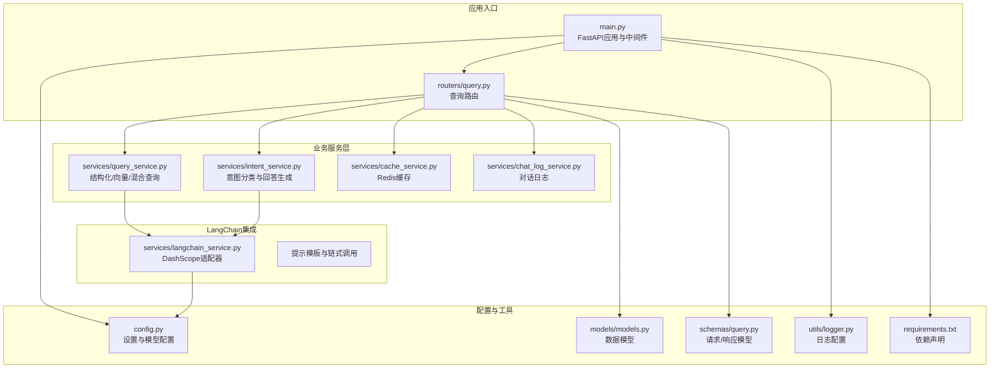
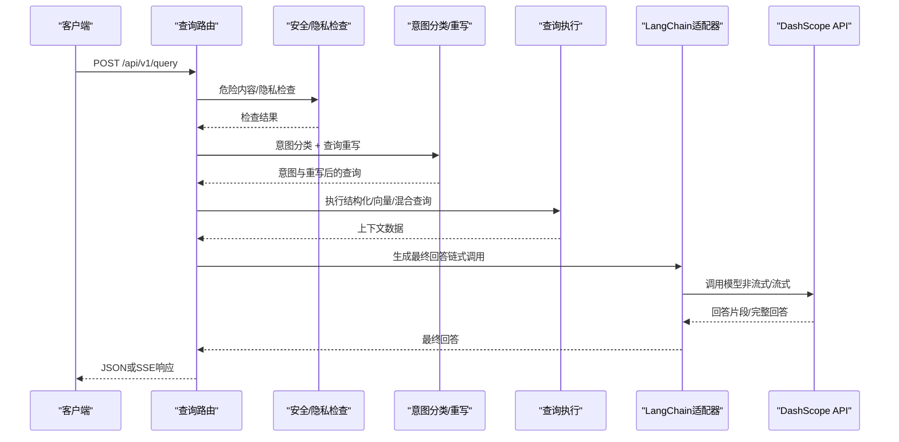
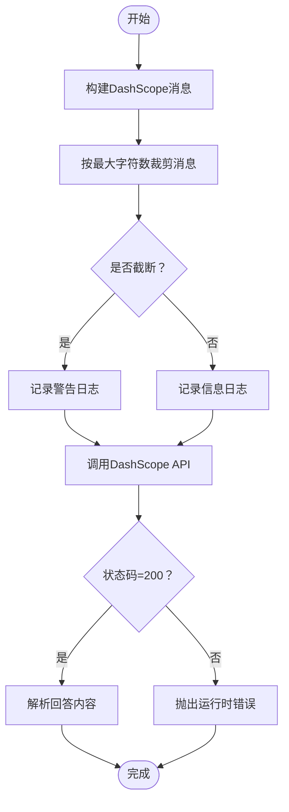
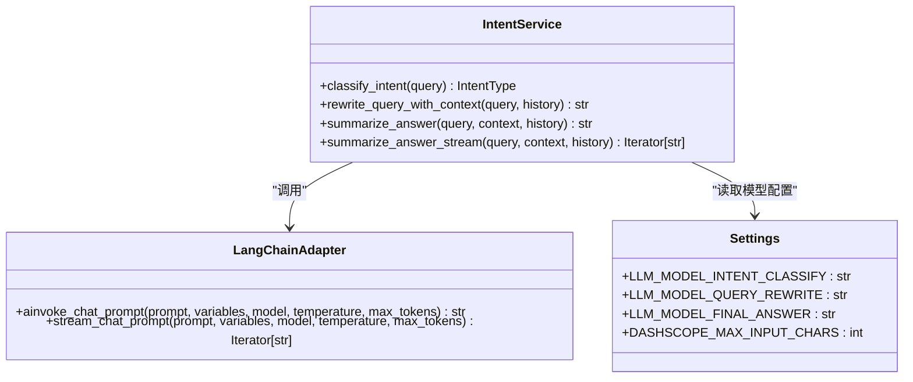
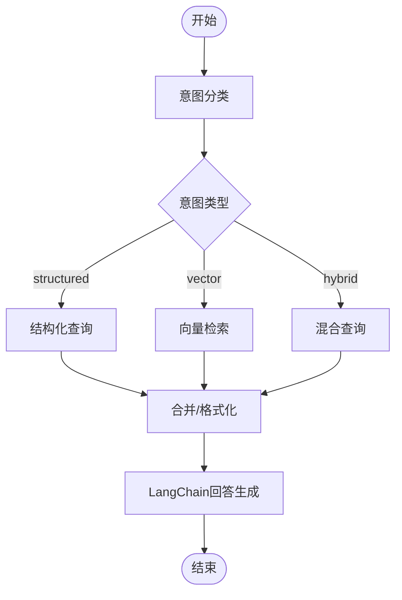
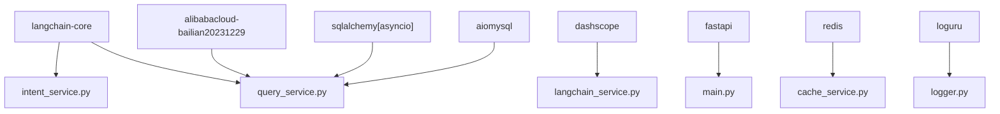

# LangChain集成服务

<cite>
**本文档引用的文件**
- [langchain_service.py](file://service/ai_assistant/app/services/langchain_service.py)
- [config.py](file://service/ai_assistant/app/config.py)
- [main.py](file://service/ai_assistant/app/main.py)
- [query.py](file://service/ai_assistant/app/routers/query.py)
- [intent_service.py](file://service/ai_assistant/app/services/intent_service.py)
- [query_service.py](file://service/ai_assistant/app/services/query_service.py)
- [cache_service.py](file://service/ai_assistant/app/services/cache_service.py)
- [chat_log_service.py](file://service/ai_assistant/app/services/chat_log_service.py)
- [models.py](file://service/ai_assistant/app/models/models.py)
- [query.py](file://service/ai_assistant/app/schemas/query.py)
- [logger.py](file://service/ai_assistant/app/utils/logger.py)
- [requirements.txt](file://service/ai_assistant/requirements.txt)
</cite>

## 目录
1. [简介](#简介)
2. [项目结构](#项目结构)
3. [核心组件](#核心组件)
4. [架构总览](#架构总览)
5. [详细组件分析](#详细组件分析)
6. [依赖关系分析](#依赖关系分析)
7. [性能考虑](#性能考虑)
8. [故障排除指南](#故障排除指南)
9. [结论](#结论)
10. [附录](#附录)

## 简介
本文件面向AI校园助手项目的LangChain集成服务，系统性阐述LangChain框架与DashScope API的集成架构，涵盖大语言模型配置、提示模板管理、链式调用构建、DashScope API集成（模型选择、参数配置、请求限流、错误处理）、事件流处理机制（异步调用模式、流式响应处理、进度回调管理）、提示工程优化（系统提示设计、用户提示构建、上下文注入策略）、模型调用监控（响应时间统计、成本计算、质量评估）、LangChain运行时配置、内存管理与并发控制，以及最佳实践与性能优化建议。

## 项目结构
AI校园助手后端采用FastAPI作为Web框架，LangChain用于提示工程与链式调用，DashScope作为推理后端。整体结构如下：
- 应用入口与路由：FastAPI应用、CORS中间件、路由注册
- 业务服务层：意图分类、查询执行、缓存、对话日志、媒体处理等
- LangChain集成：提示模板、链式调用、DashScope适配器
- 配置与依赖：Pydantic设置、数据库与Redis连接、日志配置
- 数据模型：校园相关实体（学生、课程、成绩、课表等）

**图表来源**
- [main.py:1-86](file://service/ai_assistant/app/main.py#L1-L86)
- [query.py:1-788](file://service/ai_assistant/app/routers/query.py#L1-L788)
- [intent_service.py:1-346](file://service/ai_assistant/app/services/intent_service.py#L1-L346)
- [query_service.py:1-800](file://service/ai_assistant/app/services/query_service.py#L1-L800)
- [cache_service.py:1-177](file://service/ai_assistant/app/services/cache_service.py#L1-L177)
- [chat_log_service.py:1-76](file://service/ai_assistant/app/services/chat_log_service.py#L1-L76)
- [langchain_service.py:1-278](file://service/ai_assistant/app/services/langchain_service.py#L1-L278)
- [config.py:1-113](file://service/ai_assistant/app/config.py#L1-L113)
- [models.py:1-660](file://service/ai_assistant/app/models/models.py#L1-L660)
- [query.py:1-33](file://service/ai_assistant/app/schemas/query.py#L1-L33)
- [logger.py:1-53](file://service/ai_assistant/app/utils/logger.py#L1-L53)
- [requirements.txt:1-22](file://service/ai_assistant/requirements.txt#L1-L22)

**章节来源**
- [main.py:1-86](file://service/ai_assistant/app/main.py#L1-L86)
- [query.py:1-788](file://service/ai_assistant/app/routers/query.py#L1-L788)
- [config.py:1-113](file://service/ai_assistant/app/config.py#L1-L113)

## 核心组件
- LangChain适配器：封装DashScope调用，支持非流式与流式两种模式，负责消息格式转换、输入裁剪、HTTP会话管理、错误处理与日志记录。
- 意图分类与回答生成：基于LangChain链式调用，实现意图分类、查询重写、上下文裁剪与最终回答生成。
- 查询执行服务：整合结构化SQL查询、向量检索、混合查询与工具规划，支持百炼检索器包装。
- 缓存服务：基于Redis的查询缓存，区分敏感与普通查询，支持日期敏感与课表版本失效策略。
- 对话日志服务：保存学生与助手的对话记录，支持危险内容标记与隐私保护。
- 配置与模型：集中管理DashScope模型配置、最大输入字符数、CORS、数据库与Redis连接等。

**章节来源**
- [langchain_service.py:1-278](file://service/ai_assistant/app/services/langchain_service.py#L1-L278)
- [intent_service.py:1-346](file://service/ai_assistant/app/services/intent_service.py#L1-L346)
- [query_service.py:1-800](file://service/ai_assistant/app/services/query_service.py#L1-L800)
- [cache_service.py:1-177](file://service/ai_assistant/app/services/cache_service.py#L1-L177)
- [chat_log_service.py:1-76](file://service/ai_assistant/app/services/chat_log_service.py#L1-L76)
- [config.py:1-113](file://service/ai_assistant/app/config.py#L1-L113)

## 架构总览
LangChain集成服务围绕“提示模板 + 链式调用 + DashScope适配器”的模式工作。查询路由接收多模态输入，经过安全检查、隐私检查、意图分类与查询重写后，进入查询执行阶段。最终通过LangChain链式调用生成回答，支持JSON与SSE两种输出模式。

**图表来源**
- [query.py:198-745](file://service/ai_assistant/app/routers/query.py#L198-L745)
- [intent_service.py:218-346](file://service/ai_assistant/app/services/intent_service.py#L218-L346)
- [langchain_service.py:139-278](file://service/ai_assistant/app/services/langchain_service.py#L139-L278)

## 详细组件分析

### LangChain适配器（DashScope集成）
- 输入裁剪与消息转换：将LangChain消息对象转换为DashScope格式，按最大字符数裁剪历史消息，优先丢弃旧历史，再裁剪最后一条消息，必要时对首条system消息进行截断。
- 非流式调用：构建HTTP会话（可忽略环境代理），设置模型、温度、最大token、API Key等参数，异步在线程池中执行调用，校验状态码并记录错误。
- 流式调用：启用增量输出与流式模式，逐块返回响应，记录进度并处理错误。
- 日志与错误处理：记录调用开始/结束、输入截断、状态码错误等，抛出运行时异常。

**图表来源**
- [langchain_service.py:46-96](file://service/ai_assistant/app/services/langchain_service.py#L46-L96)
- [langchain_service.py:139-204](file://service/ai_assistant/app/services/langchain_service.py#L139-L204)
- [langchain_service.py:206-278](file://service/ai_assistant/app/services/langchain_service.py#L206-L278)

**章节来源**
- [langchain_service.py:1-278](file://service/ai_assistant/app/services/langchain_service.py#L1-L278)

### 意图分类与回答生成（LangChain链式调用）
- 意图分类：使用系统提示将用户问题分类为structured/vector/hybrid/smalltalk，温度设为0，限制最大token，失败时回退为vector。
- 查询重写：结合最近历史上下文，将最新问题重写为独立、完整的查询，限制长度并记录截断。
- 最终回答生成：构建系统提示，裁剪历史与上下文，调用LangChain链式调用生成自然语言回答，支持流式输出。

**图表来源**
- [intent_service.py:218-346](file://service/ai_assistant/app/services/intent_service.py#L218-L346)
- [langchain_service.py:139-278](file://service/ai_assistant/app/services/langchain_service.py#L139-L278)
- [config.py:48-73](file://service/ai_assistant/app/config.py#L48-L73)

**章节来源**
- [intent_service.py:1-346](file://service/ai_assistant/app/services/intent_service.py#L1-L346)
- [config.py:1-113](file://service/ai_assistant/app/config.py#L1-L113)

### 查询执行服务（结构化/向量/混合）
- 结构化查询：基于SQLAlchemy异步查询，支持按学期过滤、自动推断当前学期、课表压缩与周次统计。
- 向量检索：封装百炼检索器为LangChain检索器，异步获取相关文档。
- 混合查询：结合结构化与向量检索结果，进行去重与重排。
- 工具规划：基于用户问题与意图，规划所需工具调用（如获取成绩、课表、个人信息等）。

**图表来源**
- [query_service.py:150-238](file://service/ai_assistant/app/services/query_service.py#L150-L238)
- [query_service.py:212-238](file://service/ai_assistant/app/services/query_service.py#L212-L238)
- [query_service.py:178-209](file://service/ai_assistant/app/services/query_service.py#L178-L209)

**章节来源**
- [query_service.py:1-800](file://service/ai_assistant/app/services/query_service.py#L1-L800)

### 缓存服务（Redis）
- 键命名：chat_cache:{version}:{did}:{query_hash}，版本号v3，支持课表版本隔离。
- TTL策略：敏感查询30分钟，普通查询1天；日期敏感查询按日失效；课表敏感查询按版本失效。
- 命中/失效：命中时检查日期桶与课表版本，不匹配则删除并返回未命中。

**章节来源**
- [cache_service.py:1-177](file://service/ai_assistant/app/services/cache_service.py#L1-L177)

### 对话日志服务
- 隐私规则：普通消息仅存储DID，危险消息存储原始学号以便干预。
- 行为记录：支持危险标记、上报、阻断等系统动作。
- 历史加载：按DID与时间倒序加载最近对话，供上下文注入。

**章节来源**
- [chat_log_service.py:1-76](file://service/ai_assistant/app/services/chat_log_service.py#L1-L76)

### 配置与模型
- DashScope模型配置：意图分类、查询重写、最终回答、工具规划、向量分解、混合重排、安全检测、图像理解、语音识别等模型名称。
- 输入限制：最大输入字符数，用于消息裁剪。
- CORS与数据库：CORS允许来源、MySQL与Redis连接URL。

**章节来源**
- [config.py:48-73](file://service/ai_assistant/app/config.py#L48-L73)
- [config.py:85-110](file://service/ai_assistant/app/config.py#L85-L110)

## 依赖关系分析
- LangChain核心：langchain-core用于提示模板、消息占位符、链式调用与输出解析器。
- DashScope：dashscope用于调用大模型，alibabacloud-bailian20231229用于百炼检索器。
- Web与数据库：FastAPI、SQLAlchemy异步、aiomysql、Redis。
- 安全与加密：python-jose、cryptography、passlib、pycryptodome。
- 日志：loguru。

**图表来源**
- [requirements.txt:1-22](file://service/ai_assistant/requirements.txt#L1-L22)
- [intent_service.py:13-21](file://service/ai_assistant/app/services/intent_service.py#L13-L21)
- [query_service.py:18-47](file://service/ai_assistant/app/services/query_service.py#L18-L47)
- [langchain_service.py:12-17](file://service/ai_assistant/app/services/langchain_service.py#L12-L17)
- [main.py:9-16](file://service/ai_assistant/app/main.py#L9-L16)
- [logger.py:11](file://service/ai_assistant/app/utils/logger.py#L11)

**章节来源**
- [requirements.txt:1-22](file://service/ai_assistant/requirements.txt#L1-L22)

## 性能考虑
- 异步与线程池：LangChain适配器通过异步线程池执行阻塞的HTTP调用，避免阻塞事件循环。
- 流式输出：SSE流式输出与LangChain流式生成相结合，降低首字节延迟与内存峰值。
- 输入裁剪：按最大字符数裁剪历史消息，优先丢弃旧历史，再裁剪最后一条，防止超限。
- 缓存策略：敏感与普通查询分别设置TTL，日期敏感与课表敏感查询按策略失效，平衡一致性与性能。
- 并发控制：路由中对安全检查、隐私检查与查询重写并行执行，缩短端到端延迟。
- 日志级别：INFO级别输出关键指标，DEBUG级别用于诊断，避免过度日志影响性能。

[本节为通用性能讨论，无需特定文件分析]

## 故障排除指南
- DashScope调用失败：检查API Key、模型名称、输入字符数限制；查看状态码与错误消息日志。
- 输入超限：确认消息裁剪逻辑是否生效，适当调整最大输入字符数。
- 流式输出中断：检查SSE响应头与代理配置，确保无缓冲与改写；验证流式生成器是否正确关闭会话。
- 缓存未命中：确认Redis可用性与键格式；检查日期敏感与课表版本失效逻辑。
- 危险内容拦截：确认安全检查逻辑与日志记录，必要时调整阈值或规则。

**章节来源**
- [langchain_service.py:183-200](file://service/ai_assistant/app/services/langchain_service.py#L183-L200)
- [query.py:142-151](file://service/ai_assistant/app/routers/query.py#L142-L151)
- [cache_service.py:92-147](file://service/ai_assistant/app/services/cache_service.py#L92-L147)

## 结论
本LangChain集成服务通过清晰的职责分离与模块化设计，实现了从多模态输入到最终回答的完整链路。DashScope适配器提供了稳定的推理后端，LangChain链式调用保障了提示工程的灵活性与可维护性。配合缓存、日志与安全检查机制，系统在性能、稳定性与安全性方面达到了良好平衡。建议在生产环境中进一步完善限流策略、监控指标与告警机制，持续优化提示模板与上下文注入策略。

[本节为总结性内容，无需特定文件分析]

## 附录

### DashScope模型配置与参数
- 模型选择：意图分类、查询重写、最终回答、工具规划、向量分解、混合重排、安全检测、图像理解、语音识别等。
- 参数配置：温度、最大token、结果格式、增量输出、HTTP会话（可忽略环境代理）。
- 请求限流：通过异步线程池与SSE流式输出缓解并发压力；建议在网关或上游增加速率限制。
- 错误处理：状态码校验、异常捕获与日志记录，对外提供友好错误信息。

**章节来源**
- [config.py:48-73](file://service/ai_assistant/app/config.py#L48-L73)
- [langchain_service.py:169-188](file://service/ai_assistant/app/services/langchain_service.py#L169-L188)
- [langchain_service.py:236-251](file://service/ai_assistant/app/services/langchain_service.py#L236-L251)

### 事件流处理机制
- 异步调用：使用asyncio.to_thread在独立线程中执行阻塞调用，避免阻塞主事件循环。
- 流式响应：SSE与LangChain流式生成器结合，逐块推送回答片段，支持进度回调。
- 进度回调：定期记录日志，便于前端展示与监控。

**章节来源**
- [query.py:659-745](file://service/ai_assistant/app/routers/query.py#L659-L745)
- [langchain_service.py:255-276](file://service/ai_assistant/app/services/langchain_service.py#L255-L276)

### 提示工程优化
- 系统提示设计：明确角色、回答规范与约束，避免技术术语与内部标记。
- 用户提示构建：结合历史上下文，确保问题完整与可执行。
- 上下文注入策略：限制历史与上下文长度，优先保留关键信息，必要时进行截断。

**章节来源**
- [intent_service.py:23-101](file://service/ai_assistant/app/services/intent_service.py#L23-L101)
- [intent_service.py:163-210](file://service/ai_assistant/app/services/intent_service.py#L163-L210)

### LangChain运行时配置、内存管理与并发控制
- 运行时配置：通过Pydantic设置集中管理，避免硬编码。
- 内存管理：输入裁剪与流式输出降低内存峰值；SSE生成器结束后及时释放资源。
- 并发控制：路由中并行执行安全检查与查询重写，缩短端到端延迟。

**章节来源**
- [config.py:6-113](file://service/ai_assistant/app/config.py#L6-L113)
- [query.py:347-353](file://service/ai_assistant/app/routers/query.py#L347-L353)

### 最佳实践与性能优化建议
- 提示模板：保持简洁明确，避免歧义；定期评估与迭代。
- 输入裁剪：根据模型能力动态调整最大字符数；优先保留最新消息。
- 缓存策略：敏感与普通查询差异化TTL；日期敏感与课表敏感查询按策略失效。
- 并发与限流：在网关或上游增加速率限制；合理设置线程池大小。
- 监控与告警：记录关键指标（响应时间、错误率、吞吐量）；建立告警机制。

[本节为通用建议，无需特定文件分析]