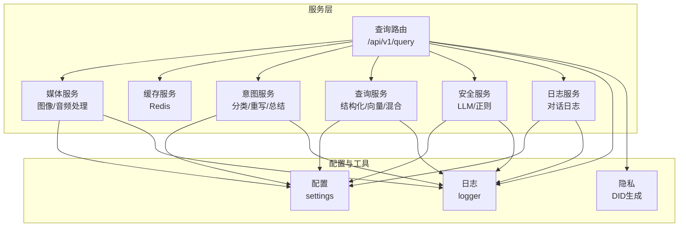
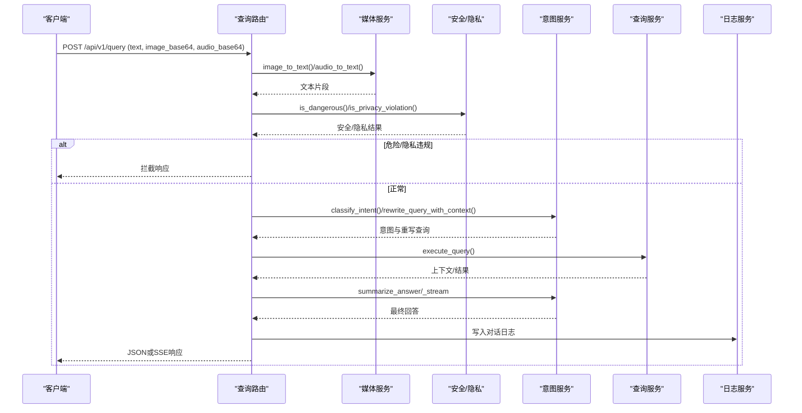
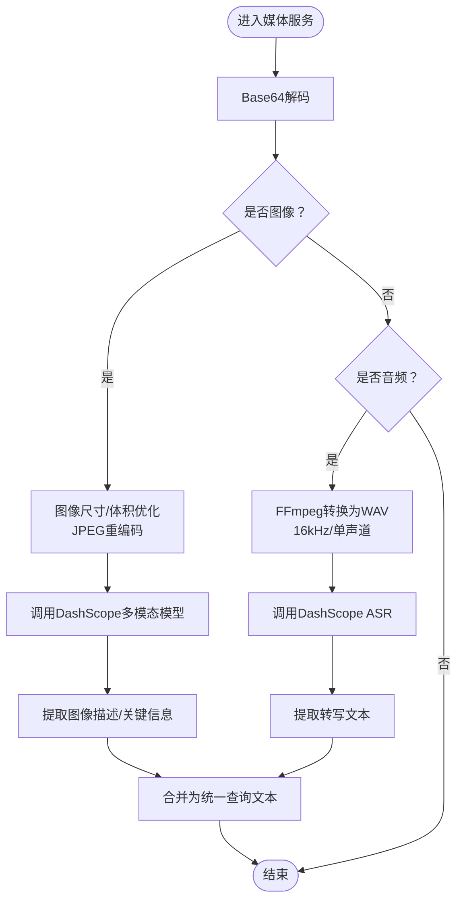
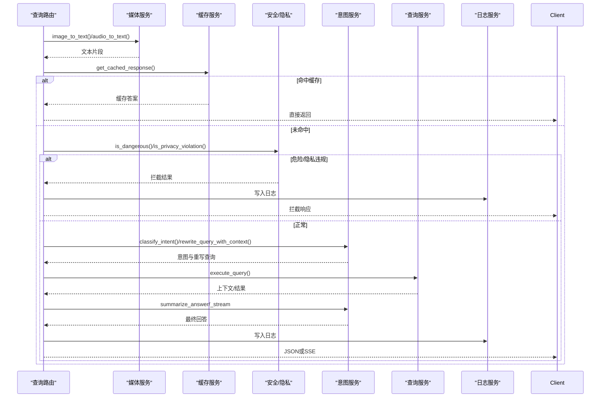
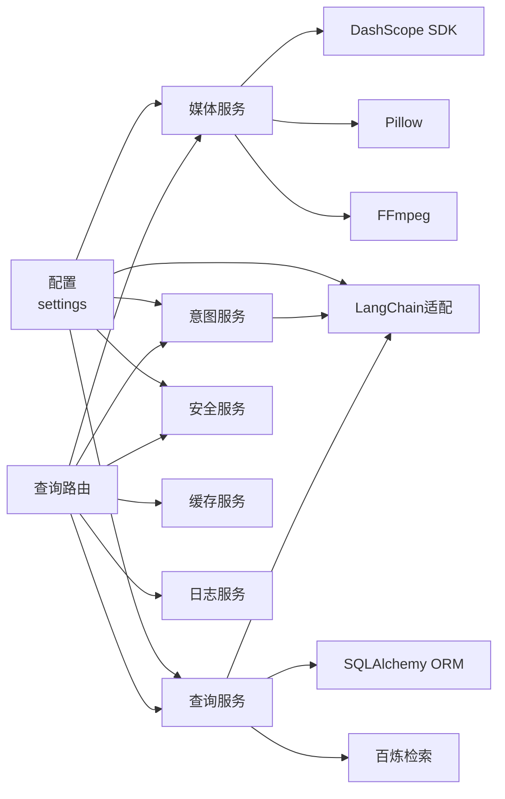

# 媒体处理服务

<cite>
**本文档引用的文件**
- [media_service.py](file://service/ai_assistant/app/services/media_service.py)
- [query.py](file://service/ai_assistant/app/routers/query.py)
- [query.py（Schema）](file://service/ai_assistant/app/schemas/query.py)
- [config.py](file://service/ai_assistant/app/config.py)
- [logger.py](file://service/ai_assistant/app/utils/logger.py)
- [cache_service.py](file://service/ai_assistant/app/services/cache_service.py)
- [intent_service.py](file://service/ai_assistant/app/services/intent_service.py)
- [query_service.py](file://service/ai_assistant/app/services/query_service.py)
- [langchain_service.py](file://service/ai_assistant/app/services/langchain_service.py)
- [chat_log_service.py](file://service/ai_assistant/app/services/chat_log_service.py)
- [models.py](file://service/ai_assistant/app/models/models.py)
- [privacy.py](file://service/ai_assistant/app/utils/privacy.py)
</cite>

## 目录
1. [简介](#简介)
2. [项目结构](#项目结构)
3. [核心组件](#核心组件)
4. [架构总览](#架构总览)
5. [详细组件分析](#详细组件分析)
6. [依赖关系分析](#依赖关系分析)
7. [性能考量](#性能考量)
8. [故障排查指南](#故障排查指南)
9. [结论](#结论)
10. [附录](#附录)

## 简介
本文件面向AI校园助手项目的媒体处理服务，系统性阐述多模态输入处理架构与实现，包括：
- 多模态输入接收与统一查询构建：文本、Base64图像、Base64音频的组合与前置处理
- 图像理解与OCR能力：图像预处理、尺寸与体积优化、DashScope多模态模型调用
- 语音转文字服务：音频格式支持、FFmpeg降噪与格式转换、DashScope ASR调用与结果后处理
- 多模态数据融合策略：将文本、图片、语音信息整合为统一查询表示
- 媒体文件安全处理：大小限制、格式验证、隐私保护与安全检测
- 性能优化与并发控制：异步执行、线程池隔离、流式输出与缓存策略
- API使用示例与最佳实践：请求体结构、错误处理与输出类型

## 项目结构
媒体处理服务位于后端服务目录中，围绕FastAPI路由与各领域服务协作完成端到端处理链路。

图表来源
- [query.py:198-745](file://service/ai_assistant/app/routers/query.py#L198-L745)
- [media_service.py:1-246](file://service/ai_assistant/app/services/media_service.py#L1-L246)
- [config.py:48-73](file://service/ai_assistant/app/config.py#L48-L73)

章节来源
- [query.py:1-788](file://service/ai_assistant/app/routers/query.py#L1-L788)
- [media_service.py:1-246](file://service/ai_assistant/app/services/media_service.py#L1-L246)
- [config.py:1-113](file://service/ai_assistant/app/config.py#L1-L113)

## 核心组件
- 媒体服务（图像/音频）：负责图像尺寸与体积优化、音频格式转换与ASR调用，统一输出文本
- 查询路由：接收多模态输入，构建统一查询文本，执行安全检查、缓存、意图分类、查询执行与回答生成
- 缓存服务：基于Redis的查询缓存，支持敏感度与时间维度的TTL控制
- 意图服务：查询意图分类、上下文重写与回答总结
- 查询服务：结构化SQL查询、向量检索与混合检索
- 安全服务：基于LLM与正则的危险内容检测与隐私违规检查
- 日志与隐私：对话日志持久化与DID脱敏

章节来源
- [media_service.py:1-246](file://service/ai_assistant/app/services/media_service.py#L1-L246)
- [query.py:198-745](file://service/ai_assistant/app/routers/query.py#L198-L745)
- [cache_service.py:1-177](file://service/ai_assistant/app/services/cache_service.py#L1-L177)
- [intent_service.py:1-346](file://service/ai_assistant/app/services/intent_service.py#L1-L346)
- [query_service.py:1-800](file://service/ai_assistant/app/services/query_service.py#L1-L800)
- [safety_service.py:1-163](file://service/ai_assistant/app/services/safety_service.py#L1-L163)
- [chat_log_service.py:1-76](file://service/ai_assistant/app/services/chat_log_service.py#L1-L76)
- [privacy.py:1-23](file://service/ai_assistant/app/utils/privacy.py#L1-L23)

## 架构总览
媒体处理服务采用“路由-服务-外部模型/SDK”的分层架构，结合异步与线程池隔离，确保高并发下的稳定性与性能。

图表来源
- [query.py:207-745](file://service/ai_assistant/app/routers/query.py#L207-L745)
- [media_service.py:115-246](file://service/ai_assistant/app/services/media_service.py#L115-L246)
- [safety_service.py:84-163](file://service/ai_assistant/app/services/safety_service.py#L84-L163)
- [intent_service.py:218-346](file://service/ai_assistant/app/services/intent_service.py#L218-L346)
- [query_service.py:1-800](file://service/ai_assistant/app/services/query_service.py#L1-L800)
- [chat_log_service.py:14-76](file://service/ai_assistant/app/services/chat_log_service.py#L14-L76)

## 详细组件分析

### 媒体服务：图像与音频处理
- 图像处理
  - 输入：Base64图像（JPEG/PNG）
  - 预处理：尺寸与体积优化（最长边限制、JPEG重编码、质量压缩）
  - 调用：DashScope多模态对话API，返回图像描述与关键信息
- 音频处理
  - 输入：Base64音频（WAV/MP3等）
  - 预处理：FFmpeg转换为16kHz单声道WAV
  - 调用：DashScope ASR识别，提取句子并拼接为最终文本
  - 安全：对静音/无内容场景进行拦截，避免无效输出

图表来源
- [media_service.py:23-246](file://service/ai_assistant/app/services/media_service.py#L23-L246)

章节来源
- [media_service.py:1-246](file://service/ai_assistant/app/services/media_service.py#L1-L246)

### 查询路由：多模态输入统一与流程编排
- 输入解析：支持text、image_base64、audio_base64三类输入
- 统一查询构建：将各模态文本片段按顺序拼接
- 缓存：优先命中Redis缓存，支持敏感与日期维度TTL
- 安全与隐私：并发执行危险内容检测与隐私检查
- 意图分类与重写：结合历史上下文优化查询
- 执行与总结：结构化/向量/混合查询，LangChain总结回答
- 流式输出：SSE流式返回，JSON模式与流式模式切换
- 会话历史：基于DID与session_id的会话隔离

图表来源
- [query.py:207-745](file://service/ai_assistant/app/routers/query.py#L207-L745)
- [cache_service.py:92-177](file://service/ai_assistant/app/services/cache_service.py#L92-L177)
- [safety_service.py:84-163](file://service/ai_assistant/app/services/safety_service.py#L84-L163)
- [intent_service.py:218-346](file://service/ai_assistant/app/services/intent_service.py#L218-L346)
- [query_service.py:1-800](file://service/ai_assistant/app/services/query_service.py#L1-L800)
- [chat_log_service.py:14-76](file://service/ai_assistant/app/services/chat_log_service.py#L14-L76)

章节来源
- [query.py:1-788](file://service/ai_assistant/app/routers/query.py#L1-L788)

### 缓存服务：键设计与TTL策略
- 键格式：chat_cache:{version}:{did}:{query_hash}
- 版本控制：支持升级时自动隔离旧缓存
- TTL策略：敏感查询30分钟，普通查询1天
- 日期敏感：跨日失效，避免相对时间语义过期
- 课表敏感：管理员改课后版本递增，强制失效

章节来源
- [cache_service.py:1-177](file://service/ai_assistant/app/services/cache_service.py#L1-L177)

### 安全与隐私：双重保障
- 危险内容检测：LLM优先，格式异常回退正则
- 公共服务查询放行：避免误判
- 隐私检查：禁止查询他人学号，发现即拦截
- 隐私脱敏：DID替代真实学号存储

章节来源
- [safety_service.py:1-163](file://service/ai_assistant/app/services/safety_service.py#L1-L163)
- [privacy.py:1-23](file://service/ai_assistant/app/utils/privacy.py#L1-L23)

### 意图与查询：结构化/向量/混合
- 意图分类：structured/vector/hybrid/smalltalk
- 查询重写：结合历史上下文补齐缺失信息
- 回答总结：LangChain提示模板，严格字段与格式约束
- 查询执行：SQL结构化查询、向量检索、混合重排

章节来源
- [intent_service.py:1-346](file://service/ai_assistant/app/services/intent_service.py#L1-L346)
- [query_service.py:1-800](file://service/ai_assistant/app/services/query_service.py#L1-L800)

### 日志与会话：持久化与隔离
- 对话日志：按DID存储，危险消息保留原始学号
- 会话历史：基于session_id与DID隔离，支持Redis与DB双路径

章节来源
- [chat_log_service.py:1-76](file://service/ai_assistant/app/services/chat_log_service.py#L1-L76)
- [models.py:625-660](file://service/ai_assistant/app/models/models.py#L625-L660)

## 依赖关系分析
媒体处理服务的关键依赖与耦合关系如下：

图表来源
- [media_service.py:1-246](file://service/ai_assistant/app/services/media_service.py#L1-L246)
- [query.py:1-788](file://service/ai_assistant/app/routers/query.py#L1-L788)
- [config.py:48-73](file://service/ai_assistant/app/config.py#L48-L73)
- [langchain_service.py:1-278](file://service/ai_assistant/app/services/langchain_service.py#L1-L278)
- [query_service.py:1-800](file://service/ai_assistant/app/services/query_service.py#L1-L800)

章节来源
- [media_service.py:1-246](file://service/ai_assistant/app/services/media_service.py#L1-L246)
- [query.py:1-788](file://service/ai_assistant/app/routers/query.py#L1-L788)
- [config.py:1-113](file://service/ai_assistant/app/config.py#L1-L113)
- [langchain_service.py:1-278](file://service/ai_assistant/app/services/langchain_service.py#L1-L278)
- [query_service.py:1-800](file://service/ai_assistant/app/services/query_service.py#L1-L800)

## 性能考量
- 异步与线程池隔离
  - 媒体服务与LLM调用通过线程池隔离，避免阻塞事件循环
  - SSE流式输出，避免长时间持有数据库连接
- 并发控制
  - 安全检查与查询重写并发执行，缩短端到端延迟
- 缓存策略
  - Redis缓存命中优先，敏感与日期维度TTL降低重复计算
- 输入优化
  - 图像尺寸与体积限制，音频格式转换与采样率标准化，降低外部API负载
- 日志与监控
  - 统一日志格式，便于追踪与性能分析

章节来源
- [query.py:347-352](file://service/ai_assistant/app/routers/query.py#L347-L352)
- [media_service.py:141-148](file://service/ai_assistant/app/services/media_service.py#L141-L148)
- [langchain_service.py:139-204](file://service/ai_assistant/app/services/langchain_service.py#L139-L204)

## 故障排查指南
- 图像处理失败
  - 症状：HTTP 502，错误信息包含“图片处理失败”
  - 排查：检查Base64有效性、图像尺寸与体积、DashScope API状态
- 音频处理失败
  - 症状：HTTP 502，错误信息包含“音频处理失败”或“FFmpeg转换失败”
  - 排查：确认音频格式可被FFmpeg识别、采样率与通道设置、磁盘空间与权限
- ASR无有效文本
  - 症状：返回空文本或提示“未检测到有效语音内容”
  - 排查：提高音量、消除环境噪音、确认麦克风与播放设备
- 缓存异常
  - 症状：缓存未命中或命中脏数据
  - 排查：检查Redis连通性、键格式与TTL、版本号更新
- 安全拦截
  - 症状：返回拦截响应
  - 排查：检查危险内容与隐私违规关键词匹配规则

章节来源
- [query.py:232-260](file://service/ai_assistant/app/routers/query.py#L232-L260)
- [media_service.py:177-245](file://service/ai_assistant/app/services/media_service.py#L177-L245)
- [cache_service.py:92-177](file://service/ai_assistant/app/services/cache_service.py#L92-L177)
- [safety_service.py:147-163](file://service/ai_assistant/app/services/safety_service.py#L147-L163)

## 结论
媒体处理服务通过清晰的分层与并发策略，实现了多模态输入的高效统一处理。图像与音频经由预处理与DashScope模型转换为统一文本表示，结合安全与隐私检查、缓存与意图分类，最终由LangChain生成高质量回答。整体架构具备良好的扩展性与鲁棒性，适合在高并发场景下稳定运行。

## 附录

### API使用示例与最佳实践
- 请求体结构
  - text：可选，自然语言问题
  - image_base64：可选，Base64编码的图像（JPEG/PNG）
  - audio_base64：可选，Base64编码的音频（WAV/MP3等）
  - session_id：可选，会话标识
  - output_type：可选，"json"返回结构化JSON，其他返回SSE流式
- 最佳实践
  - 图像：尽量使用JPG，避免超大体积；必要时在客户端压缩
  - 音频：使用16kHz单声道WAV或MP3，确保背景噪音低
  - 并发：合理设置会话ID，避免跨会话历史污染
  - 错误处理：捕获HTTP 502并提示用户重试或更换媒体格式

章节来源
- [query.py（Schema）:15-32](file://service/ai_assistant/app/schemas/query.py#L15-L32)
- [query.py:198-212](file://service/ai_assistant/app/routers/query.py#L198-L212)