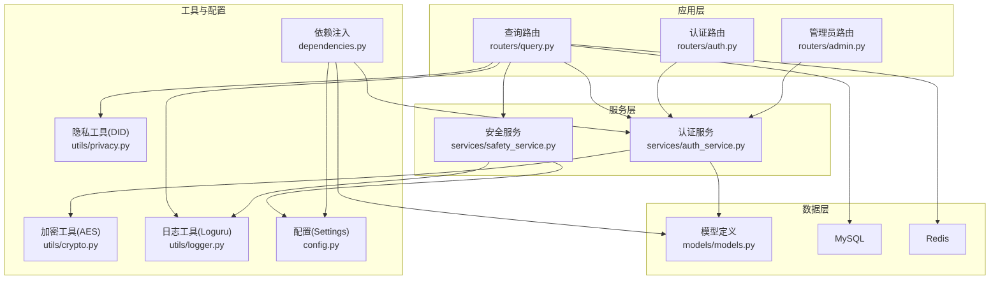
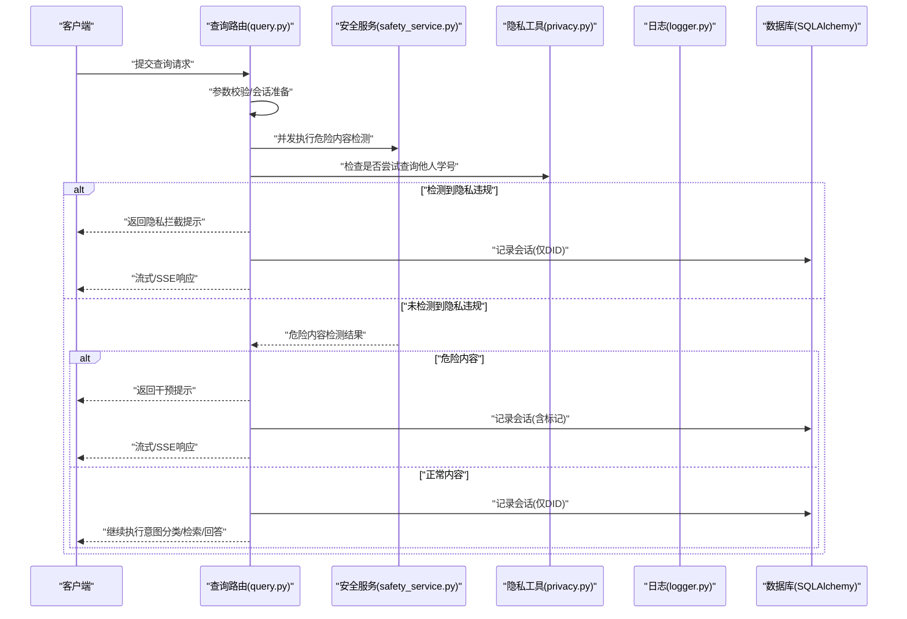
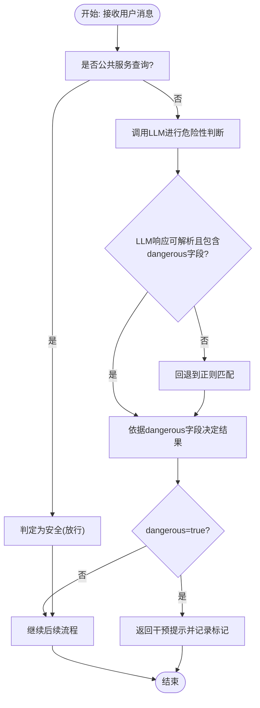
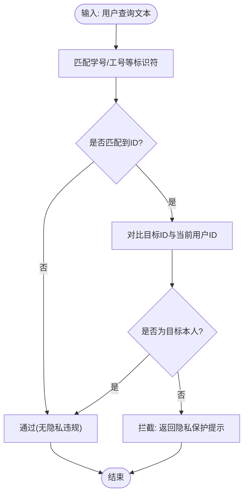
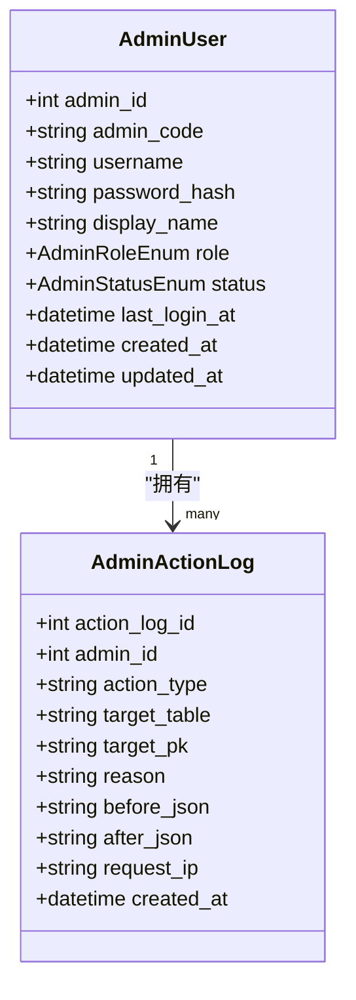
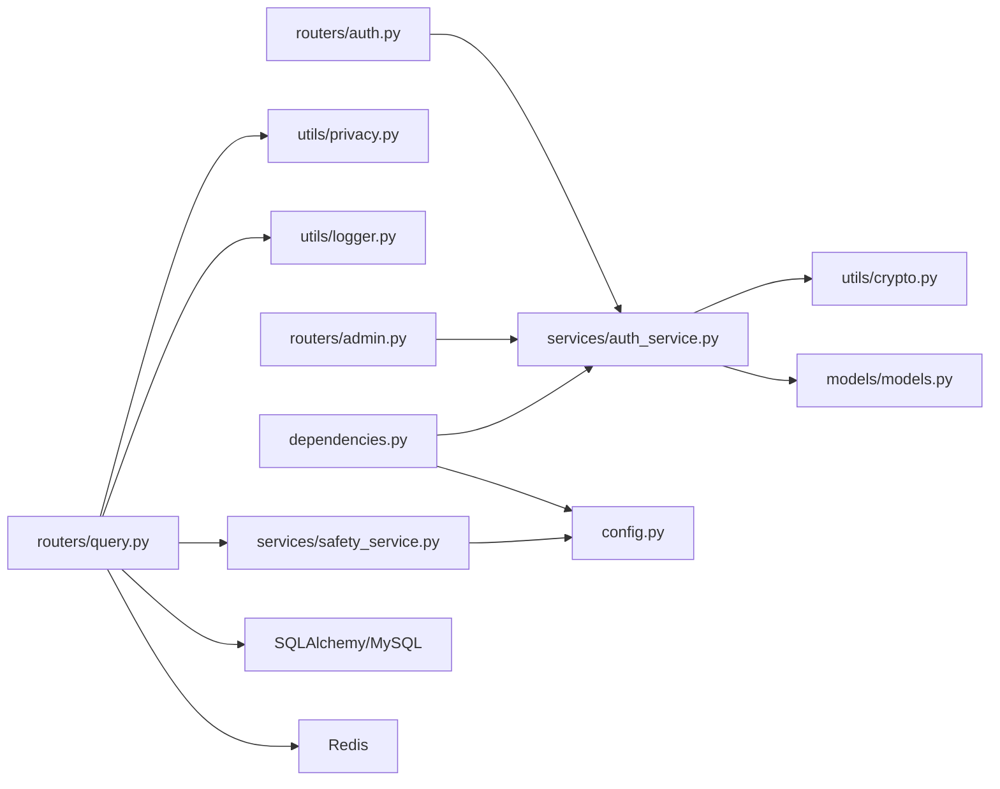

# 安全服务

<cite>
**本文引用的文件**
- [safety_service.py](file://service/ai_assistant/app/services/safety_service.py)
- [privacy.py](file://service/ai_assistant/app/utils/privacy.py)
- [logger.py](file://service/ai_assistant/app/utils/logger.py)
- [admin.py](file://service/ai_assistant/app/routers/admin.py)
- [auth.py](file://service/ai_assistant/app/routers/auth.py)
- [auth_service.py](file://service/ai_assistant/app/services/auth_service.py)
- [crypto.py](file://service/ai_assistant/app/utils/crypto.py)
- [models.py](file://service/ai_assistant/app/models/models.py)
- [config.py](file://service/ai_assistant/app/config.py)
- [dependencies.py](file://service/ai_assistant/app/dependencies.py)
- [main.py](file://service/ai_assistant/app/main.py)
- [query.py](file://service/ai_assistant/app/routers/query.py)
</cite>

## 目录
1. [引言](#引言)
2. [项目结构](#项目结构)
3. [核心组件](#核心组件)
4. [架构总览](#架构总览)
5. [详细组件分析](#详细组件分析)
6. [依赖分析](#依赖分析)
7. [性能考虑](#性能考虑)
8. [故障排查指南](#故障排查指南)
9. [结论](#结论)
10. [附录](#附录)

## 引言
本文件聚焦于AI校园助手项目的安全服务，系统性阐述内容安全检查机制、隐私数据保护策略、行级数据安全实现、危险内容检测、输入验证与清理、安全日志与异常监控、安全事件响应流程，并提供安全配置指南与漏洞修复建议。文档面向技术与非技术读者，力求以循序渐进的方式呈现。

## 项目结构
后端采用FastAPI + SQLAlchemy + Redis + MySQL架构，安全相关能力主要分布在以下模块：
- 安全检查：内容危险性检测、隐私违规检测
- 认证与授权：JWT签发与校验、管理员角色与状态控制
- 隐私保护：DID脱敏、日志记录与会话历史
- 日志与审计：统一日志、管理员操作审计
- 配置与依赖：密钥与模型配置、CORS与生命周期检查

图表来源
- [query.py:340-539](file://service/ai_assistant/app/routers/query.py#L340-L539)
- [auth.py:1-102](file://service/ai_assistant/app/routers/auth.py#L1-L102)
- [admin.py:1-388](file://service/ai_assistant/app/routers/admin.py#L1-L388)
- [safety_service.py:1-163](file://service/ai_assistant/app/services/safety_service.py#L1-L163)
- [auth_service.py:1-253](file://service/ai_assistant/app/services/auth_service.py#L1-L253)
- [privacy.py:1-23](file://service/ai_assistant/app/utils/privacy.py#L1-L23)
- [crypto.py:1-73](file://service/ai_assistant/app/utils/crypto.py#L1-L73)
- [logger.py:1-53](file://service/ai_assistant/app/utils/logger.py#L1-L53)
- [config.py:1-113](file://service/ai_assistant/app/config.py#L1-L113)
- [dependencies.py:1-109](file://service/ai_assistant/app/dependencies.py#L1-L109)
- [models.py:1-200](file://service/ai_assistant/app/models/models.py#L1-L200)

章节来源
- [main.py:1-86](file://service/ai_assistant/app/main.py#L1-L86)
- [config.py:1-113](file://service/ai_assistant/app/config.py#L1-L113)

## 核心组件
- 内容安全检查：基于正则与大模型双重策略，识别自杀/自残/暴力倾向，同时放行公共服务查询与玩笑语境
- 隐私保护：禁止查询他人学号，使用DID替换真实ID进行日志与会话关联
- 认证与授权：JWT签发与校验，管理员角色与状态控制，密码传输加密
- 日志与审计：统一日志落盘与控制台输出，管理员操作审计
- 输入验证与清理：参数校验、SQL查询拼接安全、CORS白名单

章节来源
- [safety_service.py:1-163](file://service/ai_assistant/app/services/safety_service.py#L1-L163)
- [privacy.py:1-23](file://service/ai_assistant/app/utils/privacy.py#L1-L23)
- [auth_service.py:1-253](file://service/ai_assistant/app/services/auth_service.py#L1-L253)
- [crypto.py:1-73](file://service/ai_assistant/app/utils/crypto.py#L1-L73)
- [logger.py:1-53](file://service/ai_assistant/app/utils/logger.py#L1-L53)
- [query.py:340-539](file://service/ai_assistant/app/routers/query.py#L340-L539)

## 架构总览
下图展示安全服务在查询流程中的关键位置与调用关系：

图表来源
- [query.py:340-539](file://service/ai_assistant/app/routers/query.py#L340-L539)
- [safety_service.py:84-144](file://service/ai_assistant/app/services/safety_service.py#L84-L144)
- [privacy.py:9-22](file://service/ai_assistant/app/utils/privacy.py#L9-L22)
- [logger.py:17-47](file://service/ai_assistant/app/utils/logger.py#L17-L47)

## 详细组件分析

### 内容安全检查机制
- 双重检测策略
  - 正则兜底：针对自杀/自残/暴力等关键词进行快速匹配
  - 大模型判别：基于定制Prompt，结合语境进行更精准的危险性判断
  - 公共服务放行：若同时出现公共服务查询意图（如急诊、热线等），则判定为安全
- 降级与回退
  - LLM调用失败时自动回退至正则匹配，确保安全不降级
  - 对LLM输出格式进行严格解析，解析失败时回退并记录告警
- 危险内容拦截
  - 检测到危险内容时，返回预设干预提示，同时在日志中记录标记

图表来源
- [safety_service.py:84-144](file://service/ai_assistant/app/services/safety_service.py#L84-L144)
- [safety_service.py:36-65](file://service/ai_assistant/app/services/safety_service.py#L36-L65)

章节来源
- [safety_service.py:1-163](file://service/ai_assistant/app/services/safety_service.py#L1-L163)

### 隐私数据保护策略
- 个人信息识别
  - 识别“学号/工号/学工号”等标识符，以及其后跟随的连续数字序列
- 数据脱敏处理
  - 使用稳定的哈希函数对真实ID与盐值组合进行脱敏，生成DID
  - 在聊天日志与会话历史中仅存储DID，保证历史关联的同时隐藏真实身份
- 访问权限控制
  - 仅允许查询自身数据，禁止查询他人学号
  - 发现隐私违规时，立即阻断并提示

图表来源
- [safety_service.py:147-162](file://service/ai_assistant/app/services/safety_service.py#L147-L162)
- [privacy.py:9-22](file://service/ai_assistant/app/utils/privacy.py#L9-L22)

章节来源
- [safety_service.py:147-162](file://service/ai_assistant/app/services/safety_service.py#L147-L162)
- [privacy.py:1-23](file://service/ai_assistant/app/utils/privacy.py#L1-L23)
- [query.py:354-361](file://service/ai_assistant/app/routers/query.py#L354-L361)

### 行级数据安全实现
- 角色与状态
  - 管理员角色枚举包含超级管理员、调度管理员、安全管理员、只读管理员
  - 管理员状态枚举包含启用、禁用、锁定，登录时进行状态校验
- 访问控制
  - 管理员路由依赖当前管理员上下文，缺失或状态异常将拒绝访问
  - 管理员操作记录在审计表中，包含变更前后状态、原因、时间等

图表来源
- [models.py:28-112](file://service/ai_assistant/app/models/models.py#L28-L112)

章节来源
- [models.py:28-112](file://service/ai_assistant/app/models/models.py#L28-L112)
- [dependencies.py:75-108](file://service/ai_assistant/app/dependencies.py#L75-L108)
- [admin.py:310-387](file://service/ai_assistant/app/routers/admin.py#L310-L387)

### 危险内容检测与拦截
- 检测范围
  - 自杀/自残倾向、暴力伤害他人意图
- 判定逻辑
  - 公共服务查询优先放行
  - LLM综合语境判断，失败时回退正则
  - 结果为危险时，返回干预提示并记录标记
- 响应流程
  - 拦截后仍记录会话，便于后续审计与干预跟进

章节来源
- [safety_service.py:84-144](file://service/ai_assistant/app/services/safety_service.py#L84-L144)
- [query.py:415-470](file://service/ai_assistant/app/routers/query.py#L415-L470)

### 输入验证与清理机制
- 参数校验
  - 查询路由对分页、筛选、关键字等参数进行范围与类型约束
- SQL安全
  - 使用ORM查询与参数绑定，避免手工拼接SQL
- 传输安全
  - 密码采用AES-CBC加密传输，后端使用配置密钥解密
- CORS白名单
  - 生产环境限制为受信前端源，避免跨域风险

章节来源
- [auth.py:1-102](file://service/ai_assistant/app/routers/auth.py#L1-L102)
- [admin.py:200-301](file://service/ai_assistant/app/routers/admin.py#L200-L301)
- [crypto.py:1-73](file://service/ai_assistant/app/utils/crypto.py#L1-L73)
- [main.py:67-76](file://service/ai_assistant/app/main.py#L67-L76)

### 安全日志记录与异常监控
- 统一日志
  - 控制台与文件双通道输出，文件按大小轮转与时间保留
- 安全事件
  - 危险内容检测、隐私违规、管理员操作变更均记录日志
- 生命周期检查
  - 启动时检测不安全默认配置并发出告警

章节来源
- [logger.py:1-53](file://service/ai_assistant/app/utils/logger.py#L1-L53)
- [main.py:25-33](file://service/ai_assistant/app/main.py#L25-L33)
- [admin.py:352-364](file://service/ai_assistant/app/routers/admin.py#L352-L364)

### 安全事件响应流程
- 危险内容
  - 检测到危险内容时，立即返回干预提示，记录标记并进入人工干预流程
- 隐私违规
  - 拦截他人信息查询，记录会话并提示用户
- 管理员操作
  - 所有变更记录在审计表，支持追溯与复核

章节来源
- [query.py:415-470](file://service/ai_assistant/app/routers/query.py#L415-L470)
- [admin.py:352-364](file://service/ai_assistant/app/routers/admin.py#L352-L364)

## 依赖分析
- 组件耦合
  - 查询路由依赖安全服务与隐私工具，形成清晰的职责边界
  - 认证服务依赖加密工具与配置，确保密码传输与存储安全
- 外部依赖
  - 大模型服务（阿里DashScope）、Redis、MySQL
- 循环依赖
  - 未发现循环导入或循环依赖

图表来源
- [query.py:340-539](file://service/ai_assistant/app/routers/query.py#L340-L539)
- [auth.py:1-102](file://service/ai_assistant/app/routers/auth.py#L1-L102)
- [admin.py:1-388](file://service/ai_assistant/app/routers/admin.py#L1-L388)
- [safety_service.py:1-163](file://service/ai_assistant/app/services/safety_service.py#L1-L163)
- [auth_service.py:1-253](file://service/ai_assistant/app/services/auth_service.py#L1-L253)
- [privacy.py:1-23](file://service/ai_assistant/app/utils/privacy.py#L1-L23)
- [crypto.py:1-73](file://service/ai_assistant/app/utils/crypto.py#L1-L73)
- [dependencies.py:1-109](file://service/ai_assistant/app/dependencies.py#L1-L109)
- [models.py:1-200](file://service/ai_assistant/app/models/models.py#L1-L200)
- [config.py:1-113](file://service/ai_assistant/app/config.py#L1-L113)

## 性能考虑
- 并发优化
  - 查询阶段并行执行危险内容检测与查询重写，缩短端到端延迟
- 缓存策略
  - 配置中提供敏感与普通缓存TTL，结合Redis提升响应速度
- 日志开销
  - 控制台与文件双通道输出，生产环境建议降低调试级别以减少IO

章节来源
- [query.py:349-352](file://service/ai_assistant/app/routers/query.py#L349-L352)
- [config.py:81-83](file://service/ai_assistant/app/config.py#L81-L83)

## 故障排查指南
- LLM调用失败
  - 现象：危险内容检测回退至正则
  - 排查：检查API密钥、网络代理、模型名称配置
- AES解密失败
  - 现象：登录或改密时报错
  - 排查：确认前端加密格式与后端密钥一致
- CORS跨域问题
  - 现象：浏览器报跨域错误
  - 排查：核对CORS白名单配置
- 不安全默认配置
  - 现象：启动时告警
  - 处理：在环境变量中设置强密钥与盐值

章节来源
- [safety_service.py:134-143](file://service/ai_assistant/app/services/safety_service.py#L134-L143)
- [crypto.py:39-72](file://service/ai_assistant/app/utils/crypto.py#L39-L72)
- [main.py:67-76](file://service/ai_assistant/app/main.py#L67-L76)
- [main.py:25-33](file://service/ai_assistant/app/main.py#L25-L33)

## 结论
本项目通过“正则+大模型”的双重内容安全检查、严格的隐私保护与DID脱敏、完善的管理员角色与审计体系，构建了较为完整的校园AI助手安全防线。建议在生产环境进一步强化密钥管理、完善异常监控与告警联动，并持续优化安全策略与模型效果。

## 附录

### 安全配置清单
- JWT密钥与算法
  - 设置强JWT密钥与合理过期时间
- AES密钥
  - 与前端保持一致的密钥长度与编码
- 隐私盐值
  - 为DID生成提供唯一盐值
- LLM模型与API
  - 配置安全检测模型名称与API密钥
- CORS白名单
  - 限定为受信前端域名
- 缓存TTL
  - 根据业务需求调整敏感与普通缓存过期时间

章节来源
- [config.py:32-83](file://service/ai_assistant/app/config.py#L32-L83)
- [main.py:67-76](file://service/ai_assistant/app/main.py#L67-L76)