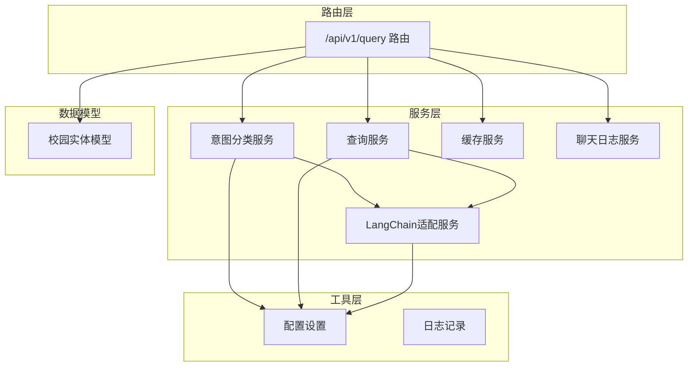
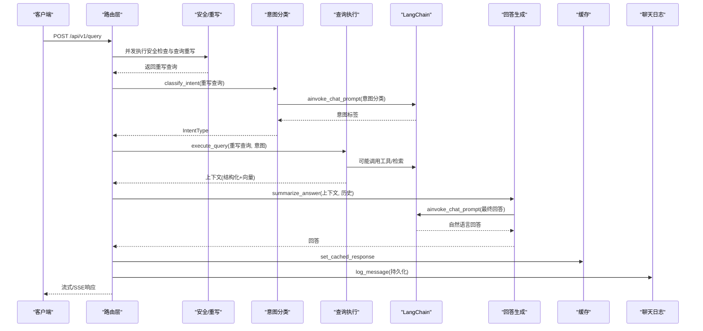
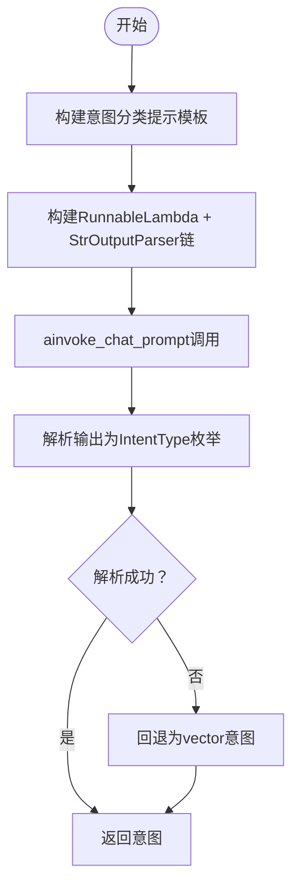
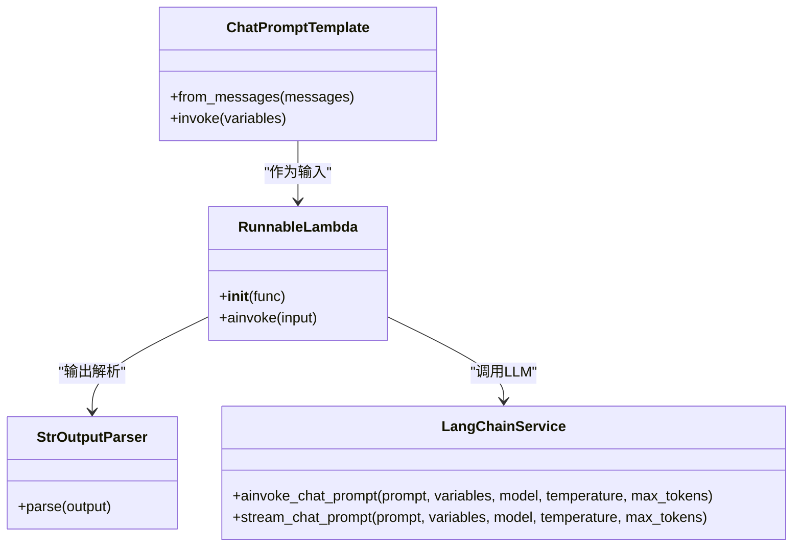
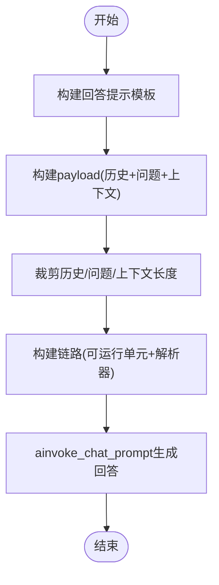
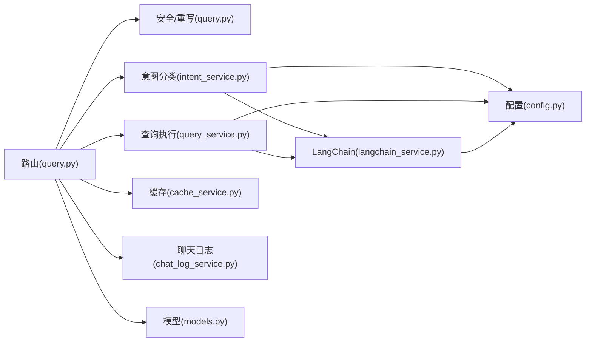

# 意图分类服务

<cite>
**本文档引用的文件**
- [intent_service.py](file://service/ai_assistant/app/services/intent_service.py)
- [langchain_service.py](file://service/ai_assistant/app/services/langchain_service.py)
- [query_service.py](file://service/ai_assistant/app/services/query_service.py)
- [query.py](file://service/ai_assistant/app/routers/query.py)
- [logger.py](file://service/ai_assistant/app/utils/logger.py)
- [query.py](file://service/ai_assistant/app/schemas/query.py)
- [models.py](file://service/ai_assistant/app/models/models.py)
- [config.py](file://service/ai_assistant/app/config.py)
- [cache_service.py](file://service/ai_assistant/app/services/cache_service.py)
- [chat_log_service.py](file://service/ai_assistant/app/services/chat_log_service.py)
</cite>

## 目录
1. [简介](#简介)
2. [项目结构](#项目结构)
3. [核心组件](#核心组件)
4. [架构总览](#架构总览)
5. [详细组件分析](#详细组件分析)
6. [依赖关系分析](#依赖关系分析)
7. [性能考虑](#性能考虑)
8. [故障排查指南](#故障排查指南)
9. [结论](#结论)
10. [附录](#附录)

## 简介
本文件面向AI校园助手项目的“意图分类服务”，系统性阐述以下能力：
- 四种意图类型（structured、vector、hybrid、smalltalk）的分类逻辑与判定边界
- 查询重写机制：如何结合历史对话上下文进行语义补全与信息补充
- LangChain链式调用模式：ChatPromptTemplate模板设计、RunnableLambda链构建、StrOutputParser输出解析器的使用
- 查询摘要生成服务：如何将结构化数据与非结构化信息转化为用户友好的自然语言回答
- 错误处理机制、性能优化策略、日志记录规范
- 具体的代码示例路径与使用场景

## 项目结构
本服务位于后端Python应用中，采用分层架构：
- 路由层：接收请求并协调各服务
- 服务层：意图分类、查询执行、LangChain适配、缓存、日志等
- 工具层：日志、配置、模型适配
- 数据模型：校园相关实体（课程、成绩、教师、班级等）

图表来源
- [query.py:198-745](file://service/ai_assistant/app/routers/query.py#L198-L745)
- [intent_service.py:218-346](file://service/ai_assistant/app/services/intent_service.py#L218-L346)
- [query_service.py:1-800](file://service/ai_assistant/app/services/query_service.py#L1-L800)
- [langchain_service.py:139-278](file://service/ai_assistant/app/services/langchain_service.py#L139-L278)
- [cache_service.py:92-177](file://service/ai_assistant/app/services/cache_service.py#L92-L177)
- [chat_log_service.py:14-76](file://service/ai_assistant/app/services/chat_log_service.py#L14-L76)
- [config.py:6-113](file://service/ai_assistant/app/config.py#L6-L113)
- [models.py:1-200](file://service/ai_assistant/app/models/models.py#L1-L200)

章节来源
- [query.py:1-788](file://service/ai_assistant/app/routers/query.py#L1-L788)
- [config.py:1-113](file://service/ai_assistant/app/config.py#L1-L113)

## 核心组件
- 意图分类服务：负责将用户查询映射到structured/vector/hybrid/smalltalk四类意图，并提供查询重写与最终回答生成能力
- LangChain适配服务：封装DashScope调用，提供非流式与流式调用、消息裁剪、会话构建等
- 查询服务：执行结构化SQL查询、知识库向量检索、混合查询与工具规划
- 缓存服务：基于Redis的查询结果缓存，支持敏感度与时间维度的失效策略
- 日志服务：统一日志配置与落盘
- 路由器：统一入口，串联多模态输入、安全检查、缓存、意图分类、查询执行、回答生成与持久化

章节来源
- [intent_service.py:1-346](file://service/ai_assistant/app/services/intent_service.py#L1-L346)
- [langchain_service.py:1-278](file://service/ai_assistant/app/services/langchain_service.py#L1-L278)
- [query_service.py:1-800](file://service/ai_assistant/app/services/query_service.py#L1-L800)
- [cache_service.py:1-177](file://service/ai_assistant/app/services/cache_service.py#L1-L177)
- [logger.py:1-53](file://service/ai_assistant/app/utils/logger.py#L1-L53)
- [query.py:1-788](file://service/ai_assistant/app/routers/query.py#L1-L788)

## 架构总览
整体工作流如下：
- 多模态输入预处理（文本/图像/音频）
- 并发执行安全检查与查询重写
- 基于重写查询进行意图分类
- 执行对应查询路径（结构化/向量/混合）
- 生成最终回答并持久化
- 缓存结果供后续请求复用

图表来源
- [query.py:207-745](file://service/ai_assistant/app/routers/query.py#L207-L745)
- [intent_service.py:218-346](file://service/ai_assistant/app/services/intent_service.py#L218-L346)
- [langchain_service.py:139-278](file://service/ai_assistant/app/services/langchain_service.py#L139-L278)
- [cache_service.py:149-177](file://service/ai_assistant/app/services/cache_service.py#L149-L177)
- [chat_log_service.py:14-56](file://service/ai_assistant/app/services/chat_log_service.py#L14-L56)

## 详细组件分析

### 意图分类与查询重写
- 意图分类：使用ChatPromptTemplate定义系统提示，限定输出为structured/vector/hybrid/smalltalk之一，通过RunnableLambda与StrOutputParser构建链路，温度设为0以稳定输出
- 查询重写：结合最近3轮历史，将用户最新问题重写为完整、独立的查询句，补充缺失的学期、课程、日期等信息
- 摘要生成：构建回答规范，将结构化数据与非结构化信息转化为自然语言，严格遵循校园场景的表达规范

图表来源
- [intent_service.py:218-249](file://service/ai_assistant/app/services/intent_service.py#L218-L249)

章节来源
- [intent_service.py:218-346](file://service/ai_assistant/app/services/intent_service.py#L218-L346)
- [query.py:495-500](file://service/ai_assistant/app/routers/query.py#L495-L500)

### LangChain链式调用模式
- ChatPromptTemplate：分别定义意图分类、查询重写、回答生成的系统提示与占位符
- RunnableLambda：将异步LLM调用包装为可组合的可运行单元
- StrOutputParser：将LLM输出解析为字符串
- 流式输出：通过stream_chat_prompt实现增量输出，适合SSE流式响应

图表来源
- [intent_service.py:23-231](file://service/ai_assistant/app/services/intent_service.py#L23-L231)
- [langchain_service.py:139-278](file://service/ai_assistant/app/services/langchain_service.py#L139-L278)

章节来源
- [intent_service.py:13-231](file://service/ai_assistant/app/services/intent_service.py#L13-L231)
- [langchain_service.py:139-278](file://service/ai_assistant/app/services/langchain_service.py#L139-L278)

### 查询摘要生成服务
- 上下文裁剪：对历史消息、问题、结构化上下文进行长度控制，避免超出模型输入上限
- 回答规范：针对课表、联系方式、停课等场景制定严格输出规范，确保答案准确、合规
- 流式与非流式：支持一次性生成与增量输出两种模式，满足不同前端需求

图表来源
- [intent_service.py:71-323](file://service/ai_assistant/app/services/intent_service.py#L71-L323)

章节来源
- [intent_service.py:71-323](file://service/ai_assistant/app/services/intent_service.py#L71-L323)

### 四种意图类型的分类逻辑
- structured（结构化查询）：仅可通过系统查询的明确结构化数据，如成绩、课表、选课、个人信息、学院专业列表、教师联系方式等
- vector（向量检索）：需要在知识库（文档、规定、指南等）中进行纯文字语义搜索的通用问题，如规章制度、流程、指南等
- hybrid（混合查询）：需要结合个人信息查询和知识库搜索的问题，如“我的必修课有哪些学分要求”
- smalltalk（闲聊）：不需要查询数据库或知识库的问题，如问候、感谢、情绪表达等

章节来源
- [intent_service.py:23-48](file://service/ai_assistant/app/services/intent_service.py#L23-L48)
- [query.py:49-58](file://service/ai_assistant/app/routers/query.py#L49-L58)

### 查询重写机制
- 历史融合：将最近3轮历史与用户最新问题合并，形成上下文完备的重写输入
- 信息补全：对缺失的学期、课程、日期等进行语义补全，确保后续检索/查询的准确性
- 截断与回退：对超长重写结果进行截断，并在异常时回退到原始查询

章节来源
- [intent_service.py:251-296](file://service/ai_assistant/app/services/intent_service.py#L251-L296)
- [query.py:347-474](file://service/ai_assistant/app/routers/query.py#L347-L474)

### 查询执行与意图修正
- 执行路径：根据意图类型选择结构化查询、向量检索或混合查询
- 意图修正：在执行完成后根据上下文是否包含结构化/向量内容，动态调整意图类型
- 图片直问：对纯图片问答场景强制走闲聊路径，避免触发检索

章节来源
- [query.py:529-573](file://service/ai_assistant/app/routers/query.py#L529-L573)
- [query_service.py:1-800](file://service/ai_assistant/app/services/query_service.py#L1-L800)

## 依赖关系分析
- 路由层依赖：安全检查、缓存、聊天日志、意图分类、查询服务
- 服务层依赖：LangChain适配、配置、日志
- 数据模型依赖：校园实体（课程、成绩、教师、班级等）

图表来源
- [query.py:1-788](file://service/ai_assistant/app/routers/query.py#L1-L788)
- [intent_service.py:1-346](file://service/ai_assistant/app/services/intent_service.py#L1-L346)
- [query_service.py:1-800](file://service/ai_assistant/app/services/query_service.py#L1-L800)
- [langchain_service.py:1-278](file://service/ai_assistant/app/services/langchain_service.py#L1-L278)
- [cache_service.py:1-177](file://service/ai_assistant/app/services/cache_service.py#L1-L177)
- [chat_log_service.py:1-76](file://service/ai_assistant/app/services/chat_log_service.py#L1-L76)
- [config.py:1-113](file://service/ai_assistant/app/config.py#L1-L113)
- [models.py:1-200](file://service/ai_assistant/app/models/models.py#L1-L200)

章节来源
- [query.py:1-788](file://service/ai_assistant/app/routers/query.py#L1-L788)
- [intent_service.py:1-346](file://service/ai_assistant/app/services/intent_service.py#L1-L346)
- [query_service.py:1-800](file://service/ai_assistant/app/services/query_service.py#L1-L800)
- [langchain_service.py:1-278](file://service/ai_assistant/app/services/langchain_service.py#L1-L278)
- [cache_service.py:1-177](file://service/ai_assistant/app/services/cache_service.py#L1-L177)
- [chat_log_service.py:1-76](file://service/ai_assistant/app/services/chat_log_service.py#L1-L76)
- [config.py:1-113](file://service/ai_assistant/app/config.py#L1-L113)
- [models.py:1-200](file://service/ai_assistant/app/models/models.py#L1-L200)

## 性能考虑
- 并发优化：安全检查与查询重写并行执行，缩短端到端延迟
- 缓存策略：基于查询文本哈希与DID的缓存键，区分敏感与普通查询，设置不同TTL；对课表相关查询引入版本号失效
- 输入裁剪：对历史、问题、上下文进行长度裁剪，避免超出模型输入上限
- 连接池与事务：在流式响应阶段及时回滚数据库连接，释放资源
- 模型选择：根据任务特性选择合适模型（意图分类/重写用轻量模型，最终回答用更强模型）

章节来源
- [query.py:347-474](file://service/ai_assistant/app/routers/query.py#L347-L474)
- [cache_service.py:85-177](file://service/ai_assistant/app/services/cache_service.py#L85-L177)
- [langchain_service.py:46-96](file://service/ai_assistant/app/services/langchain_service.py#L46-L96)
- [query.py:654-658](file://service/ai_assistant/app/routers/query.py#L654-L658)

## 故障排查指南
- 意图分类失败：当分类链路异常时，回退为vector意图并记录警告日志
- LLM调用失败：DashScope调用返回非200状态时抛出异常并记录错误日志
- 缓存异常：缓存解析失败或过期策略触发时，删除键并继续执行
- 安全拦截：检测到危险内容或隐私违规时，返回预设干预信息并记录日志
- 流式输出：SSE生成器异常时返回可读的公共错误信息

章节来源
- [intent_service.py:233-248](file://service/ai_assistant/app/services/intent_service.py#L233-L248)
- [langchain_service.py:189-203](file://service/ai_assistant/app/services/langchain_service.py#L189-L203)
- [cache_service.py:102-112](file://service/ai_assistant/app/services/cache_service.py#L102-L112)
- [query.py:415-471](file://service/ai_assistant/app/routers/query.py#L415-L471)
- [query.py:740-744](file://service/ai_assistant/app/routers/query.py#L740-L744)

## 结论
本意图分类服务通过明确的四类意图划分、完善的查询重写与摘要生成机制、以及LangChain链式调用模式，实现了从多模态输入到自然语言回答的高效闭环。配合缓存与日志体系，系统在准确性、稳定性与性能方面均具备良好表现。建议在后续迭代中持续优化提示模板与裁剪策略，进一步提升复杂场景下的鲁棒性。

## 附录
- 使用场景示例（路径指引）
  - 意图分类：[classify_intent:218-249](file://service/ai_assistant/app/services/intent_service.py#L218-L249)
  - 查询重写：[rewrite_query_with_context:251-296](file://service/ai_assistant/app/services/intent_service.py#L251-L296)
  - 回答生成（非流式）：[summarize_answer:298-323](file://service/ai_assistant/app/services/intent_service.py#L298-L323)
  - 回答生成（流式）：[summarize_answer_stream:326-346](file://service/ai_assistant/app/services/intent_service.py#L326-L346)
  - LangChain调用（非流式）：[ainvoke_chat_prompt:139-203](file://service/ai_assistant/app/services/langchain_service.py#L139-L203)
  - LangChain调用（流式）：[stream_chat_prompt:206-278](file://service/ai_assistant/app/services/langchain_service.py#L206-L278)
  - 路由入口与流程：[/api/v1/query:198-745](file://service/ai_assistant/app/routers/query.py#L198-L745)
  - 缓存读写：[get_cached_response:92-147](file://service/ai_assistant/app/services/cache_service.py#L92-L147)、[set_cached_response:149-177](file://service/ai_assistant/app/services/cache_service.py#L149-L177)
  - 聊天日志：[log_message:14-56](file://service/ai_assistant/app/services/chat_log_service.py#L14-L56)