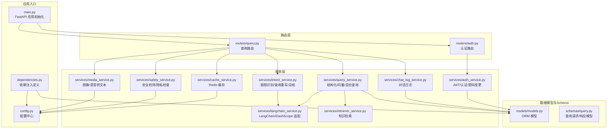
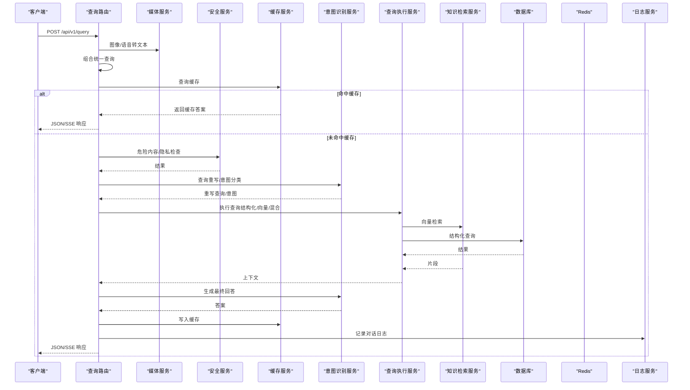
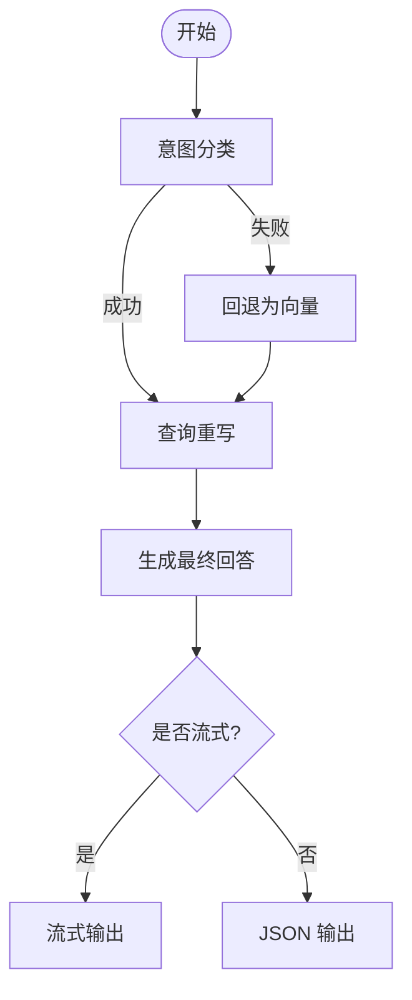
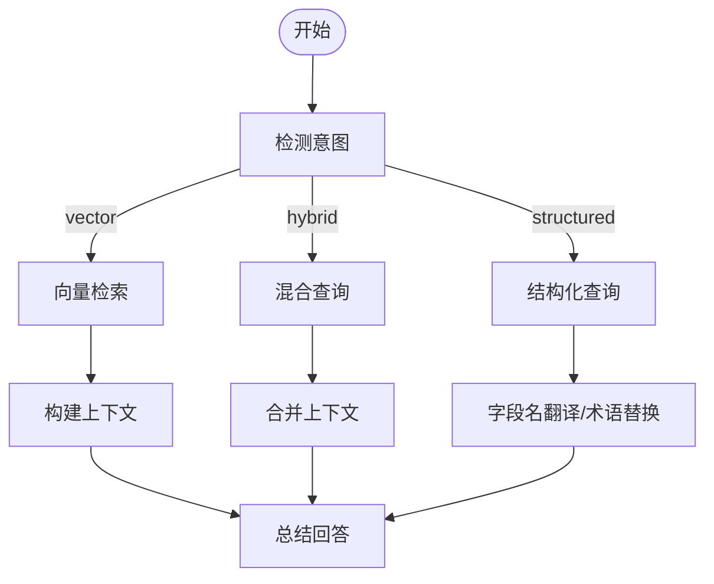
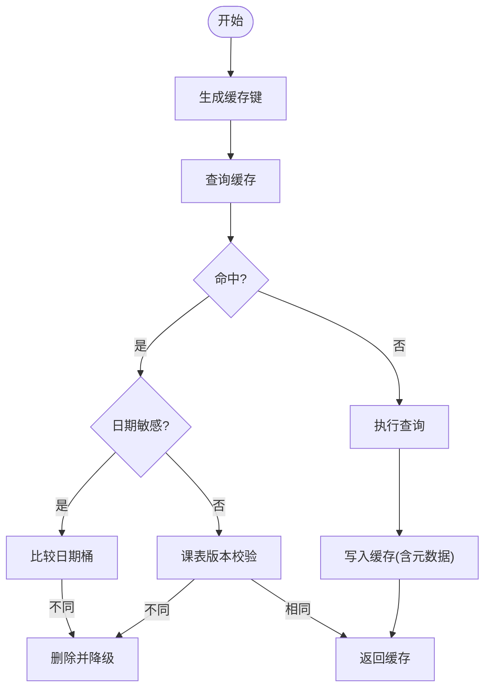
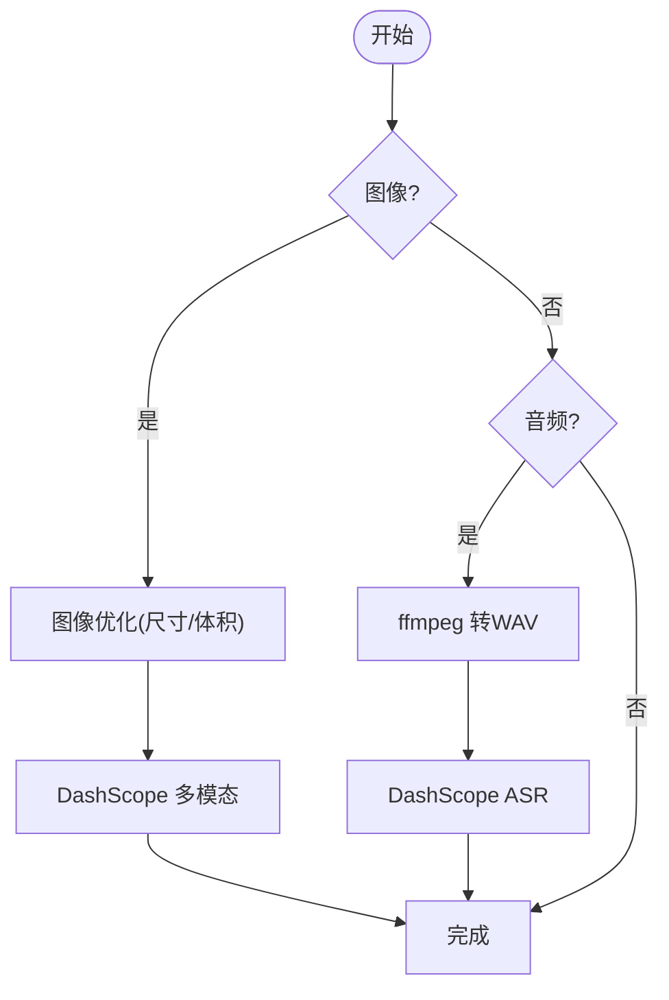
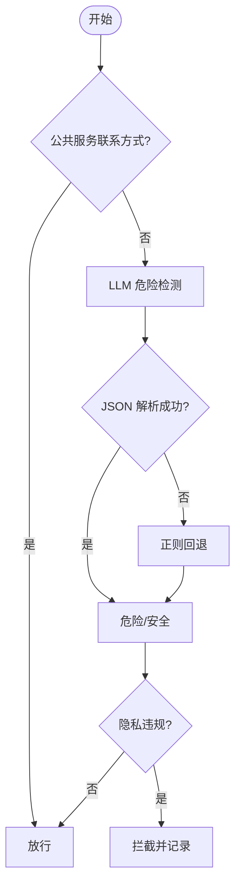
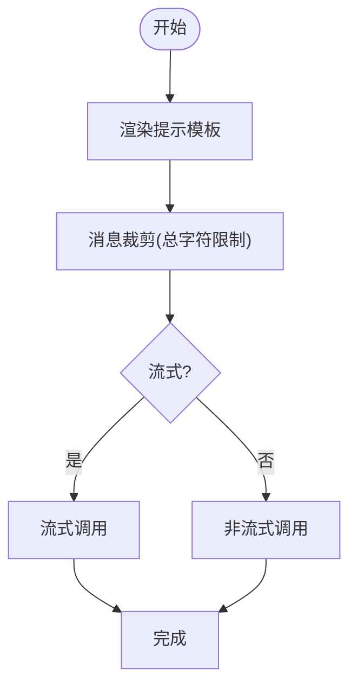
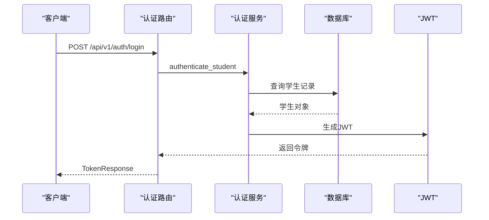
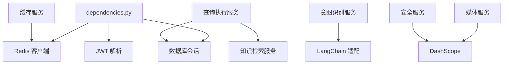

# 服务层架构

<cite>
**本文档引用的文件**
- [main.py](file://service/ai_assistant/app/main.py)
- [dependencies.py](file://service/ai_assistant/app/dependencies.py)
- [config.py](file://service/ai_assistant/app/config.py)
- [models.py](file://service/ai_assistant/app/models/models.py)
- [schemas/query.py](file://service/ai_assistant/app/schemas/query.py)
- [routers/query.py](file://service/ai_assistant/app/routers/query.py)
- [routers/auth.py](file://service/ai_assistant/app/routers/auth.py)
- [services/intent_service.py](file://service/ai_assistant/app/services/intent_service.py)
- [services/query_service.py](file://service/ai_assistant/app/services/query_service.py)
- [services/cache_service.py](file://service/ai_assistant/app/services/cache_service.py)
- [services/media_service.py](file://service/ai_assistant/app/services/media_service.py)
- [services/safety_service.py](file://service/ai_assistant/app/services/safety_service.py)
- [services/langchain_service.py](file://service/ai_assistant/app/services/langchain_service.py)
- [services/auth_service.py](file://service/ai_assistant/app/services/auth_service.py)
- [services/chat_log_service.py](file://service/ai_assistant/app/services/chat_log_service.py)
- [services/retriever_service.py](file://service/ai_assistant/app/services/retriever_service.py)
</cite>

## 目录
1. [简介](#简介)
2. [项目结构](#项目结构)
3. [核心组件](#核心组件)
4. [架构总览](#架构总览)
5. [详细组件分析](#详细组件分析)
6. [依赖分析](#依赖分析)
7. [性能考虑](#性能考虑)
8. [故障排查指南](#故障排查指南)
9. [结论](#结论)
10. [附录](#附录)

## 简介
本项目为“AI校园助手”的后端服务层，采用分层架构设计，围绕服务层（Services）为核心，整合意图识别、查询执行、缓存、媒体处理、安全、LangChain集成、认证与日志等功能模块。服务层通过依赖注入（FastAPI Depends）实现松耦合，支持异步调用与流式输出，具备完善的错误传播与降级策略，满足校园场景下的多模态问答、隐私保护与性能监控需求。

## 项目结构
服务层位于 service/ai_assistant/app/services 目录，配合 routers、schemas、models、config、dependencies 等模块共同构成完整的后端应用。路由层负责请求接入与参数校验，服务层封装业务逻辑与外部集成，依赖注入提供数据库、Redis、认证等基础设施。

**图表来源**
- [main.py:1-86](file://service/ai_assistant/app/main.py#L1-L86)
- [dependencies.py:1-109](file://service/ai_assistant/app/dependencies.py#L1-L109)
- [config.py:1-113](file://service/ai_assistant/app/config.py#L1-L113)
- [routers/auth.py:1-102](file://service/ai_assistant/app/routers/auth.py#L1-L102)
- [routers/query.py:1-788](file://service/ai_assistant/app/routers/query.py#L1-L788)
- [services/intent_service.py:1-346](file://service/ai_assistant/app/services/intent_service.py#L1-L346)
- [services/query_service.py:1-800](file://service/ai_assistant/app/services/query_service.py#L1-L800)
- [services/cache_service.py:1-177](file://service/ai_assistant/app/services/cache_service.py#L1-L177)
- [services/media_service.py:1-246](file://service/ai_assistant/app/services/media_service.py#L1-L246)
- [services/safety_service.py:1-163](file://service/ai_assistant/app/services/safety_service.py#L1-L163)
- [services/langchain_service.py:1-278](file://service/ai_assistant/app/services/langchain_service.py#L1-L278)
- [services/auth_service.py:1-253](file://service/ai_assistant/app/services/auth_service.py#L1-L253)
- [services/chat_log_service.py:1-76](file://service/ai_assistant/app/services/chat_log_service.py#L1-L76)
- [services/retriever_service.py:1-168](file://service/ai_assistant/app/services/retriever_service.py#L1-L168)
- [models/models.py:1-200](file://service/ai_assistant/app/models/models.py#L1-L200)
- [schemas/query.py:1-33](file://service/ai_assistant/app/schemas/query.py#L1-L33)

**章节来源**
- [main.py:1-86](file://service/ai_assistant/app/main.py#L1-L86)
- [dependencies.py:1-109](file://service/ai_assistant/app/dependencies.py#L1-L109)
- [config.py:1-113](file://service/ai_assistant/app/config.py#L1-L113)

## 核心组件
- 意图识别服务：负责意图分类（结构化/向量/混合/闲聊）、查询重写、最终回答生成与流式输出。
- 查询执行服务：封装结构化SQL查询、知识库向量检索、混合查询与结果融合，提供学期/周次等上下文增强。
- 缓存服务：基于Redis的键空间隔离缓存，支持敏感度与时间敏感策略，版本化失效。
- 媒体服务：图像理解（多模态）与语音识别（ASR），支持图像尺寸/体积优化与音频格式转换。
- 安全服务：危险内容检测（LLM + 正则回退）、隐私违规检查（禁止查询他人学号）。
- LangChain集成服务：统一提示模板渲染、消息裁剪、DashScope调用与流式输出适配。
- 认证服务：JWT签发/验证、管理员认证、密码变更与校验。
- 日志服务：对话日志持久化，支持脱敏与危险标记。
- 知识检索服务：阿里云百炼检索API封装，支持重排与最小片段长度过滤。

**章节来源**
- [services/intent_service.py:1-346](file://service/ai_assistant/app/services/intent_service.py#L1-L346)
- [services/query_service.py:1-800](file://service/ai_assistant/app/services/query_service.py#L1-L800)
- [services/cache_service.py:1-177](file://service/ai_assistant/app/services/cache_service.py#L1-L177)
- [services/media_service.py:1-246](file://service/ai_assistant/app/services/media_service.py#L1-L246)
- [services/safety_service.py:1-163](file://service/ai_assistant/app/services/safety_service.py#L1-L163)
- [services/langchain_service.py:1-278](file://service/ai_assistant/app/services/langchain_service.py#L1-L278)
- [services/auth_service.py:1-253](file://service/ai_assistant/app/services/auth_service.py#L1-L253)
- [services/chat_log_service.py:1-76](file://service/ai_assistant/app/services/chat_log_service.py#L1-L76)
- [services/retriever_service.py:1-168](file://service/ai_assistant/app/services/retriever_service.py#L1-L168)

## 架构总览
服务层采用“路由驱动、服务编排”的模式，路由层负责鉴权、参数校验与并发控制，服务层负责业务编排与外部集成。LangChain与DashScope抽象统一，便于替换与扩展。缓存与日志贯穿查询链路，保障性能与可追溯性。

**图表来源**
- [routers/query.py:198-745](file://service/ai_assistant/app/routers/query.py#L198-L745)
- [services/media_service.py:115-246](file://service/ai_assistant/app/services/media_service.py#L115-L246)
- [services/safety_service.py:84-163](file://service/ai_assistant/app/services/safety_service.py#L84-L163)
- [services/cache_service.py:92-177](file://service/ai_assistant/app/services/cache_service.py#L92-L177)
- [services/intent_service.py:218-346](file://service/ai_assistant/app/services/intent_service.py#L218-L346)
- [services/query_service.py:534-567](file://service/ai_assistant/app/services/query_service.py#L534-L567)
- [services/retriever_service.py:46-135](file://service/ai_assistant/app/services/retriever_service.py#L46-L135)
- [services/chat_log_service.py:14-76](file://service/ai_assistant/app/services/chat_log_service.py#L14-L76)

## 详细组件分析

### 意图识别服务
- 职责：意图分类（structured/vector/hybrid/smalltalk）、查询重写（结合历史上下文）、最终回答生成与流式输出。
- 关键能力：
  - 分类提示模板与链式调用，温度与最大token控制。
  - 查询重写提示模板，限制历史轮数与长度。
  - 总结提示模板，包含严格的回答规范与术语转换。
  - 流式输出与非流式输出双通道，统一LangChain/DashScope调用。
- 错误传播：分类失败回退为向量；重写失败回退原查询；总结异常向上抛出。

**图表来源**
- [services/intent_service.py:218-346](file://service/ai_assistant/app/services/intent_service.py#L218-L346)

**章节来源**
- [services/intent_service.py:1-346](file://service/ai_assistant/app/services/intent_service.py#L1-L346)

### 查询执行服务
- 职责：根据意图执行结构化SQL、向量检索或混合查询，提供学期/周次上下文与字段名翻译。
- 关键能力：
  - 结构化查询工具规划（LangChain工具计划器提示），支持多工具组合。
  - 百炼检索器封装，支持重排与最小片段长度过滤。
  - 学期解析与周次推断，生成计算周次信息。
  - 字段名映射与术语替换，输出面向用户的自然语言。
- 错误传播：检索异常返回“未在知识库中找到相关信息”，结构化查询异常向上抛出。

**图表来源**
- [services/query_service.py:150-210](file://service/ai_assistant/app/services/query_service.py#L150-L210)
- [services/query_service.py:212-238](file://service/ai_assistant/app/services/query_service.py#L212-L238)
- [services/query_service.py:387-435](file://service/ai_assistant/app/services/query_service.py#L387-L435)
- [services/query_service.py:575-750](file://service/ai_assistant/app/services/query_service.py#L575-L750)
- [services/retriever_service.py:46-135](file://service/ai_assistant/app/services/retriever_service.py#L46-L135)

**章节来源**
- [services/query_service.py:1-800](file://service/ai_assistant/app/services/query_service.py#L1-L800)
- [services/retriever_service.py:1-168](file://service/ai_assistant/app/services/retriever_service.py#L1-L168)

### 缓存服务
- 职责：基于Redis的键空间隔离缓存，支持敏感度与时间敏感策略，版本化失效。
- 关键能力：
  - 缓存键格式：chat_cache:{version}:{did}:{query_hash}。
  - 敏感度策略：隐私/相对日期/课表相关分别设置TTL。
  - 时间敏感：按当日日期桶校验，跨天失效。
  - 课表版本：管理员改课后递增版本号，强制失效。
- 错误传播：解析失败或类型异常自动删除键并降级。

**图表来源**
- [services/cache_service.py:49-177](file://service/ai_assistant/app/services/cache_service.py#L49-L177)

**章节来源**
- [services/cache_service.py:1-177](file://service/ai_assistant/app/services/cache_service.py#L1-L177)

### 媒体服务
- 职责：图像理解与语音识别，支持图像尺寸/体积优化与音频格式转换。
- 关键能力：
  - 图像：JPEG压缩、尺寸缩放、DashScope多模态API调用。
  - 语音：ffmpeg转WAV（16kHz/单声道），DashScope ASR调用。
  - 错误处理：API状态码校验、静音/无内容兜底。
- 错误传播：运行时错误包装为RuntimeError并向上抛出。

**图表来源**
- [services/media_service.py:23-157](file://service/ai_assistant/app/services/media_service.py#L23-L157)
- [services/media_service.py:159-246](file://service/ai_assistant/app/services/media_service.py#L159-L246)

**章节来源**
- [services/media_service.py:1-246](file://service/ai_assistant/app/services/media_service.py#L1-L246)

### 安全服务
- 职责：危险内容检测（自杀/自残/暴力）、隐私违规检查（禁止查询他人学号）。
- 关键能力：
  - LLM检测（JSON输出解析），失败回退正则。
  - 公共服务联系方式放行逻辑。
  - 学号隐私匹配与违规拦截。
- 错误传播：LLM调用异常回退正则，确保安全基线。

**图表来源**
- [services/safety_service.py:84-163](file://service/ai_assistant/app/services/safety_service.py#L84-L163)

**章节来源**
- [services/safety_service.py:1-163](file://service/ai_assistant/app/services/safety_service.py#L1-L163)

### LangChain集成服务
- 职责：统一提示模板渲染、消息裁剪、DashScope调用与流式输出。
- 关键能力：
  - 消息裁剪策略：优先丢弃旧历史，再裁剪最后一条。
  - 非流式与流式两种调用路径，统一错误处理。
  - 会话代理配置，避免代理干扰。
- 错误传播：状态码非200抛出运行时错误。

**图表来源**
- [services/langchain_service.py:128-204](file://service/ai_assistant/app/services/langchain_service.py#L128-L204)
- [services/langchain_service.py:206-278](file://service/ai_assistant/app/services/langchain_service.py#L206-L278)

**章节来源**
- [services/langchain_service.py:1-278](file://service/ai_assistant/app/services/langchain_service.py#L1-L278)

### 认证与日志服务
- 认证服务：JWT签发/验证、管理员认证、密码变更与校验。
- 日志服务：对话日志持久化，支持脱敏与危险标记，会话历史隔离。

**图表来源**
- [routers/auth.py:24-53](file://service/ai_assistant/app/routers/auth.py#L24-L53)
- [services/auth_service.py:125-170](file://service/ai_assistant/app/services/auth_service.py#L125-L170)

**章节来源**
- [services/auth_service.py:1-253](file://service/ai_assistant/app/services/auth_service.py#L1-L253)
- [services/chat_log_service.py:1-76](file://service/ai_assistant/app/services/chat_log_service.py#L1-L76)

## 依赖分析
- 依赖注入：数据库会话、Redis客户端、当前用户/管理员解析通过Depends注入，统一生命周期管理。
- 外部依赖：DashScope、阿里云百炼、Redis、MySQL。
- 耦合与内聚：服务层内聚业务逻辑，通过抽象接口（LangChain适配、检索器封装）降低对外部库耦合。

**图表来源**
- [dependencies.py:27-109](file://service/ai_assistant/app/dependencies.py#L27-L109)
- [services/langchain_service.py:1-278](file://service/ai_assistant/app/services/langchain_service.py#L1-L278)
- [services/retriever_service.py:1-168](file://service/ai_assistant/app/services/retriever_service.py#L1-L168)
- [services/cache_service.py:1-177](file://service/ai_assistant/app/services/cache_service.py#L1-L177)
- [services/media_service.py:1-246](file://service/ai_assistant/app/services/media_service.py#L1-L246)
- [services/safety_service.py:1-163](file://service/ai_assistant/app/services/safety_service.py#L1-L163)

**章节来源**
- [dependencies.py:1-109](file://service/ai_assistant/app/dependencies.py#L1-L109)

## 性能考虑
- 异步与并发：路由层并发执行安全检查、查询重写与历史加载，显著缩短端到端延迟。
- 缓存策略：针对敏感/普通/时间敏感/课表相关查询设置差异化TTL，降低重复计算成本。
- 流式输出：SSE流式输出避免长时间占用数据库连接，提升吞吐。
- 消息裁剪：LangChain适配器对提示消息进行裁剪，避免超出模型输入上限。
- 会话隔离：Redis会话历史按did+session_id隔离，避免并发会话串话。

[本节为通用性能讨论，无需具体文件分析]

## 故障排查指南
- LLM调用失败：LangChain适配器统一捕获非200状态码并抛出运行时错误，检查API Key与模型配置。
- 缓存异常：缓存解析失败自动删除键并降级，检查Redis连通性与键空间权限。
- 媒体处理失败：图像/语音转换异常包装为RuntimeError，检查ffmpeg与DashScope服务状态。
- 安全检测异常：LLM调用失败回退正则，确保安全基线；检查API Key与模型可用性。
- 查询执行异常：结构化查询异常向上抛出，检查数据库连接与SQL权限；向量检索异常返回通用提示。

**章节来源**
- [services/langchain_service.py:189-203](file://service/ai_assistant/app/services/langchain_service.py#L189-L203)
- [services/cache_service.py:102-112](file://service/ai_assistant/app/services/cache_service.py#L102-L112)
- [services/media_service.py:148-156](file://service/ai_assistant/app/services/media_service.py#L148-L156)
- [services/safety_service.py:134-144](file://service/ai_assistant/app/services/safety_service.py#L134-L144)
- [services/query_service.py:544-549](file://service/ai_assistant/app/services/query_service.py#L544-L549)

## 结论
服务层通过清晰的职责划分与依赖注入，实现了意图识别、查询执行、缓存、媒体处理、安全与LangChain集成的高效协同。异步并发与流式输出提升了用户体验，缓存与日志保障了性能与可追溯性。建议在生产环境完善监控指标与告警策略，持续优化提示模板与检索策略，以应对复杂校园场景的多样化需求。

[本节为总结性内容，无需具体文件分析]

## 附录
- 设计原则
  - 单一职责：每个服务专注一个领域，避免交叉耦合。
  - 开闭原则：通过抽象接口（LangChain适配、检索器封装）支持替换与扩展。
  - 依赖倒置：高层模块依赖抽象，降低对具体实现的耦合。
  - 错误就近处理：在服务层捕获并转换为统一异常，向上游传播。
- 扩展指导
  - 新增服务：遵循现有命名与目录约定，通过依赖注入接入路由层。
  - 外部集成：统一通过适配器封装（LangChain/DashScope/百炼），保持接口稳定。
  - 测试策略：为服务层编写单元测试与集成测试，利用Mock模拟外部依赖。
  - 性能监控：在关键路径埋点（缓存命中率、LLM调用耗时、流式输出速率），结合日志与指标系统。

[本节为通用指导内容，无需具体文件分析]